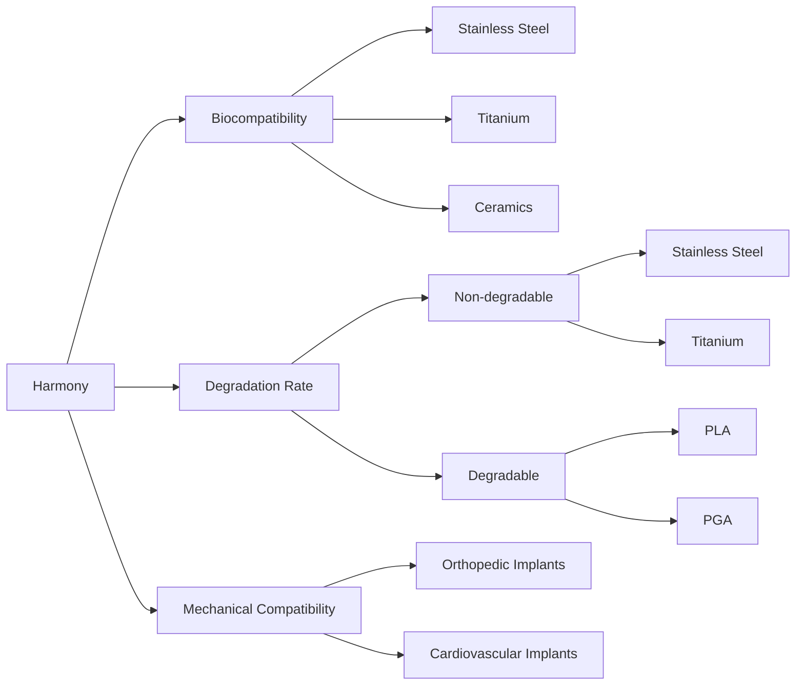

## 3.1. Harmony

### Definition and Importance
**Harmony** in biomedical engineering refers to the compatibility and effectiveness of a biomaterial or implant in the body. It involves ensuring that the material integrates well with the body's tissues and functions without causing adverse reactions.

**Importance of Harmony**:
- **Biocompatibility**: Ensures the biomaterial or implant does not cause an immune response or other harmful reactions.
- **Mechanical Compatibility**: Ensures the material has mechanical properties similar to the tissues it replaces or interfaces with.
- **Functional Compatibility**: Ensures the material performs the intended function effectively.

### Factors Influencing Harmony
- **Surface Chemistry**: The chemical composition of the material's surface influences its interaction with the body.
- **Surface Topography**: The surface texture of the material can affect cell adhesion and tissue growth.
- **Degradation Rate**: The rate at which the material degrades is crucial for the healing process and integration with the body.

### Example
> **Example:** 
Consider a titanium implant used in orthopedic surgery. Titanium is chosen for its high biocompatibility and mechanical compatibility with bone tissues. The surface of the implant is treated to create a porous structure, which enhances the bone's ability to grow into the implant, ensuring mechanical compatibility. The degradation rate of titanium is slow, allowing the bone to integrate naturally over time.

### Classification of Biomaterials Based on Harmony
- **Biocompatible Materials**: These materials do not cause any harmful reactions in the body. Examples include stainless steel, titanium, and some ceramics.
- **Biostable Materials**: These materials are used where the implant does not need to degrade, such as in orthopedic implants. Examples include stainless steel and certain ceramics.
- **Biodegradable Materials**: These materials are designed to degrade over time, often used in temporary implants. Examples include polylactic acid (PLA) and polyglycolic acid (PGA).

### Mermaid Diagram: Classification of Biomaterials Based on Harmony

This diagram helps visualize the classification of biomaterials based on their key attributes related to harmony.

### Conclusion
Understanding and selecting appropriate bio-materials and implants based on harmony is crucial for successful biomedical applications. By considering factors such as surface chemistry, surface topography, and degradation rate, engineers can ensure that the biomaterials and implants are compatible and effective in the body.