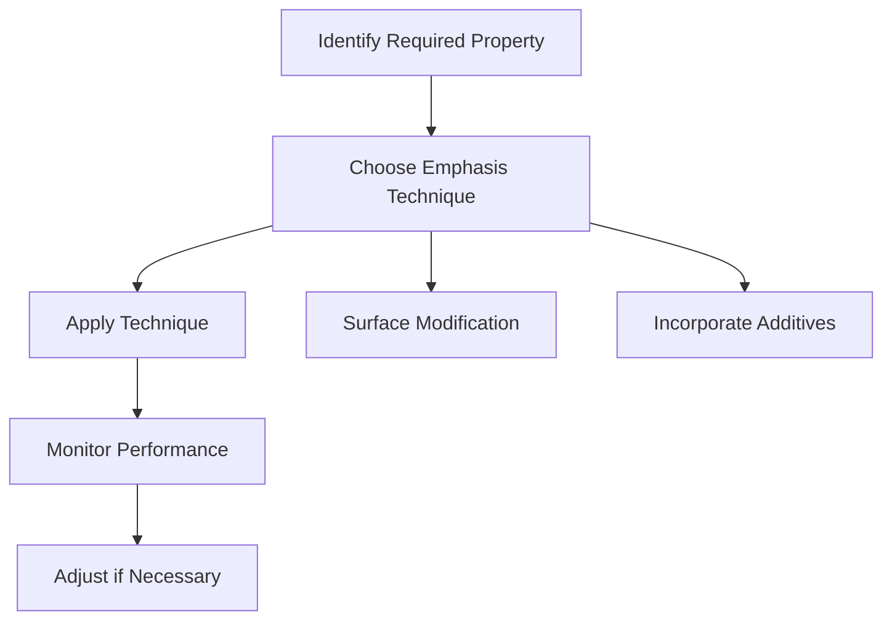

## 3.3. Emphasis

### Definition of Emphasis
**Emphasis** refers to the increased importance or significance given to a particular biomaterial or implant in a specific application. This is typically done to enhance the performance, durability, or biocompatibility of the biomaterial. Emphasis can be applied through various techniques such as surface modification, chemical treatment, or the incorporation of specific additives.

### Importance of Emphasis in Biomaterials
Emphasizing certain properties of biomaterials is crucial for their successful use in medical applications. For example, if a biomaterial needs to have improved biocompatibility, surface modification techniques can be used to achieve this. Similarly, if the mechanical strength of a material needs to be enhanced, specific additives can be introduced.

> **Example:** Suppose a biomedical engineer needs to design a biomaterial for a load-bearing application like a hip replacement. The biomaterial must have high mechanical strength and good biocompatibility. The engineer decides to emphasize the mechanical strength by incorporating titanium nanoparticles into the polymer matrix. This increases the mechanical strength of the material without compromising its biocompatibility.

### Techniques for Emphasizing Biomaterial Properties

#### Surface Modification
Surface modification techniques are commonly used to emphasize certain properties of biomaterials. These techniques can include plasma treatment, chemical etching, or coating with bioactive substances.

- **Plasma Treatment:** This process involves exposing the biomaterial to a plasma environment, which can alter its surface properties, improving its adhesion and cell interaction.
- **Chemical Etching:** This technique involves using chemical solutions to remove a layer of the biomaterial, thereby changing its surface characteristics and enhancing its biocompatibility.
- **Coating:** Coating the surface with bioactive molecules can improve the interaction between the biomaterial and the body, making it more biocompatible.

> **Example:** To emphasize the biocompatibility of a titanium implant, a biomedical engineer might use plasma treatment to modify the surface. The plasma treatment can increase the surface area and introduce hydrophilic functional groups, enhancing the implant's interaction with the surrounding tissue.

#### Incorporation of Additives
Additives can be incorporated into the biomaterial to enhance specific properties. Common additives include metals, ceramics, or bioactive glass.

- **Metals:** Metals like titanium, stainless steel, and cobalt-chromium alloys can be added to enhance the mechanical properties of the biomaterial.
- **Ceramics:** Ceramic particles can be added to improve the mechanical strength and biocompatibility.
- **Bioactive Glass:** Bioactive glass can be incorporated to enhance biocompatibility and promote new bone growth.

> **Example:** For an orthopedic implant, a biomedical engineer might incorporate bioactive glass particles to enhance its biocompatibility and promote bone ingrowth. This can be achieved by mixing the bioactive glass with the polymer matrix during the manufacturing process.

### Flowchart for Emphasizing Biomaterial Properties

### Conclusion
Emphasizing the properties of biomaterials is a critical step in ensuring their successful use in biomedical applications. By understanding the techniques and methods of emphasis, biomedical engineers can design and select appropriate biomaterials and implants that meet the specific requirements of their applications.

> **Example:** A biomedical engineer needs to design a dental implant that needs to be both strong and biocompatible. To emphasize strength, the engineer decides to use titanium nanoparticles, and to emphasize biocompatibility, plasma treatment is applied to the surface. This combination ensures the implant meets the necessary criteria for dental applications.