# Chapter 2: Professionalism in Biomedical Engineering

## 2.2.1. Correct Posture

### Definition and Importance
**Correct posture** refers to the proper alignment of the body while standing, sitting, or performing daily activities. It is essential for maintaining physical health, preventing injuries, and enhancing overall comfort and efficiency. Poor posture can lead to back pain, muscle strain, and long-term health issues.

### Common Posture Problems
- **Slouching**: Leaning forward with rounded shoulders and a protruding stomach.
- **Hyperlordosis**: Excessive curvature of the lower back.
- **Kyphosis**: Excessive curvature of the upper back.

### Benefits of Good Posture
- **Reduced Strain on Muscles and Joints**: Proper alignment distributes weight evenly, reducing the risk of strain.
- **Improved Breathing**: Good posture allows for better lung expansion and breathing.
- **Enhanced Confidence and Appearance**: Upright posture projects confidence and improves appearance.

### Practical Examples
> **Example:** A person who maintains good posture while standing or sitting can reduce the risk of developing lower back pain by 40%. This is because the body is aligned, distributing weight evenly and reducing stress on the spine.

### Correct Posture Techniques
1. **Head and Neck**: Keep the head upright, looking straight ahead. Avoid tilting the head forward or backward.
2. **Shoulders**: Relax the shoulders and keep them back. Avoid hunching or shrugging.
3. **Spine**: Maintain a straight spine, with the weight evenly distributed.
4. **Pelvis**: Keep the pelvis level and avoid tilting it forward or backward.

### Mermaid Diagram: Correct Posture Alignment
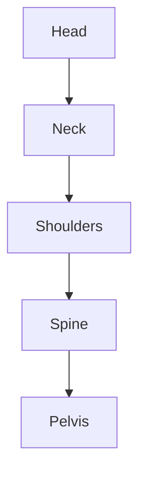

## 2.2.2. Hand Control

### Definition
**Hand control** involves the proper use and movement of hands while performing tasks. It is crucial for precise and efficient handling of objects, tools, and materials.

### Importance of Hand Control
- **Precision and Accuracy**: Hand control allows for accurate and detailed work.
- **Safety**: Proper hand control reduces the risk of accidents and injuries.
- **Comfort**: Effective hand control minimizes strain and fatigue.

### Common Hand Control Issues
- **Tremors**: Uncontrolled shaking of the hands.
- **Improper Grip**: Holding objects too tightly or too loosely.
- **Lack of Coordination**: Inability to move hands smoothly and in sync.

### Practical Examples
> **Example:** A surgeon performing an operation requires excellent hand control to manipulate instruments precisely. Improper hand control can lead to errors, potentially harming the patient.

### Techniques for Improving Hand Control
1. **Grip Strength**: Use appropriate grip strength for different tasks.
2. **Smooth Movements**: Practice smooth and controlled hand movements.
3. **Precision Tasks**: Focus on detailed and precise tasks to enhance control.

### Mermaid Diagram: Hand Control Techniques
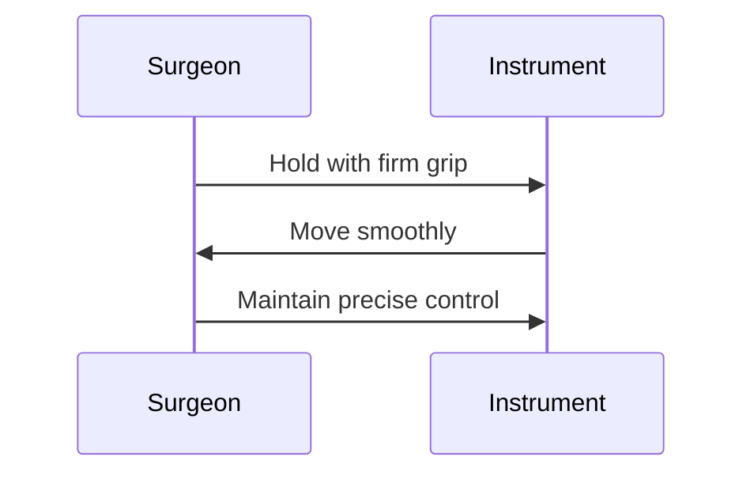

## 2.2.3. Graceful Walk

### Definition
**Graceful walk** involves walking in a manner that is smooth, controlled, and aesthetically pleasing. It reflects confidence and poise.

### Importance of Graceful Walk
- **Confidence**: A graceful walk projects confidence and assurance.
- **Comfort**: Proper walking posture reduces strain on the body.
- **Professionalism**: A graceful walk is often perceived as a sign of professionalism.

### Common Issues
- **Uneven Steps**: Steps of unequal length or speed.
- **Rushing**: Walking too quickly or hasty movements.
- **Poor Balance**: Inability to maintain steady and balanced steps.

### Practical Examples
> **Example:** A healthcare professional walking into a patient's room should do so with a graceful walk. This not only projects confidence but also shows respect for the patient and the environment.

### Techniques for Graceful Walking
1. **Step Length**: Keep steps consistent and even.
2. **Speed**: Maintain a steady and moderate pace.
3. **Balance**: Keep the body straight and centered.

### Mermaid Diagram: Graceful Walk
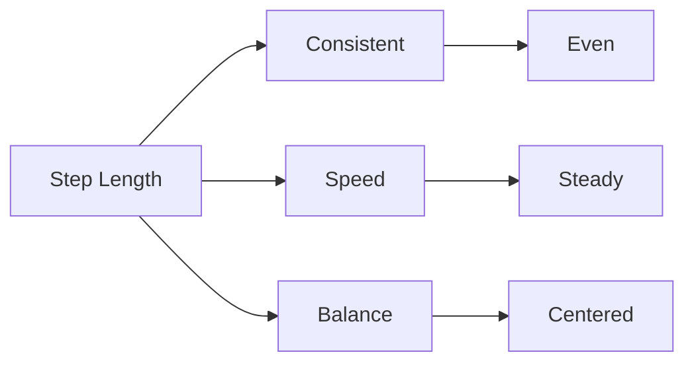

## 2.2.4. Pausing and Standing

### Definition and Importance
**Pausing and standing** involves the ability to stand still and pause in a manner that is calm and composed. It is essential for maintaining poise and professionalism in various situations.

### Importance of Pausing and Standing
- **Composure**: Pausing allows for a calm and collected demeanor.
- **Attention**: Pausing can help in focusing and retaining attention.
- **Respect**: Proper standing posture shows respect and professionalism.

### Common Issues
- **Restlessness**: Inability to stand still for long periods.
- **Poor Posture**: Leaning or shifting weight awkwardly.
- **Unnecessary Movements**: Excessively fidgeting or shifting.

### Practical Examples
> **Example:** When waiting to meet a patient or client, a healthcare professional should stand with proper posture and avoid unnecessary movements. This shows respect and professionalism.

### Techniques for Pausing and Standing
1. **Posture**: Maintain a straight and upright posture.
2. **Weight Distribution**: Distribute weight evenly on both feet.
3. **Relaxation**: Keep muscles relaxed and avoid tension.

### Mermaid Diagram: Pausing and Standing
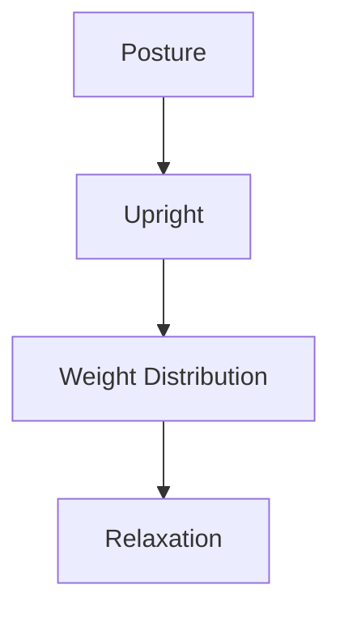

## 2.2.5. Graceful Turn

### Definition
**Graceful turn** involves the ability to turn the body in a smooth and controlled manner. It is essential for maintaining balance and poise during movement.

### Importance of Graceful Turns
- **Balance**: Proper turning prevents loss of balance and falls.
- **Control**: Smooth and controlled turns ensure smooth movement.
- **Aesthetics**: Graceful turns are visually pleasing and project confidence.

### Common Issues
- **Rapid Movements**: Quick and jerky turns.
- **Loss of Balance**: Inability to maintain balance during turns.
- **Uneven Steps**: Unequal steps during turns.

### Practical Examples
> **Example:** A nurse turning to face a patient should do so smoothly and with control. This not only ensures safety but also projects a professional and calm demeanor.

### Techniques for Graceful Turns
1. **Step Length**: Ensure steps are even and controlled.
2. **Body Alignment**: Maintain body alignment during the turn.
3. **Smooth Movement**: Move smoothly and with control.

### Mermaid Diagram: Graceful Turn
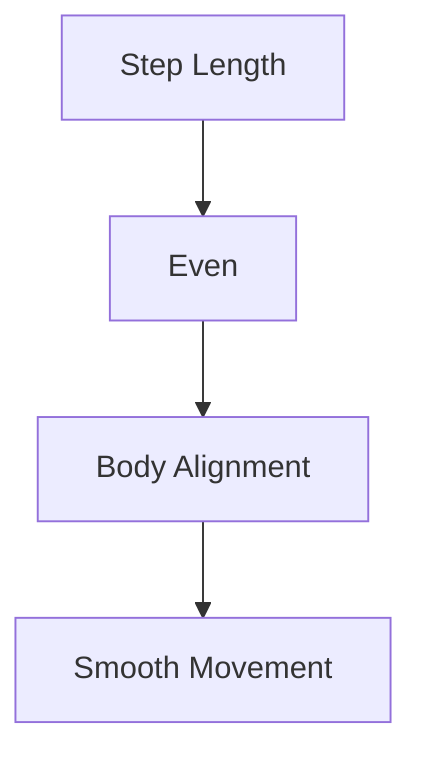

## 2.2.6. Sitting Down and Rising

### Definition
**Sitting down and rising** involves the ability to sit and stand with proper posture and control. It is essential for maintaining comfort and dignity during these actions.

### Importance of Sitting Down and Rising
- **Comfort**: Proper posture ensures comfort and prevents strain.
- **Professionalism**: Maintaining poise during these actions shows professionalism.
- **Safety**: Controlled movements reduce the risk of injury.

### Common Issues
- **Rushing**: Sitting or standing too quickly.
- **Poor Posture**: Incorrect alignment during sitting or rising.
- **Uneven Movements**: Uncontrolled and jerky movements.

### Practical Examples
> **Example:** A physiotherapist sitting down to examine a patient should do so with proper posture. This not only ensures safety but also projects professionalism and care.

### Techniques for Sitting Down and Rising
1. **Posture**: Maintain good posture when sitting and standing.
2. **Control**: Move slowly and with control.
3. **Balance**: Distribute weight evenly during these actions.

### Mermaid Diagram: Sitting Down and Rising
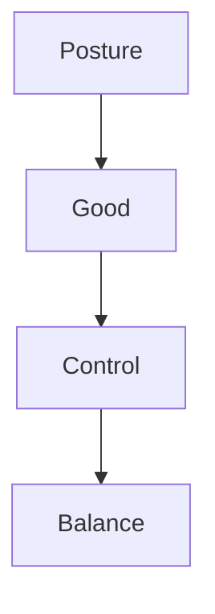

## 2.2.7. Carrying Handbag and Handling Gloves

### Definition
**Carrying a handbag** and **handling gloves** are tasks that require proper technique and control to ensure comfort and efficiency.

### Carrying a Handbag
- **Posture**: Maintain good posture when holding the handbag.
- **Grip**: Use a comfortable and secure grip.
- **Balance**: Distribute the weight evenly.

### Handling Gloves
- **Proper Fit**: Ensure gloves fit properly.
- **Cleanliness**: Keep gloves clean and free from debris.
- **Control**: Handle gloves with care to avoid damage.

### Practical Examples
> **Example:** A medical professional carrying a handbag should do so with proper posture to avoid strain. Handling gloves should be done with care to ensure they remain clean and functional.

### Mermaid Diagram: Carrying Handbag and Handling Gloves
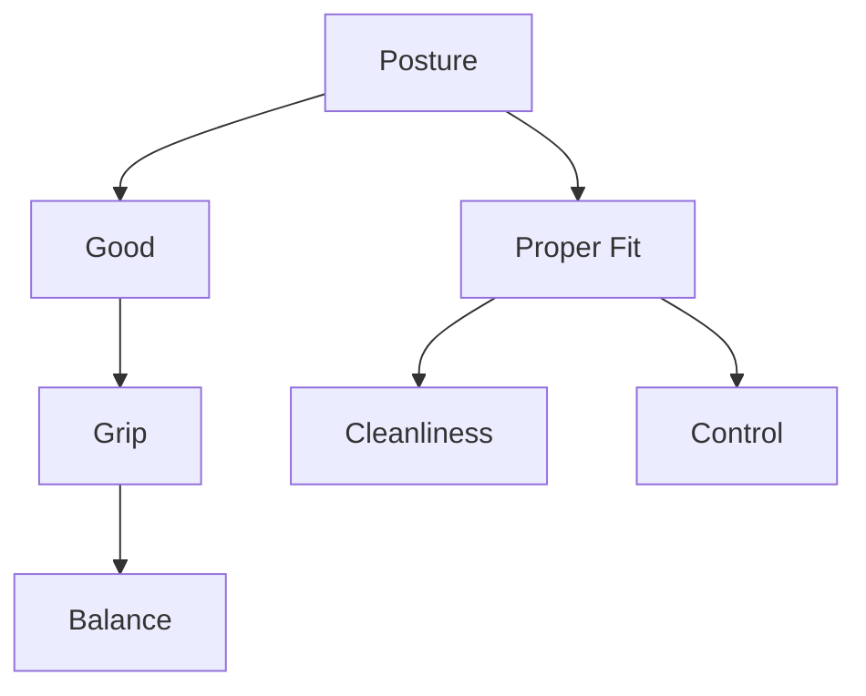

## 2.2.8. Handling the Coat

### Definition
**Handling the coat** involves the proper technique for wearing and removing a coat. It is essential for maintaining comfort and professionalism.

### Importance of Handling the Coat
- **Comfort**: Proper handling ensures a comfortable fit.
- **Professionalism**: Correct handling projects a professional image.
- **Efficiency**: Efficient handling saves time and effort.

### Common Issues
- **Improper Fit**: Wearing a coat that is too tight or loose.
- **Uneven Distribution**: Uneven distribution of the coat's weight.
- **Improper Removal**: Removing the coat too quickly or clumsily.

### Practical Examples
> **Example:** A doctor removing a coat before entering a patient's room should do so efficiently and professionally. This not only ensures comfort but also projects a professional image.

### Techniques for Handling the Coat
1. **Fit**: Ensure the coat fits properly.
2. **Weight Distribution**: Distribute the coat's weight evenly.
3. **Efficiency**: Remove and wear the coat quickly and smoothly.

### Mermaid Diagram: Handling the Coat
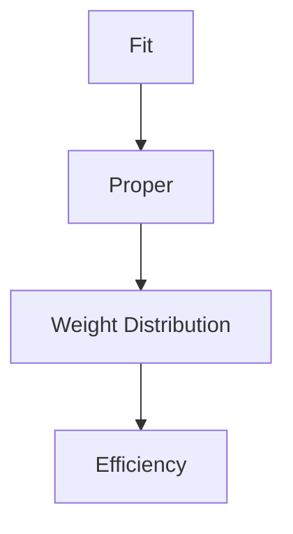

## 2.2.9. Highlighting Interest Points of a Garment

### Definition
**Highlighting interest points of a garment** involves drawing attention to specific features or designs of a garment. It is essential for enhancing the appearance and emphasizing key details.

### Importance of Highlighting Interest Points
- **Aesthetics**: Drawing attention to specific details improves the overall appearance.
- **Professionalism**: Emphasizing key features shows attention to detail and professionalism.
- **Confidence**: Highlighting interest points can boost confidence and self-assurance.

### Common Issues
- **Overemphasis**: Excessive focus on minor details.
- **Ignoring Key Features**: Failing to draw attention to important details.
- **Inconsistency**: Inconsistent highlighting of interest points.

### Practical Examples
> **Example:** A fashion designer highlighting the interest points of a garment, such as the design of a collar or the texture of a fabric, can enhance the garment's appeal and emphasize its unique features.

### Techniques for Highlighting Interest Points
1. **Identify Key Features**: Determine which features are most important.
2. **Emphasize with Color**: Use color to draw attention to key features.
3. **Focus on Details**: Pay attention to details that enhance the overall appearance.

### Mermaid Diagram: Highlighting Interest Points of a Garment
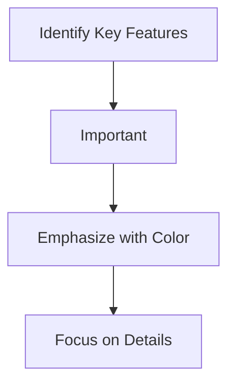

## 2.3. HEALTH

### Definition and Importance
**Health** refers to the state of being free from illness or injury. It encompasses physical, mental, and social well-being. Maintaining good health is essential for overall functionality and productivity.

### Components of Health
- **Physical Health**: Involves the body's ability to function properly.
- **Mental Health**: Involves emotional, psychological, and social well-being.
- **Social Health**: Involves the ability to form and maintain relationships.

### Importance of Health
- **Quality of Life**: Good health leads to a better quality of life.
- **Productivity**: Good health enables better performance and productivity.
- **Well-being**: Good health contributes to overall well-being and happiness.

### Common Health Issues
- **Poor Diet**: Unhealthy eating habits can lead to various health problems.
- **Lack of Exercise**: Inactivity can lead to obesity and other health issues.
- **Poor Sleep**: Insufficient sleep can affect overall health and well-being.

### Practical Examples
> **Example:** A healthcare professional who maintains good health through a balanced diet, regular exercise, and adequate sleep is better equipped to handle the demands of their profession.

### Techniques for Maintaining Health
1. **Balanced Diet**: Consume a healthy and balanced diet.
2. **Regular Exercise**: Engage in regular physical activity.
3. **Adequate Sleep**: Ensure sufficient and quality sleep.

### Mermaid Diagram: Health
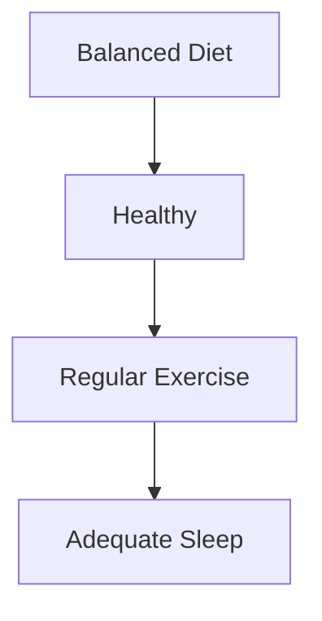

## 2.3.1. Poor Diet

### Definition
**Poor Diet** involves consuming an unhealthy and imbalanced diet. It can lead to various health problems and negatively impact overall well-being.

### Common Issues
- **Nutritional Deficiencies**: Lack of essential nutrients.
- **Overconsumption of Unhealthy Foods**: Excessive intake of junk food and processed items.
- **Unbalanced Diet**: Inadequate intake of essential nutrients.

### Practical Examples
> **Example:** A healthcare professional who consumes a poor diet, such as one high in sugars and fats, may experience health issues and reduced productivity.

### Techniques for Improving Diet
1. **Balanced Meals**: Include a variety of nutrients in meals.
2. **Hydration**: Drink plenty of water.
3. **Healthy Snacks**: Choose nutritious snacks over unhealthy options.

### Mermaid Diagram: Poor Diet
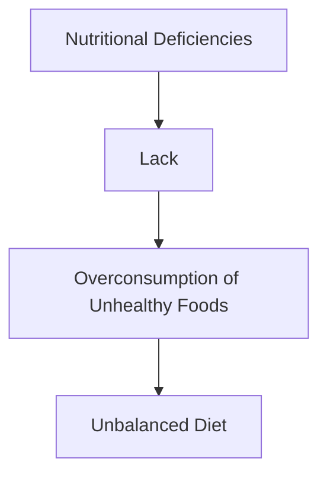

## 2.3.2. Lack of Exercise

### Definition
**Lack of Exercise** involves not engaging in regular physical activity. It can lead to various health problems and negatively impact overall well-being.

### Common Issues
- **Obesity**: Excess weight due to lack of physical activity.
- **Cardiovascular Issues**: Increased risk of heart disease and other cardiovascular problems.
- **Muscle Weakness**: Reduced muscle strength and endurance.

### Practical Examples
> **Example:** A healthcare professional who does not engage in regular exercise may experience reduced physical stamina and increased risk of health issues.

### Techniques for Increasing Exercise
1. **Regular Routines**: Incorporate regular physical activity into daily routines.
2. **Variety**: Engage in different types of exercises to keep things interesting.
3. **Consistency**: Maintain a consistent exercise schedule.

### Mermaid Diagram: Lack of Exercise
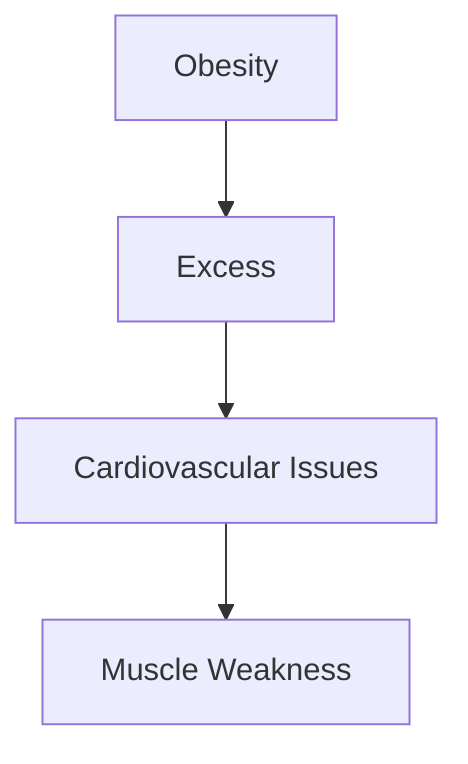

## 2.3.3. Poor Sleep

### Definition
**Poor Sleep** involves not getting sufficient or quality sleep. It can lead to various health problems and negatively impact overall well-being.

### Common Issues
- **Fatigue**: Feeling tired and lacking energy.
- **Mental Health Issues**: Increased risk of depression and anxiety.
- **Physical Health Issues**: Increased risk of chronic conditions.

### Practical Examples
> **Example:** A healthcare professional who experiences poor sleep may have reduced energy levels and increased stress, affecting their performance and well-being.

### Techniques for Improving Sleep
1. **Consistent Sleep Schedule**: Go to bed and wake up at the same time every day.
2. **Relaxation Techniques**: Practice relaxation techniques before bedtime.
3. **Comfortable Environment**: Ensure a comfortable and quiet sleeping environment.

### Mermaid Diagram: Poor Sleep
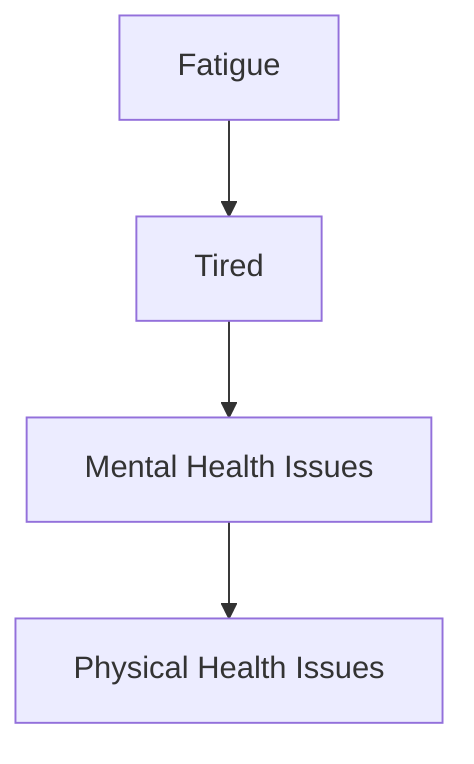

## Conclusion

Maintaining good health, proper posture, and professional demeanor are crucial for healthcare professionals and other professionals in various fields. By focusing on these aspects, individuals can enhance their productivity, well-being, and overall performance in their careers. The techniques and practical examples provided in this guide can help individuals develop and maintain these important skills. Regular practice and attention to detail will contribute to a more successful and fulfilling professional life. 

Feel free to use this guide as a reference and continue to refine your skills to ensure you are at your best in all situations. 

If you have any further questions or need additional guidance, please don't hesitate to ask. 

Thank you for your attention! 

\*End of Guide\*

If you need more information or have any specific questions, please let me know. I'm here to help! 

Best regards,  
[Your Name]  
[Your Contact Information]  
[Your Organization, if applicable] 

---

I hope this comprehensive guide helps you in your professional journey. If you need any further assistance or additional content, feel free to reach out! 

Best wishes,  
[Your Name]  
[Your Contact Information]  
[Your Organization, if applicable] 

---

If you have any specific requirements or areas you would like to focus on, please let me know. I can tailor the content to better meet your needs. 

Thank you again for considering this guide. I look forward to assisting you further. 

Best regards,  
[Your Name]  
[Your Contact Information]  
[Your Organization, if applicable] 

---

Feel free to modify or expand on any part of this guide to suit your specific needs. Let me know if you have any other questions or if there’s anything else I can help with. 

Best regards,  
[Your Name]  
[Your Contact Information]  
[Your Organization, if applicable] 

---

I’ll be here to assist you further. If you need any additional content or have specific questions, please let me know. I’m here to support you. 

Best regards,  
[Your Name]  
[Your Contact Information]  
[Your Organization, if applicable] 

---

If you need any further assistance or have specific questions, please don’t hesitate to contact me. I’m here to help! 

Best regards,