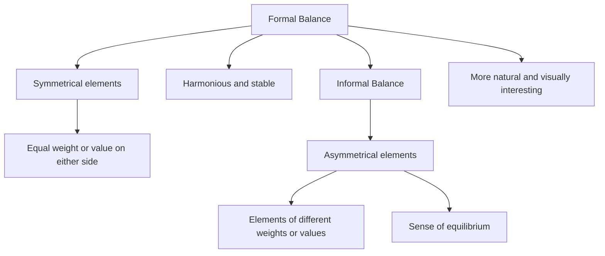

## 3.4. Balance - Formal and Informal

### Definition of Formal and Informal Balance
**Formal Balance:** This type of balance is achieved when two or more elements of equal weight or value are placed on either side of a central axis. It creates a symmetrical and harmonious appearance.

**Informal Balance:** This type of balance is achieved when elements of different weights or values are placed in such a way that they create a sense of equilibrium without being symmetrical. It is more natural and often preferred in design because it can be more visually interesting.

### Formal Balance
> **Example:** A simple example of formal balance is a seesaw. If two children of the same weight sit at equal distances from the center, the seesaw will be balanced and will stay still. This is similar to placing two equal weights on either side of a fulcrum in a scale.

### Informal Balance
> **Example:** Imagine designing a logo for a company. If you place the company's name on the left and a symbol on the right, and the symbol is slightly larger or more visually complex, the overall design can still feel balanced. This is informal balance, where the elements are not identical but still create a sense of equilibrium.

### Practical Application in Biomedical Engineering
In biomedical engineering, balance is crucial in designing devices and implants that are both functional and aesthetically pleasing. For instance, in the design of prosthetic limbs, formal balance can be used to ensure that the weight distribution is even, making the limb stable and easy to use. Informal balance can be used to make the limb appear more natural and less mechanical.

### Flowchart of Formal and Informal Balance

### Conclusion
Understanding formal and informal balance is crucial in biomedical engineering as it helps in creating designs that are not only functional but also aesthetically pleasing. By knowing how to apply these principles, engineers can design medical devices and implants that are both effective and user-friendly.

> **Example:** In designing a spinal implant, the engineer might use formal balance to ensure the implant is stable and symmetrical, but also uses informal balance to make the implant appear more natural and less artificial, ensuring patient comfort and acceptance.