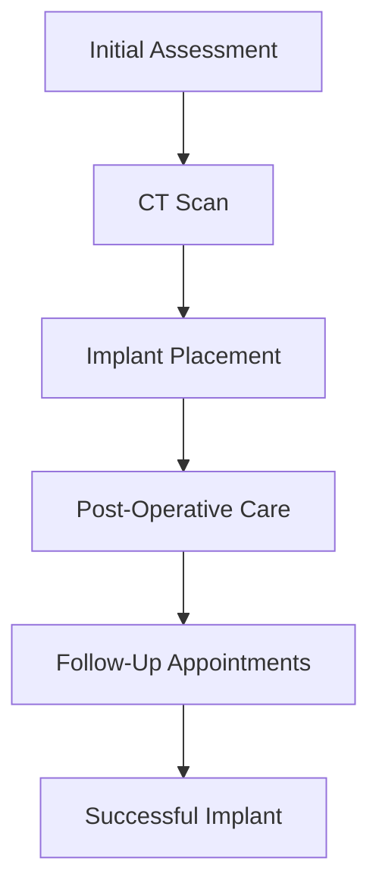
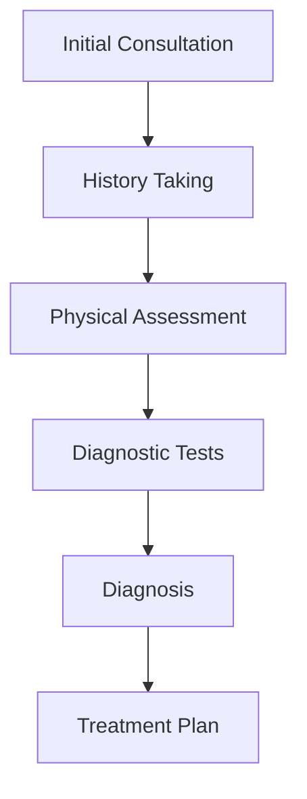
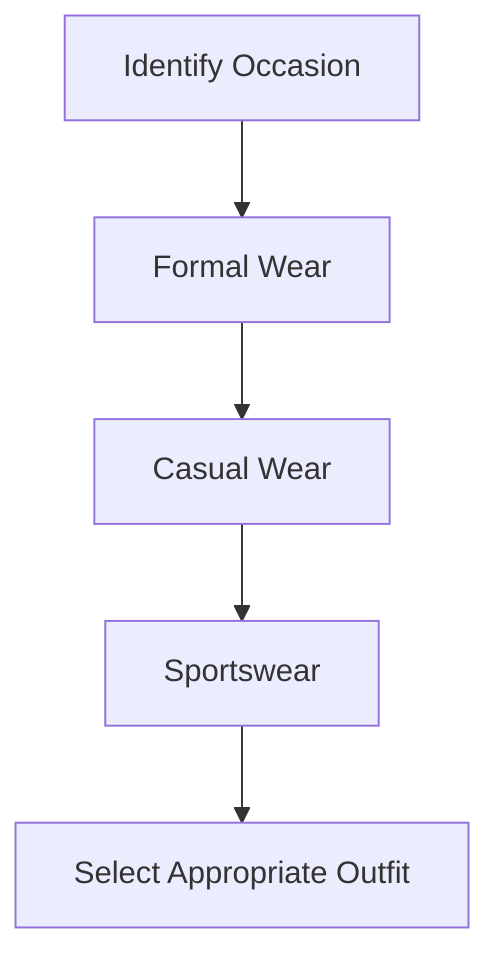
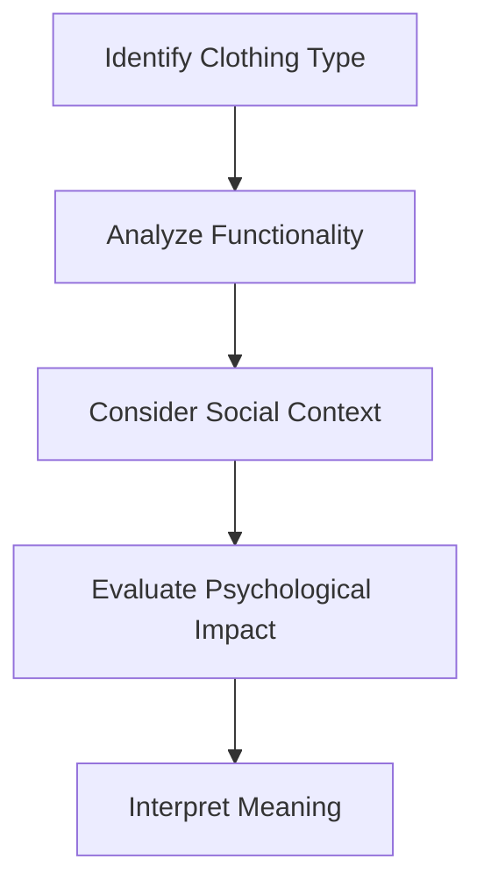

# Chapter 2: Biomedical Engineering Applications

## 2.3.5. Dental Health

### Introduction to Dental Health

**Dental health** refers to the condition of the teeth, gums, and mouth. Good dental health is essential for overall health and well-being. Poor dental health can lead to several issues, including tooth decay, gum disease, and even systemic infections.

### Common Dental Issues

- **Tooth Decay (Caries):** This is the most common dental issue. It is caused by the action of bacteria in the mouth on sugars and starches, leading to acid production that can destroy tooth enamel.
- **Gum Disease (Periodontal Disease):** This condition affects the tissues that surround and support the teeth. It can cause inflammation, bleeding, and eventually, tooth loss.

### Dental Materials and Implants

- **Biomaterials Used in Dentistry:** These are materials used to replace or repair damaged teeth and gums. Common biomaterials include metals, ceramics, polymers, and composites.

#### Example:
> **Example:** A dentist might use a titanium implant to replace a missing tooth. Titanium is chosen because it is biocompatible and can integrate well with the surrounding bone tissue.

### Types of Dental Implants

- **Root-Mimicking Implants:** These implants mimic the shape and function of natural tooth roots. They are usually made of titanium and can be used to support a single tooth or multiple teeth.
- **Plate Implants:** These are larger and are used to support a bridge or denture. They are typically made of titanium and can be placed in the jawbone.

### Flowchart of Dental Implant Process

## 2.3.6. Medical Examination

### Introduction to Medical Examination

**Medical examination** is a thorough evaluation of a patient's health status. It includes a physical assessment, history taking, and diagnostic tests. The goal is to identify any potential health issues and determine the appropriate treatment plan.

### Components of a Medical Examination

- **History Taking:** This involves gathering information about the patient's medical history, including symptoms, past illnesses, and family history.
- **Physical Assessment:** This includes visual and tactile examination of various body parts to identify any abnormalities.
- **Diagnostic Tests:** These are used to confirm or rule out certain conditions. Examples include blood tests, X-rays, and ECGs.

### Example:
> **Example:** A doctor might perform a blood test to check for signs of diabetes. If the patient has high blood sugar levels, further tests might be needed to confirm the diagnosis.

### Flowchart of a Medical Examination Process

## 2.3.7. Clothing

### Introduction to Clothing

**Clothing** refers to the items worn to cover the body. It serves both functional and aesthetic purposes, protecting the body from the environment and expressing personal style.

### Types of Clothing

- **Formal Wear:** This includes suits, dresses, and tuxedos. They are typically worn for formal events and business settings.
- **Casual Wear:** This includes jeans, t-shirts, and sneakers. They are suitable for everyday use and informal settings.
- **Sportswear:** This includes athletic clothing designed for specific sports and activities.

### Example:
> **Example:** A person attending a formal event might wear a suit and tie, while someone going to a gym might wear a sportswear outfit.

### Flowchart of Clothing Selection

## 3.1. Reading Clothing Message

### Introduction to Reading Clothing Message

**Reading clothing message** involves interpreting the meaning behind the clothing choices of others. It can provide insights into a person's personality, social status, and emotional state.

### Example:
> **Example:** A person wearing bright colors and trendy outfits might be trying to express a fun and outgoing personality. Someone wearing dark colors and minimal accessories might be more reserved or serious.

## 3.2. Psychological Interpretation of Dress

### Introduction to Psychological Interpretation of Dress

**Psychological interpretation of dress** involves analyzing the psychological factors that influence clothing choices. It considers how clothing can affect a person's self-image and how others perceive them.

### Example:
> **Example:** Wearing a uniform might make a person feel more professional and confident, while wearing casual clothes might make them feel more relaxed and comfortable.

### Flowchart of Psychological Interpretation of Dress

## 5.1. Heading

### Introduction to Heading

**Heading** refers to the title or label at the beginning of a document. It provides an overview of the content and helps organize the document.

### Example:
> **Example:** A heading for a document about dental health might be "Dental Health and Biomaterials."

## 5.2. Inside Address

### Introduction to Inside Address

**Inside address** is the information provided at the beginning of a letter, such as the recipient's name and address. It ensures the letter is delivered to the correct person or organization.

### Example:
> **Example:** 
> 
> > **Example:** 
> > 
> > 
> > **Inside Address:**  
> > 
> > Dr. R. Patel  
> > Department of Biomedical Engineering  
> > Gujarat Technological University  
> > Ahmedabad, Gujarat  
> > India

## 5.3. Salutation

### Introduction to Salutation

**Salutation** is the greeting at the beginning of a letter. It sets the tone for the rest of the communication.

### Example:
> **Example:** 
> 
> > **Example:**  
> > 
> > 
> > **Salutation:**  
> > 
> > Dear Dr. Patel,

## 5.4. Subject Heading

### Introduction to Subject Heading

**Subject heading** is the line that summarizes the main topic of the letter. It helps the recipient understand the purpose of the letter at a glance.

### Example:
> **Example:** 
> 
> > **Example:**  
> > 
> > 
> > **Subject Heading:**  
> > 
> > Request for Information on Biomaterials

## 5.5. Complimentary Close

### Introduction to Complimentary Close

**Complimentary close** is a polite ending to a letter, often followed by the sender's name and signature.

### Example:
> **Example:** 
> 
> > **Example:**  
> > 
> > 
> > **Complimentary Close:**  
> > 
> > Sincerely,  
> > 
> > [Your Name]

## 5.6. Signature

### Introduction to Signature

**Signature** is the handwritten name at the end of a document, indicating the person's approval or agreement.

### Example:
> **Example:** 
> 
> > **Example:**  
> > 
> > 
> > **Signature:**  
> > 
> > [Your Handwritten Name]

## 5.6.1. Telephone Number, Telegraphic Address, References

### Introduction to Telephone Number, Telegraphic Address, and References

**Telephone number, telegraphic address, and references** are additional details that can be included in a letter for communication purposes.

### Example:
> **Example:** 
> 
> > **Example:**  
> > 
> > 
> > **Telephone Number:** +91 1234567890  
> > 
> > **Telegraphic Address:** Biomedical Dept, G.T.U.  
> > 
> > **References:**  
> > 
> > Dr. R. Patel  
> > 
> > Dr. M. Shah

## 5.6.2. Enclosures

### Introduction to Enclosures

**Enclosures** are documents or items attached to a letter, such as reports, drawings, or samples.

### Example:
> **Example:** 
> 
> > **Example:**  
> > 
> > 
> > **Enclosures:**  
> > 
> > 1. Copy of Dental Health Report  
> > 
> > 2. Sample of Biomaterial

## 5.6.3. Copies

### Introduction to Copies

**Copies** are additional copies of a document that are provided to other parties.

### Example:
> **Example:** 
> 
> > **Example:**  
> > 
> > 
> > **Copies:**  
> > 
> > To Dr. R. Patel, Dr. M. Shah, and Dr. S. Patel

By covering each of these sections, you will be well-prepared for any questions related to these topics in your exams.