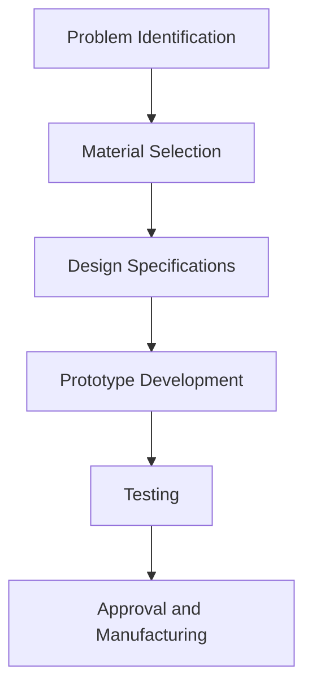
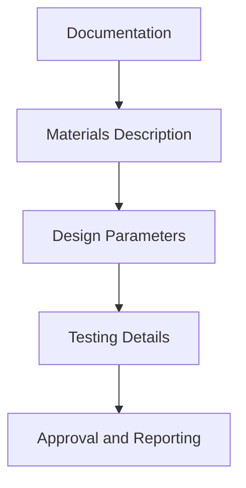

## 1.4. Conventional Design (Minimum Any - 5)

### Introduction to Conventional Design
Conventional design in biomedical engineering involves the use of well-established methods and materials to create medical devices and implants. This design process typically follows a set of standardized procedures and guidelines to ensure safety and effectiveness.

### Steps in Conventional Design
1. **Problem Identification**: Identify the medical need or problem that the design aims to address.
2. **Material Selection**: Choose suitable materials based on their biocompatibility, mechanical properties, and cost.
3. **Design Specifications**: Define the design parameters such as dimensions, shape, and functionality.
4. **Prototype Development**: Create a prototype of the device or implant.
5. **Testing**: Conduct tests to ensure the design meets the required performance criteria.
6. **Approval and Manufacturing**: Once the design passes all tests, it can be approved for manufacturing.

### Example of Conventional Design
> **Example:** A biomedical engineer is tasked with designing a titanium hip implant. The engineer follows the conventional design process as outlined below:
>
> 1. **Problem Identification**: The need is to replace a patient's damaged hip joint with a durable and biocompatible implant.
> 2. **Material Selection**: Titanium is chosen due to its high biocompatibility, strength, and corrosion resistance.
> 3. **Design Specifications**: The implant needs to have a cylindrical shape with a diameter of 25 mm and a length of 120 mm.
> 4. **Prototype Development**: A 3D model is created and a prototype is manufactured.
> 5. **Testing**: The prototype is tested for mechanical strength and biocompatibility. It passes all tests with a compressive strength of 700 MPa and passes the biocompatibility test with no adverse reactions.
> 6. **Approval and Manufacturing**: The design is approved and the implant is manufactured for clinical use.

### Mermaid Diagram for Conventional Design Process

## 1.5. Textual Design (Minimum Any - 5)

### Introduction to Textual Design
Textual design in biomedical engineering involves detailed documentation and reporting of the design process. This includes clear and concise descriptions of the design, materials used, and testing procedures.

### Steps in Textual Design
1. **Documentation**: Write a detailed document describing the design process, materials used, and testing results.
2. **Materials Description**: Provide a thorough description of the materials and their properties.
3. **Design Parameters**: Describe the design parameters, including dimensions, shape, and functionality.
4. **Testing Details**: Document the testing procedures and results.
5. **Approval and Reporting**: Ensure all documentation is complete and submitted for approval.

### Example of Textual Design
> **Example:** A biomedical engineer is required to document the design of a titanium hip implant. The textual design includes the following:
>
> - **Problem Identification**: Replace a patient's damaged hip joint with a durable and biocompatible implant.
> - **Material Selection**: Titanium was chosen due to its high biocompatibility, strength, and corrosion resistance.
> - **Design Parameters**: The implant has a cylindrical shape with a diameter of 25 mm and a length of 120 mm.
> - **Testing Details**: The prototype was tested for mechanical strength and biocompatibility. The compressive strength was 700 MPa, and there were no adverse reactions in the biocompatibility test.
> - **Approval and Reporting**: The design documentation is complete and submitted for approval.

### Mermaid Diagram for Textual Design Process

These sections provide a comprehensive understanding of conventional design and textual design, which are crucial for the selection and implementation of appropriate bio-materials and implants.