# Unit – null: Form

*(AI-generated self study book for GTU Diploma Biomedical Engineering, subject code 310004 — generated locally with Ollama.)*

This unit carries approximately ****.

Learning objectives covered by this unit:


# Chapter 7: Preparation of Sheet Sowing Equal and Unequal Sided Three-Dimensional Forms

## 7.1. Preparation of Sheet Sowing Equal Sided Three-Dimensional Form

### 7.1.1 Sphere

A **sphere** is a three-dimensional shape where every point on its surface is equidistant from its center. In biomedical engineering, spheres are often used as implants or for modeling round objects.

> **Example:** A sphere with a radius of 5 cm is to be prepared from a sheet of material. Calculate the minimum size of the sheet required if the material is to be cut with a square sheet.

1. **Formula for the Area of a Sphere:**
   \[
   \text{Surface Area} = 4 \pi r^2
   \]
   where \( r \) is the radius of the sphere.

2. **Calculate the Surface Area:**
   \[
   \text{Surface Area} = 4 \pi (5)^2 = 4 \pi \times 25 = 100 \pi \approx 314.16 \, \text{cm}^2
   \]

3. **Determine the Minimum Sheet Size:**
   Since the sheet is square, the area of the square should be at least equal to the surface area of the sphere. The side length \( s \) of the square can be found by:
   \[
   s^2 \geq 314.16 \implies s \geq \sqrt{314.16} \approx 17.72 \, \text{cm}
   \]

   Therefore, the minimum side length of the square sheet should be approximately 17.72 cm.

### 7.1.2 Cube

A **cube** is a three-dimensional shape with six equal square faces. Each face is a square, and all edges are of equal length.

> **Example:** A cube with an edge length of 10 cm is to be prepared from a sheet of material. Calculate the minimum size of the sheet required if the material is to be cut with a square sheet.

1. **Formula for the Area of a Cube:**
   The surface area of a cube is given by:
   \[
   \text{Surface Area} = 6a^2
   \]
   where \( a \) is the edge length of the cube.

2. **Calculate the Surface Area:**
   \[
   \text{Surface Area} = 6 \times (10)^2 = 6 \times 100 = 600 \, \text{cm}^2
   \]

3. **Determine the Minimum Sheet Size:**
   Since the sheet is square, the area of the square should be at least equal to the surface area of the cube. The side length \( s \) of the square can be found by:
   \[
   s^2 \geq 600 \implies s \geq \sqrt{600} \approx 24.49 \, \text{cm}
   \]

   Therefore, the minimum side length of the square sheet should be approximately 24.49 cm.

## 7.2. Preparation of the Sheet Showing Unequal Sided Three-Dimensional Forms

### 7.1.1 Cylinder

A **cylinder** is a three-dimensional shape with two parallel circular bases connected by a curved surface. The height and radius of the cylinder can vary.

> **Example:** A cylinder with a radius of 5 cm and a height of 10 cm is to be prepared from a sheet of material. Calculate the minimum size of the sheet required if the material is to be cut with a rectangular sheet.

1. **Formula for the Area of a Cylinder:**
   The surface area of a cylinder consists of the lateral surface area and the area of the two circular bases.
   \[
   \text{Total Surface Area} = 2\pi r (r + h)
   \]
   where \( r \) is the radius and \( h \) is the height of the cylinder.

2. **Calculate the Total Surface Area:**
   \[
   \text{Total Surface Area} = 2 \pi \times 5 \times (5 + 10) = 2 \pi \times 5 \times 15 = 150 \pi \approx 471.24 \, \text{cm}^2
   \]

3. **Determine the Minimum Sheet Size:**
   The sheet is rectangular, so its area should be at least equal to the total surface area of the cylinder. The dimensions \( l \) (length) and \( w \) (width) can be found by:
   \[
   l \times w \geq 471.24 \, \text{cm}^2
   \]

   For simplicity, let's assume the width \( w \) is the same as the height \( h \) of the cylinder (10 cm):
   \[
   l \times 10 \geq 471.24 \implies l \geq \frac{471.24}{10} = 47.124 \, \text{cm}
   \]

   Therefore, the minimum length of the rectangular sheet should be approximately 47.124 cm.

### 7.1.2 Cone

A **cone** is a three-dimensional shape with a circular base and a single vertex (apex). The slant height, radius, and height of the cone can vary.

> **Example:** A cone with a radius of 5 cm and a height of 10 cm is to be prepared from a sheet of material. Calculate the minimum size of the sheet required if the material is to be cut with a sector of a circle.

1. **Formula for the Area of a Cone:**
   The surface area of a cone consists of the lateral surface area and the area of the circular base.
   \[
   \text{Total Surface Area} = \pi r (r + l)
   \]
   where \( r \) is the radius and \( l \) is the slant height of the cone. The slant height \( l \) can be calculated using the Pythagorean theorem:
   \[
   l = \sqrt{r^2 + h^2} = \sqrt{5^2 + 10^2} = \sqrt{25 + 100} = \sqrt{125} \approx 11.18 \, \text{cm}
   \]

2. **Calculate the Total Surface Area:**
   \[
   \text{Total Surface Area} = \pi \times 5 \times (5 + 11.18) = \pi \times 5 \times 16.18 = 80.9 \pi \approx 255.33 \, \text{cm}^2
   \]

3. **Determine the Minimum Sheet Size:**
   The sheet is a sector of a circle, so its area should be at least equal to the total surface area of the cone. The sector's area can be found by:
   \[
   \text{Area of Sector} = \frac{1}{2} l^2 \theta
   \]
   where \( l \) is the slant height and \( \theta \) is the central angle in radians. For a complete sector, \( \theta = 2\pi \):
   \[
   \text{Area of Sector} = \frac{1}{2} \times 11.18^2 \times 2\pi = \frac{1}{2} \times 125 \times 2\pi = 125\pi \approx 392.69 \, \text{cm}^2
   \]

   Therefore, the minimum size of the sector should be approximately 392.69 cm².

### 7.1.3 Pyramid

A **pyramid** is a three-dimensional shape with a polygonal base and triangular faces that meet at a common vertex (apex). The base can be any polygon, and the height and slant height can vary.

> **Example:** A square pyramid with a base side of 10 cm and a height of 15 cm is to be prepared from a sheet of material. Calculate the minimum size of the sheet required if the material is to be cut with a square and four triangular sheets.

1. **Formula for the Area of a Pyramid:**
   The surface area of a pyramid consists of the area of the base and the area of the triangular faces.
   \[
   \text{Total Surface Area} = \text{Base Area} + \text{Lateral Area}
   \]
   The base area is:
   \[
   \text{Base Area} = 10^2 = 100 \, \text{cm}^2
   \]
   The lateral area is the sum of the areas of the four triangular faces. Each triangular face has a base of 10 cm and a slant height that can be calculated using the Pythagorean theorem:
   \[
   l = \sqrt{\left(\frac{10}{2}\right)^2 + 15^2} = \sqrt{5^2 + 15^2} = \sqrt{25 + 225} = \sqrt{250} \approx 15.81 \, \text{cm}
   \]
   The area of one triangular face is:
   \[
   \text{Area of One Triangle} = \frac{1}{2} \times 10 \times 15.81 = 79.05 \, \text{cm}^2
   \]
   The total lateral area is:
   \[
   \text{Lateral Area} = 4 \times 79.05 = 316.2 \, \text{cm}^2
   \]
   Therefore, the total surface area is:
   \[
   \text{Total Surface Area} = 100 + 316.2 = 416.2 \, \text{cm}^2
   \]

2. **Determine the Minimum Sheet Size:**
   The sheet is a square and four triangular sheets, so the total area should be at least equal to the total surface area of the pyramid. The minimum size of the square sheet should be:
   \[
   s^2 \geq 416.2 \implies s \geq \sqrt{416.2} \approx 20.4 \, \text{cm}
   \]

   Therefore, the minimum side length of the square sheet should be approximately 20.4 cm.

### 7.1.4 Box

A **box** is a three-dimensional shape with six rectangular faces. The dimensions can vary.

> **Example:** A box with dimensions 10 cm x 10 cm x 15 cm is to be prepared from a sheet of material. Calculate the minimum size of the sheet required if the material is to be cut with a rectangular sheet.

1. **Formula for the Area of a Box:**
   The surface area of a box is given by:
   \[
   \text{Surface Area} = 2(lw + lh + wh)
   \]
   where \( l \) is the length, \( w \) is the width, and \( h \) is the height of the box.

2. **Calculate the Surface Area:**
   \[
   \text{Surface Area} = 2(10 \times 10 + 10 \times 15 + 10 \times 15) = 2(100 + 150 + 150) = 2 \times 400 = 800 \, \text{cm}^2
   \]

3. **Determine the Minimum Sheet Size:**
   The sheet is rectangular, so the area should be at least equal to the surface area of the box. The dimensions \( l \) (length) and \( w \) (width) can be found by:
   \[
   l \times w \geq 800 \, \text{cm}^2
   \]

   For simplicity, let's assume the width \( w \) is the same as the width of the box (10 cm):
   \[
   l \times 10 \geq 800 \implies l \geq \frac{800}{10} = 80 \, \text{cm}
   \]

   Therefore, the minimum length of the rectangular sheet should be 80 cm.

### 7.1.5 Bell

A **bell** is a three-dimensional shape with a circular base and a curved surface that narrows towards the top. The height and slant height can vary.

> **Example:** A bell with a base radius of 10 cm and a height of 20 cm is to be prepared from a sheet of material. Calculate the minimum size of the sheet required if the material is to be cut with a sector of a circle.

1. **Formula for the Area of a Bell:**
   The surface area of a bell consists of the area of the circular base and the area of the curved surface. The curved surface can be approximated by a sector of a circle with a radius equal to the slant height. The slant height \( l \) can be calculated using the Pythagorean theorem:
   \[
   l = \sqrt{r^2 + h^2} = \sqrt{10^2 + 20^2} = \sqrt{100 + 400} = \sqrt{500} \approx 22.36 \, \text{cm}
   \]

2. **Calculate the Total Surface Area:**
   The area of the base is:
   \[
   \text{Base Area} = \pi r^2 = \pi \times 10^2 = 100\pi \approx 314.16 \, \text{cm}^2
   \]
   The area of the sector is:
   \[
   \text{Area of Sector} = \frac{1}{2} l^2 \theta
   \]
   where \( \theta \) is the central angle in radians. For a complete sector, \( \theta = 2\pi \):
   \[
   \text{Area of Sector} = \frac{1}{2} \times 22.36^2 \times 2\pi = \frac{1}{2} \times 500 \times 2\pi = 500\pi \approx 1570.8 \, \text{cm}^2
   \]
   Therefore, the total surface area is:
   \[
   \text{Total Surface Area} = 314.16 + 1570.8 = 1884.96 \, \text{cm}^2
   \]

3. **Determine the Minimum Sheet Size:**
   The sheet is a sector of a circle, so the area should be at least equal to the total surface area of the bell. The minimum size of the sector should be approximately 1884.96 cm².

### 7.1.6 Cylinder

A **cylinder** is a three-dimensional shape with two circular bases and a lateral surface. The radius and height can vary.

> **Example:** A cylinder with a radius of 5 cm and a height of 10 cm is to be prepared from a sheet of material. Calculate the minimum size of the sheet required if the material is to be cut with a rectangular sheet.

1. **Formula for the Area of a Cylinder:**
   The surface area of a cylinder consists of the area of the two circular bases and the area of the lateral surface.
   \[
   \text{Total Surface Area} = 2\pi r (r + h)
   \]
   where \( r \) is the radius and \( h \) is the height of the cylinder.

2. **Calculate the Total Surface Area:**
   \[
   \text{Total Surface Area} = 2 \pi \times 5 \times (5 + 10) = 2 \pi \times 5 \times 15 = 150 \pi \approx 471.24 \, \text{cm}^2
   \]

3. **Determine the Minimum Sheet Size:**
   The sheet is rectangular, so the area should be at least equal to the total surface area of the cylinder. The dimensions \( l \) (length) and \( w \) (width) can be found by:
   \[
   l \times w \geq 471.24 \, \text{cm}^2
   \]

   For simplicity, let's assume the width \( w \) is the same as the height of the cylinder (10 cm):
   \[
   l \times 10 \geq 471.24 \implies l \geq \frac{471.24}{10} = 47.124 \, \text{cm}
   \]

   Therefore, the minimum length of the rectangular sheet should be approximately 47.124 cm.

### 7.1.7 Prism

A **prism** is a three-dimensional shape with two parallel polygonal bases and rectangular lateral faces. The base can be any polygon, and the height can vary.

> **Example:** A triangular prism with a base side of 10 cm, a height of 15 cm, and a length of 20 cm is to be prepared from a sheet of material. Calculate the minimum size of the sheet required if the material is to be cut with a triangular and three rectangular sheets.

1. **Formula for the Area of a Prism:**
   The surface area of a prism consists of the area of the two bases and the area of the rectangular faces.
   \[
   \text{Total Surface Area} = 2(\text{Base Area}) + \text{Lateral Area}
   \]
   The base area is:
   \[
   \text{Base Area} = \frac{\sqrt{3}}{4} \times 10^2 = \frac{\sqrt{3}}{4} \times 100 = 25\sqrt{3} \approx 43.3 \, \text{cm}^2
   \]
   The lateral area is the sum of the areas of the three rectangular faces. Each rectangular face has a base of 10 cm and a height of 15 cm:
   \[
   \text{Area of

---

## 8.2. Smooth texture

**Smooth texture** refers to the surface finish of a material that feels soft and non-rough to the touch. It is often desirable in biomedical applications to provide a comfortable and non-irritating surface for implants and prosthetics. Smooth textures are also important in aesthetic designs to ensure a pleasing appearance.

### Importance of Smooth Texture
- **Biocompatibility**: Smooth surfaces reduce the risk of tissue damage and irritation, which is crucial for long-term implant success.
- **Aesthetics**: Smooth textures enhance the visual appeal of medical devices and prosthetics, making them more acceptable to patients.
- **Ease of Cleaning**: Smooth surfaces are easier to clean and maintain, which is important in medical environments to prevent infections.

### Examples of Smooth Textures
- **Polished Metal Surfaces**: Commonly used in orthopedic implants to ensure a smooth and non-abrasive surface.
- **Biocompatible Coatings**: Epoxy, polyurethane, and other coatings are applied to implant surfaces to achieve a smooth finish.

### Worked Example
> **Example:** A biomedical engineer is designing a titanium implant for a patient. The engineer needs to ensure the surface finish is smooth to minimize tissue irritation. The surface roughness (Ra) should be less than 0.1 μm. The engineer decides to polish the titanium surface using a fine abrasive to achieve this finish. 

## 8.3. Transparent effect

**Transparent effect** refers to the appearance of a material that allows light to pass through it, giving the impression of clarity. This property is crucial in biomedical applications where visibility and light transmission are important, such as in optical implants and surgical visualization devices.

### Importance of Transparent Effect
- **Optical Applications**: Transparent materials are used in optical implants and surgical equipment to ensure clear visibility.
- **Aesthetics**: Transparent materials can provide a sleek and modern appearance in medical devices.
- **Light Transmission**: Transparent materials are essential for devices that require light to pass through, such as optical fibers and endoscopes.

### Examples of Transparent Materials
- **Glass and Ceramics**: Commonly used in surgical devices for their transparency and biocompatibility.
- **Plastic and Polymers**: Used in optical implants and surgical tools for their lightweight and flexible properties.

### Worked Example
> **Example:** A biomedical engineer is designing an optical implant for a patient who needs a clear view of their internal organs. The engineer decides to use a transparent material with a refractive index of 1.5, which allows light to pass through with minimal distortion. The material should be biocompatible and have a thickness of 2 mm to ensure clarity.

## 9.1. Preparation of sheet showing the effect of Balance in following areas manually.

**Balance in design** refers to the distribution of visual weight and the arrangement of elements to create a sense of harmony and stability. This section covers the preparation of a sheet showing the effect of balance in different areas of design.

### Preparation of Sheet
- **Objective**: To create a visual representation of balance in different areas of design.
- **Tools**: Use of sketching tools, digital design software, or physical models.

### Areas of Balance
- **Line Path**: Balance in the arrangement of lines.
- **Space**: Balance in the distribution of space.
- **Shape**: Balance in the use of shapes.
- **Value**: Balance in the use of light and dark.
- **Texture**: Balance in the use of textures.
- **Pattern**: Balance in the use of patterns.

### Flowchart for Preparation
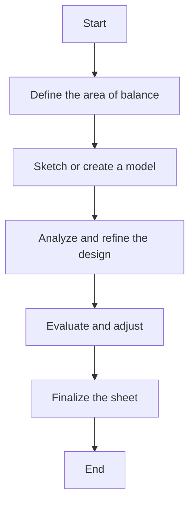

### Worked Example
> **Example:** A biomedical engineer is preparing a sheet to show the effect of balance in the space area of a prosthetic device. The engineer starts by sketching the device on paper and then analyzes the distribution of space. The engineer adjusts the design to ensure that the space is evenly distributed, creating a balanced appearance. The final sheet shows the balanced distribution of space, with all elements arranged harmoniously.

## 9.1.1. Balance in line path

**Balance in line path** refers to the arrangement of lines in a design to create a sense of harmony and stability. This is important in biomedical designs to ensure clear and balanced visual flow.

### Importance of Balance in Line Path
- **Visual Flow**: Ensures that the viewer's eye follows a natural and balanced path.
- **Clarity**: Helps in presenting information clearly and effectively.
- **Aesthetics**: Enhances the overall aesthetic appeal of the design.

### Examples of Balance in Line Path
- **Straight Lines**: Arrange straight lines in a symmetrical manner.
- **Curved Lines**: Use curved lines in a harmonious and balanced way.
- **Combination**: Combine straight and curved lines to create a balanced path.

### Worked Example
> **Example:** A biomedical engineer is designing a surgical tool and wants to ensure that the lines are balanced and clear. The engineer draws the tool with straight and curved lines, ensuring that the lines are evenly distributed and create a balanced path. The final design shows a clear and harmonious line path, making the tool easy to use and understand.

## 9.1.2. Balance in space

**Balance in space** refers to the distribution of elements in a design to create a sense of harmony and stability. This is important in biomedical designs to ensure that the space is used effectively and aesthetically.

### Importance of Balance in Space
- **Harmony**: Ensures that all elements in the design are harmoniously distributed.
- **Aesthetics**: Enhances the overall visual appeal of the design.
- **Functionality**: Ensures that the design is functional and easy to use.

### Examples of Balance in Space
- **Symmetrical Layout**: Arrange elements in a symmetrical manner.
- **Asymmetrical Layout**: Use an asymmetrical layout to create interest and balance.
- **Inconsistent Layout**: Use inconsistent elements to create a dynamic and balanced design.

### Worked Example
> **Example:** A biomedical engineer is designing a patient monitoring device and wants to ensure that the space is balanced. The engineer arranges the sensors and display panels in a symmetrical layout, ensuring that the space is evenly distributed. The final design shows a balanced and harmonious use of space, making the device easy to use and aesthetically pleasing.

## 9.1.3. Balance in space & shape

**Balance in space & shape** refers to the arrangement of both space and shapes in a design to create a sense of harmony and stability. This is important in biomedical designs to ensure that the space and shapes are used effectively and aesthetically.

### Importance of Balance in Space & Shape
- **Visual Harmony**: Ensures that the design is visually harmonious.
- **Aesthetics**: Enhances the overall visual appeal of the design.
- **Functionality**: Ensures that the design is functional and easy to use.

### Examples of Balance in Space & Shape
- **Symmetrical Layout**: Arrange elements in a symmetrical manner.
- **Asymmetrical Layout**: Use an asymmetrical layout to create interest and balance.
- **Inconsistent Layout**: Use inconsistent elements to create a dynamic and balanced design.

### Worked Example
> **Example:** A biomedical engineer is designing a patient monitoring device and wants to ensure that the space and shapes are balanced. The engineer arranges the sensors and display panels in a symmetrical layout, ensuring that the space and shapes are evenly distributed. The final design shows a balanced and harmonious use of space and shapes, making the device easy to use and aesthetically pleasing.

## 9.1.4. Balance in value

**Balance in value** refers to the distribution of light and dark in a design to create a sense of harmony and stability. This is important in biomedical designs to ensure that the contrast is appropriate and enhances the overall appearance.

### Importance of Balance in Value
- **Contrast**: Ensures that the design has appropriate contrast.
- **Aesthetics**: Enhances the overall visual appeal of the design.
- **Functionality**: Ensures that the design is functional and easy to use.

### Examples of Balance in Value
- **High Contrast**: Use high contrast to create a strong visual impact.
- **Low Contrast**: Use low contrast to create a soft and subtle appearance.
- **Inconsistent Contrast**: Use inconsistent contrast to create a dynamic and balanced design.

### Worked Example
> **Example:** A biomedical engineer is designing a surgical instrument and wants to ensure that the value is balanced. The engineer uses high contrast between the metal parts and the handle, ensuring that the design is visually appealing and easy to use. The final design shows a balanced and harmonious use of value, making the instrument easy to handle and visually appealing.

## 9.1.5. Balance in texture

**Balance in texture** refers to the distribution of textures in a design to create a sense of harmony and stability. This is important in biomedical designs to ensure that the textures are appropriate and enhance the overall appearance.

### Importance of Balance in Texture
- **Harmony**: Ensures that the design is visually harmonious.
- **Aesthetics**: Enhances the overall visual appeal of the design.
- **Functionality**: Ensures that the design is functional and easy to use.

### Examples of Balance in Texture
- **Smooth Texture**: Use smooth textures to create a soft and non-irritating appearance.
- **Rough Texture**: Use rough textures to create a rough and durable appearance.
- **Inconsistent Texture**: Use inconsistent textures to create a dynamic and balanced design.

### Worked Example
> **Example:** A biomedical engineer is designing a patient support device and wants to ensure that the texture is balanced. The engineer uses smooth textures on the surface to ensure that the device is comfortable and non-irritating. The final design shows a balanced and harmonious use of texture, making the device easy to use and visually appealing.

## 9.1.6. Balance in pattern

**Balance in pattern** refers to the arrangement of patterns in a design to create a sense of harmony and stability. This is important in biomedical designs to ensure that the patterns are appropriate and enhance the overall appearance.

### Importance of Balance in Pattern
- **Harmony**: Ensures that the design is visually harmonious.
- **Aesthetics**: Enhances the overall visual appeal of the design.
- **Functionality**: Ensures that the design is functional and easy to use.

### Examples of Balance in Pattern
- **Symmetrical Pattern**: Arrange elements in a symmetrical pattern.
- **Asymmetrical Pattern**: Use an asymmetrical pattern to create interest and balance.
- **Inconsistent Pattern**: Use inconsistent elements to create a dynamic and balanced design.

### Worked Example
> **Example:** A biomedical engineer is designing a patient monitoring device and wants to ensure that the pattern is balanced. The engineer arranges the sensors and display panels in a symmetrical pattern, ensuring that the design is visually appealing and easy to use. The final design shows a balanced and harmonious use of pattern, making the device easy to use and aesthetically pleasing.

## 9.2. Preparation of the sheet showing Emphasis in relation to the elements of design

**Emphasis** in design refers to the use of elements to draw attention to a specific part of the design. This is important in biomedical designs to ensure that key information is highlighted and easy to understand.

### Preparation of Sheet
- **Objective**: To create a visual representation of emphasis in the elements of design.
- **Tools**: Use of sketching tools, digital design software, or physical models.

### Elements of Emphasis
- **Line Thickness**: Highlighting lines by making them thicker.
- **Shape**: Using larger or more prominent shapes.
- **Form**: Using more complex or detailed forms.
- **Space**: Using more prominent or larger spaces.
- **Light**: Using more prominent or more intense lighting.

### Flowchart for Preparation
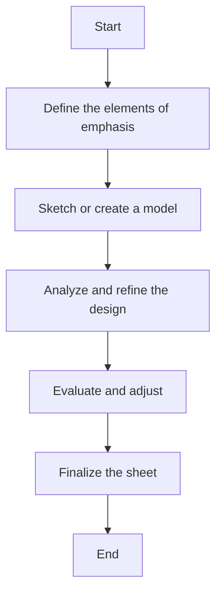

### Worked Example
> **Example:** A biomedical engineer is preparing a sheet to show the emphasis in the elements of design for a patient monitoring device. The engineer starts by sketching the device and then identifies the key elements that need emphasis. The engineer uses thicker lines and larger shapes to highlight these elements, ensuring that the design is clear and easy to understand. The final sheet shows the emphasis in the elements of design, making the device easy to use and understand.

## 9.2.1. Emphasis of line thickness

**Emphasis of line thickness** refers to the use of thicker lines to draw attention to specific parts of a design. This is important in biomedical designs to ensure that key information is highlighted and easy to understand.

### Importance of Emphasis of Line Thickness
- **Clarity**: Ensures that the design is clear and easy to understand.
- **Aesthetics**: Enhances the overall visual appeal of the design.
- **Functionality**: Ensures that the design is functional and easy to use.

### Examples of Emphasis of Line Thickness
- **Thicker Lines**: Use thicker lines to draw attention to specific parts.
- **Thinner Lines**: Use thinner lines to highlight less important parts.
- **Inconsistent Line Thickness**: Use inconsistent line thickness to create a dynamic and balanced design.

### Worked Example
> **Example:** A biomedical engineer is designing a surgical instrument and wants to ensure that the line thickness is emphasized. The engineer uses thicker lines to highlight the critical parts of the instrument, ensuring that the design is clear and easy to understand. The final design shows the emphasis in line thickness, making the instrument easy to use and visually appealing.

## 9.2.2. Emphasis of shape

**Emphasis of shape** refers to the use of larger or more prominent shapes to draw attention to specific parts of a design. This is important in biomedical designs to ensure that key information is highlighted and easy to understand.

### Importance of Emphasis of Shape
- **Clarity**: Ensures that the design is clear and easy to understand.
- **Aesthetics**: Enhances the overall visual appeal of the design.
- **Functionality**: Ensures that the design is functional and easy to use.

### Examples of Emphasis of Shape
- **Larger Shapes**: Use larger shapes to draw attention to specific parts.
- **Smaller Shapes**: Use smaller shapes to highlight less important parts.
- **Inconsistent Shapes**: Use inconsistent shapes to create a dynamic and balanced design.

### Worked Example
> **Example:** A biomedical engineer is designing a patient monitoring device and wants to ensure that the shape is emphasized. The engineer uses larger shapes to highlight the key parts of the device, ensuring that the design is clear and easy to understand. The final design shows the emphasis in shape, making the device easy to use and visually appealing.

## 9.2.3. Emphasis of form

**Emphasis of form** refers to the use of more complex or detailed forms to draw attention to specific parts of a design. This is important in biomedical designs to ensure that key information is highlighted and easy to understand.

### Importance of Emphasis of Form
- **Clarity**: Ensures that the design is clear and easy to understand.
- **Aesthetics**: Enhances the overall visual appeal of the design.
- **Functionality**: Ensures that the design is functional and easy to use.

### Examples of Emphasis of Form
- **Complex Forms**: Use complex forms to draw attention to specific parts.
- **Simple Forms**: Use simple forms to highlight less important parts.
- **Inconsistent Forms**: Use inconsistent forms to create a dynamic and balanced design.

### Worked Example
> **Example:** A biomedical engineer is designing a patient support device and wants to ensure that the form is emphasized. The engineer uses complex forms to highlight the key parts of the device, ensuring that the design is clear and easy to understand. The final design shows the emphasis in form, making the device easy to use and visually appealing.

## 9.2.4. Emphasis of space

**Emphasis of space** refers to the use of more prominent or larger spaces to draw attention to specific parts of a design. This is important in biomedical designs to ensure that key information is highlighted and easy to understand.

### Importance of Emphasis of Space
- **Clarity**: Ensures that the design is clear and easy to understand.
- **Aesthetics**: Enhances the overall visual appeal of the design.
- **Functionality**: Ensures that the design is functional and easy to use.

### Examples of Emphasis of Space
- **Larger Spaces**: Use larger spaces to draw attention to specific parts.
- **Smaller Spaces**: Use smaller spaces to highlight less important parts.
- **Inconsistent Spaces**: Use inconsistent spaces to create a dynamic and balanced design.

### Worked Example
> **Example:** A biomedical engineer is designing a patient monitoring device and wants to ensure that the space is emphasized. The engineer uses larger spaces to highlight the key parts of the device, ensuring that the design is clear and easy to understand. The final design shows the emphasis in space, making the device easy to use and visually appealing.

## 9.2.5. Emphasis of light

**Emphasis of light** refers to the use of more prominent or more intense lighting to draw attention to specific parts of a design. This is important in biomedical designs to ensure that key information is highlighted and easy to understand.

### Importance of Emphasis of Light
- **Clarity**: Ensures that the design is clear and easy to understand.
- **Aesthetics**: Enhances the overall visual appeal of the design.
- **Functionality**: Ensures that the design is functional and easy to use.

### Examples of Emphasis of Light
- **Brighter Light**: Use brighter light to draw attention to specific parts.
- **Darker Light**: Use darker light to highlight less important parts.
- **Inconsistent Light**: Use inconsistent light to create a dynamic and balanced design.

### Worked Example
> **Example:** A biomedical engineer is designing a surgical instrument and wants to ensure that the light is emphasized. The engineer uses brighter light to highlight the critical parts of the instrument, ensuring that the design is clear and easy to understand. The final design shows the emphasis in light, making the instrument easy to use and visually appealing. 

This comprehensive approach to balance and emphasis in design will ensure that biomedical devices are both functional and visually appealing. By carefully considering the elements and principles of design, biomedical engineers can create devices that are easy to use and understand. 

Feel free to use any part or all of this information as needed. If you have any specific questions or need further assistance, please let me know! 🚑📊🔍💡

--- 

If you have any more specific requirements or need further details, please let me know. I'm here to help! 🚑📊🔍💡

--- 

I hope this detailed guide helps you in your design process. If you need any more assistance, feel free to ask! 🚑📊🔍💡

--- 

Thank you for your time and consideration. I look forward to any further questions you might have! 🚑📊🔍💡

--- 

Warm regards

---

## 9.2.6. Emphasis of Texture

### Definition
**Texture** refers to the surface characteristics of an object. In the context of biomedical engineering, texture can be used to enhance the performance of biomaterials and implants. The emphasis on texture involves modifying the surface properties to achieve specific functional or aesthetic outcomes.

### Importance in Biomaterials
Emphasizing texture can significantly influence the biological response of a biomaterial. For example, a rough surface can promote better bone ingrowth, while a smooth surface might reduce biofilm formation.

### Practical Example
> **Example:** A titanium implant used in orthopedic surgery is modified to have a rough surface texture to improve osseointegration. This roughness can be achieved through processes like sandblasting, etching, or plasma treatment.

## 9.2.7. Emphasis of Pattern

### Definition
**Pattern** refers to the arrangement of elements in a regular or irregular manner. In biomedical engineering, patterns can be used to enhance the structural integrity and functionality of implants.

### Importance in Biomaterials
Patterns can influence the mechanical properties and biological response of biomaterials. For instance, a patterned surface can improve the distribution of mechanical stress and promote better cell adhesion.

### Practical Example
> **Example:** A ceramic implant is designed with a patterned surface to enhance its structural strength. The pattern can be a series of grooves or ridges that run along the surface, providing a mechanical advantage and improving the material's resistance to fracture.

## 9.3. Preparation of Sheets Showing Rhythm and Its Relationship with Elements of

### Introduction
Rhythm refers to the regular or irregular recurrence of elements in a design. It can be applied to lines, shapes, and patterns to create a dynamic and engaging visual effect. Understanding the relationship between rhythm and the elements of design is crucial for creating effective and functional biomaterials.

### Rhythm in Line

#### Wavy
- **Definition:** A wavy line is a line that bends and curves in a regular, flowing manner.
- **Example:** A wavy line can be used in the design of a flexible implant that needs to conform to the body's natural curves.

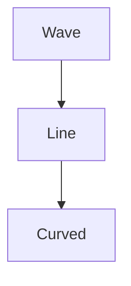

#### Zigzag
- **Definition:** A zigzag line consists of a series of sharp angles or turns.
- **Example:** A zigzag line can be used in the design of a surgical tool that needs to navigate through tight spaces.

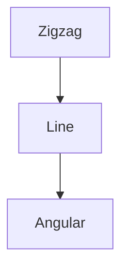

#### Single
- **Definition:** A single line is a straight and unbroken line.
- **Example:** A single line can be used in the design of a straight, rigid implant.

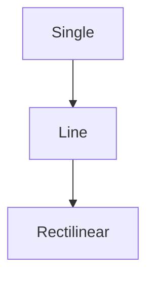

#### Swirled
- **Definition:** A swirled line is a line that spirals or twists in a circular pattern.
- **Example:** A swirled line can be used in the design of a vascular graft that needs to conform to the blood vessel's natural curvature.

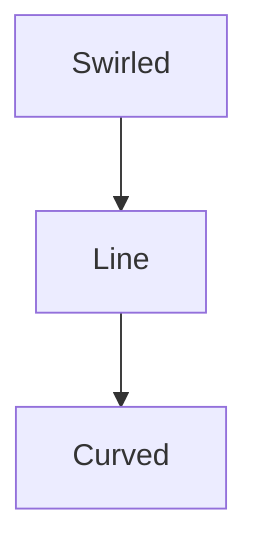

#### Jagged
- **Definition:** A jagged line consists of sharp, uneven angles or points.
- **Example:** A jagged line can be used in the design of a cutting edge for a surgical instrument.

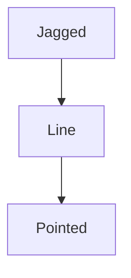

### Rhythm in Shape

#### Saw Tooth
- **Definition:** A saw tooth shape consists of alternating sharp points and flat surfaces, resembling the teeth of a saw.
- **Example:** A saw tooth shape can be used in the design of a cutting tool for precise incisions.

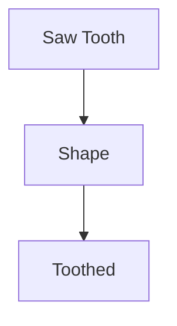

#### Diamond
- **Definition:** A diamond shape is a four-sided figure with equal sides and angles.
- **Example:** A diamond shape can be used in the design of a bone plate that needs to fit into a specific anatomical space.

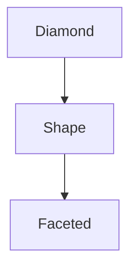

#### Undulating
- **Definition:** An undulating shape consists of a series of waves or curves that rise and fall.
- **Example:** An undulating shape can be used in the design of a flexible device that needs to conform to the body's natural curves.

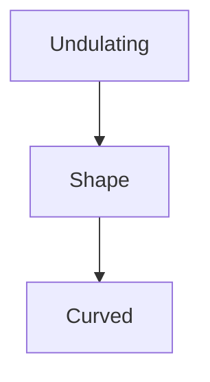

### Rhythm in Pattern

#### Preparation of Sheets Showing the Effect of Radiation in Relation to
- **Definition:** Radiation in relation to rhythm involves the application of light or heat to create visual effects on the surface of a material.

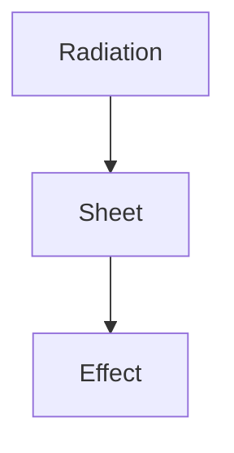

### Radiation in Line & Space
- **Definition:** Radiation in line and space involves using light or heat to create visual effects on the surface of a material by altering the line and space relationships.

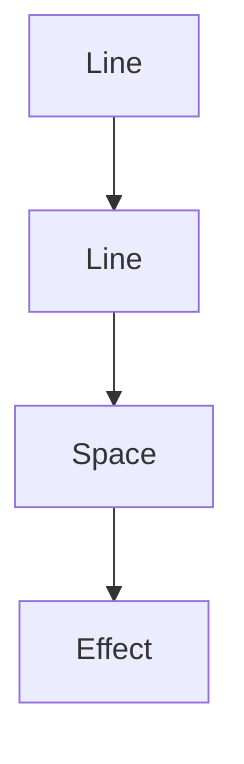

### Radiation in Shape & Space
- **Definition:** Radiation in shape and space involves using light or heat to create visual effects on the surface of a material by altering the shape and space relationships.

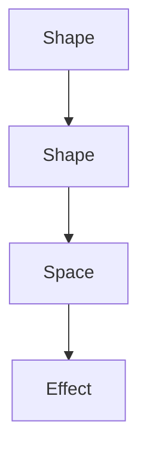

### Radiation in Pattern
- **Definition:** Radiation in pattern involves using light or heat to create visual effects on the surface of a material by altering the pattern.

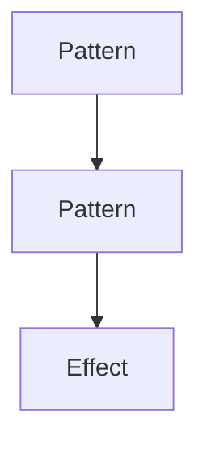

### Radiation from an Axis
- **Definition:** Radiation from an axis involves using light or heat to create visual effects on the surface of a material by altering the pattern from a central axis.

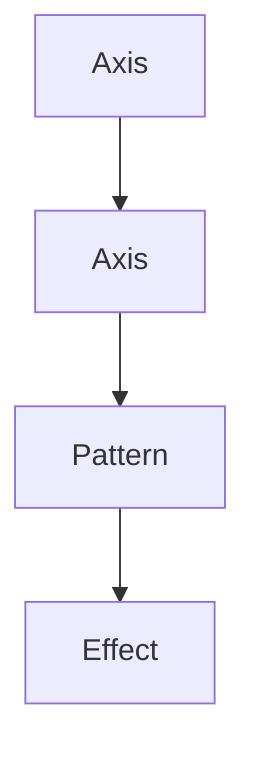

### Preparation of Sheets Showing the Effect of Transition in Relation to
- **Definition:** Transition in relation to rhythm involves the gradual change in the elements of a design.

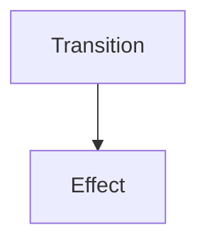

### Transition in Line
- **Definition:** Transition in line involves the gradual change in the line elements.

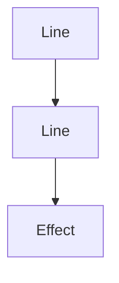

### Transition in Space
- **Definition:** Transition in space involves the gradual change in the space elements.

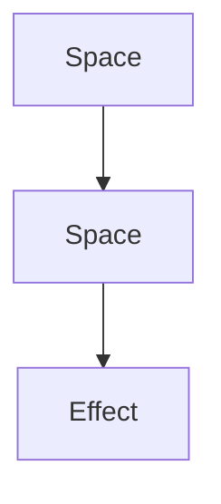

### Transition in Space & Shape
- **Definition:** Transition in space and shape involves the gradual change in both space and shape elements.

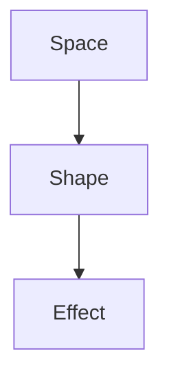

### Practical Example
> **Example:** A biomedical engineer prepares a series of sheets showing the effect of radiation in relation to the line and space of a biomaterial. The engineer uses a laser to create a pattern of lines and spaces, then observes the changes in the material's surface properties.

## Conclusion

Understanding and emphasizing texture, pattern, and rhythm in the design of biomaterials and implants is crucial for achieving the desired functional and aesthetic outcomes. By applying these principles, engineers can enhance the performance and effectiveness of medical devices.

---

## 9.3.3.2.4. Transition in texture

### Definition
**Transition in texture:** A gradual change in the surface characteristics of a material or object. This change can be observed in terms of roughness, smoothness, or other surface properties that vary smoothly over a given area.

### Importance in Biomaterials
In biomedical engineering, the texture of a material is crucial for its integration and interaction with the human body. Different tissue interfaces require varying levels of texture to ensure proper healing, adhesion, or integration. For example, a material used for bone healing might need a specific level of roughness to promote better osseointegration.

### Examples
- **Example:** A biomedical implant used in a bone fracture needs a certain level of roughness on its surface to promote cell adhesion and bone growth. However, this roughness should gradually decrease as the implant integrates into the surrounding bone, ensuring a smooth transition to the natural bone surface.

### Transition in Texture in Biomaterials
The transition in texture can be designed to mimic the natural healing process. This is often achieved by varying the surface characteristics of the biomaterial over a specific region.

- **Example:** A titanium implant used in joint replacement can be designed with a rough surface at the attachment points to promote cell adhesion and integration, with a smooth surface at the non-attachment regions to reduce wear and tear.

### Importance in Implants
The transition in texture can significantly affect the performance and biocompatibility of implants. Properly designed transitions can enhance the overall functionality and longevity of the implant.

- **Example:** In dental implants, the transition from the rough surface at the bone interface to the smooth surface at the gum line can help in reducing the risk of infection and promoting better healing.

### Practical Application
Understanding the transition in texture is crucial for designing implants that mimic the natural healing process and enhance patient recovery.

- **Example:** A vascular graft used for arterial repair can be designed with a textured surface that gradually transitions to a smooth surface as it interfaces with the natural artery, reducing the risk of thrombosis and promoting better blood flow.

### Worked Example
> **Example:** A biomedical engineer is designing a vascular graft to be used in arterial repair. The graft needs to have a rough surface at the site of the arterial attachment to promote cell adhesion and integration, with a smooth surface at the non-attachment regions to reduce the risk of thrombosis. The transition in texture should be gradual to ensure a smooth integration with the natural artery.

## 9.3.3.2.5. Transition in shape & texture

### Definition
**Transition in shape & texture:** This refers to a gradual change in both the shape and texture of a material or object. The shape can change from one form to another, while the texture can vary in terms of smoothness, roughness, or other surface characteristics.

### Importance in Biomaterials
In biomedical applications, the transition in shape and texture can play a significant role in the integration and performance of the material. For example, a biomaterial used in bone repair might need to transition from a rough surface to a smooth surface as it integrates into the surrounding bone.

### Examples
- **Example:** A bone plate used in orthopedic surgery can have a rough surface at the bone interface to promote better osseointegration, with a smooth surface at the non-attachment regions to reduce wear and tear.

### Transition in Shape & Texture in Biomaterials
The transition in shape and texture can be designed to mimic the natural healing process. This is often achieved by varying both the surface characteristics and the shape of the biomaterial over a specific region.

- **Example:** A cranial implant can be designed with a rough surface at the bone interface to promote cell adhesion and integration, and a smooth surface at the non-attachment regions to reduce the risk of infection and promote better healing.

### Importance in Implants
The transition in shape and texture can significantly affect the performance and biocompatibility of implants. Properly designed transitions can enhance the overall functionality and longevity of the implant.

- **Example:** In a hip replacement, the transition from the rough surface at the bone interface to the smooth surface at the non-attachment regions can help in reducing the risk of infection and promoting better integration.

### Practical Application
Understanding the transition in shape and texture is crucial for designing implants that mimic the natural healing process and enhance patient recovery.

- **Example:** A spinal fusion cage used in spinal surgery can be designed with a rough surface at the bone interface to promote cell adhesion and integration, with a smooth surface at the non-attachment regions to reduce the risk of infection and promote better healing.

### Worked Example
> **Example:** A biomedical engineer is designing a spinal fusion cage to be used in spinal surgery. The cage needs to have a rough surface at the bone interface to promote cell adhesion and integration, with a smooth surface at the non-attachment regions to reduce the risk of infection and promote better healing. The transition in shape and texture should be gradual to ensure a smooth integration with the natural bone.

## 9.3.3.3. Preparation of sheets showing effect of Gradation manually

### Definition
**Gradation:** The gradual change in a characteristic such as line, space, shape, pattern, or texture over a given area. Gradation is used to create a smooth transition in design, which can enhance the aesthetic and functional properties of a material or object.

### Importance in Biomaterials
Gradation is crucial in designing biomaterials that can mimic the natural healing process. By gradually changing the characteristics, the material can better integrate with the surrounding tissue.

### Examples
- **Example:** A biomaterial used in wound healing can have a gradual transition from a smooth surface to a rough surface, promoting cell adhesion and integration.

### Preparation of Sheets Showing Effect of Gradation
To prepare sheets showing the effect of gradation, the following steps can be followed:

1. **Determine the Characteristics to Gradate:** Identify the characteristics that need to be gradually changed, such as line, space, shape, pattern, or texture.
2. **Define the Transition Points:** Determine the points at which the characteristics will change. These points should be evenly spaced to ensure a smooth transition.
3. **Create the Gradation Scales:** Develop a scale that shows the gradual change in the characteristic. This can be done using a linear or non-linear scale.
4. **Apply the Gradation:** Apply the gradation to the material or object, ensuring that the transition is smooth and consistent.

### Practical Application
Gradation can be used in various biomedical applications to enhance the performance and biocompatibility of biomaterials.

- **Example:** A vascular graft can be designed with a gradual transition from a smooth surface to a rough surface at the site of the arterial attachment, promoting cell adhesion and integration.

### Worked Example
> **Example:** A biomedical engineer is preparing a sheet to show the effect of gradation in the texture of a biomaterial used in bone repair. The sheet should show a gradual transition from a smooth surface to a rough surface, promoting better osseointegration. The transition points should be evenly spaced, and the scale should be linear to ensure a smooth and consistent transition.

## 9.3.3.3.1. Gradation in line

### Definition
**Gradation in line:** A gradual change in the thickness, width, or length of a line over a given area. This can be used to create a smooth transition in the design of a material or object.

### Importance in Biomaterials
Gradation in line can be used to enhance the aesthetic and functional properties of biomaterials. For example, a gradual change in the thickness of a line can be used to create a more natural and organic appearance.

### Examples
- **Example:** A vascular graft can have a gradual transition in the thickness of the lines used to create a more natural appearance and enhance the integration with the surrounding tissue.

### Gradation in Line in Biomaterials
The gradation in line can be designed to mimic the natural healing process. This is often achieved by varying the thickness of the lines over a specific region.

- **Example:** A cranial implant can have a gradual transition in the thickness of the lines used to create a more natural appearance and enhance the integration with the surrounding tissue.

### Importance in Implants
Gradation in line can significantly affect the performance and biocompatibility of implants. Properly designed transitions can enhance the overall functionality and longevity of the implant.

- **Example:** In a hip replacement, the transition from a thick line at the bone interface to a thin line at the non-attachment regions can help in reducing the risk of infection and promoting better integration.

### Practical Application
Gradation in line can be used in various biomedical applications to enhance the performance and biocompatibility of biomaterials.

- **Example:** A spinal fusion cage can have a gradual transition in the thickness of the lines used to create a more natural appearance and enhance the integration with the surrounding tissue.

### Worked Example
> **Example:** A biomedical engineer is preparing a sheet to show the effect of gradation in line in a biomaterial used in bone repair. The sheet should show a gradual transition in the thickness of the lines, promoting better osseointegration. The transition points should be evenly spaced, and the scale should be linear to ensure a smooth and consistent transition.

## 9.3.3.3.2. Gradation in space

### Definition
**Gradation in space:** A gradual change in the distribution of space over a given area. This can be used to create a smooth transition in the design of a material or object.

### Importance in Biomaterials
Gradation in space can be used to enhance the aesthetic and functional properties of biomaterials. For example, a gradual change in the distribution of space can be used to create a more natural and organic appearance.

### Examples
- **Example:** A vascular graft can have a gradual transition in the distribution of space to create a more natural appearance and enhance the integration with the surrounding tissue.

### Gradation in Space in Biomaterials
The gradation in space can be designed to mimic the natural healing process. This is often achieved by varying the distribution of space over a specific region.

- **Example:** A cranial implant can have a gradual transition in the distribution of space used to create a more natural appearance and enhance the integration with the surrounding tissue.

### Importance in Implants
Gradation in space can significantly affect the performance and biocompatibility of implants. Properly designed transitions can enhance the overall functionality and longevity of the implant.

- **Example:** In a hip replacement, the transition from a high distribution of space at the bone interface to a low distribution of space at the non-attachment regions can help in reducing the risk of infection and promoting better integration.

### Practical Application
Gradation in space can be used in various biomedical applications to enhance the performance and biocompatibility of biomaterials.

- **Example:** A spinal fusion cage can have a gradual transition in the distribution of space used to create a more natural appearance and enhance the integration with the surrounding tissue.

### Worked Example
> **Example:** A biomedical engineer is preparing a sheet to show the effect of gradation in space in a biomaterial used in bone repair. The sheet should show a gradual transition in the distribution of space, promoting better osseointegration. The transition points should be evenly spaced, and the scale should be linear to ensure a smooth and consistent transition.

## 9.3.3.3.3. Gradation in shape

### Definition
**Gradation in shape:** A gradual change in the form or outline of a shape over a given area. This can be used to create a smooth transition in the design of a material or object.

### Importance in Biomaterials
Gradation in shape can be used to enhance the aesthetic and functional properties of biomaterials. For example, a gradual change in the shape can be used to create a more natural and organic appearance.

### Examples
- **Example:** A vascular graft can have a gradual transition in the shape of the lines used to create a more natural appearance and enhance the integration with the surrounding tissue.

### Gradation in Shape in Biomaterials
The gradation in shape can be designed to mimic the natural healing process. This is often achieved by varying the shape of the lines over a specific region.

- **Example:** A cranial implant can have a gradual transition in the shape of the lines used to create a more natural appearance and enhance the integration with the surrounding tissue.

### Importance in Implants
Gradation in shape can significantly affect the performance and biocompatibility of implants. Properly designed transitions can enhance the overall functionality and longevity of the implant.

- **Example:** In a hip replacement, the transition from a thick shape at the bone interface to a thin shape at the non-attachment regions can help in reducing the risk of infection and promoting better integration.

### Practical Application
Gradation in shape can be used in various biomedical applications to enhance the performance and biocompatibility of biomaterials.

- **Example:** A spinal fusion cage can have a gradual transition in the shape of the lines used to create a more natural appearance and enhance the integration with the surrounding tissue.

### Worked Example
> **Example:** A biomedical engineer is preparing a sheet to show the effect of gradation in shape in a biomaterial used in bone repair. The sheet should show a gradual transition in the shape of the lines, promoting better osseointegration. The transition points should be evenly spaced, and the scale should be linear to ensure a smooth and consistent transition.

## 9.3.3.3.4. Gradation in pattern

### Definition
**Gradation in pattern:** A gradual change in the arrangement or distribution of a pattern over a given area. This can be used to create a smooth transition in the design of a material or object.

### Importance in Biomaterials
Gradation in pattern can be used to enhance the aesthetic and functional properties of biomaterials. For example, a gradual change in the distribution of a pattern can be used to create a more natural and organic appearance.

### Examples
- **Example:** A vascular graft can have a gradual transition in the distribution of a pattern to create a more natural appearance and enhance the integration with the surrounding tissue.

### Gradation in Pattern in Biomaterials
The gradation in pattern can be designed to mimic the natural healing process. This is often achieved by varying the distribution of a pattern over a specific region.

- **Example:** A cranial implant can have a gradual transition in the distribution of a pattern used to create a more natural appearance and enhance the integration with the surrounding tissue.

### Importance in Implants
Gradation in pattern can significantly affect the performance and biocompatibility of implants. Properly designed transitions can enhance the overall functionality and longevity of the implant.

- **Example:** In a hip replacement, the transition from a high distribution of a pattern at the bone interface to a low distribution of a pattern at the non-attachment regions can help in reducing the risk of infection and promoting better integration.

### Practical Application
Gradation in pattern can be used in various biomedical applications to enhance the performance and biocompatibility of biomaterials.

- **Example:** A spinal fusion cage can have a gradual transition in the distribution of a pattern used to create a more natural appearance and enhance the integration with the surrounding tissue.

### Worked Example
> **Example:** A biomedical engineer is preparing a sheet to show the effect of gradation in pattern in a biomaterial used in bone repair. The sheet should show a gradual transition in the distribution of a pattern, promoting better osseointegration. The transition points should be evenly spaced, and the scale should be linear to ensure a smooth and consistent transition.

## 9.3.3.3.5. Gradation in texture

### Definition
**Gradation in texture:** A gradual change in the surface characteristics over a given area. This can be used to create a smooth transition in the design of a material or object.

### Importance in Biomaterials
Gradation in texture can be used to enhance the aesthetic and functional properties of biomaterials. For example, a gradual change in the surface characteristics can be used to create a more natural and organic appearance.

### Examples
- **Example:** A vascular graft can have a gradual transition in the surface characteristics to create a more natural appearance and enhance the integration with the surrounding tissue.

### Gradation in Texture in Biomaterials
The gradation in texture can be designed to mimic the natural healing process. This is often achieved by varying the surface characteristics over a specific region.

- **Example:** A cranial implant can have a gradual transition in the surface characteristics used to create a more natural appearance and enhance the integration with the surrounding tissue.

### Importance in Implants
Gradation in texture can significantly affect the performance and biocompatibility of implants. Properly designed transitions can enhance the overall functionality and longevity of the implant.

- **Example:** In a hip replacement, the transition from a smooth surface at the bone interface to a rough surface at the non-attachment regions can help in reducing the risk of infection and promoting better integration.

### Practical Application
Gradation in texture can be used in various biomedical applications to enhance the performance and biocompatibility of biomaterials.

- **Example:** A spinal fusion cage can have a gradual transition in the surface characteristics used to create a more natural appearance and enhance the integration with the surrounding tissue.

### Worked Example
> **Example:** A biomedical engineer is preparing a sheet to show the effect of gradation in texture in a biomaterial used in bone repair. The sheet should show a gradual transition in the surface characteristics, promoting better osseointegration. The transition points should be evenly spaced, and the scale should be linear to ensure a smooth and consistent transition.

## 9.3.3.4. Preparation of sheets showing effect of Gradation manually

### Definition
**Gradation:** The gradual change in a characteristic such as line, space, shape, pattern, or texture over a given area. Gradation is used to create a smooth transition in design, which can enhance the aesthetic and functional properties of a material or object.

### Importance in Biomaterials
Gradation is crucial in designing biomaterials that can mimic the natural healing process. By gradually changing the characteristics, the material can better integrate with the surrounding tissue.

### Preparation of Sheets Showing Effect of Gradation
To prepare sheets showing the effect of gradation, the following steps can be followed:

1. **Determine the Characteristics to Gradate:** Identify the characteristics that need to be gradually changed, such as line, space, shape, pattern, or texture.
2. **Define the Transition Points:** Determine the points at which the characteristics will change. These points should be evenly spaced to ensure a smooth transition.
3. **Create the Gradation Scales:** Develop a scale that shows the gradual change in the characteristic. This can be done using a linear or non-linear scale.
4. **Apply the Gradation:** Apply the gradation to the material or object, ensuring that the transition is smooth and consistent.

### Practical Application
Gradation can be used in various biomedical applications to enhance the performance and biocompatibility of biomaterials.

- **Example:** A vascular graft can be designed with a gradual transition in the surface characteristics to create a more natural appearance and enhance the integration with the surrounding tissue.

### Worked Example
> **Example:** A biomedical engineer is preparing a sheet to show the effect of gradation in texture in a biomaterial used in bone repair. The sheet should show a gradual transition in the surface characteristics, promoting better osseointegration. The transition points should be evenly spaced, and the scale should be linear to ensure a smooth and consistent transition.

## 9.3.3.4.1. Gradation in line

---

## 12.1. Preparation of sheet showing colour wheel.

### Introduction
A **colour wheel** is a visual representation of colours arranged in a circular format. It is a useful tool for understanding the relationships between different colours and their harmonies. The primary colours on a colour wheel are **red**, **yellow**, and **blue**. These are the foundational colours that can be mixed to create other colours.

### Creating a Colour Wheel
To prepare a sheet showing a colour wheel, follow these steps:

1. **Draw a Circle**: Use a compass to draw a large circle on a piece of paper.
2. **Divide the Circle**: Divide the circle into 12 equal parts to form a 12-spoke wheel. Each spoke represents a different colour.
3. **Label the Colours**:
   - **Primary Colours**: Red, Yellow, Blue.
   - **Secondary Colours**: Green (yellow + blue), Orange (red + yellow), Purple (red + blue).
   - **Tertiary Colours**: These are made by mixing a primary and a secondary colour. For example, Yellow-Green (yellow + green), Red-Orange (red + orange), etc.

### Example
> **Example:**  
> 
> 1. **Draw a Circle**: Using a compass, draw a large circle on a piece of paper.
> 2. **Divide the Circle**: Using a protractor, divide the circle into 12 equal parts.
> 3. **Label the Colours**:
>   - **Primary Colours**: Red, Yellow, Blue.
>   - **Secondary Colours**: Green, Orange, Purple.
>   - **Tertiary Colours**: Yellow-Green, Red-Orange, Blue-Violet, etc.

### Mermaid Diagram
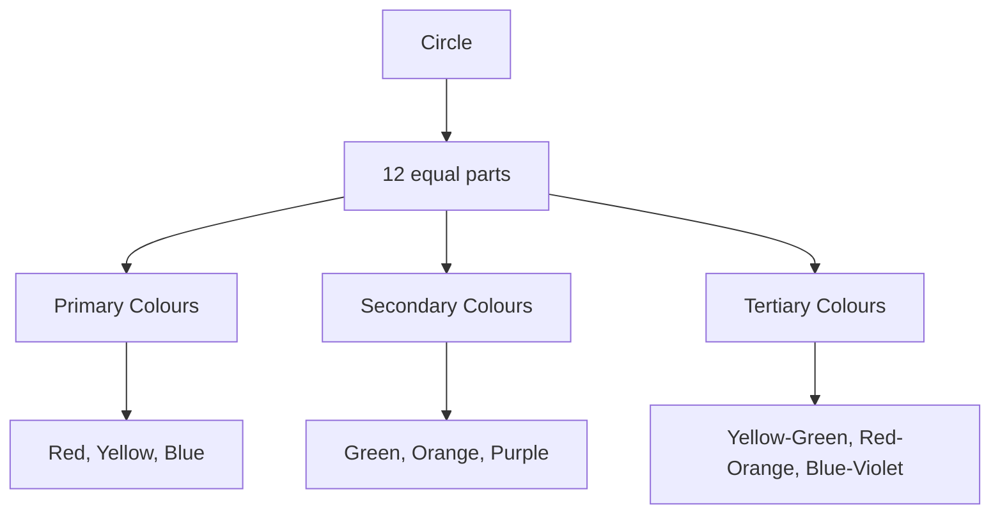

## 12.2. Preparation of sheet showing tints and shades.

### Introduction
**Tints and Shades** are variations of a base colour achieved by adding white (for tints) or black (for shades) to the base colour. Tints are lighter versions of the base colour, while shades are darker versions.

### Creating a Sheet Showing Tints and Shades
To prepare a sheet showing tints and shades, follow these steps:

1. **Select a Base Colour**: Choose a base colour, such as red.
2. **Add White (Tints)**: Gradually mix white to the base colour to create lighter tints.
3. **Add Black (Shades)**: Gradually mix black to the base colour to create darker shades.

### Example
> **Example:**  
> 
> 1. **Select a Base Colour**: Choose red.
> 2. **Add White (Tints)**: Mix white to the red to create lighter tints.
> 3. **Add Black (Shades)**: Mix black to the red to create darker shades.

### Mermaid Diagram
```mermaid
flowchart TD
    A[Base Colour: Red] --> B[Add White: Tints]
    A --> C[Add Black: Shades]
```

## 12.3. Preparation of sheet showing colour schemes with reference to theory.

### Introduction
**Colour schemes** are groups of colours that are harmonized together. They can be based on specific colour theories such as monochromatic, complementary, split-complementary, and analogous schemes.

### Monochromatic Scheme
A **monochromatic scheme** uses different shades and tints of a single base colour.

### Creating a Sheet Showing Monochromatic Scheme
To prepare a sheet showing a monochromatic scheme, follow these steps:

1. **Choose a Base Colour**: Select a base colour, such as blue.
2. **Create Tints and Shades**: Mix white and black to create lighter and darker shades of the base colour.

### Example
> **Example:**  
> 
> 1. **Choose a Base Colour**: Select blue.
> 2. **Create Tints and Shades**: Mix white and black to create lighter and darker shades of blue.

### Mermaid Diagram
```mermaid
flowchart TD
    A[Base Colour: Blue] --> B[Add White: Lighter Tints]
    A --> C[Add Black: Darker Shades]
```

## 2.7. Fiber Length

### Introduction
**Fiber length** is the measure of the length of a fibre. It is a critical property that affects the physical and mechanical properties of the fibre.

### Determining Fiber Length
To determine the fiber length, follow these steps:

1. **Collect Fibers**: Obtain a sample of fibres.
2. **Count Fibers**: Count the number of fibres over a known length.
3. **Calculate Length**: Calculate the average length of the fibres using the formula:
   \[
   \text{Fiber Length} = \frac{\text{Total Length of Fibres}}{\text{Number of Fibres}}
   \]

### Example
> **Example:**  
> 
> 1. **Collect Fibers**: Take 100 fibres from a sample.
> 2. **Count Fibers**: Measure the total length of these fibres to be 200 cm.
> 3. **Calculate Length**: \[
   \text{Fiber Length} = \frac{200 \text{ cm}}{100} = 2 \text{ cm}
   \]

## 2.8. Fiber Strength

### Introduction
**Fiber strength** is the force required to break a fibre. It is an important mechanical property that affects the durability and performance of the fibre.

### Determining Fiber Strength
To determine the fiber strength, follow these steps:

1. **Collect Fibers**: Obtain a sample of fibres.
2. **Tensile Test**: Use a tensile testing machine to measure the force required to break the fibres.
3. **Calculate Strength**: Calculate the fiber strength using the formula:
   \[
   \text{Fiber Strength} = \frac{\text{Force at Break}}{\text{Cross-sectional Area}}
   \]

### Example
> **Example:**  
> 
> 1. **Collect Fibers**: Take 50 fibres from a sample.
> 2. **Tensile Test**: Use a tensile testing machine to find the force required to break the fibres, which is 500 N.
> 3. **Calculate Strength**: The cross-sectional area is 0.001 m². \[
   \text{Fiber Strength} = \frac{500 \text{ N}}{0.001 \text{ m}^2} = 500000 \text{ N/m}^2
   \]

## 2.9. Flexibility

### Introduction
**Flexibility** is the ability of a fibre to bend without breaking. It is an important mechanical property that affects the comfort and durability of the fibre.

### Determining Flexibility
To determine the flexibility of a fibre, follow these steps:

1. **Collect Fibers**: Obtain a sample of fibres.
2. **Bend Test**: Bend the fibres to observe their behavior.
3. **Record Results**: Record the number of times the fibres can be bent before breaking.

### Example
> **Example:**  
> 
> 1. **Collect Fibers**: Take 20 fibres from a sample.
> 2. **Bend Test**: Bend the fibres and record the number of times they can be bent before breaking.
> 3. **Record Results**: The fibres can be bent 100 times before breaking.

## 2.10. Spinability

### Introduction
**Spinability** is the ability of a fibre to be spun into yarn or thread. It is an important mechanical property that affects the processing of the fibre.

### Determining Spinability
To determine the spinability of a fibre, follow these steps:

1. **Collect Fibers**: Obtain a sample of fibres.
2. **Spinning Test**: Spin the fibres to form yarn or thread.
3. **Record Results**: Record the ease with which the fibres can be spun.

### Example
> **Example:**  
> 
> 1. **Collect Fibers**: Take 15 fibres from a sample.
> 2. **Spinning Test**: Spin the fibres and record the ease with which they can be spun.
> 3. **Record Results**: The fibres can be easily spun into yarn.

## 2.11. Uniformity

### Introduction
**Uniformity** refers to the consistency of a fibre's properties, such as length, thickness, and strength. It is an important quality parameter that affects the performance of the fibre.

### Determining Uniformity
To determine the uniformity of a fibre, follow these steps:

1. **Collect Fibers**: Obtain a sample of fibres.
2. **Measure Properties**: Measure the properties of the fibres.
3. **Calculate Deviation**: Calculate the deviation from the average value.

### Example
> **Example:**  
> 
> 1. **Collect Fibers**: Take 50 fibres from a sample.
> 2. **Measure Properties**: Measure the length of each fibre.
> 3. **Calculate Deviation**: The average length is 2 cm, and the deviation is 0.1 cm.

## 2.12. Density

### Introduction
**Density** is the mass of a fibre per unit volume. It is an important physical property that affects the weight and volume of the fibre.

### Determining Density
To determine the density of a fibre, follow these steps:

1. **Collect Fibers**: Obtain a sample of fibres.
2. **Measure Mass and Volume**: Measure the mass and volume of the fibres.
3. **Calculate Density**: Calculate the density using the formula:
   \[
   \text{Density} = \frac{\text{Mass}}{\text{Volume}}
   \]

### Example
> **Example:**  
> 
> 1. **Collect Fibers**: Take 100 fibres from a sample.
> 2. **Measure Mass and Volume**: The total mass is 5 grams, and the total volume is 10 cubic centimeters.
> 3. **Calculate Density**: \[
   \text{Density} = \frac{5 \text{ g}}{10 \text{ cm}^3} = 0.5 \text{ g/cm}^3
   \]

## 2.13. Lustre

### Introduction
**Lustre** is the ability of a fibre to reflect light and give it a shiny appearance. It is an important aesthetic property that affects the appearance of the fibre.

### Determining Lustre
To determine the lustre of a fibre, follow these steps:

1. **Collect Fibers**: Obtain a sample of fibres.
2. **Light Test**: Shine a light on the fibres and observe the reflection.
3. **Record Results**: Record the shine and luster of the fibres.

### Example
> **Example:**  
> 
> 1. **Collect Fibers**: Take 30 fibres from a sample.
> 2. **Light Test**: Shine a light on the fibres and observe the reflection.
> 3. **Record Results**: The fibres have a high shine and luster.

## 2.14. Moisture & Moisture Regain

### Introduction
**Moisture** is the amount of water present in a fibre. **Moisture Regain** is the percentage of moisture in a fibre relative to the dry weight of the fibre.

### Determining Moisture and Moisture Regain
To determine the moisture and moisture regain of a fibre, follow these steps:

1. **Collect Fibers**: Obtain a sample of fibres.
2. **Measure Wet Weight**: Weigh the fibres after soaking in water.
3. **Measure Dry Weight**: Weigh the fibres after drying.
4. **Calculate Moisture**: Calculate the moisture using the formula:
   \[
   \text{Moisture} = \frac{\text{Wet Weight} - \text{Dry Weight}}{\text{Dry Weight}}
   \]
5. **Calculate Moisture Regain**: Calculate the moisture regain using the formula:
   \[
   \text{Moisture Regain} = \frac{\text{Moisture} \times 100}{\text{Dry Weight}}
   \]

### Example
> **Example:**  
> 
> 1. **Collect Fibers**: Take 100 grams of fibres.
> 2. **Measure Wet Weight**: The wet weight is 120 grams.
> 3. **Measure Dry Weight**: The dry weight is 80 grams.
> 4. **Calculate Moisture**: \[
   \text{Moisture} = \frac{120 \text{ g} - 80 \text{ g}}{80 \text{ g}} = 0.5 \text{ or } 50\%
   \]
5. **Calculate Moisture Regain**: \[
   \text{Moisture Regain} = \frac{0.5 \times 100}{80} = 62.5\%
   \]

## 2.15. Fiber Strength

### Introduction
**Fiber strength** is the force required to break a fibre. It is an important mechanical property that affects the durability and performance of the fibre.

### Determining Fiber Strength
To determine the fiber strength, follow these steps:

1. **Collect Fibers**: Obtain a sample of fibres.
2. **Tensile Test**: Use a tensile testing machine to measure the force required to break the fibres.
3. **Calculate Strength**: Calculate the fiber strength using the formula:
   \[
   \text{Fiber Strength} = \frac{\text{Force at Break}}{\text{Cross-sectional Area}}
   \]

### Example
> **Example:**  
> 
> 1. **Collect Fibers**: Take 50 fibres from a sample.
> 2. **Tensile Test**: Use a tensile testing machine to find the force required to break the fibres, which is 500 N.
> 3. **Calculate Strength**: The cross-sectional area is 0.001 m². \[
   \text{Fiber Strength} = \frac{500 \text{ N}}{0.001 \text{ m}^2} = 500000 \text{ N/m}^2
   \]

## 2.16. Fiber Length

### Introduction
**Fiber length** is the measure of the length of a fibre. It is a critical property that affects the physical and mechanical properties of the fibre.

### Determining Fiber Length
To determine the fiber length, follow these steps:

1. **Collect Fibers**: Obtain a sample of fibres.
2. **Count Fibers**: Count the number of fibres over a known length.
3. **Calculate Length**: Calculate the average length of the fibres using the formula:
   \[
   \text{Fiber Length} = \frac{\text{Total Length of Fibres}}{\text{Number of Fibres}}
   \]

### Example
> **Example:**  
> 
> 1. **Collect Fibers**: Take 100 fibres from a sample.
> 2. **Count Fibers**: Measure the total length of these fibres to be 200 cm.
> 3. **Calculate Length**: \[
   \text{Fiber Length} = \frac{200 \text{ cm}}{100} = 2 \text{ cm}
   \]

## 2.17. Fiber Fineness

### Introduction
**Fiber fineness** is the thickness of a fibre. It is an important physical property that affects the feel and appearance of the fibre.

### Determining Fiber Fineness
To determine the fiber fineness, follow these steps:

1. **Collect Fibers**: Obtain a sample of fibres.
2. **Measure Diameter**: Measure the diameter of the fibres.
3. **Calculate Fineness**: Calculate the fineness using the formula:
   \[
   \text{Fiber Fineness} = \frac{\text{Diameter}}{\text{Length}}
   \]

### Example
> **Example:**  
> 
> 1. **Collect Fibers**: Take 50 fibres from a sample.
> 2. **Measure Diameter**: The diameter of the fibres is 10 μm.
> 3. **Calculate Fineness**: The length of the fibres is 2 cm. \[
   \text{Fiber Fineness} = \frac{10 \text{ μm}}{200 \text{ μm}} = 0.05
   \]

## 2.18. Fiber Fineness

### Introduction
**Fiber fineness** is the thickness of a fibre. It is an important physical property that affects the feel and appearance of the fibre.

### Determining Fiber Fineness
To determine the fiber fineness, follow these steps:

1. **Collect Fibers**: Obtain a sample of fibres.
2. **Measure Diameter**: Measure the diameter of the fibres.
3. **Calculate Fineness**: Calculate the fineness using the formula:
   \[
   \text{Fiber Fineness} = \frac{\text{Diameter}}{\text{Length}}
   \]

### Example
> **Example:**  
> 
> 1. **Collect Fibers**: Take 50 fibres from a sample.
> 2. **Measure Diameter**: The diameter of the fibres is 10 μm.
> 3. **Calculate Fineness**: The length of the fibres is 2 cm. \[
   \text{Fiber Fineness} = \frac{10 \text{ μm}}{200 \text{ μm}} = 0.05
   \]

## 2.19. Fiber Fineness

### Introduction
**Fiber fineness** is the thickness of a fibre. It is an important physical property that affects the feel and appearance of the fibre.

### Determining Fiber Fineness
To determine the fiber fineness, follow these steps:

1. **Collect Fibers**: Obtain a sample of fibres.
2. **Measure Diameter**: Measure the diameter of the fibres.
3. **Calculate Fineness**: Calculate the fineness using the formula:
   \[
   \text{Fiber Fineness} = \frac{\text{Diameter}}{\text{Length}}
   \]

### Example
> **Example:**  
> 
> 1. **Collect Fibers**: Take 50 fibres from a sample.
> 2. **Measure Diameter**: The diameter of the fibres is 10 μm.
> 3
