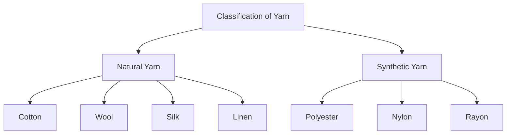
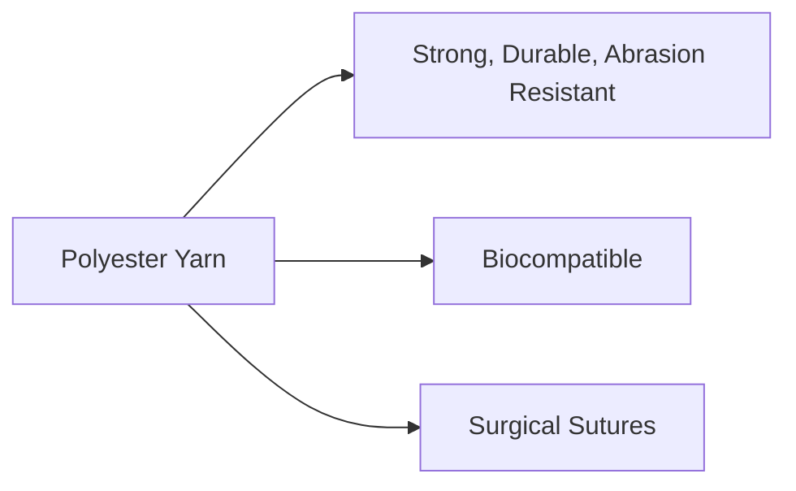
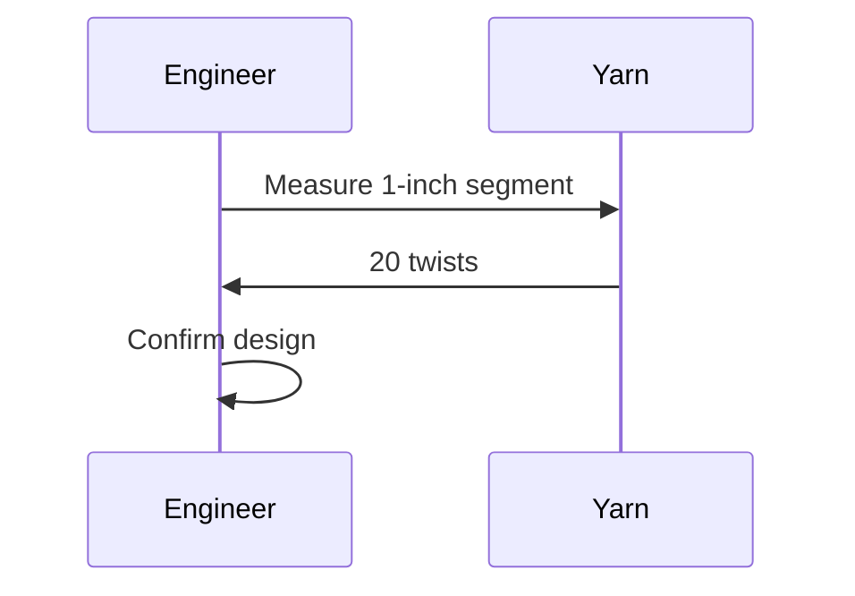

# Unit – null: YARNS

*(AI-generated self study book for GTU Diploma Biomedical Engineering, subject code 310004 — generated locally with Ollama.)*

This unit carries approximately ****.

Learning objectives covered by this unit:


## 4.1. Definition of Yarn

### Introduction
Yarn is a continuous strand of interlocked fibres used in the manufacture of fabrics and textiles. It is an essential component in the textile industry and is crucial in the production of various biomedical applications, including sutures and implants.

### Definition of Yarn
A **yarn** is a collection of fibres twisted or tangled together to form a continuous thread. The term "yarn" is derived from the Old English word "gearn," which means thread or filament. Yarns are classified based on their composition, twist, and manufacturing process.

#### Types of Yarn
- **Natural Yarn**: Made from natural fibres like cotton, wool, silk, and linen.
- **Synthetic Yarn**: Made from synthetic fibres like polyester, nylon, and rayon.

### Characteristics of Yarn
Yarns are characterized by several properties that determine their suitability for different applications. These properties include:

- **Diameter**: Measured in tex or denier, which indicates the thickness of the yarn.
- **Strength**: Determines the resistance of the yarn to breaking.
- **Flexibility**: Refers to the ease with which the yarn can be bent or folded.
- **Elasticity**: Measures the ability of the yarn to stretch and return to its original shape.

### Importance in Biomedical Engineering
In biomedical engineering, the selection of appropriate yarns is critical for the development of implants and sutures. The properties of the yarns must be carefully chosen to ensure they are biocompatible, strong, and flexible enough to be used safely in the human body.

#### Example:
> **Example:** A biomedical engineer needs to select a suitable yarn for a suture used in a surgical procedure. The engineer decides to use a 50 tex polyester yarn. This yarn is chosen because it has good strength, durability, and flexibility, making it ideal for surgical applications.

### Mermaid Diagram: Classification of Yarns


This diagram helps visualize the different types of yarns that can be used in biomedical applications. Each node represents a type of yarn, and the arrows indicate the classification into natural and synthetic yarns.

### Summary
In summary, a **yarn** is a continuous strand of interlocked fibres used in textile manufacturing. Its properties, such as diameter, strength, flexibility, and elasticity, are crucial in selecting yarns for biomedical applications. The example provided illustrates the importance of choosing the right yarn for specific biomedical uses.

---

## 4.2. Types of Yarn

### Classification of Yarn
Yarn is a natural or synthetic material that is spun into a continuous strand and used in the manufacturing of textiles and biomedical applications. Yarns are classified based on their composition, structure, and intended use. Here, we will discuss the different types of yarns and their applications.

#### **Natural Yarns**
Natural yarns are made from natural fibers such as cotton, wool, silk, and hemp. These yarns are biocompatible and can be used in various biomedical applications.

- **Cotton Yarn:** Cotton is one of the most common natural fibers used in yarns. It is soft, breathable, and hypoallergenic. Cotton yarn is often used in clothing and can be used in some biomedical applications, such as sutures.
- **Wool Yarn:** Wool is a natural protein fiber that is strong, durable, and has good thermal properties. It is used in yarns for clothing and can also be used in biomedical applications, such as wound dressings and absorbent materials.

#### **Synthetic Yarns**
Synthetic yarns are made from man-made fibers such as polyester, nylon, and polypropylene. These yarns are often used in biomedical applications due to their strength and durability.

- **Polyester Yarn:** Polyester is a synthetic fiber that is strong, durable, and resistant to abrasion. It is commonly used in biomedical applications, such as in surgical sutures and non-woven fabrics.
- **Nylon Yarn:** Nylon is a strong, flexible, and durable synthetic fiber. It is often used in biomedical applications, such as in vascular grafts and stents.
- **Polypropylene Yarn:** Polypropylene is a lightweight, strong, and durable synthetic fiber. It is used in biomedical applications, such as in hernia mesh and absorbent materials.

### Comparison of Natural and Synthetic Yarns
To compare the properties of natural and synthetic yarns, we can use a table format.

| Property          | Natural Yarns       | Synthetic Yarns     |
|-------------------|---------------------|---------------------|
| **Material**      | Natural fibers      | Synthetic fibers    |
| **Strength**      | Moderate            | High                |
| **Durability**    | Good                | Excellent           |
| **Biocompatibility** | High               | High                |
| **Cost**          | High                | Moderate to Low     |

### **Example:**
> **Example:** A biomedical engineer is required to select a suitable yarn for a new biomedical application. The application requires a strong, durable, and biocompatible material. The engineer decides to use **polyester yarn** because it is strong, durable, and resistant to abrasion, making it suitable for use in surgical sutures.



This diagram illustrates the properties and applications of polyester yarn.

---

## 4.3. Yarn Twist

### Definition
**Yarn twist** is the number of turns or rotations that a yarn makes per unit length. It is an important characteristic in the manufacturing and application of yarns, especially in textile and biomedical engineering. The twist can be either to the left (S-twist) or to the right (Z-twist). Twist in yarns influences various properties such as strength, flexibility, and durability.

### Importance in Biomedical Applications
In biomedical engineering, yarn twist is crucial in the production of medical textiles and biomedical implants. Proper twist ensures that the yarn is strong enough to withstand the stresses during manufacturing and use, while maintaining the necessary flexibility for patient comfort and functionality.

### Types of Twist
- **S-twist**: The yarn is twisted to the left when viewed from the end.
- **Z-twist**: The yarn is twisted to the right when viewed from the end.

### Example Requirement
To understand the importance of yarn twist, let's consider a practical example.

> **Example:** A biomedical engineer is designing a surgical mesh that requires a specific strength and flexibility. The engineer decides to use a yarn with a twist of 20 twists per inch. To verify this decision, the engineer measures the twist by cutting a 1-inch segment of the yarn and counting the number of twists. If the yarn has 20 twists, the design is confirmed to be correct.

### Calculation of Twist
The twist in yarn can be calculated using the formula:
\[ \text{Twist (turns per inch)} = \frac{\text{Number of twists}}{\text{Length of yarn (inches)}} \]

For instance, if a 6-inch segment of yarn has 120 twists, the twist can be calculated as:
\[ \text{Twist} = \frac{120 \text{ twists}}{6 \text{ inches}} = 20 \text{ twists per inch} \]

### Sequence of Twist
To illustrate the sequence of twist, consider the following sequence diagram:


### Classification of Yarn Twist
Yarn twist can be classified based on the number of twists per unit length:
- **Low Twist**: 5-10 twists per inch
- **Medium Twist**: 10-20 twists per inch
- **High Twist**: 20-30 twists per inch

### Practical Example
> **Example:** An engineer is selecting a yarn for a new implant. The requirement is a medium twist to ensure good strength and flexibility. The engineer selects a yarn with 15 twists per inch, which falls within the medium twist category.

### Conclusion
Understanding and correctly applying yarn twist is essential in the design and manufacturing of biomedical implants and textiles. Proper twist ensures the necessary strength and flexibility, making the final product suitable for its intended use.

---

## 4.4. Yarn Count (Definition, Unit of Yarn Count)

### Definition of Yarn Count

**Yarn count** refers to a measure of the thickness or fineness of yarn. This measurement is crucial in textile engineering as it directly influences the quality and durability of the fabric.

### Unit of Yarn Count

The **unit of yarn count** is typically expressed in terms of the weight of a certain length of yarn. The most common units used are **circular count** and **linear count**.

- **Circular Count (Ne)**: This unit is based on the weight of 1000 meters of yarn. The higher the Ne value, the finer the yarn.
- **Linear Count (Nt)**: This unit is based on the weight of 1 meter of yarn. The higher the Nt value, the finer the yarn.

### Example

> **Example:** 
>
> Suppose we have a yarn with a circular count of 40 Ne. This means that 1000 meters of this yarn weighs 40 grams. If we wanted to find the linear count of this yarn, we would use the following calculation:
>
> \[
> \text{Linear Count (Nt)} = \frac{\text{Circular Count (Ne)}}{1000}
> \]
>
> \[
> \text{Linear Count (Nt)} = \frac{40}{1000} = 0.04 \, \text{grams per meter}
> \]
>
> Therefore, a yarn with a circular count of 40 Ne has a linear count of 0.04 grams per meter.

### Flowchart for Converting Yarn Count Units

```mermaid
flowchart TD
    A[Input: Circular Count (Ne)] --> B[1000]
    B --> C[Output: Linear Count (Nt)]
    A --> D[1]
    D --> C
    C --> E[Output: Linear Count (Nt)]
    E --> F[grams per meter]
    C --> G[grams per 1000 meters]
    G --> H[grams per meter]
```

In the above flowchart, the conversion from circular count to linear count is shown. The circular count is divided by 1000 to get the linear count in grams per meter.

### Summary

In summary, yarn count is a measure of the thickness of yarn, and it is expressed in units such as circular count (Ne) and linear count (Nt). Understanding these units is essential for selecting appropriate yarns for different textile applications.
