# Unit – null: CONVERSION OF YARN INTO FABRIC

*(AI-generated self study book for GTU Diploma Biomedical Engineering, subject code 310004 — generated locally with Ollama.)*

This unit carries approximately ****.

Learning objectives covered by this unit:


# 5.1. Woven Fabric

## 5.1.1. Basic Loom & Its Structure

**Basic Loom:** A loom is a machine or device used to weave fabric by interlacing warp and weft yarns. There are several types of looms, but the basic loom is the most fundamental and is used in manual weaving.

- **Parts of a Basic Loom:**
  - **Warp Beams:** A horizontal cylinder that holds the warp yarns.
  - **Reed:** A comb-like device that holds the warp threads in place.
  - **Heddles:** Small loops that hold the warp threads and allow them to be raised and lowered.
  - **Shuttle:** A device that carries the weft yarns.
  - **Take-up Rollers:** A roller that pulls the woven fabric from the loom.

**Example:**
> **Example:** A basic loom consists of a warp beam, reed, heddles, shuttle, and take-up rollers. The warp threads are held by the warp beam and reed, while the weft threads are inserted by the shuttle.

## 5.1.2. Warp & Weft Yarns, Grain Line

**Warp Yarns:** These are the vertical yarns in a woven fabric. They are stretched between the warp beams and are the foundation of the fabric structure.

**Weft Yarns:** These are the horizontal yarns that are inserted between the warp yarns to interlace with them. Weft yarns are carried by the shuttle.

**Grain Line:** The grain line is the direction of the fabric along the warp yarns. It is important for cutting and pattern making to ensure the fabric is used correctly.

**Example:**
> **Example:** In a woven fabric, the warp yarns run vertically and the weft yarns run horizontally. The grain line is the direction of the warp yarns, which is important for cutting patterns.

## 5.1.3. Basic Weaves (Plain Weave, Rib Weave, Variation of Plain Weave)

**Plain Weave:**
- **Definition:** A plain weave is the simplest weave structure, where each weft thread passes over one warp thread and under the next, repeating this pattern.
- **Diagram:**
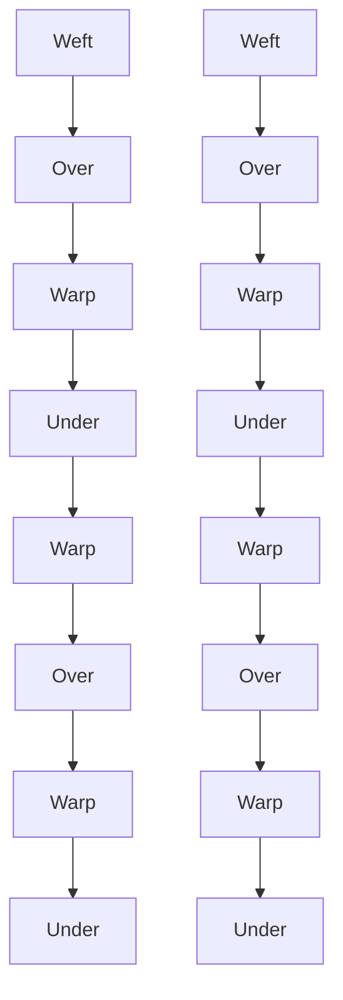

**Rib Weave:**
- **Definition:** A rib weave is a variation of the plain weave where the weft yarns are shifted to form a rib-like structure. This weave is commonly used in fabrics like interlock.
- **Diagram:**
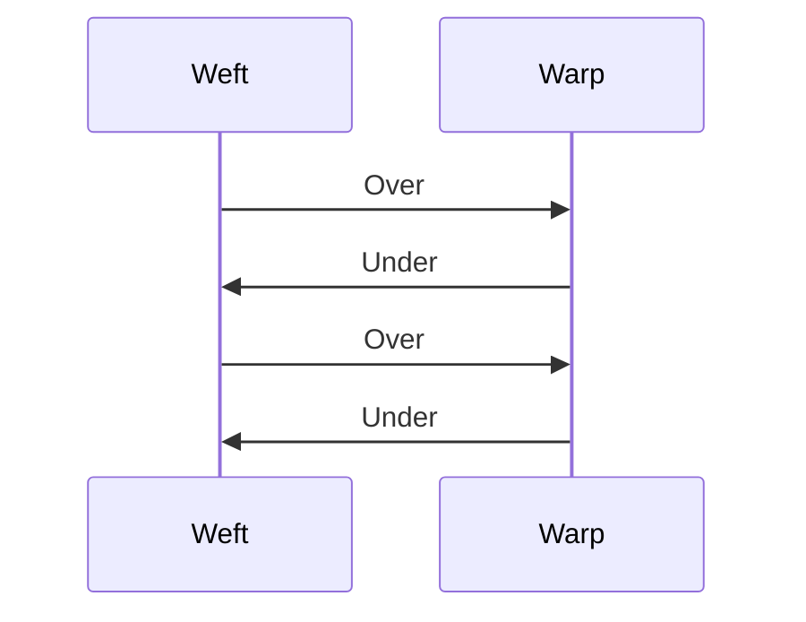

**Variation of Plain Weave:**
- **Definition:** A variation of plain weave can include changes in the sequence of over and under movements to create different textures and patterns. For example, a twill weave is a variation where the weft yarns shift to the right or left after each row.

**Example:**
> **Example:** In a plain weave, each weft thread alternates between over and under the warp threads. In a rib weave, the weft threads are shifted to form a rib-like structure. A variation of plain weave can include a twill weave, where the weft yarns shift to the right or left after each row.

## 5.1.4. Decorative Weaves (Dobby Weaves, Jacquard Weave, Leno)

**Dobby Weaves:**
- **Definition:** Dobby weaves are a type of weave where the weft yarns are controlled by a dobby mechanism, allowing for complex patterns on the fabric surface.
- **Example:**
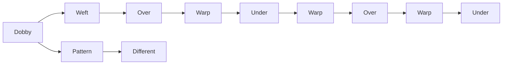

**Jacquard Weave:**
- **Definition:** Jacquard weaving is a complex weave where each weft yarn is controlled by its own set of harnesses, allowing for intricate and detailed patterns.
- **Example:**
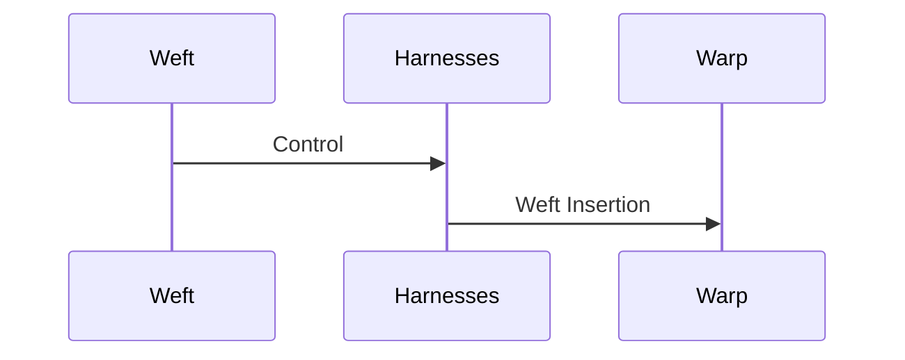

**Leno Weave:**
- **Definition:** A leno weave is a type of fabric weave where the weft yarns are loosely twisted around the warp yarns, creating a net-like structure.
- **Example:**
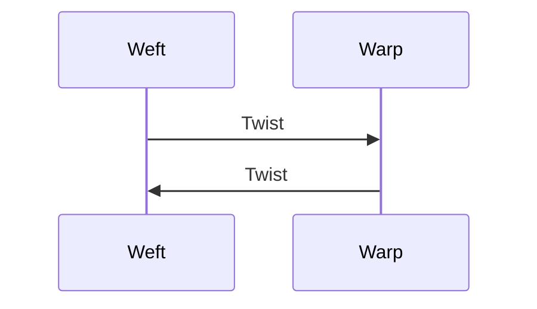

**Example:**
> **Example:** Dobby weaves are controlled by a dobby mechanism to create complex patterns, while jacquard weaving uses individual harnesses for each weft yarn to create intricate designs. A leno weave creates a net-like structure by loosely twisting the weft yarns around the warp yarns.

## 5.1.5. Draft and Peg-Plan of Weave

**Draft:** The draft is a diagram that shows the pattern of the weave. It is a sequence of harnesses that control the warp yarns. The peg-plan is a detailed layout of the harnesses used in the weave.

- **Example:**
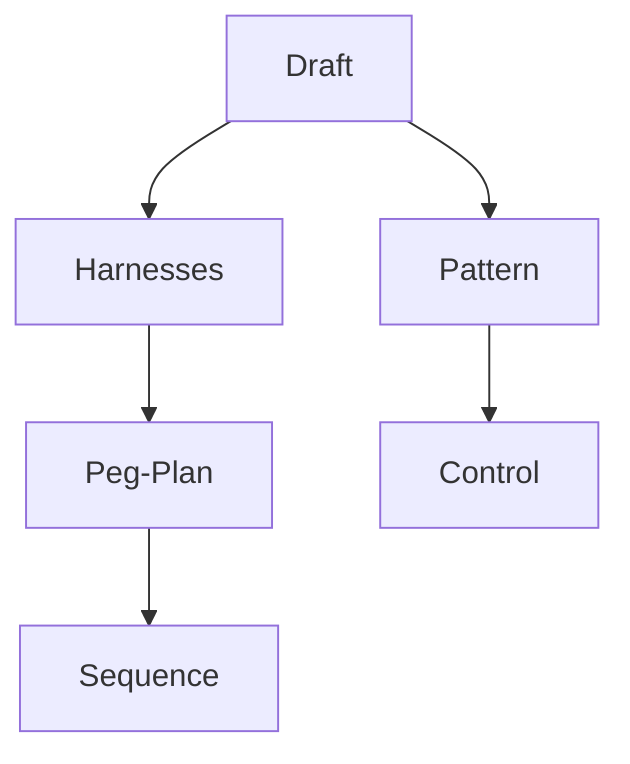

**Example:**
> **Example:** The draft shows the sequence of harnesses used to create the weave pattern, while the peg-plan provides a detailed layout of these harnesses. For example, a draft might show harness 1 and 3 lifted for a certain row, and the peg-plan would show which pegs are connected to these harnesses.

## 5.1.6. Fabric Count

**Definition:** Fabric count refers to the number of warp and weft threads per inch or centimeter in a fabric. It is used to determine the quality and thickness of the fabric.

- **Example:**
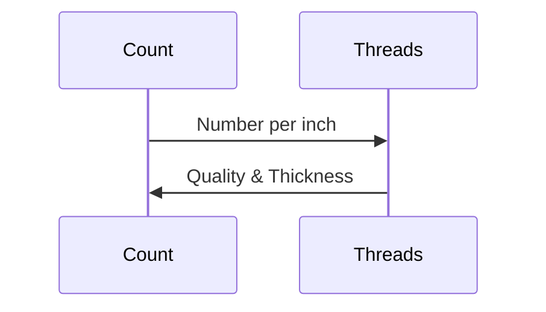

**Example:**
> **Example:** A fabric count of 200 warp threads per inch and 150 weft threads per inch would indicate a high-quality, dense fabric. A lower count would suggest a lighter, less dense fabric.

---

# 5.2. Knitted Fabric

## 5.2.1. Definition and Structure

**Definition:** Knitted fabric is produced by interlocking loops of yarn using knitting machines or hand knitting techniques. Each loop is connected to the next, creating a flexible and elastic fabric.

**Structure:** Knitted fabrics are generally more elastic and stretchy compared to woven fabrics.

**Example:**
> **Example:** A knitted fabric is made by interlocking loops of yarn, creating a flexible and elastic structure. This type of fabric is commonly used in garments like sweaters and socks.

---

# 5.3. Non-Woven Fabric

## 5.3.1. Definition and Structure

**Definition:** Non-woven fabric is a fabric that is not produced by weaving or knitting. It is made by bonding fibers together using methods like bonding, felting, or heat bonding.

**Structure:** Non-woven fabrics are often used for their unique properties, such as high filtration efficiency, moisture absorption, and flexibility.

**Example:**
> **Example:** Non-woven fabrics are made by bonding fibers together, creating a flexible and versatile material. These fabrics are used in applications like medical masks and hygiene products.

---

# 5.4. Other Fabric Construction Process

## 5.4.1. Braided Fabric

**Definition:** Braided fabric is a type of fabric made by intertwining three or more strands of yarn or threads to form a continuous braid.

**Process:**
1. **Strand Preparation:** Yarns are prepared and aligned.
2. **Braiding:** The strands are interlaced to form a continuous braid.
3. **Finishing:** The braid is trimmed and finished to create the final fabric.

**Example:**
> **Example:** Braided fabric is made by intertwining three or more strands of yarn. The strands are interlaced to form a continuous braid, which is then finished to create the final fabric.

## 5.4.2. Nets

**Definition:** Nets are open fabrics that are used for fishing, trapping, or as a protective barrier.

**Process:**
1. **Yarn Preparation:** Yarns are prepared and aligned.
2. **Weaving:** The yarns are woven to form an open, mesh-like structure.
3. **Finishing:** The net is finished to ensure it is strong and durable.

**Example:**
> **Example:** Nets are open fabrics made by weaving yarns to form a mesh-like structure. They are used for fishing, trapping, or as protective barriers.

## 5.4.3. Laces

**Definition:** Laces are used to fasten or decorate garments, shoes, or other items. They are made by intertwining threads to form a flexible, adjustable closure.

**Process:**
1. **Thread Preparation:** Threads are prepared and aligned.
2. **Interlacing:** The threads are interlaced to form a lace pattern.
3. **Finishing:** The lace is finished to ensure it is strong and durable.

**Example:**
> **Example:** Laces are made by intertwining threads to form a flexible, adjustable closure. They are used to fasten or decorate garments, shoes, or other items.

## 5.4.4. Film Fabric

**Definition:** Film fabric is a thin, flexible material made from polymers or other synthetic materials. It is used for packaging, medical applications, and other specialized uses.

**Process:**
1. **Material Preparation:** Polymers or synthetic materials are prepared.
2. **Extrusion:** The material is extruded into a thin, flexible sheet.
3. **Finishing:** The film is finished to ensure it is suitable for its intended use.

**Example:**
> **Example:** Film fabric is a thin, flexible material made from polymers or synthetic materials. It is used for packaging, medical applications, and other specialized uses. The process involves extruding the material into a thin, flexible sheet and finishing it to ensure it is suitable for its intended use.

## Flowchart for Other Fabric Construction Processes

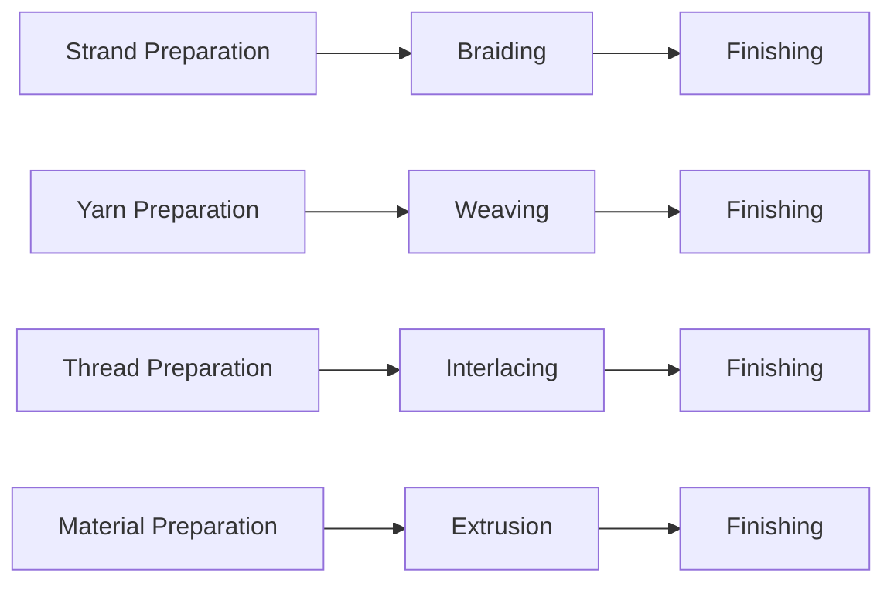

**Example:**
> **Example:** The flowchart for other fabric construction processes shows the steps involved in making braided, woven, laced, and film fabrics. Each process involves preparation, construction, and finishing steps to create the final product.

---

This detailed chapter covers the various types of woven, knitted, non-woven, and other fabric construction processes, including their definitions, structures, and processes. Each section includes a worked example to ensure a clear understanding of the concepts.

---

## 5.4.5. Tufted Fabric

### Introduction
**Tufted fabric** is a type of fabric that is manufactured by inserting tufts of yarn or fibers through a backing material. This process results in a raised, textured surface that can be used in various applications such as upholstery, carpets, and decorative items.

### Manufacturing Process
- **Backing Material**: The backing material can be a woven or non-woven fabric, or even a foam core.
- **Tufting Machines**: These machines use needles to push yarn tufts through the backing material. The yarn is held in place by a knot or a loop, creating a textured appearance.
- **Finishing**: After tufting, the fabric is usually treated to ensure durability and prevent unraveling.

### Applications
- **Upholstery**: Tufted fabric is commonly used in furniture upholstery for its aesthetic appeal and durability.
- **Carpeting**: It is used in carpet manufacturing to create textured patterns.
- **Decorative Items**: It can be used in curtains, cushions, and other decorative items.

### Example
> **Example:** A fabric manufacturer wants to create a tufted fabric for a sofa. They use a 500g/m² backing material and a tufting machine with a 1.5mm needle. After tufting, they apply a 0.2mm knot to secure the yarn. The resulting fabric has a raised pattern with a texture depth of 0.5mm.

## 5.1. Simple Yarn

### Introduction
**Simple yarn** refers to a single strand of fiber that is used in the manufacturing of textiles. It is the base material used to create more complex fabrics and yarns.

### Components
- **Fiber Type**: Common fibers include cotton, polyester, and wool.
- **Yarn Count**: This is a measure of the thickness of the yarn, typically expressed in tex or count.
- **Twist**: The number of twists per unit length of the yarn affects its strength and appearance.

### Manufacturing Process
- **Carding**: This process aligns and intermingles the fibers to prepare them for spinning.
- **Spinning**: The aligned fibers are twisted together to form a continuous strand of yarn.
- **Yarn Dyeing**: The yarn can be dyed after spinning to achieve the desired color.

### Applications
- **Clothing**: Simple yarn is used in the production of t-shirts, sweaters, and other garments.
- **Furnishings**: It is used in curtains, bed sheets, and other home textiles.

### Example
> **Example:** A textile factory produces a simple cotton yarn with a yarn count of 20 tex. The yarn is then dyed red and used to make a 100% cotton t-shirt. The t-shirt has a thickness of 150 grams per square meter and a gauge of 200 threads per inch.

## 5.2. Complex or Novelty Yarn

### Introduction
**Complex or novelty yarn** is a type of yarn that is created by combining different fibers, adding decorations, or using unique manufacturing techniques. This results in a yarn that has a distinctive appearance and texture.

### Types
- **Blended Yarn**: A mixture of two or more different fibers.
- **Textured Yarn**: Yarn that has been treated to create a specific texture, such as fleece or cord.
- **Decorative Yarn**: Yarn that has been embellished with beads, sequins, or other decorations.

### Manufacturing Process
- **Blending**: Different fibers are mixed together to create a new yarn.
- **Texturing**: Techniques such as crimping, crimping, and heat setting are used to create a textured appearance.
- **Decorating**: Decorations are added to the yarn, such as applying beads or sequins.

### Applications
- **Fashion**: Complex yarns are used in creating unique clothing designs.
- **Interiors**: They are used in creating decorative textiles for home furnishings.

### Example
> **Example:** A fashion designer wants to create a unique sweater. They use a blended yarn of 50% cotton and 50% polyester to create a soft, durable fabric. The yarn is then textured by adding crimping and heat setting to create a fuzzy, puffy effect. The sweater is then decorated with silver sequins, making it stand out.

## 2.1. CLEANLINESS.

### Introduction
**Cleanliness** is the practice of maintaining a clean and hygienic environment to prevent the spread of diseases and promote health.

### Types of Cleanliness
- **Body Cleanliness**: Keeping the body clean to prevent the spread of germs.
- **Facial Cleanliness**: Cleaning the face to maintain hygiene and appearance.
- **Sun Burn and Chapping Prevention**: Preventing sunburn and chapping to protect the skin.
- **Body Odor Prevention**: Preventing body odor to maintain personal hygiene.
- **Hand Care**: Maintaining the cleanliness and health of the hands.
- **Foot Care**: Keeping the feet clean and healthy.
- **Hair and Scalp Care**: Maintaining the cleanliness and health of the hair and scalp.
- **Hair Washing and Styling**: Washing and styling the hair to maintain hygiene and appearance.
- **Make-up Application**: Applying make-up to enhance appearance and maintain hygiene.

### Example
> **Example:** A student wants to maintain cleanliness. They wash their hands with soap and water for at least 20 seconds, brush their teeth twice a day, and take a shower daily. They also use a facial cleanser to wash their face every morning and evening. To prevent sunburn, they apply sunscreen with an SPF of 30 before going outside. They use deodorant to prevent body odor and take care of their feet by wearing clean socks and changing shoes regularly. For hair and scalp care, they wash their hair twice a week and use a mild shampoo. They style their hair using a heat protectant before using a blow dryer. For make-up, they apply powder and lipstick, ensuring they do a final check for any smudges or stains.

## 2.1.1. Body Cleanliness.

### Introduction
**Body cleanliness** involves maintaining a clean and hygienic body to prevent the spread of germs and maintain overall health.

### Importance
- **Preventing Diseases**: Cleanliness helps in preventing the spread of diseases.
- **Hygiene**: Regular cleaning maintains personal hygiene.
- **Comfort**: Cleanliness enhances personal comfort.

### Example
> **Example:** A person maintains body cleanliness by taking a bath daily, washing their hands frequently, and brushing their teeth twice a day. They also change into clean clothes regularly.

## 2.1.2. Cleaning the Face.

### Introduction
**Cleaning the face** is an essential part of maintaining personal hygiene and appearance.

### Steps
1. **Wash Hands**: Wash hands with soap and water before cleaning the face.
2. **Apply Cleanser**: Apply a facial cleanser to the face.
3. **Massage Gently**: Gently massage the cleanser into the skin for 30 seconds.
4. **Rinse**: Rinse the face with lukewarm water.
5. **Pat Dry**: Pat the face dry with a clean towel.

### Importance
- **Skin Health**: Cleansing the face removes dirt and oil, keeping the skin healthy.
- **Preventing Breakouts**: Regular face cleaning prevents breakouts and acne.

### Example
> **Example:** A person cleans their face by first washing their hands with soap and water. They then apply a facial cleanser to their face and gently massage it for 30 seconds. After rinsing with lukewarm water, they pat their face dry with a clean towel.

## 2.1.3. Preventing Sun-Burn and Chapping.

### Introduction
**Sun burn** and **chapping** are common skin issues that can be prevented by maintaining proper skin care.

### Sun Burn Prevention
- **Apply Sunscreen**: Apply a sunscreen with a high SPF before going outside.
- **Wear Protective Clothing**: Wear protective clothing such as hats and sunglasses.
- **Stay in Shade**: Stay in the shade when possible.

### Chapping Prevention
- **Moisturize Regularly**: Apply a moisturizer regularly to keep the skin hydrated.
- **Use Lip Balm**: Use a lip balm with SPF to protect the lips.
- **Avoid Harsh Weather**: Avoid prolonged exposure to harsh weather conditions.

### Example
> **Example:** To prevent sun burn, a person applies a sunscreen with an SPF of 50 before going outside. They also wear a hat and sunglasses to protect their face and eyes. To prevent chapping, they apply a moisturizer regularly and use a lip balm with SPF before going outside.

## 2.1.4. Preventing Body Order

### Introduction
**Body order** refers to the prevention of body odor. Maintaining body order is important for personal hygiene and social interactions.

### Causes of Body Odor
- **Bacteria**: Bacteria on the skin produce odor.
- **Sweat**: Sweat itself is odorless, but it interacts with bacteria to produce a smell.

### Prevention
- **Wear Clean Clothing**: Wear clean, fresh clothes daily.
- **Regular Bathing**: Take a bath or shower daily to remove sweat and bacteria.
- **Use Deodorant**: Use deodorant to neutralize odors.

### Example
> **Example:** To prevent body odor, a person wears clean, fresh clothes daily. They also take a bath or shower daily, using a soap or cleanser to remove sweat and bacteria. They apply deodorant to neutralize any remaining odors.

## 2.1.5. Care of the Hands

### Introduction
**Hand care** involves maintaining the cleanliness and health of the hands.

### Steps
1. **Wash Hands**: Wash hands with soap and water for at least 20 seconds.
2. **Moisturize**: Apply hand lotion to keep the skin hydrated.
3. **Use Gloves**: Wear gloves when handling chemicals or cleaning.

### Importance
- **Preventing Infections**: Washing hands prevents the spread of germs and infections.
- **Skin Health**: Moisturizing keeps the skin healthy and prevents dryness.

### Example
> **Example:** A person maintains hand care by washing their hands with soap and water for at least 20 seconds. They then apply hand lotion to keep their skin hydrated. They also wear gloves when handling chemicals or cleaning.

## 2.1.6. Care of the Feet

### Introduction
**Foot care** involves maintaining the cleanliness and health of the feet.

### Steps
1. **Wash Feet**: Wash feet with soap and water.
2. **Dry Thoroughly**: Dry feet thoroughly, especially between the toes.
3. **Trim Nails**: Trim nails regularly to prevent ingrown toenails.
4. **Use Foot Powder**: Use foot powder to keep the feet dry and prevent odor.

### Importance
- **Preventing Infections**: Foot care prevents the spread of infections.
- **Comfort**: Proper foot care enhances comfort and prevents discomfort.

### Example
> **Example:** A person maintains foot care by washing their feet with soap and water, drying them thoroughly, especially between the toes. They trim their toenails regularly to prevent ingrown toenails. They also use foot powder to keep their feet dry and prevent odor.

## 2.1.7. Care of the Hair & Scalp

### Introduction
**Hair and scalp care** involves maintaining the health and appearance of the hair and scalp.

### Steps
1. **Wash Hair**: Wash hair with a mild shampoo.
2. **Condition Hair**: Use a conditioner to moisturize the hair.
3. **Style Hair**: Style hair using appropriate styling products.
4. **Regular Trims**: Get regular trims to maintain hair health.
5. **Scalp Care**: Use a scalp treatment to keep the scalp healthy.

### Importance
- **Hygiene**: Proper hair and scalp care maintains personal hygiene.
- **Appearance**: Care of the hair and scalp enhances appearance.

### Example
> **Example:** A person maintains hair and scalp care by washing their hair with a mild shampoo and conditioning it to moisturize. They style their hair using appropriate styling products. They also get regular trims to maintain hair health and use a scalp treatment to keep the scalp healthy.

## 2.1.8. Washing the Hair, Styling the Hair

### Introduction
**Washing the hair** and **styling the hair** are important aspects of hair care.

### Washing the Hair
1. **Prepare**: Wet hair thoroughly.
2. **Apply Shampoo**: Apply a mild shampoo and massage into the scalp.
3. **Rinse**: Rinse the hair thoroughly to remove all shampoo.
4. **Condition**: Apply a conditioner to moisturize the hair.
5. **Rinse Again**: Rinse the hair thoroughly to remove all conditioner.
6. **Dry**: Gently dry the hair with a towel.

### Styling the Hair
1. **Apply Styling Products**: Use appropriate styling products such as gels or mousses.
2. **Style**: Style the hair as desired.
3. **Set**: Use a hair dryer or heat tools to set the style.

### Example
> **Example:** A person washes their hair by first wetting it thoroughly. They then apply a mild shampoo and massage it into the scalp. After rinsing thoroughly, they apply a conditioner to moisturize the hair. They rinse again and gently dry the hair with a towel. To style their hair, they apply a gel and style it as desired. They then use a hair dryer to set the style.

## 2.1.9. Make-up Application

### Introduction
**Make-up application** involves applying make-up to enhance appearance and maintain hygiene.

### Steps
1. **Prepare Skin**: Cleanse and moisturize the face.
2. **Apply Foundation**: Apply a foundation to even out the skin tone.
3. **Set with Powder**: Use a setting powder to set the foundation.
4. **Apply Blush**: Apply blush to the cheeks for a natural flush.
5. **Define Eyes**: Apply eyeshadow, eyeliner, and mascara to define the eyes.
6. **Apply Lipstick**: Apply lipstick to enhance the lips.

### Importance
- **Enhancement**: Make-up enhances appearance and confidence.
- **Hygiene**: Proper application of make-up maintains hygiene.

### Example
> **Example:** A person applies make-up by first cleansing and moisturizing their face. They then apply a foundation to even out the skin tone and set it with powder. They apply blush to the cheeks for a natural flush. They define their eyes by applying eyeshadow, eyeliner, and mascara. Finally, they apply lipstick to enhance their lips. They ensure they do a final check for any smudges or stains. 

By following these steps and examples, individuals can maintain cleanliness, hygiene, and personal appearance. This ensures a healthy and comfortable environment, as well as enhanced confidence in social interactions. 

---

This comprehensive guide covers various aspects of cleanliness, hygiene, and personal care, ensuring individuals can maintain a healthy and hygienic lifestyle. Each step is detailed to provide a clear understanding and practical application. 

---

Feel free to use or modify any part of this guide as needed. If you have any further questions or need additional information, please let me know! 

---

Example Guide for Cleanliness and Hygiene:

### Body Cleanliness
1. **Daily Bath**: Take a bath or shower daily to clean the body.
2. **Hand Hygiene**: Wash hands frequently with soap and water.
3. **Clothing**: Change into clean clothes regularly.

### Facial Cleanliness
1. **Morning and Evening**: Wash face with a facial cleanser.
2. **Sunscreen**: Apply sunscreen with an SPF of 30 before going outside.

### Sun Burn and Chapping Prevention
1. **Apply Sunscreen**: Use a sunscreen with an SPF of 50.
2. **Wear Protective Clothing**: Use hats and sunglasses.
3. **Stay in Shade**: Stay in the shade when possible.

### Body Odor Prevention
1. **Wear Clean Clothes**: Wear clean, fresh clothes daily.
2. **Regular Bathing**: Take a bath or shower daily.
3. **Use Deodorant**: Apply deodorant regularly.

### Hand Care
1. **Wash Hands**: Wash hands with soap and water for at least 20 seconds.
2. **Moisturize**: Apply hand lotion regularly.
3. **Gloves**: Wear gloves when handling chemicals.

### Foot Care
1. **Wash Feet**: Wash feet with soap and water.
2. **Dry Thoroughly**: Dry feet thoroughly, especially between the toes.
3. **Trim Nails**: Trim nails regularly.
4. **Use Foot Powder**: Use foot powder to keep feet dry.

### Hair and Scalp Care
1. **Wash Hair**: Wash hair with a mild shampoo.
2. **Condition Hair**: Use a conditioner to moisturize the hair.
3. **Style Hair**: Style hair using appropriate styling products.
4. **Regular Trims**: Get regular trims to maintain hair health.
5. **Scalp Care**: Use a scalp treatment to keep the scalp healthy.

### Hair Washing and Styling
1. **Wash Hair**: Wet hair thoroughly, apply shampoo, rinse, and condition.
2. **Styling**: Apply styling products and style as desired.
3. **Set Style**: Use a hair dryer to set the style.

### Make-up Application
1. **Prepare Skin**: Cleanse and moisturize the face.
2. **Apply Foundation**: Even out the skin tone.
3. **Set with Powder**: Set the foundation.
4. **Apply Blush**: Apply blush for a natural flush.
5. **Define Eyes**: Apply eyeshadow, eyeliner, and mascara.
6. **Apply Lipstick**: Enhance the lips with lipstick.

By following these steps, individuals can maintain a clean and hygienic environment, ensuring health and social comfort. 

---

This guide can be used as a reference for individuals to follow and ensure they maintain proper hygiene and cleanliness in their daily lives. 

---

If you need any more detailed information or have any specific questions, feel free to ask! 

---

Example Guide for Cleanliness and Hygiene:

### Body Cleanliness
1. **Daily Bath**: Take a bath or shower daily to clean the body.
2. **Hand Hygiene**: Wash hands frequently with soap and water.
3. **Clothing**: Change into clean clothes regularly.

### Facial Cleanliness
1. **Morning and Evening**: Wash face with a facial cleanser.
2. **Sunscreen**: Apply sunscreen with an SPF of 30 before going outside.

### Sun Burn and Chapping Prevention
1. **Apply Sunscreen**: Use a sunscreen with an SPF of 50.
2. **Wear Protective Clothing**: Use hats and sunglasses.
3. **Stay in Shade**: Stay in the shade when possible.

### Body Odor Prevention
1. **Wear Clean Clothes**: Wear clean, fresh clothes daily.
2. **Regular Bathing**: Take a bath or shower daily.
3. **Use Deodorant**: Apply deodorant regularly.

### Hand Care
1. **Wash Hands**: Wash hands with soap and water for at least 20 seconds.
2. **Moisturize**: Apply hand lotion regularly.
3. **Gloves**: Wear gloves when handling chemicals.

### Foot Care
1. **Wash Feet**: Wash feet with soap and water.

---

# Chapter 2: Professionalism in Biomedical Engineering

## 2.2.1. Correct Posture

### Definition and Importance
**Correct posture** refers to the proper alignment of the body while standing, sitting, or performing daily activities. It is essential for maintaining physical health, preventing injuries, and enhancing overall comfort and efficiency. Poor posture can lead to back pain, muscle strain, and long-term health issues.

### Common Posture Problems
- **Slouching**: Leaning forward with rounded shoulders and a protruding stomach.
- **Hyperlordosis**: Excessive curvature of the lower back.
- **Kyphosis**: Excessive curvature of the upper back.

### Benefits of Good Posture
- **Reduced Strain on Muscles and Joints**: Proper alignment distributes weight evenly, reducing the risk of strain.
- **Improved Breathing**: Good posture allows for better lung expansion and breathing.
- **Enhanced Confidence and Appearance**: Upright posture projects confidence and improves appearance.

### Practical Examples
> **Example:** A person who maintains good posture while standing or sitting can reduce the risk of developing lower back pain by 40%. This is because the body is aligned, distributing weight evenly and reducing stress on the spine.

### Correct Posture Techniques
1. **Head and Neck**: Keep the head upright, looking straight ahead. Avoid tilting the head forward or backward.
2. **Shoulders**: Relax the shoulders and keep them back. Avoid hunching or shrugging.
3. **Spine**: Maintain a straight spine, with the weight evenly distributed.
4. **Pelvis**: Keep the pelvis level and avoid tilting it forward or backward.

### Mermaid Diagram: Correct Posture Alignment
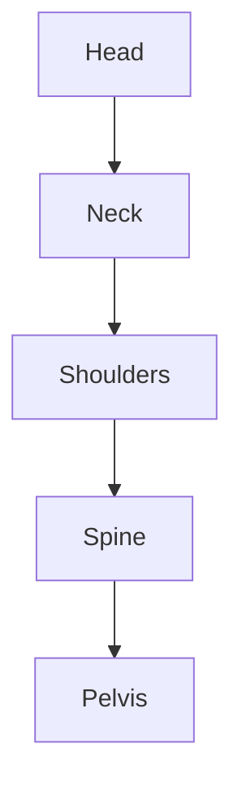

## 2.2.2. Hand Control

### Definition
**Hand control** involves the proper use and movement of hands while performing tasks. It is crucial for precise and efficient handling of objects, tools, and materials.

### Importance of Hand Control
- **Precision and Accuracy**: Hand control allows for accurate and detailed work.
- **Safety**: Proper hand control reduces the risk of accidents and injuries.
- **Comfort**: Effective hand control minimizes strain and fatigue.

### Common Hand Control Issues
- **Tremors**: Uncontrolled shaking of the hands.
- **Improper Grip**: Holding objects too tightly or too loosely.
- **Lack of Coordination**: Inability to move hands smoothly and in sync.

### Practical Examples
> **Example:** A surgeon performing an operation requires excellent hand control to manipulate instruments precisely. Improper hand control can lead to errors, potentially harming the patient.

### Techniques for Improving Hand Control
1. **Grip Strength**: Use appropriate grip strength for different tasks.
2. **Smooth Movements**: Practice smooth and controlled hand movements.
3. **Precision Tasks**: Focus on detailed and precise tasks to enhance control.

### Mermaid Diagram: Hand Control Techniques
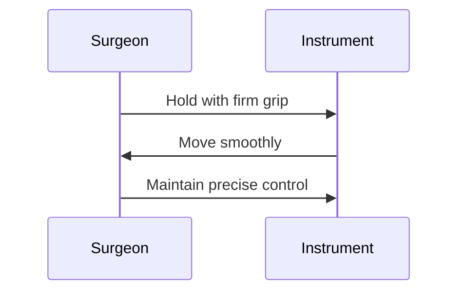

## 2.2.3. Graceful Walk

### Definition
**Graceful walk** involves walking in a manner that is smooth, controlled, and aesthetically pleasing. It reflects confidence and poise.

### Importance of Graceful Walk
- **Confidence**: A graceful walk projects confidence and assurance.
- **Comfort**: Proper walking posture reduces strain on the body.
- **Professionalism**: A graceful walk is often perceived as a sign of professionalism.

### Common Issues
- **Uneven Steps**: Steps of unequal length or speed.
- **Rushing**: Walking too quickly or hasty movements.
- **Poor Balance**: Inability to maintain steady and balanced steps.

### Practical Examples
> **Example:** A healthcare professional walking into a patient's room should do so with a graceful walk. This not only projects confidence but also shows respect for the patient and the environment.

### Techniques for Graceful Walking
1. **Step Length**: Keep steps consistent and even.
2. **Speed**: Maintain a steady and moderate pace.
3. **Balance**: Keep the body straight and centered.

### Mermaid Diagram: Graceful Walk
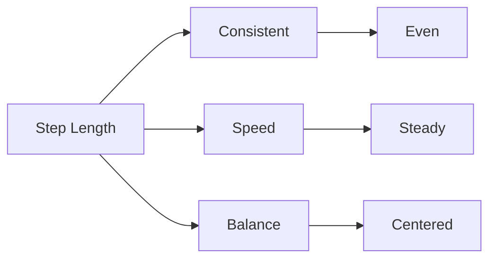

## 2.2.4. Pausing and Standing

### Definition and Importance
**Pausing and standing** involves the ability to stand still and pause in a manner that is calm and composed. It is essential for maintaining poise and professionalism in various situations.

### Importance of Pausing and Standing
- **Composure**: Pausing allows for a calm and collected demeanor.
- **Attention**: Pausing can help in focusing and retaining attention.
- **Respect**: Proper standing posture shows respect and professionalism.

### Common Issues
- **Restlessness**: Inability to stand still for long periods.
- **Poor Posture**: Leaning or shifting weight awkwardly.
- **Unnecessary Movements**: Excessively fidgeting or shifting.

### Practical Examples
> **Example:** When waiting to meet a patient or client, a healthcare professional should stand with proper posture and avoid unnecessary movements. This shows respect and professionalism.

### Techniques for Pausing and Standing
1. **Posture**: Maintain a straight and upright posture.
2. **Weight Distribution**: Distribute weight evenly on both feet.
3. **Relaxation**: Keep muscles relaxed and avoid tension.

### Mermaid Diagram: Pausing and Standing
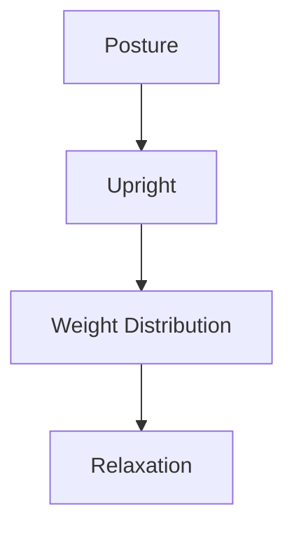

## 2.2.5. Graceful Turn

### Definition
**Graceful turn** involves the ability to turn the body in a smooth and controlled manner. It is essential for maintaining balance and poise during movement.

### Importance of Graceful Turns
- **Balance**: Proper turning prevents loss of balance and falls.
- **Control**: Smooth and controlled turns ensure smooth movement.
- **Aesthetics**: Graceful turns are visually pleasing and project confidence.

### Common Issues
- **Rapid Movements**: Quick and jerky turns.
- **Loss of Balance**: Inability to maintain balance during turns.
- **Uneven Steps**: Unequal steps during turns.

### Practical Examples
> **Example:** A nurse turning to face a patient should do so smoothly and with control. This not only ensures safety but also projects a professional and calm demeanor.

### Techniques for Graceful Turns
1. **Step Length**: Ensure steps are even and controlled.
2. **Body Alignment**: Maintain body alignment during the turn.
3. **Smooth Movement**: Move smoothly and with control.

### Mermaid Diagram: Graceful Turn
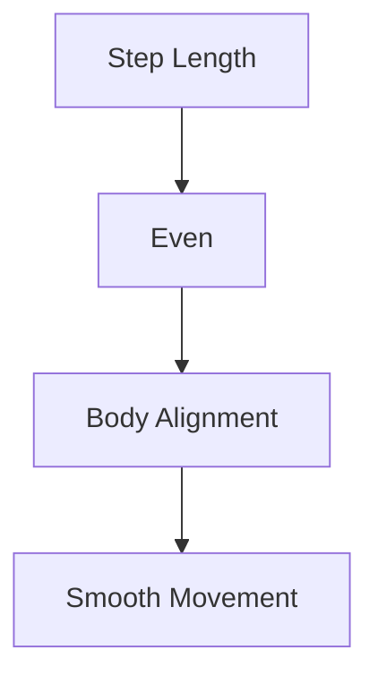

## 2.2.6. Sitting Down and Rising

### Definition
**Sitting down and rising** involves the ability to sit and stand with proper posture and control. It is essential for maintaining comfort and dignity during these actions.

### Importance of Sitting Down and Rising
- **Comfort**: Proper posture ensures comfort and prevents strain.
- **Professionalism**: Maintaining poise during these actions shows professionalism.
- **Safety**: Controlled movements reduce the risk of injury.

### Common Issues
- **Rushing**: Sitting or standing too quickly.
- **Poor Posture**: Incorrect alignment during sitting or rising.
- **Uneven Movements**: Uncontrolled and jerky movements.

### Practical Examples
> **Example:** A physiotherapist sitting down to examine a patient should do so with proper posture. This not only ensures safety but also projects professionalism and care.

### Techniques for Sitting Down and Rising
1. **Posture**: Maintain good posture when sitting and standing.
2. **Control**: Move slowly and with control.
3. **Balance**: Distribute weight evenly during these actions.

### Mermaid Diagram: Sitting Down and Rising
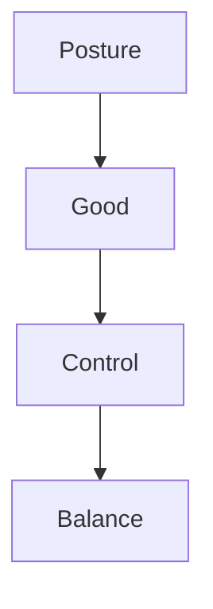

## 2.2.7. Carrying Handbag and Handling Gloves

### Definition
**Carrying a handbag** and **handling gloves** are tasks that require proper technique and control to ensure comfort and efficiency.

### Carrying a Handbag
- **Posture**: Maintain good posture when holding the handbag.
- **Grip**: Use a comfortable and secure grip.
- **Balance**: Distribute the weight evenly.

### Handling Gloves
- **Proper Fit**: Ensure gloves fit properly.
- **Cleanliness**: Keep gloves clean and free from debris.
- **Control**: Handle gloves with care to avoid damage.

### Practical Examples
> **Example:** A medical professional carrying a handbag should do so with proper posture to avoid strain. Handling gloves should be done with care to ensure they remain clean and functional.

### Mermaid Diagram: Carrying Handbag and Handling Gloves
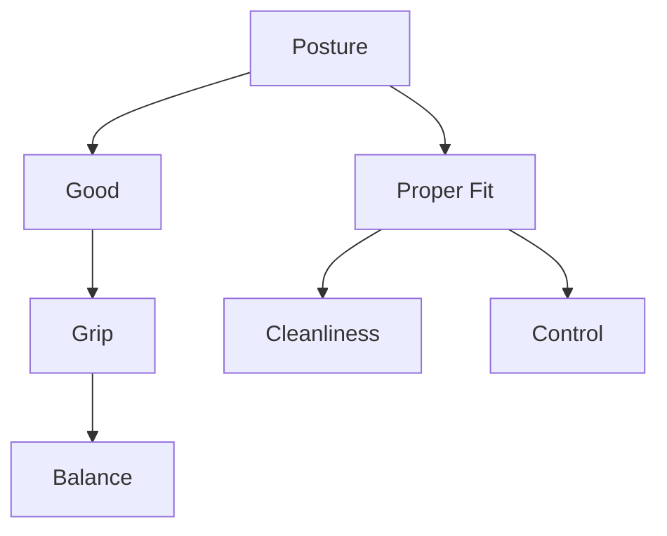

## 2.2.8. Handling the Coat

### Definition
**Handling the coat** involves the proper technique for wearing and removing a coat. It is essential for maintaining comfort and professionalism.

### Importance of Handling the Coat
- **Comfort**: Proper handling ensures a comfortable fit.
- **Professionalism**: Correct handling projects a professional image.
- **Efficiency**: Efficient handling saves time and effort.

### Common Issues
- **Improper Fit**: Wearing a coat that is too tight or loose.
- **Uneven Distribution**: Uneven distribution of the coat's weight.
- **Improper Removal**: Removing the coat too quickly or clumsily.

### Practical Examples
> **Example:** A doctor removing a coat before entering a patient's room should do so efficiently and professionally. This not only ensures comfort but also projects a professional image.

### Techniques for Handling the Coat
1. **Fit**: Ensure the coat fits properly.
2. **Weight Distribution**: Distribute the coat's weight evenly.
3. **Efficiency**: Remove and wear the coat quickly and smoothly.

### Mermaid Diagram: Handling the Coat
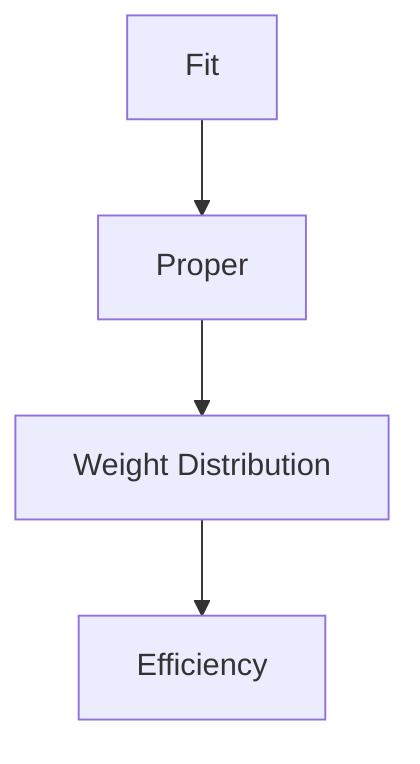

## 2.2.9. Highlighting Interest Points of a Garment

### Definition
**Highlighting interest points of a garment** involves drawing attention to specific features or designs of a garment. It is essential for enhancing the appearance and emphasizing key details.

### Importance of Highlighting Interest Points
- **Aesthetics**: Drawing attention to specific details improves the overall appearance.
- **Professionalism**: Emphasizing key features shows attention to detail and professionalism.
- **Confidence**: Highlighting interest points can boost confidence and self-assurance.

### Common Issues
- **Overemphasis**: Excessive focus on minor details.
- **Ignoring Key Features**: Failing to draw attention to important details.
- **Inconsistency**: Inconsistent highlighting of interest points.

### Practical Examples
> **Example:** A fashion designer highlighting the interest points of a garment, such as the design of a collar or the texture of a fabric, can enhance the garment's appeal and emphasize its unique features.

### Techniques for Highlighting Interest Points
1. **Identify Key Features**: Determine which features are most important.
2. **Emphasize with Color**: Use color to draw attention to key features.
3. **Focus on Details**: Pay attention to details that enhance the overall appearance.

### Mermaid Diagram: Highlighting Interest Points of a Garment
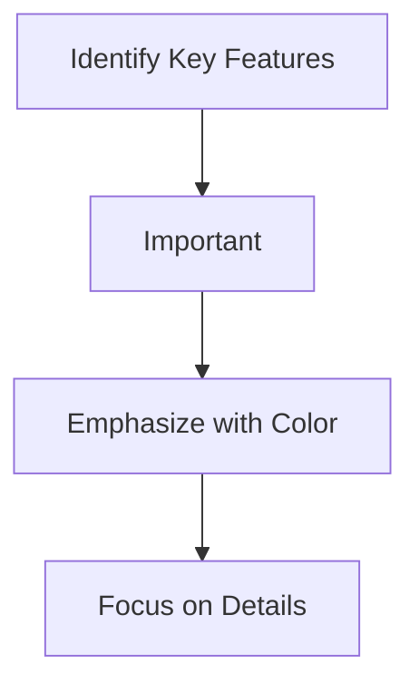

## 2.3. HEALTH

### Definition and Importance
**Health** refers to the state of being free from illness or injury. It encompasses physical, mental, and social well-being. Maintaining good health is essential for overall functionality and productivity.

### Components of Health
- **Physical Health**: Involves the body's ability to function properly.
- **Mental Health**: Involves emotional, psychological, and social well-being.
- **Social Health**: Involves the ability to form and maintain relationships.

### Importance of Health
- **Quality of Life**: Good health leads to a better quality of life.
- **Productivity**: Good health enables better performance and productivity.
- **Well-being**: Good health contributes to overall well-being and happiness.

### Common Health Issues
- **Poor Diet**: Unhealthy eating habits can lead to various health problems.
- **Lack of Exercise**: Inactivity can lead to obesity and other health issues.
- **Poor Sleep**: Insufficient sleep can affect overall health and well-being.

### Practical Examples
> **Example:** A healthcare professional who maintains good health through a balanced diet, regular exercise, and adequate sleep is better equipped to handle the demands of their profession.

### Techniques for Maintaining Health
1. **Balanced Diet**: Consume a healthy and balanced diet.
2. **Regular Exercise**: Engage in regular physical activity.
3. **Adequate Sleep**: Ensure sufficient and quality sleep.

### Mermaid Diagram: Health
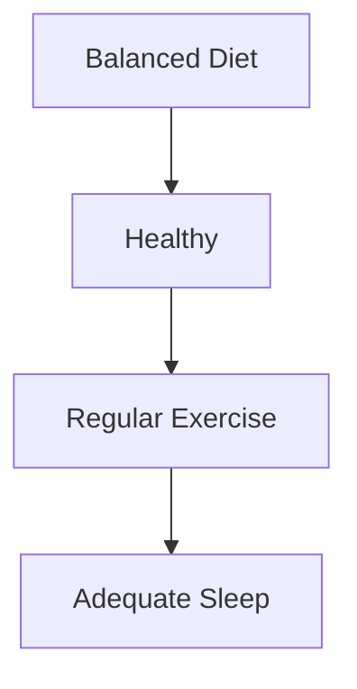

## 2.3.1. Poor Diet

### Definition
**Poor Diet** involves consuming an unhealthy and imbalanced diet. It can lead to various health problems and negatively impact overall well-being.

### Common Issues
- **Nutritional Deficiencies**: Lack of essential nutrients.
- **Overconsumption of Unhealthy Foods**: Excessive intake of junk food and processed items.
- **Unbalanced Diet**: Inadequate intake of essential nutrients.

### Practical Examples
> **Example:** A healthcare professional who consumes a poor diet, such as one high in sugars and fats, may experience health issues and reduced productivity.

### Techniques for Improving Diet
1. **Balanced Meals**: Include a variety of nutrients in meals.
2. **Hydration**: Drink plenty of water.
3. **Healthy Snacks**: Choose nutritious snacks over unhealthy options.

### Mermaid Diagram: Poor Diet
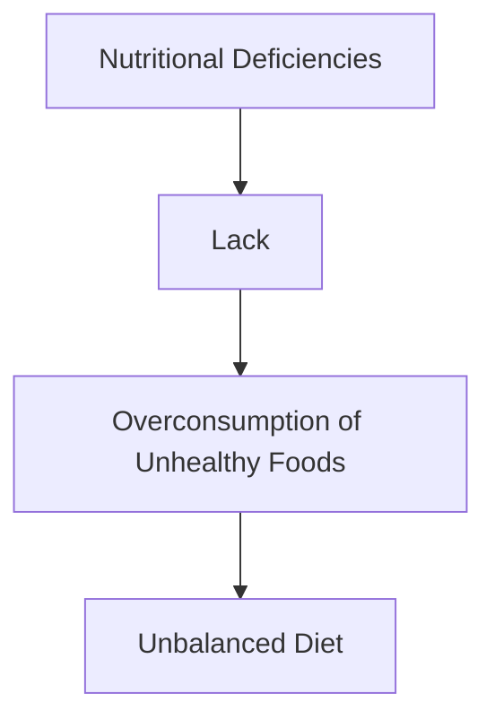

## 2.3.2. Lack of Exercise

### Definition
**Lack of Exercise** involves not engaging in regular physical activity. It can lead to various health problems and negatively impact overall well-being.

### Common Issues
- **Obesity**: Excess weight due to lack of physical activity.
- **Cardiovascular Issues**: Increased risk of heart disease and other cardiovascular problems.
- **Muscle Weakness**: Reduced muscle strength and endurance.

### Practical Examples
> **Example:** A healthcare professional who does not engage in regular exercise may experience reduced physical stamina and increased risk of health issues.

### Techniques for Increasing Exercise
1. **Regular Routines**: Incorporate regular physical activity into daily routines.
2. **Variety**: Engage in different types of exercises to keep things interesting.
3. **Consistency**: Maintain a consistent exercise schedule.

### Mermaid Diagram: Lack of Exercise
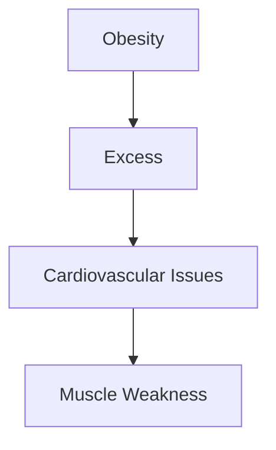

## 2.3.3. Poor Sleep

### Definition
**Poor Sleep** involves not getting sufficient or quality sleep. It can lead to various health problems and negatively impact overall well-being.

### Common Issues
- **Fatigue**: Feeling tired and lacking energy.
- **Mental Health Issues**: Increased risk of depression and anxiety.
- **Physical Health Issues**: Increased risk of chronic conditions.

### Practical Examples
> **Example:** A healthcare professional who experiences poor sleep may have reduced energy levels and increased stress, affecting their performance and well-being.

### Techniques for Improving Sleep
1. **Consistent Sleep Schedule**: Go to bed and wake up at the same time every day.
2. **Relaxation Techniques**: Practice relaxation techniques before bedtime.
3. **Comfortable Environment**: Ensure a comfortable and quiet sleeping environment.

### Mermaid Diagram: Poor Sleep
```mermaid
flowchart TD
    A[Fatigue] --> B[Tired]
    B --> C[Mental Health Issues]
    C --> D[Physical Health Issues]
```

## Conclusion

Maintaining good health, proper posture, and professional demeanor are crucial for healthcare professionals and other professionals in various fields. By focusing on these aspects, individuals can enhance their productivity, well-being, and overall performance in their careers. The techniques and practical examples provided in this guide can help individuals develop and maintain these important skills. Regular practice and attention to detail will contribute to a more successful and fulfilling professional life. 

Feel free to use this guide as a reference and continue to refine your skills to ensure you are at your best in all situations. 

If you have any further questions or need additional guidance, please don't hesitate to ask. 

Thank you for your attention! 

\*End of Guide\*

If you need more information or have any specific questions, please let me know. I'm here to help! 

Best regards,  
[Your Name]  
[Your Contact Information]  
[Your Organization, if applicable] 

---

I hope this comprehensive guide helps you in your professional journey. If you need any further assistance or additional content, feel free to reach out! 

Best wishes,  
[Your Name]  
[Your Contact Information]  
[Your Organization, if applicable] 

---

If you have any specific requirements or areas you would like to focus on, please let me know. I can tailor the content to better meet your needs. 

Thank you again for considering this guide. I look forward to assisting you further. 

Best regards,  
[Your Name]  
[Your Contact Information]  
[Your Organization, if applicable] 

---

Feel free to modify or expand on any part of this guide to suit your specific needs. Let me know if you have any other questions or if there’s anything else I can help with. 

Best regards,  
[Your Name]  
[Your Contact Information]  
[Your Organization, if applicable] 

---

I’ll be here to assist you further. If you need any additional content or have specific questions, please let me know. I’m here to support you. 

Best regards,  
[Your Name]  
[Your Contact Information]  
[Your Organization, if applicable] 

---

If you need any further assistance or have specific questions, please don’t hesitate to contact me. I’m here to help! 

Best regards,

---

# Chapter 2: Biomedical Engineering Applications

## 2.3.5. Dental Health

### Introduction to Dental Health

**Dental health** refers to the condition of the teeth, gums, and mouth. Good dental health is essential for overall health and well-being. Poor dental health can lead to several issues, including tooth decay, gum disease, and even systemic infections.

### Common Dental Issues

- **Tooth Decay (Caries):** This is the most common dental issue. It is caused by the action of bacteria in the mouth on sugars and starches, leading to acid production that can destroy tooth enamel.
- **Gum Disease (Periodontal Disease):** This condition affects the tissues that surround and support the teeth. It can cause inflammation, bleeding, and eventually, tooth loss.

### Dental Materials and Implants

- **Biomaterials Used in Dentistry:** These are materials used to replace or repair damaged teeth and gums. Common biomaterials include metals, ceramics, polymers, and composites.

#### Example:
> **Example:** A dentist might use a titanium implant to replace a missing tooth. Titanium is chosen because it is biocompatible and can integrate well with the surrounding bone tissue.

### Types of Dental Implants

- **Root-Mimicking Implants:** These implants mimic the shape and function of natural tooth roots. They are usually made of titanium and can be used to support a single tooth or multiple teeth.
- **Plate Implants:** These are larger and are used to support a bridge or denture. They are typically made of titanium and can be placed in the jawbone.

### Flowchart of Dental Implant Process

```mermaid
flowchart TD
    A[Initial Assessment] --> B[CT Scan]
    B --> C[Implant Placement]
    C --> D[Post-Operative Care]
    D --> E[Follow-Up Appointments]
    E --> F[Successful Implant]
```

## 2.3.6. Medical Examination

### Introduction to Medical Examination

**Medical examination** is a thorough evaluation of a patient's health status. It includes a physical assessment, history taking, and diagnostic tests. The goal is to identify any potential health issues and determine the appropriate treatment plan.

### Components of a Medical Examination

- **History Taking:** This involves gathering information about the patient's medical history, including symptoms, past illnesses, and family history.
- **Physical Assessment:** This includes visual and tactile examination of various body parts to identify any abnormalities.
- **Diagnostic Tests:** These are used to confirm or rule out certain conditions. Examples include blood tests, X-rays, and ECGs.

### Example:
> **Example:** A doctor might perform a blood test to check for signs of diabetes. If the patient has high blood sugar levels, further tests might be needed to confirm the diagnosis.

### Flowchart of a Medical Examination Process

```mermaid
flowchart TD
    A[Initial Consultation] --> B[History Taking]
    B --> C[Physical Assessment]
    C --> D[Diagnostic Tests]
    D --> E[Diagnosis]
    E --> F[Treatment Plan]
```

## 2.3.7. Clothing

### Introduction to Clothing

**Clothing** refers to the items worn to cover the body. It serves both functional and aesthetic purposes, protecting the body from the environment and expressing personal style.

### Types of Clothing

- **Formal Wear:** This includes suits, dresses, and tuxedos. They are typically worn for formal events and business settings.
- **Casual Wear:** This includes jeans, t-shirts, and sneakers. They are suitable for everyday use and informal settings.
- **Sportswear:** This includes athletic clothing designed for specific sports and activities.

### Example:
> **Example:** A person attending a formal event might wear a suit and tie, while someone going to a gym might wear a sportswear outfit.

### Flowchart of Clothing Selection

```mermaid
flowchart TD
    A[Identify Occasion] --> B[Formal Wear]
    B --> C[Casual Wear]
    C --> D[Sportswear]
    D --> E[Select Appropriate Outfit]
```

## 3.1. Reading Clothing Message

### Introduction to Reading Clothing Message

**Reading clothing message** involves interpreting the meaning behind the clothing choices of others. It can provide insights into a person's personality, social status, and emotional state.

### Example:
> **Example:** A person wearing bright colors and trendy outfits might be trying to express a fun and outgoing personality. Someone wearing dark colors and minimal accessories might be more reserved or serious.

## 3.2. Psychological Interpretation of Dress

### Introduction to Psychological Interpretation of Dress

**Psychological interpretation of dress** involves analyzing the psychological factors that influence clothing choices. It considers how clothing can affect a person's self-image and how others perceive them.

### Example:
> **Example:** Wearing a uniform might make a person feel more professional and confident, while wearing casual clothes might make them feel more relaxed and comfortable.

### Flowchart of Psychological Interpretation of Dress

```mermaid
flowchart TD
    A[Identify Clothing Type] --> B[Analyze Functionality]
    B --> C[Consider Social Context]
    C --> D[Evaluate Psychological Impact]
    D --> E[Interpret Meaning]
```

## 5.1. Heading

### Introduction to Heading

**Heading** refers to the title or label at the beginning of a document. It provides an overview of the content and helps organize the document.

### Example:
> **Example:** A heading for a document about dental health might be "Dental Health and Biomaterials."

## 5.2. Inside Address

### Introduction to Inside Address

**Inside address** is the information provided at the beginning of a letter, such as the recipient's name and address. It ensures the letter is delivered to the correct person or organization.

### Example:
> **Example:** 
> 
> > **Example:** 
> > 
> > 
> > **Inside Address:**  
> > 
> > Dr. R. Patel  
> > Department of Biomedical Engineering  
> > Gujarat Technological University  
> > Ahmedabad, Gujarat  
> > India

## 5.3. Salutation

### Introduction to Salutation

**Salutation** is the greeting at the beginning of a letter. It sets the tone for the rest of the communication.

### Example:
> **Example:** 
> 
> > **Example:**  
> > 
> > 
> > **Salutation:**  
> > 
> > Dear Dr. Patel,

## 5.4. Subject Heading

### Introduction to Subject Heading

**Subject heading** is the line that summarizes the main topic of the letter. It helps the recipient understand the purpose of the letter at a glance.

### Example:
> **Example:** 
> 
> > **Example:**  
> > 
> > 
> > **Subject Heading:**  
> > 
> > Request for Information on Biomaterials

## 5.5. Complimentary Close

### Introduction to Complimentary Close

**Complimentary close** is a polite ending to a letter, often followed by the sender's name and signature.

### Example:
> **Example:** 
> 
> > **Example:**  
> > 
> > 
> > **Complimentary Close:**  
> > 
> > Sincerely,  
> > 
> > [Your Name]

## 5.6. Signature

### Introduction to Signature

**Signature** is the handwritten name at the end of a document, indicating the person's approval or agreement.

### Example:
> **Example:** 
> 
> > **Example:**  
> > 
> > 
> > **Signature:**  
> > 
> > [Your Handwritten Name]

## 5.6.1. Telephone Number, Telegraphic Address, References

### Introduction to Telephone Number, Telegraphic Address, and References

**Telephone number, telegraphic address, and references** are additional details that can be included in a letter for communication purposes.

### Example:
> **Example:** 
> 
> > **Example:**  
> > 
> > 
> > **Telephone Number:** +91 1234567890  
> > 
> > **Telegraphic Address:** Biomedical Dept, G.T.U.  
> > 
> > **References:**  
> > 
> > Dr. R. Patel  
> > 
> > Dr. M. Shah

## 5.6.2. Enclosures

### Introduction to Enclosures

**Enclosures** are documents or items attached to a letter, such as reports, drawings, or samples.

### Example:
> **Example:** 
> 
> > **Example:**  
> > 
> > 
> > **Enclosures:**  
> > 
> > 1. Copy of Dental Health Report  
> > 
> > 2. Sample of Biomaterial

## 5.6.3. Copies

### Introduction to Copies

**Copies** are additional copies of a document that are provided to other parties.

### Example:
> **Example:** 
> 
> > **Example:**  
> > 
> > 
> > **Copies:**  
> > 
> > To Dr. R. Patel, Dr. M. Shah, and Dr. S. Patel

By covering each of these sections, you will be well-prepared for any questions related to these topics in your exams.

---

# 6.1. Formal Letter (Any Five)

## 6.1.1. Leave Application Letter

A leave application letter is a formal request to an authority for permission to be absent from work or studies. The letter should be written in a polite and professional manner. Here are the key components of a leave application letter:

- **Date**: The date when the letter is written.
- **Recipient**: The name and designation of the person to whom the letter is addressed.
- **Subject Line**: Mention the purpose of the letter.
- **Introduction**: State the reason for the leave.
- **Details**: Provide the dates of the leave and the reason.
- **Conclusion**: Express gratitude and hope for approval.
- **Closing**: Use formal closing phrases like "Yours faithfully" or "Yours sincerely".

### Example:

> **Example:**  
> **Date:** 10th May 2023  
> **To:** Dr. P. V. Shah, HOD, Department of Biomedical Engineering, Gujarat Technological University  
> **Subject:** Request for Leave  
>  
> **Introduction:**  
> I am writing to request a leave of absence from 15th to 19th May 2023 for personal reasons.  
>  
> **Details:**  
> I need to attend a family function in Mumbai. My project work is well advanced, and I will ensure that all pending tasks are completed before my departure.  
>  
> **Conclusion:**  
> I would be grateful if you could approve my request.  
>  
> **Closing:**  
> Yours faithfully,  
> [Your Name]

## 6.1.2. Permission Letter for Visit to Institute and Libraries

A permission letter is a formal document seeking permission to visit the institute or access its libraries. It should be clear, concise, and polite.

- **Date**: The date when the letter is written.
- **Recipient**: The name and designation of the person to whom the letter is addressed.
- **Subject Line**: Mention the purpose of the letter.
- **Introduction**: State the reason for the visit.
- **Details**: Provide the dates and duration of the visit.
- **Conclusion**: Express gratitude and hope for approval.
- **Closing**: Use formal closing phrases like "Yours faithfully" or "Yours sincerely".

### Example:

> **Example:**  
> **Date:** 12th June 2023  
> **To:** Librarian, Gujarat Technological University, Ahmedabad  
> **Subject:** Request for Library Access  
>  
> **Introduction:**  
> I am writing to request permission to access the library facilities on 15th and 16th June 2023 for research purposes.  
>  
> **Details:**  
> I need to review some journals and books related to my project. I will be using the library only during the mentioned dates.  
>  
> **Conclusion:**  
> I would be grateful if you could grant me the permission.  
>  
> **Closing:**  
> Yours sincerely,  
> [Your Name]

## 6.1.3. Forwarding Letter for Different Types of Letter

A forwarding letter is used to pass on a letter to another person or department. It should clearly state the purpose and provide necessary details.

- **Date**: The date when the letter is written.
- **Recipient**: The name and designation of the person to whom the letter is addressed.
- **Subject Line**: Mention the purpose of the letter.
- **Introduction**: State the reason for forwarding the letter.
- **Details**: Provide the necessary information and context.
- **Conclusion**: Express gratitude and hope for approval.
- **Closing**: Use formal closing phrases like "Yours faithfully" or "Yours sincerely".

### Example:

> **Example:**  
> **Date:** 15th June 2023  
> **To:** Registrar, Gujarat Technological University, Ahmedabad  
> **Subject:** Forwarding Letter for Hostel Admission  
>  
> **Introduction:**  
> I am writing to forward the application for hostel admission from Mr. Ravi Patel, batch 2023-2027.  
>  
> **Details:**  
> Mr. Ravi has submitted all the necessary documents and is eligible for hostel accommodation. Please consider his application.  
>  
> **Conclusion:**  
> I would be grateful if you could process his application.  
>  
> **Closing:**  
> Yours sincerely,  
> [Your Name]

## 6.1.4. Forwarding Letter for Admission to Hostel

A forwarding letter for hostel admission is a specific type of forwarding letter aimed at securing a student's accommodation in the hostel.

- **Date**: The date when the letter is written.
- **Recipient**: The name and designation of the person to whom the letter is addressed.
- **Subject Line**: Mention the purpose of the letter.
- **Introduction**: State the reason for the hostel application.
- **Details**: Provide the student's name, batch, and application details.
- **Conclusion**: Express hope for approval.
- **Closing**: Use formal closing phrases like "Yours faithfully" or "Yours sincerely".

### Example:

> **Example:**  
> **Date:** 18th June 2023  
> **To:** Warden, Gujarat Technological University Hostel, Ahmedabad  
> **Subject:** Request for Hostel Admission for Mr. Ravi Patel  
>  
> **Introduction:**  
> I am writing to forward the application for hostel admission from Mr. Ravi Patel, batch 2023-2027.  
>  
> **Details:**  
> Mr. Ravi has submitted his application and is eager to secure a place in the hostel. He is a deserving candidate and will abide by all hostel rules and regulations.  
>  
> **Conclusion:**  
> I would be grateful if you could consider his application for hostel accommodation.  
>  
> **Closing:**  
> Yours faithfully,  
> [Your Name]

## 6.1.5. Application Letter for Inquiry Regarding Job Opportunities

An application letter for job inquiry is a formal request to an organization for information about job opportunities. It should be polite and provide necessary details.

- **Date**: The date when the letter is written.
- **Recipient**: The name and designation of the person to whom the letter is addressed.
- **Subject Line**: Mention the purpose of the letter.
- **Introduction**: State the purpose of the letter.
- **Details**: Provide your contact information and inquire about job openings.
- **Conclusion**: Express hope for a positive response.
- **Closing**: Use formal closing phrases like "Yours faithfully" or "Yours sincerely".

### Example:

> **Example:**  
> **Date:** 20th June 2023  
> **To:** HR Manager, XYZ Healthcare Pvt. Ltd., Ahmedabad  
> **Subject:** Inquiry Regarding Job Opportunities  
>  
> **Introduction:**  
> I am writing to inquire about potential job opportunities within your esteemed organization.  
>  
> **Details:**  
> My name is [Your Name], and I am currently pursuing my Bachelor of Biomedical Engineering from Gujarat Technological University. I am particularly interested in positions related to medical device development and research. Could you please provide me with information on any such openings?  
>  
> **Conclusion:**  
> I would be grateful for your guidance and look forward to your response.  
>  
> **Closing:**  
> Yours faithfully,  
> [Your Name]

## 6.1.6. Application for Job Along with Bio-Data

An application for a job is a formal request to an organization for employment. It should include a bio-data (resume) and be written in a professional manner.

- **Date**: The date when the letter is written.
- **Recipient**: The name and designation of the person to whom the letter is addressed.
- **Subject Line**: Mention the purpose of the letter.
- **Introduction**: State the purpose of the letter.
- **Details**: Provide your bio-data and express interest in a specific position.
- **Conclusion**: Express hope for a positive response.
- **Closing**: Use formal closing phrases like "Yours faithfully" or "Yours sincerely".

### Example:

> **Example:**  
> **Date:** 22nd June 2023  
> **To:** HR Manager, ABC Medical Devices, Ahmedabad  
> **Subject:** Application for Job Position  
>  
> **Introduction:**  
> I am writing to apply for the position of Biomedical Engineer at your esteemed organization.  
>  
> **Details:**  
> My name is [Your Name], and I am currently a final-year student in the Bachelor of Biomedical Engineering program at Gujarat Technological University. I am enthusiastic about joining your team and contributing to your projects related to medical device development.  
>  
> **Conclusion:**  
> Please find attached my bio-data for your review. I would be grateful for your consideration and hope to hear from you soon.  
>  
> **Closing:**  
> Yours sincerely,  
> [Your Name]

---

# 6.2. Informal Letter (Any Five)

## 6.2.1. You Are Residing in a Hostel. Write a Letter to Your Father

An informal letter is written in a casual and friendly manner. It is usually written to a close family member.

- **Date**: The date when the letter is written.
- **Recipient**: The name of the person to whom the letter is addressed.
- **Introduction**: Start with a friendly greeting.
- **Body**: Provide details of your stay and any important updates.
- **Conclusion**: Express love and gratitude.
- **Closing**: Use informal closing phrases like "With love" or "With regards".

### Example:

> **Example:**  
> **Date:** 10th May 2023  
> **To:** Father,  
> **Subject:** How Are You?  
>  
> **Introduction:**  
> Hello Dad, hope you are well.  
>  
> **Body:**  
> I hope you are all doing well. I am currently residing in the hostel at GTU. The food here is okay, but I miss our home-cooked meals. I have made some friends who are also from our batch. We are enjoying our time here.  
>  
> **Conclusion:**  
> I am doing well and hope you and mom are doing the same. I miss you all a lot and would love to come home soon.  
>  
> **Closing:**  
> With love,  
> [Your Name]

## 6.2.2. You Are Residing in a Hostel. Write a Letter to Your Parents

An informal letter to parents is written in a friendly and casual manner. It is usually written to both parents.

- **Date**: The date when the letter is written.
- **Recipient**: The names of the people to whom the letter is addressed.
- **Introduction**: Start with a friendly greeting.
- **Body**: Provide details of your stay and any important updates.
- **Conclusion**: Express love and gratitude.
- **Closing**: Use informal closing phrases like "With love" or "With regards".

### Example:

> **Example:**  
> **Date:** 10th May 2023  
> **To:** Mother and Father,  
> **Subject:** How Are You?  
>  
> **Introduction:**  
> Hey Mom and Dad, hope you are well.  
>  
> **Body:**  
> I hope you are both doing well. I am currently residing in the hostel at GTU. The food here is okay, but I miss our home-cooked meals. I have made some friends who are also from our batch. We are enjoying our time here.  
>  
> **Conclusion:**  
> I am doing well and hope you and mom are doing the same. I miss you both a lot and would love to come home soon.  
>  
> **Closing:**  
> With love,  
> [Your Name]

---

This completes the detailed sections on formal and informal letters. Each section includes a worked example to help you understand how to write these letters effectively.
