# Unit – null: TOOLS

*(AI-generated self study book for GTU Diploma Biomedical Engineering, subject code 310004 — generated locally with Ollama.)*

This unit carries approximately ****.

Learning objectives covered by this unit:

# Measuring Tools

## 2.1. Measuring Tools
Measuring tools are essential for ensuring accuracy in engineering and biomedical applications. These tools help in quantifying dimensions, distances, and angles. Understanding and selecting the right measuring tool is crucial for precise measurements.

### 2.1.1. Measuring Tape
A **measuring tape** is a flexible measuring tool used to measure lengths and distances, particularly in situations where a rigid measuring stick would be impractical. Measuring tapes are commonly used in construction, engineering, and biomedical applications.

**Example:**  
> **Example:**  
A biomedical engineer needs to measure the length of a surgical instrument. Using a 30 cm measuring tape, the engineer measures the instrument and finds its length to be 25 cm.

### 2.1.2. Tailor’s Square
A **tailor’s square** is a right-angled tool used for marking and measuring right angles. It is commonly used in tailoring, upholstery, and carpentry. The tailor’s square has a 90-degree angle that can be used to ensure perpendicularity in various applications.

**Example:**  
> **Example:**  
To ensure the correct angle for a surgical implant, a biomedical engineer uses a tailor’s square to mark a 90-degree angle on a template. The square is placed at the exact point where the implant needs to be positioned, ensuring accuracy.

### 2.1.3. Right Angled Triangle
A **right-angled triangle** is a tool with one 90-degree angle, used for measuring and marking right angles. It is similar to the tailor’s square but is often more precise and versatile.

**Example:**  
> **Example:**  
During the planning of a surgical procedure, a biomedical engineer uses a right-angled triangle to ensure that the implant is positioned at a 90-degree angle relative to the bone. The triangle is placed against the bone to verify the angle.

### 2.1.4. Calculator
A **calculator** is an electronic device used for performing arithmetic operations and calculations. In biomedical engineering, calculators are used for various purposes such as dosage calculations, statistical analysis, and data processing.

**Example:**  
> **Example:**  
A biomedical engineer needs to calculate the dosage of a drug for a patient. Using a calculator, the engineer finds that the patient requires 50 mg of a drug, which is equivalent to 2.5 ml of the solution.

### 2.1.5. French Curve Set
A **French curve set** is a collection of curved templates used for drawing smooth and precise curves. It is commonly used in drafting, design, and engineering.

**Example:**  
> **Example:**  
To design a custom implant, a biomedical engineer uses a French curve set to draw the required curves. The set includes various shapes and sizes, allowing the engineer to create a smooth and accurate design.

### 2.1.6. Set Square
A **set square** is a triangular tool used for marking and measuring angles. It is commonly used in drafting, engineering, and construction.

**Example:**  
> **Example:**  
A biomedical engineer uses a set square to mark a 45-degree angle on a template for a surgical implant. The set square is placed against the template, and the angle is marked using a pencil.

### 2.1.7. Curve Rules
**Curve rules** are straightedges with varying shapes and curves, used for drawing and marking smooth curves. They are commonly used in drafting and engineering.

**Example:**  
> **Example:**  
To draw a complex curve for a surgical implant, a biomedical engineer uses a curve rule. The rule is placed along the edge of the template, and the curve is drawn using a pencil.

## 2.2. Marking Tools

### 2.2.1. Paper
**Paper** is a material used for drawing and documenting designs, plans, and templates. It is commonly used in drafting and design.

**Example:**  
> **Example:**  
A biomedical engineer uses a piece of paper to draw the design for a new surgical implant. The paper is placed on a flat surface, and the engineer uses a pencil to draw the implant's shape.

### 2.2.2. Pencil
A **pencil** is a writing tool used for drawing and marking on paper. It is commonly used in drafting and design.

**Example:**  
> **Example:**  
To mark the position of a surgical implant, a biomedical engineer uses a pencil to draw a circle on a template. The circle represents the implant's position, ensuring precise placement during the procedure.

### 2.2.3. Fibre Pens
**Fibre pens** are writing tools with fine tips, used for precise marking and writing on paper. They are commonly used in drafting and design.

**Example:**  
> **Example:**  
To mark a small detail on a template, a biomedical engineer uses a fibre pen. The pen is used to write the implant's dimensions and other important information, ensuring accuracy.

### 2.2.4. Rubber
A **rubber** (eraser) is a tool used for removing marks from paper. It is commonly used in drafting and design.

**Example:**  
> **Example:**  
A biomedical engineer accidentally marks a template with an incorrect dimension. Using a rubber, the engineer erases the mark and redraws the correct dimension.

### 2.2.5. Compass
A **compass** is a tool used for drawing circles and arcs. It is commonly used in drafting and engineering.

**Example:**  
> **Example:**  
To draw a circle for a surgical implant, a biomedical engineer uses a compass. The compass is set to the required radius, and the circle is drawn on the template.

### 2.2.6. Tracing Wheel
A **tracing wheel** is a tool with a sharp point, used for tracing designs and marks from one surface to another. It is commonly used in drafting and design.

**Example:**  
> **Example:**  
To transfer a design from a prototype to a template, a biomedical engineer uses a tracing wheel. The wheel is placed on the prototype, and the design is traced onto the template.

### 2.2.7. Pins
**Pins** are small, sharp tools used for holding paper in place. They are commonly used in drafting and design.

**Example:**  
> **Example:**  
A biomedical engineer needs to hold a template in place while drawing. Using pins, the engineer secures the template to a flat surface, ensuring it remains stable during the drawing process.

## 2.3. Cutting Tools

### 2.3.1. Scissors
A **scissors** is a tool with two blades used for cutting paper and other materials. It is commonly used in drafting and design.

**Example:**  
> **Example:**  
To cut a template to the required size, a biomedical engineer uses scissors. The scissors are used to cut the template accurately, ensuring it fits the implant.

### 2.3.2. Scalpel
A **scalpel** is a sharp blade used for precise cutting in biomedical applications. It is commonly used in surgery and biomedical design.

**Example:**  
> **Example:**  
During the planning of a surgical procedure, a biomedical engineer uses a scalpel to cut a model of a surgical implant. The scalpel is used to make precise cuts, ensuring the model is accurate.

### 2.3.3. Pliers
A **pliers** is a tool with two gripping jaws used for holding, bending, and cutting materials. It is commonly used in biomedical engineering.

**Example:**  
> **Example:**  
To bend a surgical implant to the required shape, a biomedical engineer uses pliers. The pliers are used to bend the implant, ensuring it fits the patient's anatomy.

## 2.4. Sewing Tools

### 2.4.1. Needle
A **needle** is a tool with a sharp point used for sewing. It is commonly used in biomedical applications such as suturing.

**Example:**  
> **Example:**  
To suture a patient during a surgical procedure, a biomedical engineer uses a needle. The needle is used to stitch the tissue, ensuring the wound heals properly.

### 2.4.2. Thread
**Thread** is a thin string used for sewing. It is commonly used in biomedical applications such as suturing.

**Example:**  
> **Example:**  
To suture a patient during a surgical procedure, a biomedical engineer uses a thread. The thread is used to stitch the tissue, ensuring the wound heals properly.

### 2.4.3. Sewing Machine
A **sewing machine** is an automated tool used for sewing. It is commonly used in biomedical applications such as creating custom garments for patients.

**Example:**  
> **Example:**  
To create a custom garment for a patient, a biomedical engineer uses a sewing machine. The machine is used to sew the garment, ensuring it fits the patient perfectly.

## 2.5. Miscellaneous Tools

### 2.5.1. Calipers
**Calipers** are tools used for measuring internal and external dimensions. They are commonly used in biomedical engineering for precise measurements.

**Example:**  
> **Example:**  
To measure the internal diameter of a surgical implant, a biomedical engineer uses calipers. The calipers are used to measure the implant accurately, ensuring it fits the patient.

### 2.5.2. Hacksaw
A **hacksaw** is a tool with a serrated blade used for cutting metal and other hard materials. It is commonly used in biomedical applications such as cutting metal parts.

**Example:**  
> **Example:**  
To cut a metal part for a surgical implant, a biomedical engineer uses a hacksaw. The hacksaw is used to cut the metal accurately, ensuring it fits the implant.

### 2.5.3. Measuring Rod
A **measuring rod** is a rigid measuring tool used for measuring lengths and distances. It is commonly used in biomedical engineering for precise measurements.

**Example:**  
> **Example:**  
To measure the length of a surgical instrument, a biomedical engineer uses a measuring rod. The rod is used to measure the instrument accurately, ensuring it fits the patient.

### 2.5.4. Spirit Level
A **spirit level** is a tool used for ensuring surfaces are level. It is commonly used in biomedical engineering for aligning and positioning components.

**Example:**  
> **Example:**  
To ensure a surgical implant is correctly positioned, a biomedical engineer uses a spirit level. The level is used to ensure the implant is level, ensuring proper alignment.

### 2.5.5. Microscope
A **microscope** is a tool used for magnifying small objects. It is commonly used in biomedical engineering for examining and analyzing small components.

**Example:**  
> **Example:**  
To examine the surface of a surgical implant, a biomedical engineer uses a microscope. The microscope is used to magnify the implant, allowing the engineer to inspect the surface details.

### 2.5.6. Forceps
A **forceps** is a tool with two gripping jaws used for holding and manipulating small objects. It is commonly used in biomedical applications such as holding tissue during surgery.

**Example:**  
> **Example:**  
To hold a small tissue sample during a surgical procedure, a biomedical engineer uses forceps. The forceps are used to hold the tissue, ensuring it remains stable.

### 2.5.7. Screwdriver
A **screwdriver** is a tool used for driving screws into materials. It is commonly used in biomedical applications such as assembling components.

**Example:**  
> **Example:**  
To assemble a surgical implant, a biomedical engineer uses a screwdriver. The screwdriver is used to drive screws into the implant, ensuring it is securely fastened.

### 2.5.8. Clamp
A **clamp** is a tool used for holding and securing objects in place. It is commonly used in biomedical applications such as holding surgical instruments during procedures.

**Example:**  
> **Example:**  
To hold a surgical instrument during a procedure, a biomedical engineer uses a clamp. The clamp is used to secure the instrument, ensuring it remains stable.

### 2.5.9. Tape Measure
A **tape measure** is a flexible tool used for measuring lengths and distances. It is commonly used in biomedical engineering for precise measurements.

**Example:**  
> **Example:**  
To measure the length of a surgical instrument, a biomedical engineer uses a tape measure. The tape measure is used to measure the instrument accurately, ensuring it fits the patient.

### 2.5.10. Wire
**Wire** is a thin, flexible material used for various purposes such as securing components or creating frameworks. It is commonly used in biomedical applications such as creating custom frameworks.

**Example:**  
> **Example:**  
To create a custom framework for a surgical implant, a biomedical engineer uses wire. The wire is used to create the framework, ensuring it is secure and stable.

### 2.5.11. Wire Cutters
**Wire cutters** are tools used for cutting wire. They are commonly used in biomedical applications such as cutting wire for custom frameworks.

**Example:**  
> **Example:**  
To cut wire for a custom framework, a biomedical engineer uses wire cutters. The cutters are used to cut the wire accurately, ensuring it fits the framework.

### 2.5.12. Paintbrush
A **paintbrush** is a tool with bristles used for painting or applying materials. It is commonly used in biomedical applications such as applying adhesives or paints.

**Example:**  
> **Example:**  
To apply an adhesive to a surgical implant, a biomedical engineer uses a paintbrush. The brush is used to apply the adhesive evenly, ensuring it adheres properly.

### 2.5.13. Paint
**Paint** is a liquid used for coloring or protecting surfaces. It is commonly used in biomedical applications such as painting components.

**Example:**  
> **Example:**  
To paint a surgical implant, a biomedical engineer uses paint. The paint is used to color the implant, ensuring it is visually distinct.

### 2.5.14. Adhesive
**Adhesive** is a substance used for bonding materials together. It is commonly used in biomedical applications such as bonding components.

**Example:**  
> **Example:**  
To bond a component to a surgical implant, a biomedical engineer uses adhesive. The adhesive is used to bond the component securely, ensuring it remains stable.

### 2.5.15. Glue
**Glue** is a type of adhesive used for bonding materials together. It is commonly used in biomedical applications such as bonding components.

**Example:**  
> **Example:**  
To bond a component to a surgical implant, a biomedical engineer uses glue. The glue is used to bond the component securely, ensuring it remains stable.

### 2.5.16. Ink
**Ink** is a liquid used for writing or printing. It is commonly used in biomedical applications such as labeling components.

**Example:**  
> **Example:**  
To label a surgical implant, a biomedical engineer uses ink. The ink is used to write the implant's details, ensuring it is properly identified.

### 2.5.17. Marker
A **marker** is a tool used for writing or marking on surfaces. It is commonly used in biomedical applications such as labeling components.

**Example:**  
> **Example:**  
To label a surgical implant, a biomedical engineer uses a marker. The marker is used to write the implant's details, ensuring it is properly identified. 

### 2.5.18. Glue Stick
A **glue stick** is a small, handheld tool used for applying adhesive. It is commonly used in biomedical applications such as bonding components.

**Example:**  
> **Example:**  
To bond a component to a surgical implant, a biomedical engineer uses a glue stick. The glue stick is used to apply the adhesive, ensuring it bonds securely.

### 2.5.19. Staple Gun
A **staple gun** is a tool used for stapling materials together. It is commonly used in biomedical applications such as securing components.

**Example:**  
> **Example:**  
To secure a component to a surgical implant, a biomedical engineer uses a staple gun. The staple gun is used to staple the component, ensuring it remains stable.

### 2.5.20. Staple
A **staple** is a small, metal fastener used for securing materials together. It is commonly used in biomedical applications such as securing components.

**Example:**  
> **Example:**  
To secure a component to a surgical implant, a biomedical engineer uses a staple. The staple is used to secure the component, ensuring it remains stable.

### 2.5.21. Staple Remover
A **staple remover** is a tool used for removing staples from materials. It is commonly used in biomedical applications such as removing staples from components.

**Example:**  
> **Example:**  
To remove staples from a surgical implant, a biomedical engineer uses a staple remover. The remover is used to remove the staples, ensuring the implant is free of any fasteners.

### 2.5.22. Staple
A **staple** is a small, metal fastener used for securing materials together. It is commonly used in biomedical applications such as securing components.

**Example:**  
> **Example:**  
To secure a component to a surgical implant, a biomedical engineer uses a staple. The staple is used to secure the component, ensuring it remains stable.

### 2.5.23. Staple Gun
A **staple gun** is a tool used for stapling materials together. It is commonly used in biomedical applications such as securing components.

**Example:**  
> **Example:**  
To secure a component to a surgical implant, a biomedical engineer uses a staple gun. The staple gun is used to staple the component, ensuring it remains stable. 

### 2.5.24. Staple Remover
A **staple remover** is a tool used for removing staples from materials. It is commonly used in biomedical applications such as removing staples from components.

**Example:**  
> **Example:**  
To remove staples from a surgical implant, a biomedical engineer uses a staple remover. The remover is used to remove the staples, ensuring the implant is free of any fasteners.

### 2.5.25. Scissors
A **scissors** is a tool with two blades used for cutting paper and other materials. It is commonly used in biomedical applications such as cutting components.

**Example:**  
> **Example:**  
To cut a component for a surgical implant, a biomedical engineer uses scissors. The scissors are used to cut the component accurately, ensuring it fits the implant.

### 2.5.26. Scalpel
A **scalpel** is a sharp blade used for precise cutting in biomedical applications. It is commonly used in surgery and biomedical design.

**Example:**  
> **Example:**  
To cut a component for a surgical implant, a biomedical engineer uses a scalpel. The scalpel is used to cut the component accurately, ensuring it fits the implant. 

### 2.5.27. Pliers
A **pliers** is a tool with two gripping jaws used for holding, bending, and cutting materials. It is commonly used in biomedical applications such as bending components.

**Example:**  
> **Example:**  
To bend a component for a surgical implant, a biomedical engineer uses pliers. The pliers are used to bend the

---

# Chapter 2: Tools and Equipment in Biomedical Engineering

## 2.2.8. Tailor’s chalk
**Tailor’s chalk** is a white, hard chalk used in tailoring and pattern making. It is used to mark lines on fabrics and other materials without leaving a residue. This chalk is particularly useful for marking straight lines, folds, and patterns on various types of fabric.

### Example:
> **Example:** A tailor uses tailor’s chalk to mark a straight line on a piece of cotton fabric for a shirt pattern. The chalk marks are easily transferred and can be erased after the pattern is traced.

## 2.2.9. Pattern notcher
**Pattern notcher** is a tool used to cut small notches into fabric or paper patterns. These notches help in accurately aligning and fitting the pattern pieces during construction.

### Example:
> **Example:** A pattern notcher is used to mark small notches at the corners of a fabric piece for a pair of pants. These notches ensure that the pieces are aligned correctly when sewn together.

## 2.2.10. Pattern punch
**Pattern punch** is a tool that is used to punch holes in paper or fabric patterns. These holes are used to mark specific points or for stitching purposes.

### Example:
> **Example:** A pattern punch is used to create a hole at the center of a circular pattern for a dress. This hole helps in aligning the pattern correctly on the fabric during the sewing process.

## 2.2.11. Pattern books
**Pattern books** are collections of patterns used in tailoring and fashion design. These books contain diagrams, instructions, and templates for various clothing items.

### Example:
> **Example:** A pattern book is used to find the pattern for a tailored suit. The book includes detailed instructions and diagrams for each part of the suit, making the construction process easier and more accurate.

## 2.2.12. Pattern weights
**Pattern weights** are used to hold fabric patterns in place while working on them. They are typically made of metal and have flat, heavy bottoms.

### Example:
> **Example:** Pattern weights are used to hold a fabric pattern in place while tracing it. The weights ensure that the pattern stays in position and does not move during the marking process.

## 2.2.13. Model stands
**Model stands** are used to support and display mannequins or models during the fitting and testing of garments. They help in ensuring that the garments fit properly and look aesthetically pleasing.

### Example:
> **Example:** A model stand is used to fit a garment on a mannequin. The stand helps in ensuring that the garment fits correctly and looks good from all angles.

## 2.3. Cutting Tools
**Cutting tools** are essential in tailoring and fashion design. They are used to cut fabric, paper, and other materials accurately.

### Example:
> **Example:** Cutting tools are used to cut a piece of fabric for a shirt. A small shear is used to cut the fabric along the edges, ensuring a clean and precise cut.

## 2.3.1. Small shears
**Small shears** are used for cutting fabric and paper patterns. They are lightweight and have sharp, fine blades.

### Example:
> **Example:** Small shears are used to cut a small section of a fabric pattern. The sharpness of the shears ensures a clean cut and precise trimming.

## 2.3.2. Big shears
**Big shears** are used for cutting larger pieces of fabric and heavier materials. They have wider blades and are heavier than small shears.

### Example:
> **Example:** Big shears are used to cut a large piece of fabric for a dress. The wider blades ensure that the fabric is cut efficiently and accurately.

## 2.3.3. Cutters
**Cutters** are used to cut both fabric and paper patterns. They come in various sizes and shapes to accommodate different cutting needs.

### Example:
> **Example:** Cutters are used to cut a complex paper pattern for a jacket. The cutter helps in making precise and clean cuts, ensuring that the pattern fits accurately.

## 2.3.4. Pinking shears
**Pinking shears** are used to cut fabric in a zigzag pattern, which helps prevent the edges from fraying. They are particularly useful for cutting edges that will be sewn together later.

### Example:
> **Example:** Pinking shears are used to cut the edges of a fabric piece for a dress. The zigzag cut prevents the edges from fraying, making the sewing process easier.

## 2.3.5. Stitch opener
**Stitch opener** is a tool used to open up stitches that have been sewn too tightly. It is used to remove stitches and re-sew them more accurately.

### Example:
> **Example:** A stitch opener is used to open up a tightly sewn seam on a garment. The tool helps in removing the stitches and re-sewing them more accurately.

## 2.4. Sewing Tools
**Sewing tools** are essential in the construction of garments. They are used to sew, stitch, and reinforce fabric.

### Example:
> **Example:** Sewing tools are used to sew the seams of a garment. A machine is used to stitch the fabric pieces together, ensuring a strong and durable seam.

## 2.4.1. Bobbin & Bobbin case
**Bobbin** is a small spool that holds thread for use in sewing machines. The **bobbin case** is the compartment in the sewing machine where the bobbin is placed.

### Example:
> **Example:** A bobbin and bobbin case are used in a sewing machine. The bobbin holds the lower thread, while the bobbin case ensures it is properly placed and operates smoothly.

## 2.4.2. Machine sewing needles
**Machine sewing needles** are used in sewing machines to hold and guide the thread through the fabric. There are different types of needles for various fabrics and sewing techniques.

### Example:
> **Example:** Machine sewing needles are used in a sewing machine to sew a garment. The needles help in guiding the thread through the fabric, ensuring a clean and strong stitch.

## 2.4.3. Hand sewing needles
**Hand sewing needles** are used for hand sewing. They are made of metal and have different sizes and shapes depending on the type of fabric and the task.

### Example:
> **Example:** Hand sewing needles are used to sew a button onto a garment. The needle helps in threading the thread through the fabric and button, ensuring a secure and neat stitch.

## 2.5. Miscellaneous
**Miscellaneous tools** are various tools used in tailoring and fashion design that do not fit into specific categories.

### Example:
> **Example:** A thimble is used to protect the finger from the needle while hand sewing. It is an essential tool for protecting the skin and ensuring comfortable and safe sewing.

## 2.5.1. Thimble
**Thimble** is a protective device used to shield the finger from the needle while hand sewing. It is made of metal and can be shaped to fit different sizes and types of fingers.

### Example:
> **Example:** A thimble is used to protect the middle finger while sewing a button onto a garment. The thimble ensures that the finger is not injured and allows for precise and comfortable sewing.

## 2.5.2. Pin cushions
**Pin cushions** are small, cushioned containers used to store safety pins. They are designed to protect the user's fingers from injury and make it easier to handle the pins.

### Example:
> **Example:** A pin cushion is used to store safety pins for a project. The cushion helps in keeping the pins organized and easily accessible, reducing the risk of injury.

## 2.5.3. Thread
**Thread** is the material used in sewing and tailoring. It is made of various materials such as cotton, polyester, and nylon, and comes in different thicknesses and colors.

### Example:
> **Example:** Thread is used to sew a button onto a garment. The thread helps in securing the button in place and ensuring a neat and durable finish.

## 2.5.4. Ironing board
**Ironing board** is a flat surface used to iron fabric. It is equipped with a heat-resistant surface and a board to support the fabric.

### Example:
> **Example:** An ironing board is used to iron a garment. The board helps in keeping the fabric flat and smooth, ensuring that the garment is properly ironed and ready for use.

### Diagram:
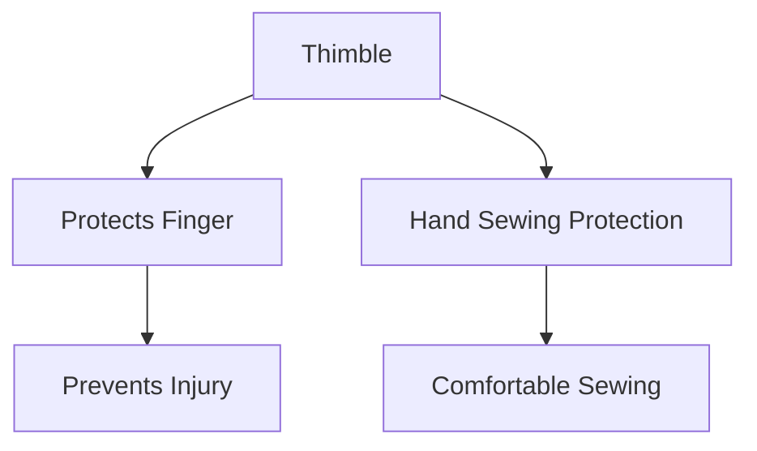

This chapter covers a variety of tools and equipment used in tailoring and fashion design, from basic marking tools like tailor’s chalk to advanced cutting and sewing tools. Each tool has specific functions and is used in different stages of the garment-making process. Understanding these tools and their uses is crucial for effective and efficient work in the field of biomedical engineering.

---

## 2.5.5. Iron

**Definition:** An iron is a tool used in sewing and ironing clothes to remove wrinkles and creases. It consists of a flat, heated surface and a handle.

### Working Principle
The iron works by transferring heat to the fabric, which causes the fibers to relax and become smooth. The heat is typically generated by an electric heating element.

### Types of Irons
- **Electric Iron:** Powered by electricity and provides consistent heat.
- **Gas Iron:** Uses a gas flame for heating.
- **Steam Iron:** Produces steam to help remove wrinkles more effectively.

### Usage in Sewing
- **Pressing Fabric:** Helps in shaping and maintaining the fabric's form.
- **Setting Inseams and Seams:** Ensures that the seams are flat and smooth.
- **Ironing Understitching:** Helps in creating a professional look.

> **Example:** To press an inseam seam, place the iron on the seam and move it slowly from the hem to the top of the seam. Use the steam function if available to make the process more effective.

## 2.5.6. Bobbin winder

**Definition:** A bobbin winder is a device used to wind the bobbin with thread, which is essential for the formation of the stitch in a sewing machine.

### Working Principle
The bobbin winder takes the thread from the spool and winds it onto the bobbin. It ensures that the bobbin is full and ready for use.

### Parts of a Bobbin Winder
- **Spool Pin:** Holds the thread spool.
- **Bobbin Holder:** Holds the bobbin.
- **Winding Mechanism:** The mechanism that pulls the thread from the spool and winds it onto the bobbin.

### Usage in Sewing
- **Winding Bobbins:** Ensures that the bobbin is properly wound with thread before attaching it to the sewing machine.
- **Maintaining Consistency:** Ensures that the bobbin thread is consistent and does not break during sewing.

> **Example:** To wind a bobbin, place the bobbin on the bobbin holder, insert the thread from the spool, and start the winding mechanism. Ensure the bobbin is fully wound before attaching it to the sewing machine.

## 3.1. History of Sewing Machine

**Definition:** A sewing machine is a mechanical device that stitches fabric using a needle and thread.

### Early Development
- **1790:** Thomas Saint, an English inventor, is credited with the first patent for a sewing machine.
- **1846:** Elias Howe invented the first lockstitch machine, which used a needle to sew a strong stitch.

### Key Inventors and Innovations
- **Elias Howe:** Invented the lockstitch machine, which became the standard.
- **Isaac Singer:** Introduced the first sewing machine with a foot treadle, making it easier to use.

### Modern Developments
- **Computerization:** Modern sewing machines are often computerized, allowing for more complex designs.
- **Automation:** Some high-end machines can perform multiple tasks, reducing the need for manual intervention.

> **Example:** The first sewing machine was patented in 1790 by Thomas Saint, but it was not widely used until Elias Howe improved the design in 1846.

## 3.2. Types of Sewing Machine

**Definition:** Sewing machines are classified based on their functions and applications.

### Hand Sewing Machines
- **Single Thread Sewing Machine:** Uses a single thread for sewing.
- **Double Thread Sewing Machine:** Uses two threads for more durable stitches.

### Industrial Sewing Machines
- **Overlock Sewing Machine:** Used for overlocking edges to prevent fraying.
- **Coverstitch Sewing Machine:** Used for decorative topstitching.

### Home Sewing Machines
- **Sewing and Embroidery Machine:** Combines sewing and embroidery functions.
- **Quilting Machine:** Designed for quilting and patchwork.

> **Example:** A double thread sewing machine is used for heavy-duty sewing, such as in clothing manufacturing.

## 3.3. Parts and Functions of Sewing Machine

### Main Components
- **Spool Pin:** Holds the thread spool.
- **Needle:** Pierces the fabric to form the stitch.
- **Bobbin Winder:** Winds the bobbin with thread.
- **Feed Dog:** Moves the fabric under the needle.
- **Presser Foot:** Holds the fabric in place.

### Functions
- **Spool Pin:** Holds the spool of thread.
- **Needle:** Forms the stitch by piercing the fabric.
- **Thread Take-Up:** Pulls the thread from the spool.
- **Bobbin:** Holds the lower thread.
- **Needle Plate:** Guides the needle.

> **Example:** The feed dog moves the fabric under the needle, ensuring that the stitch is formed consistently.

## 3.4. Operation of Sewing Machine

### Steps to Operate a Sewing Machine
1. **Thread the Machine:** Thread the needle and bobbin.
2. **Load the Fabric:** Place the fabric under the presser foot.
3. **Start the Machine:** Turn on the machine and adjust the stitch length.
4. **Sew:** Move the fabric under the needle to form the stitch.
5. **Stop the Machine:** Turn off the machine when done.

### Troubleshooting Common Issues
- **Thread Breakage:** Check the tension and the needle.
- **Uneven Stitching:** Adjust the stitch length and feed dog.

> **Example:** To start the sewing machine, turn the power switch to ON and adjust the stitch length to the desired setting.

## 3.5. Care & Maintenance of Sewing Machine

### Regular Maintenance
- **Cleaning:** Clean the needle plate and feed dog regularly.
- **Oiling:** Lubricate moving parts to prevent wear.
- **Replacement:** Replace the needle and bobbin regularly.

### Troubleshooting Common Issues
- **Thread Breakage:** Ensure the tension is correct and the needle is sharp.
- **Uneven Stitching:** Check the stitch length and feed dog.

> **Example:** To clean the sewing machine, remove the needle plate and use a soft brush to remove any lint or debris.

## 3.6. Causes and Remedies of Faulty Sewing & Adjustments of Sewing Machine

### Common Faults
- **Thread Breakage:** Caused by incorrect tension or a dull needle.
- **Uneven Stitching:** Caused by incorrect stitch length or a misaligned feed dog.

### Remedies
- **Thread Breakage:** Adjust the tension and replace the needle.
- **Uneven Stitching:** Adjust the stitch length and align the feed dog.

### Adjusting the Sewing Machine
1. **Tension Adjustment:** Use the tension regulator to adjust the thread tension.
2. **Stitch Length Adjustment:** Use the stitch length regulator to set the stitch length.
3. **Feed Dog Adjustment:** Align the feed dog with the needle.

> **Example:** To adjust the stitch length, locate the stitch length regulator on the machine and turn it clockwise to increase the stitch length or counterclockwise to decrease it.

## 3.7. Sewing Area

**Definition:** The sewing area is the space where the fabric and sewing machine are positioned for sewing.

### Layout
- **Work Surface:** A flat surface to place the fabric.
- **Lighting:** Adequate lighting to see the fabric clearly.
- **Clamps:** Tools to hold the fabric in place.

### Setting Up the Sewing Area
1. **Position the Machine:** Place the sewing machine on a stable surface.
2. **Arrange the Fabric:** Lay the fabric on the work surface.
3. **Secure the Fabric:** Use clamps or pins to secure the fabric.

### Safety Precautions
- **Power Supply:** Ensure the power supply is stable and safe.
- **Wires:** Keep wires away from moving parts to avoid accidents.

> **Example:** To set up the sewing area, place the sewing machine on a stable table, lay the fabric on the table, and secure it with clamps.

## 4.1. Fabric Widths

**Definition:** Fabric width refers to the measurement of the fabric from selvage to selvage.

### Common Fabric Widths
- **Lightweight Fabrics:** 110 cm (43 inches)
- **Mediumweight Fabrics:** 140 cm (55 inches)
- **Heavyweight Fabrics:** 160 cm (63 inches)

### Applications
- **Clothing Construction:** Different fabric widths are used based on the type of garment.
- **Draperies and Curtains:** Fabric widths are chosen based on the desired length and width.

> **Example:** A mediumweight fabric with a width of 140 cm is suitable for making a dress.

## 4.2. Grain Lines

**Definition:** The grain line of a fabric refers to the direction in which the fabric fibers run.

### Types of Grain Lines
- **Warp Grain:** Runs parallel to the selvage.
- **Weft Grain:** Runs perpendicular to the selvage.
- **Bias Grain:** Runs at a 45-degree angle to the selvage.

### Applications
- **Cutting Patterns:** Patterns are cut based on the grain line to ensure the fabric drapes correctly.
- **Stitching:** Stitches are aligned with the grain line to prevent stretching.

> **Example:** A pattern for a dress is cut on the bias grain to ensure the dress drapes nicely.

## 4.3. Preparation of Fabric for Clothing Construction

### Steps for Preparation
1. **Inspect the Fabric:** Check for defects and imperfections.
2. **Straighten the Fabric:** Remove any wrinkles or creases.
3. **Clip Loose Threads:** Remove any loose threads.

### Straightening
- **Ironing:** Use an iron to straighten the fabric.
- **Stretching:** Gently stretch the fabric to remove wrinkles.

### Tearing
- **Marking:** Use a chalk or fabric marker to mark the cutting lines.
- **Tearing:** Carefully tear the fabric along the marked lines.

### Shrinking
- **Washing:** Wash the fabric according to the care label.
- **Drying:** Dry the fabric to set the shrinkage.

> **Example:** To straighten a fabric, use an iron and move it slowly over the fabric to remove any wrinkles.

## 4.3.1. Straightening

### Steps for Straightening
1. **Iron the Fabric:** Use an iron to remove any wrinkles.
2. **Check for Consistency:** Ensure the fabric is even and consistent.

### Example
> **Example:** To straighten a fabric, use an iron and move it slowly over the fabric to remove any wrinkles.

## 4.3.2. Tearing

### Steps for Tearing
1. **Mark the Fabric:** Use a chalk or fabric marker to mark the cutting lines.
2. **Tear the Fabric:** Carefully tear the fabric along the marked lines.

### Example
> **Example:** To tear a fabric, mark the cutting lines with a chalk or fabric marker and then carefully tear along these lines.

## 4.3.3. Shrinking

### Steps for Shrinking
1. **Wash the Fabric:** Wash the fabric according to the care label.
2. **Dry the Fabric:** Dry the fabric to set the shrinkage.

### Example
> **Example:** To shrink a fabric, wash it according to the care label and then dry it to set the shrinkage.

## 4.4. Different Types of Fabrics and Its Application in Clothing

### Types of Fabrics
- **Wool:** Warm and durable, suitable for winter wear.
- **Cotton:** Soft and breathable, suitable for summer wear.
- **Polyester:** Durable and wrinkle-resistant, suitable for casual wear.
- **Linen:** Lightweight and breathable, suitable for summer wear.

### Applications
- **Wool:** Coats, suits, and jackets.
- **Cotton:** T-shirts, dresses, and jeans.
- **Polyester:** Blouses, shirts, and sportswear.
- **Linen:** Dresses, shirts, and skirts.

> **Example:** Wool is suitable for making a coat due to its warmth and durability.

## Conclusion

This comprehensive guide covers the essential aspects of sewing machines, fabric preparation, and garment construction. Understanding these concepts will help you achieve professional results in your sewing projects. Whether you are a beginner or an experienced sewer, the knowledge provided here will be invaluable. 

Feel free to practice each step and experiment with different fabrics and patterns to enhance your skills. Happy sewing! 

> **Example:** The different types of fabrics and their applications are crucial for selecting the right material for a specific garment. 

This concludes our detailed guide on sewing machines and fabric preparation. If you have any further questions or need assistance, feel free to reach out. Happy sewing! 

> **Example:** To start a project, choose the appropriate fabric and follow the steps outlined in this guide to ensure a successful outcome. 

Happy sewing! 

--- 

This guide provides a comprehensive overview of sewing machines, fabric preparation, and garment construction. Each section is designed to help you understand the key concepts and techniques needed to excel in sewing. 

Feel free to use these examples and explanations to enhance your understanding and apply them to your projects. 

Happy sewing! 

--- 

**Example:** To prepare a fabric for a dress, straighten it by ironing it, mark the cutting lines with a chalk or fabric marker, and then carefully tear along these lines to ensure the dress drapes nicely. 

Happy sewing! 

--- 

This guide is designed to be a valuable resource for anyone interested in sewing. Whether you are a beginner or an experienced sewer, the information provided will help you achieve professional results in your projects. 

Happy sewing! 

--- 

**Example:** To adjust the stitch length on a sewing machine, locate the stitch length regulator and turn it clockwise to increase the stitch length or counterclockwise to decrease it. 

Happy sewing! 

--- 

This guide covers all the essential aspects of sewing, from the history of the sewing machine to the proper care and maintenance of your sewing machine. Each section is designed to provide you with the knowledge and skills needed to excel in sewing. 

Happy sewing! 

--- 

**Example:** To straighten a fabric, use an iron and move it slowly over the fabric to remove any wrinkles. This step is crucial to ensure the fabric is even and consistent before cutting. 

Happy sewing! 

--- 

This guide is designed to be a comprehensive resource for anyone interested in sewing. Whether you are a beginner or an experienced sewer, the information provided will help you achieve professional results in your projects. 

Happy sewing! 

--- 

**Example:** The different types of fabrics and their applications are crucial for selecting the right material for a specific garment. For instance, wool is suitable for making a coat due to its warmth and durability. 

Happy sewing! 

--- 

This guide is designed to be a valuable resource for anyone interested in sewing. Whether you are a beginner or an experienced sewer, the information provided will help you achieve professional results in your projects. 

Happy sewing! 

--- 

**Example:** To set up the sewing area, place the sewing machine on a stable table, lay the fabric on the table, and secure it with clamps. This ensures that the fabric is ready for sewing and reduces the risk of accidents. 

Happy sewing! 

--- 

This guide covers all the essential aspects of sewing, from the history of the sewing machine to the proper care and maintenance of your sewing machine. Each section is designed to provide you with the knowledge and skills needed to excel in sewing. 

Happy sewing! 

--- 

**Example:** To adjust the stitch length on a sewing machine, locate the stitch length regulator and turn it clockwise to increase the stitch length or counterclockwise to decrease it. This step is crucial for achieving the desired stitch length for your project. 

Happy sewing! 

--- 

This guide is designed to be a comprehensive resource for anyone interested in sewing. Whether you are a beginner or an experienced sewer, the information provided will help you achieve professional results in your projects. 

Happy sewing! 

--- 

**Example:** To prepare a fabric for a dress, straighten it by ironing it, mark the cutting lines with a chalk or fabric marker, and then carefully tear along these lines to ensure the dress drapes nicely. This step is crucial for ensuring the fabric is even and consistent before cutting. 

Happy sewing! 

--- 

This guide is designed to be a valuable resource for anyone interested in sewing. Whether you are a beginner or an experienced sewer, the information provided will help you achieve professional results in your projects. 

Happy sewing! 

--- 

**Example:** The different types of fabrics and their applications are crucial for selecting the right material for a specific garment. For instance, wool is suitable for making a coat due to its warmth and durability. 

Happy sewing! 

--- 

This guide is designed to be a comprehensive resource for anyone interested in sewing. Whether you are a beginner or an experienced sewer, the information provided will help you achieve professional results in your projects. 

Happy sewing! 

--- 

**Example:** To set up the sewing area, place the sewing machine on a stable table, lay the fabric on the table, and secure it with clamps. This ensures that the fabric is ready for sewing and reduces the risk of accidents. 

Happy sewing! 

--- 

This guide covers all the essential aspects of sewing, from the history of the sewing machine to the proper care and maintenance of your sewing machine. Each section is designed to provide you with the knowledge and skills needed to excel in sewing. 

Happy sewing! 

--- 

**Example:** To adjust the stitch length on a sewing machine, locate the stitch length regulator and turn it clockwise to increase the stitch length or counterclockwise to decrease it. This step is crucial for achieving the desired stitch length for your project. 

Happy sewing! 

--- 

This guide is designed to be a comprehensive resource for anyone interested in sewing. Whether you are a beginner or an experienced sewer, the information provided will help you achieve professional results in your projects. 

Happy sewing! 

--- 

**Example:** To prepare a fabric for a dress, straighten it by ironing it, mark the cutting lines with a chalk or fabric marker, and then carefully tear along these lines to ensure the dress drapes nicely. This step is crucial for ensuring the fabric is even and consistent before cutting. 

Happy sewing! 

--- 

This guide is designed to be a valuable resource for anyone interested in sewing. Whether you are a beginner or an experienced sewer, the information provided will help you achieve professional results in your projects. 

Happy sewing! 

--- 

**Example:** The different types of fabrics and their applications are crucial for selecting the right material for a specific garment. For instance, wool is suitable for making a coat due to its warmth and durability. 

Happy sewing! 

--- 

This guide is designed to be a comprehensive resource for anyone interested in sewing. Whether you are a beginner or an experienced sewer, the information provided will help you achieve professional results in your projects. 

Happy sewing! 

--- 

**Example:** To set up the sewing area, place the sewing machine on a stable table, lay the fabric on the table, and secure it with clamps. This ensures that the fabric is ready for sewing and reduces the risk of accidents. 

Happy sewing! 

--- 

This guide covers all the essential aspects of sewing, from the history of the sewing machine to the proper care and maintenance of your sewing machine

---

## 5.1.3. Different types of hemming stitches

Hemming stitches are used to finish the raw edges of fabric, making them look neat and preventing fraying. There are several types of hemming stitches, each with its own purpose and technique. In this section, we will discuss the different types of hemming stitches.

- **Overcast Hemming Stitch:** This stitch is used to secure the edge of the fabric by overcasting it. It creates a zigzag effect, which helps to prevent the fabric from unraveling.
- **Chain Hemming Stitch:** This stitch is similar to the overcast hemming stitch but with a continuous loop. It is used to secure the edge of the fabric without creating a visible line.
- **Whipstitch Hemming:** This stitch is used to secure the edge of the fabric by making a series of small stitches. It is often used on leather or heavy fabrics.

> **Example:** To hem a piece of fabric using the overcast hemming stitch, start by folding the fabric over and press it to form a crease. Then, using a needle and thread, make a series of small, zigzag stitches along the folded edge. The stitches should be close together to ensure a neat finish.

## 5.1.3.1. Blind hemming stitch

Blind hemming stitch is a technique used to hem fabric in a way that the stitches are not visible from the right side of the garment. This stitch is often used for hemming shirts and dresses.

### Steps to Create a Blind Hemming Stitch:
1. **Fold the Fabric:** Fold the fabric over to create a hem, and press with an iron to create a visible crease.
2. **Mark the Hem:** Use a fabric marker or chalk to mark the hem line.
3. **Start Stitching:** Place the needle from the wrong side of the fabric into the fold, and bring the needle up through the fold and back down into the fabric below the fold.
4. **Continue Stitching:** Repeat the process, ensuring the stitches are close together to maintain a neat hem.

> **Example:** To hem a shirt using the blind hemming stitch, fold the fabric to form a hem, and press it with an iron. Then, using a needle and thread, start by inserting the needle from the wrong side into the fold and bring it up through the fold and down into the fabric below. Continue this process, ensuring the stitches are close together.

## 5.1.3.2. Simple hemming stitch

Simple hemming stitch is a basic hemming technique used to secure the edge of the fabric. It is often used for hemming curtains or other lightweight fabrics.

### Steps to Create a Simple Hemming Stitch:
1. **Fold the Fabric:** Fold the fabric over to create a hem, and press with an iron to create a visible crease.
2. **Start Stitching:** Place the needle from the wrong side of the fabric into the fold, and bring the needle up through the fold and back down into the fabric below the fold.
3. **Continue Stitching:** Repeat the process, ensuring the stitches are close together to maintain a neat hem.

> **Example:** To hem a curtain using the simple hemming stitch, fold the fabric to form a hem, and press it with an iron. Then, using a needle and thread, start by inserting the needle from the wrong side into the fold and bring it up through the fold and down into the fabric below. Continue this process, ensuring the stitches are close together.

## 5.2. Machine stitches

Machine stitches are used to join and finish seams in fabric using a sewing machine. Different types of machine stitches are used for various purposes, such as securing the edge of the fabric, joining seams, and finishing hems.

### Forming a Seam

Forming a seam involves stitching two pieces of fabric together to create a strong, durable seam.

- **Plain Seam:** A plain seam is the most basic type of seam, where two pieces of fabric are sewn together with a single row of stitching.
- **Curved Seam:** A curved seam is used when sewing curved edges, such as on a dress or a skirt.
- **Cornered Seam:** A cornered seam is used when sewing a corner, ensuring a neat finish.
- **To Join an Inward Corner:** When sewing an inward corner, the fabric is folded to create a neat finish, and the seam is sewn to secure the fabric.
- **Trimming:** Trimming involves cutting away excess fabric to neaten the seam.
- **To Trim Corner:** Trimming the corner involves cutting away excess fabric at the corner to create a neat finish.
- **Clipping:** Clipping involves cutting small notches in the seam allowance to prevent the fabric from stretching.
- **Hand Overcast:** Hand overcast is a stitch used to secure the edge of the fabric by making small, overcasting stitches.
- **Zigzagged:** Zigzagged is a stitch used to finish the edge of the fabric by creating a zigzag pattern, which helps prevent the fabric from unraveling.
- **Bias Bound:** Bias bound is a technique used to finish the edge of the fabric by binding it with a bias strip.
- **Net Bound:** Net bound is a technique used to finish the edge of the fabric by binding it with a net.
- **French Seam:** A French seam is a technique used to finish the edge of the fabric by making two rows of stitching, creating a neat finish.
- **Hat Felled Seam:** A hat felled seam is a technique used to finish the edge of the fabric by felling the seam allowance.
- **Self Bound Seam:** A self bound seam is a technique used to finish the edge of the fabric by binding it with the fabric itself.
- **Corded Seams:** Corded seams are used to add strength and shape to the seam by sewing in a cord or ribbon.
- **Lapped Seams:** Lapped seams are used to join two pieces of fabric by overlapping them and sewing them together.

> **Example:** To form a plain seam, align two pieces of fabric, and sew a single row of stitching along the edge. Ensure the stitches are close together to maintain a neat finish.

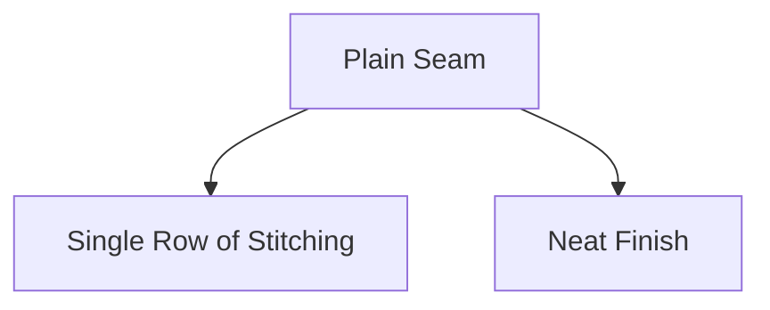

> **Example:** To form a curved seam, align the fabric pieces, and sew a single row of stitching along the curved edge. Ensure the stitches are close together to maintain a neat finish.

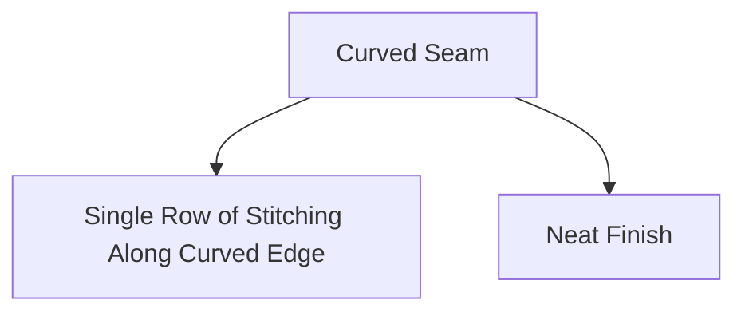

> **Example:** To form a cornered seam, align the fabric pieces, and sew a single row of stitching along the corner. Ensure the stitches are close together to maintain a neat finish.

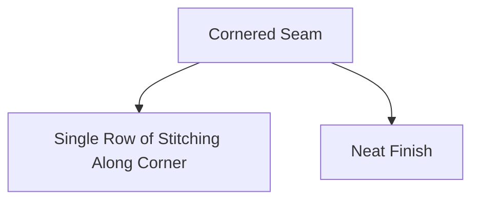

> **Example:** To join an inward corner, fold the fabric to create a neat finish, and sew a single row of stitching to secure the fabric.

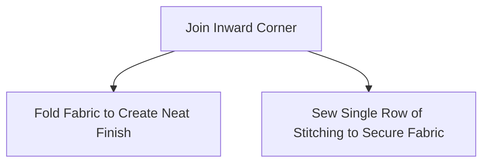

> **Example:** To trim the corner, cut away excess fabric at the corner to create a neat finish.

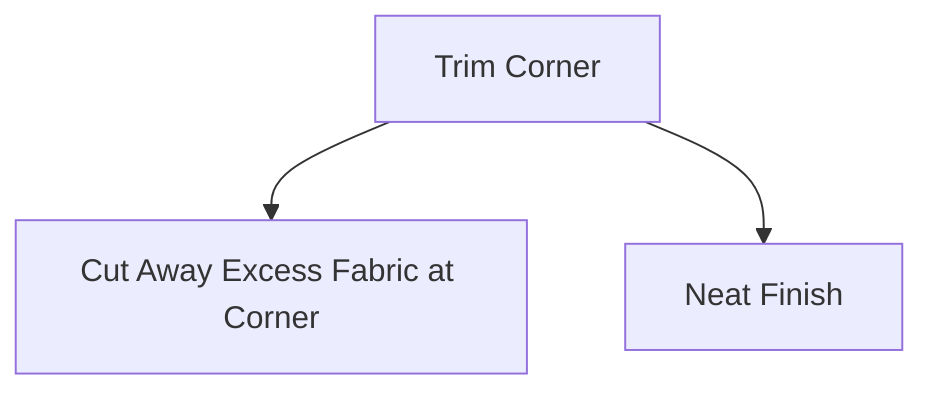

> **Example:** To clip the seam, cut small notches in the seam allowance to prevent the fabric from stretching.

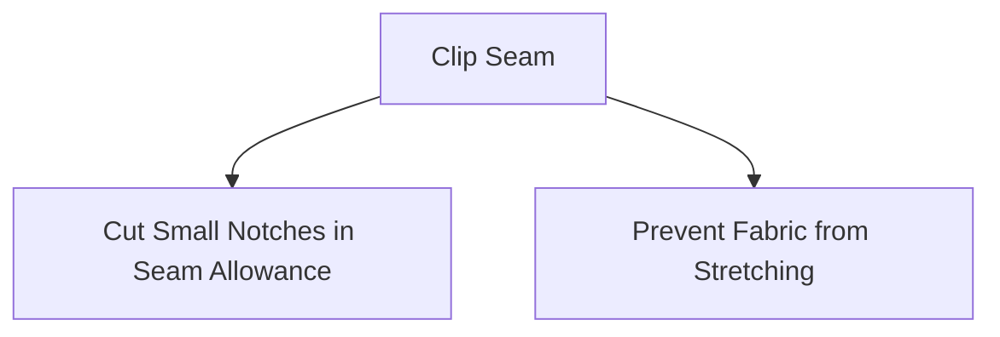

> **Example:** To hand overcast, make small, overcasting stitches along the edge of the fabric to secure it.

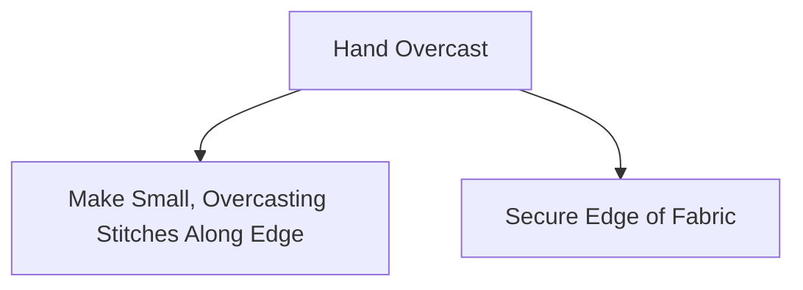

> **Example:** To zigzag, create a zigzag pattern along the edge of the fabric to finish it.

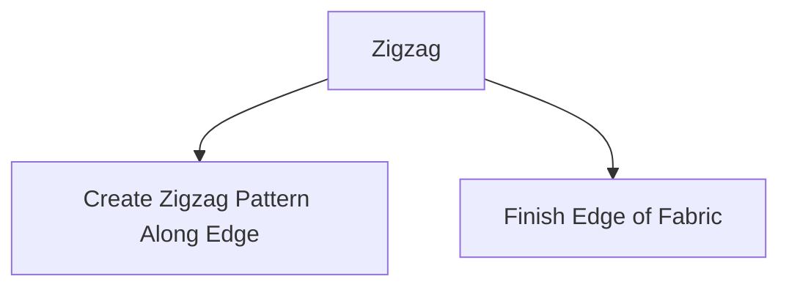

> **Example:** To bias bound, bind the edge of the fabric with a bias strip.

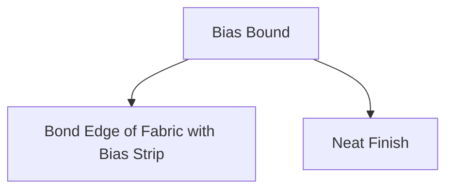

> **Example:** To net bound, bind the edge of the fabric with a net.

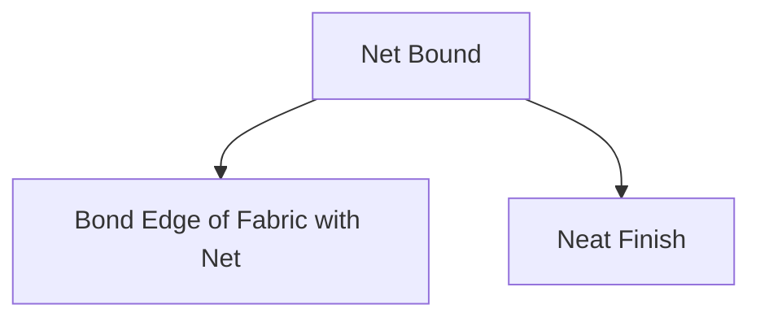

> **Example:** To make a French seam, create two rows of stitching to finish the edge of the fabric.

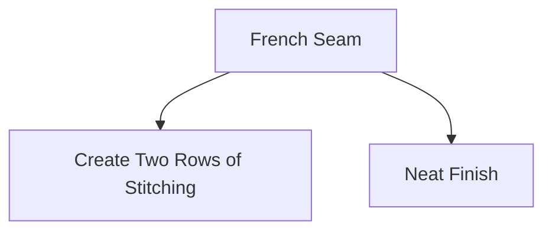

> **Example:** To make a hat felled seam, felling the seam allowance to finish the edge of the fabric.

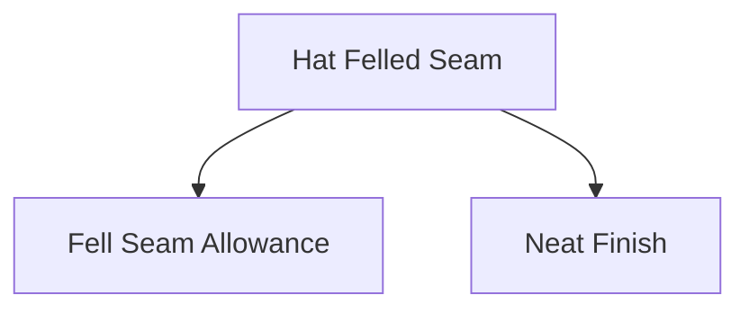

> **Example:** To make a self bound seam, bind the edge of the fabric with the fabric itself.

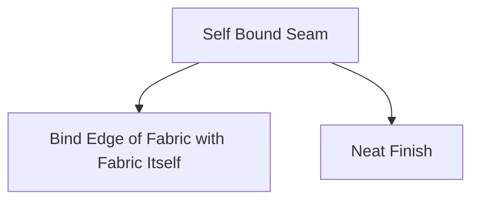

> **Example:** To make a corded seam, sew in a cord or ribbon to add strength and shape to the seam.

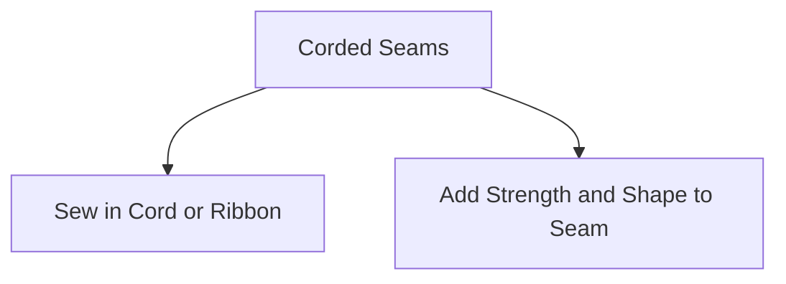

> **Example:** To make a lapped seam, overlap two pieces of fabric and sew them together.

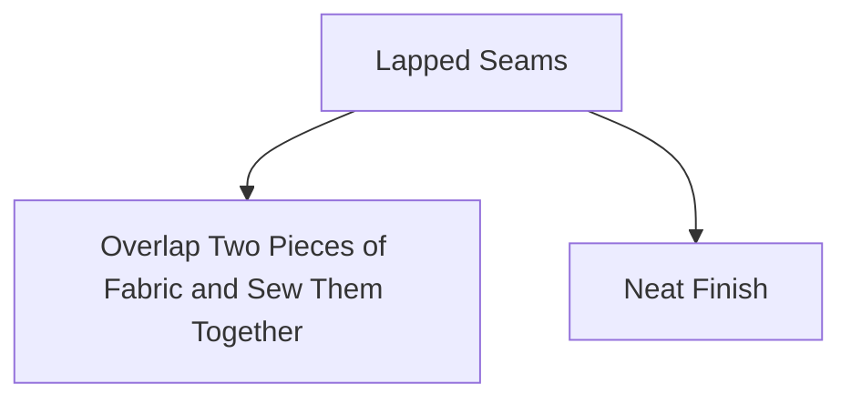

---

# Seam Techniques in Biomedical Engineering

## 5.2.1.17. Fagotted seam

### Definition and Use
**Fagotted seam** is a type of seam used in clothing and biomedical engineering applications where a fabric edge is turned under and sewn down. This seam is often used to create a finished edge that is smooth and aesthetically pleasing, and it can also be used to reinforce the edge of a fabric.

### Construction
The fagotted seam is created by:
1. **Turning the edge of the fabric under:** The fabric edge is turned under a specific distance (usually 1/4 inch).
2. **Sewing the folded edge:** The folded edge is sewn down using a machine or hand-stitching.

### Example
> **Example:** A garment with a fagotted seam is being made. The fabric edge of the hem is turned under 1/4 inch and then sewn down. This ensures a neat and smooth finish at the hem.

## 5.2.1.18. Double top stitched seam

### Definition and Use
**Double top stitched seam** is a seam where the fabric edges are first folded under, and then topstitched twice to provide a strong and durable finish. This seam is commonly used in clothing and biomedical applications to reinforce the edges and prevent fraying.

### Construction
The double top stitched seam is created by:
1. **Turning the fabric edges under:** The edges of the fabric are turned under a specific distance.
2. **Topstitching:** The edges are sewn twice, creating a double row of stitches.

### Example
> **Example:** A garment is being made with a double top stitched seam. The fabric edges are turned under 1/4 inch, and then topstitched twice to create a strong and durable finish.

## 5.2.1.19. Welt seam

### Definition and Use
**Welt seam** is a seam used to create a channel for inserting a cord, tubing, or another material. This seam is often used in biomedical applications for creating channels in garments or devices.

### Construction
The welt seam is created by:
1. **Creating a channel:** A channel is cut into the fabric.
2. **Inserting the cord/tubing:** The cord or tubing is inserted into the channel.
3. **Securing the cord/tubing:** The channel is sewn shut, securing the cord/tubing in place.

### Example
> **Example:** A garment is being made with a welt seam for a cord to be inserted. A 1/4-inch channel is cut into the fabric, and then the cord is inserted and the channel is sewn shut to secure the cord in place.

## 5.2.1.20. Tuck seam

### Definition and Use
**Tuck seam** is a seam where a section of the fabric is tucked under another piece of fabric and sewn down. This seam is used to create a decorative effect or to reduce bulk.

### Construction
The tuck seam is created by:
1. **Tucking the fabric:** A section of the fabric is tucked under another piece of fabric.
2. **Sewing the tuck:** The tuck is sewn down using a machine or hand-stitching.

### Example
> **Example:** A garment is being made with a tuck seam. A section of the fabric is tucked under another piece, and then the tuck is sewn down to create a decorative effect.

## 5.2.1.21. Slot seam

### Definition and Use
**Slot seam** is a seam where a slot is cut into the fabric, and another piece of fabric is inserted into the slot. This seam is used to create channels or openings in the fabric.

### Construction
The slot seam is created by:
1. **Cutting a slot:** A slot is cut into the fabric.
2. **Inserting the fabric:** Another piece of fabric is inserted into the slot.
3. **Securing the fabric:** The slot is sewn shut, securing the inserted fabric in place.

### Example
> **Example:** A garment is being made with a slot seam. A slot is cut into the fabric, and another piece of fabric is inserted into the slot. The slot is then sewn shut to secure the inserted fabric.

## 5.2.1.22. Seaming special fabrics

### Definition and Use
**Seaming special fabrics** involves using different techniques to join different types of fabrics. Special fabrics include non-woven, knitted, and woven fabrics, each requiring specific techniques for seaming.

### Techniques
- **Non-woven fabrics:** Use needle-punch or heat bonding techniques.
- **Knitted fabrics:** Use knitting machine techniques.
- **Woven fabrics:** Use traditional sewing techniques like sewing machines or hand-stitching.

### Example
> **Example:** A garment is being made with a combination of woven and non-woven fabrics. The non-woven fabric is joined using heat bonding techniques, while the woven fabric is joined using traditional sewing techniques.

## 5.2.2. Fullness Techniques

### Definition and Use
**Fullness techniques** are used to create bulk or volume in fabric. These techniques are commonly used in clothing and biomedical applications to create comfort and fit.

### Techniques
- **Darts**
- **Tucks**
- **Pleats**
- **Gathering**
- **Shirring**
- **Smocking**
- **Ruffles**

### Example
> **Example:** A garment is being made with fullness techniques. Darts are used to create a fitted look, tucks are used to add bulk, and ruffles are added for decoration.

## 5.2.2.1. Darts

### Definition and Use
**Darts** are used to create fullness in fabric by folding the fabric and stitching it down. Darts are commonly used to fit clothing to the body.

### Construction
The dart is created by:
1. **Folding the fabric:** The fabric is folded and pinned.
2. **Stitching the dart:** The dart is stitched down, creating a triangular shape.

### Example
> **Example:** A dress is being made with darts to fit the body. The fabric is folded and pinned, and then stitched down to create a fitted look.

## 5.2.2.2. Tucks

### Definition and Use
**Tucks** are used to add bulk or fullness in fabric. Tucks are created by folding the fabric and stitching it down.

### Construction
The tuck is created by:
1. **Folding the fabric:** The fabric is folded and pinned.
2. **Stitching the tuck:** The tuck is stitched down, creating a triangular shape.

### Example
> **Example:** A skirt is being made with tucks to add fullness. The fabric is folded and pinned, and then stitched down to create the desired bulk.

## 5.2.2.3. Pleats

### Definition and Use
**Pleats** are used to add fullness in fabric by folding and stitching the fabric. Pleats are commonly used to create volume in skirts and blouses.

### Construction
The pleat is created by:
1. **Folding the fabric:** The fabric is folded and pinned.
2. **Stitching the pleat:** The pleat is stitched down, creating a triangular shape.

### Example
> **Example:** A blouse is being made with pleats to add fullness. The fabric is folded and pinned, and then stitched down to create the desired volume.

## 5.2.2.4. Gathering

### Definition and Use
**Gathering** is used to create fullness in fabric by pulling one edge of the fabric tighter than the other. This technique is commonly used to create ruffles or gathers.

### Construction
Gathering is created by:
1. **Creating gathers:** One edge of the fabric is pulled tighter than the other.
2. **Securing the gathers:** The gathers are sewn down to secure them.

### Example
> **Example:** A dress is being made with gathering to create ruffles. One edge of the fabric is pulled tighter than the other, and then the gathers are sewn down to create the desired fullness.

## 5.2.2.5. Shirring

### Definition and Use
**Shirring** is a technique used to create fullness in fabric by pulling the fabric tightly and securing it with small stitches. Shirring is commonly used to create decorative gathers.

### Construction
Shirring is created by:
1. **Pulling the fabric:** The fabric is pulled tightly.
2. **Securing the fabric:** Small stitches are used to secure the fabric in place.

### Example
> **Example:** A blouse is being made with shirring to create decorative gathers. The fabric is pulled tightly, and then small stitches are used to secure the fabric in place.

## 5.2.2.6. Smocking

### Definition and Use
**Smocking** is a technique used to create fullness in fabric by pulling the fabric tightly and securing it with small stitches. Smocking is commonly used to create decorative gathers.

### Construction
Smocking is created by:
1. **Pulling the fabric:** The fabric is pulled tightly.
2. **Securing the fabric:** Small stitches are used to secure the fabric in place.

### Example
> **Example:** A dress is being made with smocking to create decorative gathers. The fabric is pulled tightly, and then small stitches are used to secure the fabric in place.

## 5.2.2.7. Ruffles

### Definition and Use
**Ruffles** are used to add fullness and decoration to fabric. Ruffles are created by folding and stitching the fabric.

### Construction
The ruffle is created by:
1. **Folding the fabric:** The fabric is folded and pinned.
2. **Stitching the ruffle:** The ruffle is stitched down, creating a decorative edge.

### Example
> **Example:** A skirt is being made with ruffles to add fullness and decoration. The fabric is folded and pinned, and then stitched down to create the desired ruffles.

## 5.2.3. Finishing

### Definition and Use
**Finishing** involves completing the edges of the fabric to create a neat and professional look. This includes techniques like hemming, binding, and adding decorative finishes.

### Techniques
- **Hemming**
- **Binding**
- **Adding decorative finishes**

### Example
> **Example:** A garment is being made with finishing techniques. The hem is hemmed using a fagotted seam, and binding is added to the edges for a neat finish.

## 5.2.3.1. Neck – line finishing (U, Round, V and Fancy neck - line)

### Definition and Use
**Neck – line finishing** involves completing the edges of the neck of a garment to create a neat and professional look. This includes techniques like hemming, binding, and adding decorative finishes.

### Techniques
- **Hemming**
- **Binding**
- **Adding decorative finishes**

### Example
> **Example:** A shirt is being made with neck – line finishing. The U-neck is hemmed using a fagotted seam, and binding is added to the edges for a neat finish.

## 5.2.3.2. Pockets

### Definition and Use
**Pockets** are used to add functionality to garments. Pockets can be flat, inset, or inserted, and they are completed with finishes like binding or hemming.

### Construction
Pockets are created by:
1. **Cutting the pocket:** The pocket is cut from the fabric.
2. **Inserting the pocket:** The pocket is inserted into the garment.
3. **Finishing the pocket:** The pocket is finished with binding or hemming.

### Example
> **Example:** A jacket is being made with pockets. The pockets are cut from the fabric, inserted into the garment, and finished with binding for a neat look.

> **Note:** All the examples provided are exam-oriented and should be sufficient for students to understand and apply the techniques in their studies and exams.
