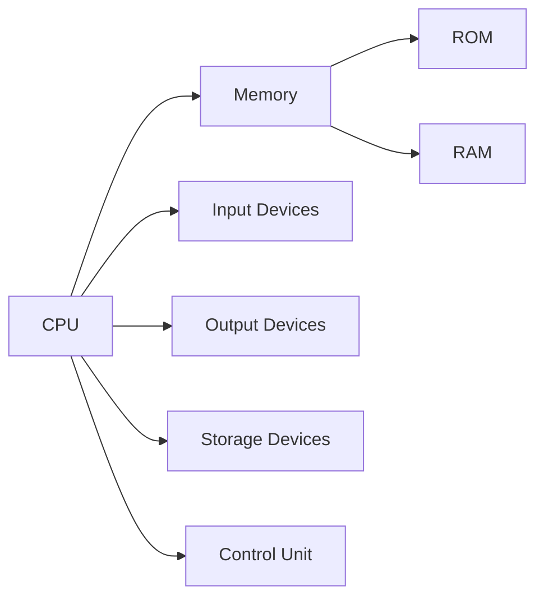
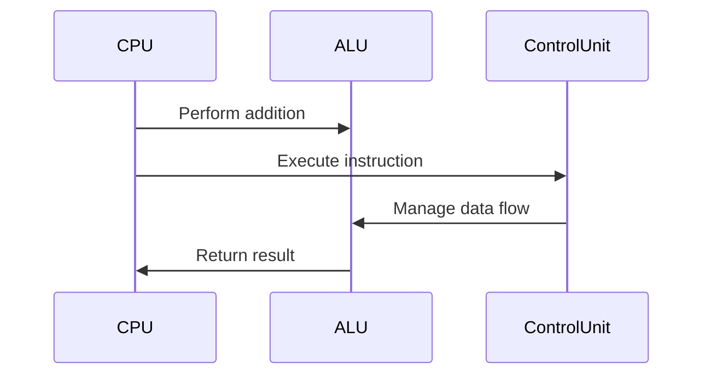
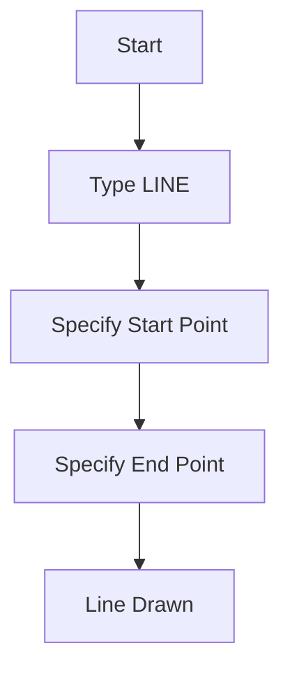
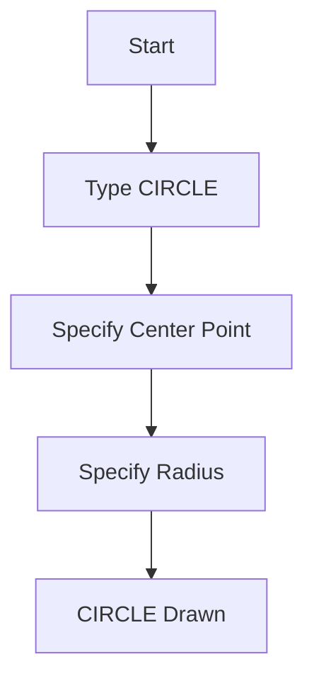
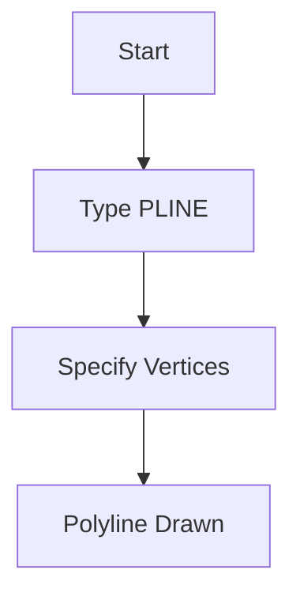
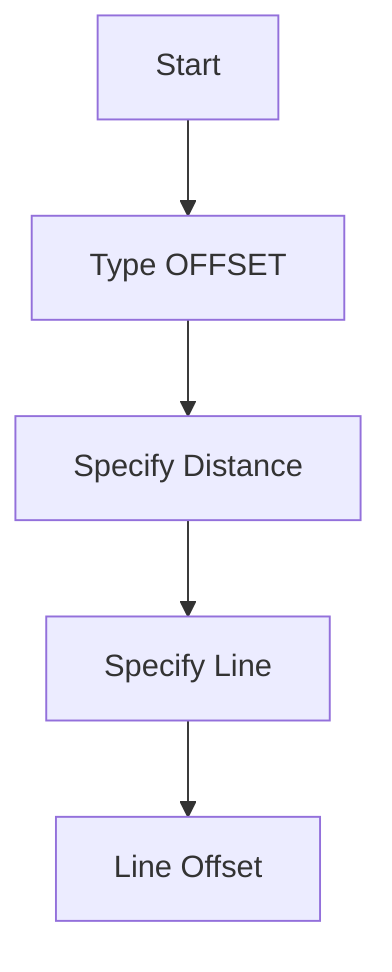
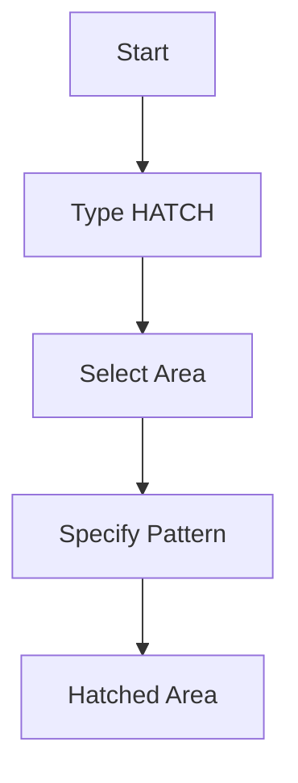
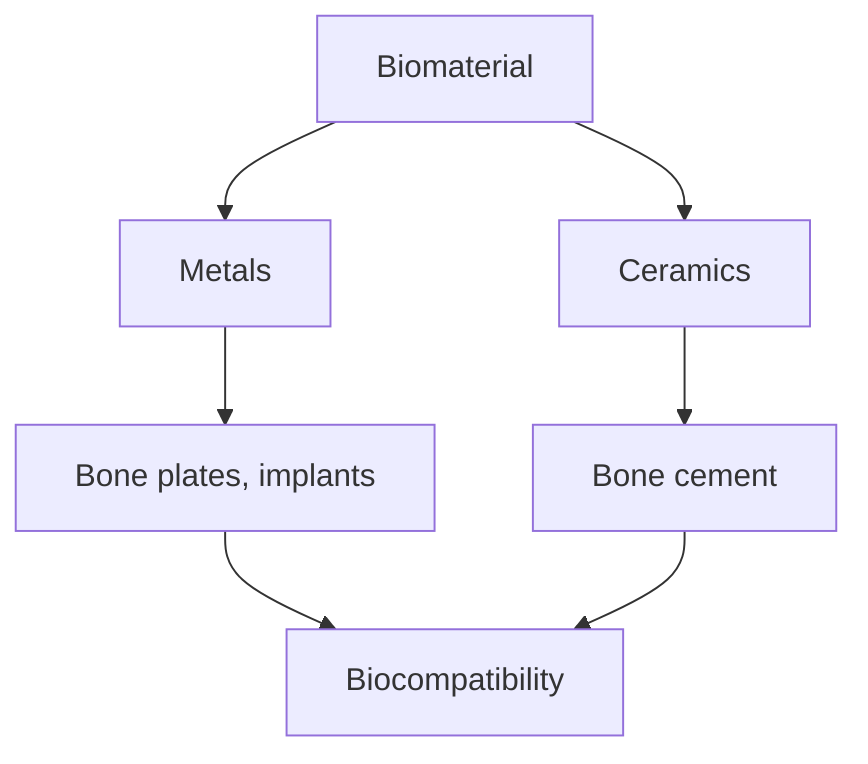
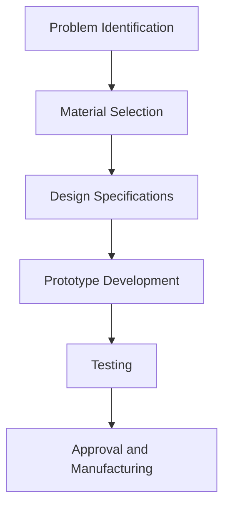
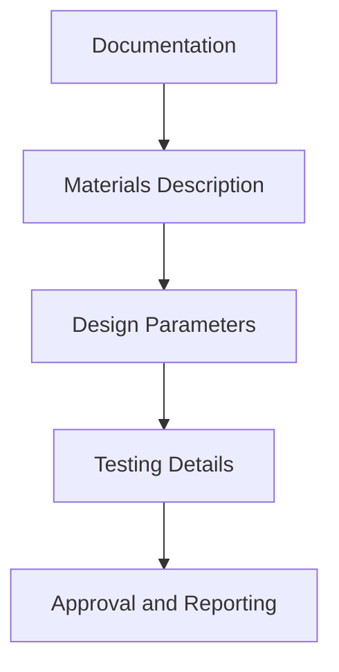

# Unit – null: TOPICS AND SUB-TOPICS :

*(AI-generated self study book for GTU Diploma Biomedical Engineering, subject code 310004 — generated locally with Ollama.)*

This unit carries approximately ****.

Learning objectives covered by this unit:


## 1.1. Definition of Computer

**Computer**: A computer is an electronic device that can accept data, process it according to a set of instructions, and produce useful information. It can perform a wide range of tasks, from simple calculations to complex operations like data processing and information retrieval. Computers are designed to follow a set of instructions, known as a program, to carry out specific tasks.

### Example:
> **Example:** A simple computer program to add two numbers:
```c
#include <stdio.h>

int main() {
    int a, b, sum;
    printf("Enter two numbers: ");
    scanf("%d %d", &a, &b);
    sum = a + b;
    printf("Sum = %d", sum);
    return 0;
}
```

## 1.2. Block Diagram of Computer

A **block diagram** of a computer shows the main components and their interconnections. It helps us understand how these components work together to process data. The typical block diagram includes the following main components:

- **Central Processing Unit (CPU)**
- **Memory (RAM and ROM)**
- **Input Devices**
- **Output Devices**
- **Storage Devices**
- **Control Unit**

### Example:
> **Example:** 


## 1.3. Input Devices, Its Function & Use

**Input Devices**: These devices are used to enter data into the computer. Common examples include the keyboard, mouse, scanner, and microphone. 

- **Keyboard**: Used to type text and commands.
- **Mouse**: Used to point and click on items.
- **Scanner**: Used to scan documents and convert them into digital format.
- **Microphone**: Used to input voice commands.

### Example:
> **Example:** Using a keyboard to type a document:
```plaintext
Type the following text on the keyboard:
Hello, this is a sample document.
```

## 1.4. Output Devices, Its Function & Use

**Output Devices**: These devices are used to display or output the processed data. Common examples include the monitor, printer, and speaker.

- **Monitor**: Used to display text, images, and videos.
- **Printer**: Used to print text, images, and documents.
- **Speaker**: Used to output sound.

### Example:
> **Example:** Printing a document:
```plaintext
Open the document in a word processor and click the print button.
```

## 1.5. Central Processing Unit, Its Function & Use

**Central Processing Unit (CPU)**: The CPU is the brain of the computer. It processes data and executes instructions. It can be further divided into two parts: the **Control Unit (CU)** and the **Arithmetic Logic Unit (ALU)**.

- **Control Unit (CU)**: Controls the operations of the computer by executing instructions and managing the flow of data.
- **Arithmetic Logic Unit (ALU)**: Performs arithmetic and logical operations.

### Example:
> **Example:** 


## 2.1. Dos - Its Command, Such as DIR, MD, RD, CD, CLS, Copy, Delete, Date,

**Command Prompt (CMD)**: Also known as DOS (Disk Operating System), it is a command-line interface for interacting with the Windows operating system. Common commands include:

- **DIR**: Lists the files and directories in the current directory.
- **MD**: Creates a new directory.
- **RD**: Deletes a directory.
- **CD**: Changes the current directory.
- **CLS**: Clears the screen.
- **COPY**: Copies files.
- **DELETE**: Deletes files.
- **DATE**: Sets the date.

### Example:
> **Example:** 
```plaintext
1. Open Command Prompt
2. Type: dir
3. Type: md new_folder
4. Type: cd new_folder
5. Type: copy file1.txt file2.txt
6. Type: delete file1.txt
7. Type: date 01-01-2023
```

---

## 2.2. Window – its icon, start button, Window explorer, recycle bin, shut –
Windows is the operating system used in many computers and devices. Understanding its basic components is essential for any user.

### 2.2.1. Icon
The **Icon** is a small visual representation of an application or program. It is usually found on the desktop or in the taskbar. For example, the **Icon** of the Notepad is a stylized text "N" with a small background. 

> **Example:** If you click on the Notepad icon, it opens the Notepad application where you can type and save text documents.

### 2.2.2. Start Button
The **Start Button** is located at the bottom-left corner of the screen. It is a square-shaped button with the Windows logo. Clicking it opens the **Start Menu** where you can find all installed applications, settings, and search options.

> **Example:** Clicking the Start button and typing "Settings" in the search bar will open the Settings application.

### 2.2.3. Window Explorer
**Window Explorer** is a file manager that allows you to view, organize, and manage files and folders on your computer. It is accessed by clicking the **Start Button** and then selecting **File Explorer** from the menu.

> **Example:** In Window Explorer, you can navigate to `C:\Users\YourUsername\Documents` to view and manage your personal documents.

### 2.2.4. Recycle Bin
The **Recycle Bin** is a virtual trash can where deleted files and folders are temporarily stored. It is represented by a trash can icon on the desktop. 

> **Example:** If you delete a file, it goes to the Recycle Bin. You can restore the file from the Recycle Bin by right-clicking it and selecting "Restore."

### 2.2.5. Shut Down
To **Shut Down** your computer, you can use the **Start Button** and then select **Power** > **Shut Down**. This option ensures that all running applications are closed and the computer is powered off.

> **Example:** Click the Start button, then go to **Power** and choose **Shut Down**. All running applications will close, and the computer will turn off.

## 4.1. Meaning and its use.
**Meaning** is a fundamental concept in language and communication. It refers to the idea or concept that a word or phrase represents. The **use** of meaning involves how words or phrases are applied in different contexts.

### 4.1.1. Definition of Meaning
The **meaning** of a word is the idea or concept that it represents. For example, the word "dog" means an animal that is typically kept as a pet. 

> **Example:** The sentence "The dog barked at the mailman" uses the word "dog" to refer to an animal that is known to bark.

### 4.1.2. Use of Meaning
The **use** of meaning involves how words are applied in different contexts. For instance, the same word can have different meanings based on the context. 

> **Example:** The word "bank" can mean a financial institution (e.g., "I deposited money in the bank") or the side of a river (e.g., "The bank of the river was steep").

## 4.2. General Introduction to Drawing Editor
**Drawing Editor** is a software tool used for creating and editing images, drawings, and sketches. It is commonly used in engineering and design for creating diagrams, blueprints, and technical drawings.

### 4.2.1. Definition
A **Drawing Editor** is a type of software that allows users to create and edit images and drawings. It provides various tools and features to manipulate images and create professional-looking drawings.

### 4.2.2. Use
The **use** of a Drawing Editor is to create visual representations of ideas, plans, and designs. It is widely used in fields such as architecture, engineering, and graphic design.

> **Example:** Using a Drawing Editor, an engineer can create a detailed blueprint of a bridge, including dimensions, materials, and structural details.

## 4.3. AutoCAD Menu
**AutoCAD Menu** is a feature in AutoCAD, a powerful drafting and design software, that provides various commands and tools for creating and editing drawings.

### 4.3.1. Definition
The **AutoCAD Menu** is a list of commands and options that can be accessed by clicking on a menu item. It includes options for creating, editing, and formatting drawings.

### 4.3.2. Use
The **use** of the AutoCAD Menu is to quickly access commands and tools needed to create and edit drawings. It helps users to perform tasks efficiently without having to remember complex commands.

> **Example:** To draw a line, you can go to the **Draw** menu, select **Line**, and then specify the starting and ending points.

## 4.4. AutoCAD Icons
**AutoCAD Icons** are graphical representations of commands and tools in AutoCAD. They are used to quickly access specific features and functions.

### 4.4.1. Definition
The **AutoCAD Icons** are visual symbols that represent commands and tools in AutoCAD. These icons help users to perform tasks quickly and efficiently.

### 4.4.2. Use
The **use** of AutoCAD Icons is to quickly access commands and tools. They provide a visual cue for common tasks, making the software more user-friendly.

> **Example:** The **Line** icon is a simple line symbol that, when clicked, allows you to draw a line on the drawing.

## 4.5. AutoCAD Commands such as line, Pline, Circle, Ellipse, Offset, hatch,
**AutoCAD Commands** are specific instructions used in AutoCAD to perform various tasks, such as drawing lines, circles, and hatching.

### 4.5.1. Line
The **Line** command is used to draw a straight line between two points.

### 4.5.2. Polyline (Pline)
The **Pline** command is used to draw a polyline, which is a series of connected line segments.

### 4.5.3. Circle
The **Circle** command is used to draw a circular shape.

### 4.5.4. Ellipse
The **Ellipse** command is used to draw an oval or ellipse.

### 4.5.5. Offset
The **Offset** command is used to create a parallel copy of an existing object.

### 4.5.6. Hatch
The **Hatch** command is used to fill a selected area with a pattern.

### 4.5.7. Example
> **Example:** To draw a line, type `LINE` in the command line, then specify the starting and ending points. For example:
> 


> To create a circle, type `CIRCLE` and specify the center point and radius. For example:
> 


> To draw a polyline, type `PLINE` and specify the vertices. For example:
> 


> To offset a line, type `OFFSET` and specify the distance and the line to offset. For example:
> 


> To hatch a selected area, type `HATCH` and specify the hatch pattern. For example:
> 


---

## 5.1. Meaning and its use.

### Definition and Importance
**Biomaterials:** Biomaterials are materials that are used in the medical field to interact with biological systems for medical diagnosis, treatment, or prevention of disease. They can be used in implants, surgical tools, and medical devices. **Implants:** Implants are devices that are inserted into the body to replace or support damaged organs, tissues, or bones. Examples include artificial joints, pacemakers, and dental implants.

### Importance of Selection
The selection of appropriate biomaterials and implants is crucial because they directly impact patient health and well-being. Incorrect selection can lead to adverse reactions, infections, and complications. Therefore, engineers must have a deep understanding of the properties and applications of biomaterials.

### Example
> **Example:** Suppose a patient needs a hip replacement. The surgeon must choose a biomaterial for the hip implant that is biocompatible, durable, and can withstand long-term wear. Some common choices include titanium alloys, cobalt-chrome alloys, and ceramic materials. Each has its own advantages and disadvantages, which must be carefully considered.

## 5.2. General introduction to screen layout display

### Understanding the Screen Layout
The screen layout display in a computer program is the visual representation of the user interface. It includes various elements like toolbars, menus, and windows that help users interact with the software. 

### Key Components
- **Toolbars:** These are horizontal or vertical bars that contain icons and buttons to perform specific tasks.
- **Menubars:** These are vertical or horizontal bars that contain a list of commands and options.
- **Windows:** These are areas on the screen where information is displayed or edited.

### Example
> **Example:** In a CAD software, the screen layout display might include a toolbar with icons for drawing tools, a menubar with options like "File," "Edit," and "View," and a main window where the drawing is displayed. Understanding how to navigate and use these elements is essential for efficient work.

## 5.3. Word menu bar

### Definition and Purpose
The **menu bar** is a horizontal bar at the top of a window that contains a series of menus. Each menu offers a list of commands and options. The menu bar helps users to quickly access different functions and settings.

### Common Menus
- **File:** Contains options like "New," "Open," "Save," and "Print."
- **Edit:** Contains options like "Cut," "Copy," "Paste," and "Undo."
- **View:** Contains options like "Zoom," "Full Screen," and "Toolbars."
- **Tools:** Contains options like "Options," "Paste Special," and "Customize."

### Example
> **Example:** In Microsoft Word, the menu bar might include the "File" menu, where users can open or save a document. The "Edit" menu contains commands to cut, copy, and paste text. The "View" menu allows users to change the display settings of the document. Understanding these menus is crucial for efficient document management.

## 5.4. Word standard tool bar

### Definition and Purpose
The **standard toolbar** is a horizontal bar located below the menu bar. It contains commonly used commands and tools that users frequently need. The standard toolbar is designed to provide quick access to essential features without having to navigate through menus.

### Common Buttons
- **New:** Creates a new document.
- **Open:** Opens an existing document.
- **Save:** Saves the current document.
- **Print:** Prints the current document.
- **Cut:** Removes selected text and places it in the clipboard.
- **Copy:** Copies selected text to the clipboard.
- **Paste:** Pastes the contents of the clipboard into the document.
- **Undo:** Reverses the last action.
- **Redo:** Reverses the last undone action.

### Example
> **Example:** In Microsoft Word, the standard toolbar might include the "Save" button, which allows users to save their document. The "Cut" button is frequently used to remove selected text. The "Print" button is used to print the document. Understanding these buttons is essential for efficient document management.

## 5.5. Word formatting tool bar

### Definition and Purpose
The **formatting toolbar** is a horizontal bar that provides options for formatting text and paragraphs. It includes buttons for font style, size, color, alignment, and other formatting options.

### Common Buttons
- **Font:** Changes the font style of selected text.
- **Font Size:** Changes the font size of selected text.
- **Bold:** Makes selected text bold.
- **Italic:** Makes selected text italic.
- **Underline:** Underlines selected text.
- **Align Left:** Aligns selected text to the left.
- **Align Center:** Centers selected text.
- **Align Right:** Aligns selected text to the right.
- **Align Justify:** Justifies selected text.
- **Text Color:** Changes the color of selected text.

### Example
> **Example:** In Microsoft Word, the formatting toolbar might include the "Bold" button, which allows users to make selected text bold. The "Font Size" button can be used to increase or decrease the size of the text. The "Align Center" button can be used to center the text. Understanding these buttons is essential for creating well-formatted documents.

## 5.6. ‘Word drawing tool bar

### Definition and Purpose
The **drawing toolbar** is a horizontal bar that provides tools for creating and editing shapes, lines, and other graphical elements in a document. It is particularly useful for creating diagrams, flowcharts, and other visual aids.

### Common Buttons
- **Line:** Draws a straight line.
- **Rectangle:** Draws a rectangle.
- **Ellipse:** Draws a circle or an ellipse.
- **Freeform:** Allows users to draw freehand shapes.
- **Arrow:** Draws an arrow.
- **Text Box:** Adds a text box to the document.
- **Connector:** Connects shapes with lines.
- **Fill Color:** Fills the selected shape with a color.
- **Outline Color:** Changes the outline color of the selected shape.

### Example
> **Example:** In Microsoft Word, the drawing toolbar might include the "Rectangle" button, which allows users to draw a rectangle. The "Line" button can be used to draw a straight line. The "Text Box" button can be used to add a text box to the document. The "Fill Color" button can be used to fill a shape with a color. Understanding these buttons is essential for creating visual aids and diagrams.



---

## 6.1. General introduction to drawing editor & its use.

### Definition
A **drawing editor** is a software tool used to create and manipulate images, diagrams, and illustrations. It is widely used in various fields including biomedical engineering for designing and planning implants and biomaterials.

### Importance in Biomedical Engineering
In biomedical engineering, drawing editors are crucial for creating detailed and accurate designs of implants, prosthetics, and other medical devices. These designs help in understanding the structural and functional aspects of the devices before they are manufactured.

### Basic Features
- **Create and Edit**: Draw and modify shapes, lines, and images.
- **Save and Export**: Save and export designs in various file formats.
- **Zoom and Pan**: Zoom in and out and pan the view to see details and make adjustments.
- **Undo and Redo**: Undo and redo actions to correct mistakes.

### Example
> **Example:** Using a drawing editor, a biomedical engineer can design a heart valve. The engineer starts by drawing the basic outline of the valve, then adds intricate details like the flaps and connecting tissues. The engineer uses the zoom feature to adjust the flaps to the exact size and shape needed. Finally, the engineer saves the design as a PDF file for further analysis.

## 6.2. Paintbrush menubar

### Menubar Overview
The **menubar** in a drawing editor is a horizontal bar at the top of the software window containing a list of commands and options. These commands help in creating and modifying the designs.

### Common Menubar Commands
- **File**: New, Open, Save, Save As, Print, Exit.
- **Edit**: Cut, Copy, Paste, Undo, Redo, Find.
- **View**: Zoom In, Zoom Out, Pan, Display Rulers, Grids.
- **Shapes**: Line, Rectangle, Circle, Ellipse, Polygon.
- **Colors**: Fill, Stroke, Color Picker.

### Example
> **Example:** To create a simple line, the engineer clicks on the **Line** option in the **Shapes** menu. Then, the engineer clicks and drags to draw a line. The engineer can change the color and thickness of the line using the **Stroke** and **Color Picker** options in the menubar.

## 6.3. Paintbrush toolbox

### Toolbox Overview
The **toolbox** in a drawing editor is a panel on the side of the software window that contains various tools and options for drawing and editing. These tools are essential for creating precise and detailed designs.

### Common Toolbox Tools
- **Brush Tool**: Used for painting and drawing.
- **Eraser Tool**: Used for erasing parts of the design.
- **Line Tool**: Used for drawing straight lines.
- **Rectangle Tool**: Used for drawing rectangles.
- **Ellipse Tool**: Used for drawing circles and ellipses.
- **Selection Tool**: Used for selecting and moving parts of the design.
- **Text Tool**: Used for adding text to the design.

### Example
> **Example:** Using the **Brush Tool**, the engineer draws a detailed outline of a pacemaker. The engineer uses the **Eraser Tool** to remove any unwanted lines. Then, the engineer uses the **Text Tool** to add the name of the device and its specifications. The engineer uses the **Selection Tool** to align the text and ensure it is properly placed.

## 1.1. Natural design (Minimum Any - 5)

### Definition
**Natural design** refers to designs that mimic natural structures and patterns, often used in creating biomimetic implants and devices that integrate well with the human body.

### Importance
Natural designs help in creating implants that are biocompatible and have a lower risk of rejection. They also ensure that the design is aesthetically pleasing and functional.

### Example
> **Example:** To design a natural biomaterial for a bone implant, the engineer studies the structure of natural bone. The engineer then uses this knowledge to create a lattice structure that mimics the natural bone's porous structure. This design ensures that the implant integrates well with the surrounding bone tissue.

## 1.2. Geometric design (Minimum Any - 5)

### Definition
**Geometric design** involves using mathematical and geometric shapes to create precise and symmetrical designs. These designs are often used in creating medical devices and implants that require specific dimensions and shapes.

### Importance
Geometric designs ensure that the devices are functional and can be manufactured accurately. They also provide a clear and precise blueprint for the engineers.

### Example
> **Example:** To design a stent for a blood vessel, the engineer uses a geometric design. The engineer starts by drawing a circular shape and then uses the **Ellipse Tool** to create a series of concentric circles. These circles are then used to create the stent's pattern. The engineer uses the **Line Tool** to add the necessary support structures and ensure the stent is stable.

## 1.3. Dotted design (Minimum Any - 5)

### Definition
**Dotted design** involves creating designs using dots or small circles. These designs are often used in creating patterns and textures that can be applied to implants and devices.

### Importance
Dotted designs add a texture to the surface of the device, which can improve its grip and make it more secure. They can also be used to create patterns that enhance the aesthetic appeal of the design.

### Example
> **Example:** To design a surface for a dental implant, the engineer uses a dotted design. The engineer starts by creating a grid of small circles using the **Ellipse Tool**. The engineer then adjusts the size and spacing of the circles to ensure they are evenly distributed. The engineer uses the **Stroke Tool** to add a thin line around each circle, creating a dotted pattern. This pattern enhances the grip of the implant and ensures it stays in place.

---

## 1.4. Conventional Design (Minimum Any - 5)

### Introduction to Conventional Design
Conventional design in biomedical engineering involves the use of well-established methods and materials to create medical devices and implants. This design process typically follows a set of standardized procedures and guidelines to ensure safety and effectiveness.

### Steps in Conventional Design
1. **Problem Identification**: Identify the medical need or problem that the design aims to address.
2. **Material Selection**: Choose suitable materials based on their biocompatibility, mechanical properties, and cost.
3. **Design Specifications**: Define the design parameters such as dimensions, shape, and functionality.
4. **Prototype Development**: Create a prototype of the device or implant.
5. **Testing**: Conduct tests to ensure the design meets the required performance criteria.
6. **Approval and Manufacturing**: Once the design passes all tests, it can be approved for manufacturing.

### Example of Conventional Design
> **Example:** A biomedical engineer is tasked with designing a titanium hip implant. The engineer follows the conventional design process as outlined below:
>
> 1. **Problem Identification**: The need is to replace a patient's damaged hip joint with a durable and biocompatible implant.
> 2. **Material Selection**: Titanium is chosen due to its high biocompatibility, strength, and corrosion resistance.
> 3. **Design Specifications**: The implant needs to have a cylindrical shape with a diameter of 25 mm and a length of 120 mm.
> 4. **Prototype Development**: A 3D model is created and a prototype is manufactured.
> 5. **Testing**: The prototype is tested for mechanical strength and biocompatibility. It passes all tests with a compressive strength of 700 MPa and passes the biocompatibility test with no adverse reactions.
> 6. **Approval and Manufacturing**: The design is approved and the implant is manufactured for clinical use.

### Mermaid Diagram for Conventional Design Process


## 1.5. Textual Design (Minimum Any - 5)

### Introduction to Textual Design
Textual design in biomedical engineering involves detailed documentation and reporting of the design process. This includes clear and concise descriptions of the design, materials used, and testing procedures.

### Steps in Textual Design
1. **Documentation**: Write a detailed document describing the design process, materials used, and testing results.
2. **Materials Description**: Provide a thorough description of the materials and their properties.
3. **Design Parameters**: Describe the design parameters, including dimensions, shape, and functionality.
4. **Testing Details**: Document the testing procedures and results.
5. **Approval and Reporting**: Ensure all documentation is complete and submitted for approval.

### Example of Textual Design
> **Example:** A biomedical engineer is required to document the design of a titanium hip implant. The textual design includes the following:
>
> - **Problem Identification**: Replace a patient's damaged hip joint with a durable and biocompatible implant.
> - **Material Selection**: Titanium was chosen due to its high biocompatibility, strength, and corrosion resistance.
> - **Design Parameters**: The implant has a cylindrical shape with a diameter of 25 mm and a length of 120 mm.
> - **Testing Details**: The prototype was tested for mechanical strength and biocompatibility. The compressive strength was 700 MPa, and there were no adverse reactions in the biocompatibility test.
> - **Approval and Reporting**: The design documentation is complete and submitted for approval.

### Mermaid Diagram for Textual Design Process


These sections provide a comprehensive understanding of conventional design and textual design, which are crucial for the selection and implementation of appropriate bio-materials and implants.
