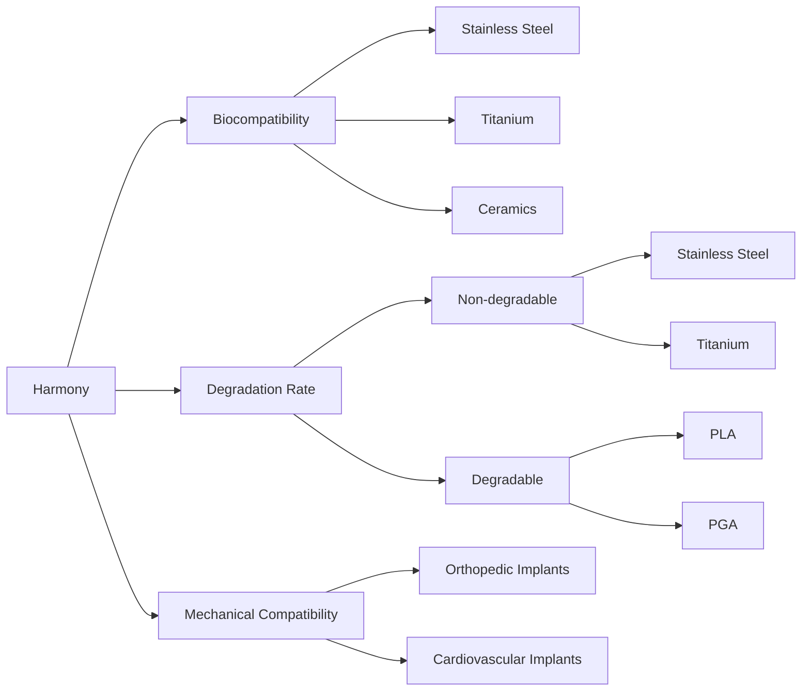
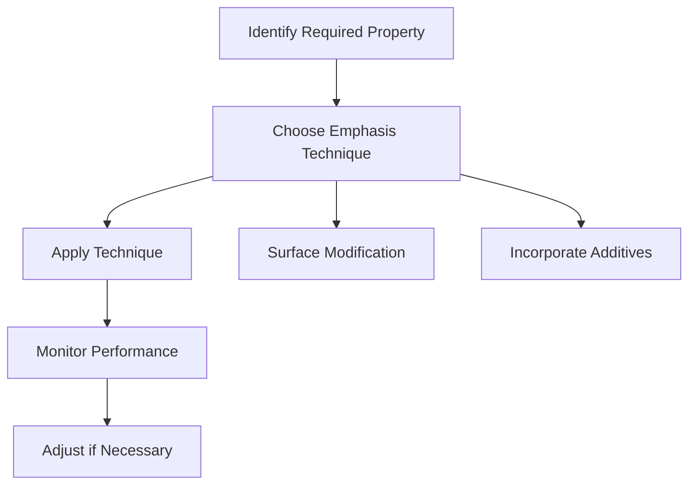
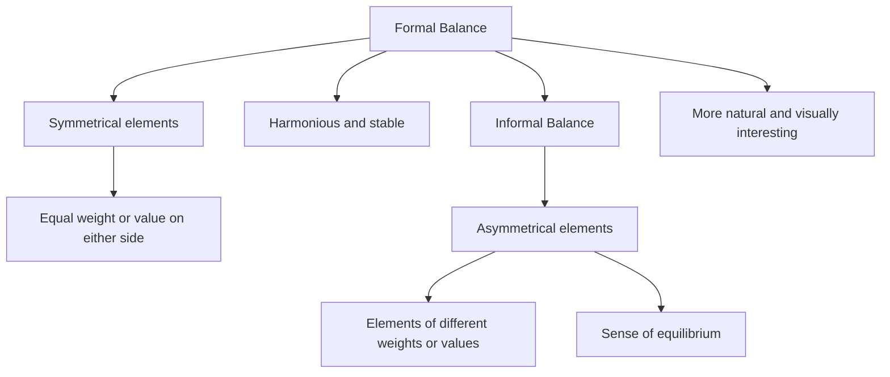

# Unit – null: PRINCIPLES OF DESIGN

*(AI-generated self study book for GTU Diploma Biomedical Engineering, subject code 310004 — generated locally with Ollama.)*

This unit carries approximately ****.

Learning objectives covered by this unit:

## 3.1. Harmony

### Definition and Importance
**Harmony** in biomedical engineering refers to the compatibility and effectiveness of a biomaterial or implant in the body. It involves ensuring that the material integrates well with the body's tissues and functions without causing adverse reactions.

**Importance of Harmony**:
- **Biocompatibility**: Ensures the biomaterial or implant does not cause an immune response or other harmful reactions.
- **Mechanical Compatibility**: Ensures the material has mechanical properties similar to the tissues it replaces or interfaces with.
- **Functional Compatibility**: Ensures the material performs the intended function effectively.

### Factors Influencing Harmony
- **Surface Chemistry**: The chemical composition of the material's surface influences its interaction with the body.
- **Surface Topography**: The surface texture of the material can affect cell adhesion and tissue growth.
- **Degradation Rate**: The rate at which the material degrades is crucial for the healing process and integration with the body.

### Example
> **Example:** 
Consider a titanium implant used in orthopedic surgery. Titanium is chosen for its high biocompatibility and mechanical compatibility with bone tissues. The surface of the implant is treated to create a porous structure, which enhances the bone's ability to grow into the implant, ensuring mechanical compatibility. The degradation rate of titanium is slow, allowing the bone to integrate naturally over time.

### Classification of Biomaterials Based on Harmony
- **Biocompatible Materials**: These materials do not cause any harmful reactions in the body. Examples include stainless steel, titanium, and some ceramics.
- **Biostable Materials**: These materials are used where the implant does not need to degrade, such as in orthopedic implants. Examples include stainless steel and certain ceramics.
- **Biodegradable Materials**: These materials are designed to degrade over time, often used in temporary implants. Examples include polylactic acid (PLA) and polyglycolic acid (PGA).

### Mermaid Diagram: Classification of Biomaterials Based on Harmony

This diagram helps visualize the classification of biomaterials based on their key attributes related to harmony.

### Conclusion
Understanding and selecting appropriate bio-materials and implants based on harmony is crucial for successful biomedical applications. By considering factors such as surface chemistry, surface topography, and degradation rate, engineers can ensure that the biomaterials and implants are compatible and effective in the body.

---

## 3.2. Proportion.

Proportion is a fundamental concept in biomedical engineering, particularly when dealing with the design and selection of bio-materials and implants. Proportion refers to the relationship between different parts of an object or system. It is crucial in ensuring that the design meets the functional requirements and maintains structural integrity.

### Importance of Proportion
Proportion helps in optimizing the design of bio-materials and implants. It ensures that the dimensions of the material or implant are suitable for the intended application. Poor proportion can lead to structural failure, inadequate support, or other functional issues.

### Types of Proportion
- **Linear Proportion:** This involves the ratio of lengths. For example, the ratio of the length of a femur to the diameter of the femoral head.
- **Area Proportion:** This relates to the ratio of areas. For example, the ratio of the cross-sectional area of a bone plate to the area of the bone defect it is meant to fill.
- **Volume Proportion:** This involves the ratio of volumes. For example, the ratio of the volume of a dental implant to the volume of the tooth it replaces.

### Calculation of Proportion
Proportion can be calculated using simple ratios. The ratio is expressed as a fraction or a colon-separated value.

#### Example 1: Calculating Proportion
**Problem:** A dental implant has a length of 15 mm and a diameter of 3 mm. Calculate the linear proportion and the area proportion of the implant.

**Solution:**
1. **Linear Proportion:**
   - Linear proportion = Length / Diameter
   - Linear proportion = 15 mm / 3 mm = 5

2. **Area Proportion:**
   - Area of the implant (cylinder) = π * (Diameter/2)^2
   - Area of the implant = π * (3 mm / 2)^2 = π * (1.5 mm)^2 = 2.25π mm²
   - Area proportion = Cross-sectional area of the implant / Area of the root canal
   - Assuming the area of the root canal is 1.5 mm² (for simplicity)
   - Area proportion = 2.25π mm² / 1.5 mm² ≈ 4.71

### Example 2: Application of Proportion
**Example:** A bone plate is designed to fit a bone defect. The bone defect has a cross-sectional area of 20 cm². The bone plate is to be designed such that its cross-sectional area is 1.5 times the area of the bone defect.

**Solution:**
1. **Determine the required cross-sectional area of the bone plate:**
   - Required area of the bone plate = 1.5 * Area of the bone defect
   - Required area of the bone plate = 1.5 * 20 cm² = 30 cm²

2. **Design the bone plate:**
   - Let the diameter of the bone plate be \(d\).
   - Cross-sectional area of the bone plate = π * (d/2)^2
   - 30 cm² = π * (d/2)^2
   - (d/2)^2 = 30 cm² / π
   - (d/2)^2 ≈ 9.55 cm²
   - d/2 ≈ √9.55 cm = 3.09 cm
   - d ≈ 2 * 3.09 cm = 6.18 cm

Thus, the diameter of the bone plate should be approximately 6.18 cm to ensure it has a cross-sectional area 1.5 times that of the bone defect.

### Conclusion
Proportion is a critical aspect in the design and selection of bio-materials and implants. Understanding and applying the concept of proportion helps in ensuring that the materials and implants are optimally designed for their intended use.

> **Example:** A bone plate is to be designed to fit a bone defect with a cross-sectional area of 25 cm². The bone plate is to have a cross-sectional area 1.2 times that of the bone defect. Determine the required cross-sectional area of the bone plate.

This example demonstrates the application of proportion in the design of bio-materials, ensuring that the dimensions are suitable for the intended application.

---

## 3.3. Emphasis

### Definition of Emphasis
**Emphasis** refers to the increased importance or significance given to a particular biomaterial or implant in a specific application. This is typically done to enhance the performance, durability, or biocompatibility of the biomaterial. Emphasis can be applied through various techniques such as surface modification, chemical treatment, or the incorporation of specific additives.

### Importance of Emphasis in Biomaterials
Emphasizing certain properties of biomaterials is crucial for their successful use in medical applications. For example, if a biomaterial needs to have improved biocompatibility, surface modification techniques can be used to achieve this. Similarly, if the mechanical strength of a material needs to be enhanced, specific additives can be introduced.

> **Example:** Suppose a biomedical engineer needs to design a biomaterial for a load-bearing application like a hip replacement. The biomaterial must have high mechanical strength and good biocompatibility. The engineer decides to emphasize the mechanical strength by incorporating titanium nanoparticles into the polymer matrix. This increases the mechanical strength of the material without compromising its biocompatibility.

### Techniques for Emphasizing Biomaterial Properties

#### Surface Modification
Surface modification techniques are commonly used to emphasize certain properties of biomaterials. These techniques can include plasma treatment, chemical etching, or coating with bioactive substances.

- **Plasma Treatment:** This process involves exposing the biomaterial to a plasma environment, which can alter its surface properties, improving its adhesion and cell interaction.
- **Chemical Etching:** This technique involves using chemical solutions to remove a layer of the biomaterial, thereby changing its surface characteristics and enhancing its biocompatibility.
- **Coating:** Coating the surface with bioactive molecules can improve the interaction between the biomaterial and the body, making it more biocompatible.

> **Example:** To emphasize the biocompatibility of a titanium implant, a biomedical engineer might use plasma treatment to modify the surface. The plasma treatment can increase the surface area and introduce hydrophilic functional groups, enhancing the implant's interaction with the surrounding tissue.

#### Incorporation of Additives
Additives can be incorporated into the biomaterial to enhance specific properties. Common additives include metals, ceramics, or bioactive glass.

- **Metals:** Metals like titanium, stainless steel, and cobalt-chromium alloys can be added to enhance the mechanical properties of the biomaterial.
- **Ceramics:** Ceramic particles can be added to improve the mechanical strength and biocompatibility.
- **Bioactive Glass:** Bioactive glass can be incorporated to enhance biocompatibility and promote new bone growth.

> **Example:** For an orthopedic implant, a biomedical engineer might incorporate bioactive glass particles to enhance its biocompatibility and promote bone ingrowth. This can be achieved by mixing the bioactive glass with the polymer matrix during the manufacturing process.

### Flowchart for Emphasizing Biomaterial Properties

### Conclusion
Emphasizing the properties of biomaterials is a critical step in ensuring their successful use in biomedical applications. By understanding the techniques and methods of emphasis, biomedical engineers can design and select appropriate biomaterials and implants that meet the specific requirements of their applications.

> **Example:** A biomedical engineer needs to design a dental implant that needs to be both strong and biocompatible. To emphasize strength, the engineer decides to use titanium nanoparticles, and to emphasize biocompatibility, plasma treatment is applied to the surface. This combination ensures the implant meets the necessary criteria for dental applications.

---

## 3.4. Balance - Formal and Informal

### Definition of Formal and Informal Balance
**Formal Balance:** This type of balance is achieved when two or more elements of equal weight or value are placed on either side of a central axis. It creates a symmetrical and harmonious appearance.

**Informal Balance:** This type of balance is achieved when elements of different weights or values are placed in such a way that they create a sense of equilibrium without being symmetrical. It is more natural and often preferred in design because it can be more visually interesting.

### Formal Balance
> **Example:** A simple example of formal balance is a seesaw. If two children of the same weight sit at equal distances from the center, the seesaw will be balanced and will stay still. This is similar to placing two equal weights on either side of a fulcrum in a scale.

### Informal Balance
> **Example:** Imagine designing a logo for a company. If you place the company's name on the left and a symbol on the right, and the symbol is slightly larger or more visually complex, the overall design can still feel balanced. This is informal balance, where the elements are not identical but still create a sense of equilibrium.

### Practical Application in Biomedical Engineering
In biomedical engineering, balance is crucial in designing devices and implants that are both functional and aesthetically pleasing. For instance, in the design of prosthetic limbs, formal balance can be used to ensure that the weight distribution is even, making the limb stable and easy to use. Informal balance can be used to make the limb appear more natural and less mechanical.

### Flowchart of Formal and Informal Balance

### Conclusion
Understanding formal and informal balance is crucial in biomedical engineering as it helps in creating designs that are not only functional but also aesthetically pleasing. By knowing how to apply these principles, engineers can design medical devices and implants that are both effective and user-friendly.

> **Example:** In designing a spinal implant, the engineer might use formal balance to ensure the implant is stable and symmetrical, but also uses informal balance to make the implant appear more natural and less artificial, ensuring patient comfort and acceptance.

---

## 3.5. Rhythm – Repetition, Gradation, Radiation, Opposition, Transition.

### Repetition
Repetition is the simplest form of rhythm where an element or a set of elements is repeated in a pattern. This creates a sense of unity and stability.

**Example:**
> **Example:** In a series of biomaterials used in dental implants, titanium is used repeatedly. The pattern is: titanium, titanium, titanium, titanium, with minor variations in surface treatments.

### Gradation
Gradation involves a gradual change in the elements, whether in size, shape, or color. This creates a smooth and flowing effect.

**Example:**
> **Example:** In a bone graft material, the particles gradually decrease in size from the surface layer to the core layer. The surface layer might have particles ranging from 100 to 50 μm, while the core layer might have particles ranging from 50 to 20 μm.

### Radiation
Radiation is a pattern where elements spread out from a central point. This gives a sense of expansion and movement.

**Example:**
> **Example:** In a bone scaffolding, the pores radiate outward from a central point. The central point might have smaller pores (100 μm) that expand to larger pores (500 μm) as they move outward.

### Opposition
Opposition involves a contrast between elements or a reversal of the pattern. This creates a dynamic and engaging effect.

**Example:**
> **Example:** In a vascular graft, the inner layer might be highly flexible and smooth, while the outer layer is stiff and strong. This contrast helps in maintaining blood flow and providing structural support.

### Transition
Transition is the gradual change from one element to another, creating a smooth flow. This helps in maintaining a cohesive and harmonious design.

**Example:**
> **Example:** In a tissue-engineered scaffold, the hydrogel content gradually decreases from the outer layer to the inner layer. The outer layer might have 40% hydrogel, while the inner layer might have 20% hydrogel, with 30% being the gradient.

### Summary of Rhythm Elements
- **Repetition:** Repeating the same or similar elements.
- **Gradation:** Gradual change in the elements.
- **Radiation:** Elements spreading out from a central point.
- **Opposition:** Contrast between elements.
- **Transition:** Gradual change from one element to another.

### Worked Example: Designing a Biomaterial
> **Example:** A biomedical engineer is designing a scaffold for tissue engineering. The scaffold needs to support the growth of cells while allowing for the passage of nutrients. The engineer decides to use a combination of repetition, gradation, radiation, opposition, and transition.

1. **Repetition:** The scaffold will have repeating layers of gelatin to provide structural support.
2. **Gradation:** The gelatin content will gradually decrease from the outer layer (40%) to the inner layer (20%).
3. **Radiation:** The scaffold will have pores radiating outward from a central point, starting with smaller pores (100 μm) and gradually increasing to larger pores (500 μm).
4. **Opposition:** The outer layer will be highly porous to allow nutrient diffusion, while the inner layer will be solid to provide structural integrity.
5. **Transition:** The transition between the layers will be smooth, ensuring a gradual change in properties.

By incorporating these elements, the scaffold will provide a suitable environment for cell growth and nutrient diffusion, making it an effective biomaterial.
