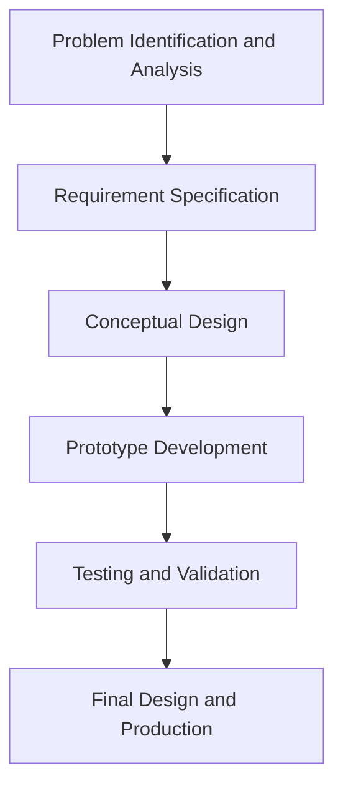
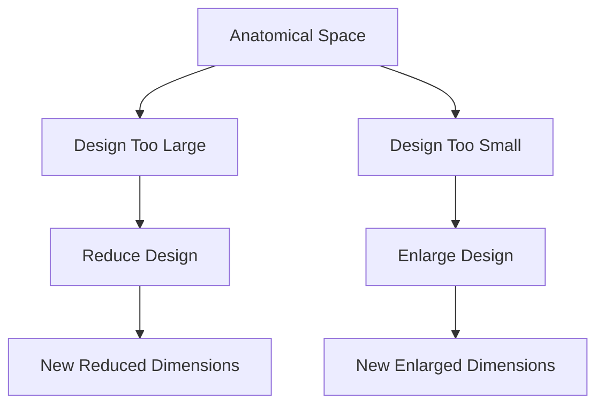

# Unit – null: DESIGN

*(AI-generated self study book for GTU Diploma Biomedical Engineering, subject code 310004 — generated locally with Ollama.)*

This unit carries approximately ****.

Learning objectives covered by this unit:


## 4.1. Structural Design

### Introduction to Structural Design
Structural design in biomedical engineering involves the planning and creation of implants and biomaterials that are strong and durable enough to perform their intended functions. It is crucial to ensure that the design can withstand the stresses and loads that will be applied during use. 

**Definition:** *Structural design* refers to the process of determining the shape, size, and material properties of an implant or biomaterial to ensure its strength and functionality.

### Importance of Structural Design
Proper structural design is essential for the longevity and effectiveness of implants. If the design is not robust enough, the implant may fail, leading to complications and potential harm to the patient. For example, a poorly designed hip implant may not withstand the repetitive loads of walking, leading to early failure and the need for revision surgery.

> **Example:** Consider a hip prosthesis. The structural design must ensure that the implant can handle the daily loads of a person walking and running. If the design is not strong enough, it might crack or break under the stress, leading to painful and potentially dangerous complications.

### Factors to Consider in Structural Design
Several factors need to be considered in the structural design of biomedical implants and biomaterials. These include:

- **Material Properties:** The choice of material depends on the mechanical properties required. For example, metals like titanium are often used for their strength and biocompatibility.
- **Load Analysis:** Understanding the types of loads that will be applied to the implant is crucial. This includes tensile, compressive, and shear forces.
- **Biomechanical Environment:** The design must consider the specific biomechanical environment in which the implant will be placed. For example, an implant in a joint will experience different forces compared to one in the bone.

### Worked Example: Structural Design of a Dental Implant
Let's consider the structural design of a dental implant. The goal is to design a cylindrical implant that can support a dental crown.

#### Step 1: Determine the Load
The load on the implant is due to the forces exerted by the masticatory muscles. The average bite force is approximately 200 N (Newtons).

#### Step 2: Material Selection
Titanium is a common choice for dental implants due to its strength and biocompatibility. The modulus of elasticity for titanium is about 110 GPa.

#### Step 3: Design the Geometry
The implant is designed as a cylindrical shape with a diameter of 3.5 mm and a length of 10 mm. The cross-sectional area (A) of the implant is calculated as:
\[ A = \pi \left(\frac{d}{2}\right)^2 = \pi \left(\frac{3.5}{2}\right)^2 = 9.62 \, \text{mm}^2 \]

#### Step 4: Stress Analysis
The stress (σ) in the implant can be calculated using the formula:
\[ \sigma = \frac{F}{A} \]
where \( F \) is the applied force (200 N) and \( A \) is the cross-sectional area (9.62 mm²).

\[ \sigma = \frac{200 \, \text{N}}{9.62 \, \text{mm}^2} = 20.78 \, \text{MPa} \]

This stress is within the safe limit for titanium, ensuring the implant will not fail under normal usage.

> **Example:** Consider a dental implant with a diameter of 3.5 mm and a length of 10 mm. If the applied force is 200 N, the stress in the implant is calculated as:
> 
> ```mermaid
> flowchart LR
>     A[Stress Calculation] --> B[Stress = 200 N / 9.62 mm²]
>     B --> C[Stress = 20.78 MPa]
> ```

### Summary
Structural design is a critical aspect of biomedical engineering, ensuring that implants and biomaterials can withstand the mechanical stresses they will encounter. By considering factors such as material properties, load analysis, and biomechanical environment, engineers can design robust and effective implants.

---

## 4.2. Applied design

### Importance of Applied Design
Applied design in biomedical engineering involves the practical application of theoretical knowledge to create effective and efficient medical devices and implants. This design process ensures that the final product meets the specific requirements of the medical field and patient needs.

### Steps in Applied Design
1. **Problem Identification and Analysis**
   - **Example:** A patient requires a custom-made hip implant due to a specific type of bone defect. The design team must first identify the exact nature of the defect and the patient's medical history.
   - > **Example:** A patient has a femoral head necrosis. The design team needs to understand the patient's bone structure, the severity of the necrosis, and the required load-bearing capacity of the implant.

2. **Requirement Specification**
   - **Example:** For the custom-made hip implant, the team needs to specify the material, size, and shape that will fit the patient's unique anatomy.
   - > **Example:** The implant should be made of titanium alloy, with a diameter of 40 mm and a length of 70 mm to fit the patient's femur.

3. **Conceptual Design**
   - **Example:** The team sketches several implant designs, considering factors like biocompatibility, strength, and ease of insertion.
   - > **Example:** The team sketches three different implant designs: one with a smooth surface, one with a porous surface, and one with a textured surface. Each design is evaluated based on its potential to promote bone growth and integration.

4. **Prototype Development**
   - **Example:** A 3D model of the selected design is created using CAD software, and a physical prototype is printed using 3D printing technology.
   - > **Example:** Using SolidWorks, the team creates a 3D model of the selected implant design. They then use a 3D printer to create a prototype using titanium alloy.

5. **Testing and Validation**
   - **Example:** The prototype is tested in a lab setting to ensure it meets the required mechanical and biocompatibility standards.
   - > **Example:** The prototype is tested for strength by applying a load of 5000 N. It is also tested for biocompatibility using cell culture assays.

6. **Final Design and Production**
   - **Example:** The final design is refined based on the test results, and the implant is produced in a clinical setting.
   - > **Example:** After testing, the team refines the implant design to improve its biocompatibility. The final design is then produced in a clean room environment.

### Flowchart of Applied Design Process


### Summary of Applied Design
Applied design in biomedical engineering is a systematic process that involves identifying the problem, specifying requirements, creating conceptual designs, developing prototypes, testing and validating the design, and finally producing the final product. Each step in this process is crucial for ensuring the success and effectiveness of the medical device or implant.

> **Example:** For a patient with a specific bone defect, the design team identified the problem, specified the requirements for the implant, created three conceptual designs, developed a prototype, tested its strength and biocompatibility, and produced the final implant in a clinical setting.

---

## 4.3. Reducing and Enlargement of Design

In biomedical engineering, the design of implants and biomaterials often requires adjustments to fit specific anatomical requirements. **Reducing** and **enlargement of design** are crucial techniques to ensure that the materials fit perfectly within the body. These adjustments are necessary to provide a secure and effective fit, ensuring that the implant functions optimally.

### 4.3.1. **Reducing the Design**
Reducing the design involves making the implant smaller to fit into a specific anatomical space. This is typically done to avoid over-insertion, which can lead to complications such as tissue damage or infection.

#### Example:
> **Example:** Suppose an implant needs to fit into a 10 mm space, but the initial design is for a 12 mm implant. To reduce the design, we can modify the dimensions of the implant. If the original implant has a cylindrical shape, we can decrease its diameter and length to fit into the 10 mm space.

- **Original dimensions:** Diameter = 6 mm, Length = 15 mm
- **Modified dimensions:** Diameter = 4 mm, Length = 10 mm

### 4.3.2. **Enlargement of Design**
Enlargement of design is the opposite of reducing. It involves making the implant larger to fit into a larger anatomical space. This is necessary to ensure that the implant has sufficient structural integrity and provides the required support.

#### Example:
> **Example:** Consider a bone plate that needs to be used in a 15 mm wide bone gap. The initial design is for a 12 mm wide plate. To enlarge the design, we can increase the width and length of the plate to fit the 15 mm space. 

- **Original dimensions:** Width = 12 mm, Length = 10 mm
- **Modified dimensions:** Width = 15 mm, Length = 12 mm

### Mermaid Diagram
To illustrate the process of reducing and enlargement of design, we can use a simple flowchart:



### Summary
In summary, reducing and enlargement of design are essential techniques in the design of biomedical implants. By adjusting the dimensions of the implant, engineers can ensure that the implant fits perfectly within the anatomical space, providing the necessary support and functionality. These adjustments are critical for the success of the implant and the well-being of the patient.

> **Example:** 
> - **Reducing Example:** If the initial design of a knee prosthesis is 14 mm, but the required fit is 12 mm, reduce the diameter and length to 12 mm.
> - **Enlarging Example:** If the initial design of a bone plate is 10 mm, but the required fit is 12 mm, increase the width and length to 12 mm.
