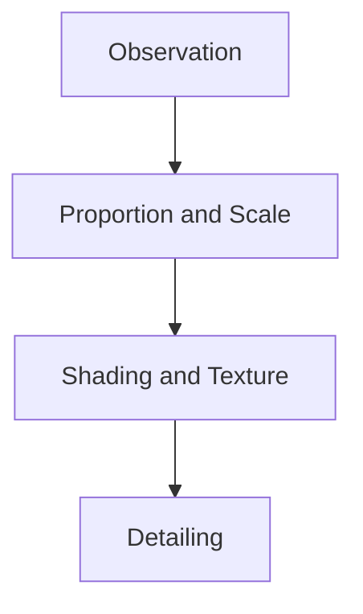
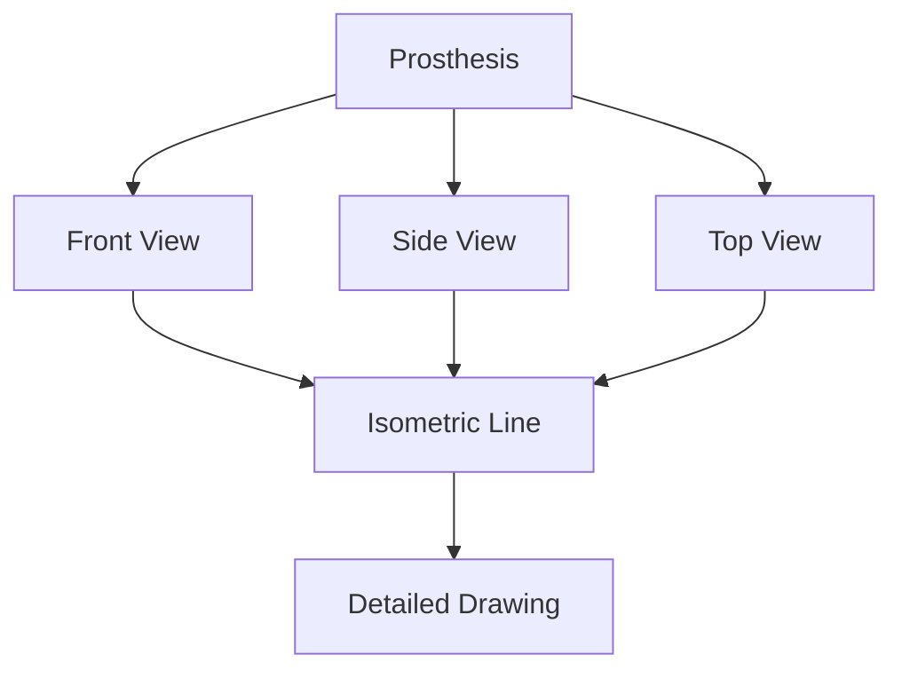
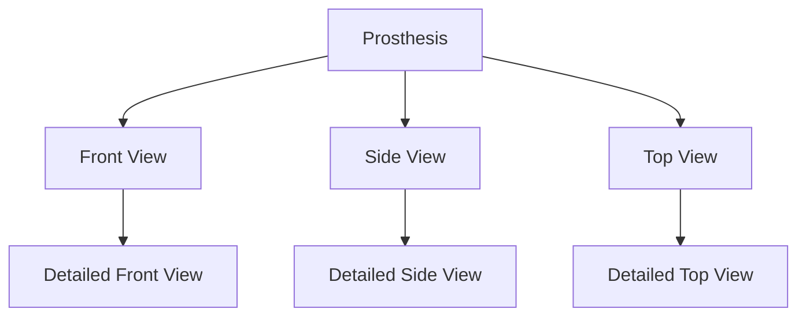
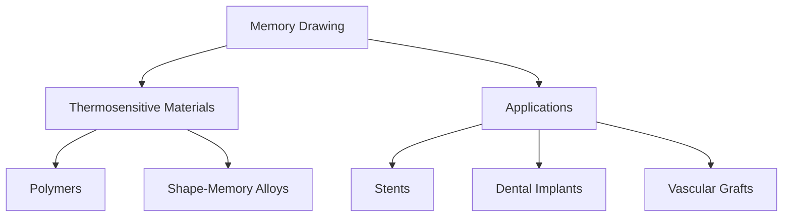

# Unit – null: Prepare given types of drawing by hand and on computer

*(AI-generated self study book for GTU Diploma Biomedical Engineering, subject code 310004 — generated locally with Ollama.)*

This unit carries approximately ****.

Learning objectives covered by this unit:


## 2.1. Nature Drawing

### Definition
**Nature drawing** is the process of creating a detailed and accurate representation of natural objects, such as plants, animals, and other living organisms. This technique is crucial in biomedical engineering for several reasons, including the design and selection of appropriate biomaterials and implants.

### Importance in Biomedical Engineering
Nature drawing is essential in biomedical engineering because it helps engineers to understand the natural forms and structures of biological materials. By studying natural forms, engineers can design implants and biomaterials that mimic the structure and function of the human body, thereby enhancing the effectiveness and biocompatibility of medical devices.

### Key Components of Nature Drawing
- **Observation:** The first step in nature drawing is careful observation of the object. This involves looking closely at the details of the object's shape, texture, and color.
- **Proportion and Scale:** Accurate proportions and scale are crucial to ensure that the drawn object resembles the real one.
- **Shading and Texture:** Shading and texture help to create a realistic appearance. Proper use of shading can give the drawing depth and volume, while textures can add detail and realism.
- **Detailing:** Detailed drawings capture the fine details of the object, which is important for precise design.

### Example
> **Example:** 
Consider the task of designing an implant for a knee replacement. To begin, an engineer would draw a detailed nature sketch of a human knee joint. The drawing would include the following steps:

1. **Observation:** The engineer observes the knee joint, noting the bones, cartilage, and ligaments.
2. **Proportion and Scale:** The engineer sketches the main bones of the knee, ensuring the proportions are accurate.
3. **Shading and Texture:** The engineer uses shading to give the bones a three-dimensional appearance. The ligaments are drawn with a finer, more detailed texture.
4. **Detailing:** The engineer adds small details like the menisci and articular cartilage.



This drawing serves as a reference for the design of the implant, ensuring that the implant mimics the natural structure of the knee joint as closely as possible.

### Summary
Nature drawing is a critical skill in biomedical engineering, allowing engineers to accurately represent and understand the natural forms of biological materials. By practicing detailed observation and accurate representation, engineers can design better and more biocompatible implants and biomaterials.

---

## 2.2. Object Drawing

Object drawing is a fundamental skill in biomedical engineering that involves creating detailed and accurate drawings of biomedical objects. These drawings are essential for understanding the structure and function of medical devices, implants, and biomaterials. Object drawings help in visualizing the design and ensuring that the final product meets the necessary requirements.

### Importance of Object Drawing
- **Accuracy**: Object drawings must be precise to ensure that the manufactured parts are correct.
- **Communication**: Drawings are used to communicate the design details to engineers, manufacturers, and healthcare professionals.
- **Regulatory Compliance**: Detailed drawings are required for regulatory approvals and documentation.

### Steps in Object Drawing
1. **Observation**: Carefully observe the object to be drawn.
2. **Sketching**: Make a rough sketch to outline the basic shape and dimensions.
3. **Detailing**: Add the necessary details such as measurements, labels, and annotations.
4. **Finalizing**: Refine the drawing to ensure it is clear and accurate.

### Types of Object Drawing
- **Isometric Drawing**: A type of pictorial drawing that shows three-dimensional objects on a two-dimensional plane.
- **Orthographic Drawing**: A set of views (front, top, side) that provide a complete description of the object.

### Example Requirement
> **Example:** Draw an isometric view of a hip prosthesis.

### Steps to Draw an Isometric View of a Hip Prosthesis
1. **Observation**: Observe the hip prosthesis from an angle that shows all three dimensions.
2. **Sketching**: Draw a rough sketch of the prosthesis, keeping the angle consistent for all views.
3. **Detailing**: Add the necessary dimensions and labels. For example, mark the length of the stem, diameter of the head, and the height of the collar.
4. **Finalizing**: Refine the drawing to ensure it is clear and accurate.

### Mermaid Diagram for Isometric View


### Mermaid Diagram for Orthographic Views


### Practical Example
> **Example:** Draw an orthographic view of a bone plate used in spinal surgery.

1. **Observation**: Observe the bone plate from the front, side, and top.
2. **Sketching**: Make a rough sketch of the bone plate.
3. **Detailing**: Add the dimensions such as the length, width, and thickness.
4. **Finalizing**: Refine the drawing to ensure it is clear and accurate.

### Conclusion
Object drawing is a crucial skill in biomedical engineering that helps in the accurate representation of medical devices and implants. By following the steps and using the appropriate types of drawings, engineers can effectively communicate design details and ensure that the final product meets the necessary requirements.

---

This section covers the essential aspects of object drawing, including its importance, steps involved, and practical examples. It is exam-oriented and includes the required worked examples.

---

## 2.3. Free Hand Drawing

Free hand drawing is an essential skill in biomedical engineering, helping in the design and visualization of medical devices, implants, and surgical procedures. It involves sketching by hand without the use of any mechanical aids, which can be done quickly and allows for detailed and specific customization.

### Importance of Free Hand Drawing
- **Rapid Prototyping:** Quick sketching of ideas and designs.
- **Customization:** Tailoring designs to specific patient needs.
- **Communication:** Effective communication with team members during the design phase.

### Steps in Free Hand Drawing

1. **Understanding the Requirement:**
   - **Define the Purpose:** Determine the purpose of the drawing (e.g., surgical procedure, implant design).
   - **Gather Information:** Collect relevant data and reference materials.

2. **Sketching the Basic Outline:**
   - **Start with a Light Guide Line:** Draw a rough outline of the object or area.
   - **Refine the Outline:** Add more details and refine the lines.

3. **Adding Details:**
   - **Anatomical Details:** Include relevant anatomical structures.
   - **Technical Details:** Add measurements, dimensions, and technical specifications.
   - **Shading and Texturing:** Use shading and texturing to enhance the visual clarity.

4. **Review and Revise:**
   - **Check for Accuracy:** Ensure all dimensions and details are accurate.
   - **Make Adjustments:** Make necessary adjustments to improve clarity and detail.

### Example

> **Example:** 
> 
> **Step 1: Understanding the Requirement**
> 
> You are required to draw a free hand sketch of a knee prosthesis.
>
> **Step 2: Sketching the Basic Outline**
> 
> Start with a light guide line of the knee joint. Draw the femur and tibia bones, and the patella. Use a light pencil to make the initial sketch.
>
> ```mermaid
> flowchart TD
>     A[Initial Sketch] --> B[Refine Outline] --> C[Add Details] --> D[Review and Revise]
> ```
>
> **Step 3: Adding Details**
> 
> Add the prosthesis components, such as the femoral stem, tibial base, and polyethylene insert. Label the key parts and add measurements.
>
> **Step 4: Review and Revise**
> 
> Check the drawing for any errors or missing details. Make sure all dimensions and labels are correct. Revise as necessary to improve the clarity and detail.

In this example, the initial sketch, refinement, adding details, and reviewing the drawing are clearly outlined, ensuring a comprehensive and accurate free hand drawing.

---

## 2.4. Memory Drawing

### Definition and Importance
**Memory drawing** is a type of implant material that can undergo reversible changes in shape in response to an external stimulus. This property is crucial in medical applications where the implant needs to be deployed in a compressed state and then expand to its original shape once inside the body. Memory drawing materials are particularly useful in biomedical devices like stents, vascular grafts, and dental implants.

### Types of Memory Drawing Materials
Memory drawing materials can be classified into two main categories: thermosensitive and shape-memory alloys (SMAs).

- **Thermosensitive Materials**: These materials change shape when exposed to temperature changes. For example, polymers like poly(N-isopropylacrylamide) (PNIPAAm) can shrink or expand based on temperature variations.
- **Shape-Memory Alloys (SMAs)**: These materials have a unique property where they can be deformed at a high temperature and then return to their original shape when cooled. Common examples include nickel-titanium (NiTi) alloys.

### Example: Thermosensitive Polymer
> **Example:** Consider a thermosensitive polymer, PNIPAAm, used in biomedical applications. At body temperature (around 37°C), PNIPAAm has a lower critical solution temperature (LCST) of 32°C. Below this temperature, the polymer chains collapse, causing the material to shrink. This property is useful in designing stents that can be compressed for easier delivery and expand once deployed inside the body.

### Applications of Memory Drawing Materials
Memory drawing materials are used in various biomedical applications due to their unique properties:

- **Stents**: Stents made from shape-memory alloys like NiTi can be compressed for insertion and expand to their original shape once inside the blood vessel, ensuring proper support.
- **Dental Implants**: Memory drawing materials can be used to create dental implants that can be inserted in a small space and then expand to fit the required size.
- **Vascular Grafts**: These can be deployed in narrow vessels and then expand to the required diameter to ensure proper blood flow.

### Mermaid Diagram for Memory Drawing


### Example: Shape-Memory Alloy Stent
> **Example:** A stent made from NiTi alloy is designed to be compressed into a small diameter for insertion. The stent is inserted into a blood vessel and then subjected to a lower temperature to expand. Once expanded, it can provide support to the vessel wall and ensure proper blood flow. This property is crucial for the effective deployment of the stent in various vascular applications.

### Conclusion
Memory drawing materials play a significant role in biomedical engineering by providing reversible shape changes in response to external stimuli. Understanding and selecting the appropriate memory drawing materials is essential for designing effective biomedical devices.
