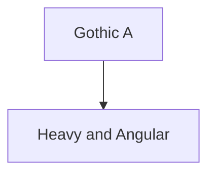
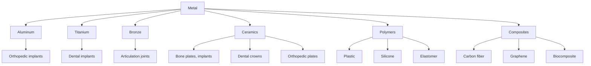

# Unit – null: Calligraphy writing by hand (All alphabet)

*(AI-generated self study book for GTU Diploma Biomedical Engineering, subject code 310004 — generated locally with Ollama.)*

This unit carries approximately ****.

Learning objectives covered by this unit:

## 3.1. Gothic Letters

### Introduction to Gothic Letters
Gothic letters, also known as "gothic typefaces," are a style of typefaces that were popular in the late medieval period and continued to be used into the 19th century. They are characterized by their heavy and bold design, with vertical and horizontal lines being more prominent than the angles and curves. Gothic letters are often used in historical texts and documents to give a distinct look.

### Definition and Characteristics
**Gothic letter:** A typeface style with heavy and bold lines, used primarily in historical texts.

**Example:**
Gothic letters can be recognized by their thick, angular strokes. For instance, the letter "A" in Gothic type has a distinctly angular shape, as shown below.

### Usage in Bio-Materials and Implants
In the context of bio-materials and implants, Gothic letters are not directly used. However, understanding Gothic letters can be useful in the historical context of medical devices. For example, early medical texts and documents that described the use of implants might have used Gothic typefaces.

### Example Requirement
> **Example:** 
Consider a historical document from the 16th century that describes the use of a metal plate as an implant. The text in this document is written in Gothic letters. The document states, "The metal plate, A[Plate], was inserted into the patient's B[bone] to stabilize the C[fracture]."

### Classification of Gothic Letters
Gothic letters can be classified based on their design and usage. The most common types of Gothic letters include:

- **Textura:** A highly decorative form of Gothic lettering, often used in early printed books.
- **Fraktur:** A more simplified version of Textura, commonly used in later manuscripts.
- **Schwabacher:** A transitional form between Textura and Fraktur, with more rounded corners.

### Example Requirement
> **Example:** 
Classify the following Gothic letters based on their characteristics:
- Textura: A[Thick and angular lines], B[Decorative]
- Fraktur: A[Thicker and more angular than Textura], B[Less decorative]
- Schwabacher: A[Less angular than Fraktur], B[More rounded corners]

### Summary
Gothic letters are a style of typeface that were popular in the late medieval period and continue to be used in historical contexts. Understanding Gothic letters is essential for recognizing and interpreting historical medical texts and documents. While Gothic letters are not directly used in modern bio-materials and implants, their historical significance in the context of medical devices makes them an important topic for biomedical engineers.

> **Example:** 
Consider a historical document from the 16th century that describes the use of a metal plate as an implant. The text in this document is written in Gothic letters. The document states, "The metal plate, A[Plate], was inserted into the patient's B[bone] to stabilize the C[fracture]."

---

## 3.2. Roman Letters

Roman letters are the characters used in the Latin alphabet. In the context of biomedical engineering, Roman letters are often used to denote various components or parameters in equations and medical terminology. Here, we will define Roman letters and explain their usage in biomedical engineering.

### Definition of Roman Letters
**Roman letters** are uppercase letters from the Latin alphabet, such as A, B, C, D, E, F, G, H, I, J, K, L, M, N, O, P, Q, R, S, T, U, V, W, X, Y, Z. These letters are commonly used in equations, medical codes, and labeling systems in biomedical engineering.

### Usage in Biomedical Engineering
Roman letters are used to represent various parameters, materials, and components in biomedical engineering. For example, in the context of implants and biomaterials, Roman letters are used to denote specific properties or components.

#### Example: Usage in Biomaterials
Consider a scenario where a biomedical engineer is working with different types of biomaterials. The engineer might use Roman letters to denote the material type and its properties.

> **Example:** 
>
> - A: Represents aluminum, a commonly used metal in orthopedic implants.
> - B: Represents bioactive glass, used for its osteoconductive properties.
> - C: Represents carbon fiber, used for its strength and stiffness.
> - D: Represents DuraMed, a specific type of polymer used in tissue engineering.

### Classification of Biomaterials Using Roman Letters
Biomaterials can be classified into different categories based on their properties and applications. Roman letters can be used to classify these materials into groups.

#### Example: Classification of Biomaterials
Consider the classification of biomaterials into four main categories: Metals, Ceramics, Polymers, and Composites.

### Selection of Appropriate Biomaterials Using Roman Letters
The selection of appropriate biomaterials involves considering factors like biocompatibility, strength, and durability. Roman letters can be used to denote these factors in decision-making processes.

#### Example: Selection of Biomaterials
Suppose a biomedical engineer needs to select a biomaterial for a specific application. The engineer might use Roman letters to denote the key factors.

> **Example:** 
>
> - A: Biocompatibility (Aluminum, Titanium)
> - B: Strength (Titanium, Bronze)
> - C: Durability (Aluminum, Ceramic)
> - D: Cost-effectiveness (Aluminum, Plastic)

### Conclusion
Roman letters are essential in biomedical engineering for denoting various components, materials, and parameters. By understanding their usage and classification, biomedical engineers can make informed decisions when selecting appropriate biomaterials and implants.

By practicing with examples, students can enhance their ability to use Roman letters effectively in biomedical engineering applications.
