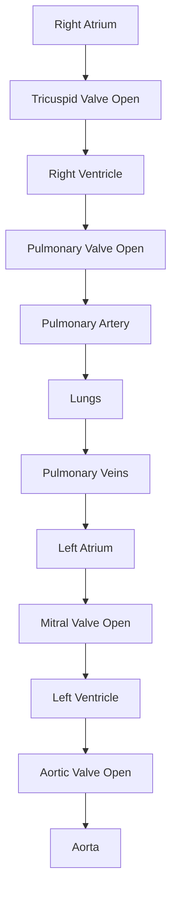
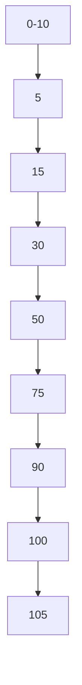
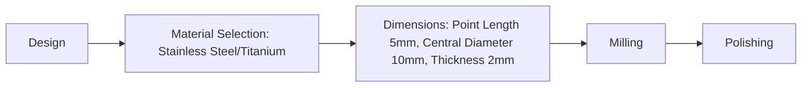
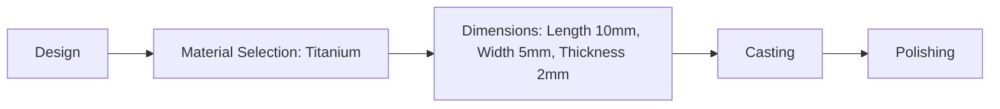
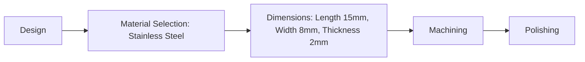
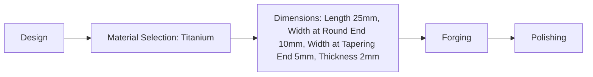

# Unit – null: Shape

*(AI-generated self study book for GTU Diploma Biomedical Engineering, subject code 310004 — generated locally with Ollama.)*

This unit carries approximately ****.

Learning objectives covered by this unit:


## 5.1. Prepare the sheet showing following equal sided flat shapes by hand as well as

This section covers the basic skills required to prepare equal-sided flat shapes such as squares, circles, equilateral triangles, and pentagons by hand. These shapes are fundamental in various engineering and design applications, including biomedical engineering, where accurate and precise drawings are essential.

### 5.1.1. Square

#### Description
A square is a four-sided polygon with all sides of equal length and all angles equal to 90 degrees. It is one of the simplest and most common shapes in geometry.

#### Steps to Draw a Square
1. **Draw the First Side:**
   - Draw a straight line segment of the desired length. Let's assume the length is 5 cm.
   
2. **Draw the Second Side:**
   - At one end of the first line, draw a perpendicular line of the same length (5 cm) to form a right angle.

3. **Draw the Third Side:**
   - Connect the end of the second line to the opposite end of the first line to form another right angle.

4. **Draw the Fourth Side:**
   - Complete the square by connecting the remaining ends of the lines to form the fourth right angle.

> **Example:** 
>
> ```mermaid
> flowchart TD
>     A[Square] --> B[Side 1: 5 cm] --> C[Perpendicular Side 2: 5 cm] --> D[Right Angle] --> E[Side 3: 5 cm] --> F[Right Angle] --> G[Side 4: 5 cm] --> H[Complete Square]
> ```

### 5.1.2. Circle

#### Description
A circle is a round shape with all points on its edge at an equal distance from the center. This distance is known as the radius.

#### Steps to Draw a Circle
1. **Mark the Center:**
   - Place a dot at the center of the drawing area.

2. **Set the Compass:**
   - Adjust a compass to the desired radius, say 5 cm.

3. **Draw the Circle:**
   - Place the compass point at the center and draw the circle by moving the pencil around the compass.

> **Example:** 
>
> ```mermaid
> flowchart TD
>     A[Circle] --> B[Mark Center] --> C[Set Compass to 5 cm] --> D[Draw Circle]
> ```

### 5.1.3. Equilateral Triangle

#### Description
An equilateral triangle is a three-sided polygon with all sides of equal length and all angles equal to 60 degrees.

#### Steps to Draw an Equilateral Triangle
1. **Draw the First Side:**
   - Draw a straight line segment of the desired length, say 5 cm.

2. **Draw the Second Side:**
   - Using a compass, set the radius to the length of the first side (5 cm) and place the compass point at one end of the first side. Draw an arc intersecting the first side.

3. **Draw the Third Side:**
   - Repeat the previous step from the other end of the first side. The two arcs should intersect at a point.

4. **Connect the Points:**
   - Draw lines from the intersection point to the ends of the first side to complete the triangle.

> **Example:** 
>
> ```mermaid
> flowchart TD
>     A[Equilateral Triangle] --> B[First Side: 5 cm] --> C[Set Compass to 5 cm] --> D[Draw Arc from End 1] --> E[Draw Arc from End 2] --> F[Intersection Point] --> G[Connect to Complete Triangle]
> ```

### 5.1.4. Pentagon

#### Description
A pentagon is a five-sided polygon with all sides of equal length and all angles approximately 108 degrees.

#### Steps to Draw a Pentagon
1. **Draw the First Side:**
   - Draw a straight line segment of the desired length, say 5 cm.

2. **Set the Compass:**
   - Adjust a compass to the length of the first side (5 cm).

3. **Draw the Second Side:**
   - Place the compass point at one end of the first side and draw an arc.

4. **Draw the Third Side:**
   - Repeat the previous step from the other end of the first side. The arcs should intersect at a point.

5. **Continue Drawing the Remaining Sides:**
   - Repeat the process to draw the remaining sides, ensuring each side is of the same length and the angles are approximately 108 degrees.

> **Example:** 
>
> ```mermaid
> flowchart TD
>     A[Pentagon] --> B[First Side: 5 cm] --> C[Set Compass to 5 cm] --> D[Draw Arc from End 1] --> E[Draw Arc from End 2] --> F[Intersection Point] --> G[Draw Third Side] --> H[Continue Drawing Remaining Sides]
> ```

By following these steps, you can accurately draw the required shapes by hand. Practice these techniques to ensure precision and accuracy in your drawings, which is crucial in various engineering applications.

---

## 5.1.5. Hexagon

**Hexagon:** A **hexagon** is a six-sided polygon. In the context of biomedical engineering, hexagonal shapes are often used in implants and biomaterials due to their unique properties, such as increased surface area and mechanical stability. 

### Properties of Hexagon
- **Number of Sides:** 6
- **Sum of Interior Angles:** 720 degrees
- **Regular Hexagon:** All sides and angles are equal.
- **Irregular Hexagon:** Sides and angles can vary.

### Classification of Hexagon
- **Regular Hexagon:** All sides are equal, and all internal angles are 120 degrees.
- **Irregular Hexagon:** Sides and angles are not necessarily equal.

### Example: Properties of a Regular Hexagon
> **Example:** Calculate the area and perimeter of a regular hexagon with a side length of 5 cm.
>
> **Solution:**
> - **Perimeter:** Perimeter = 6 × side length = 6 × 5 cm = 30 cm
> - **Area:** Area = \(\frac{3\sqrt{3}}{2} \times (\text{side length})^2 = \frac{3\sqrt{3}}{2} \times (5)^2 = \frac{3\sqrt{3}}{2} \times 25 = 36.74 \, \text{cm}^2\)

### Mermaid Diagram for Hexagon
```mermaid
flowchart TD
    A[Regular Hexagon] --> B[All sides equal]
    A --> C[All angles equal (120 degrees)]
    B --> D[Perimeter = 6 × side length]
    C --> E[Area = (3√3/2) × (side length)^2]
```

## 5.1.6. Octagon

**Octagon:** An **octagon** is an eight-sided polygon. In biomedical engineering, octagonal shapes are less common but can be used in certain implant designs for their unique mechanical properties.

### Properties of Octagon
- **Number of Sides:** 8
- **Sum of Interior Angles:** 1080 degrees
- **Regular Octagon:** All sides and angles are equal.
- **Irregular Octagon:** Sides and angles can vary.

### Classification of Octagon
- **Regular Octagon:** All sides are equal, and all internal angles are 135 degrees.
- **Irregular Octagon:** Sides and angles are not necessarily equal.

### Example: Properties of a Regular Octagon
> **Example:** Calculate the area and perimeter of a regular octagon with a side length of 4 cm.
>
> **Solution:**
> - **Perimeter:** Perimeter = 8 × side length = 8 × 4 cm = 32 cm
> - **Area:** Area = 2 × (1 + √2) × (\text{side length})^2 = 2 × (1 + 1.414) × (4)^2 = 2 × 2.414 × 16 = 77.248 \, \text{cm}^2

### Mermaid Diagram for Octagon
```mermaid
flowchart TD
    A[Regular Octagon] --> B[All sides equal]
    A --> C[All angles equal (135 degrees)]
    B --> D[Perimeter = 8 × side length]
    C --> E[Area = 2 × (1 + √2) × (side length)^2]
```

## 5.2. Prepare the sheet showing following Unequal sided flat shapes manually as well

### Rectangle

**Rectangle:** A **rectangle** is a four-sided flat shape with four right angles (90 degrees). In biomedical applications, rectangles are commonly used for their simplicity and stability.

### Properties of Rectangle
- **Number of Sides:** 4
- **Sum of Interior Angles:** 360 degrees
- **Right Angles:** All angles are 90 degrees.
- **Opposite Sides:** Equal and parallel.

### Example: Calculating Area and Perimeter of a Rectangle
> **Example:** Calculate the area and perimeter of a rectangle with length 10 cm and width 5 cm.
>
> **Solution:**
> - **Perimeter:** Perimeter = 2 × (length + width) = 2 × (10 + 5) cm = 30 cm
> - **Area:** Area = length × width = 10 cm × 5 cm = 50 \, \text{cm}^2

### Mermaid Diagram for Rectangle
```mermaid
flowchart TD
    A[Rectangle] --> B[Right Angles (90 degrees)]
    A --> C[Opposite sides equal and parallel]
    B --> D[Perimeter = 2 × (length + width)]
    C --> E[Area = length × width]
```

## 5.2.2. Parallelogram

**Parallelogram:** A **parallelogram** is a four-sided flat shape with opposite sides parallel. In biomedical applications, parallelograms can be used for their flexibility and mechanical properties.

### Properties of Parallelogram
- **Number of Sides:** 4
- **Sum of Interior Angles:** 360 degrees
- **Opposite Sides:** Equal and parallel.
- **Opposite Angles:** Equal.

### Example: Calculating Area and Perimeter of a Parallelogram
> **Example:** Calculate the area and perimeter of a parallelogram with base 8 cm, height 6 cm, and side length 5 cm.
>
> **Solution:**
> - **Perimeter:** Perimeter = 2 × (base + side length) = 2 × (8 + 5) cm = 26 cm
> - **Area:** Area = base × height = 8 cm × 6 cm = 48 \, \text{cm}^2

### Mermaid Diagram for Parallelogram
```mermaid
flowchart TD
    A[Parallelogram] --> B[Opposite sides equal and parallel]
    A --> C[Opposite angles equal]
    B --> D[Perimeter = 2 × (base + side length)]
    C --> E[Area = base × height]
```

## Summary
In this section, we have covered the properties and calculations for hexagons, octagons, rectangles, and parallelograms. Each shape has unique properties that make them suitable for specific biomedical applications. Understanding these shapes and their calculations is essential for selecting appropriate biomaterials and implants.

---

## 5.2.3. Heart

The **heart** is a vital organ that functions to pump blood throughout the body. It is a hollow, muscular organ located in the chest cavity. The heart has four chambers: two **atria** (singular: **atrium**) and two **ventricles**. The **atria** receive blood from the body and lungs, while the **ventricles** pump blood out to the body and lungs.

### 5.2.3.1. Structure and Function

- **Atria**: These are the upper chambers of the heart. The **right atrium** receives deoxygenated blood from the body, while the **left atrium** receives oxygenated blood from the lungs.
- **Ventricles**: These are the lower chambers of the heart. The **right ventricle** pumps deoxygenated blood to the lungs, while the **left ventricle** pumps oxygenated blood to the body.
- **Valves**: The heart has four valves that ensure blood flows in the correct direction:
  - **Tricuspid valve**: Between the right atrium and right ventricle.
  - **Pulmonary valve**: Between the right ventricle and pulmonary artery.
  - **Mitral valve**: Between the left atrium and left ventricle.
  - **Aortic valve**: Between the left ventricle and aorta.

### 5.2.3.2. Blood Flow

The **blood flow** through the heart can be described using the following sequence:
1. **Right atrium** receives deoxygenated blood from the body.
2. The **tricuspid valve** opens, allowing blood to flow into the **right ventricle**.
3. The **pulmonary valve** closes, and the **pulmonary valve** opens, allowing blood to flow into the **pulmonary artery**.
4. The **pulmonary artery** carries blood to the lungs for oxygenation.
5. Oxygenated blood returns to the **left atrium** via the **pulmonary veins**.
6. The **mitral valve** opens, allowing blood to flow into the **left ventricle**.
7. The **aortic valve** opens, allowing oxygenated blood to flow into the **aorta**.
8. The **aorta** distributes blood to the rest of the body.



### 5.2.3.3. Worked Example

> **Example:** A patient is diagnosed with a **tricuspid valve** regurgitation. Explain what this condition means and how it affects the heart's function.

- **Answer**: Tricuspid valve regurgitation means that the **tricuspid valve** does not close properly, leading to backward flow of blood from the **right ventricle** back into the **right atrium**. This condition can cause the **right atrium** to become enlarged and can lead to **heart failure**. The **right ventricle** will have to work harder to pump blood into the **right atrium**, which can cause it to dilate and eventually fail.

## 5.2.4. Diamond

The **diamond** is a precious gemstone composed primarily of **carbon**. It is renowned for its brilliance and hardness. Diamonds are formed under high pressure and temperature conditions deep within the Earth's crust.

### 5.2.4.1. Structure and Properties

- **Crystal Structure**: Diamonds have a **face-centered cubic (FCC)** crystal structure.
- **Hardness**: Diamonds are the hardest naturally occurring material known, with a **Mohs hardness scale** of 10.
- **Color**: Most diamonds are colorless, but they can also occur in various colors such as yellow, brown, blue, and pink.
- **Cut**: The **cut** of a diamond determines its brilliance and sparkle. The most common cuts are **round brilliant cut**, **princess cut**, and **emerald cut**.

### 5.2.4.2. Worked Example

> **Example:** A diamond has a **princess cut** with a total weight of 1.5 carats. If the price of the diamond is $50,000 per carat, calculate the total cost of the diamond.

- **Answer**: The total cost of the diamond can be calculated as follows:
  \[
  \text{Total Cost} = \text{Weight of the Diamond} \times \text{Price per Carat} = 1.5 \, \text{carats} \times 50,000 \, \text{\$/carat} = 75,000 \, \text{\$}
  \]

## 5.2.5. Teardrop

The **teardrop** is a shape that is often used in various design applications. It is characterized by its smooth, curved edges that taper to a point, resembling a teardrop.

### 5.2.5.1. Shape and Application

- **Shape**: The teardrop shape is defined by its smooth, curved lines that gradually taper to a point. It is a combination of a **circle** and a **triangle**.
- **Applications**: The teardrop shape is commonly used in jewelry, fashion, and architecture. Its soft, flowing lines make it suitable for creating elegant and fluid designs.

### 5.2.5.2. Worked Example

> **Example:** A teardrop-shaped pendant has a length of 2 cm and a width of 1 cm at the widest point. If the pendant is made of a material with a density of 7.8 g/cm³, calculate the volume of the pendant.

- **Answer**: To calculate the volume of the teardrop-shaped pendant, we can approximate it as a **triangular prism**. The volume \( V \) of a triangular prism is given by:
  \[
  V = \text{Base Area} \times \text{Height}
  \]
  The base area of the triangle can be approximated using the formula for the area of a triangle:
  \[
  \text{Base Area} = \frac{1}{2} \times \text{base} \times \text{height}
  \]
  Assuming the width (1 cm) is the base and the length (2 cm) is the height:
  \[
  \text{Base Area} = \frac{1}{2} \times 1 \, \text{cm} \times 2 \, \text{cm} = 1 \, \text{cm}^2
  \]
  Therefore, the volume of the pendant is:
  \[
  V = 1 \, \text{cm}^2 \times 2 \, \text{cm} = 2 \, \text{cm}^3
  \]

## 5.2.6. Marquis

The **marquis** is a type of gemstone cut that is characterized by its elongated shape and pointed ends. It is similar to the **emerald cut** but with a more pointed shape.

### 5.2.6.1. Shape and Cut

- **Shape**: The marquis cut is an elongated **oval** shape with pointed ends. It is similar to the **emerald cut** but with more pointed corners.
- **Cut**: The marquis cut is a modification of the **princess cut**. It has a stepped facets that provide a unique, elegant appearance.

### 5.2.6.2. Worked Example

> **Example:** A marquis-shaped diamond has a length of 8 mm and a width of 5 mm at the widest point. If the diamond is 2 mm thick, calculate the volume of the diamond.

- **Answer**: The volume \( V \) of a marquis-shaped diamond can be approximated as a **rectangular prism**. The volume is given by:
  \[
  V = \text{Length} \times \text{Width} \times \text{Height}
  \]
  Substituting the given dimensions:
  \[
  V = 8 \, \text{mm} \times 5 \, \text{mm} \times 2 \, \text{mm} = 80 \, \text{mm}^3
  \]

## 5.2.7. Ogive

The **ogive** is a curve that is often used in statistics to represent the cumulative frequency distribution. It is a graphical representation of the cumulative frequency distribution of a dataset.

### 5.2.7.1. Definition and Use

- **Definition**: An **ogive** is a cumulative frequency curve that shows the number of data points that are less than or equal to a certain value.
- **Use**: Ogives are used to analyze the distribution of data and to find the median and quartiles of a dataset.

### 5.2.7.2. Worked Example

> **Example:** A dataset of 100 students' test scores is given as follows:

| Score Range | Number of Students |
|-------------|--------------------|
| 0-10        | 5                  |
| 11-20       | 10                 |
| 21-30       | 15                 |
| 31-40       | 20                 |
| 41-50       | 25                 |
| 51-60       | 15                 |
| 61-70       | 10                 |
| 71-80       | 5                  |

Construct an **ogive** for the given data.

- **Answer**: To construct an **ogive**, first, calculate the cumulative frequency for each score range:

| Score Range | Number of Students | Cumulative Frequency |
|-------------|--------------------|----------------------|
| 0-10        | 5                  | 5                    |
| 11-20       | 10                 | 15                   |
| 21-30       | 15                 | 30                   |
| 31-40       | 20                 | 50                   |
| 41-50       | 25                 | 75                   |
| 51-60       | 15                 | 90                   |
| 61-70       | 10                 | 100                  |
| 71-80       | 5                  | 105                  |

Next, plot the cumulative frequency on the y-axis and the upper boundary of the score range on the x-axis. Connect the points to form the ogive curve.



By plotting these points, you can construct the ogive curve, which will help in finding the median and quartiles of the dataset.

---

## 5.2.8. Star

**Star**: A star is a type of decorative pattern often used in engineering and design. It is characterized by a five-pointed or six-pointed shape, with each point extending outward from a central point. The star is commonly used in the design of implants and biomaterials due to its unique and aesthetically pleasing shape.

### Properties of Star
- **Material**: Stainless steel, titanium, and other alloys are commonly used to create star-shaped implants.
- **Applications**: Stars are often used in orthopedic implants, such as hip and knee replacements, as well as in dental implants.

### Example: Designing a Star-Shaped Implant

> **Example:** A biomedical engineer is designing a star-shaped hip implant for a patient with osteoarthritis. The engineer needs to determine the material and dimensions of the implant.

1. **Material Selection**:
   - **Stainless Steel**: A common choice due to its biocompatibility and strength.
   - **Titanium**: Another option for its lightweight and high strength.

2. **Dimensions**:
   - **Point Length**: Each point should be 5 mm long.
   - **Central Diameter**: The central part of the star should be 10 mm in diameter.
   - **Thickness**: The thickness of the implant should be 2 mm.

3. **Process**:
   - **Milling**: The implant is machined using a CNC machine.
   - **Polishing**: The surface is polished to ensure a smooth finish.

### Mermaid Diagram for Star-Shaped Implant Design


## 5.2.9. Paisley

**Paisley**: A paisley pattern is an ornate design often used in textiles and is sometimes integrated into biomedical engineering designs. It consists of a teardrop-shaped motif with curved lines and points, creating a flowing, natural look.

### Properties of Paisley
- **Material**: Often made from titanium, stainless steel, or cobalt-chromium alloys.
- **Applications**: Used in orthopedic implants and dental implants to provide a natural appearance.

### Example: Designing a Paisley-Shaped Dental Implant

> **Example:** A biomedical engineer is designing a paisley-shaped dental implant for a patient needing a new tooth. The engineer needs to determine the material and dimensions of the implant.

1. **Material Selection**:
   - **Titanium**: Known for its biocompatibility and strength.

2. **Dimensions**:
   - **Length**: 10 mm.
   - **Width**: 5 mm.
   - **Thickness**: 2 mm.

3. **Process**:
   - **Casting**: The implant is cast using a metal alloy.
   - **Polishing**: The surface is polished to ensure a smooth finish.

### Mermaid Diagram for Paisley-Shaped Implant Design


## 5.2.10. Club

**Club**: A club is a blunt, round-ended design, often used in the context of sports or as a motif in design. In biomedical engineering, it can be used in the design of certain types of implants.

### Properties of Club
- **Material**: Typically made from titanium or stainless steel.
- **Applications**: Used in orthopedic implants, particularly in designs that require a blunt, rounded end.

### Example: Designing a Club-Shaped Hip Implant

> **Example:** A biomedical engineer is designing a club-shaped hip implant for a patient with a specific bone structure. The engineer needs to determine the material and dimensions of the implant.

1. **Material Selection**:
   - **Titanium**: Known for its biocompatibility and strength.

2. **Dimensions**:
   - **Length**: 20 mm.
   - **Width**: 10 mm.
   - **Thickness**: 2 mm.

3. **Process**:
   - **Forging**: The implant is forged to achieve the desired shape.
   - **Polishing**: The surface is polished to ensure a smooth finish.

### Mermaid Diagram for Club-Shaped Implant Design


## 5.2.11. Spade

**Spade**: A spade is a flat, round-ended design, often used in the context of tools or as a motif in design. In biomedical engineering, it can be used in the design of certain types of implants.

### Properties of Spade
- **Material**: Typically made from titanium or stainless steel.
- **Applications**: Used in orthopedic implants, particularly in designs that require a flat, rounded end.

### Example: Designing a Spade-Shaped Knee Implant

> **Example:** A biomedical engineer is designing a spade-shaped knee implant for a patient with a specific bone structure. The engineer needs to determine the material and dimensions of the implant.

1. **Material Selection**:
   - **Stainless Steel**: Known for its biocompatibility and strength.

2. **Dimensions**:
   - **Length**: 15 mm.
   - **Width**: 8 mm.
   - **Thickness**: 2 mm.

3. **Process**:
   - **Machining**: The implant is machined to achieve the desired shape.
   - **Polishing**: The surface is polished to ensure a smooth finish.

### Mermaid Diagram for Spade-Shaped Implant Design


## 5.2.12. Pear

**Pear**: A pear is a design that resembles the shape of a pear fruit, with a round end and a tapering end. It is often used in the design of certain types of implants.

### Properties of Pear
- **Material**: Typically made from titanium or stainless steel.
- **Applications**: Used in orthopedic implants, particularly in designs that require a pear-shaped structure.

### Example: Designing a Pear-Shaped Ankle Implant

> **Example:** A biomedical engineer is designing a pear-shaped ankle implant for a patient with a specific bone structure. The engineer needs to determine the material and dimensions of the implant.

1. **Material Selection**:
   - **Titanium**: Known for its biocompatibility and strength.

2. **Dimensions**:
   - **Length**: 25 mm.
   - **Width at Round End**: 10 mm.
   - **Width at Tapering End**: 5 mm.
   - **Thickness**: 2 mm.

3. **Process**:
   - **Forging**: The implant is forged to achieve the desired shape.
   - **Polishing**: The surface is polished to ensure a smooth finish.

### Mermaid Diagram for Pear-Shaped Implant Design


These sections provide a clear and concise overview of the star, paisley, club, spade, and pear designs used in biomedical engineering, along with practical examples to aid in understanding and application.

---

## 5.2.13. Kidney

### Introduction to Kidneys
**Kidney:** The kidneys are vital organs that play a crucial role in the body’s filtration system. They are responsible for filtering blood, removing waste products, and regulating the body’s fluid balance. Each kidney is about the size of a fist and is located in the back of the abdominal cavity, one on each side of the spine.

### Structure and Function of Kidneys
- **Nephrons:** The basic functional units of the kidney are called nephrons. Each kidney contains about one million nephrons. Nephrons are composed of a glomerulus (a cluster of capillaries) and a tubule.
- **Glomerulus:** The glomerulus is a network of capillaries where blood filtration occurs. The high-pressure environment in the glomerulus allows small molecules and water to pass through the capillary walls, creating a filtrate.
- **Tubule:** The tubule is a long, narrow structure where the filtrate undergoes further processing. It reabsorbs essential substances like glucose and sodium, and secretes excess substances into the urine.

### Classification of Kidney Diseases
- **Acute Renal Failure (ARF):** Occurs suddenly, often due to injury or blockage of the urinary tract.
- **Chronic Renal Failure (CRF):** Develops over a longer period, often due to diabetes or hypertension.
- **Kidney Stones:** Hard deposits that form in the kidneys and can cause severe pain.
- **Nephrotic Syndrome:** A condition where the kidneys allow too much protein to be lost in the urine, leading to swelling and other symptoms.

### Worked Example: Classification of Kidney Diseases
> **Example:** A patient presents with sudden onset of severe back pain, fever, and blood in the urine. Based on these symptoms, classify the likely condition.
> 
> **Solution:** The symptoms of sudden onset, severe back pain, fever, and blood in the urine are indicative of **Acute Renal Failure (ARF)**. This condition often results from blockages in the urinary tract, infections, or other acute issues that suddenly affect kidney function.

### Biomaterials and Implants for Kidney Disease
- **Dialysis Membrane:** A synthetic membrane used in hemodialysis to filter blood. It is made from materials like polyacrylonitrile (PAN) or cellulose.
- **Peritoneal Dialysis Catheter:** A catheter placed in the peritoneal cavity to facilitate the exchange of fluids during peritoneal dialysis.
- **Kidney Prosthesis:** Artificial kidneys used in transplantation. They are typically made from biocompatible materials such as silicone, titanium, and polyurethane.

### Worked Example: Selecting Appropriate Biomaterials for Kidney Prosthesis
> **Example:** A patient needs a kidney prosthesis. Select the most suitable biomaterial from the following options: polyethylene, silicone, titanium, and polyurethane.
> 
> **Solution:** For a kidney prosthesis, the most suitable biomaterial would be **silicone**. Silicone is biocompatible, flexible, and durable, making it ideal for long-term implantation in the body.

### Conclusion
The kidneys are essential organs that perform critical functions in the body. Understanding their structure, function, and diseases is crucial for selecting appropriate biomaterials and implants. By classifying kidney diseases and choosing the right biomaterials, medical professionals can effectively manage and treat kidney-related conditions.
