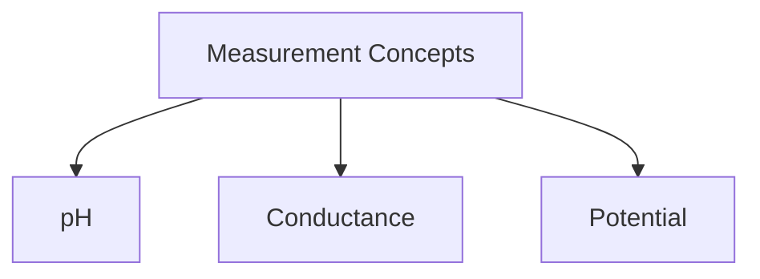

## Measurement and Understanding of pH, Conductance, and Potential

### pH Measurement and Understanding
**pH** is a measure of the concentration of hydrogen ions (H⁺) in a solution. It is defined as the negative logarithm (base 10) of the hydrogen ion concentration [H⁺]. The pH scale ranges from 0 to 14, with 7 being neutral. Solutions with a pH less than 7 are acidic, and those with a pH greater than 7 are basic or alkaline.

- **pH Calculation Example:**
  > **Example:** Calculate the pH of a solution with [H⁺] = 1 × 10⁻⁴ M.
  >
  > [
  > \text{pH} = -\log([H^+]) = -\log(1 \times 10^{-4}) = 4
  > ]

### Conductance Measurement and Understanding
**Conductance** is a measure of the ability of a solution to pass an electric current. It is the reciprocal of resistance and is directly proportional to the concentration of ions in the solution. The unit of conductance is Siemens (S).

- **Conductance Calculation Example:**
  > **Example:** A solution has a conductance of 0.5 S and a resistance of 2000 Ω. Calculate the resistance of the solution.
  >
  > [
  > \text{Conductance} = \frac{1}{\text{Resistance}}
  > ]
  > [
  > \text{Resistance} = \frac{1}{\text{Conductance}} = \frac{1}{0.5} = 2 \, \Omega
  > ]

### Potential Measurement and Understanding
**Potential** in this context typically refers to the cell potential (E) in electrochemical cells. The cell potential is the difference in electrical potential between the anode and the cathode of an electrochemical cell. It is measured in volts (V).

- **Potential Calculation Example:**
  > **Example:** In a galvanic cell, the reduction half-reaction is Cu²⁺ + 2e⁻ → Cu and the oxidation half-reaction is Zn → Zn²⁺ + 2e⁻. If the standard reduction potential of Cu²⁺ is +0.34 V and the standard reduction potential of Zn²⁺ is -0.76 V, calculate the cell potential.
  >
  > [
  > E_{cell} = E_{cathode} - E_{anode} = 0.34 \, \text{V} - (-0.76 \, \text{V}) = 1.10 \, \text{V}
  > ]

### Summary
In this section, we have discussed the fundamental concepts of pH, conductance, and potential, along with practical examples to aid understanding. Each of these measurements provides critical information about the nature and behavior of solutions in various chemical and electrochemical processes. Understanding these concepts is essential for analyzing and interpreting data in analytical chemistry and related fields.

