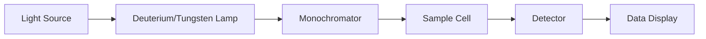

## UV-Visible Spectroscopy and its Application

### Introduction to UV-Visible Spectroscopy
**UV-Visible Spectroscopy** is a common analytical technique used to study the absorption of ultraviolet (UV) and visible light by molecules. This technique is based on the electronic transitions of atoms and molecules, where energy from light is absorbed, leading to the excitation of electrons from a lower energy level to a higher energy level. This method is widely used in chemistry, biochemistry, and materials science for the identification and quantification of substances.

- **Key Components**: The main components of a UV-Visible spectrophotometer include a light source, a monochromator, a sample cell, a detector, and a data display system.

### Working Principle of UV-Visible Spectroscopy
The working principle of UV-Visible spectroscopy involves the following steps:
- **Light Source**: A light source, such as a deuterium lamp or tungsten lamp, emits light across the UV and visible regions of the electromagnetic spectrum.
- **Monochromator**: The light from the source is passed through a monochromator, which disperses the light into its component wavelengths. This allows the spectrophotometer to measure the absorbance at a specific wavelength.
- **Sample Cell**: The sample is placed in the sample cell, which is a transparent container that allows the light to pass through the sample.
- **Detector**: The detector measures the intensity of the light after it passes through the sample and compares it with the intensity of the incident light. The difference in intensity is the absorbance of the sample.
- **Data Display**: The absorbance is displayed on a screen or recorded as a spectrum.

### Applications of UV-Visible Spectroscopy
UV-Visible spectroscopy has numerous applications in analytical chemistry, including:
- **Identification of Substances**: By analyzing the spectrum, the presence and concentration of a substance can be determined.
- **Quantitative Analysis**: The absorbance at specific wavelengths can be used to determine the concentration of a substance.
- **Structural Determination**: The shape of the absorption spectrum can provide information about the molecular structure of the substance.

- **Example:** A sample of a drug is analyzed using UV-Visible spectroscopy. The spectrum is compared with the reference spectrum of the pure drug. If there is a match, the drug is identified. The absorbance at 254 nm is measured, which is characteristic of the drug. The concentration of the drug is calculated using the Beer-Lambert law: A = · c · l, where A is the absorbance,  is the molar absorptivity, c is the concentration, and l is the path length.

### Mermaid Diagram for UV-Visible Spectroscopy Process

### Worked Example
> **Example:** A sample of an unknown solution is analyzed using UV-Visible spectroscopy. The absorbance at 260 nm is measured to be 0.50. The path length is 1 cm, and the molar absorptivity of the substance at this wavelength is 1.2 × 10⁴ L/(mol·cm). Calculate the concentration of the substance in the solution.
> 
> **Solution:**
> Using the Beer-Lambert law, A = · c · l:
> [ 0.50 = 1.2 \times 10^4 \cdot c \cdot 1 ]
> [ c = \frac{0.50}{1.2 \times 10^4} ]
> [ c = 4.17 \times 10^{-5} \, \text{M} ]

This example demonstrates the practical application of UV-Visible spectroscopy in determining the concentration of a substance.