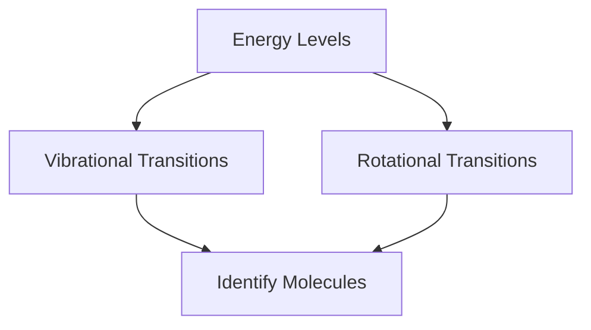

## Vibrational and Rotational spectroscopy (IR) of diatomic molecules and its application

### Introduction to Vibrational and Rotational Spectroscopy
**Vibrational and rotational spectroscopy** are important tools in the study of molecular structure and dynamics. Vibrational spectroscopy deals with the energy transitions in molecules due to the vibration of bonds, while rotational spectroscopy focuses on transitions due to the rotation of molecules. These techniques are widely used in chemistry, physics, and materials science for identifying and characterizing diatomic molecules.

### Vibrational Spectroscopy
**Vibrational spectroscopy** involves the absorption or emission of infrared (IR) radiation by molecules as they undergo vibrational transitions. The vibrational energy levels in a diatomic molecule can be described by the vibrational quantum number v.

- **Vibrational Energy Levels:** The energy of a diatomic molecule in the v-th vibrational state can be expressed as:
  [
  E_v = (v + \frac{1}{2})h\nu
  ]
  where h is Planck's constant and  is the vibrational frequency.

- **Selection Rules:** The allowed transitions are given by the selection rule Δ v = ± 1. This means that a diatomic molecule can only absorb or emit energy to change its vibrational state by one quantum.

- **Example:** A diatomic molecule has a vibrational frequency = 10¹³ Hz. Calculate the energy difference between the ground state and the first excited state.
  > **Example:**  
  [
  \Delta E = h \nu = 6.626 \times 10^{-34} \, \text{Js} \times 10^{13} \, \text{Hz} = 6.626 \times 10^{-21} \, \text{J}
  ]

### Rotational Spectroscopy
**Rotational spectroscopy** involves the absorption or emission of microwave radiation by molecules as they undergo rotational transitions. The rotational energy levels in a diatomic molecule can be described by the rotational quantum number J.

- **Rotational Energy Levels:** The energy of a diatomic molecule in the J-th rotational state is given by:
  [
  E_J = \frac{J(J + 1) \mu \Omega}{2I}
  ]
  where μ is the reduced mass of the molecule,  is the rotational constant, and I is the moment of inertia.

- **Selection Rules:** The allowed transitions are given by the selection rule Δ J = ± 1. This means that a diatomic molecule can only absorb or emit energy to change its rotational state by one quantum.

- **Example:** For a diatomic molecule, the rotational constant = 10⁻² cm⁻¹. Calculate the energy difference between the J = 1 and J = 0 states.
  > **Example:**  
  [
  \Delta E = \frac{1 \times (1 + 1) \times \mu \Omega}{2I} = \frac{2 \mu \Omega}{2I} = \frac{\mu \Omega}{I}
  ]
  Given = 10⁻² cm⁻¹, we need to convert  to energy units. Using = hc λ, where h is Planck's constant and c is the speed of light, we get:
  [
  \Omega = 10^{-2} \, \text{cm}^{-1} \times \frac{1.986 \times 10^{-23} \, \text{J} \cdot \text{cm}}{1 \, \text{cm}^{-1}} = 1.986 \times 10^{-25} \, \text{J}
  ]
  Thus,
  [
  \Delta E = 1.986 \times 10^{-25} \, \text{J}
  ]

### Application of Vibrational and Rotational Spectroscopy
**Application of Vibrational and Rotational Spectroscopy:** These techniques are widely used in chemical and physical analysis. For instance, in the identification of unknown substances, the vibrational and rotational frequencies can provide unique "fingerprint" spectra. Additionally, these spectroscopic methods can help in studying reaction dynamics, determining bond lengths, and understanding molecular structures.

- **Example:** Use the vibrational and rotational spectroscopy data to identify a diatomic molecule.
  > **Example:**  
  Given the vibrational frequency = 10¹³ Hz and the rotational constant = 10⁻² cm⁻¹, identify the molecule.  
  **Solution:**  
  For = 10¹³ Hz, the vibrational quantum number v can be estimated. For = 10⁻² cm⁻¹, the rotational quantum number J can be determined. By cross-referencing these values with known spectroscopic data, the molecule can be identified as O₂.

This diagram illustrates the flow of information from vibrational and rotational energy levels to the identification of molecules.