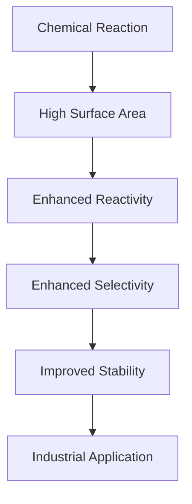
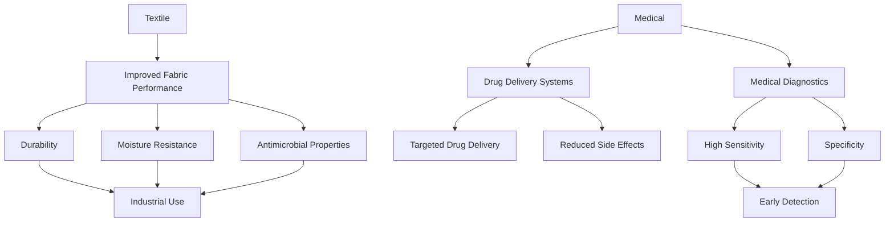

## Applications of nanomaterial in catalysis

Nanomaterials have revolutionized the field of catalysis due to their unique physical and chemical properties. These materials are widely used in various industrial processes, including petrochemicals, pharmaceuticals, and environmental remediation. The key advantages of using nanomaterials in catalysis include high surface area, increased reactivity, enhanced selectivity, and improved stability.

### **1. High Surface Area and Reactivity**

Nanomaterials, such as nanocatalysts, have a large surface area compared to their volume, which enhances the interaction between reactants and catalysts. This high reactivity is crucial for catalytic reactions, making nanomaterials highly effective in facilitating chemical transformations.

> **Example:** Palladium nanoparticles are used as catalysts in the hydrogenation of alkenes. Due to their high surface area, they provide numerous active sites for the hydrogen atoms to bind, leading to efficient and selective hydrogenation of alkenes.

### **2. Enhanced Selectivity**

The selectivity of a catalyst is its ability to promote a desired reaction over others. Nanomaterials can be designed to have specific active sites that favor certain reactions, thus improving the selectivity of the catalyst. This is particularly useful in complex industrial processes where multiple reactions can occur.

> **Example:** In the oxidation of methanol to formaldehyde, gold nanoparticles are used as catalysts. The specific surface chemistry of gold nanoparticles ensures that the reaction proceeds selectively to formaldehyde, reducing the formation of undesired by-products like carbon monoxide.

### **3. Improved Stability**

Nanomaterials are often more stable than their bulk counterparts due to their surface properties. This stability is crucial in long-term industrial applications where the catalyst needs to remain active over extended periods.

> **Example:** Ruthenium nanoparticles are used in the selective oxidation of ethylene to ethylene oxide. Their stability allows them to maintain their catalytic activity even after prolonged use, making them suitable for continuous industrial processes.

### Flowchart of Catalytic Processes Using Nanomaterials

## Textile and Medicine

Nanomaterials are increasingly used in the textile and medical industries due to their unique properties. These applications include improved fabric performance, drug delivery systems, and medical diagnostics.

### **1. Improved Fabric Performance**

Nanomaterials can be used to enhance the properties of textiles, such as durability, moisture resistance, and antimicrobial properties.

> **Example:** Silver nanoparticles are often used in clothing to impart antimicrobial properties. The nanoparticles release silver ions, which can inhibit bacterial growth, making the fabric more hygienic.

### **2. Drug Delivery Systems**

Nanomaterials can be designed to act as carriers for drugs, improving their delivery and efficacy. This is particularly useful for targeted drug delivery, where the drug is released only in the presence of specific conditions or at specific locations.

> **Example:** Liposomes are nanocarriers used for drug delivery. They are lipids vesicles that can encapsulate drugs and release them in a controlled manner. For instance, doxorubicin, a chemotherapy drug, can be encapsulated in liposomes to target cancer cells specifically, reducing side effects.

### **3. Medical Diagnostics**

Nanomaterials can be used in diagnostic tools to detect biomolecules, such as DNA or proteins, with high sensitivity and specificity.

> **Example:** Quantum dots are semiconductor nanocrystals used in biomedical imaging. They emit light when excited, which can be detected to visualize the location of specific biomolecules in tissues. This is particularly useful in cancer diagnostics where early detection can significantly improve treatment outcomes.

### Flowchart of Nanomaterial Applications in Textiles and Medicine

These sections provide a comprehensive overview of the applications of nanomaterials in catalysis, textiles, and medicine, along with relevant worked examples to aid understanding.