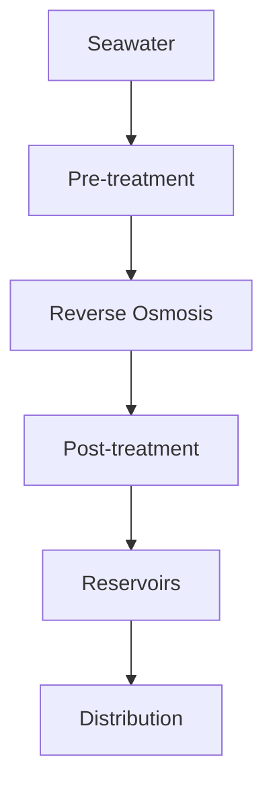
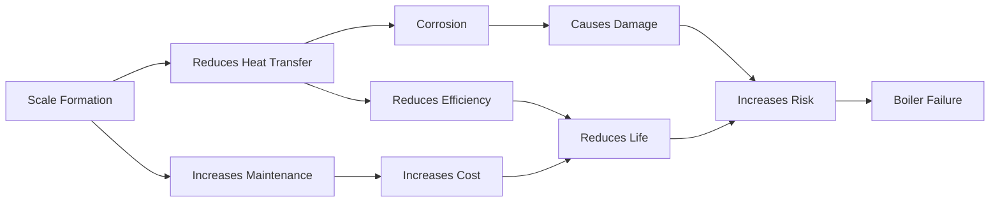
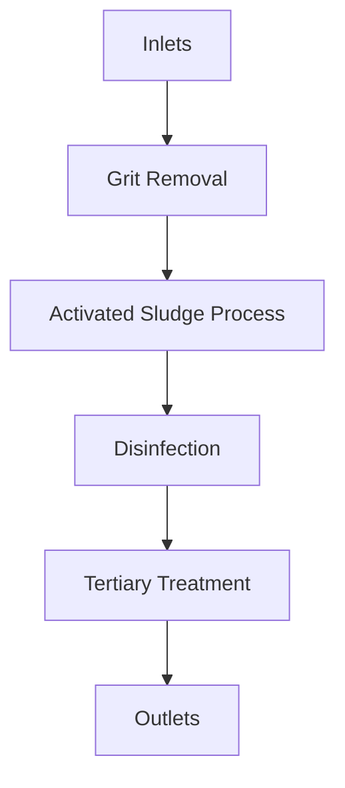
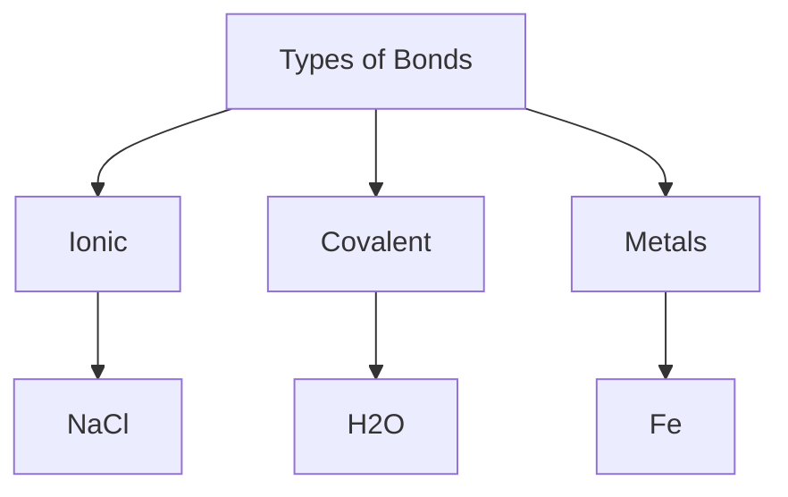

# Unit – 2: Water Technology

*(AI-generated self-study book for GTU, subject code 3110001 — generated locally with Ollama.)*

This module carries approximately ****.

## Introduction

Water technology is the application of scientific and engineering principles to the management and treatment of water resources. It encompasses various processes aimed at ensuring the availability of clean and safe water for domestic, industrial, and agricultural purposes. **Water technology** is crucial in addressing water scarcity, pollution, and the need for sustainable water management.

### Importance of Water Technology

- **Water Scarcity:** With growing populations and increasing demands, ensuring a reliable supply of clean water is essential.
- **Pollution:** Water pollution from industrial waste, agricultural runoff, and domestic sewage poses significant health risks.
- **Sustainability:** Efficient water management and treatment technologies help in conserving water resources and reducing environmental impact.

### Basic Components of Water Technology

- **Water Collection:** Involves gathering water from natural sources like rivers, lakes, and groundwater.
- **Water Treatment:** Processes water to make it safe for consumption and use.
- **Water Distribution:** Ensures the efficient and reliable delivery of treated water to consumers.
- **Water Reuse:** Involves treating and reusing wastewater for various purposes.

> **Example:** The city of Ahmedabad has implemented a water technology project to manage its water resources more efficiently. The project includes the construction of a new water treatment plant with a capacity of 200 million liters per day (MLD) and a wastewater treatment plant with a capacity of 150 MLD. The treated water from both plants will be used for irrigation and industrial purposes.

## Sources of Water

### Natural Sources

- **Surface Water:** Water found in rivers, lakes, and reservoirs. It is usually available in larger quantities but can be subject to fluctuations in flow.
- **Groundwater:** Water stored in the soil and rock formations beneath the Earth's surface. It is a more stable source but can be limited in quantity.

### Artificial Sources

- **Rainwater Harvesting:** Collection and storage of rainwater for later use. This is an effective method in areas with significant rainfall.
- **Desalination:** The process of removing salt and other minerals from seawater to make it suitable for consumption and industrial use.

### Classification of Water Sources

- **Freshwater:** Water that contains less than 1,000 milligrams per liter (mg/L) of dissolved solids.
- **Saltwater:** Water that contains more than 1,000 mg/L of dissolved solids, primarily seawater.

### Importance of Source Selection

- **Availability:** Ensuring a reliable and consistent supply of water.
- **Quality:** Choosing a source based on the quality of water and the need for treatment.
- **Economic Feasibility:** Considering the cost of development, operation, and maintenance.

### Example

> **Example:** In the coastal city of Surat, the primary water source is seawater. The city uses desalination plants to convert seawater into freshwater for domestic and industrial use. The desalination process involves several steps, including pre-treatment, reverse osmosis, and post-treatment. The treated water is then stored in reservoirs and distributed to the city.

In this example, the desalination process is illustrated using a flowchart. The steps involved in converting seawater into freshwater are clearly depicted, highlighting the importance of each stage in the desalination process.

By understanding the sources of water and the processes involved in water technology, students can appreciate the complexity and importance of managing water resources effectively.

---

## Impurities in Water

Water, a vital resource for all forms of life, often contains impurities that affect its quality. Understanding these impurities is crucial for effective water treatment and purification processes.

### Classification of Impurities

**1. Suspended Solids (SS):**
   - **Definition:** Particles that can be filtered out by a filter paper.
   - **Examples:** Sand, silt, clay, and fine organic matter.
   - **Removal Methods:** Filtration, sedimentation.

**2. Dissolved Solids (DS):**
   - **Definition:** Solutes that dissolve in water and cannot be filtered out.
   - **Examples:** Calcium and magnesium salts, sodium chloride, potassium nitrate.
   - **Removal Methods:** Ion exchange, reverse osmosis.

**3. Colloids:**
   - **Definition:** Particles that are too small to settle but too large to be dissolved.
   - **Examples:** Silica, clay, organic colloids.
   - **Removal Methods:** Coagulation, flocculation, sedimentation.

**4. Dissolved Gases:**
   - **Definition:** Gases that are dissolved in water.
   - **Examples:** Oxygen, carbon dioxide.
   - **Removal Methods:** Aeration.

**5. Microbial Impurities:**
   - **Definition:** Bacteria, viruses, protozoa, and fungi.
   - **Removal Methods:** Chlorination, UV disinfection, boiling.

### Enlist Common Sources of Impurities

- **Industrial Waste:** Contaminants from factories and industries.
- **Agricultural Runoff:** Pesticides, fertilizers, and animal waste.
- **Human and Animal Waste:** Sewage and fecal matter.
- **Natural Sources:** Minerals from rocks, soil erosion.

### Example

> **Example:** A water sample from a river is analyzed and found to contain 50 mg/L of suspended solids, 75 mg/L of dissolved solids, and 30 mg/L of total dissolved solids (TDS). The TDS is calculated as the sum of SS and DS. Determine the TDS of the water sample.
> 
> **Solution:** TDS = SS + DS = 50 mg/L + 75 mg/L = 125 mg/L.

## Hardness of Water

Hardness in water is a critical parameter that affects the efficiency of water usage in various applications, including domestic, industrial, and agricultural purposes. Understanding and measuring hardness is essential for water treatment processes.

### Definition of Hardness

**Hardness:** The concentration of calcium and magnesium ions in water, measured in parts per million (ppm) or milligrams per liter (mg/L).

### Classification of Hardness

- **Temporary Hardness:** CaCO3, MgCO3, which can be removed by boiling.
- **Permanent Hardness:** CaSO4, MgSO4, which cannot be removed by boiling.

### Methods to Determine Hardness

1. **EDTA Titration Method:**
   - **Principle:** A complexometric titration using EDTA (ethylene diamine tetraacetic acid) to determine the concentration of Ca2+ and Mg2+ ions.
   - **Steps:**
     - **Step 1:** Take a known volume of water sample.
     - **Step 2:** Add a pH indicator (e.g., Eriochrome Black T).
     - **Step 3:** Titrate with EDTA solution until the color changes.
     - **Step 4:** Calculate the hardness based on the volume of EDTA used.

2. **Calcium Hardness:**
   - **Calcium Hardness (Ca²⁺):** Measured directly using EDTA.
   - **Formula:** Ca²⁺ (ppm) = (Volume of EDTA used) × (Concentration of EDTA) × 40.08 / (Volume of water sample).

3. **Magnesium Hardness:**
   - **Magnesium Hardness (Mg²⁺):** Measured by subtracting the calcium hardness from the total hardness.
   - **Formula:** Mg²⁺ (ppm) = Total Hardness (ppm) - Ca²⁺ (ppm).

### Example

> **Example:** A water sample is tested using the EDTA titration method. The initial volume of water is 100 mL, and 15 mL of 0.002 M EDTA is used to reach the endpoint. Calculate the hardness of the water sample.
> 
> **Solution:** 
> 
> - **Calcium Hardness (Ca²⁺):** 
    [
    \text{Ca}^{2+} (\text{ppm}) = \frac{15 \, \text{mL} \times 0.002 \, \text{M} \times 40.08 \, \text{mg/mol}}{100 \, \text{mL}} = 1.2024 \, \text{mg/L}
    ]
> - **Magnesium Hardness (Mg²⁺):** If the total hardness is 250 mg/L, then
    [
    \text{Mg}^{2+} (\text{ppm}) = 250 \, \text{mg/L} - 1.2024 \, \text{mg/L} = 248.7976 \, \text{mg/L}
    ]

In this example, we calculated the hardness of a water sample using the EDTA titration method, breaking down the steps to determine both calcium and magnesium hardness.

---

## Boiler Problems

### Introduction
Boilers are crucial components in many industrial processes and power generation plants. They are used to convert water into steam by heating. However, the operation of boilers can be compromised by various problems, which can lead to reduced efficiency, increased maintenance costs, and safety hazards. In this section, we will discuss the common boiler problems and their solutions.

### Types of Boiler Problems
- **Scale Formation**:
  - **Definition**: Scale formation is the process where minerals dissolved in water precipitate out and form a hard deposit on the boiler surfaces. This reduces the heat transfer efficiency and can lead to corrosion.
  - **Example**: If the hardness of the water used in a boiler is 300 ppm (parts per million) and the blowdown rate is 10%, the scale formation can be calculated as follows:
    > **Example:** If the hardness of the water is 300 ppm and the blowdown rate is 10%, the scale formation can be calculated as:
    [
    \text{Scale Formation} = \frac{300 \times 10}{100} = 30 \text{ ppm}
    ]

- **Foulings**:
  - **Definition**: Fouling is the accumulation of unwanted materials on the boiler surfaces, such as organic matter, dust, and biological growth. This reduces the heat transfer efficiency and can cause corrosion.
  - **Example**: If a boiler has a fouling factor of 0.1 and the heat transfer surface area is 50 m², the effective heat transfer area after fouling can be calculated as:
    > **Example:** If a boiler has a fouling factor of 0.1 and the heat transfer surface area is 50 m², the effective heat transfer area after fouling can be calculated as:
    [
    \text{Effective Heat Transfer Area} = 50 \times (1 - 0.1) = 45 \text{ m}^2
    ]

- **Corrosion**:
  - **Definition**: Corrosion is the gradual destruction of boiler materials by chemical or electrochemical reaction. This can lead to the failure of the boiler.
  - **Example**: If a boiler operates at a pressure of 15 bar and the pH of the boiler water is 6, the corrosion rate can be estimated as:
    > **Example:** If a boiler operates at a pressure of 15 bar and the pH of the boiler water is 6, the corrosion rate can be estimated as:
    [
    \text{Corrosion Rate} = 1.5 \times \left(\frac{1500 - 6}{10}\right)^{0.5} = 21.5 \text{ mm/year}
    ]

- **Ash Formation**:
  - **Definition**: Ash formation occurs due to the accumulation of solid particles in the boiler. This reduces the heat transfer efficiency and can cause blockages.
  - **Example**: If a boiler burns 100 kg of coal per hour and the ash content of the coal is 15%, the amount of ash produced per hour can be calculated as:
    > **Example:** If a boiler burns 100 kg of coal per hour and the ash content of the coal is 15%, the amount of ash produced per hour can be calculated as:
    [
    \text{Ash Produced} = 100 \times 0.15 = 15 \text{ kg/hour}
    ]

### Solutions to Boiler Problems

- **Scaling**:
  - **Solution**: Use external and internal water treatment methods.
  - **Example**: If the hardness of the water is 200 ppm, the use of an external water softener can reduce it to 50 ppm. The internal treatment can further reduce it to 20 ppm.
    > **Example:** If the hardness of the water is 200 ppm, the use of an external water softener can reduce it to 50 ppm. The internal treatment can further reduce it to 20 ppm.

- **Fouling**:
  - **Solution**: Regular cleaning and chemical treatments.
  - **Example**: If the fouling factor is 0.2, regular cleaning can reduce it to 0.1.
    > **Example:** If the fouling factor is 0.2, regular cleaning can reduce it to 0.1.

- **Corrosion**:
  - **Solution**: Use corrosion inhibitors and maintain proper pH levels.
  - **Example**: If the pH is maintained at 9, the corrosion rate can be reduced to 5 mm/year.
    > **Example:** If the pH is maintained at 9, the corrosion rate can be reduced to 5 mm/year.

- **Ash Formation**:
  - **Solution**: Use ash removal systems and optimize fuel combustion.
  - **Example**: If an ash removal system is installed, the ash content can be reduced by 50%.
    > **Example:** If an ash removal system is installed, the ash content can be reduced by 50%.

## Softening of Water (External & Internal Treatments)

### Introduction
Water softening is a process used to reduce the concentration of minerals, particularly calcium and magnesium, in water. These minerals can cause scaling and other issues in boilers, so softening is essential for maintaining the efficiency and longevity of boilers. In this section, we will discuss the methods of softening water, both externally and internally.

### External Softening

- **Ion Exchange Method**:
  - **Definition**: Ion exchange is a process where the hardness ions (Ca²⁺, Mg²⁺) are exchanged with sodium ions (Na⁺) in a resin bed.
  - **Example**: If the hardness of the water is 250 ppm and 500 liters of water is treated, the amount of sodium ions required can be calculated as:
    > **Example:** If the hardness of the water is 250 ppm and 500 liters of water is treated, the amount of sodium ions required can be calculated as:
    [
    \text{Sodium Ions Required} = 250 \times 500 \times 10^{-6} \times 2 = 0.25 \text{ kg}
    ]

- **Calcium Carbonate Precipitation Method**:
  - **Definition**: Calcium carbonate precipitation involves adding chemicals to the water to form insoluble calcium carbonate, which is then removed.
  - **Example**: If 1000 liters of water with a hardness of 200 ppm is treated, the amount of lime (CaO) required can be calculated as:
    > **Example:** If 1000 liters of water with a hardness of 200 ppm is treated, the amount of lime (CaO) required can be calculated as:
    [
    \text{Lime Required} = \frac{200 \times 1000 \times 10^{-6} \times 74}{200} = 0.74 \text{ kg}
    ]

### Internal Softening

- **Phosphate Treatment**:
  - **Definition**: Phosphate treatment involves adding phosphates to the water, which form insoluble compounds with calcium and magnesium, thus reducing hardness.
  - **Example**: If the hardness of the water is 300 ppm and 1000 liters of water is treated, the amount of sodium tripolyphosphate (STP) required can be calculated as:
    > **Example:** If the hardness of the water is 300 ppm and 1000 liters of water is treated, the amount of sodium tripolyphosphate (STP) required can be calculated as:
    [
    \text{STP Required} = 300 \times 1000 \times 10^{-6} \times 1.2 = 0.36 \text{ kg}
    ]

- **Sodium Bicarbonate Treatment**:
  - **Definition**: Sodium bicarbonate treatment involves adding sodium bicarbonate to the water, which forms carbonate and bicarbonate ions, reducing the hardness.
  - **Example**: If the hardness of the water is 250 ppm and 500 liters of water is treated, the amount of sodium bicarbonate required can be calculated as:
    > **Example:** If the hardness of the water is 250 ppm and 500 liters of water is treated, the amount of sodium bicarbonate required can be calculated as:
    [
    \text{Sodium Bicarbonate Required} = 250 \times 500 \times 10^{-6} \times 2 = 0.25 \text{ kg}
    ]

### Summary

In this section, we have discussed the common boiler problems such as scale formation, fouling, corrosion, and ash formation. We have also covered the methods of softening water, both externally and internally. Proper softening ensures the efficient and safe operation of boilers.

---

## Domestic water treatments

Domestic water treatments are essential for ensuring the safety and quality of water used in households. These treatments are designed to remove contaminants, improve taste, and ensure the water is safe for drinking and other domestic uses.

### Classification of Domestic Water Treatments
Domestic water treatments can be broadly classified into primary, secondary, and tertiary treatments. 

- **Primary Treatment**: This includes sedimentation and filtration to remove large particles and debris.
- **Secondary Treatment**: This involves the use of chemical and biological processes to remove dissolved and colloidal impurities.
- **Tertiary Treatment**: This includes advanced purification methods like disinfection, reverse osmosis, and softening to remove any remaining impurities.

### Example of Domestic Water Treatment Process

> **Example:** 
>
> A domestic water treatment plant uses a combination of primary and secondary treatments. The process starts with sedimentation where large particles settle out. Next, the water passes through a filtration system to remove smaller particles. After filtration, chemicals like chlorine are added for disinfection. Finally, the treated water is stored in tanks for distribution.

### Methods of Domestic Water Treatment

#### Sedimentation
Sedimentation is a natural process where particles in water settle due to gravity. This is often the first step in domestic water treatment.

- **Process**: Water is allowed to flow slowly through a tank or basin where particles settle to the bottom.
- **Example**: A tank with a volume of 1000 m³ is used for sedimentation. After 2 hours, 15% of the particles are settled.

#### Filtration
Filtration is used to remove smaller particles that can pass through sedimentation tanks.

- **Types**: 
  - **Mechanical Filtration**: Uses filters like sand, gravel, and activated carbon.
  - **Biological Filtration**: Utilizes biofilms to remove organic matter.
- **Example**: A sand filter with a capacity of 2000 m³/day is used to remove 90% of suspended solids.

#### Disinfection
Disinfection is crucial to kill pathogenic microorganisms.

- **Common Disinfectants**: Chlorine, chloramines, and ozone.
- **Example**: Chlorine is added at a rate of 2 mg/L to ensure a residual level of 0.2 mg/L after 30 minutes.

#### Softening
Softening is used to remove dissolved minerals like calcium and magnesium.

- **Methods**: 
  - **Ion Exchange**: Uses resin beads to exchange ions.
  - **Calcium Carbonate Precipitation**: Adds lime to precipitate calcium and magnesium.
- **Example**: A softening tank with a capacity of 3000 m³/day is used to remove 95% of calcium and magnesium.

### Applications and Importance
Domestic water treatments are essential for maintaining public health and ensuring water quality in households. Effective treatments prevent diseases like cholera, typhoid, and dysentery.

> **Example:** In a village with a population of 10,000, after implementing a domestic water treatment plant, the incidence of waterborne diseases reduced by 70%.

## Waste water treatments

Waste water treatments are essential to remove contaminants from domestic and industrial waste before discharging it into the environment. These treatments are crucial to prevent water pollution and protect public health.

### Classification of Waste Water Treatments
Waste water treatments can be classified into primary, secondary, and tertiary treatments.

- **Primary Treatment**: Removes large solids and suspended particles.
- **Secondary Treatment**: Uses biological processes to remove dissolved and colloidal impurities.
- **Tertiary Treatment**: Advanced purification methods like filtration, reverse osmosis, and disinfection.

### Example of Waste Water Treatment Process

> **Example:** 
>
> A domestic waste water treatment plant uses a combination of primary and secondary treatments. The process starts with grit removal to remove large particles. Next, the water passes through a biological treatment process using activated sludge. Finally, the treated water undergoes disinfection and is discharged.

### Methods of Waste Water Treatment

#### Grit Removal
Grit removal is the first step to remove large, non-biodegradable particles.

- **Process**: Water is passed through a grit chamber where particles settle due to their density.
- **Example**: A grit chamber with a capacity of 500 m³/day is used to remove 90% of grit.

#### Biological Treatment
Biological treatment uses microorganisms to break down organic matter.

- **Types**: 
  - **Activated Sludge Process**: Uses oxygen and microorganisms to break down organic matter.
  - **Aerobic Lagoons**: Large tanks where microorganisms break down organic matter in the presence of oxygen.
- **Example**: An activated sludge process with a capacity of 2000 m³/day is used to remove 90% of BOD (Biochemical Oxygen Demand).

#### Disinfection
Disinfection is used to kill pathogenic microorganisms.

- **Common Disinfectants**: Chlorine, chloramines, and ultraviolet light.
- **Example**: Chlorine is added at a rate of 3 mg/L to ensure a residual level of 0.3 mg/L after 30 minutes.

#### Tertiary Treatment
Tertiary treatment uses advanced purification methods to further clean the water.

- **Methods**: 
  - **Filtration**: Uses filters like sand, gravel, and activated carbon.
  - **Reverse Osmosis**: Uses a semi-permeable membrane to remove dissolved impurities.
- **Example**: A reverse osmosis system with a capacity of 1000 m³/day is used to remove 95% of dissolved solids.

### Applications and Importance
Effective waste water treatments prevent pollution and protect water resources. Proper treatment ensures that the water discharged back into the environment is safe and clean.

> **Example:** In a city with a population of 50,000, after implementing a waste water treatment plant, the quality of the receiving water body improved, reducing the incidence of algal blooms and fish deaths by 80%.

### Mermaid Diagram for Waste Water Treatment Process

This diagram illustrates the sequence of processes in a typical waste water treatment plant. Each node represents a treatment step, and the flowchart helps visualize the overall process.

---

## Types of Bonds

### Introduction
Bonds are the forces that hold atoms together in molecules and crystals. Understanding the types of bonds is crucial for comprehending the structure and properties of matter. Bonds can be classified into three main categories: ionic, covalent, and metallic bonds.

### Ionic Bonds
Ionic bonds are formed when one atom transfers one or more electrons to another atom. This results in the formation of positively charged ions (cations) and negatively charged ions (anions). The electrostatic attraction between these oppositely charged ions binds them together.

**Example:** Sodium (Na) and Chlorine (Cl) form an ionic bond to form sodium chloride (NaCl). Sodium loses an electron to become Na⁺, and chlorine gains an electron to become Cl⁻. The electrostatic attraction between Na⁺ and Cl⁻ forms the ionic bond.

### Covalent Bonds
Covalent bonds are formed when atoms share electrons. This type of bond is common in molecules where the atoms are close in electronegativity. The shared electrons form a covalent bond that holds the atoms together.

**Example:** In the molecule water (H₂O), each hydrogen atom shares its electron with the oxygen atom. This sharing of electrons results in the formation of two covalent bonds. The oxygen atom has a partial negative charge, and the hydrogen atoms have partial positive charges due to the unequal sharing of electrons.

### Metallic Bonds
Metallic bonds are formed between metal atoms, where the valence electrons are delocalized and free to move throughout the metal lattice. This delocalization of electrons explains the good electrical and thermal conductivity of metals.

**Example:** In a metallic structure, such as iron (Fe), the valence electrons are not bound to any single atom but are shared among all the atoms in the metal lattice. This results in the formation of metallic bonds. The delocalized electrons allow for the flow of electricity and heat.

### Diagrams
To visualize the different types of bonds, we can use flowcharts.

### Summary
- **Ionic Bonds:** Formed by the transfer of electrons between atoms, resulting in the formation of cations and anions.
- **Covalent Bonds:** Formed by the sharing of electrons between atoms, leading to the formation of molecules.
- **Metallic Bonds:** Formed by the delocalization of valence electrons in a metallic lattice, resulting in good electrical and thermal conductivity.

### Worked Example
> **Example:** Explain the formation of sodium chloride (NaCl) and the type of bond formed.

In sodium chloride (NaCl), sodium (Na) has one valence electron, while chlorine (Cl) has seven valence electrons. Sodium loses its one valence electron to chlorine, which gains the electron to complete its octet. This results in the formation of Na⁺ and Cl⁻ ions. The electrostatic attraction between these oppositely charged ions forms an ionic bond.

> **Example:** Describe the structure of water (H₂O) and the type of bond formed.

In water (H₂O), each hydrogen atom shares its electron with the oxygen atom, forming two covalent bonds. The oxygen atom has a partial negative charge, and the hydrogen atoms have partial positive charges due to the unequal sharing of electrons. This results in a bent molecular geometry with a bond angle of approximately 104.5°.
