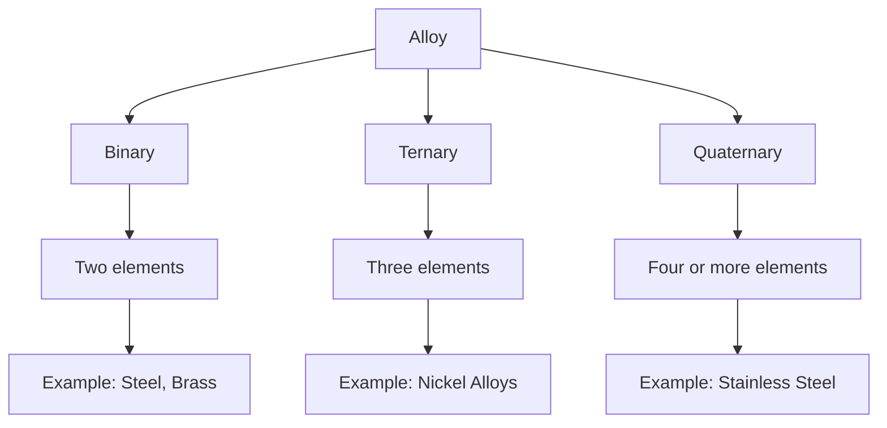
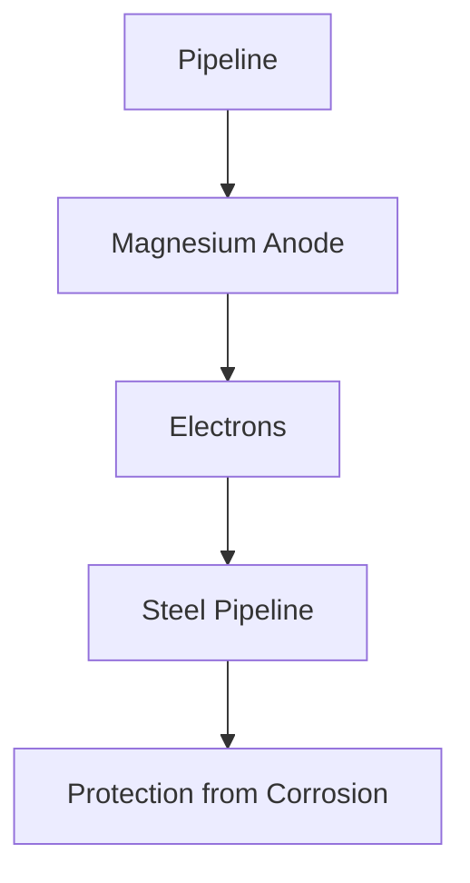
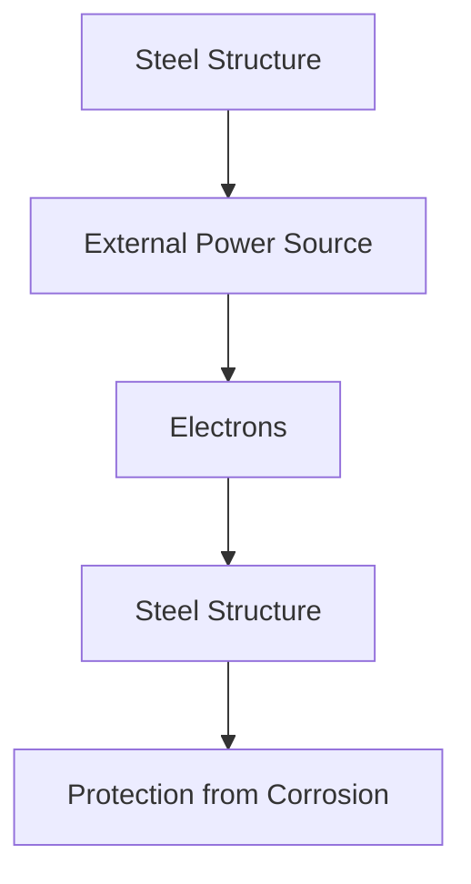

# Unit – 3: Metals, Alloys and Corrosion

*(AI-generated self-study book for GTU, subject code 3110001 — generated locally with Ollama.)*

This module carries approximately ****.

## Introduction

### Definition and Importance
**Metals:** A metal is a material that is typically hard, shiny, and a good conductor of heat and electricity. They are generally malleable and ductile. Metals play a crucial role in various industries, including construction, manufacturing, and electronics. For instance, aluminum is used in aircraft and beverage cans, while copper is widely used in wiring due to its excellent electrical conductivity.

**Alloys:** An alloy is a mixture of two or more metals or a metal and a non-metal. Alloys are created to enhance the properties of the base metal. For example, brass, which is an alloy of copper and zinc, is used in musical instruments due to its good tonal quality and resistance to corrosion.

### Classification of Metals
Metals are broadly classified into:
- **Transition Metals:** These include elements like iron, nickel, and chromium. They are known for their ductility, malleability, and good electrical and thermal conductivity.
- **Post-Transition Metals:** Elements like aluminum and gallium belong to this category. They are less reactive than transition metals.
- **Metalloids:** Elements like silicon and germanium are often considered metalloids as they possess properties of both metals and non-metals.

### Example:
> **Example:** Classify the following metals and explain their properties:
> - Iron: Transition metal, used in construction.
> - Silicon: Metalloid, used in semiconductors.

## Physical Properties of Metals

### Definition and Types
**Physical Properties:** These are characteristics of a material that can be observed without changing its chemical identity. Physical properties are typically measured and include appearance, hardness, density, melting point, and thermal conductivity.

### Appearance
Metals generally have a shiny appearance, which is due to the reflection of light from their surface. For example, gold is known for its bright yellow appearance, while silver has a silvery-white appearance.

### Hardness
**Hardness:** A measure of a metal's resistance to scratching or indentation. Hardness can be quantified using hardness scales such as the Brinell or Rockwell scale. For instance, diamond has the highest hardness on the Mohs scale at 10, whereas aluminum has a hardness of around 2-3 on the same scale.

### Density
**Density:** The mass per unit volume of a substance. It is usually expressed in grams per cubic centimeter (g/cm³). Gold has a high density of 19.3 g/cm³, while aluminum has a much lower density of 2.7 g/cm³, making it lightweight.

### Melting Point
**Melting Point:** The temperature at which a solid changes to a liquid. It is an important physical property for metals as it indicates their behavior at high temperatures. For example, iron has a high melting point of 1538°C, while lead has a lower melting point of 327°C.

### Thermal Conductivity
**Thermal Conductivity:** The ability of a material to conduct heat. Metals generally have high thermal conductivity, which is why they are used in heat exchangers and cooking utensils. Copper, with a thermal conductivity of 385 W/(m·K), is one of the best conductors of heat.

### Example:
> **Example:** Calculate the density of a metal block that has a mass of 100 grams and a volume of 5 cm³.
> 
> **Solution:** The density (ρ) is given by the formula:
> 
> [
> \rho = \frac{\text{mass}}{\text{volume}}
> ]
> 
> Substituting the given values:
> 
> [
> \rho = \frac{100 \text{ g}}{5 \text{ cm}^3} = 20 \text{ g/cm}^3
> ]

### Example:
> **Example:** Compare the melting points of iron and lead and discuss their implications for use in different applications.
> 
> **Solution:** Iron has a higher melting point (1538°C) compared to lead (327°C). This difference means that iron can withstand higher temperatures without melting, making it suitable for use in high-temperature environments such as in furnaces. In contrast, lead's lower melting point makes it more suitable for applications where the material needs to remain solid at lower temperatures, such as in plumbing or radiation shielding.

By understanding the physical properties of metals, engineers can select the most appropriate materials for various applications, ensuring safety, efficiency, and performance.

---

## Definition and purpose of alloy

**Alloy:** An alloy is a mixture of two or more metallic elements, or a mixture of a metal and a non-metal, that has metallic properties. The primary purpose of forming an alloy is to improve the physical and mechanical properties of the metal. These properties may include strength, hardness, ductility, malleability, corrosion resistance, and thermal and electrical conductivity.

### Purpose of Alloys
- **Enhancement of Physical Properties:** Alloys are often created to enhance the physical properties of metals. For example, adding a small amount of carbon to iron creates steel, which is significantly stronger and harder than pure iron.
- **Corrosion Resistance:** By combining different metals, the susceptibility to corrosion can be reduced. For instance, stainless steel is an alloy of iron, chromium, and nickel, which significantly improves its resistance to corrosion.
- **Machinability:** Certain alloys are easier to machine than their pure counterparts. Brass, an alloy of copper and zinc, is known for its excellent machinability.
- **Thermal and Electrical Conductivity:** Alloys can be tailored to have specific thermal and electrical conductivity properties. For example, adding silver to copper increases the electrical conductivity of the alloy.

### Example
> **Example:** Steel is an alloy of iron and carbon. The amount of carbon in steel can vary, ranging from 0.02% in low-carbon steel to over 1.7% in high-carbon steel. Steel with 0.5% carbon content is known as medium carbon steel, which is widely used in manufacturing due to its balance of strength and ductility.

## Classification of alloys

Alloys can be classified based on their composition and the nature of the constituent elements. The following flowchart illustrates the classification of alloys:

### Binary Alloys
- **Definition:** A binary alloy is composed of two elements, typically a metal and another metal or a metal and a non-metal.
- **Example:** Steel, which is an alloy of iron and carbon, is a binary alloy.

### Ternary Alloys
- **Definition:** Ternary alloys consist of three elements. These alloys are more complex than binary alloys and can form a wide range of different structures.
- **Example:** Nickel alloys, which can include nickel, iron, and chromium, are used in high-temperature applications due to their corrosion resistance.

### Quaternary Alloys
- **Definition:** Quaternary alloys are composed of four or more elements. These alloys are highly complex and are used in specialized applications where a wide range of properties is required.
- **Example:** Stainless steel, which can contain iron, chromium, nickel, and molybdenum, is a quaternary alloy. It is widely used in kitchen utensils, medical devices, and chemical processing equipment due to its excellent corrosion resistance and mechanical properties.

### Example
> **Example:** An alloy used in the aerospace industry, Inconel, is a quaternary alloy composed of nickel, chromium, iron, and molybdenum. It is known for its high-temperature strength and resistance to thermal fatigue and oxidation.

By understanding the classification of alloys, one can better appreciate the diverse applications and properties of these materials in various industries.

---

## Alloys: Steel, Cu, Al, Pb and its industrial applications

### Definition and Classification of Alloys
An alloy is a mixture of metals or a metal and a non-metal, which has metallic properties. Alloys are widely used in industries due to their improved mechanical properties and other desirable characteristics. **Steel**, **copper (Cu)**, **aluminum (Al)**, and **lead (Pb)** are some of the most important alloys used in various applications.

#### Steel
Steel is an alloy of iron and carbon. The percentage of carbon in steel varies, and this determines its properties. Steel with 0.2% to 0.5% carbon content is considered mild steel, while steel with 0.6% to 2% carbon content is called medium carbon steel. High carbon steel contains more than 2% carbon.

- **Example:** A steel sample has 1.2% carbon content. Classify the type of steel.
  > **Example:** The steel sample has 1.2% carbon content, which falls within the range of 0.6% to 2%, so it is classified as medium carbon steel.

#### Copper (Cu)
Copper is a soft, malleable metal. Pure copper is used in electrical wiring due to its good electrical conductivity. However, it is often alloyed with other elements to improve its mechanical properties and resistance to corrosion.

- **Example:** Describe the composition and uses of brass, an alloy of copper and zinc.
  > **Example:** Brass is an alloy of copper and zinc. It typically contains 60% copper and 40% zinc. Brass is used in making musical instruments, plumbing fittings, and decorations due to its good mechanical properties and corrosion resistance.

#### Aluminum (Al)
Aluminum is a lightweight metal. Pure aluminum is soft and ductile. It is often alloyed with other elements to improve its strength, hardness, and corrosion resistance.

- **Example:** List the common elements used to alloy aluminum and their effects.
  > **Example:** The common elements used to alloy aluminum are magnesium (Mg), silicon (Si), and copper (Cu). Magnesium increases strength and toughness, silicon improves castability and corrosion resistance, and copper enhances strength and wear resistance.

#### Lead (Pb)
Lead is a soft, dense metal. Pure lead is used in radiation shielding and batteries. It is often alloyed with other elements to improve its mechanical properties and hardness.

- **Example:** Explain the composition and uses of solder, an alloy of tin and lead.
  > **Example:** Solder is an alloy of tin and lead, typically containing 60% tin and 40% lead. It is used in soldering electronic components and plumbing joints due to its low melting point and good wetting properties.

### Industrial Applications of Alloys

#### Steel
Steel is widely used in construction, automotive, and manufacturing industries due to its strength and durability.

- **Example:** Describe the applications of stainless steel in the automotive industry.
  > **Example:** Stainless steel is used in automotive applications such as engine parts, exhaust systems, and body panels due to its corrosion resistance and durability.

#### Copper (Cu)
Copper is used in electrical wiring and plumbing due to its high electrical conductivity and corrosion resistance.

- **Example:** List the uses of copper in the construction industry.
  > **Example:** Copper is used in the construction industry for electrical wiring, plumbing, roofing, and heating systems due to its excellent conductivity and corrosion resistance.

#### Aluminum (Al)
Aluminum is used in aircraft, packaging, and construction due to its lightweight and strength.

- **Example:** Describe the use of aluminum alloys in the aerospace industry.
  > **Example:** Aluminum alloys are used in the aerospace industry for aircraft structures and components due to their high strength-to-weight ratio and corrosion resistance.

#### Lead (Pb)
Lead is used in radiation shielding, batteries, and plumbing due to its density and corrosion resistance.

- **Example:** Explain the use of lead in the nuclear industry.
  > **Example:** Lead is used in the nuclear industry as a radiation shield due to its high density and ability to absorb radiation. Lead is also used in the production of batteries and in plumbing applications due to its corrosion resistance.

## Introduction to Corrosion

### Definition of Corrosion
**Corrosion** is the deterioration of a material, usually a metal, due to a chemical reaction with its environment. This process involves the oxidation of the metal, leading to the formation of oxides, hydroxides, or salts. Corrosion can be detrimental to the structural integrity and functionality of materials.

### Types of Corrosion
Corrosion can be classified into several types based on the mechanism involved:

- **Chemical Corrosion:** This type of corrosion occurs when a metal reacts directly with its environment, such as oxygen, to form an oxide.
- **Electrochemical Corrosion:** This is the most common type of corrosion and occurs when a metal is exposed to an electrolyte, leading to the formation of a galvanic cell.
- **Galvanic Corrosion:** This occurs when two different metals are in contact in the presence of an electrolyte, leading to the preferential corrosion of the less noble metal.
- **Pitting Corrosion:** This is a localized form of corrosion that occurs in small areas, leading to the formation of pits.
- **Intergranular Corrosion:** This occurs along the grain boundaries of a metal, leading to the weakening of the metal structure.

### Example of Corrosion
- **Example:** Describe the process of galvanic corrosion.
  > **Example:** Galvanic corrosion occurs when two different metals are in contact in the presence of an electrolyte. For instance, if a steel nail (noble metal) is embedded in a copper plate (less noble metal), the copper will corrode preferentially. The copper acts as the anode, losing electrons, while the steel acts as the cathode, receiving the electrons. This leads to the formation of copper ions in the electrolyte and the dissolution of the copper plate.

By understanding the properties and applications of alloys and the mechanisms of corrosion, engineers can design materials and structures to withstand various environmental conditions and prolong their lifespan.

---

## Theories of corrosion

### Electrochemical Theory
The electrochemical theory of corrosion is widely accepted and explains the corrosion process in terms of redox reactions. According to this theory, corrosion occurs due to the transfer of electrons from the metal (anode) to an electrolyte, which reduces the metal to form metal ions (cathode). The overall reaction can be described as follows:

> **Example:** Consider a mild steel (Fe) in an aqueous solution of sodium chloride (NaCl). The anode reaction is:
> 
> Fe → Fe²⁺ + 2e⁻
> 
> The cathode reaction involves the reduction of chloride ions:
> 
> 2Cl⁻ + 2e⁻ → 2Cl⁻
> 
> The overall reaction is:
> 
> Fe + 2Cl⁻ → Fe²⁺ + 2Cl⁻

### Mechanistic Theory
The mechanistic theory of corrosion involves the physical and chemical mechanisms that lead to the degradation of metals. This theory is more detailed and includes the formation of a passive layer, galvanic corrosion, and crevice corrosion.

- **Passive Layer Formation**: In some metals, a thin layer of oxide forms on the surface, protecting the metal from further corrosion. For example, stainless steel forms a passive layer of iron oxide (Fe2O3) that prevents further corrosion.
  
- **Galvanic Corrosion**: When two different metals come into contact in an electrolyte, the less noble metal acts as the anode and corrodes faster. For instance, when iron and zinc are in contact, zinc acts as the anode and corrodes, protecting the iron.

- **Crevice Corrosion**: This occurs in areas where the electrolyte is trapped, such as under bolts or in crevices. The concentration of chloride ions can be higher in these areas, leading to accelerated corrosion. For example, in a ship's hull, crevices can form under bolts, leading to localized corrosion.

### Example
> **Example:** A mild steel bar is placed in a solution containing 1 M NaCl. The steel bar loses 2.5 mg of mass per day. Assuming the density of steel is 7.85 g/cm³, calculate the corrosion rate in mm/year.
> 
> **Solution:**
> 
> 1. Convert the mass loss to grams:
> 
> [
> 2.5 \text{ mg/day} = 2.5 \times 10^{-3} \text{ g/day}
> ]
> 
> 2. Calculate the volume of steel lost per day:
> 
> [
> \text{Volume lost/day} = \frac{2.5 \times 10^{-3} \text{ g}}{7.85 \text{ g/cm}^3} = 3.18 \times 10^{-4} \text{ cm}^3/\text{day}
> ]
> 
> 3. Calculate the corrosion rate in cm/year:
> 
> [
> \text{Corrosion rate (cm/year)} = 3.18 \times 10^{-4} \text{ cm/day} \times 365 \text{ day/year} \times 100 \text{ mm/cm} = 117.57 \text{ mm/year}
> ]

## Protective measurements against corrosion – organic and inorganic materials

### Organic Coatings
Organic coatings are used to protect metals from corrosion by providing a barrier that prevents the metal from coming into contact with the electrolyte. These coatings include paints, varnishes, and epoxies.

- **Paints**: Paints are commonly used to protect metals such as steel and aluminum. They create a physical barrier that prevents moisture and oxygen from reaching the metal surface.
- **Varnishes**: These are similar to paints but are more transparent and are used on surfaces where visibility is important.
- **Epoxy Coatings**: Epoxy coatings are highly durable and are used in harsh environments where protection is critical.

### Inorganic Coatings
Inorganic coatings are made from metal oxides or other inorganic compounds and provide a barrier that resists corrosion.

- **Chromated Copper Arsenate (CCA)**: This coating is used in wood preservation and provides protection against microbial attack and insect damage.
- **Phosphate Coatings**: These are applied to steel and aluminum to form a protective oxide layer. For example, in the chromic acid anodizing process, aluminum is treated with chromic acid to form a protective oxide layer.

### Example
> **Example:** A steel bridge is coated with a primer and a topcoat of paint. The bridge is exposed to a marine environment where it is subject to salt spray and moisture. Determine the effectiveness of the coating in preventing corrosion.
> 
> **Solution:**
> 
> 1. **Primer**: The primer provides a barrier that prevents the steel from coming into direct contact with the marine environment. It also improves the adhesion of the topcoat.
> 
> 2. **Topcoat**: The topcoat acts as a physical barrier that resists the penetration of moisture and salt. The effectiveness of the coating can be assessed by its ability to prevent the formation of rust and by its durability.
> 
> 3. **Testing**: Regular inspections and maintenance can be conducted to ensure that the coating remains intact. If the coating shows signs of degradation, such as cracking or peeling, it should be recoated to maintain protection.

### Example
> **Example:** A ship's hull is coated with an epoxy primer followed by a topcoat of polyurethane paint. The epoxy primer is applied to ensure a good adhesion surface, while the polyurethane topcoat provides a durable protective layer against the harsh marine environment. Calculate the expected service life of the coating if the epoxy primer has a service life of 10 years and the polyurethane topcoat has a service life of 5 years.
> 
> **Solution:**
> 
> 1. **Service Life of Primer**: The epoxy primer has a service life of 10 years.
> 
> 2. **Service Life of Topcoat**: The polyurethane topcoat has a service life of 5 years.
> 
> 3. **Combined Service Life**: The combined service life of the coating is the product of the service lives of the primer and the topcoat:
> 
> [
> \text{Combined Service Life} = 10 \text{ years} \times 5 \text{ years} = 50 \text{ years}
> ]

By understanding the theories of corrosion and implementing appropriate protective measures, the life span and integrity of metal structures can be significantly extended.

---

## Inhibitors

Inhibitors are substances that prevent or reduce the corrosion of metals by either inhibiting the anodic or cathodic reactions, or both. They are widely used in industrial processes to protect metals from corrosion.

### **Types of Inhibitors**

- **Anodic Inhibitors**: These inhibit the anodic reaction by forming a protective film on the metal surface, thus preventing the release of metal ions into the electrolyte. Examples include chromates (e.g., sodium dichromate) and phosphates (e.g., sodium phosphate).

- **Cathodic Inhibitors**: These inhibit the cathodic reaction by reducing the availability of electrons or by forming a barrier that prevents the reduction of oxygen to hydroxyl ions. Examples include amines, mercaptans, and nitrites.

- **Mixed Inhibitors**: These affect both the anodic and cathodic reactions, providing a more comprehensive protection mechanism.

### **Mechanism of Action**

- **Passivation**: Inhibitors can form a passive film on the metal surface, preventing further corrosion. For example, chromates form a chromium oxide film that is protective.

- **Complexation**: Inhibitors can form complexes with metal ions, reducing their mobility and availability for corrosion reactions. For example, phosphates form insoluble complexes with metal ions.

- **Adsorption**: Inhibitors can adsorb on the metal surface, creating a barrier that hinders the migration of ions and electrons necessary for corrosion.

### **Examples of Inhibitors and Their Mechanism**

> **Example:** 
> 
> **Anodic Inhibitor**: Sodium dichromate (Na2Cr2O7) forms a protective chromium oxide layer on the metal surface. The mechanism involves the reduction of hexavalent chromium to trivalent chromium, which forms a protective film.
> 
> **Cathodic Inhibitor**: Sodium nitrite (NaNO2) reduces the availability of electrons by oxidizing to nitric oxide (NO) and nitrous oxide (NO2), thus inhibiting the reduction of oxygen to hydroxyl ions.

## Cathodic Protection

Cathodic protection (CP) is a technique used to prevent corrosion by making a metal less susceptible to oxidation by making it the cathode in an electrochemical cell. This is achieved by providing an external current source to the metal or by connecting it to a sacrificial anode.

### **Types of Cathodic Protection**

- **Impressed Current Cathodic Protection (ICCP)**: This involves the use of an external power source to drive current into the metal. The metal acts as the cathode, and the anode is a separate source of electrons, typically a high-surface-area anode material like magnesium or aluminum.

- **Sacrificial Anode Cathodic Protection (SACP)**: In this method, the metal to be protected is connected to a sacrificial anode, which has a more negative potential and corrodes preferentially. Common sacrificial anodes include magnesium, zinc, and aluminum.

### **Mechanism of Cathodic Protection**

In a sacrificial anode system, the sacrificial anode is connected to the metal to be protected, creating an electrochemical cell. The sacrificial anode corrodes, providing the necessary electrons to the metal, which then remains uncorroded. The potential of the metal is shifted to a more cathodic region, preventing corrosion.

### **Factors Affecting Cathodic Protection**

- **Anode Material**: The choice of anode material depends on the galvanic series and the environment. Magnesium is used in highly corrosive environments, while zinc is suitable for less aggressive environments.

- **Current Density**: The amount of current required depends on the area of the metal surface and the severity of the corrosion. A higher current density is needed for large areas or more aggressive environments.

- **Electrolyte Conductivity**: The conductivity of the electrolyte affects the efficiency of the protection. Higher conductivity means better current flow and more effective protection.

### **Examples of Cathodic Protection Systems**

> **Example:** 
> 
> **Sacrificial Anode Cathodic Protection**: Consider a pipeline made of steel that is to be protected from corrosion in a saline environment. The pipeline is connected to a magnesium anode. The magnesium anode corrodes preferentially, providing electrons to the steel, thus protecting it from corrosion. The magnesium anode will be consumed over time, and it needs to be periodically replaced.

> **Example:** 
> 
> **Impressed Current Cathodic Protection**: In a large water reservoir, an external power source is used to drive current into a steel structure. The steel acts as the cathode, and a separate anode is used to provide the electrons. This system ensures a steady and controlled flow of current, providing continuous protection to the steel structure.

These examples and explanations should provide a comprehensive understanding of the topics as required by the syllabus.
