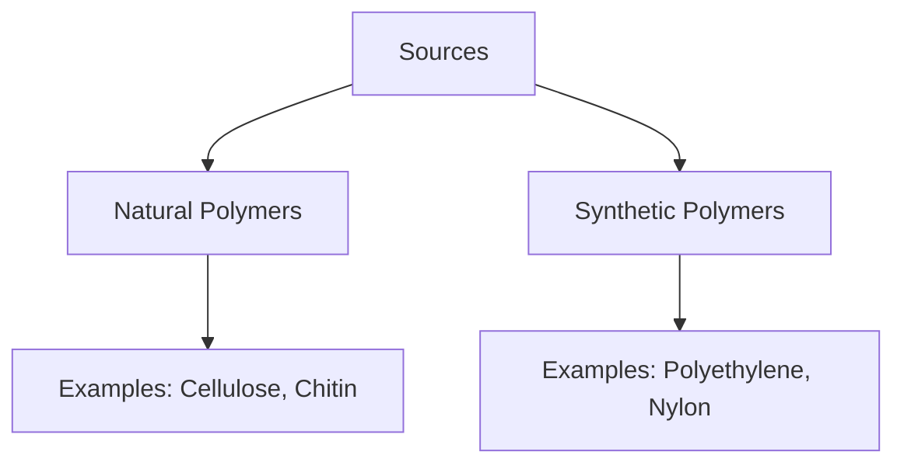
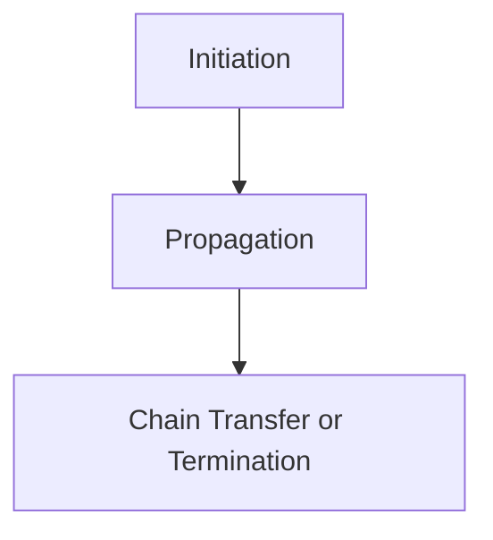
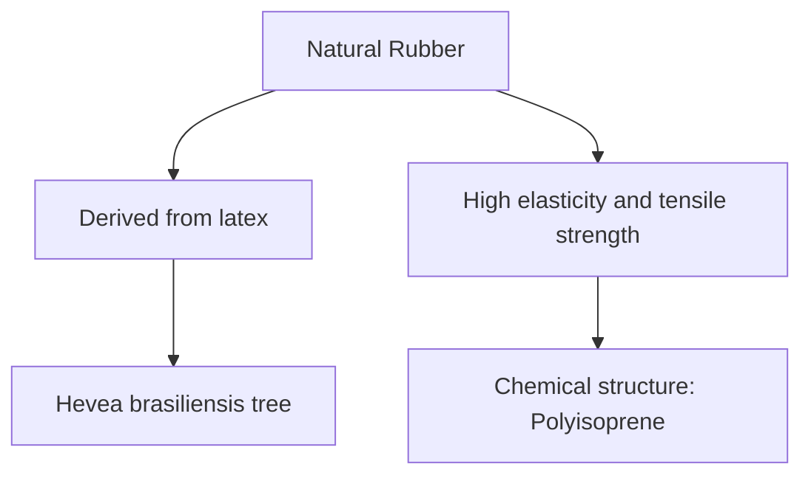
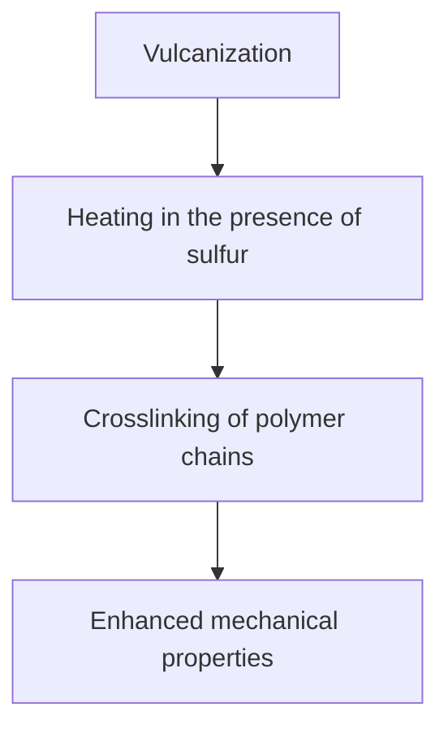
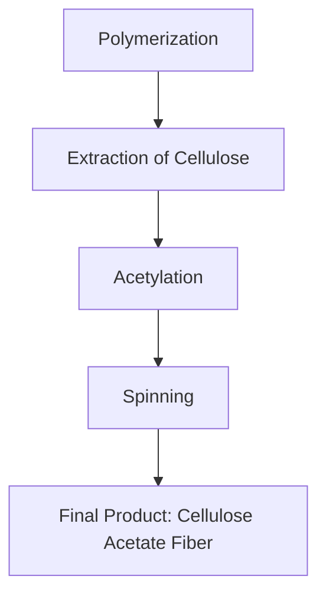

# Unit – 4: Polymers and Fibers

*(AI-generated self-study book for GTU, subject code 3110001 — generated locally with Ollama.)*

This module carries approximately **40% of the end-semester theory paper (per syllabus)**.

## Introduction

Polymers and fibers are essential materials in modern industry, contributing significantly to various sectors including textiles, construction, automotive, and electronics. **Polymers** are macromolecules composed of repeating units called monomers. **Fibers** are long, thin structures that can be made from polymers and are used to create textiles and other materials.

### Definition and Properties
- **Polymers**: Large molecules made up of many identical or similar monomer units.
- **Fibers**: Filamentous structures, typically long and thin, which can be derived from polymers.
- **Properties of Polymers and Fibers**: These materials are characterized by their flexibility, durability, and ability to be molded into various forms.

### Importance
Polymers and fibers are crucial in everyday life, from clothing and plastics to medical implants and packaging materials. Understanding the characteristics and applications of these materials is vital for engineers and scientists.

> **Example:** **Polyethylene (PE)** is a common polymer used in plastic bags and containers. It is derived from the monomer ethene (C2H4).

## Classification based on Source

Polymers can be classified based on their source as natural or synthetic. Understanding the classification helps in identifying the properties and applications of different polymers and fibers.

### Flowchart for Classification

### Detailed Classification

- **Natural Polymers**: These polymers occur in nature and are derived from biological sources.
  - **Cellulose**: Found in plant cell walls; used in rayon and cellophane.
  - **Chitin**: Found in the exoskeletons of insects and crustaceans; used in biological adhesives.

- **Synthetic Polymers**: These polymers are produced through chemical synthesis.
  - **Polyethylene (PE)**: Derived from ethene monomers; used in packaging and containers.
  - **Polyester**: Derived from ester monomers; used in clothing and carpets.

> **Example:** **Nylon** is a synthetic polymer derived from adipic acid and hexamethylene diamine. It is commonly used in clothing and ropes.

## Structure

The structure of polymers and fibers is critical in understanding their properties and behavior. Polymers can be linear, branched, or cross-linked, each affecting their physical and mechanical properties.

### Linear Polymers
- **Linear Polymers**: Consist of monomers linked in a straight chain.
  - **Example**: Polyethylene (PE) is a linear polymer.

### Branched Polymers
- **Branched Polymers**: Monomers are linked in a linear chain with side chains.
  - **Example**: Polypropylene (PP) is a branched polymer.

### Cross-Linked Polymers
- **Cross-Linked Polymers**: Monomers are linked in a three-dimensional network.
  - **Example**: Polyvinyl alcohol (PVA) can be cross-linked to form a gel-like structure.

### Structure and Properties

- **Linear Polymers**: Less resistant to deformation and can be easily stretched.
- **Branched Polymers**: More resistant to deformation due to the presence of side chains.
- **Cross-Linked Polymers**: Highly resistant to deformation and exhibit high strength and rigidity.

> **Example:** **Polyvinyl chloride (PVC)** is a cross-linked polymer used in pipes and flooring. It is highly resistant to chemicals and heat.

## Molecular Forces

Molecular forces are crucial in determining the physical and chemical properties of polymers and fibers. Understanding these forces helps in predicting and manipulating the behavior of these materials.

### Types of Molecular Forces
- **Hydrogen Bonding**: Occurs between molecules with hydrogen atoms bonded to highly electronegative atoms (N, O, F).
- **Van der Waals Forces**: Weak intermolecular forces due to temporary dipoles.
- **Ionic Bonds**: Strong electrostatic forces between ions.

### Impact on Properties

- **Hydrogen Bonding**: Increases the strength and flexibility of polymers.
  - **Example**: **Polyurethane** has strong hydrogen bonding, making it durable and flexible.
- **Van der Waals Forces**: Influence the melting point and solubility of polymers.
  - **Example**: **Polyethylene** has weak Van der Waals forces, leading to low melting points and good solubility.
- **Ionic Bonds**: Common in ionomers and affect the electrical conductivity of polymers.
  - **Example**: **Poly(acrylic acid)** is an ionic polymer used in ion-exchange resins.

> **Example:** **Polyamide (PA)** is a polymer with ionic bonds that enhance its strength and resistance to wear. It is used in engineering applications requiring high strength and durability.

### Conclusion

In summary, polymers and fibers are essential materials with diverse applications. Understanding their classification, structure, and molecular forces is crucial for their effective use and manipulation. The examples provided illustrate the practical applications and properties of various polymers and fibers.

---

## Polymerization and its mechanism

### Introduction to Polymerization
**Polymerization** is a process where monomers are linked together to form polymers. Monomers are small molecules that undergo a chemical reaction to form larger molecules called polymers. The process of polymerization can be classified into two main types: addition polymerization and condensation polymerization.

#### Addition Polymerization
In addition polymerization, monomers are added together with the elimination of a small molecule such as hydrogen, water, or carbon dioxide. The simplest example of addition polymerization is the formation of polyethylene from ethylene monomers.

> **Example:** 
> The reaction for the formation of polyethylene can be represented as:
> 
> CH₂=CH₂ + CH₂=CH₂ + + CH₂=CH₂ → (CH₂-CH₂)ₙ
>
> This is an addition polymerization reaction where ethylene monomers combine to form polyethylene.

#### Condensation Polymerization
In condensation polymerization, two monomers react with the elimination of a small molecule. This process often results in the formation of a polymer with a repeating sequence of two or more different monomers. Common small molecules eliminated in this process include water, alcohol, and acid.

> **Example:** 
> The reaction for the formation of polyester from terephthalic acid (TPA) and ethylene glycol (EG) is an example of condensation polymerization:
> 
> HOOC-C₆H₄COOH + HO-CH₂-CH₂OH → HOOC-C₆H₄COO-CH₂-CH₂-O-CH₂-CH₂-O-C₆H₄COOH + H₂O

### Mechanism of Polymerization

#### Chain Growth Mechanism
The chain growth mechanism is a common mechanism used in addition polymerization. It involves the initiation, growth, and termination steps:

- **Initiation:** A free radical or anionic species attacks the double bond of the monomer, initiating the polymer chain.
- **Growth:** The growing polymer chain attacks another monomer, forming a new double bond and adding a monomer to the chain.
- **Termination:** The polymer chain is terminated by either chain transfer or chain transfer followed by termination.

#### Initiation Steps
Initiation can occur by:
- **Thermal Initiation:** Heat energy initiates the reaction.
- **Photochemical Initiation:** Light energy initiates the reaction.
- **Redox Initiation:** A reducing agent and an oxidizing agent together initiate the reaction.

#### Growth Steps
During growth, the polymer chain reacts with another monomer. For example, in the formation of polypropylene, the growing chain reacts with propylene monomer:
> **Example:** 
> CH₃-CH=CH₂ + CH₃-CH=CH₂ + + CH₃-CH=CH₂ → (CH₃-CH-CH₂)ₙ

#### Termination Steps
Termination can occur by:
- **Chain Transfer:** The growing polymer chain transfers to a solvent or another molecule.
- **Chain Termination:** Two growing chains collide and break apart, ending the polymerization.

### Mermaid Diagram for Chain Growth Mechanism

## Definition of Rubber

**Rubber** is a type of polymer that has the ability to stretch and return to its original shape when the stress is removed. It is amorphous and elastic, meaning it can be deformed and then return to its original shape.

### Types of Rubber

Rubber can be classified into two main categories: natural rubber and synthetic rubber.

#### Natural Rubber
**Natural Rubber** is derived from latex, a milky fluid found in the sap of certain plants, primarily the **Hevea brasiliensis** tree. It is known for its high elasticity and tensile strength. 

> **Example:** 
> The chemical structure of natural rubber is a polymer of isoprene (2-methyl-1,3-butadiene), which gives it its unique properties.

#### Synthetic Rubber
**Synthetic Rubber** is produced through chemical synthesis. It is made by polymerizing monomers such as styrene, butadiene, and others. Synthetic rubber is used in various applications due to its versatility and ability to be tailored to specific requirements.

### Mermaid Diagram for Types of Rubber

## Vulcanization of Rubber

### Introduction to Vulcanization
**Vulcanization** is a process used to improve the properties of rubber by heating it in the presence of sulfur. This process crosslinks the polymer chains, enhancing the strength, elasticity, and durability of the rubber.

### Mechanism of Vulcanization
During vulcanization, the rubber undergoes a chemical reaction where sulfur atoms crosslink the polymer chains. This process increases the intermolecular forces, leading to better mechanical properties.

> **Example:** 
> The reaction for vulcanization can be represented as:
> 
> R - S - R + R' - S - R' → R - S - S - R'

### Mermaid Diagram for Vulcanization Mechanism

### Practical Application of Vulcanization
Vulcanized rubber is used in various applications such as tires, hoses, and rubber boots. For instance, the tires of cars and bicycles are made from vulcanized rubber, providing better traction and durability.

> **Example:** 
> A tire manufacturer might vulcanize rubber to ensure that the tire remains flexible and strong enough to withstand the stresses of driving on various terrains. The vulcanization process typically involves heating the rubber at high temperatures and adding sulfur to form crosslinks, enhancing the tire's performance.

---

## Application of Rubber

Rubber is a versatile material used in various applications due to its elasticity, resilience, and ability to withstand mechanical stress. This section will explore the diverse applications of rubber.

### **Uses in Automotive Industry**
Rubber is extensively used in the automotive industry for various components due to its ability to absorb shocks and vibrations. Some key applications include:
- **Tires**: Tires are the most significant use of rubber in automobiles. They provide traction, cushioning, and protection for the vehicle.
- **Belts and Hoses**: Rubber belts and hoses are used for various purposes such as engine belts, fuel lines, and coolant lines.
- **Seals and Gaskets**: Rubber seals and gaskets are used to prevent leaks and ensure the integrity of the engine and other components.

### **Uses in Construction**
Rubber is used in construction for various purposes, including:
- **Roofing and Waterproofing**: Rubber roofing membranes are used to prevent water leakage and provide durability.
- **Flooring**: Rubber flooring is used for its shock-absorbing properties and ease of maintenance.
- **Sealing**: Rubber seals are used in windows and doors to ensure a tight fit and prevent drafts.

### **Uses in Electrical and Electronic Industry**
Rubber plays a crucial role in the electrical and electronic industry due to its insulating properties:
- **Insulators**: Rubber insulators are used in electrical cables, switches, and connectors to prevent electrical shocks.
- **Cable Covers**: Rubber covers protect electrical cables from damage and provide insulation.
- **Battery Terminals**: Rubber is used in battery terminals to improve conductivity and prevent corrosion.

### **Uses in Medical and Healthcare**
Rubber is widely used in the medical and healthcare industry for its biocompatibility and non-toxic nature:
- **Gloves**: Latex gloves are used for surgical procedures and other medical tasks.
- **Tubing**: Rubber tubing is used in medical devices such as syringes, IV lines, and catheters.
- **Orthopedic Devices**: Rubber is used in orthopedic devices such as braces and prosthetics.

### **Uses in Sports and Leisure**
Rubber is used in various sports and leisure applications for its shock-absorbing properties and durability:
- **Footwear**: Rubber is used in the soles of shoes for traction and comfort.
- **Balls**: Rubber is used in balls such as tennis balls and golf balls for their bounce and grip.
- **Playground Equipment**: Rubber is used in playground equipment for its safety and durability.

> **Example:** A car tire is designed to withstand high mechanical stress and provide good traction. The tire is made of a mixture of natural and synthetic rubber, which gives it the required elasticity and durability. The tread pattern of the tire is designed to maximize traction on various road surfaces. The tire also includes rubber seals to prevent air leakage and ensure proper inflation.

## Biodegradable Polymers

Biodegradable polymers are materials that can break down naturally in the environment, reducing the amount of waste generated. These polymers are increasingly important due to environmental concerns and the need for sustainable materials.

### **Definition and Classification**
**Biodegradable Polymers**: These are polymers that can be broken down by the action of microorganisms such as bacteria and fungi. They are typically derived from renewable resources or synthesized using biodegradable monomers.

**Classification**:
- **Natural Biodegradable Polymers**: These include starch-based polymers, cellulose, and proteins.
- **Synthetic Biodegradable Polymers**: These include polylactic acid (PLA), polyhydroxyalkanoates (PHA), and polyglycolic acid (PGA).

### **Applications in Agriculture**
Biodegradable polymers are used in agriculture for:
- **Mulch Films**: Biodegradable films are used to cover soil, reducing water evaporation and weed growth.
- **Plant Pots and Containers**: Biodegradable containers are used to grow plants, providing a natural environment for the roots.

### **Applications in Packaging**
Biodegradable polymers are used in packaging to reduce waste and promote sustainability:
- **Bags and Wrappers**: Biodegradable bags and wrappers are used for packaging food and other products.
- **Labels and Adhesives**: Biodegradable adhesives and labels are used in packaging to ensure they break down naturally.

### **Applications in Medical and Healthcare**
Biodegradable polymers are used in medical and healthcare for:
- **Sutures and Tissue Adhesives**: Biodegradable sutures and tissue adhesives are used in surgeries to promote healing.
- **Drug Delivery**: Biodegradable polymers are used in drug delivery systems to control the release of medications.

### **Uses in Environmental Management**
Biodegradable polymers are used in environmental management for:
- **Soil Remediation**: Biodegradable polymers are used to stabilize soil and prevent erosion.
- **Waste Management**: Biodegradable polymers are used in landfills to reduce the amount of waste and improve decomposition.

> **Example:** A biodegradable plastic bag is designed to break down in 12 to 24 months when exposed to natural conditions. The bag is made from polyactic acid (PLA), which is derived from cornstarch. When the bag is disposed of in a landfill, microorganisms break down the PLA into water, carbon dioxide, and biomass.

## Commercially Important Polymers- PE, PP, PS, PVC, ABS, PMMA

Polyethylene (PE), polypropylene (PP), polystyrene (PS), polyvinyl chloride (PVC), acrylonitrile butadiene styrene (ABS), and polymethyl methacrylate (PMMA) are among the most important polymers used in various industries.

### **Polyethylene (PE)**
**Polyethylene (PE)** is a versatile polymer used in a wide range of applications:
- **Film and Packaging**: PE is used in plastic bags, wrap, and packaging materials.
- **Thermoplastic Applications**: PE is used in pipes, containers, and other thermoplastic applications.
- **Insulation and Coatings**: PE is used in electrical insulation and coatings due to its excellent electrical properties.

### **Polypropylene (PP)**
**Polypropylene (PP)** is another important polymer with a wide range of applications:
- **Textiles and Fibers**: PP is used in textiles, carpets, and non-woven fabrics.
- **Thermoplastic Applications**: PP is used in injection molding, extrusion, and blow molding.
- **Automotive Industry**: PP is used in automotive parts such as dashboards, bumpers, and interior trim.

### **Polystyrene (PS)**
**Polystyrene (PS)** is a rigid polymer with a variety of applications:
- **Packaging and Containers**: PS is used in foam trays, cups, and packaging materials.
- **Electrical and Electronic Equipment**: PS is used in light switch covers, computer cases, and other electronic components.
- **Signage and Advertising**: PS is used in signs, display cases, and advertising materials.

### **Polyvinyl Chloride (PVC)**
**Polyvinyl Chloride (PVC)** is a versatile polymer with a wide range of applications:
- **Construction**: PVC is used in pipes, windows, and roofing materials.
- **Furniture and Flooring**: PVC is used in furniture covers and flooring materials.
- **Textiles and Packaging**: PVC is used in textile coatings and packaging films.

### **Acrylonitrile Butadiene Styrene (ABS)**
**Acrylonitrile Butadiene Styrene (ABS)** is a strong and flexible polymer used in various applications:
- **Consumer Goods**: ABS is used in toys, household appliances, and office equipment.
- **Automotive Industry**: ABS is used in bumpers, trim, and interior parts.
- **Construction**: ABS is used in pipes and structural elements.

### **Polymethyl Methacrylate (PMMA)**
**Polymethyl Methacrylate (PMMA)**, also known as acrylic glass, is used in various applications:
- **Optics and Lighting**: PMMA is used in lenses, displays, and light fixtures.
- **Construction and Architecture**: PMMA is used in windows, skylights, and structural elements.
- **Medical and Healthcare**: PMMA is used in dental prosthetics and medical devices.

> **Example:** A polyethylene film is designed for use in food packaging. The film is made from low-density polyethylene (LDPE), which provides good barrier properties against oxygen and moisture. The film is used in snack bags, bread wraps, and other food packaging applications. The film is also designed to be recyclable, making it a sustainable choice for food packaging.

## Glyptal and Their Uses

Glyptal is a solvent used in various industries, particularly in the adhesives and coatings sector. This section will explore the uses of glyptal.

### **Definition**
**Glyptal**: Glyptal is a volatile organic compound (VOC) used as a solvent in adhesives, coatings, and cleaning agents. It is a mixture of aliphatic and aromatic ketones, making it suitable for dissolving various organic substances.

### **Uses in Adhesives**
Glyptal is widely used in adhesives due to its ability to dissolve a wide range of polymers and resins:
- **Wood Adhesives**: Glyptal is used in wood adhesives to improve the bonding strength of wood joints.
- **Leather Adhesives**: Glyptal is used in leather adhesives to provide a strong and flexible bond between leather pieces.
- **Textile Adhesives**: Glyptal is used in textile adhesives to improve the adhesion between fibers and fabrics.

### **Uses in Coatings**
Glyptal is used in coatings to improve the properties of the coating:
- **Paints**: Glyptal is used in paints to improve the flow and leveling of the coating.
- **Clear Coatings**: Glyptal is used in clear coatings to improve the gloss and durability of the finish.
- **Printing Inks**: Glyptal is used in printing inks to improve the adhesion and spreadability of the ink.

### **Uses in Cleaning Agents**
Glyptal is used in cleaning agents to improve the solvency and effectiveness of the cleaner:
- **Solvent-Based Cleaners**: Glyptal is used in solvent-based cleaners to dissolve dirt and grime effectively.
- **Degreasers**: Glyptal is used in degreasers to remove oils and greases from surfaces.
- **Surface Treatments**: Glyptal is used in surface treatments to improve the adhesion of coatings and adhesives.

### **Uses in Medical and Healthcare**
Glyptal is used in medical and healthcare for its solvency properties:
- **Sterilization**: Glyptal is used in sterilization processes to dissolve organic matter and improve the effectiveness of the sterilization.
- **Drug Delivery**: Glyptal is used in drug delivery systems to improve the solubility and stability of the drug.

### **Uses in Electrical and Electronic Industry**
Glyptal is used in the electrical and electronic industry for its insulating properties:
- **Cleaning of Components**: Glyptal is used to clean electrical and electronic components to remove dirt and improve their performance.
- **Insulation**: Glyptal is used in insulation to improve the electrical properties of the component.

> **Example:** A wood adhesive is designed for use in furniture manufacturing. The adhesive is made from a mixture of glyptal and other organic solvents. The glyptal provides the necessary solvency to dissolve the resins and polymers, ensuring a strong and flexible bond between the wood pieces. The adhesive is also designed to be environmentally friendly, with low VOC emissions and good biodegradability.

---

## Types of fibers – Natural

### Introduction to Natural Fibers
Natural fibers are those that are derived from plants, animals, or minerals. These fibers have been used for centuries in various applications due to their natural properties and renewability. **Natural fibers** can be broadly classified into two categories: **plant fibers** and **animal fibers**.

### Plant Fibers
Plant fibers are obtained from the woody parts of plants or from the seed pod. They are generally strong and durable.

- **Cotton**: One of the most common natural fibers, **cotton** is obtained from the cotton plant (Gossypium hirsutum). It is soft, breathable, and highly absorbent. Cotton fibers are typically 2 to 5 cm long.
- **Hemp**: **Hemp** is derived from the cannabis plant (Cannabis sativa). It is strong, durable, and has a high tensile strength. Hemp fibers are commonly used in textiles and ropes.
- **Jute**: **Jute** is a fiber obtained from the jute plant (Corchorus spp.). It is inexpensive, strong, and used in carpets, bags, and packaging materials.
- **Flax**: **Flax** is derived from the flax plant (Linum usitatissimum). It is known for its durability and luster. Flax fibers are used in clothing, linens, and paper manufacturing.

### Animal Fibers
Animal fibers are obtained from the skin, hair, or feathers of animals. They are soft, warm, and have good insulating properties.

- **Wool**: **Wool** is obtained from the fleece of sheep (Ovis aries). It is highly elastic, water-resistant, and insulating. Wool fibers are commonly used in clothing and carpets.
- **Silk**: **Silk** is obtained from the cocoons of silkworms (Bombyx mori). It is strong, lustrous, and has a high tensile strength. Silk is used in high-end clothing and textiles.
- **Cashmere**: **Cashmere** is obtained from the undercoat of cashmere goats (Capra hircus). It is extremely soft, warm, and fine. Cashmere is used in luxury clothing and accessories.

### Example:
> **Example:** List the main characteristics of cotton and wool fibers.
>
> **Answer:**
> - **Cotton**: Soft, breathable, highly absorbent, 2 to 5 cm long.
> - **Wool**: Highly elastic, water-resistant, insulating, commonly used in clothing and carpets.

## Semi Synthetic

### Introduction to Semi-Synthetic Fibers
Semi-synthetic fibers are produced by chemical modification of natural polymers. These fibers combine the desirable properties of both natural and synthetic fibers, offering a balance between natural and synthetic characteristics.

### Process of Semi-Synthesis
The process of producing semi-synthetic fibers involves the following steps:
- **Extraction**: Natural polymers such as cellulose from wood pulp or cotton linters are extracted.
- **Modification**: The extracted polymers are chemically treated to improve their physical properties.
- **Spinning**: The modified polymers are spun into fibers.

### Common Semi-Synthetic Fibers
- **Rayon**: **Rayon** is a semi-synthetic fiber made from cellulose. It is soft, smooth, and has good drapability. Rayon is used in clothing, drapes, and home furnishings.
- **Viscose**: **Viscose** is a type of rayon that is produced by treating cellulose with a sodium hydroxide and sulfuric acid solution. It is used in clothing and home furnishings.
- **Lyocell**: **Lyocell** is a type of rayon produced using a solvent-based process. It is stronger and more durable than traditional rayon. Lyocell is used in clothing and textiles.

### Example:
> **Example:** Explain the process of producing rayon and list its main uses.
>
> **Answer:**
> - **Process**: Rayon is produced by treating cellulose with a sodium hydroxide and sulfuric acid solution to form a viscous liquid called xanthated cellulose. This liquid is then spun into fibers.
> - **Uses**: Rayon is used in clothing, drapes, and home furnishings due to its soft, smooth, and drapable properties.

## Synthetic Fibers

### Introduction to Synthetic Fibers
Synthetic fibers are man-made fibers produced by chemical processes. They are characterized by their uniformity and consistency, making them suitable for a wide range of applications.

### Common Synthetic Fibers
- **Polyester**: **Polyester** is a synthetic fiber derived from the polymer polyethylene terephthalate (PET). It is strong, durable, and wrinkle-resistant. Polyester is used in clothing, carpets, and packaging materials.
- **Nylon**: **Nylon** is a synthetic fiber derived from the polymer polyamide. It is strong, elastic, and abrasion-resistant. Nylon is used in clothing, carpets, and industrial applications.
- **Acrylic**: **Acrylic** is a synthetic fiber derived from acrylonitrile. It is soft, warm, and has good moisture management properties. Acrylic is used in clothing and home furnishings.
- **Polypropylene**: **Polypropylene** is a synthetic fiber derived from the polymer polypropylene. It is lightweight, strong, and has good chemical resistance. Polypropylene is used in carpets, ropes, and packaging materials.

### Example:
> **Example:** Compare the properties of polyester and nylon.
>
> **Answer:**
> - **Polyester**: Strong, durable, wrinkle-resistant, used in clothing and packaging.
> - **Nylon**: Strong, elastic, abrasion-resistant, used in clothing and industrial applications.

## Physical Properties of Fibers and Uses of Cellulose Acetate

### Introduction to Cellulose Acetate
Cellulose acetate is a synthetic fiber made from cellulose. It is derived by acetylating cellulose, which imparts it with unique physical properties and enhanced stability. **Cellulose acetate** is known for its high strength, excellent flexibility, and good chemical resistance.

### Physical Properties of Cellulose Acetate
- **Strength**: Cellulose acetate has a tensile strength of around 1.5 to 2.0 g/denier.
- **Flexibility**: It is highly flexible and can be easily bent without breaking.
- **Chemical Resistance**: It has good resistance to acids, alkalis, and most organic solvents.
- **Thermal Stability**: It has a melting point of around 210°C to 220°C.

### Uses of Cellulose Acetate
Cellulose acetate is widely used in various applications due to its unique properties. Some of the main uses include:

- **Cigarette Filters**: Cigarette filters are made from cellulose acetate due to its flexibility and ability to hold shape.
- **Film and Optical Media**: Cellulose acetate is used in the production of photographic film and optical media such as CDs and DVDs.
- **Clothing and Textiles**: It is used in the production of clothing and textiles due to its strength and flexibility.
- **Medical Applications**: Cellulose acetate is used in medical devices and implants due to its biocompatibility and chemical resistance.

### Example:
> **Example:** Calculate the tensile strength of a cellulose acetate fiber with a denier of 2.5 and a modulus of 2.0 g/denier.
>
> **Answer:**
> - Given: Denier = 2.5, Modulus = 2.0 g/denier
> - Tensile Strength = Denier × Modulus = 2.5 × 2.0 = 5.0 g

This flowchart illustrates the process of producing cellulose acetate fiber from cellulose to its final product.

---

## Viscose Rayon

### Definition and Introduction
**Viscose rayon** is a semi-synthetic fiber derived from natural cellulose. It is a type of rayon, which is produced by chemically modifying cellulose from natural sources such as wood pulp, bamboo, or cotton linters. Viscose rayon is known for its softness, comfort, and breathability, making it a popular material in clothing and textile applications.

### Production Process
The production of viscose rayon involves several steps, including:
- **Cellulose preparation**: The cellulose source is dissolved in a solution to form a viscous liquid called viscose.
- **Spinning**: The viscose is extruded through fine spinnerets to form filaments.
- **Casting**: The filaments are then drawn and stretched to improve their mechanical properties.
- **Post-treatment**: The fibers are treated with chemicals to improve their appearance and durability.

### Properties and Applications
- **Softness and Comfort**: Viscose rayon is known for its natural feel, which makes it suitable for garments that need to be soft against the skin.
- **Moisture Management**: It has good moisture absorption and release properties, making it suitable for use in undergarments and activewear.
- **Durability**: While it is durable, it is prone to shrinking and pilling if not properly cared for.
- **Applications**: Viscose rayon is used in a variety of textile applications, including clothing, home furnishings, and industrial fabrics.

### Example
> **Example:** 
A student is asked to explain the production process of viscose rayon and its applications. The student should describe the steps of the process and mention the main applications of the fiber.

## Nylon

### Definition and Introduction
**Nylon** is a synthetic fiber, one of the earliest produced by man. It is a semi-crystalline thermoplastic polymer, meaning it can be repeatedly melted and reshaped without degrading. Nylon is known for its strength, elasticity, and wear resistance, making it widely used in various applications such as clothing, carpeting, and industrial products.

### Production Process
The production of nylon involves:
- **Monomer Preparation**: Nylon is synthesized from dicarboxylic acids and diamines.
- **Polymerization**: The monomers are heated and reacted under pressure to form nylon polymer.
- **Spinning**: The polymer is dissolved in a solvent and extruded through spinnerets to form fibers.
- **Post-treatment**: The fibers are treated to improve their physical properties.

### Properties and Applications
- **Strength and Elasticity**: Nylon fibers are strong and elastic, making them suitable for applications that require durability and flexibility.
- **Wear Resistance**: It resists abrasion and has excellent abrasion resistance.
- **Moisture Resistance**: Nylon is hydrophobic, meaning it repels water.
- **Applications**: Nylon is used in a variety of applications, including clothing (socks, hosiery), carpets, and industrial products like ropes and cables.

### Example
> **Example:** 
A student is asked to explain the production process of nylon and its applications. The student should describe the steps of the process and mention the main applications of the fiber.

## Polyesters Acrylic

### Definition and Introduction
**Polyesters and acrylics** are synthetic fibers derived from petrochemicals. Polyesters are made from terephthalic acid and ethylene glycol, while acrylics are derived from acrylonitrile. Both fibers are known for their strength, durability, and ease of care, making them popular in various applications such as clothing and upholstery.

### Production Process
The production of polyesters and acrylics involves:
- **Monomer Preparation**: The monomers are synthesized from petrochemicals.
- **Polymerization**: The monomers are heated and reacted to form the polymer.
- **Spinning**: The polymer is dissolved in a solvent and extruded through spinnerets to form fibers.
- **Post-treatment**: The fibers are treated to improve their physical properties.

### Properties and Applications
- **Strength and Durability**: Both polyester and acrylic fibers are strong and durable, making them suitable for long-term use.
- **Ease of Care**: They are easy to clean and maintain, requiring minimal care.
- **Moisture Resistance**: Polyester and acrylic fibers are hydrophobic, meaning they repel water.
- **Applications**: Polyester and acrylic fibers are used in clothing, carpets, and upholstery.

### Example
> **Example:** 
A student is asked to explain the production process of polyesters and acrylics and their applications. The student should describe the steps of the process and mention the main applications of the fibers.

## Glass Fibers and Liquid Crystals

### Glass Fibers

#### Definition and Introduction
**Glass fibers** are fibers made from silica (SiO2) or other glassy materials. They are known for their high strength, low thermal expansion, and excellent electrical insulation properties. Glass fibers are used in a variety of applications, including reinforcement in composites, insulation, and in the construction industry.

#### Production Process
The production of glass fibers involves:
- **Glass Formation**: Raw materials such as silica sand, soda ash, and limestone are heated to form a glass melt.
- **Drawing**: The glass melt is drawn through fine nozzles to form continuous fibers.
- **Cooling and Coating**: The fibers are cooled and coated with a sizing agent to improve their handling properties.

#### Properties and Applications
- **Strength**: Glass fibers have high tensile strength, making them ideal for reinforcement.
- **Thermal Stability**: They have low thermal expansion and are resistant to high temperatures.
- **Electrical Insulation**: Glass fibers are good electrical insulators, making them suitable for use in electrical applications.
- **Applications**: Glass fibers are used in composites, insulation, and construction.

### Liquid Crystals

#### Definition and Introduction
**Liquid crystals** are substances that have properties between those of conventional liquids and those of solid crystals. They can flow like a liquid but can also align themselves in an ordered way, like a solid crystal. Liquid crystals are used in various display technologies and have applications in electronic devices.

#### Production Process
The production of liquid crystals involves:
- **Synthesis**: Liquid crystals are synthesized from organic compounds.
- **Alignment**: The liquid crystals are aligned on a substrate to form a specific orientation.
- **Application**: The aligned liquid crystals are used in display technologies.

#### Properties and Applications
- **Anisotropy**: Liquid crystals have anisotropic properties, meaning their optical and electrical properties vary with direction.
- **Refractive Index**: They have a variable refractive index, which can be used to control light transmission.
- **Applications**: Liquid crystals are used in display technologies such as LCDs, and in sensors and actuators.

### Example
> **Example:** 
A student is asked to explain the production process of glass fibers and liquid crystals and their applications. The student should describe the steps of the process and mention the main applications of each material.
