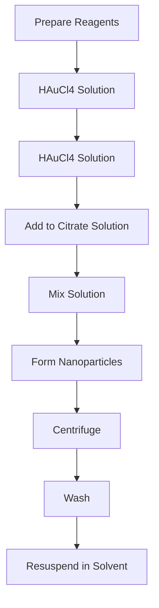
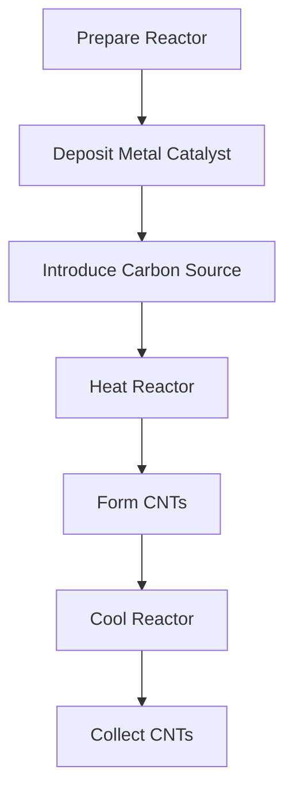
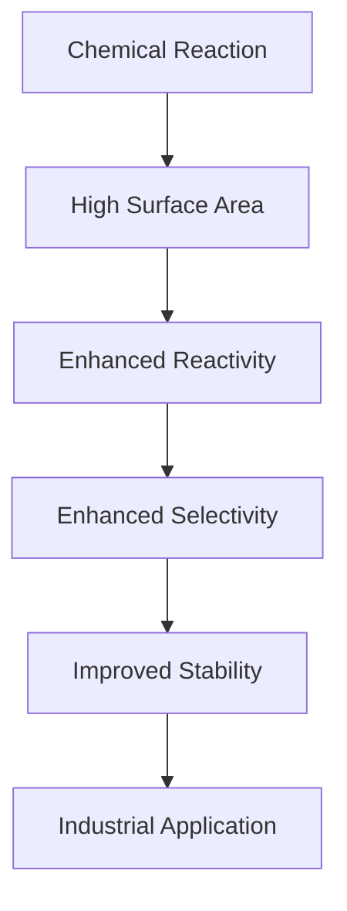
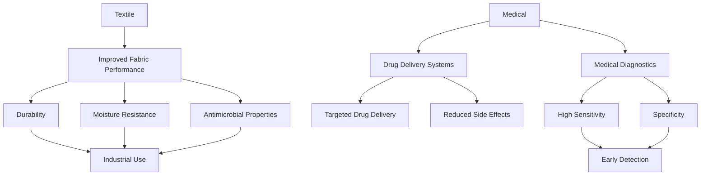

# Unit – 5: Nano material

*(AI-generated self-study book for GTU, subject code 3110001 — generated locally with Ollama.)*

This module carries approximately ****.

## Introduction

**Nano material:** Nano materials or nanostructured materials are materials with at least one dimension in the nanometer (nm) range, typically between 1 and 100 nm. These materials exhibit unique properties due to their small size, such as enhanced strength, improved thermal stability, and increased surface area, which can be exploited in various applications.

**Properties of Nano Materials:**
- **Enhanced Surface Area:** The high surface area to volume ratio increases the reactivity and catalytic activity of nano materials.
- **Quantum Size Effects:** Due to the small size, quantum effects become significant, affecting the optical, electrical, and magnetic properties of the material.
- **Morphological Effects:** The shape and size of nano particles can be precisely controlled, leading to tailored properties.
- **Size-Dependent Properties:** The properties of nano materials can vary significantly with size, which can be exploited in various applications.

**Applications:**
- **Electronics:** Nano materials like carbon nanotubes and graphene are used in high-performance electronics and flexible devices.
- **Biotechnology:** Nano materials can be used in drug delivery systems and medical imaging.
- **Energy:** Nano materials are used in solar cells, batteries, and fuel cells to enhance efficiency.
- **Construction:** Nano materials improve the strength and durability of construction materials.

**Advantages:**
- **Improved Performance:** Enhanced mechanical, thermal, and chemical properties.
- **Sustainability:** Potential for reducing waste and improving resource utilization.
- **Innovative Solutions:** New applications in various fields like medicine, energy, and environmental technology.

### Example:
> **Example:** Consider a nano material with a particle size of 50 nm. If the surface area of a single particle is A m² and the density is  g/cm³, calculate the total surface area of 1000 such particles.  
- **Solution:**  
  - Surface area of a single particle: A m²  
  - Number of particles: 1000  
  - Total surface area: 1000 × A m² = 1000A m²  
  - This calculation demonstrates the significant increase in surface area due to the small size of nano particles.

## Sources

**Synthesis of Nano Materials:**
- **Chemical Methods:** These involve the use of chemical reactions to form nano particles, such as sol-gel, hydrothermal, and precipitation methods.
- **Physical Methods:** These include techniques like mechanical milling, laser ablation, and electron beam evaporation, where physical forces are used to create nano particles.
- **Biological Methods:** Utilizing biological systems and enzymes for the synthesis of nano materials, often leading to more eco-friendly processes.

**Characterization Techniques:**
- **Scanning Electron Microscopy (SEM):** SEM provides high-resolution images of the surface morphology of nano materials.
- **Transmission Electron Microscopy (TEM):** TEM offers detailed cross-sectional and surface images with atomic resolution.
- **X-ray Diffraction (XRD):** XRD is used to determine the crystal structure and phase of the nano materials.
- **Dynamic Light Scattering (DLS):** DLS measures the size and size distribution of nano particles in solution.

### Example:
> **Example:** A researcher needs to determine the size and size distribution of a synthesized nano material using DLS. The researcher measures the intensity of scattered light at different angles and finds that the intensity peaks at a certain angle.  
- **Solution:**  
  - The peak angle in the intensity distribution corresponds to the hydrodynamic radius of the nano particles. By using the known refractive index of the dispersant and the angle, the researcher can calculate the size of the nano particles using the equation:  
  [ R_h = \frac{1}{2} \left( \frac{\lambda}{1.22 \cdot \sin(\theta/2)} \right) ]  
  where λ is the wavelength of the light and θ is the angle of the peak.  
  - This example illustrates how DLS can be used to measure the size of nano particles.

---

## Properties and application of fullerenes

### Introduction to Fullerenes
**Fullerenes** are a class of carbon allotropes, characterized by closed, hollow structures. The most well-known fullerene is **C60**, which has a structure resembling a soccer ball (buckminsterfullerene). The general structure of fullerenes can be represented as Cn, where n is an even number.

### Structural Properties
- **Symmetry and Geometry**: Fullerenes have a high degree of symmetry. The C60 fullerene, for instance, has an icosahedral symmetry.
- **Size**: The size of fullerenes is typically between 0.3 and 20 nm.
- **Bonding**: Fullerenes exhibit a combination of single and double bonds, leading to a variety of bonding arrangements.

### Chemical Properties
- **Reactivity**: Fullerenes can be reactive, especially when exposed to oxygen. They can also undergo reactions with other molecules due to their reactive surface.
- **Stability**: Due to the delocalized π-electrons, fullerenes are relatively stable.
- **Solubility**: Fullerenes are soluble in organic solvents but not in water.

### Physical Properties
- **Electrical Conductivity**: Fullerenes can exhibit both metallic and semiconducting properties, depending on their structure and doping.
- **Magnetic Properties**: Some fullerenes, such as **C82** and **C70**, exhibit magnetic behavior.

### Applications of Fullerenes
- **Electronics**: Fullerenes are used in organic solar cells and organic field-effect transistors (OFETs).
- **Medicine**: They have potential as drug delivery systems due to their ability to encapsulate and transport molecules.
- **Materials Science**: Fullerenes can be used to strengthen materials and enhance their mechanical properties.
- **Optoelectronics**: Their ability to emit light makes them useful in display technologies.

> **Example:** 
> **Application in Solar Cells:**
> Fullerenes are used as electron acceptors in organic solar cells. In a typical organic solar cell, the fullerene derivative, **C60**, acts as the electron acceptor. The fullerene layer helps in the efficient extraction of electrons from the active layer, thereby improving the overall efficiency of the solar cell.

## Fullerols

### Introduction to Fullerols
**Fullerols** are a class of compounds that are derived from fullerenes. They are formed by opening the fullerene cage and adding hydroxyl (-OH) groups, resulting in a linear chain structure.

### Structural Properties
- **Formation**: Fullerols are formed by hydroxylating the surface of fullerenes.
- **Size**: Fullerols are generally larger than fullerenes, with molecular weights ranging from 1000 to 5000 Da.
- **Hydrophilicity**: Due to the presence of hydroxyl groups, fullerols are more hydrophilic than fullerenes.

### Chemical Properties
- **Reactivity**: Fullerols are more reactive than fullerenes due to the presence of hydroxyl groups.
- **Stability**: They are less stable than fullerenes due to the breakage of the carbon cage structure.

### Physical Properties
- **Solubility**: Fullerols are highly soluble in water and organic solvents.
- **Spectroscopic Properties**: Fullerols exhibit specific absorption and emission spectra, making them useful in spectroscopic studies.

### Applications of Fullerols
- **Biomedical Applications**: Fullerols can be used as antioxidants and as drug carriers due to their hydrophilicity and reactivity.
- **Environmental Applications**: They can be used in water treatment processes due to their ability to adsorb pollutants.
- **Optoelectronic Applications**: Fullerols can be used in organic light-emitting diodes (OLEDs) and other optoelectronic devices.

> **Example:** 
> **Application in Drug Delivery:**
> Fullerols can be used as carriers for drug molecules. Due to their hydrophilic nature, they can encapsulate and transport hydrophobic drugs. For instance, a fullerol derivative can be used to deliver a hydrophobic anti-cancer drug to cancer cells, enhancing the drug's effectiveness while minimizing side effects.

In summary, fullerenes and fullerols have a wide range of applications due to their unique properties, making them important in various fields such as electronics, medicine, and materials science. Understanding these properties and applications is crucial for students to grasp the importance of these novel carbon allotropes in modern technology.

---

## Metal based nanoparticles

### Definition and Properties
**Metal based nanoparticles** are tiny particles of metals with at least one dimension less than 100 nm. These nanoparticles have unique properties due to their small size and high surface area to volume ratio. They exhibit enhanced chemical, physical, and biological properties compared to their bulk counterparts.

- **High Surface Area to Volume Ratio**: This ratio increases the reactivity of the nanoparticles, making them more effective in catalytic reactions.
- **Quantum Size Effects**: These effects can alter the optical, magnetic, and electronic properties of the nanoparticles.
- **Shape Anisotropy**: Different shapes can influence the optical and electronic properties of the nanoparticles.

### Types of Metal Based Nanoparticles
1. **Gold Nanoparticles (AuNP)**:
   - **Preparation**: Commonly synthesized using reducing agents like sodium borohydride.
   - **Properties**: Good biocompatibility and stability.
   - **Applications**: Anticancer drug delivery, biosensing, and catalysis.

2. **Silver Nanoparticles (AgNP)**:
   - **Preparation**: Often synthesized using citrate reduction method.
   - **Properties**: Antibacterial and antifungal properties.
   - **Applications**: Food packaging, antimicrobial coatings, and biomedical applications.

3. **Iron Nanoparticles (FeNP)**:
   - **Preparation**: Synthesized by reduction of iron salts using reducing agents.
   - **Properties**: Strong magnetic properties.
   - **Applications**: Magnetic resonance imaging (MRI) contrast agents, magnetic separation, and hydrogen storage.

4. **Copper Nanoparticles (CuNP)**:
   - **Preparation**: Synthesized using methods like sonochemical reduction.
   - **Properties**: High catalytic activity.
   - **Applications**: Catalysis, sensors, and water purification.

### Example
> **Example:** 
> Synthesize gold nanoparticles using the citrate reduction method.
>
> **Materials Needed:**
> - Gold (III) chloride (HAuCl4)
> - Sodium citrate dihydrate (Na3C6H5O7·2H2O)
> - Distilled water
>
> **Procedure:**
> 1. Prepare a 1 mM solution of HAuCl4 in distilled water.
> 2. In a separate beaker, prepare a 0.1 mM solution of sodium citrate dihydrate in distilled water.
> 3. Gradually add the HAuCl4 solution to the sodium citrate solution while stirring continuously.
> 4. The reaction will proceed and a reddish-brown color will appear, indicating the formation of gold nanoparticles.
> 5. Centrifuge the solution to isolate the nanoparticles.
> 6. Wash the nanoparticles with distilled water and resuspend in ethanol or another suitable solvent.

### Flowchart of Metal Nanoparticle Synthesis

## Carbon nanotubes and nanowires

### Introduction
**Carbon nanotubes (CNTs)** and **carbon nanowires (CNWs)** are one-dimensional nanostructures composed of carbon atoms arranged in a cylindrical or wire-like structure. They are highly sought after due to their unique mechanical, electrical, and thermal properties.

- **Structure**: CNTs and CNWs are formed by rolling a single or multiple layers of graphene sheets into a cylindrical shape.
- **Types**: Single-walled carbon nanotubes (SWCNTs) and multi-walled carbon nanotubes (MWCNTs).

### Properties
1. **Mechanical Properties**:
   - **Strength**: SWCNTs are the strongest and stiffest fibers known, with a tensile strength of over 100 GPa.
   - **Flexibility**: Due to their cylindrical shape, they can bend without breaking.

2. **Electrical Properties**:
   - **Conductivity**: Can act as either metallic or semiconducting depending on the chirality.
   - **High Electrical Conductivity**: Metallic SWCNTs can have conductivities comparable to metals.

3. **Thermal Properties**:
   - **High Thermal Conductivity**: Can conduct heat as efficiently as diamond.

### Applications
1. **Electronics**: Used in making transistors, sensors, and flexible electronics.
2. **Materials Science**: Used in composites for enhancing strength and stiffness.
3. **Biotechnology**: Used in drug delivery and biosensors.

### Example
> **Example:** 
> Fabricate multi-walled carbon nanotubes (MWCNTs) using chemical vapor deposition (CVD).
>
> **Materials Needed:**
> - Carbon source (e.g., ethanol)
> - Metal catalyst (e.g., Ni, Fe)
> - Quartz or metal tube as a reactor
>
> **Procedure:**
> 1. Prepare a quartz or metal tube as a reactor.
> 2. Deposit a thin layer of metal catalyst (e.g., Fe or Ni) on the inner surface of the tube.
> 3. Introduce the carbon source (e.g., ethanol) into the reactor.
> 4. Heat the reactor to a high temperature (e.g., 700°C to 1000°C) under a flow of hydrogen.
> 5. The carbon source decomposes, and the carbon atoms nucleate and grow on the metal catalyst to form MWCNTs.
> 6. Cool the reactor and collect the MWCNTs.

### Flowchart of CNT Fabrication

These sections provide a detailed overview of metal based nanoparticles and carbon nanotubes and nanowires, including their preparation methods and applications, along with worked examples.

---

## Synthesis: Top down and Bottom up approaches

**Top down approach:** This method involves starting with larger structures and removing material to achieve the desired nanoscale structures. Common techniques include etching, lithography, and chemical vapor deposition (CVD).

- **Etching:** A process where selective removal of material is achieved using chemicals or plasma. For example, in photolithography, a pattern is first created on a photoresist layer, which is then used to etch the underlying material.
- **Lithography:** A technique that uses a template to transfer a pattern onto a surface. This is widely used in the fabrication of semiconductor devices. An example is electron beam lithography, where a focused beam of electrons is used to pattern the surface.

**Bottom up approach:** This method starts with individual atoms or molecules and builds up to larger structures. Techniques include self-assembly, chemical vapor deposition, and molecular beam epitaxy (MBE).

- **Self-assembly:** A process where molecules or nanoparticles spontaneously organize themselves into a desired structure. This is seen in the formation of lipid bilayers in biological systems.
- **MBE:** A technique where atoms or molecules are deposited one layer at a time, allowing precise control over the growth of thin films. It is often used in the fabrication of semiconductor devices.

### Example
> **Example:** 
A researcher is using a bottom-up approach to synthesize a quantum dot. The process starts by evaporating a semiconductor material in a vacuum chamber. The material condenses on a substrate, forming a single layer. This process is repeated multiple times to build up the desired thickness of the quantum dot. The researcher uses MBE to control the precise number of layers and their composition.

## Nanoelectronics

Nanoelectronics refers to the application of nanotechnology in the design and manufacture of electronic devices. It involves the use of nanoscale materials and structures to enhance the performance and functionality of electronic devices.

- **Advantages:** Nanoelectronics can significantly improve the performance of electronic devices by reducing size, increasing speed, and reducing power consumption.
- **Applications:** Nanoelectronics are used in a wide range of devices, including transistors, sensors, and memory devices.

### Example
> **Example:** 
In nanoelectronics, the use of graphene in transistors is a significant advancement. Graphene, a single layer of carbon atoms arranged in a hexagonal lattice, has exceptional electrical conductivity and high thermal conductivity. By using graphene in transistors, the on-off switching capability can be improved, leading to faster and more efficient electronic devices.

### Mermaid Diagram

This diagram illustrates the different synthesis techniques used in nanotechnology, showing the key methods in both top down and bottom up approaches.

---

## Applications of nanomaterial in catalysis

Nanomaterials have revolutionized the field of catalysis due to their unique physical and chemical properties. These materials are widely used in various industrial processes, including petrochemicals, pharmaceuticals, and environmental remediation. The key advantages of using nanomaterials in catalysis include high surface area, increased reactivity, enhanced selectivity, and improved stability.

### **1. High Surface Area and Reactivity**

Nanomaterials, such as nanocatalysts, have a large surface area compared to their volume, which enhances the interaction between reactants and catalysts. This high reactivity is crucial for catalytic reactions, making nanomaterials highly effective in facilitating chemical transformations.

> **Example:** Palladium nanoparticles are used as catalysts in the hydrogenation of alkenes. Due to their high surface area, they provide numerous active sites for the hydrogen atoms to bind, leading to efficient and selective hydrogenation of alkenes.

### **2. Enhanced Selectivity**

The selectivity of a catalyst is its ability to promote a desired reaction over others. Nanomaterials can be designed to have specific active sites that favor certain reactions, thus improving the selectivity of the catalyst. This is particularly useful in complex industrial processes where multiple reactions can occur.

> **Example:** In the oxidation of methanol to formaldehyde, gold nanoparticles are used as catalysts. The specific surface chemistry of gold nanoparticles ensures that the reaction proceeds selectively to formaldehyde, reducing the formation of undesired by-products like carbon monoxide.

### **3. Improved Stability**

Nanomaterials are often more stable than their bulk counterparts due to their surface properties. This stability is crucial in long-term industrial applications where the catalyst needs to remain active over extended periods.

> **Example:** Ruthenium nanoparticles are used in the selective oxidation of ethylene to ethylene oxide. Their stability allows them to maintain their catalytic activity even after prolonged use, making them suitable for continuous industrial processes.

### Flowchart of Catalytic Processes Using Nanomaterials

## Textile and Medicine

Nanomaterials are increasingly used in the textile and medical industries due to their unique properties. These applications include improved fabric performance, drug delivery systems, and medical diagnostics.

### **1. Improved Fabric Performance**

Nanomaterials can be used to enhance the properties of textiles, such as durability, moisture resistance, and antimicrobial properties.

> **Example:** Silver nanoparticles are often used in clothing to impart antimicrobial properties. The nanoparticles release silver ions, which can inhibit bacterial growth, making the fabric more hygienic.

### **2. Drug Delivery Systems**

Nanomaterials can be designed to act as carriers for drugs, improving their delivery and efficacy. This is particularly useful for targeted drug delivery, where the drug is released only in the presence of specific conditions or at specific locations.

> **Example:** Liposomes are nanocarriers used for drug delivery. They are lipids vesicles that can encapsulate drugs and release them in a controlled manner. For instance, doxorubicin, a chemotherapy drug, can be encapsulated in liposomes to target cancer cells specifically, reducing side effects.

### **3. Medical Diagnostics**

Nanomaterials can be used in diagnostic tools to detect biomolecules, such as DNA or proteins, with high sensitivity and specificity.

> **Example:** Quantum dots are semiconductor nanocrystals used in biomedical imaging. They emit light when excited, which can be detected to visualize the location of specific biomolecules in tissues. This is particularly useful in cancer diagnostics where early detection can significantly improve treatment outcomes.

### Flowchart of Nanomaterial Applications in Textiles and Medicine

These sections provide a comprehensive overview of the applications of nanomaterials in catalysis, textiles, and medicine, along with relevant worked examples to aid understanding.
