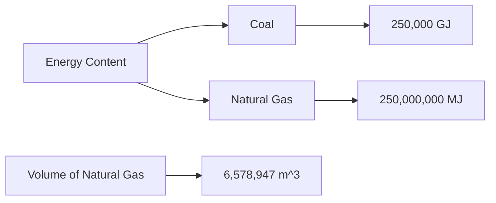
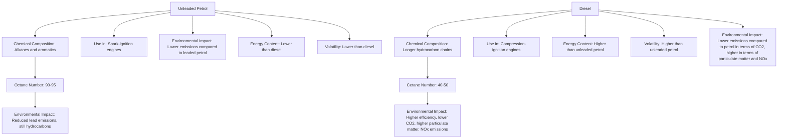

# Unit – 6: Fuel and Combustion

*(AI-generated self-study book for GTU, subject code 3110001 — generated locally with Ollama.)*

This module carries approximately ****.


## Definition

**Definition:** A fuel is any material that can be made to undergo a chemical reaction with an oxidant, releasing heat and sometimes light in the process. This process is called combustion. Fuels are classified into different types based on their chemical composition, physical state, and the ease with which they can be ignited and burned.

### Classification of Fuels

- **Solid Fuels:** These include materials like coal, wood, and charcoal. They are characterized by their solid form and are typically used in domestic and industrial heating applications. For example, coal is one of the most widely used solid fuels due to its high energy content and availability.

- **Liquid Fuels:** These are typically hydrocarbons derived from petroleum, such as diesel, gasoline, and kerosene. They are easily transported and can be used in engines and heaters. For instance, diesel is used in heavy machinery and automobiles, while kerosene is commonly used in lamps and space heaters.

- **Gaseous Fuels:** These are gases that can be used as fuels, such as natural gas, liquefied petroleum gas (LPG), and biogas. Gaseous fuels are often more convenient to handle and are widely used in urban areas for cooking and heating. For example, natural gas is a mixture of hydrocarbons and is commonly used in residential areas.

### Applications of Fuels

- **Solid Fuels:** Coal is used in power plants for generating electricity. It is also used in metallurgical processes to smelt metals. Charcoal is used in grills and barbecues for cooking.

- **Liquid Fuels:** Diesel is used in diesel engines of heavy vehicles, trucks, and buses. Gasoline is used in spark-ignition engines of automobiles. Kerosene is used in portable stoves and lamps.

- **Gaseous Fuels:** Natural gas is used in urban areas for domestic heating and cooking. LPG is used in portable stoves and water heaters. Biogas, derived from organic waste, is used for cooking and generating electricity in rural areas.

### Example

> **Example:** A small town has decided to switch from using coal to using natural gas as its main fuel for domestic heating. The town currently uses 200 tons of coal per month. Given that 1 ton of coal has an energy content of approximately 25 GJ (gigajoules), calculate the energy content of the coal used per month and compare it to the energy content of an equivalent amount of natural gas (assuming natural gas has an energy content of 38 MJ per cubic meter).

1. **Calculation for Coal:**
   [
   \text{Energy content of 200 tons of coal} = 200 \times 25 \text{ GJ} = 5000 \text{ GJ}
   ]

2. **Calculation for Natural Gas:**
   - Convert the energy content from GJ to MJ (since 1 GJ = 1000 MJ):
     [
     5000 \text{ GJ} = 5000 \times 1000 \text{ MJ} = 5,000,000 \text{ MJ}
     ]
   - Determine the volume of natural gas required:
     [
     \text{Volume of natural gas} = \frac{5,000,000 \text{ MJ}}{38 \text{ MJ/m}^3} \approx 131,579 \text{ m}^3
     ]

Thus, the town would need approximately 131,579 cubic meters of natural gas per month to match the energy content of 200 tons of coal.

## Types of fuel and their applications

### Solid Fuels

- **Coal:** Coal is the most abundant fossil fuel and is used extensively in power plants and metallurgical processes. It is classified into different types based on its carbon content, such as anthracite, bituminous, and lignite. For example, bituminous coal is used in large-scale power plants, while lignite is used in smaller, local power plants.

- **Wood:** Wood is a renewable solid fuel used in domestic heating and cooking. It is also used in some industrial processes. For instance, wood chips are used in pellet stoves for efficient and clean heating.

- **Charcoal:** Charcoal is a solid fuel derived from wood and is used in grills and barbecues. It burns more efficiently and produces less smoke than wood.

### Liquid Fuels

- **Diesel:** Diesel is a heavy petroleum fraction used in diesel engines. It has a higher energy content compared to gasoline, making it more suitable for heavy-duty vehicles and equipment. For example, diesel is used in trucks and buses.

- **Gasoline:** Gasoline is a lighter petroleum fraction used in spark-ignition engines of automobiles. It is highly volatile and burns quickly, making it suitable for smaller engines. For instance, gasoline is used in cars and motorcycles.

- **Kerosene:** Kerosene is a liquid fuel used in portable stoves, lamps, and heaters. It has a lower energy content compared to diesel but is more convenient to handle. For example, kerosene is used in rural areas for cooking and lighting.

### Gaseous Fuels

- **Natural Gas:** Natural gas is a mixture of hydrocarbons and is used in urban areas for domestic heating and cooking. It is clean-burning and efficient. For instance, natural gas is commonly used in residential areas and is also used in power plants for generating electricity.

- **Liquefied Petroleum Gas (LPG):** LPG is a mixture of propane and butane and is used in portable stoves and water heaters. It is easy to transport and store. For example, LPG is used in urban areas for cooking and is also used in some industrial processes.

- **Biogas:** Biogas is a renewable gaseous fuel derived from organic waste. It is used for cooking and generating electricity in rural areas. For instance, biogas can be produced from agricultural waste and used in small-scale power plants.

### Example

> **Example:** A power plant is considering switching from using coal to natural gas for its fuel source. The plant currently uses 10,000 tons of coal per month. Given that 1 ton of coal has an energy content of approximately 25 GJ, calculate the energy content of the coal used per month and compare it to the energy content of an equivalent amount of natural gas (assuming natural gas has an energy content of 38 MJ per cubic meter).

1. **Calculation for Coal:**
   [
   \text{Energy content of 10,000 tons of coal} = 10,000 \times 25 \text{ GJ} = 250,000 \text{ GJ}
   ]

2. **Calculation for Natural Gas:**
   - Convert the energy content from GJ to MJ (since 1 GJ = 1000 MJ):
     [
     250,000 \text{ GJ} = 250,000 \times 1000 \text{ MJ} = 250,000,000 \text{ MJ}
     ]
   - Determine the volume of natural gas required:
     [
     \text{Volume of natural gas} = \frac{250,000,000 \text{ MJ}}{38 \text{ MJ/m}^3} \approx 6,578,947 \text{ m}^3
     ]

Thus, the power plant would need approximately 6,578,947 cubic meters of natural gas per month to match the energy content of 10,000 tons of coal.



---

## Calorific Value

### Definition and Importance
**Calorific Value (CV):** The calorific value of a fuel is the amount of heat released during its complete combustion. It is an important characteristic for determining the efficiency of fuel usage and the amount of energy that can be obtained from a given quantity of fuel. It is usually expressed in units of energy per unit mass (J/kg, kJ/kg, or MJ/kg) or energy per unit volume (J/m³, kJ/m³, or MJ/m³).

### Types of Calorific Value
- **Higher Heating Value (HHV):** Also known as net calorific value, it is the amount of heat released when a fuel is completely burned and the water produced is in the liquid state. The latent heat of vaporization of water is not considered.
- **Lower Heating Value (LHV):** Also known as gross calorific value, it is the amount of heat released when a fuel is completely burned and the water produced is in the vapor state. The latent heat of vaporization of water is considered.

### Calculation of Calorific Value
The calorific value can be calculated using the following steps:
1. **Determine the heat of combustion of the fuel.** This can be measured experimentally or obtained from standard tables.
2. **Subtract the latent heat of vaporization of water (if applicable) to get the lower heating value.**

> **Example:** Calculate the lower heating value of a fuel with a heat of combustion of 45,000 kJ/kg.

> ```mermaid
> flowchart TD
>     A[Heat of Combustion (Hc)] --> B[Subtract Latent Heat of Vaporization (LHV)]
>     B --> C[LHV = Hc - LHV]
> ```

> ```mermaid
> flowchart LR
>     A[45,000 kJ/kg] --> B[Subtract 2,260 kJ/kg(LHV of H2O)] --> C[LHV = 42,740 kJ/kg]
> ```

### Practical Application
Calorific value is crucial in the design of combustion systems, such as boilers and engines, where the energy output needs to be optimized. For instance, in a steam power plant, the higher heating value of the fuel is used to determine the amount of steam produced and the subsequent energy output.

## Characteristics of Good Fuel

### Introduction
A good fuel should have certain desirable properties to ensure efficient and effective combustion. These characteristics include calorific value, density, combustion characteristics, and emissions.

### Calorific Value
As discussed earlier, a high calorific value is essential for a good fuel. It ensures that more energy can be obtained from a given quantity of fuel.

### Density
The density of a fuel affects its storage and transportation. A fuel with lower density is easier to handle and store. For example, liquid fuels like gasoline and diesel have densities around 750 to 850 kg/m³, while gaseous fuels like natural gas have densities around 0.717 kg/m³.

### Combustion Characteristics
A good fuel should have the following combustion characteristics:
- **Good Ignition Properties:** The fuel should ignite easily and quickly.
- **Complete Combustion:** The fuel should burn completely to release all its energy.
- **Low Smoke and Ash Content:** This reduces the pollution and maintenance costs.

### Emissions
A good fuel should produce minimal harmful emissions during combustion. The emissions should comply with local and international environmental regulations.

### Practical Example
Consider a fuel with the following properties:
- Calorific Value: 40,000 kJ/kg
- Density: 800 kg/m³
- Ignition Temperature: 300°C
- Ash Content: 0.5%
- Emissions: CO2 = 2.5 kg/kWh, NOx = 0.1 kg/kWh

> **Example:** Evaluate the suitability of the fuel based on its characteristics.

> ```mermaid
> flowchart TD
>     A[Calorific Value] --> B[High (40,000 kJ/kg)]
>     B --> C[Good for energy efficiency]
>     A --> D[Density] --> E[800 kg/m³]
>     E --> F[Easy storage and transport]
>     A --> G[Ignition Temperature] --> H[300°C]
>     H --> I[Good ignition properties]
>     A --> J[Ash Content] --> K[0.5%]
>     K --> L[Minimizes maintenance]
>     A --> M[Emissions] --> N[CO2 = 2.5 kg/kWh, NOx = 0.1 kg/kWh]
>     N --> O[Meets environmental standards]
> ```

### Conclusion
The characteristics of good fuel are essential for efficient and clean combustion. By considering factors such as calorific value, density, combustion properties, and emissions, we can select fuels that meet the requirements of various applications.

---

## Analysis of coal – ultimate and proximate analysis, LPG, Natural gas, Biogas

### Ultimate Analysis of Coal
**Ultimate Analysis** of coal involves determining the chemical composition of coal by weight. This analysis is crucial for understanding the quality and potential uses of coal.

- **Carbon (C)**: This is the primary combustible component.
- **Hydrogen (H)**: Provides the potential for moisture and other gases.
- **Oxygen (O)**: Influences the combustibility and ash content.
- **Nitrogen (N)**: Present in small amounts, affects the ash melting point.
- **Sulphur (S)**: Affects the emissions and pollution control.
- **Water (H2O)**: Present as moisture in the coal.
- **Ash**: Inert mineral matter left after combustion.

**Example:** 
> **Example:** 
> A sample of coal is analyzed and found to contain 60% carbon, 5% hydrogen, 8% oxygen, 1% nitrogen, 10% sulphur, and 16% moisture. Calculate the percentage of ash in the coal.
>
> Solution:
> The total percentage of all components except ash is 60\% + 5\% + 8\% + 1\% + 10\% + 16\% = 100\%.
> Therefore, the percentage of ash is 100\% - 100\% = 0\%.

### Proximate Analysis of Coal
**Proximate Analysis** of coal involves determining the physical and chemical properties that can be determined without heating the coal to high temperatures. The main components are:

- **Moisture (M)**: Water content in the coal.
- **Ash (A)**: Inert mineral matter left after combustion.
- **Volatile Matter (V)**: Released gases and liquids when coal is heated.
- **Fixed Carbon (FC)**: Remaining carbon after volatile matter is removed.

**Example:** 
> **Example:** 
> A sample of coal has the following proximate analysis: 20% moisture, 35% volatile matter, and 40% fixed carbon. Calculate the percentage of ash in the coal.
>
> Solution:
> The sum of the percentages of all components is 20\% + 35\% + 40\% = 95\%.
> Therefore, the percentage of ash is 100\% - 95\% = 5\%.

### Liquefied Petroleum Gas (LPG)
**Liquefied Petroleum Gas (LPG)** is a mixture of hydrocarbons, primarily propane (C3H8) and butane (C4H10). It is commonly used as a fuel in households and industries.

- **Propane (C3H8)**: Boiling point is -42°C.
- **Butane (C4H10)**: Boiling point is -0.5°C.

**Example:** 
> **Example:** 
> Calculate the density of propane at 20°C and 1 atm pressure, given that the molar mass of propane is 44 g/mol and the density of propane at 0°C and 1 atm is 1.86 kg/m³.
>
> Solution:
> Using the ideal gas law, PV = nRT, where P = 1 atm, T = 20 + 273 = 293 K, and R = 0.0821 L·atm/(mol·K):
>
> [
> n = \frac{PV}{RT} = \frac{1 \, \text{atm} \times 1000 \, \text{L}}{0.0821 \, \text{L·atm/(mol·K)} \times 293 \, \text{K}} = 41.1 \, \text{mol}
> ]
>
> The volume of 41.1 moles of propane is 1000 L, so the mass is 41.1 mol × 44 g/mol = 1808.4 g = 1.8084 kg.
>
> The density is 1.8084 kg 1000 L = 1.8084 kg/m³.

### Natural Gas
**Natural Gas** is a mixture of hydrocarbons, primarily methane (CH4), ethane (C2H6), propane (C3H8), and butane (C4H10). It is a clean and efficient fuel.

- **Methane (CH4)**: The main component, with a boiling point of -161.5°C.
- **Ethane (C2H6)**: Boiling point is -88.6°C.
- **Propane (C3H8)**: Boiling point is -42°C.
- **Butane (C4H10)**: Boiling point is -0.5°C.

**Example:** 
> **Example:** 
> Calculate the calorific value of methane (CH4) if 1 kg of methane is burned completely, producing 2.56 MJ of energy. What is the calorific value in MJ/kg?
>
> Solution:
> The calorific value is the energy released per unit mass of the fuel.
>
> [
\text{Calorific value} = \frac{2.56 \, \text{MJ}}{1 \, \text{kg}} = 2.56 \, \text{MJ/kg}
]

### Biogas
**Biogas** is a mixture of gases produced by the biological breakdown of organic matter in the absence of oxygen. The main components are:

- **Methane (CH4)**: 60-70%
- **Carbon Dioxide (CO2)**: 30-40%
- **Nitrogen (N2)**: 1-2%
- **Other Gases**: Trace amounts of hydrogen (H2), carbon monoxide (CO), and others.

**Example:** 
> **Example:** 
> A biogas plant produces 1000 m³ of biogas per day, with 70% methane and 30% carbon dioxide. If the calorific value of methane is 35 MJ/m³ and carbon dioxide has a calorific value of 0 MJ/m³, calculate the total calorific value of the biogas produced per day.
>
> Solution:
> The volume of methane is 1000 m³ × 0.70 = 700 m³.
> The volume of carbon dioxide is 1000 m³ × 0.30 = 300 m³.
>
> The calorific value from methane is 700 m³ × 35 MJ/m³ = 24500 MJ.
> The calorific value from carbon dioxide is 300 m³ × 0 MJ/m³ = 0 MJ.
>
> The total calorific value is 24500 MJ + 0 MJ = 24500 MJ.

## Refining of Petroleum by Fractional Distillation
**Fractional Distillation** is a process used to separate the different components of petroleum based on their boiling points. The process is carried out in a distillation column, where the mixture is heated and the components are separated as they vaporize and condense at different temperatures.

### Fractional Distillation Process
1. **Preheater**: The crude oil is preheated to a temperature just below the boiling point of the lightest fraction.
2. **Distillation Column**: The preheated oil enters the column and is vaporized at the top.
3. **Condenser**: The vapor is cooled and condensed back into liquid form at the top of the column.
4. **Reboiler**: The liquid is heated at the bottom to vaporize the lightest fraction.
5. **Collection of Fractions**: The fractions are collected at different points in the column based on their boiling points.

### Example:
> **Example:** 
> A sample of crude oil is distilled and the following fractions are collected:
> - Gasoline: Boiling point range 30°C to 200°C
> - Kerosene: Boiling point range 150°C to 270°C
> - Diesel: Boiling point range 200°C to 350°C
> - Lubricating Oil: Boiling point range 300°C to 450°C
>
> If 1000 kg of crude oil is fed into the distillation column, and the yield of gasoline is 30%, kerosene is 20%, diesel is 15%, and lubricating oil is 5%, calculate the total yield of these fractions.
>
> Solution:
> The total yield of the fractions is 30\% + 20\% + 15\% + 5\% = 70\%.
>
> The total mass of the fractions is 1000 kg × 70\% = 700 kg.

This section provides a clear and concise understanding of the key concepts related to the analysis of coal and the refining of petroleum, with relevant examples to aid in exam preparation.

---

## Octane and Cetane Number

### Introduction
**Octane number:** The octane number is a measure of a gasoline's resistance to premature ignition in an internal combustion engine. A higher octane number indicates a lower tendency to ignite spontaneously when compressed. 

**Cetane number:** The cetane number is a measure of the combustion quality of diesel fuel. A higher cetane number indicates a more rapid and complete combustion of the fuel.

### Importance in Fuel
- **Octane Number:** It is crucial for preventing engine knocking, which can damage the engine. Knocking occurs when the fuel ignites prematurely before the spark plug fires, causing a rapid pressure rise.
- **Cetane Number:** It ensures that diesel fuel ignites quickly and evenly, preventing engine knocking and ensuring efficient operation.

### Measurement and Classification
- **Octane Number Measurement:** The octane number is determined by comparing the fuel to a standard of iso-octane (which has a high resistance to knocking) and n-heptane (which has a low resistance). The octane number is the percentage by volume of iso-octane in the standard mixture.
- **Cetane Number Measurement:** The cetane number is measured by comparing the fuel to a standard of iso-octane (which has a high cetane number) and alpha-methylnaphthalene (which has a low cetane number). The cetane number is the percentage by volume of iso-octane in the standard mixture.

### Effects of Octane Number on Engine Performance
- **Knock Resistance:** A higher octane number increases the fuel's resistance to knocking, allowing the engine to operate at higher compression ratios.
- **Engine Durability:** Higher octane fuels can help reduce engine wear by reducing the risk of knocking.

### Effects of Cetane Number on Engine Performance
- **Combustion Quality:** A higher cetane number ensures more rapid and complete combustion of the fuel, leading to better engine performance and efficiency.
- **Engine Emissions:** Improved combustion quality can lead to reduced emissions and better fuel efficiency.

### Example
> **Example:** A fuel has an octane number of 87 and a cetane number of 50. If this fuel is mixed with 20% iso-octane and 80% n-heptane, what is the new octane number and cetane number of the fuel?

**Solution:**
- **Octane Number Calculation:**
  - Octane number = (20% of 100) + (80% of 0) = 20
  - The new octane number of the fuel = 87 + 20 = 107

- **Cetane Number Calculation:**
  - Cetane number = (20% of 0) + (80% of 100) = 80
  - The new cetane number of the fuel = 50 + 80 = 130

> **Example:** If the octane number of a fuel is increased from 85 to 95, what is the percentage increase in the octane number?

**Solution:**
- Percentage increase = 95 - 85 85 × 100\% = 10 85 × 100\% ≈ 11.76\%

### Flowchart of Octane and Cetane Number Calculation
```mermaid
flowchart TD
    A[Octane Number] --> B[Compare with iso-octane and n-heptane] --> C[Octane Number = (Volume % of iso-octane) + (Volume % of n-heptane)]
    A --> D[Higher octane number = Increased knock resistance]
    A --> E[Engine durability improvement]
    A --> F[Combustion quality improvement]
    A --> G[Reduced emissions]
    A --> H[Improved fuel efficiency]
    I[Cetane Number] --> J[Compare with iso-octane and alpha-methylnaphthalene] --> K[Cetane Number = (Volume % of iso-octane) + (Volume % of alpha-methylnaphthalene)]
    I --> L[Higher cetane number = Improved combustion]
    I --> M[Reduced engine knocking]
    I --> N[Better engine performance]
    I --> O[Reduced emissions]
    I --> P[Improved fuel efficiency]
```

## Unleaded Petrol and Diesel

### Introduction
**Unleaded Petrol:** Unleaded petrol is a type of gasoline that contains no lead compounds. It is widely used in spark-ignition engines in automobiles and other vehicles.

**Diesel:** Diesel is a type of fuel used primarily in compression-ignition engines. It is known for its higher energy content and lower volatility compared to petrol.

### Properties of Unleaded Petrol
- **Chemical Composition:** Unleaded petrol is composed of hydrocarbons, primarily alkanes and aromatic hydrocarbons.
- **Octane Number:** Unleaded petrol typically has an octane number between 90 and 95, which is sufficient for most modern engines.
- **Environmental Impact:** The removal of lead compounds in unleaded petrol has significantly reduced environmental pollution but can still release harmful hydrocarbons.

### Properties of Diesel
- **Chemical Composition:** Diesel fuel is composed of longer hydrocarbon chains than petrol, with a higher energy content per volume.
- **Cetane Number:** Diesel typically has a cetane number between 40 and 50, which ensures rapid and complete combustion.
- **Environmental Impact:** Diesel engines are generally more efficient and produce less CO2 per unit of energy released compared to petrol engines, but they can emit more particulate matter and NOx.

### Example
> **Example:** A diesel engine requires a fuel with a cetane number of at least 45. If the current fuel has a cetane number of 40, what is the minimum percentage of iso-octane that needs to be added to achieve the required cetane number?

**Solution:**
- Let x be the percentage of iso-octane to be added.
- The cetane number of the new fuel is given by:
  [ 40 + x = 45 ]
- Solving for x:
  [ x = 45 - 40 = 5 ]
- Therefore, the minimum percentage of iso-octane to be added is 5%.

### Flowchart of Unleaded Petrol and Diesel Properties


### Summary
- **Unleaded Petrol:** Used in spark-ignition engines, with an octane number between 90 and 95, and lower environmental impact due to reduced lead emissions.
- **Diesel:** Used in compression-ignition engines, with a cetane number between 40 and 50, higher energy content, and lower CO2 emissions but potentially higher particulate matter and NOx emissions.
