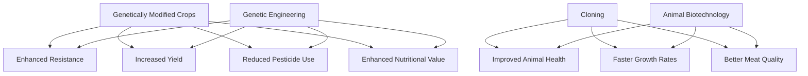
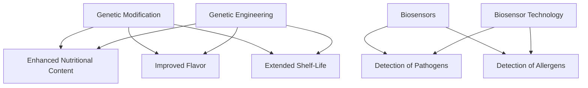
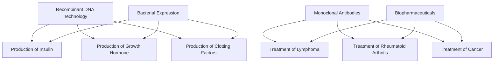
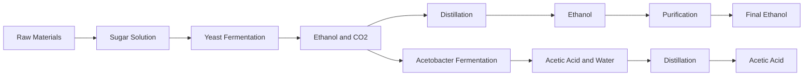
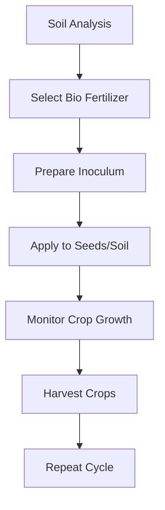
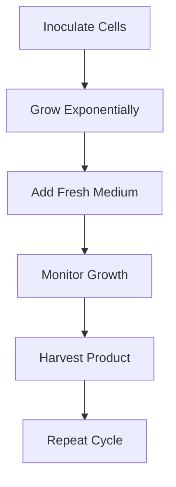

# Unit – 7: Chemical aspect of Biotechnology

*(AI-generated self-study book for GTU, subject code 3110001 — generated locally with Ollama.)*

This module carries approximately **20% of the end-semester theory paper (per syllabus)**.

## Introduction

**Chemical aspect of biotechnology** refers to the application of biochemical and chemical principles to understand and enhance biological processes. This field integrates traditional biotechnology with modern chemical techniques to develop new products and processes that are beneficial to various industries.

### Chemical Reactions in Biotechnology
- **Enzyme Catalysis:** Enzymes are biological catalysts that accelerate chemical reactions in living organisms. Understanding enzyme kinetics and catalysis is crucial in biotechnology. For example, in the production of biofuels, enzymes can break down cellulose into simple sugars.
- **Metabolic Pathways:** Metabolic pathways are a series of chemical reactions occurring within a cell. These pathways are essential for the synthesis and degradation of biomolecules. For instance, the citric acid cycle is a central metabolic pathway in energy production.

### Microbial Fermentation
- **Fermentation:** This is a metabolic process where microorganisms convert substrates into useful products. For example, lactic acid fermentation is used in the production of yogurt and cheese.
- **Penicillin Production:** Penicillin, a well-known antibiotic, is produced through microbial fermentation. The process involves the growth of Penicillium notatum on a nutrient medium, which is then harvested and purified.

> **Example:** 
>
> **Question:** Define enzyme catalysis and explain its importance in biotechnology.
>
> **Answer:** Enzyme catalysis is the acceleration of a chemical reaction by a biological catalyst called an enzyme. Enzymes reduce the activation energy required for a reaction, making it occur more rapidly and efficiently. In biotechnology, enzymes are used in various applications such as food processing, pharmaceuticals, and biofuel production. For example, in the production of bioethanol, enzymes are used to break down cellulose into fermentable sugars, which are then converted into ethanol.

## Scope

The scope of chemical aspect of biotechnology is vast and encompasses various fields such as medicine, agriculture, and environmental science. This section will explore the breadth of applications and potential areas of research in this field.

### Biopharmaceuticals
- **Drug Production:** Biopharmaceuticals are drugs produced using biotechnology techniques. Examples include insulin for diabetes treatment and monoclonal antibodies for cancer therapy.
- **Genetically Modified Organisms (GMOs):** GMOs are organisms whose genetic material has been altered using genetic engineering techniques. For instance, genetically modified plants can be engineered to produce pharmaceuticals in their tissues.

### Industrial Biotechnology
- **Biopesticides:** These are bio-based alternatives to chemical pesticides. For example, Bacillus thuringiensis (Bt) is a bacterium that produces a protein toxic to certain insects, used as a biopesticide.
- **Biofuel Production:** Biotechnology is used to produce biofuels from various sources such as algae, corn, and sugarcane. The enzymes involved in breaking down plant biomass are crucial for this process.

### Environmental Biotechnology
- **Waste Management:** Biotechnology can be used to treat and manage waste. For example, bacteria can be used to degrade pollutants in soil and water.
- **Bioremediation:** This involves the use of living organisms to remove contaminants from the environment. For instance, fungi can be used to break down oil spills.

> **Example:** 
>
> **Question:** Explain the role of biotechnology in the production of biopesticides.
>
> **Answer:** Biotechnology plays a critical role in the production of biopesticides by utilizing living organisms that can control pests and diseases. For example, Bacillus thuringiensis (Bt) is a bacterium that produces a protein toxic to certain insects. This protein can be introduced into crops through genetic engineering, making the plants resistant to pests. Another example is the use of fungi, such as Trichoderma, which can suppress fungal pathogens in agricultural fields. These biopesticides are environmentally friendly alternatives to chemical pesticides and reduce the risk of soil and water pollution.

## Importance and Application

The importance of the chemical aspect of biotechnology lies in its ability to address numerous challenges and improve various sectors. This section will delve into the significance of biotechnology and its practical applications.

### Biotechnology in Agriculture
- **Crops Improvement:** Biotechnology can enhance crop yields and resistance to pests and diseases. For example, genetically modified crops can be engineered to produce their own insecticides, reducing the need for chemical pesticides.
- **Soil Fertility:** Biotechnology can improve soil health through the use of biofertilizers, which are microorganisms that help plants absorb nutrients more efficiently.

### Biotechnology in Medicine
- **Therapeutic Applications:** Biotechnology is used to develop new drugs and therapies for various diseases. For example, vaccines can be produced using recombinant DNA technology.
- **Gene Therapy:** This involves the correction of genetic defects. For instance, gene therapy can be used to treat genetic disorders like sickle cell anemia.

### Biotechnology in Environmental Protection
- **Pollution Control:** Biotechnology can be used to clean up contaminated sites. For example, microorganisms can be used to break down pollutants in soil and water.
- **Renewable Energy:** Biotechnology is crucial in the development of biofuels, which are sustainable alternatives to fossil fuels.

> **Example:** 
>
> **Question:** Discuss the role of biotechnology in improving crop yields and pest resistance.
>
> **Answer:** Biotechnology plays a vital role in improving crop yields and enhancing pest resistance. Through genetic modification, crops can be engineered to produce their own insecticides, thereby reducing the need for chemical pesticides. For instance, Bt cotton is genetically modified to produce a protein toxic to certain pests, significantly reducing crop damage. Additionally, biotechnology can help in the development of crops that are more resistant to diseases and environmental stresses, leading to higher yields and better food security. For example, drought-resistant crops can be developed using genetic engineering techniques, ensuring consistent yields even in challenging environmental conditions.

---

## Benefits through biotechnology – Agriculture

### Introduction to Biotechnology in Agriculture
Biotechnology in agriculture involves the use of living organisms or their products to improve crop yields, enhance livestock productivity, and develop sustainable agricultural practices. This section will explore the various benefits that biotechnology offers in the agricultural sector.

### Genetically Modified Crops
Genetically Modified (GM) crops are plants whose genetic material has been altered using genetic engineering techniques. These crops are designed to have specific desirable traits such as resistance to pests, tolerance to herbicides, and enhanced nutritional value.

- **Example:** Bt cotton is a genetically modified crop engineered to produce a toxin from the bacterium *Bacillus thuringiensis* (Bt) that kills certain pests. This has led to a significant reduction in pesticide use and increased crop yield.

### Biotechnology in Crop Improvement
Biotechnology aids in the development of crops that are more resistant to environmental stresses such as drought, salinity, and diseases. This enhances food security and reduces the need for chemical inputs.

- **Example:** Golden rice is a genetically modified crop that has been engineered to produce beta-carotene, which the body converts into vitamin A. This addresses vitamin A deficiency in developing countries, improving public health.

### Biotechnology in Livestock
Biotechnology has also revolutionized the livestock sector through genetic engineering and cloning. This has led to improved animal health, faster growth rates, and better meat quality.

- **Example:** Cloned livestock can be used to produce milk with enhanced nutritional content or meat with specific desirable traits. This can help in meeting the increasing demand for high-quality animal products.

### Mermaid Diagram for Biotechnology in Agriculture

## Food Quality

### Introduction to Food Quality
Food quality refers to the physical, chemical, and sensory characteristics of food that affect its acceptability to consumers. Biotechnology plays a crucial role in improving the quality, safety, and shelf-life of food products.

### Genetic Modification for Enhanced Food Quality
Genetic modification can be used to improve the nutritional content of foods, enhance flavor, and increase shelf-life.

- **Example:** Tomatoes have been genetically modified to contain higher levels of lycopene, a pigment that gives tomatoes their red color and is a powerful antioxidant. This not only enhances their nutritional value but also improves their flavor and appearance.

### Biotechnology in Food Safety
Biotechnology can be used to detect and prevent foodborne pathogens and allergens, ensuring the safety of food products.

- **Example:** Lateral flow tests using biosensors can quickly detect the presence of bacteria such as *Escherichia coli* (E. coli) in food products, allowing for timely action to prevent food poisoning outbreaks.

### Biotechnology in Food Preservation
Biotechnology can extend the shelf-life of food products by inhibiting the growth of spoilage microorganisms and enzymes responsible for food degradation.

- **Example:** Adding enzymes such as proteases to fruits can help in the controlled ripening process, allowing for a more uniform ripening and reducing waste.

### Mermaid Diagram for Biotechnology in Food Quality

## Medicines

### Introduction to Biotechnology in Medicine
Biotechnology has revolutionized the production of medicines through the use of recombinant DNA technology, monoclonal antibodies, and other advanced techniques. This section will explore the benefits of biotechnology in the field of medicine.

### Recombinant DNA Technology
Recombinant DNA technology involves inserting a gene from one organism into the DNA of another to produce a desired protein. This has led to the development of many life-saving drugs.

- **Example:** Insulin, a hormone used to treat diabetes, was traditionally obtained from animal sources. Now, it is produced through recombinant DNA technology using bacteria, which has made it more pure, consistent, and cost-effective.

### Monoclonal Antibodies
Monoclonal antibodies are antibodies produced by identical immune cells that are all clones of a single parent cell. They are used in targeted therapies for various diseases.

- **Example:** Rituximab is a monoclonal antibody used to treat certain types of lymphoma. It specifically targets and destroys cancer cells, reducing side effects and improving treatment outcomes.

### Biopharmaceuticals
Biopharmaceuticals are drugs that are produced using living systems such as cells or microorganisms. They include recombinant proteins, vaccines, and other complex molecules.

- **Example:** Vaccines like the HPV vaccine are produced using recombinant DNA technology. These vaccines are highly effective in preventing diseases and are widely used in public health programs.

### Mermaid Diagram for Biotechnology in Medicine

### Worked Example
> **Example:** A pharmaceutical company is developing a new vaccine using recombinant DNA technology. They have inserted a gene for the production of a specific antigen into a harmless bacterium. The bacteria are then cultured to produce large quantities of the antigen. This antigen is then used to create a vaccine that can be administered to protect against a viral infection. This process is cost-effective and allows for rapid production of the vaccine.

These sections cover the key benefits of biotechnology in agriculture, food quality, and medicine. Each section includes a worked example to illustrate practical applications and enhance understanding.

---

## Fermentation Processes: Preparation of Ethanol and Acetic Acid

### Introduction to Fermentation
Fermentation is a metabolic process by which organic compounds are converted into simpler compounds, often accompanied by the release of energy. This process is widely used in the production of food, beverages, and pharmaceuticals. **Fermentation** can be classified into two main types: alcoholic fermentation and lactic acid fermentation.

#### Alcoholic Fermentation
Alcoholic fermentation is a type of anaerobic respiration where glucose is converted into ethanol and carbon dioxide. The key microorganisms involved in this process are yeast (Saccharomyces cerevisiae) and bacteria (Zymomonas mobilis).

- **Glucose**: C6H12O6
- **Ethanol**: C2H5OH
- **Carbon Dioxide**: CO2

The overall reaction for alcoholic fermentation can be represented as:
[ \text{C}_6\text{H}_{12}\text{O}_6 \rightarrow 2\text{C}_2\text{H}_5\text{OH} + 2\text{CO}_2 ]

### Preparation of Ethanol
The preparation of ethanol involves several steps. The process begins with the conversion of sugar to ethanol using yeast.

- **Step 1: Sugar Conversion**: Sugars are broken down by yeast into ethanol and carbon dioxide.
- **Step 2: Distillation**: Ethanol is separated from the mixture by distillation.
- **Step 3: Purification**: Ethanol is purified by removing impurities.

> **Example:** A fermentation tank contains 100 liters of 10% sugar solution. After fermentation, 20% of the sugar is converted into ethanol. Calculate the volume of ethanol produced.

### Acetic Acid Production
Acetic acid is produced through the process of acetic acid fermentation, which involves the action of the bacterium *Acetobacter*. The main raw material for this process is ethanol.

- **Ethanol**: C2H5OH
- **Acetic Acid**: CH3COOH

The overall reaction for the production of acetic acid can be represented as:
[ \text{C}_2\text{H}_5\text{OH} \rightarrow \text{CH}_3\text{COOH} + \text{H}_2\text{O} ]

### Flowchart of Ethanol and Acetic Acid Production

> **Example:** A 500-liter tank contains 20% ethanol. After distillation, 80% of the ethanol is recovered. Calculate the volume of ethanol recovered.

## Enzymes and Its Application in Industries

### Introduction to Enzymes
Enzymes are biological catalysts that accelerate chemical reactions in living organisms. They are proteins that lower the activation energy required for a reaction to occur. Enzymes are classified based on their function and structure.

#### Types of Enzymes
- **Hydrolases**: Catalyze the breakdown of complex molecules into simpler ones.
- **Oxidoreductases**: Involve the transfer of electrons from one molecule to another.
- **Transferases**: Catalyze the transfer of functional groups between molecules.

### Enzyme Applications in Industries
Enzymes have numerous applications in various industries, including food, pharmaceuticals, and biofuel production.

- **Food Industry**: Enzymes are used in the production of cheese, bread, and beverages. For example, **proteases** break down proteins in cheese, and **amylases** break down starch in bread.
- **Pharmaceutical Industry**: Enzymes are used in the production of drugs and in diagnostic tests. **Peroxidases** are used in the production of certain drugs, and **lipases** are used in diagnostic tests for fat metabolism.
- **Biofuel Production**: Enzymes are used to break down cellulose and starch to produce biofuels.

> **Example:** A food company uses amylase to break down starch into simpler sugars. If 100 grams of starch is treated with amylase, and 60% of the starch is converted to glucose, calculate the amount of glucose produced.

## Importance of Biofuels

### Introduction to Biofuels
Biofuels are renewable energy sources derived from biological materials such as plants, algae, and agricultural residues. They are an important alternative to fossil fuels, reducing greenhouse gas emissions and providing a sustainable energy source.

### Advantages of Biofuels
- **Sustainability**: Biofuels are derived from renewable resources and can be produced continuously.
- **Reduced Emissions**: Biofuels produce fewer pollutants compared to fossil fuels, reducing air and soil pollution.
- **Energy Security**: Biofuels can reduce dependence on imported fossil fuels, enhancing energy security.

### Types of Biofuels
- **Ethanol**: Produced from corn, sugarcane, and other plants.
- **Biodiesel**: Produced from vegetable oils and animal fats.
- **Biomethanol**: Produced from biomass through gasification and methanation processes.

### Flowchart of Biofuel Production

### Importance of Biofuels in the Future
Biofuels play a crucial role in the transition to a more sustainable energy future. They are essential in reducing carbon footprints and combating climate change.

> **Example:** A company plans to produce ethanol from sugarcane. If 1000 tons of sugarcane is used, and 80% of the sugars are converted to ethanol, calculate the amount of ethanol produced.

---

This chapter provides a comprehensive overview of fermentation processes, enzymes, and biofuels, aligning with the syllabus requirements and including practical examples for better understanding and exam preparation.

---

## Bio fertilizers

### Introduction
Bio fertilizers are biological products containing living microorganisms which, when applied to plants, enhance the availability and utilization of nutrients in the soil. They can be applied as seeds, soil, or foliar treatments. These microorganisms include bacteria, fungi, and actinomycetes that fix atmospheric nitrogen, solubilize phosphorus, and mobilize other nutrients.

### Types of Bio Fertilizers
- **Rhizobium Bacteria**: These bacteria form nodules on the roots of leguminous plants and fix atmospheric nitrogen.
- **Azotobacter**: These bacteria are free-living and fix atmospheric nitrogen in the soil.
- **Azospirillum**: These bacteria are also free-living and fix atmospheric nitrogen.
- **Phosphobacteria**: These bacteria solubilize phosphorus in the soil, making it more available to plants.
- **Fungal Inoculants**: Certain fungi, like **Azolla**, enhance the availability of nitrogen and fix atmospheric nitrogen in the soil.

### Applications
Bio fertilizers are used in agriculture to improve crop productivity and soil health. They are particularly useful in reducing the need for chemical fertilizers, thereby lowering the cost and environmental impact.

### Advantages
- **Reduced Fertilizer Use**: Bio fertilizers reduce the need for chemical fertilizers, which can be expensive and harmful.
- **Sustainable Agriculture**: They promote sustainable farming practices and improve soil structure.
- **Increased Yield**: Bio fertilizers enhance nutrient availability, leading to higher crop yields.
- **Environmental Benefits**: They reduce pollution and enhance soil fertility.

### Disadvantages
- **Initial Cost**: The initial cost of purchasing bio fertilizers can be high.
- **Application Techniques**: Proper application techniques are necessary for effective results.
- **Storage**: Bio fertilizers need to be stored under specific conditions to maintain their viability.

### Example
> **Example:** 
Suppose a farmer wants to increase the nitrogen content in the soil for growing leguminous crops. He decides to use Rhizobium bacteria as a bio fertilizer. The farmer applies 10 kg of Rhizobium inoculum to 1000 kg of seeds. The inoculum contains 5% viable Rhizobium cells. Calculate the number of viable Rhizobium cells applied per seed.

1. **Total weight of inoculum**: 10 kg
2. **Weight of Rhizobium cells in inoculum**: 5% of 10 kg = 0.5 kg
3. **Number of viable Rhizobium cells**: Assume the weight of one viable Rhizobium cell is 1 microgram (μg).

[
\text{Number of viable Rhizobium cells} = \frac{0.5 \text{ kg}}{1 \text{ μg}} = 500 \times 10^3 \text{ cells} = 500,000 \text{ cells}
]

4. **Number of viable Rhizobium cells per seed**: The farmer uses 1000 kg of seeds.

[
\text{Number of viable Rhizobium cells per seed} = \frac{500,000 \text{ cells}}{1000 \text{ kg}} = 500 \text{ cells/kg}
]

### Flowchart for Bio Fertilizer Application

---

## Bio surfactants and Bioreactors

### Introduction
Bio surfactants are surface-active compounds produced by microorganisms such as bacteria, fungi, and yeast. They are used in various applications, including cleaning agents, cosmetics, and food processing. Bioreactors are vessels used in biotechnology processes to grow microorganisms and produce desired products, including bio surfactants.

### Bio Surfactants
Bio surfactants are produced by microorganisms and have several advantages over synthetic surfactants, such as biodegradability, low toxicity, and environmental friendliness. They are used in various industries due to their ability to lower surface tension and solubilize hydrophobic substances.

### Types of Bio Surfactants
- **Glycolipids**: Produced by *Pseudomonas* and *Acidovorax*.
- **Lipopeptides**: Produced by *Bacillus*.
- **Polysaccharides**: Produced by *Rhodococcus*.
- **Fatty Acids**: Produced by *Pseudomonas*.

### Applications
Bio surfactants are used in:
- **Cleaning Agents**: For degreasing and cleaning applications.
- **Oil Recovery**: To enhance oil recovery from oil reservoirs.
- **Pharmaceuticals**: As emulsifiers and stabilizers.
- **Food Processing**: As emulsifiers and thickening agents.

### Bioreactors
Bioreactors are vessels used to grow microorganisms in controlled conditions. They are crucial in producing bio surfactants and other bioproducts. The design of bioreactors depends on the type of microorganism and the desired product.

### Types of Bioreactors
- **Batch Bioreactor**: Microorganisms are grown in a single batch until the process is completed.
- **Fed-batch Bioreactor**: Microorganisms are grown in a batch process with the addition of nutrients during the growth phase.
- **Continuous Bioreactor**: Microorganisms are continuously fed and harvested, maintaining a constant cell density.

### Example
> **Example:** 
A bioreactor is used to produce bio surfactants from *Bacillus subtilis*. The bioreactor has a volume of 1000 liters and operates in a fed-batch mode. Initially, 500 liters of nutrient medium are added, and the bioreactor is inoculated with 100 liters of *Bacillus subtilis* cells. The cells grow exponentially for 24 hours, after which 500 liters of fresh nutrient medium are added. Calculate the total volume of the bioreactor after 24 hours.

1. **Initial volume of nutrient medium**: 500 liters
2. **Initial volume of cells**: 100 liters
3. **Volume after 24 hours**: 500 liters (nutrient medium) + 100 liters (cells) = 600 liters

4. **Volume after adding fresh medium**: 600 liters (existing volume) + 500 liters (fresh medium) = 1100 liters

### Flowchart for Bioreactor Operation

---

By understanding the principles of bio fertilizers, bio surfactants, and bioreactors, students can appreciate the practical applications of biotechnology in agriculture and industry.
