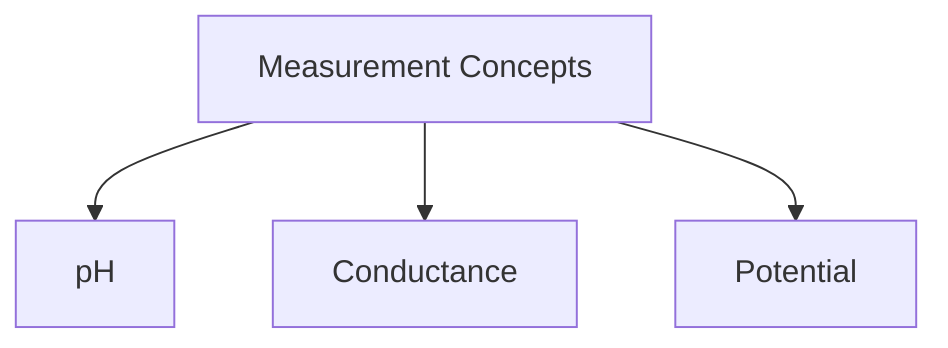
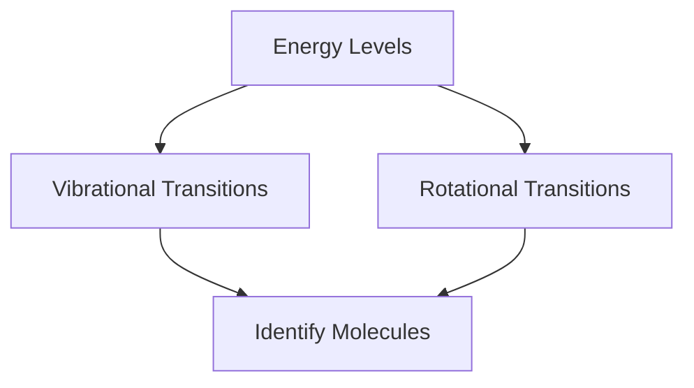

# Unit – 8: Analytical Techniques

*(AI-generated self-study book for GTU, subject code 3110001 — generated locally with Ollama.)*

This module carries approximately ****.


## Measurement and Understanding of pH, Conductance, and Potential

### pH Measurement and Understanding
**pH** is a measure of the concentration of hydrogen ions (H⁺) in a solution. It is defined as the negative logarithm (base 10) of the hydrogen ion concentration [H⁺]. The pH scale ranges from 0 to 14, with 7 being neutral. Solutions with a pH less than 7 are acidic, and those with a pH greater than 7 are basic or alkaline.

- **pH Calculation Example:**
  > **Example:** Calculate the pH of a solution with [H⁺] = 1 × 10⁻⁴ M.
  >
  > [
  > \text{pH} = -\log([H^+]) = -\log(1 \times 10^{-4}) = 4
  > ]

### Conductance Measurement and Understanding
**Conductance** is a measure of the ability of a solution to pass an electric current. It is the reciprocal of resistance and is directly proportional to the concentration of ions in the solution. The unit of conductance is Siemens (S).

- **Conductance Calculation Example:**
  > **Example:** A solution has a conductance of 0.5 S and a resistance of 2000 Ω. Calculate the resistance of the solution.
  >
  > [
  > \text{Conductance} = \frac{1}{\text{Resistance}}
  > ]
  > [
  > \text{Resistance} = \frac{1}{\text{Conductance}} = \frac{1}{0.5} = 2 \, \Omega
  > ]

### Potential Measurement and Understanding
**Potential** in this context typically refers to the cell potential (E) in electrochemical cells. The cell potential is the difference in electrical potential between the anode and the cathode of an electrochemical cell. It is measured in volts (V).

- **Potential Calculation Example:**
  > **Example:** In a galvanic cell, the reduction half-reaction is Cu²⁺ + 2e⁻ → Cu and the oxidation half-reaction is Zn → Zn²⁺ + 2e⁻. If the standard reduction potential of Cu²⁺ is +0.34 V and the standard reduction potential of Zn²⁺ is -0.76 V, calculate the cell potential.
  >
  > [
  > E_{cell} = E_{cathode} - E_{anode} = 0.34 \, \text{V} - (-0.76 \, \text{V}) = 1.10 \, \text{V}
  > ]

### Summary
In this section, we have discussed the fundamental concepts of pH, conductance, and potential, along with practical examples to aid understanding. Each of these measurements provides critical information about the nature and behavior of solutions in various chemical and electrochemical processes. Understanding these concepts is essential for analyzing and interpreting data in analytical chemistry and related fields.



---

## Spectroscopic techniques: Principles of Spectroscopy and Selection rules

### Definition and Basic Principles of Spectroscopy
**Spectroscopy** is the study of the interaction between matter and electromagnetic radiation. It involves the use of specific wavelengths of light to identify, quantify, and characterize chemical compounds. Spectroscopic techniques are widely used in analytical chemistry, materials science, and biochemistry to determine the structure, composition, and properties of substances.

### Types of Spectroscopic Techniques
- **Absorption Spectroscopy**: Measures the amount of light absorbed by a sample at different wavelengths.
- **Emission Spectroscopy**: Measures the light emitted by a sample when it is excited by an external source.
- **Scattering Spectroscopy**: Measures the change in direction and intensity of light when it interacts with matter.

### Selection Rules and Their Importance
**Selection rules** define the conditions under which a transition between two energy levels is allowed. These rules are crucial for understanding the behavior of molecules and predicting the types of spectra that can be observed.

#### Electronic Spectroscopy
- **Transitions**: Occur between different electronic energy levels.
- **Selection Rule**: Δ n = ± 1, where n is the principal quantum number.
- **Example**: In a diatomic molecule, the electronic transition from the ground state to the first excited state can be described as B → A^, where B is the ground state and A^ is the first excited state.

#### Vibrational Spectroscopy
- **Transitions**: Occur between different vibrational energy levels.
- **Selection Rule**: Δ v = ± 1, where v is the vibrational quantum number.
- **Example**: In a diatomic molecule, the vibrational transition from the ground state to the first excited state can be described as v = 0 → v = 1.

#### Rotational Spectroscopy
- **Transitions**: Occur between different rotational energy levels.
- **Selection Rule**: Δ J = ± 1, where J is the rotational quantum number.
- **Example**: In a diatomic molecule, the rotational transition from the ground state to the first excited state can be described as J = 0 → J = 1.

### Worked Example
> **Example:** Consider a diatomic molecule in a vibrational spectroscopy experiment. The molecule has a vibrational transition from the ground state (v = 0) to the first excited state (v = 1). Using the selection rule for vibrational spectroscopy, determine the allowed transition and explain its significance.

- **Solution**: The allowed transition is from v = 0 to v = 1. This transition is significant because it corresponds to the absorption or emission of a specific amount of energy, which can be measured to determine the vibrational frequency of the molecule. The energy difference between these two states can be calculated using the formula:
  [
  E = \hbar \omega (v + \frac{1}{2})
  ]
  where  is the reduced Planck's constant, and ω is the angular frequency of the vibration.

### Mermaid Diagram for Vibrational Transitions
```mermaid
flowchart TD
    A[Ground State (v=0)] --> B[First Excited State (v=1)]
```

This diagram visually represents the allowed vibrational transition in a diatomic molecule, highlighting the change in vibrational quantum number.

### Conclusion
Understanding the principles of spectroscopy and the selection rules is essential for interpreting and analyzing spectroscopic data. By applying these principles, students can accurately determine the molecular structure, composition, and properties of various substances.

---

## UV-Visible Spectroscopy and its Application

### Introduction to UV-Visible Spectroscopy
**UV-Visible Spectroscopy** is a common analytical technique used to study the absorption of ultraviolet (UV) and visible light by molecules. This technique is based on the electronic transitions of atoms and molecules, where energy from light is absorbed, leading to the excitation of electrons from a lower energy level to a higher energy level. This method is widely used in chemistry, biochemistry, and materials science for the identification and quantification of substances.

- **Key Components**: The main components of a UV-Visible spectrophotometer include a light source, a monochromator, a sample cell, a detector, and a data display system.

### Working Principle of UV-Visible Spectroscopy
The working principle of UV-Visible spectroscopy involves the following steps:
- **Light Source**: A light source, such as a deuterium lamp or tungsten lamp, emits light across the UV and visible regions of the electromagnetic spectrum.
- **Monochromator**: The light from the source is passed through a monochromator, which disperses the light into its component wavelengths. This allows the spectrophotometer to measure the absorbance at a specific wavelength.
- **Sample Cell**: The sample is placed in the sample cell, which is a transparent container that allows the light to pass through the sample.
- **Detector**: The detector measures the intensity of the light after it passes through the sample and compares it with the intensity of the incident light. The difference in intensity is the absorbance of the sample.
- **Data Display**: The absorbance is displayed on a screen or recorded as a spectrum.

### Applications of UV-Visible Spectroscopy
UV-Visible spectroscopy has numerous applications in analytical chemistry, including:
- **Identification of Substances**: By analyzing the spectrum, the presence and concentration of a substance can be determined.
- **Quantitative Analysis**: The absorbance at specific wavelengths can be used to determine the concentration of a substance.
- **Structural Determination**: The shape of the absorption spectrum can provide information about the molecular structure of the substance.

- **Example:** A sample of a drug is analyzed using UV-Visible spectroscopy. The spectrum is compared with the reference spectrum of the pure drug. If there is a match, the drug is identified. The absorbance at 254 nm is measured, which is characteristic of the drug. The concentration of the drug is calculated using the Beer-Lambert law: A = · c · l, where A is the absorbance,  is the molar absorptivity, c is the concentration, and l is the path length.

### Mermaid Diagram for UV-Visible Spectroscopy Process


### Worked Example
> **Example:** A sample of an unknown solution is analyzed using UV-Visible spectroscopy. The absorbance at 260 nm is measured to be 0.50. The path length is 1 cm, and the molar absorptivity of the substance at this wavelength is 1.2 × 10⁴ L/(mol·cm). Calculate the concentration of the substance in the solution.
> 
> **Solution:**
> Using the Beer-Lambert law, A = · c · l:
> [ 0.50 = 1.2 \times 10^4 \cdot c \cdot 1 ]
> [ c = \frac{0.50}{1.2 \times 10^4} ]
> [ c = 4.17 \times 10^{-5} \, \text{M} ]

This example demonstrates the practical application of UV-Visible spectroscopy in determining the concentration of a substance.

---

## Vibrational and Rotational spectroscopy (IR) of diatomic molecules and its application

### Introduction to Vibrational and Rotational Spectroscopy
**Vibrational and rotational spectroscopy** are important tools in the study of molecular structure and dynamics. Vibrational spectroscopy deals with the energy transitions in molecules due to the vibration of bonds, while rotational spectroscopy focuses on transitions due to the rotation of molecules. These techniques are widely used in chemistry, physics, and materials science for identifying and characterizing diatomic molecules.

### Vibrational Spectroscopy
**Vibrational spectroscopy** involves the absorption or emission of infrared (IR) radiation by molecules as they undergo vibrational transitions. The vibrational energy levels in a diatomic molecule can be described by the vibrational quantum number v.

- **Vibrational Energy Levels:** The energy of a diatomic molecule in the v-th vibrational state can be expressed as:
  [
  E_v = (v + \frac{1}{2})h\nu
  ]
  where h is Planck's constant and  is the vibrational frequency.

- **Selection Rules:** The allowed transitions are given by the selection rule Δ v = ± 1. This means that a diatomic molecule can only absorb or emit energy to change its vibrational state by one quantum.

- **Example:** A diatomic molecule has a vibrational frequency = 10¹³ Hz. Calculate the energy difference between the ground state and the first excited state.
  > **Example:**  
  [
  \Delta E = h \nu = 6.626 \times 10^{-34} \, \text{Js} \times 10^{13} \, \text{Hz} = 6.626 \times 10^{-21} \, \text{J}
  ]

### Rotational Spectroscopy
**Rotational spectroscopy** involves the absorption or emission of microwave radiation by molecules as they undergo rotational transitions. The rotational energy levels in a diatomic molecule can be described by the rotational quantum number J.

- **Rotational Energy Levels:** The energy of a diatomic molecule in the J-th rotational state is given by:
  [
  E_J = \frac{J(J + 1) \mu \Omega}{2I}
  ]
  where μ is the reduced mass of the molecule,  is the rotational constant, and I is the moment of inertia.

- **Selection Rules:** The allowed transitions are given by the selection rule Δ J = ± 1. This means that a diatomic molecule can only absorb or emit energy to change its rotational state by one quantum.

- **Example:** For a diatomic molecule, the rotational constant = 10⁻² cm⁻¹. Calculate the energy difference between the J = 1 and J = 0 states.
  > **Example:**  
  [
  \Delta E = \frac{1 \times (1 + 1) \times \mu \Omega}{2I} = \frac{2 \mu \Omega}{2I} = \frac{\mu \Omega}{I}
  ]
  Given = 10⁻² cm⁻¹, we need to convert  to energy units. Using = hc λ, where h is Planck's constant and c is the speed of light, we get:
  [
  \Omega = 10^{-2} \, \text{cm}^{-1} \times \frac{1.986 \times 10^{-23} \, \text{J} \cdot \text{cm}}{1 \, \text{cm}^{-1}} = 1.986 \times 10^{-25} \, \text{J}
  ]
  Thus,
  [
  \Delta E = 1.986 \times 10^{-25} \, \text{J}
  ]

### Application of Vibrational and Rotational Spectroscopy
**Application of Vibrational and Rotational Spectroscopy:** These techniques are widely used in chemical and physical analysis. For instance, in the identification of unknown substances, the vibrational and rotational frequencies can provide unique "fingerprint" spectra. Additionally, these spectroscopic methods can help in studying reaction dynamics, determining bond lengths, and understanding molecular structures.

- **Example:** Use the vibrational and rotational spectroscopy data to identify a diatomic molecule.
  > **Example:**  
  Given the vibrational frequency = 10¹³ Hz and the rotational constant = 10⁻² cm⁻¹, identify the molecule.  
  **Solution:**  
  For = 10¹³ Hz, the vibrational quantum number v can be estimated. For = 10⁻² cm⁻¹, the rotational quantum number J can be determined. By cross-referencing these values with known spectroscopic data, the molecule can be identified as O₂.



This diagram illustrates the flow of information from vibrational and rotational energy levels to the identification of molecules.
