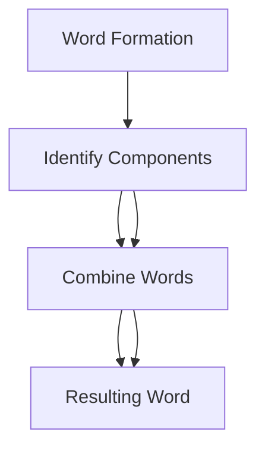
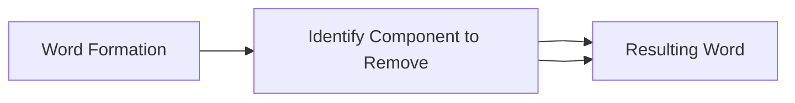

## Introduction to Word Formation Types of word formation processes: compounding

### Definition and Explanation
Compounding is a word formation process where two or more words are combined to create a new word. The resulting word often carries a different meaning from its component words. Compounding is a common process in many languages, including English.

- **Example:** Combining the words "coffee" and "mug" to form "coffeemug".

### Types of Compounds
Compounds can be classified into three main types:
1. **Bound Compounds**
2. **Hyphenated Compounds**
3. **Open Compounds**

#### 1. Bound Compounds
Bound compounds are words that are joined without spaces or hyphens and can be read as a single word. For example, "blackboard" is a bound compound.

> **Example:** "blackboard" is a bound compound formed from "black" and "board".

#### 2. Hyphenated Compounds
Hyphenated compounds are words that are joined by a hyphen. Hyphens are used to clarify the relationship between the parts of the compound and to make the word easier to read. For example, "mother-in-law" is a hyphenated compound.

> **Example:** "mother-in-law" is a hyphenated compound formed from "mother" and "in-law".

#### 3. Open Compounds
Open compounds are words that are joined by a space and are read as two separate words. For example, "coffee mug" is an open compound.

> **Example:** "coffee mug" is an open compound formed from "coffee" and "mug".

### Mermaid Diagram: Sequence of Compounding
Below is a flowchart illustrating the process of compounding:

### Example Application
Consider the word "cupboard." It is a compound word formed from "cup" and "board." Understanding the process of compounding helps in recognizing the structure of complex words.

> **Example:** "cupboard" is a compound formed from "cup" and "board."

## Clipping
### Definition and Explanation
Clipping is a word formation process where a word is shortened by removing one or more parts. The shortened form often retains the original meaning but is more concise. Clipping can result in new words that are derived from longer words.

- **Example:** Clipping the word "photographic" to "photo."

### Types of Clipping
Clipping can be categorized into two main types:
1. **Initial Clipping**
2. **Final Clipping**

#### 1. Initial Clipping
Initial clipping involves removing the end of a word. For example, "campus" is derived from "campus," where "campus" is clipped to "camp."

> **Example:** "campus" is the initial clipping of "campus."

#### 2. Final Clipping
Final clipping involves removing the beginning of a word. For example, "radar" is derived from "radiodetection and ranging."

> **Example:** "radar" is the final clipping of "radiodetection and ranging."

### Mermaid Diagram: Sequence of Clipping
Below is a flowchart illustrating the process of clipping:

### Example Application
Consider the word "bus." It is a clipped form of "omnibus," where the initial "omni-" part is removed. Understanding the process of clipping helps in recognizing the origins of shortened words.

> **Example:** "bus" is the initial clipping of "omnibus."

These sections should provide a comprehensive understanding of compounding and clipping, essential for vocabulary building and language comprehension.