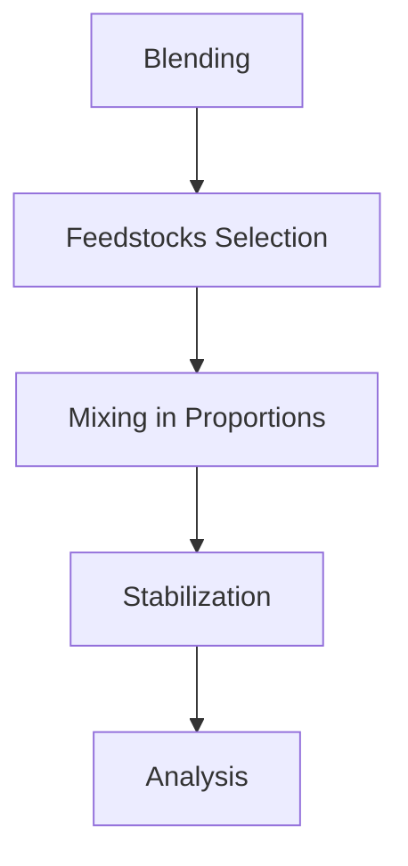
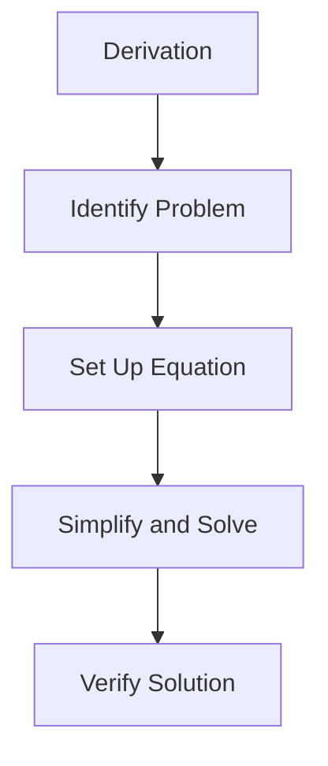

## Blending

Blending is a process used in the petroleum refining industry to mix different types of petroleum products to achieve a desired quality and composition. It is essential for ensuring that the final product meets the required specifications and standards.

### Definition
**Blending** involves the combination of two or more different petroleum products to produce a single product with specific desired properties such as viscosity, boiling point range, and aromatic content. The aim is to optimize the quality of the final product while maximizing the use of available resources.

### Importance
Blending is crucial for several reasons:
- **Quality Control:** Ensures that the final product meets the required standards.
- **Efficiency:** Maximizes the use of various feedstocks by combining them to achieve desired properties.
- **Flexibility:** Allows for flexibility in product specifications and market demands.

### Process
The blending process typically involves the following steps:
- **Feedstocks:** Different crude oils or petroleum fractions are selected based on their properties.
- **Mixing:** The selected feedstocks are mixed in the desired proportions.
- **Stabilization:** The mixture is stabilized to ensure uniformity and to remove any unwanted components.
- **Analysis:** The blended product is analyzed to ensure it meets the required specifications.

> **Example:**
> Suppose we need to blend two crude oils: Crude A with a sulfur content of 1.2% and Crude B with a sulfur content of 0.8%. We aim to produce a blended crude with a sulfur content of 1.0%.
>
> - **Step 1:** Determine the required ratio.
> [
> Sulfur content of Crude A = 1.2\%
> ]
> [
> Sulfur content of Crude B = 0.8\%
> ]
> [
> Desired sulfur content = 1.0\%
> ]
>
> Let the ratio of Crude A to Crude B be x to 1 - x.
>
> [
>   1.2x + 0.8(1 - x) = 1.0
> ]
>
>   Simplifying:
> [
>   1.2x + 0.8 - 0.8x = 1.0
> ]
> [
>   0.4x + 0.8 = 1.0
> ]
> [
>   0.4x = 0.2
> ]
> [
>   x = 0.5
> ]
>
>   Therefore, the required ratio is 50% Crude A and 50% Crude B.

## Derivation

Derivation is a mathematical process used to find the relationship between variables, often involving the use of calculus. In engineering, it is used to derive formulas, understand system behavior, and solve complex problems.

### Definition
**Derivation** involves the systematic process of obtaining an equation or formula from known principles or starting points. It is crucial in understanding the underlying mechanisms and relationships in engineering problems.

### Importance
Derivation is essential for:
- **Understanding Principles:** Helps in grasping the fundamental principles behind engineering concepts.
- **Problem Solving:** Provides a systematic approach to solving complex engineering problems.
- **Innovation:** Enables the development of new methods and technologies.

### Process
The derivation process typically involves the following steps:
- **Identify the Problem:** Clearly define the problem and the variables involved.
- **Set Up the Equation:** Use known principles or laws to set up the initial equation.
- **Simplify and Solve:** Simplify the equation and solve for the unknowns.
- **Verify the Solution:** Check the derived solution against known data or experimental results.

### Example
Consider the derivation of the equation for the volume of a cone.

- **Step 1:** Identify the problem.
- The volume V of a cone is to be derived in terms of its radius r and height h.

- **Step 2:** Set up the equation.
- The volume V of a cone is given by:
[
V = (1 / 3) π r² h
]
  - This formula is derived from the concept that the volume of a cone is one-third the volume of a cylinder with the same base and height.

- **Step 3:** Simplify and solve.
  - The equation is already in its simplest form.

- **Step 4:** Verify the solution.
- The formula V = (1 / 3) π r² h is well-known and can be verified by comparing it with experimental data.

> **Example:**
> Suppose we need to derive the equation for the torque T in a shaft, given the power P and the angular velocity ω.
>
> - **Step 1:** Identify the problem.
- The torque T in a shaft is to be derived in terms of the power P and the angular velocity ω.
>
> - **Step 2:** Set up the equation.
- Power P is defined as the product of torque T and angular velocity ω:
[
P = T · ω
]
>
> - **Step 3:** Simplify and solve.
- To find T, we rearrange the equation:
[
T = (P / ω)
]
>
> - **Step 4:** Verify the solution.
  - This equation can be verified by comparing it with known power and torque values in practical scenarios.

