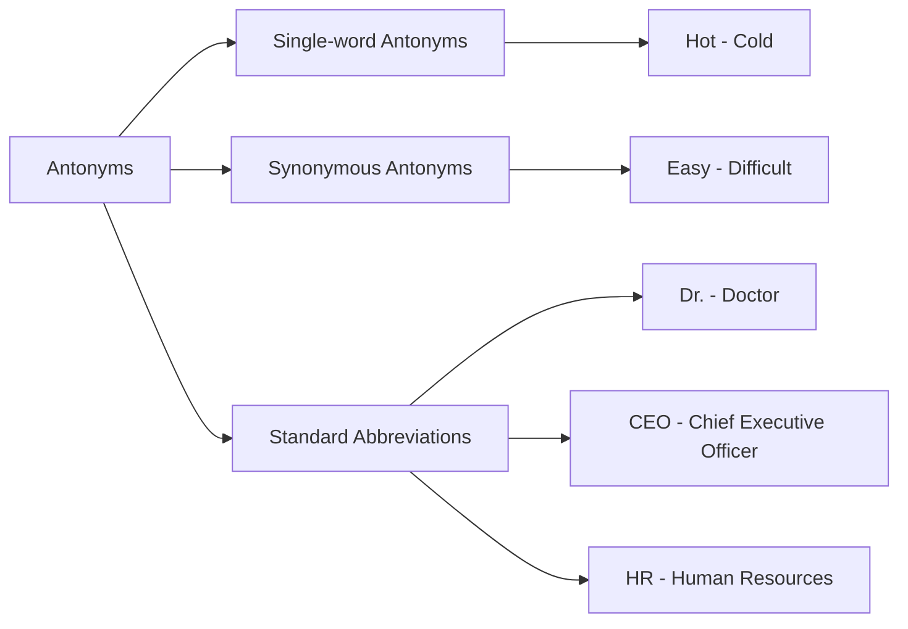

## Antonyms, and Standard Abbreviations

### Define Antonyms
Antonyms are words that have opposite meanings. For example, "hot" and "cold" are antonyms. Understanding antonyms is essential for vocabulary building as it helps in comprehending the nuances of language.

### Classify Antonyms
Antonyms can be classified into two main types:
- **Single-word Antonyms**: These are pairs of words that are antonyms of each other, such as "hot" and "cold."
- **Synonymous Antonyms**: These pairs of words are not exact opposites but are used in similar contexts. For example, "easy" and "difficult."

### Enlist Examples of Antonyms
- **Hot** and **Cold**
- **Big** and **Small**
- **Fast** and **Slow**
- **Rich** and **Poor**
- **Easy** and **Difficult**

### Explain Standard Abbreviations
Standard abbreviations are shortened forms of words or phrases that are commonly used in technical and non-technical contexts. They are used to save time and space in writing. Understanding these abbreviations is crucial for effective communication.

### Describe Common Abbreviations
Here are some common abbreviations and their meanings:
- **Dr.** - Doctor
- **Prof.** - Professor
- **Mr.** - Mister
- **Mrs.** - Married Lady
- **Ms.** - Miss or Mrs.
- **CEO** - Chief Executive Officer
- **IT** - Information Technology
- **ICT** - Information and Communication Technology
- **HR** - Human Resources
- **PPT** - PowerPoint
- **WBS** - Work Breakdown Structure

### Apply Abbreviations in Context
> **Example:** In a business communication context, the abbreviation "HR" is widely used to refer to the Human Resources department. For instance, "The HR team will organize the company retreat." Here, "HR" stands for "Human Resources."

### Apply Antonyms in Context
> **Example:** In an engineering report, the term "efficient" is often used to describe a system that performs well with minimal waste. Its antonym, "inefficient," can be used to describe a system that performs poorly due to excessive waste. For instance, "The new cooling system is more efficient, reducing the temperature more effectively than the old one."

### Mermaid Diagram for Antonyms and Abbreviations

This chapter covers the essential concepts of antonyms and standard abbreviations, providing clear definitions, classifications, and practical examples to enhance vocabulary and communication skills.