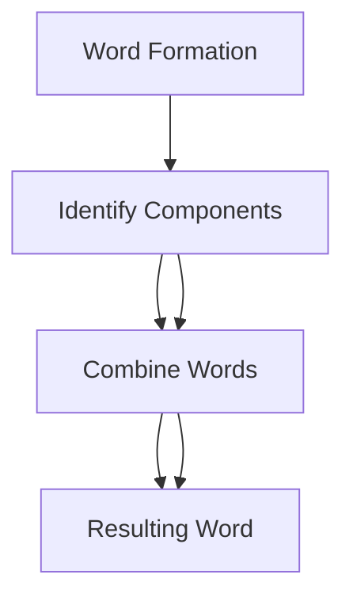
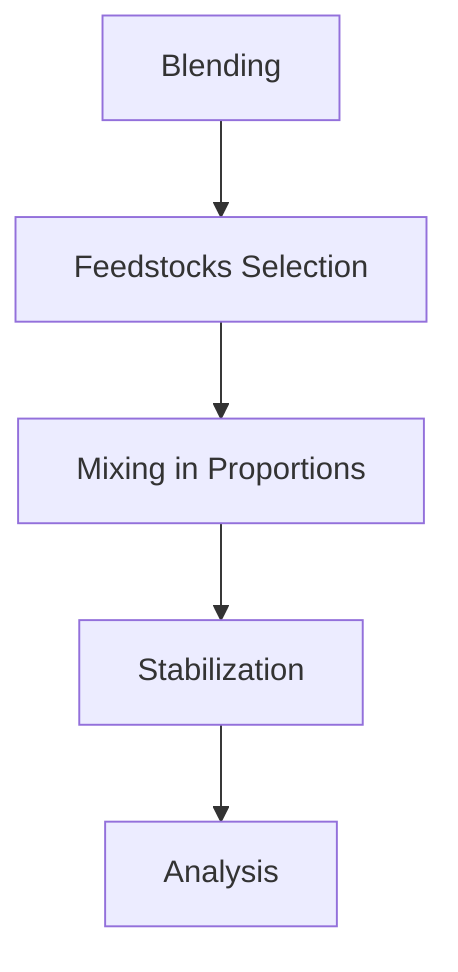
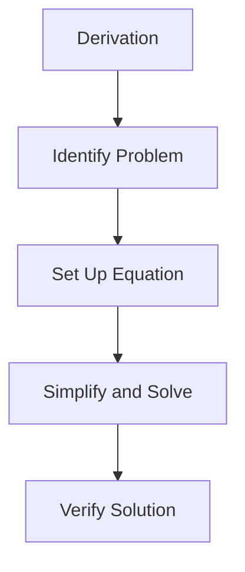
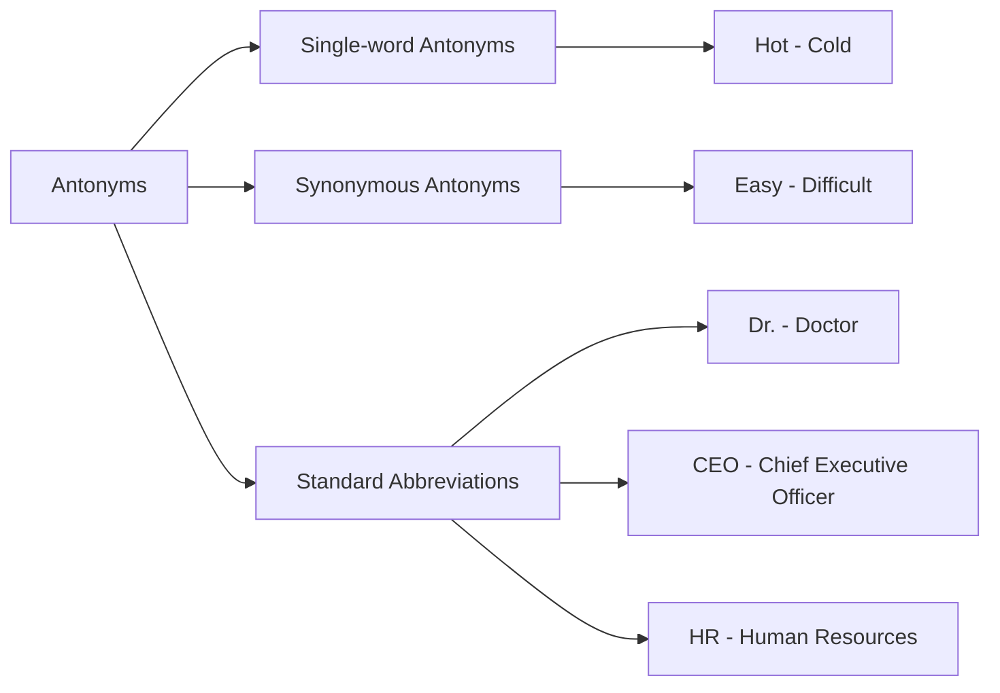

# Unit – 1: Vocabulary building

*(AI-generated self-study book for GTU, subject code 3110002 — generated locally with Ollama.)*

This module carries approximately **20% of the end-semester theory paper (per syllabus)**.

## Introduction to Word Formation Types of word formation processes: compounding

### Definition and Explanation
Compounding is a word formation process where two or more words are combined to create a new word. The resulting word often carries a different meaning from its component words. Compounding is a common process in many languages, including English.

- **Example:** Combining the words "coffee" and "mug" to form "coffeemug".

### Types of Compounds
Compounds can be classified into three main types:
1. **Bound Compounds**
2. **Hyphenated Compounds**
3. **Open Compounds**

#### 1. Bound Compounds
Bound compounds are words that are joined without spaces or hyphens and can be read as a single word. For example, "blackboard" is a bound compound.

> **Example:** "blackboard" is a bound compound formed from "black" and "board".

#### 2. Hyphenated Compounds
Hyphenated compounds are words that are joined by a hyphen. Hyphens are used to clarify the relationship between the parts of the compound and to make the word easier to read. For example, "mother-in-law" is a hyphenated compound.

> **Example:** "mother-in-law" is a hyphenated compound formed from "mother" and "in-law".

#### 3. Open Compounds
Open compounds are words that are joined by a space and are read as two separate words. For example, "coffee mug" is an open compound.

> **Example:** "coffee mug" is an open compound formed from "coffee" and "mug".

### Mermaid Diagram: Sequence of Compounding
Below is a flowchart illustrating the process of compounding:

### Example Application
Consider the word "cupboard." It is a compound word formed from "cup" and "board." Understanding the process of compounding helps in recognizing the structure of complex words.

> **Example:** "cupboard" is a compound formed from "cup" and "board."

## Clipping
### Definition and Explanation
Clipping is a word formation process where a word is shortened by removing one or more parts. The shortened form often retains the original meaning but is more concise. Clipping can result in new words that are derived from longer words.

- **Example:** Clipping the word "photographic" to "photo."

### Types of Clipping
Clipping can be categorized into two main types:
1. **Initial Clipping**
2. **Final Clipping**

#### 1. Initial Clipping
Initial clipping involves removing the end of a word. For example, "campus" is derived from "campus," where "campus" is clipped to "camp."

> **Example:** "campus" is the initial clipping of "campus."

#### 2. Final Clipping
Final clipping involves removing the beginning of a word. For example, "radar" is derived from "radiodetection and ranging."

> **Example:** "radar" is the final clipping of "radiodetection and ranging."

### Mermaid Diagram: Sequence of Clipping
Below is a flowchart illustrating the process of clipping:

### Example Application
Consider the word "bus." It is a clipped form of "omnibus," where the initial "omni-" part is removed. Understanding the process of clipping helps in recognizing the origins of shortened words.

> **Example:** "bus" is the initial clipping of "omnibus."

These sections should provide a comprehensive understanding of compounding and clipping, essential for vocabulary building and language comprehension.

---

## Blending

Blending is a process used in the petroleum refining industry to mix different types of petroleum products to achieve a desired quality and composition. It is essential for ensuring that the final product meets the required specifications and standards.

### Definition
**Blending** involves the combination of two or more different petroleum products to produce a single product with specific desired properties such as viscosity, boiling point range, and aromatic content. The aim is to optimize the quality of the final product while maximizing the use of available resources.

### Importance
Blending is crucial for several reasons:
- **Quality Control:** Ensures that the final product meets the required standards.
- **Efficiency:** Maximizes the use of various feedstocks by combining them to achieve desired properties.
- **Flexibility:** Allows for flexibility in product specifications and market demands.

### Process
The blending process typically involves the following steps:
- **Feedstocks:** Different crude oils or petroleum fractions are selected based on their properties.
- **Mixing:** The selected feedstocks are mixed in the desired proportions.
- **Stabilization:** The mixture is stabilized to ensure uniformity and to remove any unwanted components.
- **Analysis:** The blended product is analyzed to ensure it meets the required specifications.

> **Example:**
> Suppose we need to blend two crude oils: Crude A with a sulfur content of 1.2% and Crude B with a sulfur content of 0.8%. We aim to produce a blended crude with a sulfur content of 1.0%.
>
> - **Step 1:** Determine the required ratio.
> [
> Sulfur content of Crude A = 1.2\%
> ]
> [
> Sulfur content of Crude B = 0.8\%
> ]
> [
> Desired sulfur content = 1.0\%
> ]
>
> Let the ratio of Crude A to Crude B be x to 1 - x.
>
> [
>   1.2x + 0.8(1 - x) = 1.0
> ]
>
>   Simplifying:
> [
>   1.2x + 0.8 - 0.8x = 1.0
> ]
> [
>   0.4x + 0.8 = 1.0
> ]
> [
>   0.4x = 0.2
> ]
> [
>   x = 0.5
> ]
>
>   Therefore, the required ratio is 50% Crude A and 50% Crude B.

## Derivation

Derivation is a mathematical process used to find the relationship between variables, often involving the use of calculus. In engineering, it is used to derive formulas, understand system behavior, and solve complex problems.

### Definition
**Derivation** involves the systematic process of obtaining an equation or formula from known principles or starting points. It is crucial in understanding the underlying mechanisms and relationships in engineering problems.

### Importance
Derivation is essential for:
- **Understanding Principles:** Helps in grasping the fundamental principles behind engineering concepts.
- **Problem Solving:** Provides a systematic approach to solving complex engineering problems.
- **Innovation:** Enables the development of new methods and technologies.

### Process
The derivation process typically involves the following steps:
- **Identify the Problem:** Clearly define the problem and the variables involved.
- **Set Up the Equation:** Use known principles or laws to set up the initial equation.
- **Simplify and Solve:** Simplify the equation and solve for the unknowns.
- **Verify the Solution:** Check the derived solution against known data or experimental results.

### Example
Consider the derivation of the equation for the volume of a cone.

- **Step 1:** Identify the problem.
- The volume V of a cone is to be derived in terms of its radius r and height h.

- **Step 2:** Set up the equation.
- The volume V of a cone is given by:
[
V = (1 / 3) π r² h
]
  - This formula is derived from the concept that the volume of a cone is one-third the volume of a cylinder with the same base and height.

- **Step 3:** Simplify and solve.
  - The equation is already in its simplest form.

- **Step 4:** Verify the solution.
- The formula V = (1 / 3) π r² h is well-known and can be verified by comparing it with experimental data.

> **Example:**
> Suppose we need to derive the equation for the torque T in a shaft, given the power P and the angular velocity ω.
>
> - **Step 1:** Identify the problem.
- The torque T in a shaft is to be derived in terms of the power P and the angular velocity ω.
>
> - **Step 2:** Set up the equation.
- Power P is defined as the product of torque T and angular velocity ω:
[
P = T · ω
]
>
> - **Step 3:** Simplify and solve.
- To find T, we rearrange the equation:
[
T = (P / ω)
]
>
> - **Step 4:** Verify the solution.
  - This equation can be verified by comparing it with known power and torque values in practical scenarios.

---

## Creative Respelling

### Definition and Purpose
**Creative respelling** involves altering the spelling of words in a creative or artistic manner, often for linguistic or stylistic reasons. This technique can be used in poetry, literature, or even in modern communication to convey a particular tone or effect. Creative respelling can include adding, removing, or replacing letters in a word to alter its meaning or sound.

### Techniques and Examples
Creative respelling can be done in various ways:
- **Adding Letters**: For example, adding a letter to make a word more descriptive or to create a playful effect. 
- **Removing Letters**: Removing letters to shorten a word or to create a more concise term.
- **Replacing Letters**: Replacing a letter with another to change the meaning or sound of a word.

### Example
> **Example:** 
> - Original: *moon*
> - Creative Respelling: *moom*

In this example, the letter 'o' in "moon" is doubled to create a playful or whimsical effect.

## Coining and Borrowing: Acquaintance with Prefixes and Suffixes, Synonyms

### Definition and Purpose
**Coining** refers to the creation of new words by combining existing words or by adding or modifying prefixes and suffixes. **Borrowing** involves taking words from one language and adapting them into another. Both techniques are essential for expanding the vocabulary and flexibility of language.

### Prefixes and Suffixes
Understanding the role of prefixes and suffixes is crucial in coining new words. Here are some common examples:
- **Prefixes**: 
  - **anti-**: *antibody* (opposite of *body*)
  - **pre-**: *preheat* (before heat)
  - **post-**: *postcard* (after card)

- **Suffixes**: 
  - **-ness**: *happiness* (state of being happy)
  - **-ly**: *quickly* (adverb form of *quick*)
  - **-ful**: *helpful* (full of help)

### Synonyms
Synonyms are words that have similar meanings. Recognizing and using synonyms can enhance the richness of language and provide clarity in communication.

### Example
> **Example:** 
> - Original: *happy*
> - Synonym: *joyful*

In this example, "happy" and "joyful" are synonyms, both describing a state of being pleased or content.

### Creative Respelling and Coined Words
Combining creative respelling with the techniques of coining and borrowing can yield unique and innovative words. For instance, a creative respelling of "moon" to "moom" could be combined with a coined term like "moomlight" to describe the light emitted by a fictional moon-like object.

### Example
> **Example:** 
> - Original: *moonlight*
> - Creative Respelling: *moomlight*

In this example, "moonlight" is creatively respelled to "moomlight," and the term is coined to fit a fictional context.

### Conclusion
Creative respelling, coining, and borrowing are powerful tools in the linguistic arsenal. They not only enrich the vocabulary but also add a layer of creativity and flexibility to language use. Understanding these techniques is essential for effective communication and expression in various contexts.

---

## Antonyms, and Standard Abbreviations

### Define Antonyms
Antonyms are words that have opposite meanings. For example, "hot" and "cold" are antonyms. Understanding antonyms is essential for vocabulary building as it helps in comprehending the nuances of language.

### Classify Antonyms
Antonyms can be classified into two main types:
- **Single-word Antonyms**: These are pairs of words that are antonyms of each other, such as "hot" and "cold."
- **Synonymous Antonyms**: These pairs of words are not exact opposites but are used in similar contexts. For example, "easy" and "difficult."

### Enlist Examples of Antonyms
- **Hot** and **Cold**
- **Big** and **Small**
- **Fast** and **Slow**
- **Rich** and **Poor**
- **Easy** and **Difficult**

### Explain Standard Abbreviations
Standard abbreviations are shortened forms of words or phrases that are commonly used in technical and non-technical contexts. They are used to save time and space in writing. Understanding these abbreviations is crucial for effective communication.

### Describe Common Abbreviations
Here are some common abbreviations and their meanings:
- **Dr.** - Doctor
- **Prof.** - Professor
- **Mr.** - Mister
- **Mrs.** - Married Lady
- **Ms.** - Miss or Mrs.
- **CEO** - Chief Executive Officer
- **IT** - Information Technology
- **ICT** - Information and Communication Technology
- **HR** - Human Resources
- **PPT** - PowerPoint
- **WBS** - Work Breakdown Structure

### Apply Abbreviations in Context
> **Example:** In a business communication context, the abbreviation "HR" is widely used to refer to the Human Resources department. For instance, "The HR team will organize the company retreat." Here, "HR" stands for "Human Resources."

### Apply Antonyms in Context
> **Example:** In an engineering report, the term "efficient" is often used to describe a system that performs well with minimal waste. Its antonym, "inefficient," can be used to describe a system that performs poorly due to excessive waste. For instance, "The new cooling system is more efficient, reducing the temperature more effectively than the old one."

### Mermaid Diagram for Antonyms and Abbreviations

This chapter covers the essential concepts of antonyms and standard abbreviations, providing clear definitions, classifications, and practical examples to enhance vocabulary and communication skills.
