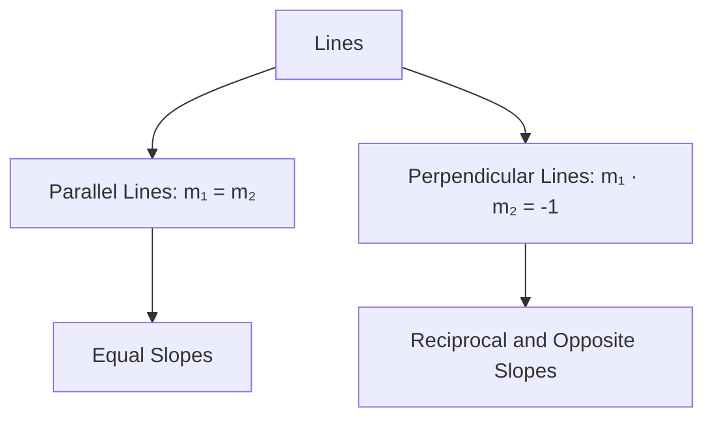

## 4.5. Angle between two lines.

### Definition and Importance
**Angle between two lines:** The angle between two lines is the smallest angle formed between them. It is always measured in the range of 0^ to 180^.

### Slope of a Line
The **slope** (m) of a line is defined as the tangent of the angle θ that the line makes with the positive direction of the x-axis. The slope can be calculated using the formula:
[ m = \tan \theta ]

### Angle Between Two Lines
To find the angle between two lines with slopes m₁ and m₂, the formula is:
[ \tan \theta = \left| \frac{m_1 - m_2}{1 + m_1 m_2} \right| ]
where θ is the angle between the two lines.

### Parallel and Perpendicular Lines
- **Parallel Lines:** Two lines are parallel if their slopes are equal, i.e., m₁ = m₂.
- **Perpendicular Lines:** Two lines are perpendicular if the product of their slopes is -1, i.e., m₁ · m₂ = -1.

### Worked Example
> **Example:** Find the angle between the lines y = 2x + 3 and y = - 1 2 x + 5.

1. Identify the slopes of the lines:
   - For the line y = 2x + 3, the slope m₁ = 2.
   - For the line y = - 1 2 x + 5, the slope m₂ = - 1 2.

2. Use the formula to find the angle θ:
   [
   \tan \theta = \left| \frac{2 - \left(-\frac{1}{2}\right)}{1 + 2 \cdot \left(-\frac{1}{2}\right)} \right| = \left| \frac{2 + \frac{1}{2}}{1 - 1} \right| = \left| \frac{\frac{5}{2}}{0} \right|
   ]
   Since the denominator is zero, the lines are perpendicular.

3. Therefore, the angle between the lines is 90^.

### Mermaid Diagram


## 4.6. Equation of Circle with Center and Radius

### Definition
The **equation of a circle** with center (h, k) and radius r is given by:
[ (x - h)^2 + (y - k)^2 = r^2 ]

### Derivation
Consider a circle with center (h, k) and radius r. Any point (x, y) on the circle will satisfy the distance formula:
[ \sqrt{(x - h)^2 + (y - k)^2} = r ]
Squaring both sides, we get:
[ (x - h)^2 + (y - k)^2 = r^2 ]

### Tangent and Normal
- **Tangent:** A line that touches the circle at exactly one point.
- **Normal:** A line that is perpendicular to the tangent at the point of contact.

### Worked Example
> **Example:** Find the equation of a circle with center at (3, -2) and radius 5.

1. Identify the center and radius:
   - Center (h, k) = (3, -2)
   - Radius r = 5

2. Substitute the values into the standard form of the equation:
   [
   (x - 3)^2 + (y + 2)^2 = 5^2
   ]
   Simplify:
   [
   (x - 3)^2 + (y + 2)^2 = 25
   ]

### Mermaid Diagram
```mermaid
flowchart TD
    A[Circle Equation] --> B[Standard Form: (x - h)² + (y - k)² = r²]
    B --> C[Identify Center (h, k)]
    C --> D[Identify Radius r]
    D --> E[Substitute into Standard Form]
    E --> F[Equation: (x - 3)² + (y + 2)² = 25]
```

This section covers the essential concepts and provides worked examples to help students apply these concepts effectively.