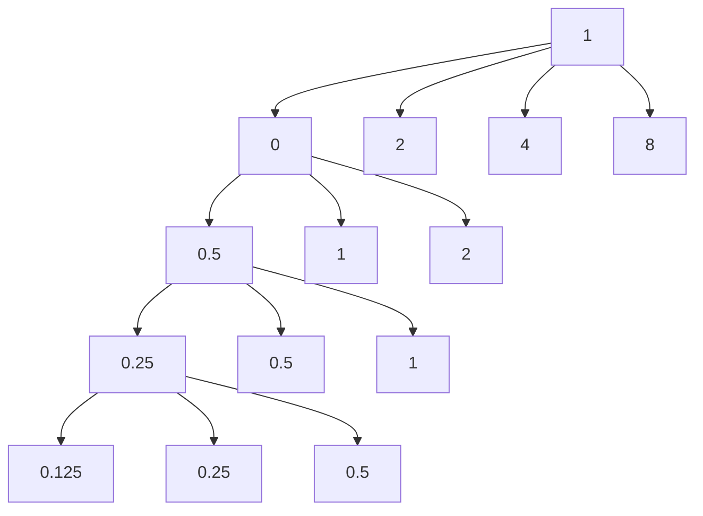

# Unit – I: Determinant and Function

*(AI-generated self-study book for GTU, subject code 4300001 — generated locally with Ollama.)*

This module carries approximately **16 marks (4 Remember + 7 Understand + 5 Apply) (per syllabus)**.

Learning objectives covered by this module:
- 1.a. Solve simple problems of Determinant up to order 3*3.
- 1.b. Explain graphically the given functions.
- 1.c. Solve simple problems using concepts of Logarithms

## 1.1. Determinant and its value up to 3rd order (Without properties)

### Definition and Concept of Determinant
A **determinant** is a scalar value that can be computed from the elements of a square matrix and encodes certain properties of the matrix. For a 2x2 matrix, the determinant provides information about whether the matrix is invertible or not. For a 3x3 matrix, the determinant helps in solving systems of linear equations and in finding the volume of a parallelepiped defined by the matrix.

### Formula for 2x2 Matrix
For a 2x2 matrix A = bmatrix a & b \\ c & d bmatrix, the determinant is calculated as:
[ \text{det}(A) = ad - bc ]

### Example
> **Example:** Find the determinant of the matrix A = bmatrix 5 & 2 \\ 3 & 4 bmatrix.
>
> [
> \text{det}(A) = (5 \cdot 4) - (2 \cdot 3) = 20 - 6 = 14
> ]

### Formula for 3x3 Matrix
For a 3x3 matrix B = bmatrix a & b & c \\ d & e & f \\ g & h & i bmatrix, the determinant is calculated using the formula:
[ \text{det}(B) = a(ei - fh) - b(di - fg) + c(dh - eg) ]

### Example
> **Example:** Find the determinant of the matrix B = bmatrix 1 & 2 & 3 \\ 0 & 1 & 4 \\ 5 & 6 & 0 bmatrix.
>
> [
> \text{det}(B) = 1(1 \cdot 0 - 4 \cdot 6) - 2(0 \cdot 0 - 4 \cdot 5) + 3(0 \cdot 6 - 1 \cdot 5)
> ]
> [
> = 1(0 - 24) - 2(0 - 20) + 3(0 - 5)
> ]
> [
> = -24 + 40 - 15 = 1
> ]

### Solving Problems
To solve problems involving determinants, follow these steps:
1. **Identify the order of the matrix.**
2. **Apply the appropriate formula for the order.**
3. **Calculate the determinant using the formula.**

### Example
> **Example:** Given the matrix C = bmatrix 2 & 3 & 1 \\ 4 & 5 & 6 \\ 7 & 8 & 9 bmatrix, find the determinant.
>
> [
> \text{det}(C) = 2(5 \cdot 9 - 6 \cdot 8) - 3(4 \cdot 9 - 6 \cdot 7) + 1(4 \cdot 8 - 5 \cdot 7)
> ]
> [
> = 2(45 - 48) - 3(36 - 42) + 1(32 - 35)
> ]
> [
> = 2(-3) - 3(-6) + 1(-3)
> ]
> [
> = -6 + 18 - 3 = 9
> ]

By following these steps and examples, you can solve simple problems involving determinants up to the 3rd order.

---

## 1.2. Function and simple examples.

### Definition of a Function
A function is a mathematical relationship between a set of inputs (domain) and a set of permissible outputs (range). Each input is related to exactly one output. Functions are often represented using the notation f(x), where x is the input and f(x) is the output.

### Types of Functions
Functions can be classified into various types based on their properties and forms. Here are some basic types:
- **Linear Function**: A function of the form f(x) = ax + b, where a and b are constants.
- **Quadratic Function**: A function of the form f(x) = ax² + bx + c, where a, b, and c are constants, and a ≠ 0.
- **Exponential Function**: A function of the form f(x) = aˣ, where a is a positive constant and x is a variable.
- **Logarithmic Function**: A function of the form f(x) = _a x, where a is a positive constant and x is the variable.

### Graphical Representation of Functions
Graphically representing functions involves plotting the input values on the x-axis and the corresponding output values on the y-axis. The graph helps in understanding the behavior of the function.

#### Example: Graphical Representation of a Function
> **Example:** Consider the function f(x) = x² - 3x + 2. Graph this function and describe its behavior.

1. **Determine the key points**:
   - Find the y-intercept by setting x = 0: f(0) = 0² - 3 · 0 + 2 = 2.
   - Find the x-intercepts by setting f(x) = 0: x² - 3x + 2 = 0. Factorize: (x - 1)(x - 2) = 0. So, x = 1 and x = 2.
   - Find the vertex by using the formula x = - b 2a: x = - -3 2 · 1 = 3 2. Substitute x = 3 2 into the function: f( 3 2 ) = ( 3 2 )² - 3 · 3 2 + 2 = 9 4 - 9 2 + 2 = - 1 4.

2. **Plot the key points**:
   - (0, 2), (1, 0), (2, 0), ( 3 2 , - 1 4 ).

3. **Sketch the graph**:
   - Draw a smooth curve passing through these points, noting that the parabola opens upwards because the coefficient of x² is positive.

### Solving Simple Problems Using Functions
Functions can be used to solve various types of problems. Let's consider a problem involving a linear function.

#### Example: Solving a Linear Function Problem
> **Example:** A car rental company charges a flat fee of 20 per day plus0.15 per mile driven. Write a function to represent the total cost C as a function of the number of miles m driven, and calculate the cost for driving 100 miles.

1. **Define the function**:
   - The total cost C is given by the function C(m) = 20 + 0.15m.

2. **Calculate the cost for 100 miles**:
   - Substitute m = 100 into the function: C(100) = 20 + 0.15 · 100 = 20 + 15 = 35.

3. **Conclusion**:
   - The cost for driving 100 miles is $35.

This example demonstrates how functions can be used to model real-world scenarios and solve practical problems.

---

## 1.3. Logarithm as a function

### Definition and Basic Properties
**Logarithm:** The logarithm of a number is the exponent to which a given base must be raised to obtain that number. It is denoted by _b(x), where b is the base and x is the argument. For example, ₂(8) = 3 because 2³ = 8.

**Properties of Logarithms:**
- **Product Rule:** _b(xy) = _b(x) + _b(y)
- **Quotient Rule:** _b( x y ) = _b(x) - _b(y)
- **Power Rule:** _b(xp) = p _b(x)
- **Change of Base Formula:** _b(x) = _k(x) _k(b)

### Graphical Representation
Graphically, the logarithmic function y = _b(x) is represented as a curve that increases slowly for x > 1 and decreases slowly for 0 < x < 1. The function is defined for x > 0 and passes through the point (1, 0). For example, the graph of y = ₂(x) is shown below.

### Solving Problems Using Logarithms
Logarithms can be used to solve problems involving exponential growth or decay, pH levels, and many other real-world applications.

#### Example:
Solve the equation 2ˣ = 32 using logarithms.

> **Example:**
> To solve 2ˣ = 32, we can take the logarithm of both sides. Using the logarithm with base 2, we get:
> [
> \log_2(2^x) = \log_2(32)
> ]
> Using the power rule of logarithms, ₂(2ˣ) = x ₂(2), and knowing that ₂(2) = 1, we have:
> [
> x = \log_2(32)
> ]
> Since 32 = 2⁵, we get:
> [
> x = 5
> ]
> Therefore, the solution to the equation 2ˣ = 32 is x = 5.

### Summary
- **Logarithm:** The exponent to which a base must be raised to get a number.
- **Properties:** Product, quotient, and power rules.
- **Graphical Representation:** Logarithmic functions are curves that increase slowly for x > 1 and decrease slowly for 0 < x < 1.

This section covers the essential aspects of logarithms as a function, providing a clear understanding of their definition, properties, and graphical representation.

---

## 1.4. Laws of Logarithm and Related Simple Examples

### 1.4.1. Introduction to Logarithms
A **logarithm** is the power to which a number (the base) must be raised to produce a given number. For example, the logarithm of 100 to the base 10 is 2, because 10² = 100. The notation used is ₁₀(100) = 2.

### 1.4.2. Laws of Logarithms
The laws of logarithms are fundamental in solving logarithmic problems. They are as follows:

- **Product Law:** _b(MN) = _b(M) + _b(N)
- **Quotient Law:** _b( M N ) = _b(M) - _b(N)
- **Power Law:** _b(Mk) = k · _b(M)
- **Change of Base Law:** _b(M) = _k(M) _k(b)

#### **Example:**
Calculate ₁₀(1000) using the laws of logarithms.
> **Example:**
Using the Power Law: ₁₀(1000) = ₁₀(10³) = 3 · ₁₀(10) = 3 · 1 = 3.

### 1.4.3. Solving Simple Logarithmic Problems
Let's solve a few simple logarithmic problems to understand the application of the laws of logarithms.

#### **Example:**
Simplify ₂(8) + ₂(32).
> **Example:**
Using the Product Law: ₂(8) + ₂(32) = ₂(8 · 32) = ₂(256).

Since 256 = 2⁸, we get:
₂(256) = 8.

#### **Example:**
Simplify ₅( 125 25 ).
> **Example:**
Using the Quotient Law: ₅( 125 25 ) = ₅(125) - ₅(25).

Since 125 = 5³ and 25 = 5², we get:
₅(125) = 3 and ₅(25) = 2.

Thus, ₅( 125 25 ) = 3 - 2 = 1.

### 1.4.4. Change of Base Law
The **Change of Base Law** is particularly useful when the bases are different and not easily handled. For example, converting ₂(16) to a common logarithm (base 10) is easier using the Change of Base Law.

#### **Example:**
Convert ₂(16) to a common logarithm.
> **Example:**
Using the Change of Base Law: ₂(16) = ₁₀(16) ₁₀(2).

Since 16 = 2⁴, we know ₂(16) = 4. Using a calculator to find the common logarithms:
₁₀(16) ≈ 1.2041 and ₁₀(2) ≈ 0.3010.

Thus, ₂(16) = 1.2041 0.3010 ≈ 4.

### 1.4.5. Summary
- The laws of logarithms are essential in simplifying and solving logarithmic expressions.
- The Product Law, Quotient Law, and Power Law help in combining or breaking down logarithmic expressions.
- The Change of Base Law is useful when dealing with different bases and simplifying calculations.

This section covers the fundamental laws of logarithms and provides practical examples to help students understand and apply these concepts effectively.
