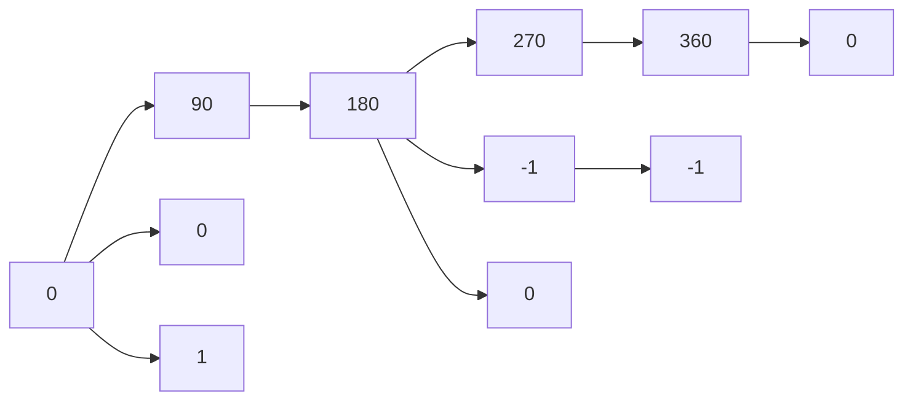

# Unit – II: Trigonometry

*(AI-generated self-study book for GTU, subject code 4300001 — generated locally with Ollama.)*

This module carries approximately **14 marks (4 Remember + 5 Understand + 5 Apply) (per syllabus)**.

Learning objectives covered by this module:
- 2.a. Apply the concept of Compound angle, Allied angle, and Multiple angles to solve the given simple engineering problem(s)
- 2.b. Explain the concept of Sub- Multiple and solve related problem(s).
- 2.c. Invoke the concept of Sum and Factor formulae to solve the given simple problem(s)
- 2.d. Investigate given simple problems using inverse Trigonometric functions.

## 2.1. Units of Angles (degree and radian)

### Definition of Angles
An angle is the measure of rotation between two rays or line segments sharing a common endpoint. In engineering and mathematics, angles are typically measured in degrees or radians.

#### **Degree**
- **Definition:** A degree is a unit of measurement for angles, where one full rotation is divided into 360 degrees.
- **Symbol:** The degree symbol is °. For example, 30° means 30 degrees.

#### **Radian**
- **Definition:** A radian is the standard unit of angle measure in the International System of Units (SI). It is defined as the angle subtended at the center of a circle by an arc that is equal in length to the radius of the circle.
- **Symbol:** The radian symbol is rad. For example, 1 radian is the angle subtended by an arc of length equal to the radius of the circle.

### Conversion Between Degrees and Radians
The relationship between degrees and radians can be expressed as:
[ 1 \text{ radian} = \frac{180^\circ}{\pi} ]
[ 1^\circ = \frac{\pi}{180} \text{ radians} ]

### Example:
> **Example:** Convert 120 degrees to radians.
> 
> Given: 120^
> 
> Using the conversion formula:
> [ 120^\circ = 120 \times \frac{\pi}{180} \text{ radians} = \frac{2\pi}{3} \text{ radians} ]
> 
> Therefore, 120^ is equivalent to 2π 3 radians.

### Example:
> **Example:** Convert 3 radians to degrees.
> 
> Given: 3 radians
> 
> Using the conversion formula:
> [ 3 \text{ radians} = 3 \times \frac{180^\circ}{\pi} = \frac{540}{\pi} \approx 171.89^\circ ]
> 
> Therefore, 3 radians is approximately 171.89^.

## 2.2. Trigonometric Functions

### Definition of Trigonometric Functions
Trigonometric functions are functions of an angle that relate the angles of a triangle to the lengths of its sides. The primary trigonometric functions are sine, cosine, and tangent.

#### **Sine (sin)**
- **Definition:** The sine of an angle in a right-angled triangle is the ratio of the length of the opposite side to the length of the hypotenuse.
- **Formula:** θ = opposite hypotenuse

#### **Cosine (cos)**
- **Definition:** The cosine of an angle in a right-angled triangle is the ratio of the length of the adjacent side to the length of the hypotenuse.
- **Formula:** θ = adjacent hypotenuse

#### **Tangent (tan)**
- **Definition:** The tangent of an angle in a right-angled triangle is the ratio of the length of the opposite side to the length of the adjacent side.
- **Formula:** θ = opposite adjacent

### Example:
> **Example:** Find the sine, cosine, and tangent of a 30° angle.
> 
> Given: θ = 30^
> 
> Using the standard values:
> [ \sin 30^\circ = \frac{1}{2} ]
> [ \cos 30^\circ = \frac{\sqrt{3}}{2} ]
> [ \tan 30^\circ = \frac{1}{\sqrt{3}} = \frac{\sqrt{3}}{3} ]
> 
> Therefore, 30^ = 0.5, 30^ = 0.866, and 30^ = 0.577.

### Example:
> **Example:** Find the angle whose sine is 0.5.
> 
> Given: θ = 0.5
> 
> Using the inverse sine function:
> [ \theta = \sin^{-1}(0.5) = 30^\circ ]
> 
> Therefore, the angle is 30^.

### Example:
> **Example:** Find the cosine and tangent of a 45° angle.
> 
> Given: θ = 45^
> 
> Using the standard values:
> [ \cos 45^\circ = \frac{\sqrt{2}}{2} ]
> [ \tan 45^\circ = 1 ]
> 
> Therefore, 45^ = 0.707 and 45^ = 1.

### Example:
> **Example:** Find the angle whose tangent is 1.
> 
> Given: θ = 1
> 
> Using the inverse tangent function:
> [ \theta = \tan^{-1}(1) = 45^\circ ]
> 
> Therefore, the angle is 45^.

These examples and explanations should help you understand the concepts and apply them effectively in your engineering problems.

---

## 2.3. Allied & Compound Angles, Multiple –Submultiples Angles

### Allied Angles
**Definition:** Allied angles are angles that are related to the given angle in such a way that they are either supplementary, complementary, or differ by a multiple of 90^.

**Example:** If θ is an angle, then the allied angles of θ are θ + 90^, θ - 90^, θ + 180^, and θ - 180^.

### Compound Angles
**Definition:** Compound angles are formed by the sum or difference of two or more angles.

**Example:** If α and β are two angles, then the compound angles are α + β and α - β.

### Multiple Angles
**Definition:** Multiple angles are angles that are multiples of a given angle.

**Example:** If θ is an angle, then the multiple angles of θ are 2θ, 3θ, 4θ, and so on.

### Submultiples Angles
**Definition:** Submultiples of an angle are angles that are obtained by dividing a given angle by a natural number.

**Example:** If θ is an angle, then the submultiples of θ are θ 2, θ 3, θ 4, and so on.

### Worked Example for Allied & Compound Angles
> **Example:** If θ = 30^, find the values of (90^ - θ), (180^ + θ), and (270^ - θ).

- (90^ - 30^) = (60^) = 3 2
- (180^ + 30^) = (210^) = -(30^) = - 3 2
- (270^ - 30^) = (240^) = -(60^) = - 3

### Worked Example for Multiple & Submultiples Angles
> **Example:** If θ = 15^, find the values of (2θ) and ( θ 2 ).

- (2 × 15^) = (30^) = 1 2
- ( 15^ 2 ) = (7.5^) (This value is not commonly memorized, but it can be calculated using a calculator or trigonometric tables)

## 2.4. Graph of Sine and Cosine

### Graph of Sine Function
The graph of y = (x) is a periodic function with a period of 360^ or 2π radians.

**Key Points:**
- Amplitude: The maximum value of (x) is 1, and the minimum value is -1.
- Period: The function repeats every 360^.
- Symmetry: The sine function is symmetric about the origin, i.e., (-x) = -(x).

### Graph of Cosine Function
The graph of y = (x) is a periodic function with a period of 360^ or 2π radians.

**Key Points:**
- Amplitude: The maximum value of (x) is 1, and the minimum value is -1.
- Period: The function repeats every 360^.
- Symmetry: The cosine function is symmetric about the y-axis, i.e., (-x) = (x).

### Worked Example for Graph of Sine and Cosine
> **Example:** Plot the graphs of y = (x) and y = (x) for 0^ ≤ x ≤ 360^.

- **Graph of y = (x):**
  - At x = 0^, y = 0
  - At x = 90^, y = 1
  - At x = 180^, y = 0
  - At x = 270^, y = -1
  - At x = 360^, y = 0

- **Graph of y = (x):**
  - At x = 0^, y = 1
  - At x = 90^, y = 0
  - At x = 180^, y = -1
  - At x = 270^, y = 0
  - At x = 360^, y = 1

### Mermaid Diagram for Sine and Cosine

- **Explanation:** The diagram shows the values of sine and cosine at key angles from 0^ to 360^.

This completes the detailed coverage of Allied & Compound Angles, Multiple –Submultiples Angles and Graph of Sine and Cosine.

---

## 2.5. Periodic Trigonometric Function

### Definition and Basic Properties

A trigonometric function is said to be periodic if its values repeat after a certain interval. The smallest positive value of P for which (x + P) = (x) or (x + P) = (x) is called the period of the function. 

- **Period of (x) and (x)**: The period of both (x) and (x) is 2π.

- **Period of (x)**: The period of (x) is π.

### Graphical Representation

- **Graph of (x)**: The graph of (x) repeats every 2π units.
- **Graph of (x)**: The graph of (x) also repeats every 2π units.
- **Graph of (x)**: The graph of (x) has vertical asymptotes at x = π 2 + nπ and repeats every π units.

### Example:
> **Example:** If f(x) = (3x), determine the period of f(x).
>
> **Solution:** The period of (x) is 2π. If the argument of the sine function is scaled by a factor, the period is divided by that factor. Hence, the period of (3x) is 2π 3.

## 2.6. Sum and Factor Formulae

### Sum Formulae

The sum formulae for trigonometric functions are:

- **Sum of Sines**: A + B = 2 ( A + B 2 ) ( A - B 2 )
- **Sum of Cosines**: A + B = 2 ( A + B 2 ) ( A - B 2 )
- **Difference of Sines**: A - B = 2 ( A + B 2 ) ( A - B 2 )
- **Difference of Cosines**: A - B = -2 ( A + B 2 ) ( A - B 2 )

### Factor Formulae

The factor formulae for trigonometric functions are:

- **Product to Sum Formulae**:
  - A B = 1 2 [(A - B) - (A + B)]
  - A B = 1 2 [(A + B) + (A - B)]
  - A B = 1 2 [(A + B) + (A - B)]

### Example:
> **Example:** Prove that x + 3x = 2 2x x.
>
> **Solution:** Using the sum formula for sines:
> [
> \sin x + \sin 3x = 2 \sin\left(\frac{x + 3x}{2}\right) \cos\left(\frac{x - 3x}{2}\right)
> ]
> Simplifying the arguments inside the sine and cosine functions:
> [
> \sin x + \sin 3x = 2 \sin\left(2x\right) \cos\left(-x\right)
> ]
> Since (-x) = (x):
> [
> \sin x + \sin 3x = 2 \sin(2x) \cos(x)
> ]
> Thus, the identity is proved.

### Practical Application

- **Example:** Simplify 10^ 20^ + 80^ 60^.
>
> **Solution:** Using the product to sum formula:
> [
> \sin 10^\circ \cos 20^\circ = \frac{1}{2} [\sin(30^\circ) - \sin(-10^\circ)] = \frac{1}{2} [\sin(30^\circ) + \sin(10^\circ)]
> ]
> [
> \sin 80^\circ \cos 60^\circ = \sin 80^\circ \cdot \frac{1}{2} = \frac{1}{2} \sin(80^\circ)
> ]
> Since (80^) = (10^):
> [
> \sin 80^\circ \cos 60^\circ = \frac{1}{2} \cos(10^\circ)
> ]
> Therefore:
> [
> \sin 10^\circ \cos 20^\circ + \sin 80^\circ \cos 60^\circ = \frac{1}{2} [\sin(30^\circ) + \sin(10^\circ)] + \frac{1}{2} \cos(10^\circ)
> ]
> Using (30^) = 1 2:
> [
> \sin 10^\circ \cos 20^\circ + \sin 80^\circ \cos 60^\circ = \frac{1}{2} \left(\frac{1}{2} + \sin(10^\circ)\right) + \frac{1}{2} \cos(10^\circ)
> ]
> Simplifying:
> [
> \sin 10^\circ \cos 20^\circ + \sin 80^\circ \cos 60^\circ = \frac{1}{4} + \frac{1}{2} \sin(10^\circ) + \frac{1}{2} \cos(10^\circ)
> ]
> Using the identity (10^) + (10^) = 2 (55^):
> [
> \sin 10^\circ \cos 20^\circ + \sin 80^\circ \cos 60^\circ = \frac{1}{4} + \frac{\sqrt{2}}{2} \sin(55^\circ)
> ]

---

## 2.7. Inverse Trigonometric Function

Inverse trigonometric functions are the inverse functions of the basic trigonometric functions. These functions are used to determine the angle for a given trigonometric ratio. The inverse trigonometric functions are denoted by ⁻¹, ⁻¹, ⁻¹, ⁻¹, ⁻¹, and ⁻¹.

### Definition and Domain
- **Definition:** The inverse trigonometric functions are the functions that "undo" the basic trigonometric functions. For example, ⁻¹(x) (also written as (x)) is the function that gives the angle θ such that (θ) = x.
- **Domain and Range:**
  - ⁻¹(x): Domain [-1, 1], Range [- π 2 , π 2 ]
  - ⁻¹(x): Domain [-1, 1], Range [0, π]
  - ⁻¹(x): Domain (-, ), Range (- π 2 , π 2 )
  - ⁻¹(x): Domain (-, -1] [1, ), Range [- π 2 , 0) (0, π 2 ]
  - ⁻¹(x): Domain (-, -1] [1, ), Range [0, π] \ π/2\
  - ⁻¹(x): Domain (-, ), Range (0, π)

### Properties
- **Property 1:** ⁻¹((x)) = x for x ∈ [- π 2 , π 2 ]
- **Property 2:** ⁻¹((x)) = x for x ∈ [0, π]
- **Property 3:** ⁻¹((x)) = x for x ∈ (- π 2 , π 2 )
- **Property 4:** ⁻¹(x) + ⁻¹(x) = π 2 for x ∈ [-1, 1]
- **Property 5:** ⁻¹(x) + ⁻¹(y) = ⁻¹( x + y 1 - xy ) for xy < 1

### Graphs
The graphs of inverse trigonometric functions can be visualized as reflections of their respective trigonometric functions over the line y = x. For example, the graph of ⁻¹(x) is the reflection of the graph of (x) over y = x within the restricted domain and range.

### Worked Example
> **Example:** Solve ⁻¹(0.5) + ⁻¹(0.5).

1. We know from the properties of inverse trigonometric functions that ⁻¹(0.5) + ⁻¹(0.5) = π 2.

2. Therefore, ⁻¹(0.5) + ⁻¹(0.5) = π 2.

3. Since ⁻¹(0.5) = π 6 and ⁻¹(0.5) = π 3, we can verify:
   [
   \frac{\pi}{6} + \frac{\pi}{3} = \frac{\pi}{6} + \frac{2\pi}{6} = \frac{3\pi}{6} = \frac{\pi}{2}
   ]

4. Thus, the solution is π 2.

This example demonstrates the application of the property that the sum of the inverse sine and cosine of the same value is π 2.
