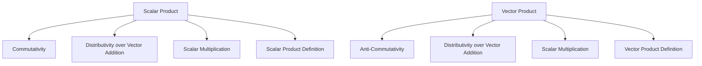
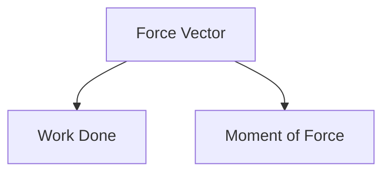

# Unit – III: Vectors

*(AI-generated self-study book for GTU, subject code 4300001 — generated locally with Ollama.)*

This module carries approximately **14 marks (4 Remember + 6 Understand + 4 Apply) (per syllabus)**.

Learning objectives covered by this module:
- 3.a. Apply the concept of algebraic operations of Vectors to solve given simple engineering problem(s)
- 3.b. Apply the concept of Scalar and Vector product to solve specified simple problem(s)
- 3.c. Solve problems of work done and moment of force using the concept of Vectors.

## 3.1 Vector, Addition, Subtraction, Magnitude and Direction

### 3.1.1 Definition of Vector
A **vector** is a mathematical entity that has both magnitude and direction. Vectors are used extensively in engineering to describe physical quantities such as force, velocity, and displacement. Vectors can be represented graphically as arrows, where the length of the arrow represents the magnitude and the direction of the arrow represents the direction of the vector.

### 3.1.2 Representation of Vectors
Vectors can be represented in component form or in terms of their magnitude and direction. In component form, a vector can be written as A = A_x i + A_y j + A_z k, where A_x, A_y, and A_z are the components of the vector along the x, y, and z axes, respectively, and i, j, and k are the unit vectors in the direction of the x, y, and z axes.

### 3.1.3 Addition of Vectors
To add two vectors, A and B, you can use the **parallelogram law** or the **tip-to-tail method**. The **parallelogram law** states that if two vectors are represented by the adjacent sides of a parallelogram, the diagonal of the parallelogram represents the sum of the two vectors. The **tip-to-tail method** involves placing the tail of the second vector at the tip of the first vector and then drawing a vector from the tail of the first vector to the tip of the second vector.

**Example:**
> **Example:** Add the vectors A = 3 i + 4 j and B = 2 i - 1 j.

- Using the tip-to-tail method:
  - Place the tail of B at the tip of A.
  - Draw a vector from the tail of A to the tip of B.

- Alternatively, using the component form:
  - A = 3 i + 4 j
  - B = 2 i - 1 j
  - A + B = (3 + 2) i + (4 - 1) j = 5 i + 3 j

### 3.1.4 Subtraction of Vectors
Subtracting one vector from another is similar to adding the negative of the vector. The negative of a vector A is - A, which has the same magnitude but the opposite direction.

**Example:**
> **Example:** Subtract the vector B = 2 i - 1 j from A = 3 i + 4 j.

- Using the component form:
  - A = 3 i + 4 j
  - B = 2 i - 1 j
  - A - B = (3 - 2) i + (4 - (-1)) j = 1 i + 5 j

### 3.1.5 Magnitude of a Vector
The **magnitude** of a vector A is the length of the vector and is denoted by | A |. The magnitude of a vector A = A_x i + A_y j + A_z k is calculated as:

[ |\vec{A}| = \sqrt{A_x^2 + A_y^2 + A_z^2} ]

**Example:**
> **Example:** Find the magnitude of the vector A = 3 i + 4 j.

- Using the formula:
  - | A | = 3² + 4² = 9 + 16 = 25 = 5

### 3.1.6 Direction of a Vector
The **direction** of a vector can be expressed in terms of its direction cosines or direction angles. The direction angles α, β, and γ are the angles that the vector makes with the positive x, y, and z axes, respectively. The direction cosines are given by:

[ \cos \alpha = \frac{A_x}{|\vec{A}|}, \quad \cos \beta = \frac{A_y}{|\vec{A}|}, \quad \cos \gamma = \frac{A_z}{|\vec{A}|} ]

**Example:**
> **Example:** Find the direction cosines and direction angles of the vector A = 3 i + 4 j.

- Magnitude of A is 5.
- Direction cosines:
  - α = 3 5
  - β = 4 5
  - γ = 0 (since there is no z-component)

- Direction angles:
  - α = ⁻¹( 3 5 ) ≈ 53.13^
  - β = ⁻¹( 4 5 ) ≈ 36.87^
  - γ = ⁻¹(0) = 90^

This section covers the fundamental concepts of vectors, including their addition, subtraction, magnitude, and direction, providing a solid foundation for solving engineering problems involving vectors.

---

## 3.2. Scalar and Vector Product and its Properties

### 3.2.1. Scalar Product (Dot Product)

The scalar product, also known as the dot product, is a binary operation that takes two vectors and returns a scalar. It is defined as:

[
\mathbf{A} \cdot \mathbf{B} = AB \cos \theta
]

where:
- A and B are vectors,
- A and B are the magnitudes of vectors A and B,
- θ is the angle between the vectors A and B.

The scalar product has several important properties:
- **Commutativity**: A · B = B · A
- **Distributivity over vector addition**: A · (B + C) = A · B + A · C
- **Scalar multiplication**: (cA) · B = c(A · B)

#### Example:
> **Example:** Given vectors A = 3i + 4j - 2k and B = 2i - 3j + 6k, find the scalar product A · B.

Solution:
1. Calculate the magnitudes of A and B:
   [
   A = \sqrt{3^2 + 4^2 + (-2)^2} = \sqrt{9 + 16 + 4} = \sqrt{29}
   ]
   [
   B = \sqrt{2^2 + (-3)^2 + 6^2} = \sqrt{4 + 9 + 36} = \sqrt{49} = 7
   ]

2. Find the angle θ between the vectors A and B using the dot product formula:
   [
   \mathbf{A} \cdot \mathbf{B} = AB \cos \theta
   ]
   [
   \mathbf{A} \cdot \mathbf{B} = (3\mathbf{i} + 4\mathbf{j} - 2\mathbf{k}) \cdot (2\mathbf{i} - 3\mathbf{j} + 6\mathbf{k})
   ]
   [
   = (3 \cdot 2) + (4 \cdot -3) + (-2 \cdot 6) = 6 - 12 - 12 = -18
   ]

3. Using the dot product formula:
   [
   -18 = \sqrt{29} \cdot 7 \cdot \cos \theta
   ]
   [
   \cos \theta = \frac{-18}{7\sqrt{29}}
   ]

Thus, the scalar product A · B = -18.

### 3.2.2. Vector Product (Cross Product)

The vector product, also known as the cross product, is a binary operation that takes two vectors and returns a vector that is perpendicular to both input vectors. It is defined as:

[
\mathbf{A} \times \mathbf{B} = \left| \begin{array}{ccc}
\mathbf{i} & \mathbf{j} & \mathbf{k} \\
A_x & A_y & A_z \\
B_x & B_y & B_z \\
\end{array} \right|
]

where:
- A = A_xi + A_yj + A_zk,
- B = B_xi + B_yj + B_zk.

The vector product has several important properties:
- **Anti-commutativity**: A × B = -(B × A)
- **Distributivity over vector addition**: A × (B + C) = A × B + A × C
- **Scalar multiplication**: (cA) × B = c(A × B)

#### Example:
> **Example:** Given vectors A = 3i + 4j - 2k and B = 2i - 3j + 6k, find the vector product A × B.

Solution:
1. Using the determinant method:
   [
   \mathbf{A} \times \mathbf{B} = \left| \begin{array}{ccc}
   \mathbf{i} & \mathbf{j} & \mathbf{k} \\
   3 & 4 & -2 \\
   2 & -3 & 6 \\
   \end{array} \right|
   ]
   [
   = \mathbf{i} \left( 4 \cdot 6 - (-2) \cdot (-3) \right) - \mathbf{j} \left( 3 \cdot 6 - (-2) \cdot 2 \right) + \mathbf{k} \left( 3 \cdot (-3) - 4 \cdot 2 \right)
   ]
   [
   = \mathbf{i} (24 - 6) - \mathbf{j} (18 + 4) + \mathbf{k} (-9 - 8)
   ]
   [
   = 18\mathbf{i} - 22\mathbf{j} - 17\mathbf{k}
   ]

Thus, the vector product A × B = 18i - 22j - 17k.

This section covers the essential properties of scalar and vector products, providing a clear understanding of both concepts and their applications.

---

## 3.3. Angle between two Vectors

### Definition and Importance
The **angle between two vectors** is a fundamental concept in vector algebra. It measures the smallest angle formed between two non-zero vectors in space. This concept is crucial in various engineering applications, including structural analysis, mechanical engineering, and physics.

### Definition
The angle θ between two vectors A and B can be found using the dot product (scalar product) formula:
[
\vec{A} \cdot \vec{B} = |\vec{A}| |\vec{B}| \cos \theta
]
where:
- A and B are the vectors,
- | A | and | B | are the magnitudes of vectors A and B,
- θ is the angle between the vectors.

### Finding the Angle
To find the angle θ, rearrange the formula:
[
\cos \theta = \frac{\vec{A} \cdot \vec{B}}{|\vec{A}| |\vec{B}|}
]
Then, θ can be determined by:
[
\theta = \cos^{-1} \left( \frac{\vec{A} \cdot \vec{B}}{|\vec{A}| |\vec{B}|} \right)
]

### Worked Example
> **Example:** Find the angle between the vectors A = 2 i + 3 j - k and B = - i + 2 j + 3 k.

**Step 1:** Calculate the dot product A · B:
[
\vec{A} \cdot \vec{B} = (2)(-1) + (3)(2) + (-1)(3) = -2 + 6 - 3 = 1
]

**Step 2:** Calculate the magnitudes of A and B:
[
|\vec{A}| = \sqrt{(2)^2 + (3)^2 + (-1)^2} = \sqrt{4 + 9 + 1} = \sqrt{14}
]
[
|\vec{B}| = \sqrt{(-1)^2 + (2)^2 + (3)^2} = \sqrt{1 + 4 + 9} = \sqrt{14}
]

**Step 3:** Use the formula to find θ:
[
\cos \theta = \frac{\vec{A} \cdot \vec{B}}{|\vec{A}| |\vec{B}|} = \frac{1}{\sqrt{14} \cdot \sqrt{14}} = \frac{1}{14}
]

**Step 4:** Find θ:
[
\theta = \cos^{-1} \left( \frac{1}{14} \right) \approx 85.94^\circ
]

Thus, the angle between the vectors A and B is approximately 85.94^.

---

## 3.4. Applications of Scalar and Vector Product (Work Done and Moment of Force)

### 3.4.1. Work Done by a Force

Work done by a force is a scalar quantity and is defined as the dot product of the force vector and the displacement vector. The formula for work done W is given by:

[ W = \vec{F} \cdot \vec{d} = Fd \cos \theta ]

where:
- F is the force vector,
- d is the displacement vector,
- F is the magnitude of the force,
- d is the magnitude of the displacement,
- θ is the angle between the force and displacement vectors.

#### **Example:**
> **Example:** A force of 50 N is applied to move an object 8 meters in the direction of the force. Calculate the work done.

1. **Given:**
   - Force, F = 50 N,
   - Displacement, d = 8 m,
   - Angle, θ = 0^ (since the force and displacement are in the same direction).

2. **Work Done:**
   [ W = \vec{F} \cdot \vec{d} = 50 \, \text{N} \times 8 \, \text{m} \times \cos 0^\circ ]
   [ W = 50 \times 8 \times 1 = 400 \, \text{J} ]

So, the work done is 400 J.

### 3.4.2. Moment of Force

The moment of force, also known as torque, is a vector quantity and is defined as the cross product of the position vector and the force vector. The formula for the moment of force τ is given by:

[ \vec{\tau} = \vec{r} \times \vec{F} = rF \sin \theta \, \vec{n} ]

where:
- r is the position vector from the point of application to the point of rotation,
- F is the force vector,
- r is the magnitude of the position vector,
- F is the magnitude of the force,
- θ is the angle between the position and force vectors,
- n is the unit vector perpendicular to the plane of r and F.

#### **Example:**
> **Example:** A force of 10 N is applied at a point 4 meters away from the pivot, at an angle of 30^ with respect to the line joining the pivot to the point of application. Calculate the moment of force.

1. **Given:**
   - Force, F = 10 N,
   - Position, r = 4 m,
   - Angle, θ = 30^.

2. **Moment of Force:**
   [ \vec{\tau} = \vec{r} \times \vec{F} = 4 \, \text{m} \times 10 \, \text{N} \times \sin 30^\circ ]
   [ \vec{\tau} = 4 \times 10 \times 0.5 = 20 \, \text{N} \cdot \text{m} ]

So, the moment of force is 20 N · m.

### Mermaid Diagram for Work Done and Moment of Force

This diagram visually represents the relationship between the force vector and the scalar quantities of work done and the vector quantity of moment of force.
