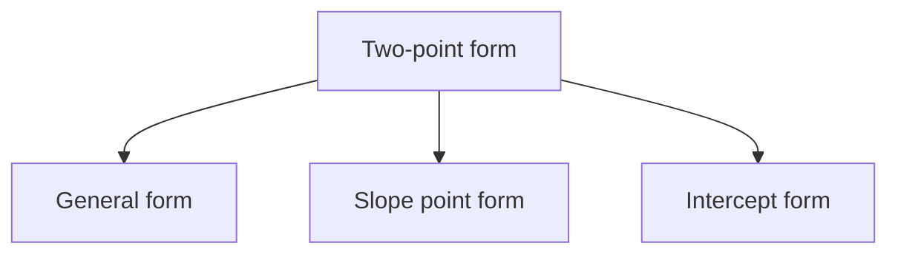
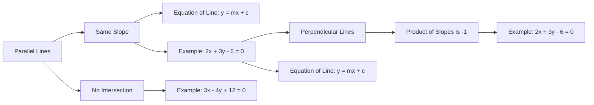
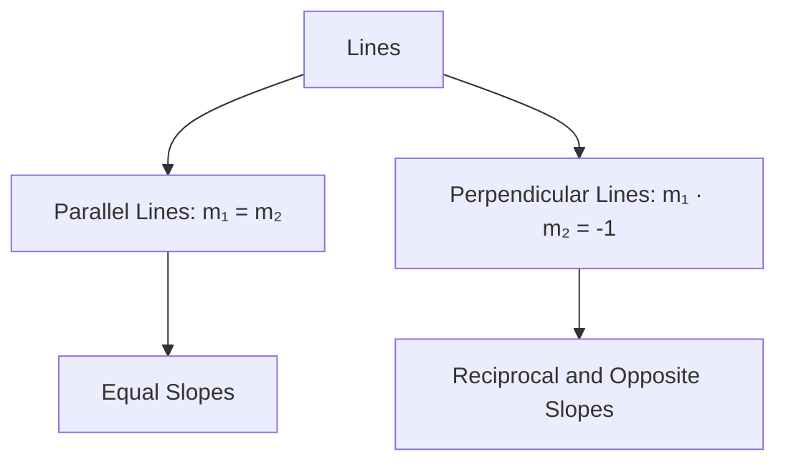

# Unit – IV: Coordinate Geometry

*(AI-generated self-study book for GTU, subject code 4300001 — generated locally with Ollama.)*

This module carries approximately **14 marks (4 Remember + 5 Understand + 5 Apply) (per syllabus)**.

Learning objectives covered by this module:
- 4.a. Employ the equation of straight line to solve given simple problems.
- 4.b. Apply the concept of slope and its consequences to
- 4.c. Find the angle between two lines using the concept of Parallel and Perpendicular lines.
- 4.d. Apply the concept of equation of circle with center and radius to solve the given problems.
- 4.e. Solve problems related to general equation of circle based on tangent and normal. perpendicular lines

## 4.1. Straight line (Two-point form) and slope of straight line

### 4.1.1 Definition and Equation of Straight Line

A **straight line** is a one-dimensional figure that extends infinitely in both directions. It can be defined using various forms of equations. One such form is the **two-point form**.

The **two-point form** of a straight line is given by the equation:

[
\frac{y - y_1}{y_2 - y_1} = \frac{x - x_1}{x_2 - x_1}
]

where (x₁, y₁) and (x₂, y₂) are the coordinates of two distinct points on the line.

### 4.1.2 Slope of a Straight Line

The **slope** of a straight line, denoted as m, is a measure of the steepness of the line. It is defined as the change in the vertical coordinate (y) divided by the change in the horizontal coordinate (x):

[
m = \frac{\Delta y}{\Delta x} = \frac{y_2 - y_1}{x_2 - x_1}
]

### 4.1.3 Example: Two-point form and Slope

> **Example:** Find the equation of the line passing through the points (2, 3) and (5, 7), and determine its slope.

1. **Step 1: Use the two-point form to find the equation of the line.**

[
\frac{y - 3}{7 - 3} = \frac{x - 2}{5 - 2}
]

Simplifying the equation:

[
\frac{y - 3}{4} = \frac{x - 2}{3}
]

Cross-multiplying to get the equation in the form Ax + By + C = 0:

[
3(y - 3) = 4(x - 2)
]

Expanding and simplifying:

[
3y - 9 = 4x - 8
]

[
4x - 3y + 1 = 0
]

2. **Step 2: Determine the slope of the line.**

Using the points (2, 3) and (5, 7):

[
m = \frac{7 - 3}{5 - 2} = \frac{4}{3}
]

Thus, the slope of the line is 4 3.

## 4.2. Slope point form, Intercept form, General form of line

### 4.2.1 Slope Point Form

The **slope point form** of a straight line is given by:

[
y - y_1 = m(x - x_1)
]

where (x₁, y₁) is a point on the line and m is the slope.

### 4.2.2 Intercept Form

The **intercept form** of a straight line is given by:

[
\frac{x}{a} + \frac{y}{b} = 1
]

where a is the x-intercept and b is the y-intercept.

### 4.2.3 General Form of a Line

The **general form** of a straight line is given by:

[
Ax + By + C = 0
]

where A, B, and C are constants, and A and B are not both zero.

### 4.2.4 Example: Converting to Different Forms

> **Example:** Convert the equation 2x - 3y + 6 = 0 to slope point form, intercept form, and slope-intercept form.

1. **Step 1: Slope Point Form**

First, convert the general form to the slope-intercept form y = mx + c:

[
2x - 3y + 6 = 0
]

[
-3y = -2x - 6
]

[
y = \frac{2}{3}x + 2
]

Here, m = 2 3 and c = 2. Using the point (0, 2):

[
y - 2 = \frac{2}{3}(x - 0)
]

Thus, the slope point form is:

[
y - 2 = \frac{2}{3}x
]

2. **Step 2: Intercept Form**

From the slope-intercept form y = 2 3 x + 2:

- The y-intercept b is 2.
- To find the x-intercept, set y = 0:

[
0 = \frac{2}{3}x + 2
]

[
-2 = \frac{2}{3}x
]

[
x = -3
]

Thus, the x-intercept a is -3.

The intercept form is:

[
\frac{x}{-3} + \frac{y}{2} = 1
]

3. **Step 3: Slope-Intercept Form**

From the general form 2x - 3y + 6 = 0, we already have:

[
y = \frac{2}{3}x + 2
]

Thus, the slope-intercept form is:

[
y = \frac{2}{3}x + 2
]

In summary, the conversions are as follows:

- **Slope Point Form:** y - 2 = 2 3 x
- **Intercept Form:** x -3 + y 2 = 1
- **Slope-Intercept Form:** y = 2 3 x + 2



---

## 4.3. Condition of Parallel and Mathematics Course Code: 4300001 NITTTR Bhopal – GTU - COGC-2021 Curriculum Topics and Sub-topics Solve the Given Problems.

### 4.3.1 Condition for Parallel Lines
Two lines are said to be **parallel** if they never intersect and are always the same distance apart. The condition for two lines to be parallel can be derived from their slopes. If the slopes of two lines are equal, the lines are parallel.

**Definition:** The slope of a line is the ratio of the vertical change to the horizontal change between any two points on the line. It is given by the formula:
[ m = \frac{y_2 - y_1}{x_2 - x_1} ]

**Condition for Parallel Lines:**
If two lines are parallel, their slopes are equal. Therefore, if the equations of the lines are in the form y = mx + c, the slopes m₁ and m₂ of the lines are equal:
[ m_1 = m_2 ]

**Example:**
Determine if the lines y = 2x + 3 and y = 2x - 5 are parallel.
> **Example:** The slopes of the lines are m₁ = 2 and m₂ = 2. Since m₁ = m₂, the lines are parallel.

### 4.3.2 Application of Condition for Parallel Lines
To solve problems related to parallel lines, you need to use the condition that the slopes of the lines are equal.

**Example:**
Find the equation of the line that passes through the point (4, 3) and is parallel to the line y = - 1 2 x + 5.
> **Example:** The slope of the given line is m = - 1 2. Since the new line is parallel, it will also have the slope m = - 1 2. Using the point-slope form of the line equation y - y₁ = m(x - x₁):
[ y - 3 = -\frac{1}{2}(x - 4) ]
Simplifying this equation:
[ y - 3 = -\frac{1}{2}x + 2 ]
[ y = -\frac{1}{2}x + 5 ]
So, the equation of the line is y = - 1 2 x + 5.

## 4.4. Equations of Parallel Lines and Perpendicular Lines to the Given Lines

### 4.4.1 Equations of Parallel Lines
If two lines are parallel, they have the same slope. The general form of the equation of a line is y = mx + c. If a line is parallel to another line with slope m, it will also have the same slope m.

**Example:**
Find the equation of the line parallel to 3x - 4y + 12 = 0 and passing through the point (2, 3).
> **Example:** First, convert the given line equation to the slope-intercept form y = mx + c:
[ 3x - 4y + 12 = 0 ]
[ -4y = -3x - 12 ]
[ y = \frac{3}{4}x + 3 ]
The slope of the given line is m = 3 4. Since the line is parallel, it will also have the slope m = 3 4. Using the point-slope form of the line equation:
[ y - 3 = \frac{3}{4}(x - 2) ]
Simplifying this equation:
[ y - 3 = \frac{3}{4}x - \frac{3}{2} ]
[ y = \frac{3}{4}x - \frac{3}{2} + 3 ]
[ y = \frac{3}{4}x + \frac{3}{2} ]
So, the equation of the line is y = 3 4 x + 3 2.

### 4.4.2 Equations of Perpendicular Lines
Two lines are **perpendicular** if the product of their slopes is -1. If the slope of one line is m₁, the slope of the line perpendicular to it is m₂ = - 1 m₁.

**Example:**
Find the equation of the line perpendicular to 2x + 3y - 6 = 0 and passing through the point (1, 2).
> **Example:** First, convert the given line equation to the slope-intercept form y = mx + c:
[ 2x + 3y - 6 = 0 ]
[ 3y = -2x + 6 ]
[ y = -\frac{2}{3}x + 2 ]
The slope of the given line is m = - 2 3. Since the line is perpendicular, the slope of the new line will be m = 3 2. Using the point-slope form of the line equation:
[ y - 2 = \frac{3}{2}(x - 1) ]
Simplifying this equation:
[ y - 2 = \frac{3}{2}x - \frac{3}{2} ]
[ y = \frac{3}{2}x - \frac{3}{2} + 2 ]
[ y = \frac{3}{2}x + \frac{1}{2} ]
So, the equation of the line is y = 3 2 x + 1 2.

### Mermaid Diagram for Parallel and Perpendicular Lines


This section covers the condition for parallel lines, solving problems involving parallel lines, and finding equations of perpendicular lines, all tailored to the given syllabus requirements.

---

## 4.5. Angle between two lines.

### Definition and Importance
**Angle between two lines:** The angle between two lines is the smallest angle formed between them. It is always measured in the range of 0^ to 180^.

### Slope of a Line
The **slope** (m) of a line is defined as the tangent of the angle θ that the line makes with the positive direction of the x-axis. The slope can be calculated using the formula:
[ m = \tan \theta ]

### Angle Between Two Lines
To find the angle between two lines with slopes m₁ and m₂, the formula is:
[ \tan \theta = \left| \frac{m_1 - m_2}{1 + m_1 m_2} \right| ]
where θ is the angle between the two lines.

### Parallel and Perpendicular Lines
- **Parallel Lines:** Two lines are parallel if their slopes are equal, i.e., m₁ = m₂.
- **Perpendicular Lines:** Two lines are perpendicular if the product of their slopes is -1, i.e., m₁ · m₂ = -1.

### Worked Example
> **Example:** Find the angle between the lines y = 2x + 3 and y = - 1 2 x + 5.

1. Identify the slopes of the lines:
   - For the line y = 2x + 3, the slope m₁ = 2.
   - For the line y = - 1 2 x + 5, the slope m₂ = - 1 2.

2. Use the formula to find the angle θ:
   [
   \tan \theta = \left| \frac{2 - \left(-\frac{1}{2}\right)}{1 + 2 \cdot \left(-\frac{1}{2}\right)} \right| = \left| \frac{2 + \frac{1}{2}}{1 - 1} \right| = \left| \frac{\frac{5}{2}}{0} \right|
   ]
   Since the denominator is zero, the lines are perpendicular.

3. Therefore, the angle between the lines is 90^.

### Mermaid Diagram


## 4.6. Equation of Circle with Center and Radius

### Definition
The **equation of a circle** with center (h, k) and radius r is given by:
[ (x - h)^2 + (y - k)^2 = r^2 ]

### Derivation
Consider a circle with center (h, k) and radius r. Any point (x, y) on the circle will satisfy the distance formula:
[ \sqrt{(x - h)^2 + (y - k)^2} = r ]
Squaring both sides, we get:
[ (x - h)^2 + (y - k)^2 = r^2 ]

### Tangent and Normal
- **Tangent:** A line that touches the circle at exactly one point.
- **Normal:** A line that is perpendicular to the tangent at the point of contact.

### Worked Example
> **Example:** Find the equation of a circle with center at (3, -2) and radius 5.

1. Identify the center and radius:
   - Center (h, k) = (3, -2)
   - Radius r = 5

2. Substitute the values into the standard form of the equation:
   [
   (x - 3)^2 + (y + 2)^2 = 5^2
   ]
   Simplify:
   [
   (x - 3)^2 + (y + 2)^2 = 25
   ]

### Mermaid Diagram
```mermaid
flowchart TD
    A[Circle Equation] --> B[Standard Form: (x - h)² + (y - k)² = r²]
    B --> C[Identify Center (h, k)]
    C --> D[Identify Radius r]
    D --> E[Substitute into Standard Form]
    E --> F[Equation: (x - 3)² + (y + 2)² = 25]
```

This section covers the essential concepts and provides worked examples to help students apply these concepts effectively.

---

## 4.7. General equation of circle.

The general equation of a circle is a fundamental concept in coordinate geometry. It is essential for solving a variety of problems involving circles, such as finding the center, radius, and points of tangency.

### **4.7.1. Definition of the General Equation of a Circle**

The general equation of a circle is given by:
[ x^2 + y^2 + Dx + Ey + F = 0 ]

- **D, E, and F** are constants.
- The circle can be centered at (h, k) with radius r.

To convert this general form to the standard form (x - h)² + (y - k)² = r², complete the square for both x and y.

### **4.7.2. Finding the Center and Radius from the General Equation**

Given the general equation of a circle x² + y² + Dx + Ey + F = 0, the center (h, k) and radius r can be found as follows:

1. **Complete the Square:**
   [ x^2 + Dx + y^2 + Ey + F = 0 ]
   [ \left(x + \frac{D}{2}\right)^2 - \left(\frac{D}{2}\right)^2 + \left(y + \frac{E}{2}\right)^2 - \left(\frac{E}{2}\right)^2 + F = 0 ]
   [ \left(x + \frac{D}{2}\right)^2 + \left(y + \frac{E}{2}\right)^2 = \left(\frac{D}{2}\right)^2 + \left(\frac{E}{2}\right)^2 - F ]

2. **Identify the Center and Radius:**
   [ \left(x + \frac{D}{2}\right)^2 + \left(y + \frac{E}{2}\right)^2 = \left(\frac{\sqrt{D^2 + E^2 - 4F}}{2}\right)^2 ]
   - The center of the circle is (- D 2 , - E 2 ).
   - The radius r is D² + E² - 4F 2.

> **Example:**  
> Convert the general equation x² + y² - 6x + 4y - 12 = 0 to the standard form and find the center and radius.
>
> **Solution:**
> [ x^2 - 6x + y^2 + 4y - 12 = 0 ]
> [ \left(x - 3\right)^2 - 9 + \left(y + 2\right)^2 - 4 - 12 = 0 ]
> [ \left(x - 3\right)^2 + \left(y + 2\right)^2 = 25 ]
> - The center is (3, -2).
> - The radius is 5.

### **4.7.3. Applications of the General Equation of a Circle**

- **Example Application:**
  Determine the equation of a circle with center at (3, -2) and radius 5.
  [ (x - 3)^2 + (y + 2)^2 = 25 ]
  - Expanding this, we get:
  [ x^2 - 6x + 9 + y^2 + 4y + 4 = 25 ]
  [ x^2 + y^2 - 6x + 4y - 12 = 0 ]

## 4.8. Tangent and normal to a circle.

The concepts of tangent and normal lines to a circle are crucial for understanding the geometric properties and solving problems related to circles.

### **4.8.1. Tangent to a Circle**

A tangent to a circle at a point is a line that touches the circle at exactly one point. The slope of the tangent can be found using the derivative of the circle's equation or by using the concept of perpendicularity.

### **4.8.2. Equation of the Tangent Line**

The equation of the tangent line to the circle x² + y² = r² at the point (x₁, y₁) is given by:
[ x_1 x + y_1 y = r^2 ]

### **4.8.3. Normal to a Circle**

The normal to a circle at a point is a line that is perpendicular to the tangent at that point and passes through the center of the circle.

### **4.8.4. Finding the Tangent and Normal at a Given Point**

To find the tangent and normal at a point (x₁, y₁) on the circle x² + y² = r²:

1. **Tangent Line:**
   [ x_1 x + y_1 y = r^2 ]

2. **Normal Line:**
   - The slope of the tangent is - x₁ y₁.
   - The slope of the normal is the negative reciprocal, y₁ x₁.
   - The equation of the normal is:
   [ \frac{y - y_1}{x - x_1} = \frac{y_1}{x_1} ]

> **Example:**  
> Find the equations of the tangent and normal to the circle x² + y² = 25 at the point (3, 4).
>
> **Solution:**
> - **Tangent Line:**
>   [ 3x + 4y = 25 ]
> - **Normal Line:**
>   - Slope of the tangent: - 3 4.
>   - Slope of the normal: 4 3.
>   - Equation of the normal:
>   [ \frac{y - 4}{x - 3} = \frac{4}{3} ]
>   [ 3(y - 4) = 4(x - 3) ]
>   [ 3y - 12 = 4x - 12 ]
>   [ 4x - 3y = 0 ]

These sections cover the essential aspects of the general equation of a circle and the tangent and normal to a circle. Each example provided is designed to help students apply these concepts effectively.
