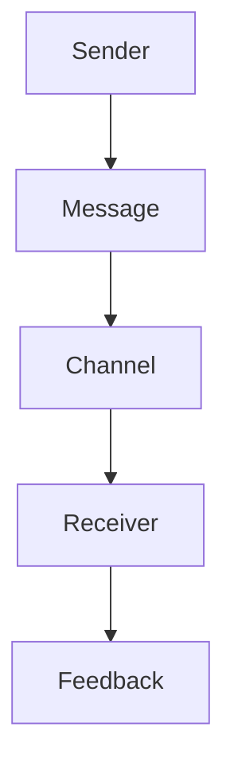
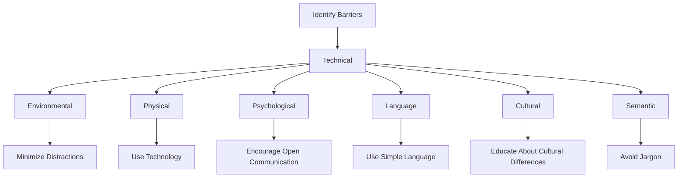

# Unit – 1: Theory of Communi- cation

*(AI-generated self-study book for GTU, subject code 4300002 — generated locally with Ollama.)*

This module carries approximately ****.

Learning objectives covered by this module:
- 1.a. Define the theory of communication
- 1.b. State different types of communication.
- 1.c. Explain barriers in communication
- 1.d. Communicate effectively

## 2.1. Parts of Speech Noun, Pronoun, Verb, Adjective, Adverb and Interjection- Meaning and Examples (Recapitulation) Prepositions- In, into, On, At, for, Since, between, among, to, towards Connectors - If, Unless, Otherwise, Because, Therefore, Who, Which, Where, When, Why.

### 2.1.1. Nouns
**Noun:** A noun is a word used to name a person, place, thing, or idea. Nouns can be singular or plural.

- **Example:**
  > **Example:** The **book** is on the table. (Singular noun)
  > **Example:** The **books** are in the bag. (Plural noun)

### 2.1.2. Pronouns
**Pronoun:** A pronoun is a word that takes the place of a noun. Pronouns are used to avoid repetition of nouns and to make writing more concise.

- **Example:**
  > **Example:** She read the book. (Pronoun)
  > **Example:** We will go to the park. (Pronoun)

### 2.1.3. Verbs
**Verb:** A verb is a word that expresses an action, occurrence, or state of being. Verbs are the main part of a sentence that describe what the subject is doing.

- **Example:**
  > **Example:** She reads the book. (Verb: reads)
  > **Example:** The book is on the table. (Verb: is)

### 2.1.4. Adjectives
**Adjective:** An adjective is a word that modifies a noun or a pronoun. Adjectives describe or give more information about the noun or pronoun.

- **Example:**
  > **Example:** The **big** book is on the table. (Adjective: big)
  > **Example:** She read the **interesting** book. (Adjective: interesting)

### 2.1.5. Adverbs
**Adverb:** An adverb is a word that modifies a verb, an adjective, or another adverb. Adverbs usually express manner, place, time, or frequency.

- **Example:**
  > **Example:** She reads the book **quickly**. (Adverb: quickly)
  > **Example:** The book is **on** the table. (Adverb: on)

### 2.1.6. Interjections
**Interjection:** An interjection is a word used to express sudden feelings or emotions. Interjections are often followed by an exclamation mark.

- **Example:**
  > **Example:** Ouch! That hurt. (Interjection: Ouch)

### 2.1.7. Prepositions
**Preposition:** A preposition is a word that shows the relationship between a noun or pronoun and other words in a sentence. Common prepositions include in, into, on, at, for, since, between, among, to, towards.

- **Example:**
  > **Example:** The book is **in** the bag. (Preposition: in)
  > **Example:** He went **to** the store. (Preposition: to)

### 2.1.8. Connectors
**Connectors:** Connectors are words that link parts of a sentence or connect sentences. Common connectors include if, unless, otherwise, because, therefore, who, which, where, when, why.

- **Example:**
  > **Example:** If it rains, we will stay inside. (Connector: If)
  > **Example:** Because it rained, we stayed inside. (Connector: Because)
  > **Example:** We will go to the park, where we can play. (Connector: Where)

### 2.1.9. Sentence Patterns and Word Order
Identifying and using basic sentence patterns correctly is essential for proper communication. A typical sentence pattern includes a subject, verb, and object. Understanding and using correct word order is crucial.

- **Example:**
  > **Example:** The teacher **gave** the students **books**. (Subject: The teacher, Verb: gave, Object: the students, Object complement: books)

## 2.2. Tenses
Tenses are used to indicate the time of an action or state. English has three main tenses: simple present, simple past, and simple future.

### 2.2.1. Simple Present Tense
The simple present tense is used to describe habitual actions, general truths, or future timetables.

- **Example:**
  > **Example:** She **reads** the book every day. (Simple present for habitual actions)
  > **Example:** The book **is** on the table. (Simple present for general truths)

### 2.2.2. Simple Past Tense
The simple past tense is used to describe actions that happened in the past.

- **Example:**
  > **Example:** She **read** the book yesterday. (Simple past for actions in the past)

### 2.2.3. Simple Future Tense
The simple future tense is used to describe actions that will happen in the future.

- **Example:**
  > **Example:** She **will read** the book tomorrow. (Simple future for future actions)

### 2.2.4. Practice Example
> **Example:** 
  - **Given:** She **reads** the book every day.
  - **Rewrite in the past tense:** She **read** the book every day.
  - **Rewrite in the future tense:** She **will read** the book every day.

This section covers the basic parts of speech and tenses, essential for day-to-day communication and academic writing. Practicing these will help improve your language skills.

---

## 1.2. Basic Communication Model (S+M+C+R+F)

### 1.2.1. Introduction to the Basic Communication Model

The basic communication model consists of five key components: Sender (S), Message (M), Channel (C), Receiver (R), and Feedback (F). Understanding these components is essential for effective communication.

- **Sender (S):** The sender is the individual who initiates the communication by encoding the message.
- **Message (M):** The message is the information or idea that the sender wants to convey to the receiver.
- **Channel (C):** The channel is the medium through which the message is transmitted, such as verbal, written, or non-verbal communication.
- **Receiver (R):** The receiver is the individual who receives and decodes the message.
- **Feedback (F):** Feedback is the response from the receiver to the sender, which helps in understanding the effectiveness of the communication.

### 1.2.2. Components of the Basic Communication Model

The basic communication model can be represented as follows:

### 1.2.3. Example of the Basic Communication Model

> **Example:**  
> Consider a scenario where a manager (S) needs to give feedback to an employee (R) about a recent project. The manager decides to write a detailed report (M) and sends it via email (C). The employee receives the email and reviews the report, providing detailed comments and suggestions (F) back to the manager.

### 1.2.4. Importance of Each Component

- **Sender (S):** The sender's clarity and accuracy in encoding the message are crucial. For instance, if a manager uses technical jargon without explanation, the employee might not understand the message fully.
  
- **Message (M):** The message should be clear, concise, and appropriate for the receiver. For example, if the manager needs to convey a sensitive issue, a formal written message might be more effective than an informal verbal message.

- **Channel (C):** The choice of channel can significantly impact the effectiveness of communication. For urgent matters, a phone call might be more effective than an email. In a formal setting, a written report might be more appropriate.

- **Receiver (R):** The receiver must be attentive and open to the message. For instance, if an employee is distracted while reading a report, they might miss important details.

- **Feedback (F):** Feedback is crucial for the sender to understand if the message was received and understood correctly. For example, if the manager does not receive any response from the employee, they might need to clarify the message or use another channel.

### 1.2.5. Practical Application

> **Example:**  
> Suppose a marketing team (S) needs to communicate a new advertising campaign to the sales team (R). The team decides to use a detailed presentation (M) and sends it via a video conference (C). During the meeting, the sales team (R) provides immediate feedback (F) on the campaign's potential impact.

In this example, the marketing team (S) effectively uses a video conference (C) to convey a detailed message (M) about the advertising campaign. The sales team (R) provides immediate feedback (F), ensuring that the campaign is understood and implemented correctly.

### 1.2.6. Summary

The basic communication model (S+M+C+R+F) is a fundamental concept in understanding effective communication. By considering each component, senders and receivers can ensure that messages are clear, accurate, and well-received. Feedback is essential for continuous improvement and understanding.

By applying this model, students and professionals can enhance their communication skills, leading to more successful interactions in both personal and professional contexts.

---

## 1.3. Types of Communication

Communication can be broadly classified into several types based on various criteria such as the medium used, the context, the mode, and the participants involved. Understanding these types is crucial for effective communication in various professional and personal scenarios.

### 1.3.1. Verbal Communication

Verbal communication involves the use of spoken words to convey messages. It can be further divided into two subcategories: 

- **1.3.1.1. Oral Communication**
  - **Definition:** Oral communication involves the use of spoken language to exchange ideas and information. This can occur in face-to-face interactions, over the phone, or through video calls.
  - **Example:** During a team meeting, a manager verbally explains project timelines and goals to the team members.

- **1.3.1.2. Written Communication**
  - **Definition:** Written communication involves the use of written language to convey messages. This can be in the form of emails, reports, memos, or written instructions.
  - **Example:** A technical support team sends detailed troubleshooting instructions via email to a customer.

### 1.3.2. Non-Verbal Communication

Non-verbal communication refers to the use of body language, gestures, facial expressions, and other physical actions to convey messages. It often complements or contradicts verbal messages.

- **1.3.2.1. Body Language**
  - **Definition:** Body language involves the use of posture, gestures, and facial expressions to communicate without words. It often conveys emotions and attitudes.
  - **Example:** During a presentation, a speaker stands with crossed arms, which might indicate defensiveness or reluctance to engage with the audience.

- **1.3.2.2. Paralanguage**
  - **Definition:** Paralanguage includes vocal elements such as tone, pitch, volume, and rate of speech that accompany the verbal message.
  - **Example:** A manager speaks in a monotone voice, which might indicate disinterest or boredom during a presentation.

### 1.3.3. Formal Communication

Formal communication refers to structured and official channels of communication within an organization. It is typically documented and follows a specific format.

- **1.3.3.1. Formal Written Communication**
  - **Definition:** Formal written communication includes documents such as letters, reports, and memos that are used for official purposes.
  - **Example:** A company’s HR department sends a formal memo to all employees regarding a new company policy.

- **1.3.3.2. Formal Oral Communication**
  - **Definition:** Formal oral communication includes speeches, presentations, and meetings that are conducted in an official setting.
  - **Example:** A CEO delivers a formal address to the entire organization during the annual general meeting.

### 1.3.4. Informal Communication

Informal communication refers to the spontaneous and unstructured exchange of information outside of formal channels. It often happens in social settings and can be highly influential.

- **1.3.4.1. Informal Written Communication**
  - **Definition:** Informal written communication includes personal emails, social media posts, and text messages.
  - **Example:** Team members use a company chat platform to discuss project ideas and collaborate informally.

- **1.3.4.2. Informal Oral Communication**
  - **Definition:** Informal oral communication includes casual conversations, water-cooler talks, and informal gatherings.
  - **Example:** Colleagues gather in the break room to discuss the weekend’s events and share informal feedback on ongoing projects.

### 1.3.5. Internal and External Communication

Internal communication refers to the exchange of information within an organization, while external communication involves interactions with parties outside the organization.

- **1.3.5.1. Internal Communication**
  - **Definition:** Internal communication involves the flow of information between employees, departments, and levels of management within an organization.
  - **Example:** A project manager communicates progress updates to the team during daily stand-up meetings.

- **1.3.5.2. External Communication**
  - **Definition:** External communication involves interactions with stakeholders such as customers, suppliers, and the public.
  - **Example:** A marketing department launches a new advertising campaign to promote the company’s products.

### 1.3.6. One-way and Two-way Communication

Communication can be either one-way or two-way, depending on whether the receiver has the opportunity to respond.

- **1.3.6.1. One-way Communication**
  - **Definition:** One-way communication involves the transmission of information from the sender to the receiver without any feedback.
  - **Example:** A CEO makes a speech at a company event where the audience listens but does not have the opportunity to ask questions or provide feedback.

- **1.3.6.2. Two-way Communication**
  - **Definition:** Two-way communication involves a dialogue where the sender and receiver exchange information and can provide feedback.
  - **Example:** During a workshop, participants are encouraged to ask questions and share their thoughts, fostering an interactive and collaborative environment.

### 1.3.7. Formal and Informal Groups

Communication can also be categorized based on the nature of the group involved.

- **1.3.7.1. Formal Groups**
  - **Definition:** Formal groups are structured and have defined roles and responsibilities.
  - **Example:** A project team where each member has a specific role and responsibilities.

- **1.3.7.2. Informal Groups**
  - **Definition:** Informal groups are spontaneously formed and lack formal structure.
  - **Example:** A group of colleagues who form a book club outside their professional roles.

### 1.3.8. Intercultural Communication

Intercultural communication involves the exchange of information across different cultural contexts.

- **1.3.8.1. Definition**
  - **Definition:** Intercultural communication involves understanding and adapting to different cultural norms, values, and communication styles.
  - **Example:** A global company’s HR manager prepares a cross-cultural communication training program for employees from diverse backgrounds.

### 1.3.9. Horizontal and Vertical Communication

Horizontal and vertical communication refer to the direction of the communication flow within an organization.

- **1.3.9.1. Horizontal Communication**
  - **Definition:** Horizontal communication occurs between peers or colleagues at the same level in the organization.
  - **Example:** Colleagues in the same department discuss project progress and share ideas.

- **1.3.9.2. Vertical Communication**
  - **Definition:** Vertical communication occurs between different levels of management within the organization, such as between managers and subordinates.
  - **Example:** A senior manager provides instructions and feedback to a junior employee during a performance review.

### 1.3.10. Formal and Informal Communication Channels

Formal and informal communication channels refer to the methods through which information is exchanged.

- **1.3.10.1. Formal Channels**
  - **Definition:** Formal channels are structured and follow established procedures and protocols.
  - **Example:** An official email sent through the company’s internal email system.

- **1.3.10.2. Informal Channels**
  - **Definition:** Informal channels are spontaneous and often unstructured.
  - **Example:** A quick chat over the phone between colleagues.

### 1.3.11. Internal and External Communication

Internal and external communication are further differentiated based on the audience.

- **1.3.11.1. Internal Communication**
  - **Definition:** Internal communication involves the flow of information within the organization.
  - **Example:** A manager shares project updates with the team during a weekly meeting.

- **1.3.11.2. External Communication**
  - **Definition:** External communication involves interactions with stakeholders outside the organization.
  - **Example:** A company spokesperson gives a press conference to address recent market trends.

### 1.3.12. Formal and Informal Communication

Formal and informal communication can also be categorized based on the type of content.

- **1.3.12.1. Formal Communication**
  - **Definition:** Formal communication involves structured and official exchanges of information.
  - **Example:** A company’s internal newsletter that follows a specific format and is distributed to all employees.

- **1.3.12.2. Informal Communication**
  - **Definition:** Informal communication involves spontaneous and unstructured exchanges of information.
  - **Example:** A quick chat between colleagues about a personal matter.

### 1.3.13. One-way and Two-way Communication

One-way and two-way communication can also be differentiated based on the interaction.

- **1.3.13.1. One-way Communication**
  - **Definition:** One-way communication involves the transmission of information without any feedback.
  - **Example:** A manager gives a presentation to the team without allowing questions or discussion.

- **1.3.13.2. Two-way Communication**
  - **Definition:** Two-way communication involves a dialogue where both parties can exchange information and provide feedback.
  - **Example:** During a workshop, participants actively engage in discussions and share their thoughts.

### 1.3.14. Formal and Informal Groups

Formal and informal groups can also be categorized based on the communication style.

- **1.3.14.1. Formal Groups**
  - **Definition:** Formal groups have structured communication and roles.
  - **Example:** A project team with defined roles and responsibilities.

- **1.3.14.2. Informal Groups**
  - **Definition:** Informal groups have flexible communication and roles.
  - **Example:** A group of colleagues who form a book club.

### 1.3.15. Intercultural Communication

Intercultural communication can also be differentiated based on the cultural context.

- **1.3.15.1. Intercultural Communication**
  - **Definition:** Intercultural communication involves understanding and adapting to different cultural norms, values, and communication styles.
  - **Example:** A global company’s HR manager prepares a cross-cultural communication training program for employees from diverse backgrounds.

### 1.3.16. Horizontal and Vertical Communication

Horizontal and vertical communication can be further differentiated based on the organizational structure.

- **1.3.16.1. Horizontal Communication**
  - **Definition:** Horizontal communication occurs between peers or colleagues at the same level.
  - **Example:** Colleagues in the same department discuss project progress and share ideas.

- **1.3.16.2. Vertical Communication**
  - **Definition:** Vertical communication occurs between different levels of management.
  - **Example:** A senior manager provides instructions and feedback to a junior employee during a performance review.

### 1.3.17. Formal and Informal Communication Channels

Formal and informal communication channels can be further differentiated based on the medium.

- **1.3.17.1. Formal Channels**
  - **Definition:** Formal channels are structured and follow established procedures.
  - **Example:** An official email sent through the company’s internal email system.

- **1.3.17.2. Informal Channels**
  - **Definition:** Informal channels are spontaneous and often unstructured.
  - **Example:** A quick chat between colleagues over the phone.

### 1.3.18. Internal and External Communication

Internal and external communication can be further differentiated based on the audience.

- **1.3.18.1. Internal Communication**
  - **Definition:** Internal communication involves the flow of information within the organization.
  - **Example:** A manager shares project updates with the team during a weekly meeting.

- **1.3.18.2. External Communication**
  - **Definition:** External communication involves interactions with stakeholders outside the organization.
  - **Example:** A company spokesperson gives a press conference to address recent market trends.

### 1.3.19. Formal and Informal Communication

Formal and informal communication can be further differentiated based on the content.

- **1.3.19.1. Formal Communication**
  - **Definition:** Formal communication involves structured and official exchanges of information.
  - **Example:** A company’s internal newsletter that follows a specific format and is distributed to all employees.

- **1.3.19.2. Informal Communication**
  - **Definition:** Informal communication involves spontaneous and unstructured exchanges of information.
  - **Example:** A quick chat between colleagues about a personal matter.

### 1.3.20. One-way and Two-way Communication

One-way and two-way communication can be further differentiated based on the interaction.

- **1.3.20.1. One-way Communication**
  - **Definition:** One-way communication involves the transmission of information without any feedback.
  - **Example:** A manager gives a presentation to the team without allowing questions or discussion.

- **1.3.20.2. Two-way Communication**
  - **Definition:** Two-way communication involves a dialogue where both parties can exchange information and provide feedback.
  - **Example:** During a workshop, participants actively engage in discussions and share their thoughts.

### 1.3.21. Formal and Informal Groups

Formal and informal groups can be further differentiated based on the communication style.

- **1.3.21.1. Formal Groups**
  - **Definition:** Formal groups have structured communication and roles.
  - **Example:** A project team with defined roles and responsibilities.

- **1.3.21.2. Informal Groups**
  - **Definition:** Informal groups have flexible communication and roles.
  - **Example:** A group of colleagues who form a book club.

### 1.3.22. Intercultural Communication

Intercultural communication can be further differentiated based on the cultural context.

- **1.3.22.1. Intercultural Communication**
  - **Definition:** Intercultural communication involves understanding and adapting to different cultural norms, values, and communication styles.
  - **Example:** A global company’s HR manager prepares a cross-cultural communication training program for employees from diverse backgrounds.

### 1.3.23. Horizontal and Vertical Communication

Horizontal and vertical communication can be further differentiated based on the organizational structure.

- **1.3.23.1. Horizontal Communication**
  - **Definition:** Horizontal communication occurs between peers or colleagues at the same level.
  - **Example:** Colleagues in the same department discuss project progress and share ideas.

- **1.3.23.2. Vertical Communication**
  - **Definition:** Vertical communication occurs between different levels of management.
  - **Example:** A senior manager provides instructions and feedback to a junior employee during a performance review.

### 1.3.24. Formal and Informal Communication Channels

Formal and informal communication channels can be further differentiated based on the medium.

- **1.3.24.1. Formal Channels**
  - **Definition:** Formal channels are structured and follow established procedures.
  - **Example:** An official email sent through the company’s internal email system.

- **1.3.24.2. Informal Channels**
  - **Definition:** Informal channels are spontaneous and often unstructured.
  - **Example:** A quick chat between colleagues over the phone.

### 1.3.25. Internal and External Communication

Internal and external communication can be further differentiated based on the audience.

- **1.3.25.1. Internal Communication**
  - **Definition:** Internal communication involves the flow of information within the organization.
  - **Example:** A manager shares project updates with the team during a weekly meeting.

- **1.3.25.2. External Communication**
  - **Definition:** External communication involves interactions with stakeholders outside the organization.
  - **Example:** A company spokesperson gives a press conference to address recent market trends.

### 1.3.26. Formal and Informal Communication

Formal and informal communication can be further differentiated based on the content.

- **1.3.26.1. Formal Communication**
  - **Definition:** Formal communication involves structured and official exchanges of information.
  - **Example:** A company’s internal newsletter that follows a specific format and is distributed to all employees.

- **1.3.26.2. Informal Communication**
  - **Definition:** Informal communication involves spontaneous and unstructured exchanges of information.
  - **Example:** A quick chat between colleagues about a personal matter.

### 1.3.27. One-way and Two-way Communication

One-way and two-way communication can be further differentiated based on the interaction.

- **1.3.27.1. One-way Communication**
  - **Definition:** One-way communication involves the transmission of information without any feedback.
  - **Example:** A manager gives a presentation to the team without allowing questions or discussion.

- **1.3.27.2. Two-way Communication**
  - **Definition:** Two-way communication involves a dialogue where both parties can exchange information and provide feedback.
  - **Example:** During a workshop, participants actively engage in discussions and share their thoughts.

### 1.3.28. Formal and Informal Groups

Formal and informal groups can be further differentiated based on the communication style.

- **1.3.28.1. Formal Groups**
  - **Definition:** Formal groups have structured communication and roles.
  - **Example:** A project team with defined roles and responsibilities.

- **1.3.28.2. Informal Groups**
  - **Definition:** Informal groups have flexible communication and roles.
  - **Example:** A group of colleagues who form a book club.

### 1.3.29. Intercultural Communication

Intercultural communication can be further differentiated based on the cultural context.

- **1.3.29.1. Intercultural Communication**
  - **Definition:** Intercultural communication involves understanding and adapting to different cultural norms, values, and communication styles.
  - **Example:** A global company’s HR manager prepares a cross-cultural communication training program for employees from diverse backgrounds.

### 1.3.30. Horizontal and Vertical Communication

Horizontal and vertical communication can be further differentiated based on the organizational structure.

- **1.3.30.1. Horizontal Communication**
  - **Definition:** Horizontal communication occurs between peers or colleagues at the same level.
  - **Example:** Colleagues in the same department discuss project progress and share ideas.

- **1.3.30.2. Vertical Communication**
  - **Definition:** Vertical communication occurs between different levels of management.
  - **Example:** A senior manager provides instructions and feedback to a junior employee during a performance review.

### 1.3.31. Formal and Informal Communication Channels

Formal and informal communication channels can be further differentiated based on the medium.

- **1.3.31.1. Formal Channels**
  - **Definition:** Formal channels are structured and follow established procedures.
  - **Example:** An official email sent through the company’s internal email system.

- **1.3.31.2. Informal Channels**
  - **Definition:** Informal channels are spontaneous and often unstructured.
  - **Example:** A quick chat between colleagues over the phone.

### 1.3.32. Internal and External Communication

Internal and external communication can be further differentiated based on the audience.

- **1.3.32.1. Internal Communication**
  - **

---

## 1.4. Barriers of Effective Communication

### Definition and Importance of Barriers in Communication
Communication barriers are obstacles that hinder the transmission of information between the sender and the receiver. These barriers can occur at any stage of the communication process, from encoding to decoding. Effective communication is crucial in various fields, including business, education, and personal relationships. Barriers can lead to misunderstandings, misinterpretations, and ultimately, ineffective communication.

### Types of Communication Barriers

- **Technical Barriers:** These involve issues related to the tools and technology used for communication. For example, poor internet connectivity, outdated software, or lack of necessary equipment.
  
- **Environmental Barriers:** These are external factors that can interfere with communication. Examples include noise, lighting, or distractions in the environment.
  
- **Physical Barriers:** These are physical obstacles that prevent direct communication. Examples include distance, walls, or the use of a phone or video call instead of face-to-face interaction.
  
- **Psychological Barriers:** These are mental or emotional obstacles that can affect the effectiveness of communication. Examples include stress, anxiety, or personal biases.
  
- **Language Barriers:** These occur when the sender and receiver do not share a common language. This can lead to misunderstandings and misinterpretations.
  
- **Cultural Barriers:** These arise due to differences in cultural backgrounds, norms, and values. Examples include differences in communication styles, customs, or taboos.
  
- **Semantic Barriers:** These are related to the use of ambiguous or unclear language. Examples include using jargon, technical terms, or idiomatic expressions that may not be understood by everyone.

### Example

> **Example:** A project manager is giving a presentation to a group of international team members. The manager uses a lot of technical jargon and cultural references that are not common in their home countries. As a result, some team members are unable to understand the key points of the presentation, leading to confusion and delays in the project. This is a clear example of both semantic and cultural barriers.

### Identifying and Overcoming Barriers

Identifying barriers is the first step in overcoming them. Here are some practical steps to address the identified barriers:

- **Technical Barriers:** Ensure that all necessary tools and technology are available and functioning properly. Regular maintenance and updates can prevent technical issues.
  
- **Environmental Barriers:** Minimize distractions by choosing an appropriate environment for communication. For example, using a quiet room for important meetings.
  
- **Physical Barriers:** Use technology to overcome physical barriers, such as video conferencing tools for remote communication. Face-to-face interactions are also beneficial for building trust and rapport.
  
- **Psychological Barriers:** Encourage open and honest communication. Training in stress management and active listening can help reduce psychological barriers.
  
- **Language Barriers:** Use simple and clear language. Providing translation services or using visual aids can help bridge language gaps.
  
- **Cultural Barriers:** Educate yourself and others about cultural differences. Encourage an inclusive environment where everyone feels respected and valued.
  
- **Semantic Barriers:** Avoid using jargon and technical terms that may not be familiar to everyone. Use clear and concise language and provide definitions when necessary.

### Example

> **Example:** In a team meeting, a manager uses the term "KPIs" without defining it. An employee who is not familiar with the term misunderstands the manager's instructions, leading to incorrect task completion. To overcome this, the manager should define "KPIs" as "Key Performance Indicators" and explain their importance in the context of the project.

### Conclusion

Understanding and addressing communication barriers is essential for effective communication. By identifying and mitigating these barriers, individuals and organizations can enhance their communication skills and achieve better outcomes in their personal and professional lives.

