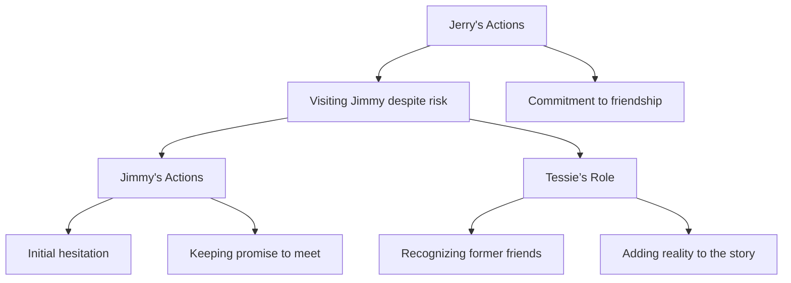

# Unit – 3: Prose and Poetry

*(AI-generated self-study book for GTU, subject code 4300002 — generated locally with Ollama.)*

This module carries approximately ****.

Learning objectives covered by this module:
- 3.a. Realise the central idea of the literary piece.
- 3.b. Formulate sentences using new words.
- 3.c. Enrich vocabulary through reading.
- 3.d. Write short as well as long answers to questions.
- 3.e. Express ideas in English in written form effectively
- 3.f. Explain the content of the passage/story in the class.
- 3.g. Ask appropriate questions as well to answer them.
- 3.h. Follow oral instructions and interpret them to others.
- 3.i. Present topics effectively and clearly.
- 3.j. Use dictionary, thesaurus and other reference books.
- 3.k. Describe an object or product.
- 3.l. Use correct pronunciation and intonation.
- 3.m. Give instructions orally.

## 3.1. Prose: The Leopard - Ruskin Bond

### Understanding the Central Idea

**Ruskin Bond** is a well-known Indian author known for his unique style of writing. His book, "The Leopard," is a short story that delves into the life of a leopard that roams through the small village of Mussoorie. The central idea of the story revolves around the conflict between nature and human civilization. 

- **Worked Example:**
  > **Example:** "The central idea of the story 'The Leopard' by Ruskin Bond is the conflict between nature and human civilization. The leopard, a symbol of the wild, is forced to adapt to the changing environment of the village, leading to a series of events that highlight the clash between the natural world and human intervention."

### Formulating Sentences Using New Words

The story introduces several new words and phrases that can be used to formulate sentences. For instance, the term "Mussoorie" is a place name, while "slothful" describes the leopard's laziness. 

- **Worked Example:**
  > **Example:** "Mussoorie, the picturesque town, was a sanctuary for the slothful leopard, who preferred the comfort of the hills over the bustling village life."

### Enriching Vocabulary Through Reading

The story "The Leopard" can be used to enrich vocabulary by identifying and understanding key terms such as "slothful," "sanctuary," and "bustling."

- **Worked Example:**
  > **Example:** "The leopard, known for its slothful nature, found a sanctuary in the hills, away from the bustling village life, where it could rest and rejuvenate."

### Writing Short and Long Answers to Questions

To write short answers, focus on key aspects of the story. For long answers, provide a detailed analysis.

- **Short Answer:**
  > **Example:** "What is the central idea of 'The Leopard'?" 
  > Answer: The central idea is the conflict between nature and human civilization.

- **Long Answer:**
  > **Example:** "Discuss the central idea of 'The Leopard' by Ruskin Bond and provide examples from the story to support your answer."
  >
  > The central idea of "The Leopard" is the conflict between nature and human civilization. The leopard, a symbol of the wild, finds itself in a village where it must adapt to the changing environment. The story portrays how the leopard's natural instincts clash with the human-made structures and activities of the village. For instance, the leopard's laziness (slothful nature) is a contrast to the busy and active lifestyle of the villagers. The leopard’s sanctuary in the hills represents its natural habitat, which is threatened by the human presence and activities in the village.

### Expressing Ideas in English in Written Form Effectively

The story can be used to practice expressing ideas effectively in written form. For instance, the leopard’s character can be described in detail.

- **Worked Example:**
  > **Example:** "Ruskin Bond describes the leopard as a 'slothful' creature that prefers the hills over the village. This laziness is a key characteristic that sets the leopard apart from the bustling villagers."

### Explaining the Content of the Passage/Story in Class

To explain the content of the passage/story, focus on the key elements such as setting, characters, and the central idea.

- **Worked Example:**
  > **Example:** "Explain the setting, characters, and central idea of 'The Leopard' by Ruskin Bond."
  >
  > The setting of the story is the village of Mussoorie and the surrounding hills, where the leopard lives. The main character is the leopard, a symbol of nature, and the villagers, who represent human civilization. The central idea is the conflict between nature and human civilization, as the leopard struggles to adapt to the changing environment due to human activities.

### Asking Appropriate Questions as Well to Answer Them

To ask appropriate questions, focus on the key elements of the story. Here are some example questions and their answers.

- **Question:**
  > **Example:** "What are some questions that can be asked about 'The Leopard' and how can they be answered?"
  >
  > 1. **Question:** What is the central idea of the story?
  >    **Answer:** The central idea is the conflict between nature and human civilization.
  >
  > 2. **Question:** How does the leopard's character reflect the central idea?
  >    **Answer:** The leopard's laziness (slothful nature) symbolizes the natural world, while the busy lifestyle of the villagers represents human civilization. The leopard’s struggle to adapt to the village life highlights the conflict between the two.

### Following Oral Instructions and Interpreting Them to Others

To practice following oral instructions and interpreting them, consider the instructions given by Ruskin Bond in the story.

- **Worked Example:**
  > **Example:** "Follow the oral instructions given by Ruskin Bond and interpret them to others."
  >
  > Ruskin Bond describes the leopard as a 'slothful' creature that prefers the hills over the village. This laziness is a key characteristic that sets the leopard apart from the bustling villagers. To interpret this to others, you could say, "The leopard, known for its laziness, lives in the hills, which are its natural sanctuary, away from the busy and active lifestyle of the village."

### Presenting Topics Effectively and Clearly

To present the topic effectively, focus on clear and concise communication.

- **Worked Example:**
  > **Example:** "Present the central idea of 'The Leopard' effectively and clearly."
  >
  > The central idea of "The Leopard" is the conflict between nature and human civilization. The leopard, a symbol of the wild, finds itself in a village where it must adapt to the changing environment. This adaptation highlights the clash between the natural world and human activities. The leopard's laziness (slothful nature) is a key characteristic that sets it apart from the busy villagers. The hills, where the leopard finds its sanctuary, represent the natural habitat, which is threatened by human presence and activities in the village.

### Using Dictionary, Thesaurus, and Other Reference Books

To use reference books effectively, look up terms like "slothful" and "sanctuary" in a dictionary or thesaurus.

- **Worked Example:**
  > **Example:** "Use a dictionary or thesaurus to find the meaning of 'slothful' and 'sanctuary' in 'The Leopard' by Ruskin Bond."
  >
  > - **Slothful:** lazy or unwilling to work.
  > - **Sanctuary:** a place of safety or refuge.

### Describing an Object or Product

To describe an object or product, focus on detailed and descriptive language.

- **Worked Example:**
  > **Example:** "Describe the leopard in 'The Leopard' by Ruskin Bond."
  >
  > The leopard, a symbol of the wild, is described as a slothful creature that prefers the hills over the village. Its laziness is a key characteristic that sets it apart from the busy and active lifestyle of the villagers. The leopard's home in the hills is its natural sanctuary, where it can rest and rejuvenate away from the bustling village life.

### Using Correct Pronunciation and Intonation

To use correct pronunciation and intonation, practice reading the story aloud.

- **Worked Example:**
  > **Example:** "Read 'The Leopard' aloud with correct pronunciation and intonation."
  >
  > Pronounce words like "Mussoorie" (moo-so-ree), "slothful" (sloth-ful), and "sanctuary" (san-cue-ter-ee) with clarity. Use a low, calm intonation to describe the leopard's lazy nature and a higher, excited tone to describe the bustling village life.

### Giving Instructions Orally

To give instructions orally, practice giving clear and concise instructions related to the story.

- **Worked Example:**
  > **Example:** "Give oral instructions to describe the leopard in 'The Leopard' by Ruskin Bond."
  >
  > "Start by describing the leopard as a slothful creature. Then, explain that it prefers the hills over the village. Highlight its laziness and how it finds its sanctuary in the hills, away from the busy village life."

By following these guidelines, you can effectively understand and use the story "The Leopard" by Ruskin Bond to enhance your language skills.

---

## 3.2. Short Story After Twenty Years- O Henry

### Introduction
**O Henry** (pen name of William Sydney Porter) was a renowned American short story writer known for his masterful use of surprise endings and character development. "After Twenty Years" is one of his most famous works, often used in educational settings to illustrate themes of friendship, loyalty, and the consequences of broken promises.

### Plot Summary
The story revolves around **Jerry Harvey** and **Jimmy Wells** who were close friends until a misunderstanding led to a twenty-year separation. After twenty years, Jerry, now a successful businessman, visits Jimmy, who is serving a life sentence in prison. Their meeting brings to light the nature of their friendship and the impact of their past actions.

### Analysis
#### Key Themes
- **Friendship**: Despite the years apart, their bond remains strong.
- **Loyalty**: Jerry’s actions demonstrate unwavering loyalty.
- **Consequences of Broken Promises**: The story highlights the long-lasting effects of a broken promise.

#### Important Characters
- **Jerry Harvey**: A man of integrity and moral courage.
- **Jimmy Wells**: A former friend and now a prisoner.
- **Tessie the barmaid**: A minor character who plays a significant role in the story.

### Example
> **Example:**  
Explain the theme of friendship in "After Twenty Years" and how it is illustrated through the actions of Jerry and Jimmy.

1. **Jerry’s Actions**:
   - Jerry visits Jimmy despite knowing the risk of being associated with him.
   - Jerry’s presence in the bar, despite the risk to his business, shows his commitment to their friendship.

2. **Jimmy’s Actions**:
   - Jimmy’s initial hesitation to meet Jerry indicates his past fears and guilt.
   - Jimmy’s eventual decision to keep his promise and meet Jerry highlights the power of loyalty.

3. **Tessie the Barmaid**:
   - Tessie’s role in the story serves as a reminder of the past, linking the two friends through their shared history.

### Worked Example
> **Example:**  
Describe the role of Tessie the barmaid in "After Twenty Years" and explain how she contributes to the story’s theme of loyalty and friendship.

- **Tessie’s Role**:
  - She recognizes Jerry and Jimmy as former friends, reminding them of their past.
  - Her knowledge of their history adds a layer of reality to the story, making the reunion more poignant.

- **Contribution to Theme**:
  - Tessie’s presence in the bar highlights the continuity of their shared past.
  - Her recall of their names and the past events serves as a catalyst for their meeting, emphasizing the enduring nature of their friendship.

### Mermaid Diagram

### Conclusion
The story of "After Twenty Years" effectively illustrates the themes of friendship, loyalty, and the consequences of broken promises. Through the actions of Jerry, Jimmy, and Tessie, the story emphasizes the enduring nature of true friendship and the importance of keeping one's promises.

---

## 3.3. Poetry

### Stopping by Woods on Snowy Evening - Robert Frost

**Stopping by Woods on Snowy Evening** is a famous poem by Robert Frost, which encapsulates the poet’s contemplative and introspective nature. The poem is often interpreted as a metaphor for the allure of nature and the responsibilities of life.

#### **Definition of Poetry**
Poetry is a form of literature that uses aesthetic and rhythmic qualities of language to evoke meanings in addition to, or in place of, the prosaic ostensible meaning. It is characterized by its use of figurative language, imagery, and emotional appeal.

#### **Analysis of "Stopping by Woods on Snowy Evening"**
> **Example:**  
> **Line 1:** "Whose woods these are I think I know."  
> This line introduces the setting and the speaker's familiarity with the woods, setting a tone of comfort and tranquility.

> **Line 2:** "His house is in the village though."  
> The use of "His" suggests that the woods are owned by someone, adding a layer of ownership and responsibility.

> **Line 3:** "He will not see me stopping here"  
> The speaker acknowledges that the woods owner will not see him, indicating a sense of privacy and seclusion.

> **Line 4:** "To watch his woods fill up with snow."  
> This line describes the peaceful scene of the woods filling with snow, creating a serene and almost meditative atmosphere.

#### **Themes and Interpretations**
- **Appreciation of Nature:** The poem explores the speaker's desire to admire the beauty of nature, represented by the woods and the snow.
- **Responsibility and Commitment:** The last lines, "The woods are lovely, dark and deep, / But I have promises to keep," suggest that the speaker must leave the woods and return to his duties, highlighting the conflict between personal desires and societal obligations.

### Where the Mind is Without Fear - Rabindranath Tagore

**Where the Mind is Without Fear** is a well-known poem by Rabindranath Tagore, celebrating the freedom of the mind and the quest for knowledge. The poem reflects on the ideals of a society where individuals are free to think, explore, and achieve their full potential.

#### **Definition of Verse**
Verse is a form of poetry distinguished by its regular rhythm and meter, often in lines or stanzas.

#### **Analysis of "Where the Mind is Without Fear"**
> **Example:**  
> **Line 1:** "Where the mind is without fear and the head is held high."  
> This line sets the tone of confidence and self-respect, emphasizing the absence of fear.

> **Line 2:** "Where knowledge is free"  
> The speaker advocates for the freedom of knowledge, suggesting that learning should be accessible to all.

> **Line 3:** "Where the world has not a lonely place"  
> This line implies that the world is a united and harmonious place, free from isolation and alienation.

> **Line 4:** "Where words come out not to be washed away"  
> The poem suggests that words and ideas should be enduring and meaningful, not fleeting or insignificant.

#### **Themes and Interpretations**
- **Freedom of Thought:** The poem celebrates the freedom to think and learn without fear of punishment or censorship.
- **Unity and Harmony:** Tagore envisions a society where people are united in their pursuit of knowledge and truth, fostering a sense of community and cooperation.

### **Example:**
> **Example:**  
> **Line 1:** "Where the mind is without fear and the head is held high."  
> This line can be used to define the concept of a fearless mind. The speaker is asserting that true freedom lies in the absence of fear, allowing individuals to think and act without hesitation. This idea can be applied in various contexts, such as academic environments or personal challenges, where the fear of failure or judgment can hinder one's growth and development.

### **Conclusion**
Both "Stopping by Woods on Snowy Evening" and "Where the Mind is Without Fear" are rich in meaning and serve as powerful examples of how poetry can convey complex ideas and evoke deep emotions. Understanding and analyzing these poems can significantly enhance one's ability to appreciate the nuances of language and expression.

---

## 3.4. Language Components: Language Components Should Be Integrated with: Passages from Text Book/Work Book. Unseen Passages Reading with Correct Pronunciation. Communication Skills in English Course Code: 4300002 NITTTR Bhopal – GTU - COGC-2021 Curriculum Topics and Sub Topics Writing Skills Speaking Skills

### Integration with Passages from Text Book/Work Book

Passages from text books and work books are an essential part of language learning and are integrated with various language components to enhance students' reading, writing, and speaking skills. These passages serve as a vehicle for vocabulary enrichment, sentence construction, and comprehension.

#### **Example:**
> **Example:** 
> **Passage:** 
>
> "The village of Panchkula is located in the northern part of India, just 10 km from the historic city of Chandigarh. It is known for its scenic beauty and is a popular tourist destination. The village has a rich history and is home to many ancient temples and monuments. The local people are known for their hospitality and are always ready to welcome visitors with open hearts."
>
> **Activity:** 
>
> - **Vocabulary Enrichment:** Identify and write the meaning of the following words: scenic, tourist, destination, rich, history, temples, monuments, hospitality, visitors.
> - **Sentence Construction:** Formulate a sentence using the word "scenic" in a context related to the passage.
> - **Comprehension:** Explain the main idea of the passage in your own words.

### Unseen Passages

Unseen passages are a part of the reading component and are designed to test the students' ability to comprehend and analyze unfamiliar texts. These passages are typically not discussed or introduced in class beforehand and require the student to read, understand, and answer questions based on the content.

#### **Example:**
> **Example:** 
> **Passage:** 
>
> "In the early 20th century, the city of Mumbai was transformed by the construction of the Gateway of India. This iconic monument was built to commemorate the visit of King George V and Queen Mary in 1911. Today, it stands as a symbol of India's rich cultural heritage and serves as a popular tourist attraction. Visitors can enjoy the scenic view of the Arabian Sea and the historic architecture of the monument."
>
> **Activity:** 
>
> - **Comprehension:** What is the main purpose of the Gateway of India?
> - **Vocabulary:** Identify and write the meaning of the word "monument" in the context of the passage.
> - **Writing:** Write a sentence using the word "monument" in a different context.

### Reading with Correct Pronunciation

Correct pronunciation is crucial for effective communication. Students should be encouraged to read passages aloud and practice their pronunciation to ensure clarity and fluency. This practice helps in building a strong foundation in the language.

#### **Example:**
> **Example:** 
> **Passage:** 
>
> "The city of Bangalore is known for its vibrant culture and greenery. It is often referred to as the 'Silicon Valley of India' due to its thriving IT industry. The city has a rich history and is home to many historical landmarks. The local people are known for their warm hospitality and are always ready to welcome visitors with open hearts."
>
> **Activity:** 
>
> - **Pronunciation Practice:** Read the passage aloud, focusing on the correct pronunciation of words like "Bangalore," "Silicon," and "hospitality."
> - **Speaking Skills:** Explain the significance of the "Silicon Valley of India" reference in the context of Bangalore.
> - **Writing Skills:** Write a sentence using the phrase "warm hospitality" in a different context.

### Communication Skills in English

Communication skills in English are developed through various activities such as writing, speaking, and reading. These skills are essential for effective communication and are aligned with the NITTTR Bhopal - GTU - COGC-2021 curriculum.

#### **Example:**
> **Example:** 
> **Passage:** 
>
> "The city of Jaipur is known as the 'Pink City' due to the vibrant pink color of its buildings. It is the capital of Rajasthan and is famous for its historical landmarks, including the Hawa Mahal, City Palace, and Jantar Mantar. The city is also known for its vibrant arts and crafts, which are showcased in the numerous museums and galleries."
>
> **Activity:** 
>
> - **Writing:** Write a short paragraph describing the significance of Jaipur as a cultural and historical center.
> - **Speaking:** Explain the meaning of the phrase "vibrant pink color" in the context of the passage.
> - **Reading:** Read the passage aloud and identify the main landmarks of Jaipur.

### Summary

Integrating language components with passages from text books, work books, and unseen passages helps in enhancing students' reading, writing, and speaking skills. Correct pronunciation and comprehension of these passages are crucial for effective communication. The examples provided illustrate how to integrate these components in a practical and exam-oriented manner.

---

## 3.5. Vocabulary Items: Matching Items (Word and its Meaning), One-Word Substitution, Phrases and Idioms, Synonyms and Antonyms

### 3.5.1. Matching Items (Word and its Meaning)

In this activity, students match words with their meanings. It helps in understanding the context and usage of new words.

#### Example:
> **Example:** Match the following words with their meanings.
>
> - **Sanguine** [A] A positive and optimistic outlook
> - **Savvy** [B] Knowledgeable or experienced
> - **Serendipity** [C] A fortunate and unexpected discovery
> - **Savvy** [D] A bright red color
>
> - A [Sanguine]
> - B [Savvy]
> - C [Serendipity]
> - D [Sanguine]

### 3.5.2. One-Word Substitution

One-word substitution involves replacing a word or phrase with a single word that has the same or similar meaning. This exercise enhances the ability to use vocabulary effectively.

#### Example:
> **Example:** Replace the underlined words with a single word that has the same meaning.
>
> - **The children were very **excited** to go to the park.**
> - **The teacher was **kind** to all the students.**
>
> - The children were very **eager** to go to the park.
> - The teacher was **gentle** to all the students.

### 3.5.3. Phrases and Idioms

Phrases and idioms are groups of words that have a specific meaning not derived from the literal meaning of the individual words. Understanding and using idioms and phrases is crucial for effective communication.

#### Example:
> **Example:** Identify the correct phrase or idiom to complete the sentence.
>
> - **After winning the competition, the team was **on cloud nine**.**
> - **The professor was **on a roll** with his teaching.**
>
> - After winning the competition, the team was **over the moon**.
> - The professor was **in a groove** with his teaching.

### 3.5.4. Synonyms and Antonyms

Synonyms are words that have the same or nearly the same meaning, while antonyms are words that have opposite meanings. Recognizing and using these words helps in enriching the vocabulary and improving the writing skills.

#### Example:
> **Example:** Find the correct synonym and antonym for the given word.
>
> - **Word:** Joy
> - **Synonym:** Happiness
> - **Antonym:** Sorrow
>
> - **Word:** Lazy
> - **Synonym:** Indolent
> - **Antonym:** Energetic

### Summary

By practicing these vocabulary items, students can enhance their language skills and improve their ability to express ideas effectively. Each of these exercises not only helps in understanding the nuances of language but also in building a strong foundation in vocabulary, which is crucial for effective communication and academic success.
