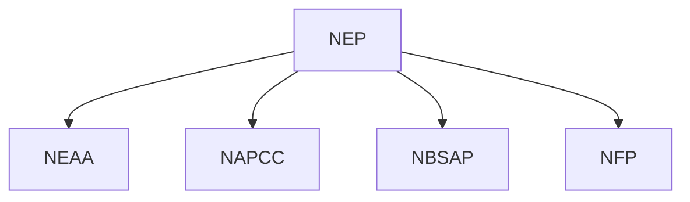
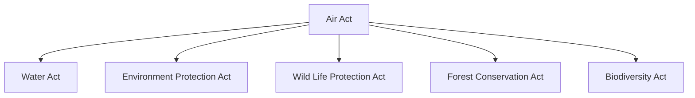

## 5.1. Environmental Policies in India

### Introduction to Environmental Policies
Environmental policies in India are a set of legislative measures designed to protect and manage the environment. These policies are crucial for sustainable development and ensuring the health and well-being of the population. The primary objectives include pollution control, conservation of natural resources, and sustainable use of the environment.

### Major Environmental Policies
#### 1. National Environmental Policy (NEP)
- **Definition**: The National Environmental Policy (NEP) was formulated in 1983. It provides a framework for the protection and management of the environment.
- **Objectives**: 
  - Protection of the environment.
  - Conservation and sustainable use of natural resources.
  - Promotion of public awareness and participation.

#### 2. National Biodiversity Strategy and Action Plan (NBSAP)
- **Definition**: The NBSAP was launched in 2002 under the Biodiversity Act, 2002. It aims to promote the conservation and sustainable use of biological diversity.
- **Key Features**:
  - **Biodiversity Hotspots**: Identification of areas rich in biodiversity.
  - **Community Involvement**: Encouraging local communities to participate in biodiversity conservation.
  - **Socio-Economic Benefits**: Promoting the sustainable use of biodiversity for economic benefits.

#### 3. National Forest Policy (NFP)
- **Definition**: The NFP was last revised in 1994. It provides a comprehensive framework for the management and conservation of forest resources.
- **Objectives**:
  - Conservation and regeneration of forests.
  - Sustainable use of forest resources.
  - Protection of wildlife.

#### 4. National Action Plan on Climate Change (NAPCC)
- **Definition**: The NAPCC was launched in 2008. It aims to address climate change issues and promote sustainable development.
- **Key Components**:
  - **Mitigation**: Reduction in greenhouse gas emissions.
  - **Adaptation**: Measures to adapt to the impacts of climate change.
  - **Renewable Energy**: Promotion of renewable energy sources.

#### 5. National Environmental Appellate Authority (NEAA)
- **Definition**: The NEAA was established under the Environment Protection Act, 1986. It acts as an appellate body to review decisions of state pollution control boards.
- **Functions**:
  - Ensuring compliance with environmental laws.
  - Providing recommendations for environmental protection.
  - Hearing and deciding appeals related to environmental issues.

### Worked Example
> **Example:** 
Consider a scenario where a state government is planning to set up a new industrial park. The park will involve the construction of several factories, which could potentially cause pollution. 

**Step 1: Identify Relevant Policies**
- **NEP**: Provides the overall framework for environmental protection.
- **NAPCC**: Emphasizes the importance of addressing climate change.
- **NBSAP**: Ensures the conservation and sustainable use of biodiversity.

**Step 2: Compliance with Environmental Laws**
- **Environmental Impact Assessment (EIA)**: The industrial park must undergo an EIA to assess potential environmental impacts.
- **Environmental Clearance (EC)**: The project must obtain EC from the appropriate authorities before construction begins.

**Step 3: Implementation of Measures**
- **Pollution Control**: Install pollution control technologies to minimize emissions.
- **Waste Management**: Implement proper waste management systems to prevent pollution.
- **Community Participation**: Engage local communities in the decision-making process and ensure their consent.

### Mermaid Diagram

## 5.2. Air Act, Water Act, Environment Protection Act, Wild Life Protection Act, Forest Conservation Act, Biodiversity Act

### Air Act
- **Definition**: The Air (Prevention and Control of Pollution) Act, 1981, is a legislative framework to control air pollution.
- **Key Provisions**:
  - **Emission Standards**: Specifies permissible levels of pollutants.
  - **Monitoring**: Establishes monitoring and inspection mechanisms.
  - **Penalties**: Imposes penalties for non-compliance.

### Water Act
- **Definition**: The Water (Prevention and Control of Pollution) Act, 1974, aims to prevent and control water pollution.
- **Key Provisions**:
  - **Water Quality Standards**: Defines permissible levels of contaminants in water bodies.
  - **Discharge Permits**: Requires permits for discharging pollutants into water bodies.
  - **Penalties**: Imposes penalties for non-compliance.

### Environment Protection Act
- **Definition**: The Environment Protection Act, 1986, is a broad legislation covering various aspects of environmental protection.
- **Key Provisions**:
  - **Environmental Impact Assessment (EIA)**: Requires an EIA for projects that may cause environmental harm.
  - **Pollution Control Boards**: Establishes state-level pollution control boards.
  - **Public Participation**: Encourages public participation in decision-making processes.

### Wild Life Protection Act
- **Definition**: The Wild Life (Protection) Act, 1972, aims to protect and conserve wild animals and their habitats.
- **Key Provisions**:
  - **Protected Areas**: Establishes national parks and wildlife sanctuaries.
  - **Habitat Protection**: Protects critical habitats and ecosystems.
  - **Penalties**: Imposes penalties for illegal hunting and poaching.

### Forest Conservation Act
- **Definition**: The Forest Conservation Act, 1980, aims to conserve forest resources and prevent their degradation.
- **Key Provisions**:
  - **Forest Clearance**: Requires clearance for non-forest activities.
  - **Regulation of Forest Use**: Regulates the use and management of forest resources.
  - **Penalties**: Imposes penalties for unauthorized felling of trees.

### Biodiversity Act
- **Definition**: The Biodiversity Act, 2002, is a legal framework to conserve and sustainably use biological diversity.
- **Key Provisions**:
  - **Biodiversity Hotspots**: Identification and conservation of biodiversity-rich areas.
  - **Community Involvement**: Encourages community participation in biodiversity conservation.
  - **Socio-Economic Benefits**: Promotes the sustainable use of biodiversity for economic benefits.

### Worked Example
> **Example:** 
A company is planning to set up a new chemical plant in a region known for its rich biodiversity. The plant will involve the discharge of effluents into a nearby river.

**Step 1: Identify Relevant Acts**
- **Air (Prevention and Control of Pollution) Act, 1981**: For air pollution control.
- **Water (Prevention and Control of Pollution) Act, 1974**: For water pollution control.
- **Environment Protection Act, 1986**: For overall environmental impact assessment.
- **Wild Life (Protection) Act, 1972**: For protection of wildlife.
- **Forest Conservation Act, 1980**: For potential impact on forest areas.
- **Biodiversity Act, 2002**: For conservation of biodiversity.

**Step 2: Compliance with Environmental Laws**
- **EIA**: Conduct an EIA to assess potential environmental impacts.
- **Discharge Permits**: Obtain discharge permits from the pollution control board.
- **Public Participation**: Engage local communities in the decision-making process.

**Step 3: Implementation of Measures**
- **Pollution Control**: Install pollution control technologies to minimize emissions.
- **Waste Management**: Implement proper waste management systems to prevent pollution.
- **Habitat Protection**: Ensure no harm is caused to the local wildlife and ecosystems.

### Mermaid Diagram

By understanding and implementing these policies and acts, companies and individuals can ensure sustainable practices and environmental conservation.