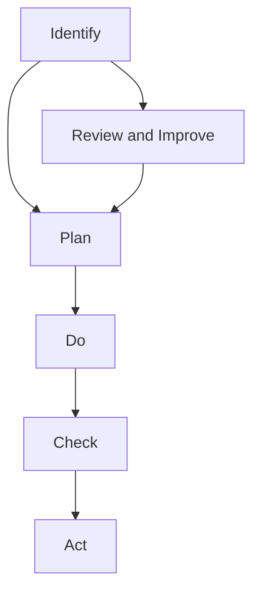

## 5.3. Environmental management system: ISO 14000, definition and benefits

### Introduction to Environmental Management System (EMS)
Environmental management systems (EMS) are structured frameworks for managing environmental aspects and impacts of an organization. The ISO 14000 series of standards provides a framework for organizations to control and reduce their impact on the environment. This section will focus on the definition and benefits of ISO 14000.

### Definition of ISO 14000
**ISO 14000** is a family of international standards for environmental management. The primary standard is **ISO 14001**, which outlines the requirements for an environmental management system (EMS). ISO 14001 specifies a process for setting up, implementing, maintaining, and continually improving an EMS.

#### **Example:**
> **Example:** A manufacturing company wants to adopt an EMS to reduce its environmental impact. They can start by implementing ISO 14001, which will guide them in establishing an EMS that includes setting environmental policies, identifying and managing environmental aspects, and continually improving their environmental performance.

### Benefits of ISO 14000
The implementation of ISO 14000 can bring numerous benefits to an organization, including:

- **Legal Compliance:** Helps organizations comply with environmental laws and regulations.
- **Cost Savings:** Reduces waste, energy consumption, and resource usage, leading to cost savings.
- **Reputation:** Enhances the organization's public image and reputation.
- **Risk Management:** Helps identify and mitigate environmental risks.
- **Operational Efficiency:** Improves operational efficiency and productivity.

#### **Example:**
> **Example:** A company that implemented ISO 14001 reported a 20% reduction in energy consumption and a 15% decrease in waste generation. These savings translated into significant cost reductions, which were reflected in the company’s financial statements.

### Diagram of ISO 14000 Process

This flowchart illustrates the key steps in the ISO 14001 process, which are:

1. **Identify:** Understanding the environmental aspects and impacts of the organization.
2. **Plan:** Setting objectives, targets, and action plans.
3. **Do:** Implementing the EMS.
4. **Check:** Monitoring and measuring the EMS.
5. **Act:** Correcting and improving the EMS.
6. **Review and Improve:** Regularly reviewing and improving the EMS.

### Conclusion
ISO 14000 provides a structured approach to managing environmental aspects and impacts, leading to improved environmental performance and reduced costs. Implementing ISO 14001 can help organizations achieve legal compliance, enhance their reputation, and improve operational efficiency.

## 5.4. Rain water harvesting
Rain water harvesting (RWH) is the collection and storage of rainwater from rooftops, land surfaces, or other sources. This section will cover the definition, benefits, and methods of rain water harvesting.

### Definition of Rain Water Harvesting
**Rain water harvesting** is the process of collecting and storing rainwater for future use. It involves capturing rainwater from surfaces such as rooftops, land, and other impervious surfaces and storing it for later use. This method helps in reducing stormwater runoff, recharging groundwater, and reducing the burden on municipal water systems.

#### **Example:**
> **Example:** A residential complex in a drought-prone area installed a rain water harvesting system. They collect rainwater from the rooftops and store it in underground tanks for later use in gardening and flushing toilets. This system significantly reduced their dependence on municipal water supplies and helped in conserving water resources.

### Benefits of Rain Water Harvesting
The benefits of rain water harvesting include:

- **Water Conservation:** Reduces the demand on municipal water supplies.
- **Environmental Protection:** Helps in reducing stormwater runoff, which can cause erosion and pollution.
- **Cost Savings:** Reduces water bills and the cost of treating water.
- **Groundwater Recharge:** Replenishes groundwater resources.
- **Aesthetic and Ecological Benefits:** Enhances the beauty of the environment and supports local ecosystems.

#### **Example:**
> **Example:** An office building in a water-stressed region installed a rain water harvesting system. The system collects rainwater from the rooftop and stores it in underground tanks. The collected water is used for non-potable purposes like toilet flushing, gardening, and cleaning. This system saved the building over 30% on its water bills and helped in recharging the local groundwater.

### Methods of Rain Water Harvesting
Rain water harvesting can be implemented using various methods:

- **Rooftop Harvesting:** Collecting rainwater from rooftops using gutters and downspouts.
- **Surface Collection:** Collecting rainwater from the ground using ponds, depressions, or channels.
- **Pit Collection:** Collecting rainwater in pits or depressions in the ground.
- **Tank Storage:** Storing collected rainwater in tanks or reservoirs for later use.

#### **Example:**
> **Example:** A school in a suburban area decided to implement a rain water harvesting system. They installed gutters and downspouts to collect rainwater from the rooftops and stored it in underground tanks. The collected water is used for gardening and cleaning the school premises. This system helped the school in saving water and reducing their environmental footprint.

### Conclusion
Rain water harvesting is an effective method to conserve water, reduce the burden on municipal water systems, and protect the environment. Implementing rain water harvesting systems can lead to significant cost savings and ecological benefits.

By understanding and adopting these environmental management systems and rain water harvesting methods, organizations and individuals can contribute to sustainable development and environmental conservation.