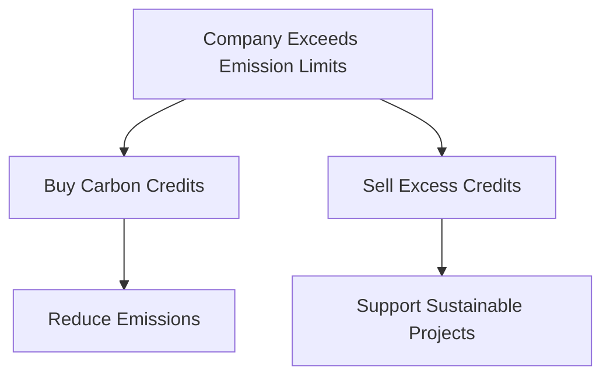

## 5.7. Green label

### Definition and Importance
A **Green label** is a certification or rating system that assesses the environmental performance of buildings, products, or services. It evaluates the sustainability of a product or service based on its environmental impacts from manufacturing to disposal, including energy efficiency, water usage, material selection, and waste management. The primary goal of a green label is to encourage and promote sustainable practices in the construction and operation of buildings.

### Classification of Green Label Systems
Green label systems can be broadly classified into the following categories:
- **Energy Efficiency Labels**: These labels indicate the energy performance of a building or product. An example is the **Energy Star** label used in the United States.
- **Sustainability Labels**: These labels focus on the overall environmental impact of a product or service. An example is the **Energy and Environmental Design (LEED)** rating system used internationally.

### Enlist Major Green Label Systems
- **LEED (Leadership in Energy and Environmental Design)**: Developed by the U.S. Green Building Council (USGBC), LEED evaluates buildings based on multiple categories such as sustainable site selection, water efficiency, energy and atmosphere, materials and resources, and indoor environmental quality.
- **BREEAM (Building Research Establishment Environmental Assessment Method)**: Used primarily in the United Kingdom, BREEAM evaluates the environmental performance of buildings through a comprehensive assessment of design, construction, and operation.
- **DGNB (Deutsche Gesellschaft für Nachhaltiges Bauen)**: A German standard that assesses the sustainability of buildings across various dimensions including location, energy, materials, water, indoor environment, and operation.

### Example
> **Example:** 
A building is being assessed for its energy efficiency using the LEED rating system. The building scores 80 points out of 110 possible points. The certification is awarded as "Silver" because the building meets the criteria for this level. The assessment includes a detailed review of the building's energy usage, water conservation measures, and material selection.

## 5.8. Carbon credit system its advantages and disadvantages

### Definition
A **Carbon credit** is a certificate representing one ton of carbon dioxide (CO2) or an equivalent greenhouse gas (GHG) that has been reduced, avoided, or sequestered. Carbon credits are often used in carbon trading markets to offset emissions from industrial processes, transportation, and other sources.

### Explain the Carbon Credit System
The carbon credit system is a market-based mechanism designed to reduce greenhouse gas emissions by providing a financial incentive for companies to reduce their emissions. It operates on the principle of allowing the trading of emissions reductions or offsets. Companies that exceed their emission limits can buy carbon credits from companies that have reduced their emissions below their limits.

### Advantages of Carbon Credit System
- **Economic Incentive**: Companies are motivated to reduce emissions to sell excess carbon credits, generating financial benefits.
- **Flexibility**: The system allows companies to choose the most cost-effective methods to reduce emissions, whether through direct reductions or purchasing credits.
- **Global Reach**: Carbon credits can be traded internationally, enabling a global approach to combating climate change.

### Disadvantages of Carbon Credit System
- **Complexity**: The carbon credit system can be complex and difficult to implement, requiring significant expertise and resources.
- **Verification Issues**: Ensuring the accuracy and authenticity of carbon credits can be challenging, leading to potential fraud or misreporting.
- **Scope and Effectiveness**: The effectiveness of the system can be limited if not all sectors are included, and if credits are not retired properly to avoid double counting.

### Example
> **Example:** 
A manufacturing company is required to reduce its CO2 emissions by 50,000 tons. Instead of making significant changes to its operations, the company decides to buy carbon credits. It purchases 50,000 tons of carbon credits from a forestry project that has planted trees and is certified to absorb CO2. This purchase helps the company meet its emission reduction targets while supporting sustainable forestry practices.

### Flowchart of Carbon Credit System

In this flowchart, the company can either reduce emissions and sell excess credits or buy credits to offset its emissions, thereby promoting sustainable projects.