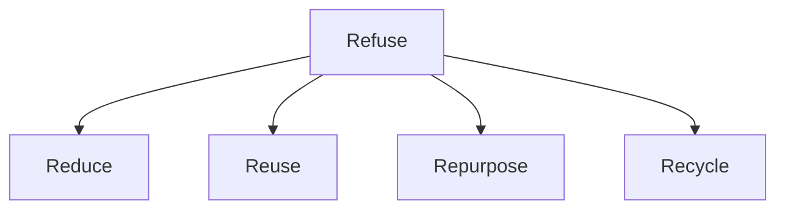
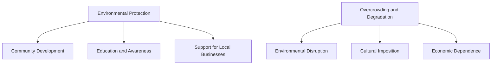

## 5.9. Concept of 5R(Refuse, Reduce, Reuse, Repurpose, Recycle)

### 5R Concept: Understanding and Application

The 5R concept, also known as the 5R principle, is a practical approach to waste management and sustainable resource use. It emphasizes reducing waste generation and promoting the reuse, repurposing, and recycling of materials to minimize environmental impact. Each of the 5Rs has a specific role in the circular economy and waste management strategies.

- **Refuse:** This involves refusing to use single-use products and disposable items. Refusing to purchase items that are unnecessary or that have a short lifespan can significantly reduce waste.
  
- **Reduce:** Reducing waste means minimizing the amount of waste generated by using products and services more efficiently. For example, reducing the amount of water used in a household can be achieved by fixing leaks and using water-efficient appliances.
  
- **Reuse:** Reusing items involves finding new uses for products that have already served their original purpose. For instance, old clothing can be donated to charity or repurposed into cleaning rags.
  
- **Repurpose:** Repurposing involves transforming old products into new ones. For example, an old bicycle frame can be repurposed into a garden trellis.
  
- **Recycle:** Recycling involves breaking down materials into raw materials to make new products. For example, glass bottles can be recycled into new glass bottles or jars.

> **Example:** 
>
> A local community group decides to implement the 5R concept in their neighborhood. They start by refusing single-use plastic water bottles and instead provide reusable water bottles. They then reduce water usage by fixing leaks and installing water-efficient taps. Old clothes are collected and donated to a local shelter. An old bicycle frame is repurposed into a trellis for a community garden. Finally, they set up a recycling station to recycle glass and paper products.

### Mermaid Diagram for the 5R Concept

### Importance of the 5R Concept

Implementing the 5R concept not only helps in reducing waste but also promotes sustainability and environmental conservation. By adopting these principles, individuals and communities can contribute significantly to reducing the amount of waste sent to landfills, thereby reducing greenhouse gas emissions and conserving natural resources.

## 5.10. Eco Tourism: Advantages and Disadvantages

### Eco Tourism: Definition and Context

Eco tourism, also known as ecotourism, is a form of tourism that focuses on environmental conservation, education, and sustainable development. It aims to provide visitors with an authentic experience of nature and local cultures while minimizing the negative impacts on the environment and local communities.

### Advantages of Eco Tourism

- **Environmental Protection:** Eco tourism promotes the conservation of natural resources and biodiversity. By choosing eco-friendly tours and accommodations, travelers can contribute to the protection of ecosystems and wildlife.
  
- **Community Development:** Eco tourism can provide economic benefits to local communities, helping them to develop sustainable livelihoods. This can lead to improved infrastructure, education, and healthcare services.
  
- **Education and Awareness:** Eco tourism encourages travelers to learn about the local environment and cultural heritage, promoting a deeper understanding and appreciation of nature and culture.

- **Support for Local Businesses:** Eco tourism supports small, local businesses, which often use local materials and services, thereby promoting the local economy.

### Disadvantages of Eco Tourism

- **Overcrowding and Degradation:** Increased tourist numbers can lead to overcrowding in natural areas, causing degradation of the environment and loss of natural habitats.
  
- **Cultural Imposition:** Eco tourism can sometimes lead to cultural imposition, where the local culture is commodified and changed to cater to tourists, potentially leading to the loss of traditional practices and values.
  
- **Economic Dependence:** Over-reliance on eco tourism can make local communities economically dependent, which can be problematic if the industry faces downturns or natural disasters.

- **Environmental Disruption:** Poorly managed eco tourism can result in environmental disruption, such as pollution, deforestation, and destruction of natural habitats.

### Mermaid Diagram for Eco Tourism

### Example of Applying Eco Tourism Principles

> **Example:** 
>
> A travel company is planning an eco tourism trip to a national park. They decide to adopt the following principles:
>
> - **Refuse Single-Use Plastics:** They provide reusable water bottles and containers to all participants.
>
> - **Reduce Carbon Footprint:** They use public transportation or carpooling for the trip to minimize carbon emissions.
>
> - **Reuse Local Resources:** They use local guides and accommodations to support the local community.
>
> - **Repurpose Waste:** They organize a community project to repurpose waste materials collected during the trip into useful items for the local community.
>
> - **Recycle Locally:** They set up a recycling station at the accommodation and ensure proper disposal of waste.
>
> By implementing these principles, the travel company ensures that the trip is both enjoyable and sustainable, contributing positively to the environment and the local community.