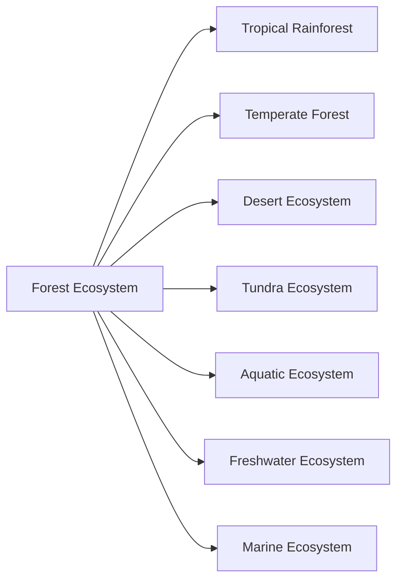
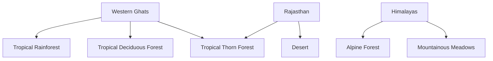

# Unit – I: Ecosystem

*(AI-generated self-study book for GTU, subject code 4300003 — generated locally with Ollama.)*

This module carries approximately **14 marks (6 Remember + 6 Understand + 2 Apply) (per syllabus)**.

Learning objectives covered by this module:
- 1.a. Explain the Structure with components of the given Ecosystem
- 1.b. Explain Carbon, Nitrogen, Sulphur and phosphorus cycle for the given ecosystem.
- 1.c. Justify the need to conserve the given Ecosystem on the w.r.t. following points:  carrying capacity of earth  Biomes,  Ecologically sensitive area
- 1.d. Explain the term biodiversity with its importance.
- 1.e. Illustrate the importance of IUCN red list in environmental engineering.
- 1.f. Calculate global ecological overshoot and virtual water requirement of given natural and man-made materials.

## 1.1. Structure and components of ecosystem

### Definition and Importance
An ecosystem is a functional unit consisting of living organisms (biotic components) and their physical environment (abiotic components). The structure and components of an ecosystem play a crucial role in maintaining its balance and sustainability. Understanding these components is essential for the conservation and management of ecosystems.

#### **Biotic Components**
1. **Producers (Autotrophs)**
   - **Definition:** Producers are organisms that can synthesize their own food using inorganic substances and light energy. They are the primary producers in an ecosystem.
   - **Examples:** Plants, algae, and some bacteria.
2. **Consumers (Heterotrophs)**
   - **Herbivores:** Organisms that eat only plants.
     - **Example:** Deer, rabbits.
   - **Carnivores:** Organisms that eat other animals.
     - **Example:** Lions, tigers.
   - **Omnivores:** Organisms that eat both plants and animals.
     - **Example:** Humans, bears.
   - **Decomposers (Detritivores and Saprotrophs):**
     - **Definition:** Decomposers break down dead organic matter, converting it into inorganic substances.
     - **Examples:** Bacteria, fungi.
3. **Saprotrophs**
   - **Definition:** Saprotrophs break down dead organic matter in the soil, contributing to the nutrient cycle.
   - **Example:** Fungi, certain bacteria.

#### **Abiotic Components**
1. **Physical Factors:**
   - **Light:** Essential for photosynthesis.
   - **Temperature:** Affects metabolic rates and survival.
   - **Water:** Vital for all life processes.
   - **Soil:** Provides minerals and anchorage.
2. **Chemical Factors:**
   - **Nutrients:** Essential elements such as nitrogen, phosphorus, and sulfur.
   - **Oxygen:** Required for respiration.
   - **Carbon Dioxide:** Used in photosynthesis.
3. **Other Factors:**
   - **Atmospheric Pressure:** Affects gas exchange in organisms.
   - **Wind:** Influences distribution of organisms.
   - **Precipitation:** Affects water availability.

### Example
> **Example:** In a forest ecosystem, trees are the primary producers, providing oxygen and serving as habitats for various animals. Herbivores like deer and rabbits feed on these plants, while carnivores like wolves prey on these herbivores. Decomposers like fungi break down dead leaves and other organic matter, returning nutrients to the soil.

## 1.2. Types of Ecosystem, changes in ecosystem

### Types of Ecosystem
Ecosystems can be broadly classified based on their physical environment and the organisms that inhabit them.

#### **Natural Ecosystems**
1. **Terrestrial Ecosystems**
   - **Forest Ecosystem:** Characterized by high plant density and complex structures.
     - **Example:** Tropical rainforests, temperate forests.
   - **Grassland Ecosystem:** Dominated by grasses and few trees.
     - **Example:** Savannas, prairies.
   - **Desert Ecosystem:** Extreme conditions of low rainfall and high temperatures.
     - **Example:** Arid deserts, semi-deserts.
   - **Tundra Ecosystem:** Cold, treeless regions with short growing seasons.
     - **Example:** Arctic tundra, Alpine tundra.
2. **Aquatic Ecosystems**
   - **Freshwater Ecosystem:** Lakes, rivers, and ponds.
     - **Example:** Freshwater lakes, rivers.
   - **Marine Ecosystem:** Oceans, seas, and coastal areas.
     - **Example:** Coral reefs, mangroves.

#### **Artificial Ecosystems**
1. **Urban Ecosystem:** Human-made environments with high population density.
2. **Agricultural Ecosystem:** Human-managed ecosystems for crop production.
3. **Industrial Ecosystem:** Areas with significant human industrial activity.

### Changes in Ecosystem
Ecosystems can undergo changes due to natural processes or human activities. These changes can be positive, neutral, or negative.

#### **Natural Changes**
1. **Succession:**
   - **Primary Succession:** The development of a new ecosystem in an area where no ecosystem previously existed, such as after a volcanic eruption.
     - **Example:** Pioneer species like lichens and mosses.
   - **Secondary Succession:** The development of a new ecosystem in an area where an existing ecosystem has been disturbed, but the soil remains.
     - **Example:** Regrowth of vegetation after a forest fire.

2. **Climate Change:**
   - **Definition:** Long-term changes in temperature and weather patterns.
   - **Example:** Increase in global temperatures leading to melting glaciers and rising sea levels.

#### **Human-Induced Changes**
1. **Deforestation:**
   - **Definition:** The large-scale removal of trees.
   - **Example:** Clear-cutting for agriculture or logging.
2. **Pollution:**
   - **Water Pollution:** Release of harmful substances into water bodies.
     - **Example:** Industrial waste, agricultural runoff.
   - **Air Pollution:** Release of pollutants into the atmosphere.
     - **Example:** Vehicle emissions, industrial smoke.
3. **Urbanization:**
   - **Definition:** The process of converting rural areas into urban areas.
   - **Example:** Construction of buildings and infrastructure in previously natural areas.

### Example
> **Example:** The Amazon rainforest, a terrestrial ecosystem, is facing significant changes due to deforestation. This has led to a reduction in biodiversity, changes in local climate, and an increase in carbon dioxide levels, contributing to global warming.

By understanding the structure and components of ecosystems, as well as the types and changes, students can better appreciate the complexity and importance of these natural systems. This knowledge is crucial for developing sustainable practices and policies to protect and manage ecosystems effectively.

---

## 1.3. Various natural cycles like carbon, Nitrogen, Sulphur, Phosphorus

### 1.3.1. Carbon Cycle

The **carbon cycle** is a fundamental process in the ecosystem that involves the exchange of carbon between the atmosphere, oceans, terrestrial biosphere, and geosphere. Carbon is a crucial element for life, and its cycling is essential for maintaining the balance of the Earth's climate.

- **Atmosphere**: Carbon dioxide (CO2) is the primary form of carbon in the atmosphere. Photosynthesis by plants and photosynthetic bacteria removes CO2 from the atmosphere.
- **Biosphere**: Carbon is stored in living organisms such as plants, animals, and microorganisms. When these organisms die, their carbon is returned to the soil through decomposition.
- **Soil**: Carbon is also stored in the soil in the form of organic matter.
- **Ocean**: The ocean is a significant carbon sink, storing large amounts of carbon in the form of dissolved CO2 and organic matter.

#### **Example:**
> **Example:** Calculate the total amount of carbon stored in a forest ecosystem over a period of 10 years, given that the forest contains 50,000 trees with an average carbon content of 50 kg per tree. The forest sequesters 5% of its carbon annually.

1. **Total carbon in the forest:**
   [
   50,000 \text{ trees} \times 50 \text{ kg/tree} = 2,500,000 \text{ kg of carbon}
   ]

2. **Annual carbon sequestration:**
   [
   2,500,000 \text{ kg} \times 0.05 = 125,000 \text{ kg/year}
   ]

3. **Total carbon sequestered over 10 years:**
   [
   125,000 \text{ kg/year} \times 10 \text{ years} = 1,250,000 \text{ kg of carbon}
   ]

### 1.3.2. Nitrogen Cycle

The **nitrogen cycle** is another critical cycle that involves the transformation of nitrogen between its various forms. Nitrogen is a key component of proteins and nucleic acids in living organisms.

- **Atmosphere**: Nitrogen (N2) makes up about 78% of the atmosphere. Lightning can convert nitrogen to nitric oxide (NO), which can further react to form nitrate (NO3-).
- **Soil**: Nitrogen is fixed by bacteria in the soil, converting N2 to ammonia (NH3) through a process called nitrogen fixation.
- **Living Organisms**: Nitrogen is used by plants and animals in the form of ammonia, nitrate, and nitrite.
- **Decomposition**: Dead organisms release nitrogen back into the soil through decomposition.

#### **Example:**
> **Example:** A farmer wants to understand the nitrogen cycle in his field. He notes that the field contains 500 kg of nitrogen in the form of organic matter. Calculate the amount of nitrogen in the soil after 5 years if the field loses 10% of its nitrogen annually due to decomposition.

1. **Initial nitrogen content:**
   [
   500 \text{ kg}
   ]

2. **Annual loss of nitrogen:**
   [
   500 \text{ kg} \times 0.10 = 50 \text{ kg/year}
   ]

3. **Total nitrogen lost over 5 years:**
   [
   50 \text{ kg/year} \times 5 \text{ years} = 250 \text{ kg}
   ]

4. **Remaining nitrogen after 5 years:**
   [
   500 \text{ kg} - 250 \text{ kg} = 250 \text{ kg of nitrogen}
   ]

### 1.3.3. Sulphur Cycle

The **sulphur cycle** involves the movement of sulphur between the atmosphere, soil, and living organisms.

- **Atmosphere**: Sulphur dioxide (SO2) and sulphur trioxide (SO3) are released into the atmosphere through volcanic activity and human activities such as burning fossil fuels.
- **Rainfall**: SO2 and SO3 can form sulphuric acid (H2SO4) in the atmosphere, which then falls as acid rain.
- **Soil**: Sulphur is found in the soil in various forms, and it is taken up by plants and microorganisms.
- **Decomposition**: Dead organisms return sulphur to the soil through decomposition.

#### **Example:**
> **Example:** Calculate the amount of sulphur released into the atmosphere from a coal-burning power plant that burns 10,000 tons of coal per year. Assume that 2.5% of the sulphur in coal is released as SO2.

1. **Total sulphur content in coal:**
   [
   10,000 \text{ tons} \times 2.5\% = 250 \text{ tons of sulphur}
   ]

2. **Sulphur released as SO2:**
   [
   250 \text{ tons} \times 1000 \text{ kg/ton} = 250,000 \text{ kg of sulphur}
   ]

3. **Sulphur released as SO2:**
   [
   250,000 \text{ kg} \times 0.88 (SO2) = 220,000 \text{ kg of SO2}
   ]

### 1.3.4. Phosphorus Cycle

The **phosphorus cycle** involves the movement of phosphorus between the soil, water, and living organisms.

- **Soil**: Phosphorus is an essential nutrient for plants and is found in the soil in various forms.
- **Water**: Phosphorus can be transported in water bodies, affecting aquatic ecosystems.
- **Decomposition**: Dead organisms release phosphorus back into the soil through decomposition.
- **Human Activities**: Phosphorus is added to the soil through fertilizers and can be lost through runoff into water bodies.

#### **Example:**
> **Example:** A farmer applies 200 kg of phosphorus fertilizer to his field. Calculate the amount of phosphorus left in the soil after 3 years if 10% of the phosphorus is lost annually due to leaching.

1. **Initial phosphorus content:**
   [
   200 \text{ kg}
   ]

2. **Annual loss of phosphorus:**
   [
   200 \text{ kg} \times 10\% = 20 \text{ kg/year}
   ]

3. **Total phosphorus lost over 3 years:**
   [
   20 \text{ kg/year} \times 3 \text{ years} = 60 \text{ kg}
   ]

4. **Remaining phosphorus after 3 years:**
   [
   200 \text{ kg} - 60 \text{ kg} = 140 \text{ kg of phosphorus}
   ]

## 1.4. Ecosystem Conservation, Carrying Capacity of Earth, Biomes in India, (ESA) Ecologically Sensitive Areas

### 1.4.1. Ecosystem Conservation

Ecosystem conservation is crucial for maintaining the balance of the environment and ensuring the sustainability of natural resources. Ecosystems provide essential services such as water purification, air quality maintenance, and pollination.

- **Conservation Goals**: The primary goals of ecosystem conservation include preserving biodiversity, maintaining ecological balance, and ensuring the sustainable use of natural resources.
- **Carrying Capacity of Earth**: The carrying capacity of the Earth refers to the maximum population that the Earth can support indefinitely without degrading the environment. This concept is important in understanding the limits of natural resources and the impact of human activities.

#### **Example:**
> **Example:** If the carrying capacity of the Earth for humans is estimated to be 9 billion people, and the current population is 8 billion, calculate the remaining carrying capacity and discuss the implications for resource management.

1. **Remaining carrying capacity:**
   [
   9 \text{ billion} - 8 \text{ billion} = 1 \text{ billion}
   ]

2. **Implications**: The remaining carrying capacity of 1 billion people suggests that the Earth can support an additional 1 billion people under current resource management practices. However, this does not account for the impact of human activities on the environment and the need for sustainable resource use.

### 1.4.2. Biomes in India

India has a diverse range of biomes, each with unique characteristics and ecosystems. Understanding the biomes helps in the conservation and management of natural resources.

- **Tropical Rainforest**: Found in the Western Ghats and parts of the Eastern Ghats, these biomes are characterized by high rainfall and a wide variety of plant and animal species.
- **Tropical Deciduous Forest**: Found in the plains of central India, these forests have a mix of evergreen and deciduous trees.
- **Tropical Thorn Forest**: Found in the western parts of Rajasthan and Gujarat, these forests have a low rainfall and are characterized by thorny shrubs and trees.
- **Desert**: Found in the western parts of Rajasthan, these areas have low rainfall and support a unique set of plant and animal species.
- **Mountainous Regions**: Found in the Himalayas, these regions have a diverse range of ecosystems, including alpine forests and meadows.

#### **Example:**
> **Example:** Classify the following biome based on the given characteristics: High rainfall, dense evergreen and deciduous trees, diverse wildlife.

1. **Classification**: **Tropical Deciduous Forest**

### 1.4.3. Ecologically Sensitive Areas (ESA)

Ecologically sensitive areas (ESAs) are regions that are ecologically, biologically, or geologically important and require special protection. These areas are critical for maintaining biodiversity and ecosystem services.

- **Definition**: ESAs are areas that are ecologically, biologically, or geologically important and require special protection.
- **Examples**: Mangrove forests, wetlands, coral reefs, and mountainous regions.

#### **Example:**
> **Example:** Identify an ESA in India and explain its importance.

1. **Identification**: **Mangrove Forests**
2. **Importance**: Mangrove forests are important for maintaining biodiversity, providing nursery grounds for fish, and protecting coastal areas from erosion. They also play a crucial role in carbon sequestration and are essential for the livelihoods of local communities.

### Mermaid Diagram: Biomes in India

This diagram illustrates the different biomes found in India, highlighting their geographical distribution and unique characteristics.

---

## 1.5. Bio diversity, its need and importance, International Union for Conservation of Nature (IUCN) red list

### 1.5.1. Bio Diversity

**Bio diversity** refers to the variety and variability of life forms within a given species, ecosystem, or planet. It is a measure of the variety of organisms, including plants, animals, fungi, and microorganisms, and the ecological and evolutionary processes that sustain them. Bio diversity is essential for maintaining the health and productivity of ecosystems and providing a wide range of services that support human well-being.

#### Importance of Bio Diversity

- **Ecosystem Functioning**: Bio diversity plays a crucial role in maintaining the health and productivity of ecosystems. For instance, the presence of diverse plant species can help in soil stabilization, nutrient cycling, and pest control.
- **Economic Value**: Bio diversity provides many economic benefits, such as food, medicine, and raw materials. For example, 50% of the world's medicines come from plants, animals, and microorganisms.
- **Cultural and Recreational Value**: Many cultures rely on bio diverse ecosystems for their traditional practices, and bio diverse areas offer recreational opportunities, such as hiking and bird-watching.
- **Climate Regulation**: Bio diverse ecosystems help in regulating the climate by sequestering carbon and producing oxygen.

### 1.5.2. International Union for Conservation of Nature (IUCN) Red List

The **International Union for Conservation of Nature (IUCN)** is a global organization that provides information on the conservation status of species and ecosystems. The IUCN Red List is a comprehensive inventory of the global conservation status of biological species.

#### Categories of the IUCN Red List

- **Extinct (EX)**: The last individual of the species has died.
- **Extinct in the Wild (EW)**: The species exists only in captivity or has disappeared from its natural habitat.
- **Critically Endangered (CR)**: Facing an extremely high risk of extinction in the wild.
- **Endangered (EN)**: Facing a very high risk of extinction in the wild.
- **Vulnerable (VU)**: Facing a high risk of extinction in the wild.
- **Near Threatened (NT)**: Likely to become endangered in the near future.
- **Least Concern (LC)**: Does not qualify for any of the threatened categories.

#### Example

> **Example:** 
>
> Suppose a species of butterfly is found to be declining rapidly due to habitat loss and climate change. The IUCN Red List would classify this species as **Endangered (EN)**. This classification helps in prioritizing conservation efforts and raising awareness about the species.

### 1.6. Concept of Ecological Footprint, Virtual Water, Global Ecological Overshoot

### 1.6.1. Ecological Footprint

The **ecological footprint** is a tool used to measure the demand on Earth's ecosystems and the capacity of the planet to regenerate resources and absorb waste. It quantifies the amount of biologically productive land and water an individual, a city, a country, or a company requires to produce the resources it consumes and to absorb the waste it generates, using prevailing technology and resource management.

#### Calculation of Ecological Footprint

The ecological footprint is calculated by summing the following components:

- **Land and Water**: Used for agriculture, forestry, and urban areas.
- **Air**: Used for carbon dioxide emissions.
- **Built-up Land**: Land used for buildings and infrastructure.

The formula for calculating the ecological footprint is:

[ \text{Ecological Footprint} = \text{Land and Water} + \text{Air} + \text{Built-up Land} ]

### 1.6.2. Virtual Water

**Virtual water** refers to the water used in the production of goods and services. It is the amount of water that is embedded in the production of a product, from the water used in growing crops to the water used in manufacturing and transporting the product.

#### Importance of Virtual Water

- **Water Scarcity Management**: Understanding virtual water can help in managing water resources more efficiently.
- **Trade and Sustainability**: Virtual water analysis is crucial for sustainable trade policies, especially in water-scarce regions.

### 1.6.3. Global Ecological Overshoot

**Global Ecological Overshoot** occurs when the total ecological footprint of human activities exceeds the Earth's capacity to regenerate resources and absorb waste. This leads to resource depletion and environmental degradation.

#### Calculation of Global Ecological Overshoot

The global ecological overshoot can be calculated by comparing the total ecological footprint of humanity with the Earth's biocapacity.

[ \text{Global Ecological Overshoot} = \text{Total Ecological Footprint} - \text{Earth's Biocapacity} ]

#### Example

> **Example:** 
>
> If the total ecological footprint of humanity is 1.7 global hectares per person and the Earth's biocapacity is 1.6 global hectares per person, the global ecological overshoot would be:
>
> [ \text{Global Ecological Overshoot} = 1.7 - 1.6 = 0.1 ]
>
> This means that humanity is using 10% more of the Earth's resources than what the planet can regenerate in a year.

### Summary

In conclusion, bio diversity and the IUCN Red List are crucial for understanding and protecting the health of ecosystems. The ecological footprint and virtual water are tools that help in assessing the sustainability of human activities and managing resources effectively. The global ecological overshoot highlights the need for sustainable practices to avoid further environmental degradation.
