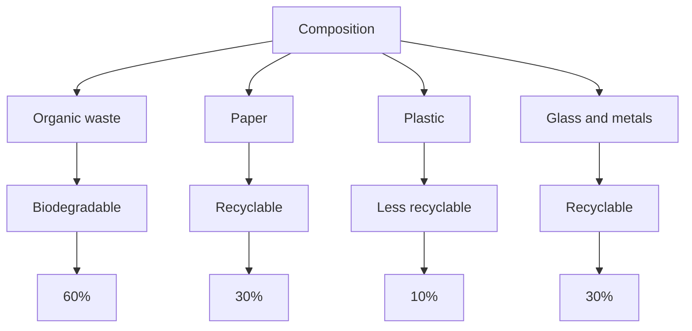

# Unit – II: Pollution and its types

*(AI-generated self-study book for GTU, subject code 4300003 — generated locally with Ollama.)*

This module carries approximately **16 marks (4 Remember + 6 Understand + 6 Apply) (per syllabus)**.

Learning objectives covered by this module:
- 2.a. Explain the term, “pollution and pollutant” in the given situation.
- 2.b. Classify the air pollution on the basis of its source
- 2.c. Use relevant equipment to control given type of air pollution.
- 2.d. Explain relevant techniques of treatment to deal with given type of water pollution.
- 2.e. Apply relevant techniques of Solid waste management based on its characteristics.
- 2.f. Explain drawbacks of noise pollution in given situation.
- 2.g. Describe the environmental degradation due to Plastic waste and E- waste secondary and tertiary

## 2.1. Definition of pollution and pollutant

### 2.1.1. Definition of pollution
Pollution is the introduction of **foreign substances** or **waste materials** into the **environment** that cause harm, discomfort, or other negative effects. These substances are known as **pollutants**. The presence of pollutants can degrade the quality of air, water, soil, and other natural resources, leading to adverse impacts on living organisms and the environment.

### 2.1.2. Definition of pollutant
A **pollutant** is any substance or form of energy that degrades the quality of the environment and causes harm to living organisms. Pollutants can be **physical** (e.g., noise), **chemical** (e.g., sulfur dioxide), **biological** (e.g., bacteria), or **thermal** (e.g., heat from industrial processes).

### 2.1.3. Examples of pollutants
- **Chemical pollutants**: Carbon monoxide (CO), Lead (Pb), DDT (a pesticide)
- **Physical pollutants**: Noise, light, thermal radiation
- **Biological pollutants**: Pathogenic bacteria, viruses, fungi
- **Thermal pollutants**: Excess heat from industrial processes

### 2.1.4. Importance of understanding pollution and pollutants
Understanding the definitions of pollution and pollutants is crucial for effective environmental management and control. It helps in identifying the sources and impacts of pollutants, which is essential for developing appropriate mitigation strategies.

> **Example:** 
> 
> A factory emits a large amount of carbon monoxide into the air. This carbon monoxide is a **pollutant** that degrades the quality of the air, leading to health issues for people and animals in the vicinity. The factory's emissions are a source of **air pollution**.

## 2.2. Air pollution, classification and its sources

### 2.2.1. Classification of air pollution

Air pollution can be classified based on its **source** and **composition**. The following flowchart illustrates the classification of air pollution:

```mermaid
flowchart TD
    A[Classification of Air Pollution] --> B[By Source]
    A --> C[By Composition]
    B --> D[Indoor Pollution]
    B --> E[Outdoor Pollution]
    C --> F[Particulate Matter (PM)]
    C --> G[Ozone Depleting Substances]
    D --> H[Natural Sources]
    D --> I[Anthropogenic Sources]
    F --> J[PM10, PM2.5]
    G --> K[Chlorofluorocarbons (CFCs)]
    H --> L[Natural Dust, Volcanic Ash]
    I --> M[Industrial Emissions, Vehicle Emissions]
```

### 2.2.2. Sources of air pollution

Air pollution sources can be broadly categorized into **natural** and **anthropogenic** sources.

#### 2.2.2.1. Natural sources
- **Natural dust**: Wind-blown soil particles
- **Volcanic ash**: Ejected during volcanic eruptions
- **Forest fires**: Natural wildfires that release smoke and particulates

#### 2.2.2.2. Anthropogenic sources
- **Industrial emissions**: Emissions from factories and power plants
- **Vehicle emissions**: Exhaust from cars, trucks, and other vehicles
- **Construction activities**: Dust from excavation and building sites
- **Agricultural activities**: Burning of crop residues

### 2.2.3. Examples of air pollution sources

> **Example:** 
>
> A coal-fired power plant releases large amounts of particulate matter (PM10, PM2.5) and sulfur dioxide (SO2) into the atmosphere. These emissions are examples of **anthropogenic sources** of air pollution.

## Summary
Understanding the definitions of pollution and pollutants is fundamental for effective environmental management. Air pollution can be classified based on its sources and composition, with sources categorized as natural and anthropogenic. Recognizing the different sources of air pollution is crucial for implementing appropriate control measures and treatment techniques.

---

## 2.3. Air Pollution Control Equipments

Air pollution control equipment is essential for reducing the emission of pollutants into the atmosphere. These devices are used to treat and control air pollutants before they are released into the environment. The primary types of air pollution control equipment are:

- **Absorption Systems:** These systems use a liquid medium to remove pollutants from the air. The liquid can be water, a chemical solution, or a solvent. Absorption is effective for removing gaseous pollutants like SO2 and HCl.

- ** Adsorption Systems:** These use solid materials like activated carbon to capture pollutants. Adsorption is useful for removing particulate matter and certain organic compounds.

- **Catalytic Converters:** These devices use catalysts to convert harmful pollutants into less harmful substances. They are commonly used in vehicle exhaust systems to reduce the emission of CO, NOx, and hydrocarbons.

- **Electrostatic Precipitators (ESP):** These devices use electrostatic forces to remove particulate matter from the air. The particles are charged by an electric field and then collected on a grounded plate.

- **Baghouses:** These are used to remove particulate matter from the air by trapping it in fabric filters. The air is forced through the filter, and the particulate matter is retained.

- **Wet Scrubbers:** These systems use water or a water-based solution to wash out particulate matter and gaseous pollutants.

### Example:

> **Example:** A factory emits SO2 gas into the atmosphere. The factory decides to use an absorption system to control the pollution. The system uses a sodium hydroxide (NaOH) solution to absorb the SO2 gas. The chemical reaction that takes place is:
>
> SO2 + 2NaOH → Na2SO3 + H2O
>
> This reaction effectively removes the SO2 from the exhaust gases, thereby reducing the pollution.

## 2.4. Water Pollution, Pollution Parameters like BOD, COD, pH, Total Suspended Solids, Turbidity, Total Solids

Water pollution is a significant environmental issue, and understanding the parameters used to measure pollution is crucial. These parameters include:

- **BOD (Biochemical Oxygen Demand):** This is a measure of the amount of oxygen required by microorganisms to break down organic matter in water. A high BOD value indicates a high level of organic pollution.

- **COD (Chemical Oxygen Demand):** This is a measure of the amount of oxygen required to oxidize all the organic matter and some of the inorganic matter in water. COD is a more comprehensive measure than BOD and includes both organic and inorganic matter.

- **pH:** This is a measure of the acidity or alkalinity of water. A pH value of 7 is neutral, while values below 7 are acidic and above 7 are alkaline. A high pH value can indicate the presence of basic pollutants, while a low pH value can indicate acidic pollutants.

- **Total Suspended Solids (TSS):** This is the total amount of suspended particles in water. High TSS levels can indicate pollution from soil erosion, industrial discharges, or sewage.

- **Turbidity:** This is a measure of the clarity of water. Turbid water has a high concentration of suspended particles, which can indicate pollution from sediment or other particulates.

- **Total Solids (TS):** This is the total weight of all dissolved and suspended solids in water. High TS levels can indicate pollution from industrial discharges, sewage, or other sources.

### Example:

> **Example:** A river is tested for its water quality parameters. The results are as follows:
>
> - BOD: 15 mg/L
> - COD: 30 mg/L
> - pH: 6.5
> - TSS: 50 mg/L
> - Turbidity: 20 NTU
> - TS: 120 mg/L
>
> The high BOD and COD levels indicate significant organic pollution. The low pH value suggests the presence of acidic pollutants, which could be from industrial discharges. The high TSS and turbidity values indicate sediment pollution, which could be from soil erosion or industrial discharges. The high TS value further confirms the presence of significant suspended solids.

These parameters are crucial for understanding and managing water pollution effectively.

---

## 2.5. Waste Water Treatment

### 2.5.1. Introduction to Waste Water Treatment
Waste water treatment is the process of removing contaminants from waste water and making it safe for release into the environment. The purpose of waste water treatment is to ensure that the waste water is free from harmful substances and pollutants before it is discharged into natural water bodies or re-used.

### 2.5.2. Types of Waste Water Treatment
Waste water treatment is typically divided into three main stages: primary, secondary, and tertiary treatment. Each stage has specific goals and methods to improve the quality of the effluent.

#### 2.5.2.1. Primary Treatment
**Primary treatment** is the first stage of waste water treatment. The main goal of primary treatment is to remove large solids and debris from the waste water. This is achieved through physical processes such as screening and sedimentation.

- **Screening**: Screens are used to remove large solids and debris such as rags, plastics, and sticks. The screens are typically made of metal mesh with openings of 10-20 mm.
- **Sedimentation**: Sedimentation tanks are used to allow the heavier solids to settle at the bottom of the tank. This process is also known as primary settling. The settled solids are called primary sludge.

**Example:**
> **Example:** In a primary treatment plant, the waste water is first screened to remove solids larger than 10 mm. The screened waste water is then allowed to settle in a sedimentation tank for 2-4 hours. The settled solids are removed and are sent to a sludge treatment facility.

### 2.5.3. Secondary Treatment
**Secondary treatment** focuses on removing dissolved and suspended biodegradable organic material. This is typically achieved through biological processes such as the activated sludge process and the trickling filter process.

- **Activated Sludge Process**: In this process, waste water is mixed with microorganisms in aeration tanks. The microorganisms consume the organic matter, converting it into biomass and carbon dioxide. The treated water is then separated from the biomass.
- **Trickling Filter Process**: In this process, waste water is trickled over a bed of rocks or other media where microorganisms grow. These microorganisms consume the organic matter.

**Example:**
> **Example:** In a secondary treatment plant, waste water is first mixed with microorganisms in an aeration tank. The microorganisms consume the organic matter, producing biomass and carbon dioxide. The treated water is then separated from the biomass and further treated in a secondary settling tank.

### 2.5.4. Tertiary Treatment
**Tertiary treatment** is the final stage of waste water treatment. The main goal is to remove any remaining contaminants and make the water safe for discharge or re-use. This is typically achieved through processes such as filtration, disinfection, and chemical treatment.

- **Filtration**: Filtration is used to remove any remaining suspended solids. This is typically done using sand filters or membrane filters.
- **Disinfection**: Disinfection is used to kill any remaining microorganisms. This is typically done using chlorination or ultraviolet (UV) radiation.
- **Chemical Treatment**: Chemical treatment is used to remove specific contaminants such as heavy metals. This is typically done using coagulants and flocculants.

**Example:**
> **Example:** In a tertiary treatment plant, the treated water from the secondary settling tank is first filtered through sand filters to remove any remaining suspended solids. The water is then disinfected using chlorine to kill any remaining microorganisms. Finally, the water is checked for any remaining contaminants and is deemed safe for discharge.

### 2.5.5. Summary
Waste water treatment involves three main stages: primary, secondary, and tertiary. Primary treatment removes large solids and debris, secondary treatment removes dissolved and suspended biodegradable organic matter, and tertiary treatment removes any remaining contaminants and makes the water safe for discharge or re-use.

## 2.6. Solid Waste Generation, Sources and Characteristics of Municipal Solid Waste

### 2.6.1. Introduction to Solid Waste
Solid waste is any waste that is not liquid or gaseous. Municipal solid waste (MSW) is the waste generated by households and small businesses. The sources and characteristics of MSW are critical for understanding how to manage and treat this waste.

### 2.6.2. Sources of Municipal Solid Waste
MSW is generated from various sources, including households, commercial establishments, and institutions. The main sources of MSW can be classified as follows:

- **Domestic Waste**: Waste generated from households, including food waste, paper, plastic, and textiles.
- **Commercial Waste**: Waste generated from small businesses, including food waste, packaging materials, and office waste.
- **Institutional Waste**: Waste generated from schools, hospitals, and other institutions, including medical waste, food waste, and laboratory waste.

### 2.6.3. Characteristics of Municipal Solid Waste
The characteristics of MSW can be categorized as follows:

- **Composition**: MSW is composed of a wide variety of materials, including organic waste, paper, plastic, glass, and metals.
- **Volume**: The volume of MSW generated varies based on the population density and consumption patterns.
- **Biodegradability**: Some components of MSW are biodegradable, while others are not. For example, food waste and paper are biodegradable, while plastics and metals are not.
- **Recyclability**: Some components of MSW can be recycled, while others cannot. For example, paper, glass, and metals are recyclable, while plastics are less recyclable.

**Example:**
> **Example:** In a typical household, the daily waste generated is approximately 1-2 kg per person. The composition of the waste includes 50% organic waste, 20% paper, 15% plastic, and 15% glass and metals. The biodegradability of the waste is 60%, while the recyclability is 30%.

### 2.6.4. Summary
Municipal solid waste is generated from various sources, including households, commercial establishments, and institutions. The characteristics of MSW, including composition, volume, biodegradability, and recyclability, are critical for understanding how to manage and treat this waste.

### Mermaid Diagram


This diagram illustrates the composition and characteristics of municipal solid waste.

---

## 2.7. Collection and Disposal of Municipal Waste and Hazardous Waste

### Collection of Municipal Waste
Municipal waste refers to waste generated by households and commercial establishments in urban and rural areas. Effective collection is crucial for maintaining hygiene and preventing environmental degradation. The collection process typically involves the following steps:

- **Source Separation:** Waste is sorted at the source (households, shops, etc.) to separate recyclable materials from non-recyclable ones. This helps in reducing the volume of waste sent to landfills and promotes recycling.
- **Collection Points:** These are strategically placed in residential areas and commercial zones to ensure easy access and reduce collection time. Common types of collection points include bins, containers, and trucks.
- **Collection Methods:** 
  - **Manual Collection:** Using hand-pushed carts or garbage trucks.
  - **Mechanized Collection:** Using advanced machinery like compactors to reduce waste volume.
  - **Door-to-Door Collection:** Waste collectors visit households directly to collect waste.

### Disposal of Municipal Waste
Disposal of municipal waste involves managing it to prevent pollution and ensure environmental safety. The primary methods include:

- **Landfills:** 
  - **Sanitary Landfills:** These are designed to minimize contamination of soil, groundwater, and surface water. They have liners and leachate collection systems.
  - **Municipal Solid Waste Landfills (MSWLF):** These are large-scale landfills where waste is buried and compacted.
- **Waste-to-Energy (WTE) Plants:** These facilities convert waste into energy through processes like incineration and gasification.
- **Recycling Centers:** Materials like paper, plastic, and metal are collected, sorted, and processed to reuse.

### Collection and Disposal of Hazardous Waste
Hazardous waste includes any waste with properties that make it harmful to human health or the environment. Proper management is essential to prevent accidents and environmental damage. The key steps are:

- **Collection:** 
  - **Segregation:** Hazardous waste must be separated from non-hazardous waste to prevent contamination.
  - **Special Collection Points:** These are designated areas or containers where hazardous waste is collected.
  - **Regular Collection:** Hazardous waste is collected on a regular basis to ensure it does not accumulate and pose risks.
- **Disposal:**
  - **Land Disposal:** 
    - **Hazardous Waste Landfills:** Special landfills designed to handle hazardous waste, equipped with liners and monitoring systems.
    - **Surface Impoundments:** These are lined basins or ponds where hazardous waste is stored.
  - **Incineration:** 
    - **Incineration Plants:** These facilities burn hazardous waste at high temperatures to reduce its volume and neutralize harmful components.
  - **Recycling:** Some hazardous waste can be treated and reused, such as spent solvents and certain types of batteries.

### Example:
> **Example:** A city's municipal waste management department has decided to implement a new door-to-door collection system. The department has identified 100 residential areas and 50 commercial zones. Each residential area will have a dedicated collection point, and commercial zones will be serviced by a single truck. The department plans to use compactors to reduce the volume of waste collected. For hazardous waste, they will establish special collection points in high-risk areas and ensure regular collection by a specialized truck. The city also plans to set up a waste-to-energy plant to treat 20% of the collected waste.

## 2.8. Noise Pollution - Its Effects, Sources and Measurement

### Effects of Noise Pollution
Noise pollution has significant impacts on both human health and the environment. Common effects include:

- **Health Effects:**
  - **Hearing Loss:** Prolonged exposure to loud noises can lead to permanent hearing damage.
  - **Stress and Anxiety:** Noise can cause stress and increase the risk of anxiety disorders.
  - **Cardiovascular Issues:** High noise levels can increase blood pressure and heart rate, leading to cardiovascular problems.
- **Environmental Effects:**
  - **Animal Disruption:** Noise can disrupt animal behavior, affecting their communication and migration patterns.
  - **Ecosystem Disturbance:** It can lead to habitat degradation and interfere with natural processes.

### Sources of Noise Pollution
Noise pollution can originate from various sources, including:

- **Transportation:** Vehicles, airplanes, and trains.
- **Industries:** Factories, construction sites, and power plants.
- **Recreational Activities:** Concerts, sporting events, and public celebrations.
- **Domestic Activities:** Home appliances, machinery, and loud music.

### Measurement of Noise Pollution
Noise levels are typically measured using decibels (dB) on the decibel scale. The following are common measurement tools and techniques:

- **Sound Level Meter:** This device measures the sound pressure level and is used to determine the intensity of noise.
- **Noise Dosimeter:** This measures the exposure to noise over time, often used in occupational settings.
- **A-Weighted Decibel (dB(A)) Scale:** This scale is used to measure the impact of sound on the human ear, taking into account the frequency range of human hearing.

### Example:
> **Example:** A city council is planning to measure noise levels in a residential area to assess the impact of noise pollution. They use a sound level meter to measure the noise levels at different points in the area. The readings are recorded as follows:

| Point | Noise Level (dB(A)) |
|-------|---------------------|
| A     | 65                  |
| B     | 72                  |
| C     | 80                  |
| D     | 95                  |

The council decides to take immediate action to reduce noise levels at point D, where the noise level is 95 dB(A), which is above the recommended limit of 70 dB(A) for residential areas. They plan to implement sound barriers and noise-reducing technologies to lower the noise levels.

---

## 2.9. Plastic waste and its hazard

### Definition of Plastic Waste
**Plastic waste** refers to any material that is made of plastic and is discarded after use. Plastics are polymers derived from petrochemicals and are widely used in various industries due to their durability and versatility. However, their long-lasting nature makes them a significant environmental concern.

### Sources of Plastic Waste
Plastic waste can originate from various sources such as:
- **Domestic Use**: Packaging materials, containers, and utensils.
- **Industrial Activities**: Manufacturing processes, agricultural films, and disposable products.
- **Retail and Commercial Activities**: Shopping bags, food packaging, and disposable cups.

### Environmental Impacts of Plastic Waste

#### **1. Marine Pollution**
Plastic waste is a major contributor to marine pollution. **Microplastics** (small plastic particles) have been found in the water, sediments, and even in the tissues of marine life. These microplastics can be ingested by marine organisms, leading to blockages in their digestive systems, reduced nutrient absorption, and even death.

#### **2. Soil Contamination**
Plastic waste can also contaminate soil. As plastics break down, they release harmful chemicals into the soil, affecting the growth of plants and the overall soil quality.

#### **3. Air Pollution**
When plastic waste is burned, it releases toxic fumes and particulate matter into the air, contributing to air pollution. These pollutants can harm human health and the environment.

### Treatment Techniques for Plastic Waste

#### **1. Recycling**
Recycling is one of the most effective methods to manage plastic waste. **Recycling** involves the collection, sorting, and processing of plastics to create new products. However, the recycling process is not without its challenges. Only certain types of plastics can be recycled, and the process requires significant energy.

> **Example:** A community has collected 1000 kg of plastic waste. After sorting, 300 kg of plastic can be recycled. The cost of recycling per kg is Rs 50. The total cost of recycling is Rs 15000.

#### **2. Incineration**
Incineration involves burning plastic waste to reduce its volume and produce energy. However, this method can release toxic pollutants into the atmosphere. Proper control measures are essential to minimize these emissions.

#### **3. Landfilling**
Landfilling involves the disposal of plastic waste in designated areas. While this method is widely used, it can lead to leaching of harmful chemicals into the soil and groundwater.

### Worked Example
> **Example:** A city generates 5000 kg of plastic waste per day. The city plans to use a combination of recycling and incineration. If 40% of the waste can be recycled and the cost of recycling is Rs 40 per kg, and the city incinerates the remaining waste, what is the total cost of waste management per day?

1. **Calculate Recyclable Waste:**
   [
   \text{Recyclable Waste} = 5000 \, \text{kg} \times 0.40 = 2000 \, \text{kg}
   ]

2. **Calculate Cost of Recycling:**
   [
   \text{Cost of Recycling} = 2000 \, \text{kg} \times 40 \, \text{Rs/kg} = 80000 \, \text{Rs}
   ]

3. **Calculate Incinerated Waste:**
   [
   \text{Incinerated Waste} = 5000 \, \text{kg} - 2000 \, \text{kg} = 3000 \, \text{kg}
   ]

4. **Calculate Cost of Incineration:**
   The cost of incineration is not provided, but we can assume it is negligible compared to recycling.

5. **Total Cost:**
   [
   \text{Total Cost} = 80000 \, \text{Rs}
   ]

The total cost of waste management per day is Rs 80,000.

---

## 2.10. E waste and its hazard

### Definition of E Waste
**E-waste** (electronic waste) refers to discarded electrical and electronic equipment and their components. These devices include computers, smartphones, televisions, and various household appliances. E-waste is a growing concern due to the rapid pace of technological advancement and the increasing consumption of electronic devices.

### Sources of E Waste

#### **1. Household Appliances**
Old refrigerators, washing machines, and air conditioners are common sources of E-waste.

#### **2. IT Equipment**
Computers, printers, and other office equipment are frequently replaced, leading to a significant amount of E-waste.

#### **3. Consumer Electronics**
Smartphones, televisions, and other consumer electronics are often discarded when newer models are purchased.

### Environmental Impacts of E Waste

#### **1. Toxic Substances**
E-waste contains toxic substances such as lead, mercury, cadmium, and brominated flame retardants. These substances can leach into the soil and water, posing significant health risks to humans and wildlife.

#### **2. Energy Consumption**
The production and disposal of E-waste require substantial energy, contributing to increased carbon emissions and environmental degradation.

#### **3. Resource Depletion**
E-waste contains valuable metals and materials that can be recovered and reused, such as gold, silver, and copper. However, improper disposal leads to the loss of these resources.

### Treatment Techniques for E Waste

#### **1. Recycling**
Recycling E-waste involves the disassembly and recovery of valuable materials. This process helps reduce the amount of waste going to landfills and conserves natural resources.

#### **2. Proper Disposal**
Proper disposal involves the safe disposal of E-waste in designated facilities where it can be managed and recycled.

#### **3. Extended Producer Responsibility (EPR)**
EPR policies require manufacturers to take responsibility for the disposal and recycling of their products. This approach encourages manufacturers to design products that are easier to recycle and less harmful to the environment.

### Worked Example
> **Example:** A company generates 1000 kg of E-waste per month. The cost of recycling per kg is Rs 70. The company has two options: recycle the waste or dispose of it in a landfill. If the cost of landfilling is Rs 50 per kg, what is the total cost for each option per month?

1. **Calculate Cost of Recycling:**
   [
   \text{Cost of Recycling} = 1000 \, \text{kg} \times 70 \, \text{Rs/kg} = 70000 \, \text{Rs}
   ]

2. **Calculate Cost of Landfilling:**
   [
   \text{Cost of Landfilling} = 1000 \, \text{kg} \times 50 \, \text{Rs/kg} = 50000 \, \text{Rs}
   ]

The total cost of recycling per month is Rs 70,000, while the total cost of landfilling per month is Rs 50,000.

This section covers the key aspects of plastic waste and E-waste, including their sources, impacts, and treatment techniques, providing a comprehensive understanding for exam preparation.
