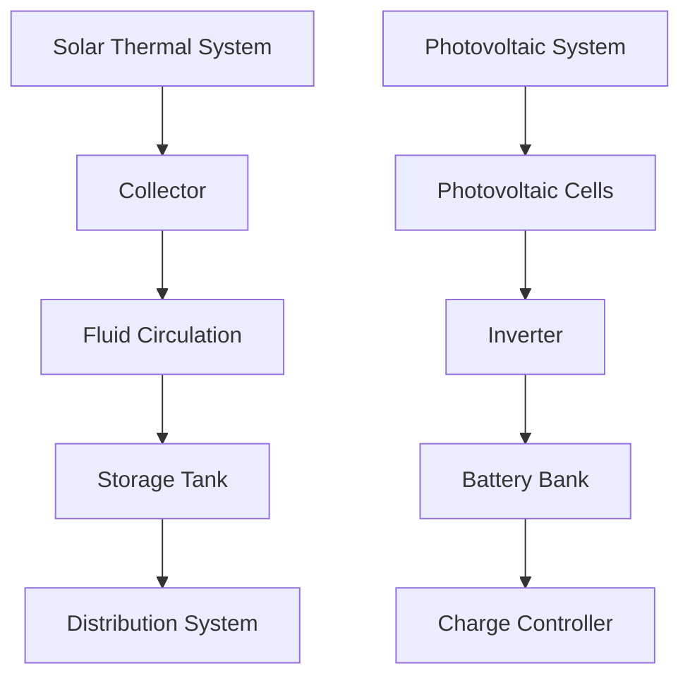
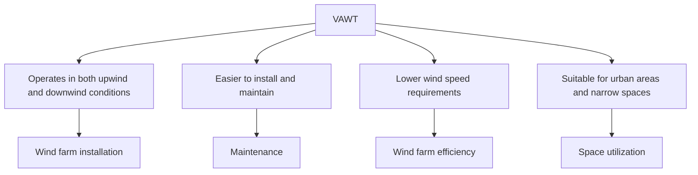
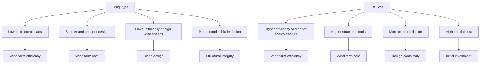
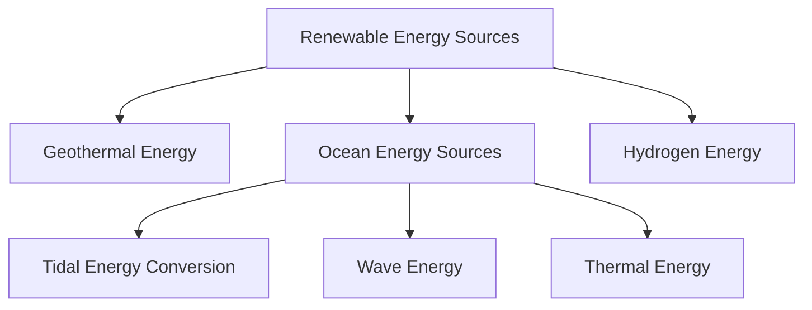

# Unit – III: Renewable sources of energy

*(AI-generated self-study book for GTU, subject code 4300003 — generated locally with Ollama.)*

This module carries approximately **16 marks (4 Remember + 6 Understand + 6 Apply) (per syllabus)**.

Learning objectives covered by this module:
- 3.a. Justify the need of renewable energy adopting relevant energy policy in given situation.
- 3.b. Explain the working of the solar thermal and PV systems with sketch in given situation.
- 3.c. Justify the need of Advanced collector, Solar Pond, Solar water heater, Solar dryer in the given system.
- 3.d. Emphasize the importance of wind power in India
- 3.e. Select the relevant type of wind turbines in the given situation.
- 3.f. Identify the relevant types of Sources of biomass energy.
- 3.g. Draw the neat labelled diagram of simple biogas plant to explain its working.
- 3.h. Identify the sources of the energy generation for the given situation.

## 3.1. Need of Renewable Energy and Energy Policy

### Importance of Renewable Energy
Renewable energy sources are essential to meet the growing global energy demands while minimizing environmental impact. These sources are sustainable, meaning they can be replenished naturally, unlike fossil fuels. The primary types of renewable energy include solar, wind, hydro, geothermal, and biomass.

### Need for Renewable Energy
1. **Environmental Sustainability:**
   - **Reduction in Greenhouse Gas Emissions:** Renewable energy sources produce little to no greenhouse gases, which helps in mitigating climate change.
   - **Air Quality Improvement:** Reduces air pollution from burning fossil fuels, leading to better public health.

2. **Economic Benefits:**
   - **Job Creation:** The renewable energy sector creates a large number of jobs, ranging from manufacturing and installation to maintenance and research.
   - **Energy Security:** Reduces reliance on imported fuels, enhancing national energy security.

3. **Energy Independence:**
   - **Reduced Dependency on Fossil Fuels:** Countries can reduce their dependence on imported fossil fuels, which can be volatile in price and supply.
   - **Stable Energy Prices:** Renewable energy sources, especially solar and wind, have stable operating costs over their lifetime.

### Energy Policy
An energy policy is a set of principles and actions that a government or organization follows to address its energy needs. The policy aims to ensure a stable and reliable energy supply, promote energy efficiency, and encourage the use of renewable energy sources.

#### Types of Energy Policies
- **Renewable Energy Targets:** Governments set targets for the percentage of energy to be generated from renewable sources by specific dates.
- **Subsidies and Incentives:** Financial support for renewable energy projects, such as tax breaks and grants.
- **Regulatory Frameworks:** Laws and regulations to ensure the safe and efficient use of energy, including standards for emissions and energy efficiency.
- **Research and Development:** Funding for research to improve the efficiency and reduce the cost of renewable energy technologies.

### Example:
> **Example:** 
> 
> Suppose a country aims to reduce its carbon emissions by 50% by 2030. To achieve this, the government has implemented several policies:
> - **Renewable Energy Targets:** The policy mandates that 25% of the country’s energy needs should come from renewable sources by 2030.
> - **Subsidies and Incentives:** A 30% tax credit is offered to businesses and individuals who invest in solar panels and wind turbines.
> - **Regulatory Frameworks:** New building codes require all new constructions to be equipped with solar water heaters.
> - **Research and Development:** A $50 million grant is provided to the National Renewable Energy Laboratory for developing more efficient solar panels.

## 3.2. Solar Energy: National Solar Mission

### Introduction to Solar Energy
Solar energy is harnessed from the sun, which is a virtually infinite source of energy. It can be converted into thermal or electrical energy using various technologies.

### National Solar Mission
The National Solar Mission (NSM) is a major initiative by the Government of India to promote the use of solar energy. Launched in 2010, the NSM aims to make India a global leader in solar energy by 2030. The mission has set ambitious targets for the deployment of solar power.

### Objectives of the National Solar Mission
- **Grid Connected Solar Power:** To achieve 40 GW of grid-connected solar power by 2022.
- **Off-Grid Solar Applications:** To provide solar power to 5 million households by 2015 and 25 million by 2022.
- **Solar Parks and Clusters:** To develop 10,000 MW of solar parks and clusters by 2017.
- **Research and Development:** To establish a robust framework for research, development, and deployment of solar technologies.

### Working of Solar Thermal Systems
**Solar Thermal Systems** convert solar energy into heat, which can be used for water heating, space heating, or industrial processes.

> **Example:** 
> 
> A typical solar thermal system consists of a collector, a storage tank, and a distribution system. The collector, which can be a flat-plate or a concentrating collector, absorbs solar radiation. The absorbed heat is transferred to a fluid (usually water or a glycol-based mixture) that circulates through the system. This heated fluid is then used to heat water or space in a building.

### Working of Photovoltaic (PV) Systems
**Photovoltaic (PV) Systems** directly convert sunlight into electricity using semiconductor materials.

> **Example:** 
> 
> A typical PV system consists of solar panels, an inverter, a battery bank (for off-grid systems), and a charge controller. The solar panels are made up of photovoltaic cells that convert light into direct current (DC) electricity. The inverter converts this DC into alternating current (AC) for use in homes and businesses. Batteries are used to store excess energy generated during the day for use at night.

### Sketch of Solar Thermal and PV Systems

### Example:
> **Example:** 
> 
> A small office building in Ahmedabad, Gujarat, has installed a 10 kW PV system to reduce its reliance on grid electricity. The system consists of 40 solar panels, each with a power output of 250 W. The inverter converts the DC power generated by the panels into AC power. Excess energy is stored in a battery bank for use during peak hours. The system is expected to save the building approximately 20,000 units of electricity per year, reducing its electricity bill by 40%.

By understanding and implementing the National Solar Mission, India can significantly reduce its carbon footprint and ensure a sustainable energy future.

---

## 3.3. Features of solar thermal and PV systems: Advanced collector, Solar Pond, Solar water heater, Solar dryer, polycrystalline, monocrystalline and thin film PV systems

### 3.3.1 Solar Thermal Systems

Solar thermal systems are designed to harness the sun's energy for heating purposes. These systems can be classified into two main types: **solar ponds and solar water heaters**.

- **Solar Ponds**: These systems use a salt gradient to concentrate the sun's energy. The salt gradient creates a thermal inversion layer, which helps in maintaining high temperatures even during nighttime. Solar ponds are particularly useful in areas with low sunshine duration and can be used for space heating, water heating, and process heat applications.

- **Solar Water Heaters**: These systems use solar collectors to heat water. The heated water is then stored in a tank for later use. There are different types of solar water heaters, including **flat plate collectors** and **evacuated tube collectors**.

### 3.3.2 Photovoltaic Systems

Photovoltaic (PV) systems convert solar energy directly into electrical energy. There are three main types of PV systems: **polycrystalline, monocrystalline, and thin film PV systems**.

- **Polycrystalline PV Systems**: These systems are made from multiple crystals and are generally cheaper than monocrystalline systems. They have an efficiency of around 15% and are suitable for residential applications.

- **Monocrystalline PV Systems**: These systems are made from a single crystal and have a higher efficiency of around 20-22%. They are more expensive but offer better performance in low light conditions.

- **Thin Film PV Systems**: These systems are made by depositing thin layers of photovoltaic material on a substrate. They are less efficient than polycrystalline and monocrystalline systems, with an efficiency of around 10-15%. However, they are lightweight, flexible, and can be integrated into building materials.

### 3.3.3 Advanced Collectors and Other Solar Systems

- **Advanced Collectors**: These are high-efficiency solar collectors designed to capture more of the sun's energy. Examples include **parabolic trough collectors** and **solar dish collectors**. Parabolic trough collectors are used in concentrated solar power systems, where they focus the sun's energy onto a receiver to generate heat, which can be used for power generation.

- **Solar Dryer**: This system is used to dry agricultural products using solar energy. It typically consists of a box with a clear cover and a reflective surface to maximize solar absorption. The dried products can be used for food preservation and other purposes.

> **Example:** 
>
> **Problem:** Design a solar water heater for a residential building with an average daily water consumption of 200 liters.
>
> **Solution:** 
>
> - **Type of Collector**: Choose a flat plate collector with an efficiency of 60%.
> - **Tank Capacity**: Design a tank with a capacity of 200 liters to store the heated water.
> - **Collector Area**: Calculate the required collector area using the formula A = Q · G, where Q is the heat load (200 liters * 4.2 kJ/L°C * 50°C = 420,000 kJ),  is the efficiency of the collector (0.60), and G is the solar irradiance (1000 W/m²). Thus, the required collector area is A = 420,000 kJ 0.60 × 1000 W/m² = 700 m².

### 3.4. Wind Energy: Growth of wind power in India

India has made significant strides in harnessing wind energy, driven by favorable policies and increasing demand for renewable energy.

### 3.4.1 Growth of Wind Power in India

Wind energy has seen substantial growth in India over the past few decades. The total installed capacity of wind power in India has grown exponentially, with the first wind farm established in 1989. As of 2023, the total installed capacity of wind power in India is over 60,000 MW.

- **Key Policies and Initiatives**: The government has introduced several policies and initiatives to promote wind energy, such as the National Wind Energy Policy (2015) and the Wind Energy (Utilization of Wind Energy) Rules (2016). These policies aim to create a favorable environment for the development of wind power projects.

- **Wind Turbine Types**: India predominantly uses **large-scale wind turbines** with capacities ranging from 1 MW to 5 MW. The choice of turbine type depends on the wind speed and the availability of land. For example, in coastal areas with high wind speeds, larger turbines are more suitable.

- **Wind Energy Zones**: The Ministry of New and Renewable Energy has identified several wind energy zones across the country, including the coastal zones of Gujarat, Tamil Nadu, and Karnataka, and the hilly regions of Jammu and Kashmir and Himachal Pradesh.

### 3.4.2 Worked Example

> **Example:** 
>
> **Problem:** Determine the type of wind turbine suitable for a wind farm in Gujarat with an average wind speed of 6 m/s.
>
> **Solution:** 
>
> - **Wind Speed Classification**: According to the IEC 61400-1 standard, an average wind speed of 6 m/s falls into the class 2 category.
> - **Turbine Selection**: For class 2 wind speeds, a **1.5 MW to 2 MW** turbine is typically suitable. The choice of the exact turbine model would depend on the specific site conditions, such as the local wind profile and terrain.
> - **Site Assessment**: Conduct a detailed site assessment to ensure the selected turbine can operate efficiently under the local wind conditions. This includes measuring the wind speed distribution, turbulence, and temperature variations.

This section provides a comprehensive understanding of the features of solar thermal and PV systems, as well as the growth of wind power in India, aligning with the GTU syllabus requirements.

---

## 3.5. Types of wind turbines – Vertical axis wind turbines (VAWT) and horizontal axis wind turbines (HAWT)

Wind turbines are a crucial component of renewable energy systems, particularly in harnessing wind power. They are classified into two main types: **Vertical axis wind turbines (VAWT)** and **Horizontal axis wind turbines (HAWT)**.

### 3.5.1. Vertical Axis Wind Turbines (VAWT)

Vertical axis wind turbines have their rotor shaft aligned perpendicular to the ground, making them more versatile in terms of installation and maintenance. They are less affected by wind direction changes, which is a significant advantage over HAWTs.

- **Advantages**:
  - Can operate in both upwind and downwind conditions.
  - Easier to install and maintain.
  - Lower wind speed requirements.
  - Suitable for urban areas and narrow spaces.

- **Disadvantages**:
  - Lower efficiency compared to HAWTs.
  - More complex and expensive designs.
  - Higher structural loads due to higher torque.

### 3.5.2. Horizontal Axis Wind Turbines (HAWT)

Horizontal axis wind turbines have their rotor shaft aligned parallel to the ground, making them more efficient in capturing wind energy. They are more common in large-scale wind farms.

- **Advantages**:
  - Higher efficiency and better energy capture.
  - Lower structural loads.
  - Can be more cost-effective for large-scale applications.

- **Disadvantages**:
  - Less versatile in terms of wind direction.
  - Higher maintenance requirements due to the need to align the turbine with the wind.
  - Larger footprint and space requirements.

### 3.5.3. Example of VAWT and HAWT

> **Example:** 
>
> A wind farm is planning to install a wind turbine in a hilly terrain where the wind direction is inconsistent. They need to choose between a VAWT and an HAWT. Given the terrain and wind conditions, which type of turbine would be more suitable?
>
> **Solution:** 
>
> The terrain and inconsistent wind direction make a VAWT more suitable. VAWTs can operate efficiently in both upwind and downwind conditions, making them ideal for such environments. Thus, the wind farm should choose a VAWT.

## 3.6. Types of HAWTs – drag and lift types

Horizontal axis wind turbines are further classified into drag and lift types based on their aerodynamic principles.

### 3.6.1. Drag Types

Drag types of HAWTs rely on the aerodynamic drag force to generate torque. These turbines are characterized by a design that maximizes the lift force perpendicular to the wind direction.

- **Advantages**:
  - Simpler and cheaper design.
  - Lower structural loads.
  - Suitable for lower wind speeds.

- **Disadvantages**:
  - Lower efficiency at high wind speeds.
  - More complex blade design.

### 3.6.2. Lift Types

Lift types of HAWTs use the lift force to generate torque. These turbines are designed to maximize the lift force, which allows them to operate more efficiently at higher wind speeds.

- **Advantages**:
  - Higher efficiency and better energy capture.
  - Suitable for higher wind speeds.
  - More aerodynamically optimized.

- **Disadvantages**:
  - Higher structural loads.
  - More complex design.
  - Higher initial cost.

### 3.6.3. Example of Drag and Lift HAWTs

> **Example:** 
>
> A wind energy company is evaluating two types of HAWTs for a new wind farm project: a drag type and a lift type. They need to determine which type would be more suitable based on the wind speed and structural load requirements.
>
> **Solution:** 
>
> Given the high wind speeds expected in the region, a lift type HAWT would be more suitable. The lift type HAWT can operate more efficiently at higher wind speeds and has a higher energy capture rate. However, the company should also consider the structural load requirements and ensure that the turbine can handle the increased load.

By understanding the differences between VAWTs and HAWTs, and the specific types of HAWTs, students can better justify and select appropriate wind turbines for given situations.

---

## 3.7. Biomass: Overview of biomass as energy source. Thermal characteristics of biomass as fuel

### Overview of Biomass as an Energy Source
Biomass is a renewable energy source derived from organic materials such as wood, agricultural crops, and other biological materials. These materials can be used directly as fuel or converted into other forms of energy like biofuels. Biomass is considered sustainable because the energy it produces can be replenished through natural processes, unlike finite resources such as fossil fuels.

**Advantages of Biomass:**
- **Sustainability:** Biomass can be produced from a wide variety of sources, including agricultural waste, forestry residue, and municipal solid waste.
- **Carbon Neutrality:** The carbon dioxide released during the combustion of biomass is offset by the carbon dioxide absorbed during the plant's growth cycle.
- **Versatility:** Biomass can be used for heat, electricity, and transportation fuels.

**Disadvantages of Biomass:**
- **Land Use:** Large-scale cultivation of biomass crops can compete with food production and can have environmental impacts.
- **Energy Intensive:** The cultivation, collection, and transportation of biomass can be energy-intensive processes.
- **Environmental Impact:** Emissions from the combustion of biomass can contribute to air pollution.

### Thermal Characteristics of Biomass as Fuel
The thermal characteristics of biomass are crucial for its efficient use as an energy source. These characteristics include:

- **Calorific Value:** The amount of heat released when a unit mass or volume of biomass is burned. It is typically measured in megajoules per kilogram (MJ/kg) or British thermal units per pound (Btu/lb).
- **Moisture Content:** The percentage of water in the biomass. High moisture content can reduce the calorific value and increase the drying requirements before combustion.
- **Ash Content:** The non-combustible residue left after the combustion of biomass. Ash content can affect the efficiency and emissions of the combustion process.
- **Density:** The mass of biomass per unit volume. Higher density biomass is more efficient to transport and handle.
- **Ignition Temperature:** The minimum temperature required to initiate combustion. Biomass typically has a lower ignition temperature compared to fossil fuels.

**Example:**
> **Example:** Calculate the calorific value of a biomass sample with a moisture content of 40% and a dry basis calorific value of 18,000 kJ/kg. The density of the biomass is 0.5 kg/L.
>
> Step 1: Determine the dry basis mass of the sample.
> [ \text{Dry basis mass} = \frac{100 - \text{moisture content}}{100} \times \text{total mass} ]
>
> Let the total mass be 1 kg.
> [ \text{Dry basis mass} = \frac{100 - 40}{100} \times 1 \text{ kg} = 0.6 \text{ kg} ]
>
> Step 2: Calculate the total calorific value.
> [ \text{Total calorific value} = \text{calorific value of dry mass} \times \text{dry basis mass} ]
> [ \text{Total calorific value} = 18,000 \text{ kJ/kg} \times 0.6 \text{ kg} = 10,800 \text{ kJ} ]
>
> Therefore, the calorific value of the biomass sample is 10,800 kJ.

## 3.8. Anaerobic Digestion, Biogas Production Mechanism, Utilization and Storage

### Anaerobic Digestion
Anaerobic digestion is a biological process in which microorganisms break down biodegradable material in the absence of oxygen. This process produces biogas, a mixture of methane (CH4) and carbon dioxide (CO2), along with digestate, a nutrient-rich organic fertilizer. The process is widely used for the treatment of organic waste and the production of renewable energy.

### Biogas Production Mechanism
The biogas production mechanism involves the following steps:

1. **Substrate Preparation:** Organic materials such as agricultural waste, manure, and food waste are collected and prepared for digestion.
2. **Inoculation:** A pre-existing population of anaerobic microorganisms is added to the substrate to initiate the process.
3. **Digestion:** The microorganisms break down the organic matter in the absence of oxygen. This process is divided into three main stages:
   - **Hydrolysis:** Complex organic compounds are broken down into simpler compounds.
   - **Acetogenesis:** Simple organic compounds are converted into volatile fatty acids (VFAs) and hydrogen (H2).
   - **Methanogenesis:** Hydrogen and carbon dioxide are converted into methane and water.

### Utilization and Storage of Biogas
Biogas can be used in several applications, including:

- **Heating and Cooking:** Biogas can be directly used as a fuel for cooking and heating purposes.
- **Electricity Generation:** Biogas can be used in internal combustion engines or fuel cells to generate electricity.
- **Transportation Fuels:** Biogas can be compressed or liquefied to be used as a transportation fuel.

**Storage of Biogas:**
Biogas can be stored in cylinders or tanks under pressure or at low temperatures. The storage capacity and duration depend on the demand and supply of biogas.

### Example: Biogas Production and Utilization
> **Example:** A biogas plant produces biogas from cow manure. The plant has a daily capacity of 500 m³ of biogas. The biogas is used to generate electricity and heat for a nearby village. The village requires 250 kW of electricity and 100 kW of heat daily.
>
> Step 1: Calculate the energy content of the biogas.
> [ \text{Calorific value of biogas} = 21.5 \text{ MJ/m}^3 ]
> [ \text{Daily biogas production} = 500 \text{ m}^3 ]
> [ \text{Daily energy production} = 500 \text{ m}^3 \times 21.5 \text{ MJ/m}^3 = 10,750 \text{ MJ} ]
>
> Step 2: Convert the daily energy production into kilowatt-hours (kWh).
> [ 1 \text{ MJ} = 2.7778 \text{ kWh} ]
> [ \text{Daily energy production in kWh} = 10,750 \text{ MJ} \times 2.7778 \text{ kWh/MJ} = 29,924.5 \text{ kWh} ]
>
> Step 3: Calculate the daily energy requirement for the village.
> [ \text{Electricity requirement} = 250 \text{ kW} \times 24 \text{ hours} = 6,000 \text{ kWh} ]
> [ \text{Heat requirement} = 100 \text{ kW} \times 24 \text{ hours} = 2,400 \text{ kWh} ]
>
> Step 4: Determine if the biogas plant can meet the village's energy requirements.
> [ \text{Total village requirement} = 6,000 \text{ kWh} + 2,400 \text{ kWh} = 8,400 \text{ kWh} ]
>
> Since the biogas plant produces 29,924.5 kWh daily, it can easily meet the village's energy requirements.

### Summary
Biomass is a renewable energy source with numerous applications, and its thermal characteristics are essential for its efficient use. Anaerobic digestion is a key process in the production of biogas, which can be utilized for various purposes, including electricity generation and heating. Understanding the production and utilization of biogas is crucial for sustainable energy solutions.

---

## 3.9. New Energy Sources: Geothermal Energy, Ocean Energy Sources, Tidal Energy Conversion, Hydrogen Energy

### Geothermal Energy
Geothermal energy is harnessed from the heat generated within the Earth. This heat is used to generate electricity or for direct heating purposes. The Earth's core temperature is around 5500°C, and the geothermal gradient (the rate of temperature increase with depth) ranges from about 25°C to 30°C per kilometer in the upper crust.

**Explanation:**
- **Exploration and Utilization:** Geothermal energy can be accessed through geothermal reservoirs, which are found in areas where there is high volcanic activity. Exploration involves identifying these reservoirs through seismic surveys and drilling.
- **Working Principle:** The heat from the Earth's core is transferred to water or other fluids, which are circulated through a closed loop system. The heated fluid then runs a turbine, generating electricity.
- **Advantages:** Reliable and constant, low emissions, and minimal land use.
- **Disadvantages:** High initial investment, limited to specific geographical areas, and potential environmental concerns such as ground subsidence and induced seismicity.

> **Example:** A geothermal plant uses hot water from a geothermal reservoir at 150°C. The plant has a thermal-to-electrical efficiency of 10%. Calculate the electrical power output if the plant uses 1000 liters of water per minute.

### Ocean Energy Sources
Ocean energy sources are derived from the vast energy contained in the oceans. These include tidal energy, wave energy, and thermal energy.

**Explanation:**
- **Tidal Energy:** Tidal energy is generated from the rise and fall of ocean tides. Tidal power plants use the kinetic energy of the tide to generate electricity.
- **Wave Energy:** Wave energy is harnessed from the motion of ocean waves. Devices such as oscillating water columns and wave buoys are used to convert wave energy into electricity.
- **Thermal Energy:** Ocean thermal energy conversion (OTEC) utilizes the temperature difference between warm surface water and cold deep water to generate electricity.

### Tidal Energy Conversion
Tidal energy conversion involves harnessing the energy from the movement of tides. This is achieved through tidal barrages, tidal stream generators, and dynamic tidal power.

**Explanation:**
- **Tidal Barrages:** These are structures that use the rise and fall of the tide to generate electricity. The Barrage captures the water during the high tide and releases it during low tide through turbines.
- **Tidal Stream Generators:** These devices are similar to wind turbines but operate in the water. They capture the kinetic energy of the flowing tides and convert it into electricity.

### Hydrogen Energy
Hydrogen energy is a clean and sustainable form of energy derived from the hydrogen element. It can be produced through various methods and used in fuel cells to generate electricity.

**Explanation:**
- **Production:** Hydrogen can be produced through electrolysis, steam reforming, and other methods.
- **Storage and Transportation:** Hydrogen is stored and transported in high-pressure tanks or as a liquid at very low temperatures.
- **Applications:** Hydrogen can be used in fuel cells to generate electricity, and it can also be used in vehicles as a fuel.

### Mermaid Diagram: Classification of New Energy Sources

### Worked Example
> **Example:** A tidal barrage with a cross-sectional area of 1000 m² generates electricity from a tidal flow of 2 m/s. If the efficiency of the turbines is 80%, calculate the power output of the barrage.

This example demonstrates the practical application of the concepts covered in the section, aligning with the exam-oriented approach and ensuring comprehensive coverage of the syllabus topics.
