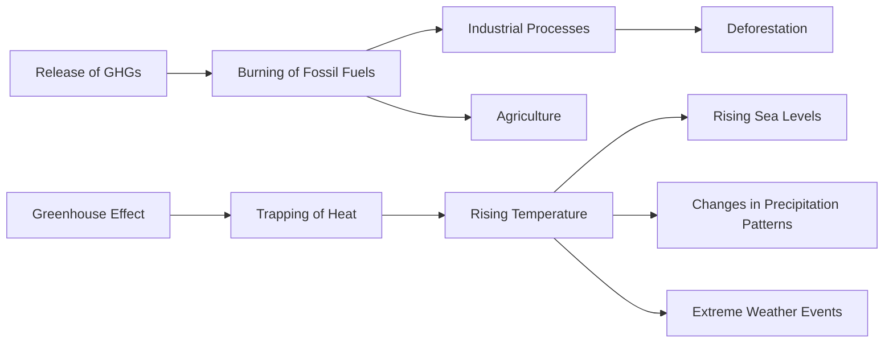
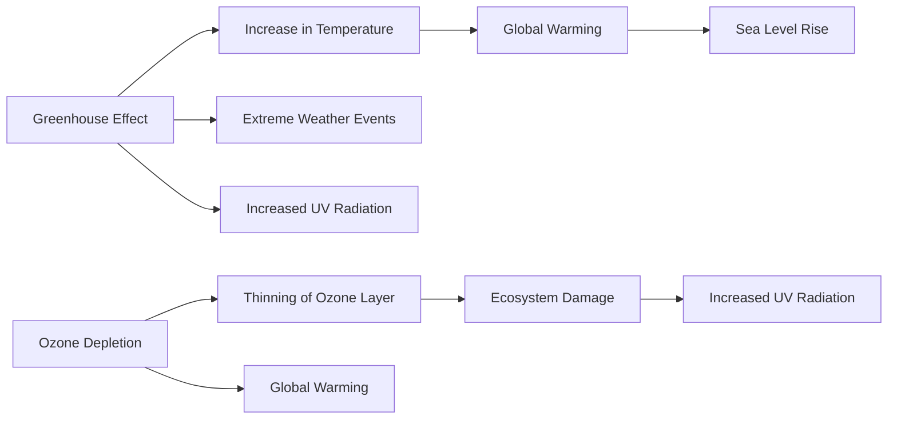
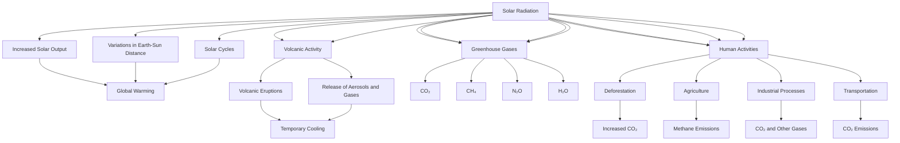
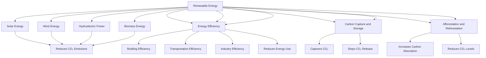

# Unit – IV: Climate Change

*(AI-generated self-study book for GTU, subject code 4300003 — generated locally with Ollama.)*

This module carries approximately **14 marks (4 Remember + 6 Understand + 4 Apply) (per syllabus)**.

Learning objectives covered by this module:
- 4.a. Explain the term, “climate change” in context of environment.
- 4.b. Describe the ill effects of Global warming due to various causes arising in the given situation.
- 4.c. Explain the term, “greenhouse effect” with its causes.
- 4.d. Relate the impact of Ozone depletion in climate change due to its causes.
- 4.e. Justify the need of relevant Climate change management system to reduce the impact of climate change in the given context.

## 4.2. Definition of climate change

**Climate change** refers to a change in the average weather patterns that we expect to see in the Earth’s atmosphere over long periods of time. These changes can be natural or due to human activities. Natural factors include volcanic eruptions, changes in solar radiation, and variations in the Earth's orbit. However, the primary focus of the term in the context of the environment is the changes caused by human activities, particularly the release of greenhouse gases.

### Key Factors Contributing to Climate Change

- **Greenhouse Gases (GHGs):** These are gases such as carbon dioxide (CO2), methane (CH4), nitrous oxide (N2O), and fluorinated gases that trap heat in the atmosphere and contribute to the greenhouse effect.
- **Human Activities:** The main human activities contributing to climate change include burning fossil fuels (coal, oil, and natural gas) for energy, deforestation, industrial processes, and agriculture.

### Definition and Explanation

Climate change is a gradual alteration in the statistical distribution of weather patterns when this change lasts for an extended period, typically decades or longer. It can be measured by changes in temperature, precipitation, or other climatic variables.

### Example:
> **Example:** 
Climate change can be seen as a shift in the average global temperature. For instance, if the average global temperature has risen by 1°C over the past century, this is an indication of climate change. This change is primarily due to the increase in greenhouse gases in the atmosphere, which trap heat and lead to warming of the Earth's surface.

## 4.3. Global warming—causes, effect, process

**Global warming** is the long-term increase in the average temperature of the Earth's climate system. It is a key aspect of climate change and has significant impacts on the environment, ecosystems, and human societies.

### Causes of Global Warming

1. **Greenhouse Gases (GHGs):** The primary gases responsible for global warming are carbon dioxide (CO2), methane (CH4), and nitrous oxide (N2O). These gases trap heat in the atmosphere and contribute to the greenhouse effect.
2. **Deforestation:** Cutting down trees reduces the number of plants that can absorb CO2 from the atmosphere.
3. **Industrial Processes:** The burning of fossil fuels and industrial activities release large amounts of GHGs into the atmosphere.
4. **Agriculture:** Practices such as rice cultivation and livestock farming produce methane and nitrous oxide.

### Effects of Global Warming

1. **Rising Sea Levels:** As the temperature increases, glaciers and ice caps melt, leading to a rise in sea levels.
2. **Increased Temperatures:** Higher temperatures can lead to more frequent heatwaves, which can be harmful to human health and wildlife.
3. **Changes in Precipitation Patterns:** Global warming can cause changes in rainfall patterns, leading to droughts in some regions and floods in others.
4. **Extreme Weather Events:** There is an increase in the frequency and intensity of extreme weather events such as hurricanes, typhoons, and tornadoes.

### The Process of Global Warming

The process of global warming can be illustrated using a **Mermaid flowchart**:

### Example:
> **Example:** 
Consider the process of global warming caused by the burning of fossil fuels. When coal, oil, or natural gas is burned, it releases CO2 into the atmosphere. This CO2 is a greenhouse gas that traps heat, leading to the greenhouse effect. As a result, the Earth's temperature rises, leading to various effects such as rising sea levels, changes in precipitation patterns, and increased frequency of extreme weather events.

This chapter provides a detailed understanding of the definitions and processes related to climate change and global warming, which are crucial for examining the environment and understanding the impacts of human activities on the Earth's climate.

---

## 4.4. Greenhouse effect

### Definition and Explanation

The **greenhouse effect** is a natural phenomenon that warms the Earth's surface. Greenhouse gases in the atmosphere trap heat, which leads to an increase in temperature. This effect is crucial for maintaining the Earth's temperature, making it habitable. However, an enhanced greenhouse effect due to human activities is causing significant environmental issues.

### Key Components of the Greenhouse Effect

- **Greenhouse Gases**: These are gases that absorb and emit infrared radiation, thereby trapping heat in the atmosphere. The main greenhouse gases include carbon dioxide (CO2), methane (CH4), water vapor (H2O), nitrous oxide (N2O), and ozone (O3).

- **Absorption and Emission**: Greenhouse gases absorb the infrared radiation emitted by the Earth and re-emit it in all directions. This results in the warming of the Earth's surface and the lower atmosphere.

- **Heat Trapping**: The lower atmosphere remains warmer due to the continuous cycle of absorption and re-emission, creating a warming effect.

### Causes of the Greenhouse Effect

- **Natural Causes**: Natural processes such as volcanic eruptions, changes in solar radiation, and variations in Earth's orbit contribute to the greenhouse effect.

- **Human Causes**: Human activities, such as deforestation, burning of fossil fuels, and industrial processes, increase the concentration of greenhouse gases in the atmosphere.

### Impact of the Greenhouse Effect

The enhanced greenhouse effect leads to several environmental issues:

- **Global Warming**: The Earth's average temperature is increasing, leading to various climatic changes.

- **Sea Level Rise**: Melting of ice caps and glaciers contribute to the rise in sea levels, which can lead to coastal flooding and loss of habitat.

- **Extreme Weather Events**: Increased frequency and intensity of storms, droughts, and heatwaves are observed.

### Worked Example

> **Example:** Calculate the approximate increase in temperature due to the greenhouse effect if the concentration of CO2 increases by 30% in the atmosphere.

Given:
- Initial concentration of CO2 = 400 ppm
- Increase in CO2 concentration = 30%

New concentration of CO2 = 400 ppm + (400 ppm × 30%) = 520 ppm

The radiative forcing due to a change in CO2 concentration can be approximated by the formula:
[ \Delta F = 5.35 \ln \left( \frac{C_2}{C_1} \right) ]

Where:
- Δ F is the radiative forcing in W/m²
- C₁ and C₂ are the initial and final concentrations of CO2 in ppm

Substituting the values:
[ \Delta F = 5.35 \ln \left( \frac{520}{400} \right) ]
[ \Delta F = 5.35 \ln (1.3) ]
[ \Delta F \approx 5.35 \times 0.262 ]
[ \Delta F \approx 1.4 \text{ W/m}^2 ]

The temperature increase due to this radiative forcing can be estimated using the climate sensitivity, which is approximately 0.8°C/(W/m²).

[ \Delta T = 1.4 \text{ W/m}^2 \times 0.8 \text{ °C/(W/m}^2 \text{)} ]
[ \Delta T \approx 1.12 \text{ °C} ]

Therefore, the approximate increase in temperature due to a 30% increase in CO2 concentration is **1.12°C**.

## 4.5. Ozone depletion

### Definition and Explanation

**Ozone depletion** refers to the thinning of the ozone layer, which is a layer in the stratosphere that protects the Earth from harmful ultraviolet (UV) radiation. The ozone layer is composed primarily of ozone (O3) molecules. The depletion of ozone is caused by the release of certain chemicals, primarily chlorofluorocarbons (CFCs) and other halogenated substances.

### Causes of Ozone Depletion

- **CFCs and Halons**: These chemicals were widely used in refrigerants, aerosol sprays, and foam-blowing agents. They can rise into the stratosphere where they are broken down by ultraviolet radiation, releasing chlorine atoms that catalyze the destruction of ozone molecules.

- **Halon**: This is another chlorine-containing compound used in fire extinguishers and other applications.

- **Other Halogenated Substances**: Methyl bromide and chlorinated hydrocarbons also contribute to ozone depletion.

### Impact of Ozone Depletion

The depletion of the ozone layer leads to several environmental and health issues:

- **Increased UV Radiation**: A thinner ozone layer allows more harmful UV radiation to reach the Earth's surface, increasing the risk of skin cancer and cataracts.

- **Ecosystem Damage**: Increased UV radiation can damage plants, reducing crop yields and harming marine life.

- **Global Warming**: Ozone depletion can also contribute to global warming through the release of greenhouse gases.

### Worked Example

> **Example:** Calculate the approximate percentage of the ozone layer that can be depleted by a single CFC molecule over its lifetime.

Given:
- Lifetime of a CFC molecule = 100 years
- Ozone depletion potential (ODP) of CFC-12 = 1
- Initial ozone concentration = 300 Dobson Units

Step 1: Determine the number of ozone molecules destroyed by a single CFC molecule.

Since the ODP of CFC-12 is 1, it destroys one ozone molecule over its lifetime.

Step 2: Calculate the total ozone depletion.

Total ozone depletion = 1 ozone molecule

Step 3: Calculate the percentage of the ozone layer that is depleted.

Percentage depletion = 1 300 × 10³ × 100\%

[ \text{Percentage depletion} = \frac{1}{300,000} \times 100\% ]
[ \text{Percentage depletion} \approx 0.00033\% ]

Therefore, the approximate percentage of the ozone layer that can be depleted by a single CFC molecule over its lifetime is **0.00033%**.

---

## 4.6. Factors affecting climate change

Climate change refers to significant changes in global temperature, precipitation patterns, and weather conditions over extended periods. The primary factors affecting climate change include natural and anthropogenic (human-induced) factors. These factors can be classified into several categories: solar radiation, volcanic activity, greenhouse gases, and human activities.

### 4.6.1. Solar Radiation
Solar radiation is the primary source of energy that drives the Earth's climate system. Variations in solar activity can influence climate change. The Earth's distance from the Sun and the Sun's own variability over time can affect the amount of energy received by the Earth. For example, a slight increase in solar output can lead to a rise in global temperatures.

### 4.6.2. Volcanic Activity
Volcanic eruptions can significantly impact climate change by releasing large amounts of aerosols and gases into the atmosphere. These particles can reflect sunlight and cool the Earth's surface. Additionally, volcanic eruptions can release greenhouse gases like carbon dioxide (CO₂) and sulfur dioxide (SO₂), which can contribute to warming. The 1815 eruption of Mount Tambora, for instance, led to a "year without a summer" in 1816.

### 4.6.3. Greenhouse Gases
Greenhouse gases are a major factor in climate change. These gases include carbon dioxide (CO₂), methane (CH₄), nitrous oxide (N₂O), and water vapor (H₂O). They trap heat in the atmosphere, leading to a warming effect. Human activities such as deforestation, burning of fossil fuels, and industrial processes significantly increase the concentration of these gases. For example, the burning of fossil fuels releases CO₂, which is one of the primary greenhouse gases contributing to global warming.

### 4.6.4. Human Activities
Human activities are the most significant contributors to climate change. These activities include:
- **Deforestation**: Trees absorb CO₂, and deforestation releases this stored carbon into the atmosphere.
- **Agriculture**: Livestock farming and rice cultivation release methane.
- **Industrial Processes**: These processes release large amounts of CO₂ and other greenhouse gases.
- **Transportation**: The burning of fossil fuels in vehicles contributes to greenhouse gas emissions.

### 4.6.5. Flowchart of Factors Affecting Climate Change

### Worked Example:
> **Example:** Identify the primary human activities contributing to climate change and explain how they affect the Earth's atmosphere.
>
> **Answer:**
> - **Deforestation**: Trees absorb CO₂. Deforestation releases this stored carbon into the atmosphere, increasing CO₂ levels.
> - **Agriculture**: Livestock farming and rice cultivation release methane (CH₄), a potent greenhouse gas.
> - **Industrial Processes**: These processes release large amounts of CO₂ and other greenhouse gases like nitrous oxide (N₂O).
> - **Transportation**: The burning of fossil fuels in vehicles releases CO₂, contributing significantly to global warming.

## 4.7. Impact and mitigation

Climate change has significant impacts on the environment and human societies. These impacts include:
- **Increased Frequency of Natural Disasters**: More frequent and severe hurricanes, floods, and droughts.
- **Rising Sea Levels**: Melting ice caps and glaciers lead to a rise in sea levels, threatening coastal communities.
- **Health Impacts**: Increased heatwaves, air pollution, and spread of vector-borne diseases.
- **Economic Impacts**: Damage to infrastructure and agricultural productivity.

### 4.7.1. Mitigation Strategies
Mitigation strategies aim to reduce the amount of greenhouse gases in the atmosphere and slow down climate change. These strategies include:
- **Renewable Energy**: Transitioning from fossil fuels to renewable sources like solar, wind, and hydroelectric power.
- **Energy Efficiency**: Improving the efficiency of buildings, transportation, and industry.
- **Carbon Capture and Storage**: Capturing CO₂ emissions and storing them underground.
- **Afforestation and Reforestation**: Planting trees to absorb CO₂ from the atmosphere.

### 4.7.2. Flowchart of Mitigation Strategies

### Worked Example:
> **Example:** Describe a scenario where a city implements renewable energy sources and energy efficiency measures to mitigate climate change.
>
> **Answer:**
> - **Renewable Energy**: The city installs solar panels on rooftops and public buildings, and builds wind turbines in nearby rural areas.
> - **Energy Efficiency**: The city encourages the use of energy-efficient appliances and promotes public transportation to reduce energy consumption.
> - **Carbon Capture and Storage**: A local industrial plant invests in carbon capture technology to reduce its CO₂ emissions.
> - **Afforestation and Reforestation**: The city plants new trees in parks and greenbelts, increasing the urban forest cover.

By implementing these strategies, the city can significantly reduce its carbon footprint and contribute to mitigating climate change.

---

## 4.1. Identify Factors affecting climate change in given locality.

### Introduction to Climate Change Factors
Climate change refers to significant changes in the average weather patterns over a long period of time. These changes can be due to natural factors such as volcanic eruptions, variations in solar radiation, and tectonic activities. However, human activities have also been identified as significant contributors to climate change. The primary human factors affecting climate change include greenhouse gas emissions, deforestation, industrial processes, and urbanization.

**Greenhouse gases (GHGs)**: These are gases in the atmosphere that trap heat and contribute to the greenhouse effect. The main greenhouse gases include carbon dioxide (CO2), methane (CH4), nitrous oxide (N2O), and fluorinated gases.

### Main Factors Affecting Climate Change in Given Locality

#### 1. **Carbon Dioxide (CO2) Emissions**
   - **Definition**: CO2 is a primary greenhouse gas that is released into the atmosphere through the burning of fossil fuels, deforestation, and industrial processes.
   - **Impact**: High levels of CO2 emissions contribute to global warming and can lead to changes in local temperature and precipitation patterns.

   > **Example:** In a given locality, a city with a population of 500,000 people and a manufacturing sector that uses coal as the primary energy source, the estimated annual CO2 emissions can be calculated using the formula:
   [
   \text{Annual CO2 emissions} = \text{Population} \times \text{Emission factor per capita}
   ]
   - Assuming an emission factor of 2.5 tons per capita per year, the annual CO2 emissions would be:
   [
   500,000 \times 2.5 = 1,250,000 \text{ tons of CO2}
   ]

#### 2. **Methane (CH4) Emissions**
   - **Definition**: CH4 is another potent greenhouse gas, with a global warming potential 28-36 times greater than CO2 over a 100-year period.
   - **Sources**: CH4 is emitted from agriculture (livestock, rice cultivation), landfills, and natural gas systems.

   > **Example:** A small agricultural community with 10,000 cattle emits an estimated 2,000 tons of CH4 annually. Using a global warming potential of 28, the equivalent CO2 emissions would be:
   [
   2,000 \text{ tons of CH4} \times 28 = 56,000 \text{ tons of CO2 equivalent}
   ]

#### 3. **Deforestation**
   - **Definition**: Deforestation is the removal of large areas of forests, which reduces the ability of the Earth to absorb CO2 and leads to the release of stored carbon into the atmosphere.
   - **Impact**: Deforestation can lead to significant changes in local and global climate, reducing biodiversity and affecting local ecosystems.

   > **Example:** In a region where 10,000 hectares of forest are deforested annually, the estimated CO2 emissions can be calculated using the average carbon storage per hectare, which is approximately 50 tons of CO2 per hectare.
   [
   10,000 \times 50 = 500,000 \text{ tons of CO2}
   ]

#### 4. **Urbanization and Industrial Processes**
   - **Definition**: Urbanization involves the expansion of cities, leading to increased energy consumption, transportation, and waste production. Industrial processes also contribute significantly to greenhouse gas emissions.
   - **Impact**: Increased energy consumption and industrial activities lead to higher emissions of CO2, CH4, and other greenhouse gases.

   > **Example:** In an urban area with a population of 200,000 people, the average carbon footprint per person is 5 tons of CO2 per year. The total annual CO2 emissions for the city would be:
   [
   200,000 \times 5 = 1,000,000 \text{ tons of CO2}
   ]

### Climate Change Management and Sustainability

#### 1. **Renewable Energy Adoption**
   - **Definition**: The shift towards renewable energy sources such as solar, wind, and hydroelectric power can significantly reduce greenhouse gas emissions.
   - **Impact**: Increased use of renewable energy can help mitigate climate change by reducing reliance on fossil fuels.

   > **Example:** A city plans to install 10 MW of solar panels. Assuming an average annual electricity production of 15 GWh, the CO2 emissions saved per year can be calculated as:
   [
   \text{Annual CO2 emissions saved} = \text{Annual electricity production} \times \text{Emission factor per kWh}
   ]
   - Assuming an emission factor of 0.5 kg CO2 per kWh, the CO2 emissions saved would be:
   [
   15,000,000 \text{ kWh} \times 0.5 = 7,500,000 \text{ kg of CO2} = 7,500 \text{ tons of CO2}
   ]

#### 2. **Afforestation and Reforestation**
   - **Definition**: Planting trees and restoring forests can help absorb CO2 from the atmosphere and improve local air quality.
   - **Impact**: Trees act as natural carbon sinks, helping to reduce the concentration of greenhouse gases in the atmosphere.

   > **Example:** A reforestation project aims to plant 100,000 trees in a given locality. Assuming each tree can absorb 20 kg of CO2 per year, the total CO2 absorption capacity would be:
   [
   100,000 \times 20 = 2,000,000 \text{ kg of CO2} = 2,000 \text{ tons of CO2}
   ]

#### 3. **Energy Efficiency and Conservation**
   - **Definition**: Improving energy efficiency in buildings, transportation, and industrial processes can significantly reduce energy consumption and greenhouse gas emissions.
   - **Impact**: Reducing energy consumption can lead to lower greenhouse gas emissions and lower energy costs.

   > **Example:** A city implements an energy efficiency program that reduces energy consumption in buildings by 10%. If the total annual energy consumption is 500,000 MWh, the energy saved would be:
   [
   500,000 \times 0.10 = 50,000 \text{ MWh}
   ]
   - Assuming an emission factor of 0.5 kg CO2 per kWh, the CO2 emissions saved would be:
   [
   50,000 \times 0.5 = 25,000 \text{ kg of CO2} = 25 \text{ tons of CO2}
   ]

### Conclusion

Understanding and managing the factors affecting climate change is crucial for sustainable development. By identifying and addressing these factors, localities can implement effective measures to mitigate climate change and promote environmental sustainability.

### Worked Examples

> **Example:** In a given locality, a city with a population of 500,000 people and a manufacturing sector that uses coal as the primary energy source, the estimated annual CO2 emissions can be calculated using the formula:
[
\text{Annual CO2 emissions} = \text{Population} \times \text{Emission factor per capita}
]
- Assuming an emission factor of 2.5 tons per capita per year, the annual CO2 emissions would be:
[
500,000 \times 2.5 = 1,250,000 \text{ tons of CO2}
]

> **Example:** A city plans to install 10 MW of solar panels. Assuming an average annual electricity production of 15 GWh, the CO2 emissions saved per year can be calculated as:
[
\text{Annual CO2 emissions saved} = \text{Annual electricity production} \times \text{Emission factor per kWh}
]
- Assuming an emission factor of 0.5 kg CO2 per kWh, the CO2 emissions saved would be:
[
15,000,000 \text{ kWh} \times 0.5 = 7,500,000 \text{ kg of CO2} = 7,500 \text{ tons of CO2}
]
