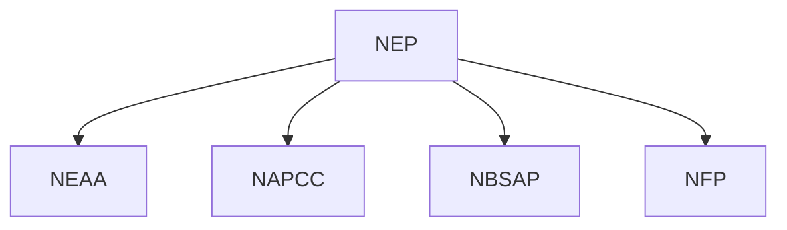
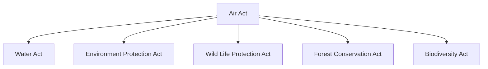
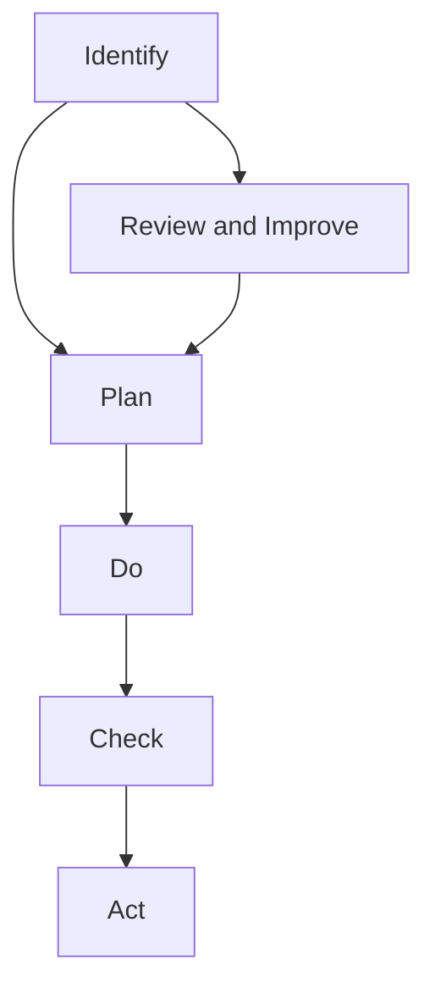
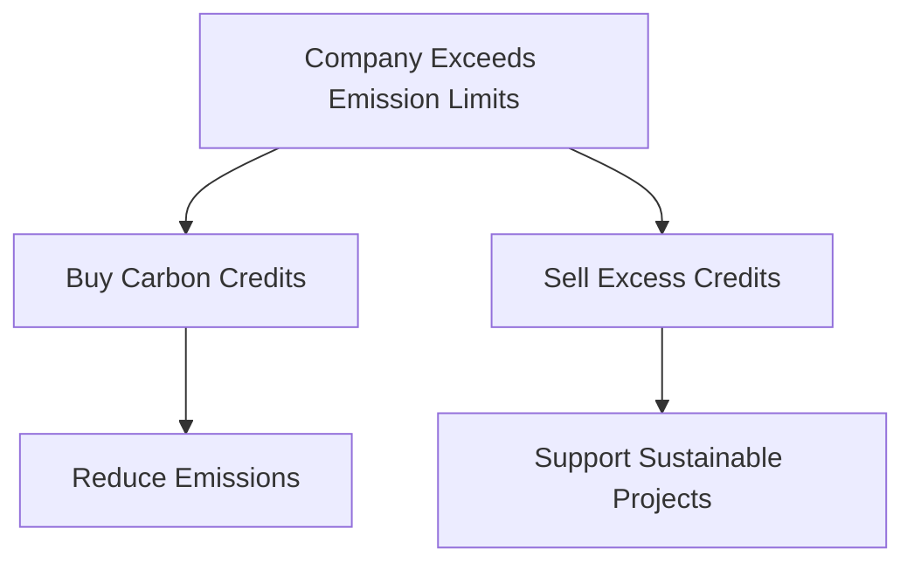
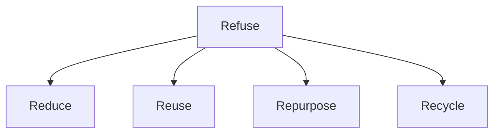
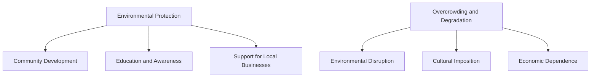

# Unit – V: Environme ntal legislation and sustainable practices 5.a Use relevant policy or law in relation with environment in

*(AI-generated self-study book for GTU, subject code 4300003 — generated locally with Ollama.)*

This module carries approximately **10 marks (5 Remember + 3 Understand + 2 Apply) (per syllabus)**.

Learning objectives covered by this module:
- 5.f. Adopt the relevant rating system for energy calculation for the given building. 5.f Explain the terms, “Cradle to cradle concept” and “Life cycle analysis” 5.g Emphasize the importance of Carbon credit system in India. 5.h Explain the importance of 5R concept.

## 5.1. Environmental Policies in India

### Introduction to Environmental Policies
Environmental policies in India are a set of legislative measures designed to protect and manage the environment. These policies are crucial for sustainable development and ensuring the health and well-being of the population. The primary objectives include pollution control, conservation of natural resources, and sustainable use of the environment.

### Major Environmental Policies
#### 1. National Environmental Policy (NEP)
- **Definition**: The National Environmental Policy (NEP) was formulated in 1983. It provides a framework for the protection and management of the environment.
- **Objectives**: 
  - Protection of the environment.
  - Conservation and sustainable use of natural resources.
  - Promotion of public awareness and participation.

#### 2. National Biodiversity Strategy and Action Plan (NBSAP)
- **Definition**: The NBSAP was launched in 2002 under the Biodiversity Act, 2002. It aims to promote the conservation and sustainable use of biological diversity.
- **Key Features**:
  - **Biodiversity Hotspots**: Identification of areas rich in biodiversity.
  - **Community Involvement**: Encouraging local communities to participate in biodiversity conservation.
  - **Socio-Economic Benefits**: Promoting the sustainable use of biodiversity for economic benefits.

#### 3. National Forest Policy (NFP)
- **Definition**: The NFP was last revised in 1994. It provides a comprehensive framework for the management and conservation of forest resources.
- **Objectives**:
  - Conservation and regeneration of forests.
  - Sustainable use of forest resources.
  - Protection of wildlife.

#### 4. National Action Plan on Climate Change (NAPCC)
- **Definition**: The NAPCC was launched in 2008. It aims to address climate change issues and promote sustainable development.
- **Key Components**:
  - **Mitigation**: Reduction in greenhouse gas emissions.
  - **Adaptation**: Measures to adapt to the impacts of climate change.
  - **Renewable Energy**: Promotion of renewable energy sources.

#### 5. National Environmental Appellate Authority (NEAA)
- **Definition**: The NEAA was established under the Environment Protection Act, 1986. It acts as an appellate body to review decisions of state pollution control boards.
- **Functions**:
  - Ensuring compliance with environmental laws.
  - Providing recommendations for environmental protection.
  - Hearing and deciding appeals related to environmental issues.

### Worked Example
> **Example:** 
Consider a scenario where a state government is planning to set up a new industrial park. The park will involve the construction of several factories, which could potentially cause pollution. 

**Step 1: Identify Relevant Policies**
- **NEP**: Provides the overall framework for environmental protection.
- **NAPCC**: Emphasizes the importance of addressing climate change.
- **NBSAP**: Ensures the conservation and sustainable use of biodiversity.

**Step 2: Compliance with Environmental Laws**
- **Environmental Impact Assessment (EIA)**: The industrial park must undergo an EIA to assess potential environmental impacts.
- **Environmental Clearance (EC)**: The project must obtain EC from the appropriate authorities before construction begins.

**Step 3: Implementation of Measures**
- **Pollution Control**: Install pollution control technologies to minimize emissions.
- **Waste Management**: Implement proper waste management systems to prevent pollution.
- **Community Participation**: Engage local communities in the decision-making process and ensure their consent.

### Mermaid Diagram

## 5.2. Air Act, Water Act, Environment Protection Act, Wild Life Protection Act, Forest Conservation Act, Biodiversity Act

### Air Act
- **Definition**: The Air (Prevention and Control of Pollution) Act, 1981, is a legislative framework to control air pollution.
- **Key Provisions**:
  - **Emission Standards**: Specifies permissible levels of pollutants.
  - **Monitoring**: Establishes monitoring and inspection mechanisms.
  - **Penalties**: Imposes penalties for non-compliance.

### Water Act
- **Definition**: The Water (Prevention and Control of Pollution) Act, 1974, aims to prevent and control water pollution.
- **Key Provisions**:
  - **Water Quality Standards**: Defines permissible levels of contaminants in water bodies.
  - **Discharge Permits**: Requires permits for discharging pollutants into water bodies.
  - **Penalties**: Imposes penalties for non-compliance.

### Environment Protection Act
- **Definition**: The Environment Protection Act, 1986, is a broad legislation covering various aspects of environmental protection.
- **Key Provisions**:
  - **Environmental Impact Assessment (EIA)**: Requires an EIA for projects that may cause environmental harm.
  - **Pollution Control Boards**: Establishes state-level pollution control boards.
  - **Public Participation**: Encourages public participation in decision-making processes.

### Wild Life Protection Act
- **Definition**: The Wild Life (Protection) Act, 1972, aims to protect and conserve wild animals and their habitats.
- **Key Provisions**:
  - **Protected Areas**: Establishes national parks and wildlife sanctuaries.
  - **Habitat Protection**: Protects critical habitats and ecosystems.
  - **Penalties**: Imposes penalties for illegal hunting and poaching.

### Forest Conservation Act
- **Definition**: The Forest Conservation Act, 1980, aims to conserve forest resources and prevent their degradation.
- **Key Provisions**:
  - **Forest Clearance**: Requires clearance for non-forest activities.
  - **Regulation of Forest Use**: Regulates the use and management of forest resources.
  - **Penalties**: Imposes penalties for unauthorized felling of trees.

### Biodiversity Act
- **Definition**: The Biodiversity Act, 2002, is a legal framework to conserve and sustainably use biological diversity.
- **Key Provisions**:
  - **Biodiversity Hotspots**: Identification and conservation of biodiversity-rich areas.
  - **Community Involvement**: Encourages community participation in biodiversity conservation.
  - **Socio-Economic Benefits**: Promotes the sustainable use of biodiversity for economic benefits.

### Worked Example
> **Example:** 
A company is planning to set up a new chemical plant in a region known for its rich biodiversity. The plant will involve the discharge of effluents into a nearby river.

**Step 1: Identify Relevant Acts**
- **Air (Prevention and Control of Pollution) Act, 1981**: For air pollution control.
- **Water (Prevention and Control of Pollution) Act, 1974**: For water pollution control.
- **Environment Protection Act, 1986**: For overall environmental impact assessment.
- **Wild Life (Protection) Act, 1972**: For protection of wildlife.
- **Forest Conservation Act, 1980**: For potential impact on forest areas.
- **Biodiversity Act, 2002**: For conservation of biodiversity.

**Step 2: Compliance with Environmental Laws**
- **EIA**: Conduct an EIA to assess potential environmental impacts.
- **Discharge Permits**: Obtain discharge permits from the pollution control board.
- **Public Participation**: Engage local communities in the decision-making process.

**Step 3: Implementation of Measures**
- **Pollution Control**: Install pollution control technologies to minimize emissions.
- **Waste Management**: Implement proper waste management systems to prevent pollution.
- **Habitat Protection**: Ensure no harm is caused to the local wildlife and ecosystems.

### Mermaid Diagram

By understanding and implementing these policies and acts, companies and individuals can ensure sustainable practices and environmental conservation.

---

## 5.3. Environmental management system: ISO 14000, definition and benefits

### Introduction to Environmental Management System (EMS)
Environmental management systems (EMS) are structured frameworks for managing environmental aspects and impacts of an organization. The ISO 14000 series of standards provides a framework for organizations to control and reduce their impact on the environment. This section will focus on the definition and benefits of ISO 14000.

### Definition of ISO 14000
**ISO 14000** is a family of international standards for environmental management. The primary standard is **ISO 14001**, which outlines the requirements for an environmental management system (EMS). ISO 14001 specifies a process for setting up, implementing, maintaining, and continually improving an EMS.

#### **Example:**
> **Example:** A manufacturing company wants to adopt an EMS to reduce its environmental impact. They can start by implementing ISO 14001, which will guide them in establishing an EMS that includes setting environmental policies, identifying and managing environmental aspects, and continually improving their environmental performance.

### Benefits of ISO 14000
The implementation of ISO 14000 can bring numerous benefits to an organization, including:

- **Legal Compliance:** Helps organizations comply with environmental laws and regulations.
- **Cost Savings:** Reduces waste, energy consumption, and resource usage, leading to cost savings.
- **Reputation:** Enhances the organization's public image and reputation.
- **Risk Management:** Helps identify and mitigate environmental risks.
- **Operational Efficiency:** Improves operational efficiency and productivity.

#### **Example:**
> **Example:** A company that implemented ISO 14001 reported a 20% reduction in energy consumption and a 15% decrease in waste generation. These savings translated into significant cost reductions, which were reflected in the company’s financial statements.

### Diagram of ISO 14000 Process

This flowchart illustrates the key steps in the ISO 14001 process, which are:

1. **Identify:** Understanding the environmental aspects and impacts of the organization.
2. **Plan:** Setting objectives, targets, and action plans.
3. **Do:** Implementing the EMS.
4. **Check:** Monitoring and measuring the EMS.
5. **Act:** Correcting and improving the EMS.
6. **Review and Improve:** Regularly reviewing and improving the EMS.

### Conclusion
ISO 14000 provides a structured approach to managing environmental aspects and impacts, leading to improved environmental performance and reduced costs. Implementing ISO 14001 can help organizations achieve legal compliance, enhance their reputation, and improve operational efficiency.

## 5.4. Rain water harvesting
Rain water harvesting (RWH) is the collection and storage of rainwater from rooftops, land surfaces, or other sources. This section will cover the definition, benefits, and methods of rain water harvesting.

### Definition of Rain Water Harvesting
**Rain water harvesting** is the process of collecting and storing rainwater for future use. It involves capturing rainwater from surfaces such as rooftops, land, and other impervious surfaces and storing it for later use. This method helps in reducing stormwater runoff, recharging groundwater, and reducing the burden on municipal water systems.

#### **Example:**
> **Example:** A residential complex in a drought-prone area installed a rain water harvesting system. They collect rainwater from the rooftops and store it in underground tanks for later use in gardening and flushing toilets. This system significantly reduced their dependence on municipal water supplies and helped in conserving water resources.

### Benefits of Rain Water Harvesting
The benefits of rain water harvesting include:

- **Water Conservation:** Reduces the demand on municipal water supplies.
- **Environmental Protection:** Helps in reducing stormwater runoff, which can cause erosion and pollution.
- **Cost Savings:** Reduces water bills and the cost of treating water.
- **Groundwater Recharge:** Replenishes groundwater resources.
- **Aesthetic and Ecological Benefits:** Enhances the beauty of the environment and supports local ecosystems.

#### **Example:**
> **Example:** An office building in a water-stressed region installed a rain water harvesting system. The system collects rainwater from the rooftop and stores it in underground tanks. The collected water is used for non-potable purposes like toilet flushing, gardening, and cleaning. This system saved the building over 30% on its water bills and helped in recharging the local groundwater.

### Methods of Rain Water Harvesting
Rain water harvesting can be implemented using various methods:

- **Rooftop Harvesting:** Collecting rainwater from rooftops using gutters and downspouts.
- **Surface Collection:** Collecting rainwater from the ground using ponds, depressions, or channels.
- **Pit Collection:** Collecting rainwater in pits or depressions in the ground.
- **Tank Storage:** Storing collected rainwater in tanks or reservoirs for later use.

#### **Example:**
> **Example:** A school in a suburban area decided to implement a rain water harvesting system. They installed gutters and downspouts to collect rainwater from the rooftops and stored it in underground tanks. The collected water is used for gardening and cleaning the school premises. This system helped the school in saving water and reducing their environmental footprint.

### Conclusion
Rain water harvesting is an effective method to conserve water, reduce the burden on municipal water systems, and protect the environment. Implementing rain water harvesting systems can lead to significant cost savings and ecological benefits.

By understanding and adopting these environmental management systems and rain water harvesting methods, organizations and individuals can contribute to sustainable development and environmental conservation.

---

## 5.5. Green building and rating system in India

Green buildings are designed, constructed, and operated in a manner that minimizes environmental impact and enhances occupant well-being. In India, the concept of green buildings has gained significant momentum due to rising awareness and government initiatives.

### 5.5.1. Introduction to Green Building
**Green building** refers to the process of creating structures and using processes that are environmentally responsible and resource-efficient throughout a building's life-cycle, from siting to design, construction, operation, maintenance, renovation, and deconstruction.

**Rating System**: The Indian Green Building Council (IGBC) developed the Green Rating for Integrated Building Environment (GRIHA) rating system. GRIHA is a comprehensive rating system that evaluates the performance of buildings based on various parameters.

### 5.5.2. GRIHA Rating System
The GRIHA rating system classifies buildings into five categories based on their overall score:
- Very Poor (0-25 points)
- Poor (26-50 points)
- Average (51-75 points)
- Good (76-100 points)
- Excellent (101+ points)

#### Components of GRIHA
- **Site Planning and Design**: Land use, site orientation, and landscaping.
- **Energy Efficiency**: Lighting, heating, cooling, and electrical systems.
- **Water Management**: Water conservation, harvesting, and reusing systems.
- **Material Use**: Sustainable materials, reusing, and reducing material usage.
- **Indoor Environmental Quality**: Lighting, ventilation, and thermal comfort.
- **Innovation and Optimization**: Beyond the standard practices, unique features.

### 5.5.3. Importance of Green Building
- **Environmental Impact**: Reduces carbon footprint and energy consumption.
- **Health and Well-being**: Enhances indoor air quality and natural lighting.
- **Cost Savings**: Lower operational costs through efficient use of resources.

### 5.5.4. Example
> **Example:** A commercial building has been designed using GRIHA criteria. The building has achieved 80 points out of 100. The key features include:
> - **Energy Efficiency**: Use of LED lighting and solar panels.
> - **Water Management**: Rainwater harvesting and efficient plumbing systems.
> - **Material Use**: Use of recycled materials and locally sourced materials.
> - **Indoor Environmental Quality**: High-quality ventilation systems and natural lighting.

### 5.6. Cradle to Cradle Concept and Life Cycle Analysis

The Cradle to Cradle (C2C) concept and Life Cycle Analysis (LCA) are integral to sustainable design and manufacturing processes.

### 5.6.1. Cradle to Cradle Concept
**Cradle to Cradle (C2C)** is a design philosophy that promotes creating systems that are restorative and regenerative by design. The term “cradle to cradle” refers to the entire lifecycle of a product, from its creation (cradle) to its end use and final disposal (cradle).

- **Cradle to Cradle Design**: Focuses on the reuse and recycling of materials, ensuring that materials do not end up as waste but are continuously cycled back into the economy.
- **Material Health**: Ensures that all materials are safe and non-toxic.
- **Technical and Biological Nutrient Cycles**: Materials are designed to either be used in technical cycles (reused and recycled) or biological cycles (degraded into natural elements).

### 5.6.2. Life Cycle Analysis (LCA)
**Life Cycle Analysis (LCA)** is a systematic approach to evaluate the environmental impacts associated with all the stages of a product's life, from raw material extraction through production, distribution, use, recycling, and disposal.

#### Steps in LCA
- **Goal and Scope Definition**: Define the boundaries of the study.
- **Inventory Analysis**: Quantify the inputs and outputs of each process.
- **Impact Assessment**: Evaluate the environmental impacts of each process.
- **Improvement Analysis**: Identify areas for improvement.

### 5.6.3. Example
> **Example:** A company wants to evaluate the environmental impact of its plastic water bottles using LCA.
> - **Goal and Scope Definition**: The study will cover the entire lifecycle from raw material extraction to disposal.
> - **Inventory Analysis**: Raw materials, energy consumption, emissions, and waste generation at each stage.
> - **Impact Assessment**: Use of greenhouse gas emissions, water usage, and energy consumption.
> - **Improvement Analysis**: Possible solutions include using biodegradable materials and improving recycling processes.

### Summary
Green buildings and the GRIHA rating system are crucial for sustainable construction in India. The Cradle to Cradle concept and Life Cycle Analysis provide a framework for designing products and systems that are restorative and regenerative. By adopting these practices, we can significantly reduce environmental impact and promote sustainable development.

---

## 5.7. Green label

### Definition and Importance
A **Green label** is a certification or rating system that assesses the environmental performance of buildings, products, or services. It evaluates the sustainability of a product or service based on its environmental impacts from manufacturing to disposal, including energy efficiency, water usage, material selection, and waste management. The primary goal of a green label is to encourage and promote sustainable practices in the construction and operation of buildings.

### Classification of Green Label Systems
Green label systems can be broadly classified into the following categories:
- **Energy Efficiency Labels**: These labels indicate the energy performance of a building or product. An example is the **Energy Star** label used in the United States.
- **Sustainability Labels**: These labels focus on the overall environmental impact of a product or service. An example is the **Energy and Environmental Design (LEED)** rating system used internationally.

### Enlist Major Green Label Systems
- **LEED (Leadership in Energy and Environmental Design)**: Developed by the U.S. Green Building Council (USGBC), LEED evaluates buildings based on multiple categories such as sustainable site selection, water efficiency, energy and atmosphere, materials and resources, and indoor environmental quality.
- **BREEAM (Building Research Establishment Environmental Assessment Method)**: Used primarily in the United Kingdom, BREEAM evaluates the environmental performance of buildings through a comprehensive assessment of design, construction, and operation.
- **DGNB (Deutsche Gesellschaft für Nachhaltiges Bauen)**: A German standard that assesses the sustainability of buildings across various dimensions including location, energy, materials, water, indoor environment, and operation.

### Example
> **Example:** 
A building is being assessed for its energy efficiency using the LEED rating system. The building scores 80 points out of 110 possible points. The certification is awarded as "Silver" because the building meets the criteria for this level. The assessment includes a detailed review of the building's energy usage, water conservation measures, and material selection.

## 5.8. Carbon credit system its advantages and disadvantages

### Definition
A **Carbon credit** is a certificate representing one ton of carbon dioxide (CO2) or an equivalent greenhouse gas (GHG) that has been reduced, avoided, or sequestered. Carbon credits are often used in carbon trading markets to offset emissions from industrial processes, transportation, and other sources.

### Explain the Carbon Credit System
The carbon credit system is a market-based mechanism designed to reduce greenhouse gas emissions by providing a financial incentive for companies to reduce their emissions. It operates on the principle of allowing the trading of emissions reductions or offsets. Companies that exceed their emission limits can buy carbon credits from companies that have reduced their emissions below their limits.

### Advantages of Carbon Credit System
- **Economic Incentive**: Companies are motivated to reduce emissions to sell excess carbon credits, generating financial benefits.
- **Flexibility**: The system allows companies to choose the most cost-effective methods to reduce emissions, whether through direct reductions or purchasing credits.
- **Global Reach**: Carbon credits can be traded internationally, enabling a global approach to combating climate change.

### Disadvantages of Carbon Credit System
- **Complexity**: The carbon credit system can be complex and difficult to implement, requiring significant expertise and resources.
- **Verification Issues**: Ensuring the accuracy and authenticity of carbon credits can be challenging, leading to potential fraud or misreporting.
- **Scope and Effectiveness**: The effectiveness of the system can be limited if not all sectors are included, and if credits are not retired properly to avoid double counting.

### Example
> **Example:** 
A manufacturing company is required to reduce its CO2 emissions by 50,000 tons. Instead of making significant changes to its operations, the company decides to buy carbon credits. It purchases 50,000 tons of carbon credits from a forestry project that has planted trees and is certified to absorb CO2. This purchase helps the company meet its emission reduction targets while supporting sustainable forestry practices.

### Flowchart of Carbon Credit System

In this flowchart, the company can either reduce emissions and sell excess credits or buy credits to offset its emissions, thereby promoting sustainable projects.

---

## 5.9. Concept of 5R(Refuse, Reduce, Reuse, Repurpose, Recycle)

### 5R Concept: Understanding and Application

The 5R concept, also known as the 5R principle, is a practical approach to waste management and sustainable resource use. It emphasizes reducing waste generation and promoting the reuse, repurposing, and recycling of materials to minimize environmental impact. Each of the 5Rs has a specific role in the circular economy and waste management strategies.

- **Refuse:** This involves refusing to use single-use products and disposable items. Refusing to purchase items that are unnecessary or that have a short lifespan can significantly reduce waste.
  
- **Reduce:** Reducing waste means minimizing the amount of waste generated by using products and services more efficiently. For example, reducing the amount of water used in a household can be achieved by fixing leaks and using water-efficient appliances.
  
- **Reuse:** Reusing items involves finding new uses for products that have already served their original purpose. For instance, old clothing can be donated to charity or repurposed into cleaning rags.
  
- **Repurpose:** Repurposing involves transforming old products into new ones. For example, an old bicycle frame can be repurposed into a garden trellis.
  
- **Recycle:** Recycling involves breaking down materials into raw materials to make new products. For example, glass bottles can be recycled into new glass bottles or jars.

> **Example:** 
>
> A local community group decides to implement the 5R concept in their neighborhood. They start by refusing single-use plastic water bottles and instead provide reusable water bottles. They then reduce water usage by fixing leaks and installing water-efficient taps. Old clothes are collected and donated to a local shelter. An old bicycle frame is repurposed into a trellis for a community garden. Finally, they set up a recycling station to recycle glass and paper products.

### Mermaid Diagram for the 5R Concept

### Importance of the 5R Concept

Implementing the 5R concept not only helps in reducing waste but also promotes sustainability and environmental conservation. By adopting these principles, individuals and communities can contribute significantly to reducing the amount of waste sent to landfills, thereby reducing greenhouse gas emissions and conserving natural resources.

## 5.10. Eco Tourism: Advantages and Disadvantages

### Eco Tourism: Definition and Context

Eco tourism, also known as ecotourism, is a form of tourism that focuses on environmental conservation, education, and sustainable development. It aims to provide visitors with an authentic experience of nature and local cultures while minimizing the negative impacts on the environment and local communities.

### Advantages of Eco Tourism

- **Environmental Protection:** Eco tourism promotes the conservation of natural resources and biodiversity. By choosing eco-friendly tours and accommodations, travelers can contribute to the protection of ecosystems and wildlife.
  
- **Community Development:** Eco tourism can provide economic benefits to local communities, helping them to develop sustainable livelihoods. This can lead to improved infrastructure, education, and healthcare services.
  
- **Education and Awareness:** Eco tourism encourages travelers to learn about the local environment and cultural heritage, promoting a deeper understanding and appreciation of nature and culture.

- **Support for Local Businesses:** Eco tourism supports small, local businesses, which often use local materials and services, thereby promoting the local economy.

### Disadvantages of Eco Tourism

- **Overcrowding and Degradation:** Increased tourist numbers can lead to overcrowding in natural areas, causing degradation of the environment and loss of natural habitats.
  
- **Cultural Imposition:** Eco tourism can sometimes lead to cultural imposition, where the local culture is commodified and changed to cater to tourists, potentially leading to the loss of traditional practices and values.
  
- **Economic Dependence:** Over-reliance on eco tourism can make local communities economically dependent, which can be problematic if the industry faces downturns or natural disasters.

- **Environmental Disruption:** Poorly managed eco tourism can result in environmental disruption, such as pollution, deforestation, and destruction of natural habitats.

### Mermaid Diagram for Eco Tourism

### Example of Applying Eco Tourism Principles

> **Example:** 
>
> A travel company is planning an eco tourism trip to a national park. They decide to adopt the following principles:
>
> - **Refuse Single-Use Plastics:** They provide reusable water bottles and containers to all participants.
>
> - **Reduce Carbon Footprint:** They use public transportation or carpooling for the trip to minimize carbon emissions.
>
> - **Reuse Local Resources:** They use local guides and accommodations to support the local community.
>
> - **Repurpose Waste:** They organize a community project to repurpose waste materials collected during the trip into useful items for the local community.
>
> - **Recycle Locally:** They set up a recycling station at the accommodation and ensure proper disposal of waste.
>
> By implementing these principles, the travel company ensures that the trip is both enjoyable and sustainable, contributing positively to the environment and the local community.
