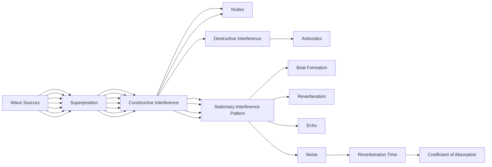

## 5.5. Superposition of Waves, Interference: Constructive and Destructive Interference, Conditions for Stationary Interference Pattern, Beat Formation

### 5.5.1 Superposition of Waves
Superposition of waves is a fundamental principle in wave theory. According to this principle, when two or more waves overlap in space and time, the resultant displacement at any point is the algebraic sum of the displacements due to each wave individually.

#### Example:
> **Example:** Consider two waves, y₁ = 3 (2π x - 4π t) and y₂ = 2 (2π x - 4π t + π/2). Find the resultant wave at any point.

**Solution:**
The resultant wave y is given by:
[ y = y_1 + y_2 = 3 \sin(2\pi x - 4\pi t) + 2 \sin(2\pi x - 4\pi t + \pi/2) ]

Using the trigonometric identity (a + b) = a b + a b:
[ y = 3 \sin(2\pi x - 4\pi t) + 2 \left( \sin(2\pi x - 4\pi t) \cos(\pi/2) + \cos(2\pi x - 4\pi t) \sin(\pi/2) \right) ]

Since (π/2) = 0 and (π/2) = 1:
[ y = 3 \sin(2\pi x - 4\pi t) + 2 \cos(2\pi x - 4\pi t) ]

This can be simplified to:
[ y = 3 \sin(2\pi x - 4\pi t) + 2 \cos(2\pi x - 4\pi t) ]

### 5.5.2 Interference: Constructive and Destructive Interference
Interference occurs when two or more waves overlap. The interference can be constructive or destructive depending on the phase difference between the waves.

- **Constructive Interference:** When the phase difference between the waves is an integer multiple of 2π, the waves reinforce each other, resulting in a resultant wave with an amplitude that is the sum of the individual amplitudes.

- **Destructive Interference:** When the phase difference between the waves is an odd multiple of π, the waves cancel each other out, resulting in a resultant wave with a reduced amplitude.

#### Example:
> **Example:** Two waves y₁ = 3 (2π x - 4π t) and y₂ = 3 (2π x - 4π t + π) interfere. Describe the nature of interference.

**Solution:**
The second wave can be rewritten as:
[ y_2 = 3 \sin(2\pi x - 4\pi t + \pi) = -3 \sin(2\pi x - 4\pi t) ]

The resultant wave y is:
[ y = y_1 + y_2 = 3 \sin(2\pi x - 4\pi t) - 3 \sin(2\pi x - 4\pi t) = 0 ]

Since the resultant wave is zero, the interference is destructive.

### 5.5.3 Conditions for Stationary Interference Pattern
A stationary interference pattern is formed when two waves of the same frequency and wavelength meet. The conditions for this are:

- The waves must have the same frequency.
- The waves must be in phase or have a constant phase difference.
- The waves must propagate in the same medium.

#### Example:
> **Example:** Two waves with the same frequency and wavelength interfere. If the distance between the two sources is 3 meters and the wavelength is 1 meter, find the number of nodes and antinodes in the interference pattern formed between the sources.

**Solution:**
The distance between the nodes and antinodes in the interference pattern is half the wavelength. Therefore, the number of nodes and antinodes can be calculated as follows:

The number of nodes (including the two sources) is given by:
[ N_{\text{nodes}} = \frac{2 \times \text{distance between sources}}{\lambda} + 1 = \frac{2 \times 3}{1} + 1 = 7 ]

The number of antinodes is one less than the number of nodes:
[ N_{\text{antinodes}} = N_{\text{nodes}} - 1 = 7 - 1 = 6 ]

### 5.5.4 Beat Formation
When two waves of slightly different frequencies interfere, the resultant wave shows a varying amplitude over time, which is called beats. The frequency of the beats is the difference between the frequencies of the two waves.

#### Example:
> **Example:** Two tuning forks produce sound waves with frequencies of 256 Hz and 254 Hz. Calculate the beat frequency.

**Solution:**
The beat frequency f_b is given by:
[ f_b = |f_1 - f_2| = |256 - 254| = 2 \, \text{Hz} ]

### 5.6. Reverberation, Reverberation Time, Echo, Noise and Coefficient of Absorption of Sound

### 5.6.1 Reverberation
Reverberation is the persistence of sound in a space after the original sound is produced. It is caused by multiple reflections of sound waves from surfaces like walls, floors, and ceilings.

#### Example:
> **Example:** A room has dimensions 10 m × 10 m × 5 m. If the speed of sound in air is 340 m/s, calculate the reverberation time in the room.

**Solution:**
The reverberation time T is given by:
[ T = \frac{0.161 V}{A} ]
where V is the volume of the room and A is the total surface area of the room.

The volume V is:
[ V = 10 \times 10 \times 5 = 500 \, \text{m}^3 ]

The total surface area A is:
[ A = 2(10 \times 10 + 10 \times 5 + 10 \times 5) = 2(100 + 50 + 50) = 300 \, \text{m}^2 ]

The reverberation time is:
[ T = \frac{0.161 \times 500}{300} = 0.2683 \, \text{s} \approx 0.27 \, \text{s} ]

### 5.6.2 Reverberation Time
Reverberation time (T) is a measure of how long sound persists in a room. It is given by the formula:
[ T = \frac{0.161 V}{A} ]
where V is the volume of the room and A is the total surface area.

#### Example:
> **Example:** A hall has a volume of 2000 m³ and a total surface area of 1000 m². Calculate the reverberation time.

**Solution:**
The reverberation time is:
[ T = \frac{0.161 \times 2000}{1000} = 0.322 \, \text{s} ]

### 5.6.3 Echo
An echo is the reflection of sound waves that produces a distinct repetition of the original sound. The minimum time interval for a person to distinguish an echo is approximately 0.1 seconds.

#### Example:
> **Example:** Calculate the minimum distance between a person and a reflecting surface to hear an echo.

**Solution:**
The minimum time interval for a person to distinguish an echo is 0.1 seconds. The minimum distance d is given by:
[ d = \frac{v \times t}{2} ]
where v is the speed of sound and t is the time interval.

The minimum distance is:
[ d = \frac{340 \times 0.1}{2} = 17 \, \text{m} ]

### 5.6.4 Noise and Coefficient of Absorption of Sound
Noise is unwanted sound that can be harmful to health. The coefficient of absorption α of a material is a measure of how much sound energy is absorbed by the material.

#### Example:
> **Example:** A room has an absorption coefficient of 0.2. If the total sound energy entering the room is 1000 J, calculate the energy absorbed by the room.

**Solution:**
The energy absorbed E is given by:
[ E = \alpha \times E_{\text{total}} ]
where α is the coefficient of absorption and Etotal is the total sound energy.

The energy absorbed is:
[ E = 0.2 \times 1000 = 200 \, \text{J} ]

