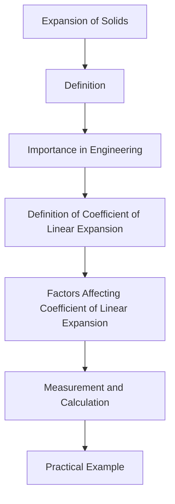

## 4.7. Expansion of Solids, Coefficient of Linear Expansion

### Definition and Importance
**Expansion of solids** refers to the increase in size of a solid body when heated. This phenomenon is crucial in various engineering applications, such as construction, material science, and thermal systems. The rate at which a solid expands when heated is quantified by the **coefficient of linear expansion**.

### Coefficient of Linear Expansion
The **coefficient of linear expansion** (α) is a measure of how much a material expands per degree increase in temperature. It is defined as the fractional increase in length per degree of temperature rise. Mathematically, it is given by:

[
\alpha = \frac{1}{L} \frac{dL}{dT}
]

where:
- L is the original length of the material,
- dL is the change in length,
- dT is the change in temperature.

The coefficient of linear expansion is typically expressed in units of K⁻¹ or ^ C⁻¹.

### Factors Affecting Coefficient of Linear Expansion
The coefficient of linear expansion depends on the material and its atomic structure. Some key factors include:
- **Material Composition**: Different materials have different coefficients of linear expansion.
- **Temperature Range**: The value of α can vary with temperature. For small temperature changes, α is approximately constant.
- **Crystal Structure**: The atomic structure of the material influences α.

### Measurement and Calculation
The coefficient of linear expansion can be determined experimentally by measuring the change in length of a material when it is heated. A typical experiment involves:
1. Measuring the initial length L₀ of a metal rod at a reference temperature T₀.
2. Heating the rod to a higher temperature T₁.
3. Measuring the new length L₁.
4. Using the formula:

[
\alpha = \frac{L_1 - L_0}{L_0 (T_1 - T_0)}
]

### Practical Example
> **Example:** A steel rod of initial length 100 cm is heated from 20°C to 100°C. The coefficient of linear expansion of steel is 12 × 10⁻⁶ ^ C⁻¹. Calculate the new length of the rod.

1. **Given Data:**
   - Initial length L₀ = 100 cm
   - Initial temperature T₀ = 20^ C
   - Final temperature T₁ = 100^ C
   - Coefficient of linear expansion α = 12 × 10⁻⁶ ^ C⁻¹

2. **Calculate the change in length:**
   [
   \Delta L = \alpha L_0 \Delta T = (12 \times 10^{-6} \, ^\circ C^{-1}) \times 100 \, \text{cm} \times (100^\circ C - 20^\circ C)
   ]
   [
   \Delta L = (12 \times 10^{-6} \, ^\circ C^{-1}) \times 100 \, \text{cm} \times 80^\circ C
   ]
   [
   \Delta L = 0.096 \, \text{cm}
   ]

3. **Calculate the new length:**
   [
   L_1 = L_0 + \Delta L = 100 \, \text{cm} + 0.096 \, \text{cm} = 100.096 \, \text{cm}
   ]

Thus, the new length of the steel rod is **100.096 cm**.

### Summary
In this section, we have discussed the expansion of solids and the coefficient of linear expansion. The coefficient of linear expansion is a measure of how much a material expands per degree of temperature increase. We have also provided a practical example to understand the calculation of the new length of a heated metal rod.

