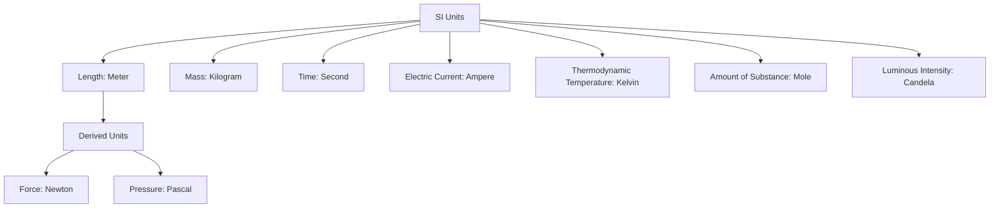

# Unit – I: Units and Measurem ents 1.a Explain Physical quantities and their units. 1.b Convert unit of a given physical quantity in one system of units into another systems of units.

*(AI-generated self-study book for GTU, subject code 4300004 — generated locally with Ollama.)*

This module carries approximately **13 marks (4 Remember + 4 Understand + 5 Apply) (per syllabus)**.

## 1.1 Measurement and units in engineering and science

### Definition of Physical Quantities and Units

A **physical quantity** is a property that can be quantitatively described or measured. Physical quantities are the fundamental elements used in the science and engineering of measurement. **Units** are the standard quantities used to express the magnitude of a physical quantity.

### Importance of Units in Engineering and Science

Consistent and accurate use of units is crucial in engineering and science for several reasons:

- **Standardization**: Units provide a common language for scientists and engineers from different regions and backgrounds.
- **Consistency**: Units ensure that measurements and calculations are consistent, allowing for reliable and reproducible results.
- **Precision and Accuracy**: Units help in expressing the precision and accuracy of measurements.

### International System of Units (SI)

The **International System of Units (SI)** is the most widely used system of measurement in the world. It consists of seven base units:

- **Length**: Meter (m)
- **Mass**: Kilogram (kg)
- **Time**: Second (s)
- **Electric Current**: Ampere (A)
- **Thermodynamic Temperature**: Kelvin (K)
- **Amount of Substance**: Mole (mol)
- **Luminous Intensity**: Candela (cd)

### Derived Units

Derived units are combinations of base units. For example, the **unit of force**, **Newton (N)**, is derived from the base units of mass, length, and time:

[ \text{1 N} = \text{1 kg} \cdot \text{m/s}^2 ]

### Common Systems of Units

Besides the SI system, other commonly used systems include:

- **British Imperial System**: Still used in some countries for certain measurements.
- **U.S. Customary System**: Used in the United States for everyday measurements.

### Conversion Between Systems

Converting units from one system to another is essential in interdisciplinary work. For example, converting between meters (SI) and feet (British Imperial):

[ 1 \, \text{m} = 3.28084 \, \text{ft} ]

### Example

> **Example:** Convert 150 meters to feet.

1. **Identify the conversion factor**: 1 meter = 3.28084 feet.
2. **Set up the conversion**:
   [ 150 \, \text{m} \times 3.28084 \, \text{ft/m} = 492.126 \, \text{ft} ]
3. **Final answer**: 150 meters is approximately 492.13 feet.

### Mermaid Diagram for Units and Systems

This diagram illustrates the base units of the SI system and their derived units.

### Summary

Understanding and correctly using units is fundamental in engineering and science. The International System of Units (SI) provides a standardized framework for measurements, ensuring consistency and accuracy. Converting between different systems of units, such as meters to feet, is a critical skill in interdisciplinary work.

### Review

- **Define** the term **physical quantity** and explain its importance.
- **Classify** the SI base units.
- **Apply** the conversion factor to convert 150 meters to feet.

---

## 1.2. Physical quantities; fundamental and derived quantities

### Introduction to Physical Quantities
Physical quantities are measurable attributes of matter and energy. They can be classified into two main categories: fundamental quantities and derived quantities.

### Fundamental Quantities
**Definition:** Fundamental quantities are those quantities that cannot be defined in terms of other quantities. They are the basic building blocks from which other quantities can be derived. The seven fundamental quantities in the International System of Units (SI) are:

- **Length (L):** The base unit is the meter (m).
- **Mass (M):** The base unit is the kilogram (kg).
- **Time (T):** The base unit is the second (s).
- **Electric current (I):** The base unit is the ampere (A).
- **Temperature (Θ):** The base unit is the kelvin (K).
- **Amount of substance (N):** The base unit is the mole (mol).
- **Luminous intensity (J):** The base unit is the candela (cd).

### Derived Quantities
**Definition:** Derived quantities are physical quantities that can be expressed in terms of the fundamental quantities. Common examples include:

- **Area (A):** Derived from length (m²).
- **Volume (V):** Derived from length (m³).
- **Density (ρ):** Derived from mass and volume (kg/m³).
- **Force (F):** Derived from mass and acceleration (N = kg·m/s²).
- **Pressure (P):** Derived from force and area (N/m² or Pa).
- **Energy (E):** Derived from mass, length, and time (J = kg·m²/s²).

### Example
> **Example:** Given a mass of 2 kg and an acceleration due to gravity of 9.8 m/s², calculate the force acting on the object.
>
> **Solution:** The force F can be calculated using the formula F = m · a, where m is mass and a is acceleration.
>
> [
> F = 2 \, \text{kg} \times 9.8 \, \text{m/s}^2 = 19.6 \, \text{N}
]

### Conversion of Units
To convert the units of a given physical quantity from one system to another, it is necessary to understand the relationships between the units of the different systems. For instance, converting from the metric system to the imperial system, or from the SI system to the CGS system.

### Example
> **Example:** Convert 5000 meters to kilometers.
>
> **Solution:** Since 1 kilometer (km) is equal to 1000 meters (m), the conversion can be done as follows:
>
> [
> 5000 \, \text{m} = \frac{5000 \, \text{m}}{1000} = 5 \, \text{km}
]

### Example
> **Example:** Convert 2 kg·m/s² to N·s/m.
>
> **Solution:** The unit of force N (newton) is defined as kg·m/s². Therefore, the conversion is straightforward:
>
> [
> 2 \, \text{kg·m/s}^2 = 2 \, \text{N}
]
Since the unit of time s is the same in both units, the conversion is:
>
> [
> 2 \, \text{N·s/m} = 2 \, \text{N·s/m}
]

### Summary
In this section, we have defined and explained physical quantities, focusing on the distinction between fundamental and derived quantities. We have also provided examples to demonstrate the practical application of these concepts and the process of unit conversion. Understanding these fundamentals is crucial for solving problems in physics and engineering.

---

## 1.3. Systems of units: CGS, MKS and SI, definition of units (only for information and not to be asked in examination), interconversion of units MKS to CGS and vice versa, Requirements of standard unit

### 1.3.1. Introduction to Systems of Units

In the field of engineering, the choice of a system of units is crucial. The three most commonly used systems are the CGS (Centimeter-Gram-Second), MKS (Meter-Kilogram-Second), and SI (International System of Units). These systems differ in their base units, which are the fundamental units used to define other units.

### 1.3.2. Definition of Units (Informational Only)

- **CGS System**: This system uses the centimeter (cm) as the unit of length, the gram (g) as the unit of mass, and the second (s) as the unit of time.
- **MKS System**: This system uses the meter (m) as the unit of length, the kilogram (kg) as the unit of mass, and the second (s) as the unit of time.
- **SI System**: This is the most widely used system today. It includes the meter (m) as the unit of length, the kilogram (kg) as the unit of mass, the second (s) as the unit of time, and many other derived units.

### 1.3.3. Interconversion of Units: MKS to CGS and Vice Versa

#### 1.33.1. Conversion from MKS to CGS

To convert from MKS to CGS, we need to know the following conversion factors:
- 1 meter (m) = 100 centimeters (cm)
- 1 kilogram (kg) = 1000 grams (g)

**Example:**
> **Example:** Convert 5 meters to centimeters.
>
> To convert 5 meters to centimeters, we use the conversion factor 1 meter = 100 centimeters.
>
> [ 5 \text{ m} \times 100 \text{ cm/m} = 500 \text{ cm} ]

#### 1.33.2. Conversion from CGS to MKS

To convert from CGS to MKS, we use the inverse of the above factors:
- 1 centimeter (cm) = 0.01 meters (m)
- 1 gram (g) = 0.001 kilograms (kg)

**Example:**
> **Example:** Convert 1000 grams to kilograms.
>
> To convert 1000 grams to kilograms, we use the conversion factor 1 gram = 0.001 kilograms.
>
> [ 1000 \text{ g} \times 0.001 \text{ kg/g} = 1 \text{ kg} ]

### 1.3.4. Requirements of Standard Unit

A standard unit must meet the following requirements:
- **Uniqueness**: Each physical quantity should have a unique unit.
- **Simplicity**: Units should be easy to use and understand.
- **Precision**: Units should allow for precise measurements.
- **Consistency**: Units should be consistent across different systems.
- **Reproducibility**: Units should be reproducible and universally accepted.

### 1.3.5. Example of Interconversion

**Example:**
> **Example:** Convert 2 meters per second (m/s) to centimeters per second (cm/s).
>
> To convert 2 meters per second to centimeters per second, we use the conversion factor 1 meter = 100 centimeters.
>
> [ 2 \text{ m/s} \times 100 \text{ cm/m} = 200 \text{ cm/s} ]

### 1.3.6. Summary

In summary, the choice of a system of units is critical in engineering and scientific calculations. Understanding how to convert between different systems, such as MKS to CGS and vice versa, is essential. The requirements for a standard unit ensure that units are unique, simple, precise, consistent, and reproducible. This knowledge will help you in solving problems involving different units and systems of measurement.

---

## 1.4. Vernier Caliper, Micrometer Screw Gauge

### 1.4.1 Vernier Caliper

**Vernier caliper** is a precision measuring tool used to measure internal and external dimensions, depth, and length of an object. It consists of a main scale and a vernier scale. The main scale is calibrated in millimeters, and the vernier scale has 10 or 20 divisions that correspond to 9 or 19 main scale divisions, respectively, allowing for more precise measurements.

**How Vernier Caliper Works:**
- The main scale is usually marked in millimeters (mm) and sometimes in smaller units like tenths of a millimeter (0.1 mm).
- The vernier scale is calibrated to provide a more accurate reading by aligning one division of the vernier scale with 9 or 19 divisions of the main scale.
- The difference between these divisions gives the least count (LC) of the vernier caliper. For a 20-division vernier scale, the LC is 0.05 mm, and for a 10-division vernier scale, the LC is 0.02 mm.

**Reading a Vernier Caliper:**
- First, measure the object using the main scale.
- Align the zero of the vernier scale with the main scale and read the closest main scale division.
- Look for the vernier scale division that aligns exactly with a main scale division. This gives the fractional part of the measurement.
- The total reading is the sum of the main scale reading and the vernier scale reading.

**Example:**
> **Example:** A vernier caliper with a 20-division vernier scale is used to measure the internal diameter of a pipe. The main scale reading is 12 mm, and the 13th vernier scale division aligns with a main scale division. Calculate the total reading.

- Main scale reading = 12 mm
- Vernier scale reading = 13 × 0.05 mm = 0.65 mm
- Total reading = 12 mm + 0.65 mm = 12.65 mm

### 1.4.2 Micrometer Screw Gauge

**Micrometer screw gauge** is a high-precision measuring instrument used to measure very small lengths, typically in the range of 0.01 mm to 10 mm. It consists of a screw with a linear scale and a thimble with a circular scale.

**How Micrometer Screw Gauge Works:**
- The screw has a pitch, which is the distance it moves in one complete rotation.
- The thimble has 50 or 100 divisions that correspond to the screw's pitch.
- The barrel scale is marked in millimeters, and the circular scale provides finer divisions for accurate readings.

**Reading a Micrometer Screw Gauge:**
- Align the screw so that the anvil is just touching the object.
- Read the main scale (barrel scale) and the thimble scale.
- Each division on the thimble scale corresponds to 0.01 mm or 0.001 mm, depending on the micrometer.
- The total reading is the sum of the main scale reading and the thimble scale reading.

**Example:**
> **Example:** A micrometer screw gauge with a 50-division thimble scale is used to measure the thickness of a thin metal sheet. The main scale reading is 3 mm, and the 28th thimble scale division aligns with the barrel scale. Calculate the total reading.

- Main scale reading = 3 mm
- Vernier scale reading = 28 × 0.02 mm = 0.56 mm
- Total reading = 3 mm + 0.56 mm = 3.56 mm

### Summary

- **Vernier Caliper** is used for measuring internal and external dimensions with a least count of 0.02 mm or 0.05 mm.
- **Micrometer Screw Gauge** is used for measuring very small lengths with a least count of 0.01 mm or 0.001 mm.

These tools are essential in various engineering applications where precision measurements are required.

---

## 1.5. Accuracy, precision and error, estimation of errors - absolute error, relative error and percentage error, error propagation, significant figures

### 1.5.1 Accuracy and Precision
Accuracy and precision are two fundamental concepts in measurements. **Accuracy** refers to how close a measured value is to the true or accepted value. **Precision**, on the other hand, refers to the degree of agreement among several measurements of the same quantity. For example, if you measure the length of a table multiple times and get values that are very close to each other, the measurements are precise. However, if the measurements are close to the true length, they are also accurate.

### 1.5.2 Estimation of Errors
Errors in measurements can arise due to various factors such as instrument limitations, environmental conditions, and human mistakes. The estimation of errors is crucial to understand the reliability of the measurements.

#### 1.5.2.1 Absolute Error
The **absolute error** is the magnitude of the difference between the measured value and the true value. It is given by:
[ \text{Absolute Error} = | \text{Measured Value} - \text{True Value} | ]

#### 1.5.2.2 Relative Error
The **relative error** is the absolute error divided by the true value. It provides a measure of the error in terms of the true value. It is expressed as a fraction or a percentage:
[ \text{Relative Error} = \frac{\text{Absolute Error}}{\text{True Value}} ]

#### 1.5.2.3 Percentage Error
The **percentage error** is the relative error expressed as a percentage. It is calculated as:
[ \text{Percentage Error} = \left( \frac{\text{Absolute Error}}{\text{True Value}} \right) \times 100\% ]

### 1.5.3 Error Propagation
Error propagation refers to the way errors in the input quantities affect the output quantity. For example, if you are calculating the area of a rectangle, the error in the length and the width will affect the error in the area. The formula for error propagation in multiplication or division is given by:
[ \frac{\Delta z}{z} = \sqrt{\left( \frac{\Delta x}{x} \right)^2 + \left( \frac{\Delta y}{y} \right)^2} ]
where z = xy, Δ z is the error in z, and Δ x and Δ y are the errors in x and y, respectively.

### 1.5.4 Significant Figures
Significant figures are used to indicate the reliability of a measurement. The number of significant figures in a measurement is the number of digits that are known with certainty plus one digit that is estimated. For example, if a measurement is 12.34 meters, it has four significant figures.

#### 1.5.4.1 Rules for Determining Significant Figures
1. **Non-zero digits are always significant.**
2. **Zeros between non-zero digits are significant.**
3. **Leading zeros are not significant.**
4. **Trailing zeros in a number containing a decimal point are significant.**
5. **Trailing zeros in a number without a decimal point are not significant unless otherwise indicated.**

### 1.5.5 Example

> **Example:**  
> Consider a length measurement of 12.34 meters and the true length is 12.35 meters.  
> 
> - **Absolute Error:**  
> [ \text{Absolute Error} = |12.34 - 12.35| = 0.01 \text{ meters} ]  
> 
> - **Relative Error:**  
> [ \text{Relative Error} = \frac{0.01}{12.35} \approx 0.000809 ]  
> 
> - **Percentage Error:**  
> [ \text{Percentage Error} = \left( \frac{0.01}{12.35} \right) \times 100\% \approx 0.000809 \times 100\% = 0.0809\% ]  
> 
> - **Error Propagation:**  
> If the length is used in the calculation of the area of a square with the same length, the area would be:  
> [ \text{Area} = (12.34 \text{ m})^2 = 152.2756 \text{ m}^2 ]  
> The error in the area can be calculated using the error propagation formula:  
> [ \frac{\Delta A}{A} = \sqrt{\left( \frac{\Delta l}{l} \right)^2} = \sqrt{\left( \frac{0.01}{12.35} \right)^2} = \sqrt{0.000809^2} \approx 0.000809 ]  
> The absolute error in the area would be:  
> [ \Delta A = A \times \text{Relative Error} = 152.2756 \times 0.000809 \approx 0.123 \text{ m}^2 ]  
> 
> - **Significant Figures:**  
> The length 12.34 meters has four significant figures. If this value is used in calculations, the result should be reported with the same number of significant figures, unless otherwise specified.

This example demonstrates the calculation of absolute and relative errors, percentage errors, and error propagation, as well as the use of significant figures in reporting measurements.
